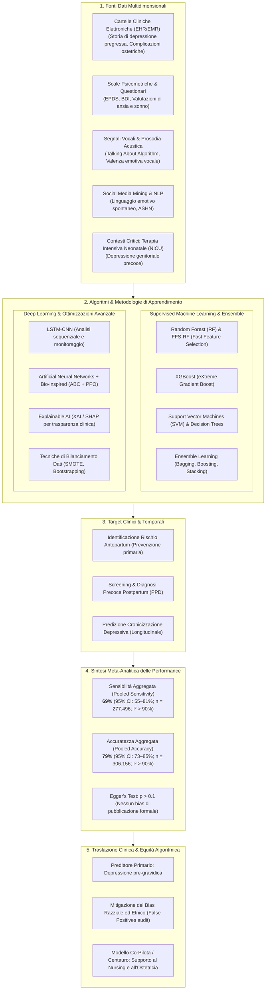
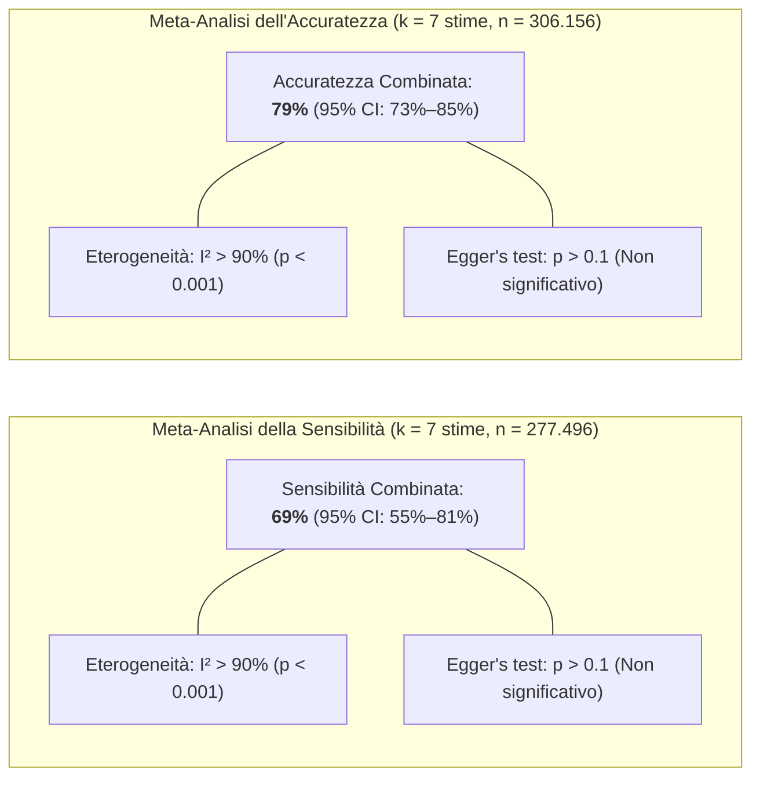
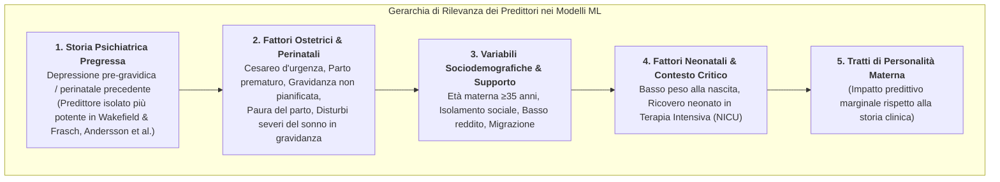

# Artificial Intelligence in the Prevention and Early Detection of Postpartum Depression: A Systematic Review and Meta-Analysis (Ruger-Navarrete et al., 2026)

## Definizione Operativa
- Revisione sistematica e meta-analisi condotta secondo le linee guida **PRISMA 2020** e registrata su **PROSPERO (CRD420251004175)** da Azahara Ruger-Navarrete et al. (*University of Granada, Virgen del Rocío University Hospital, University of Huelva, Hospital Universitari Germans Trias i Pujol*; pubblicata su *Frontiers in Psychiatry*, gennaio 2026, doi: 10.3389/fpsyt.2025.1734102).
- **Inquadramento dello Studio:** Esamina 16 studi empirici peer-reviewed (2020–2025) selezionati da *Scopus*, *PubMed*, *Web of Science* e *CINAHL* (da un pool iniziale di 1.857 record) per valutare l'efficacia, le architetture algoritmiche, le fonti di dati e le sfide etico-cliniche dell'Intelligenza Artificiale (Machine Learning, Deep Learning, NLP, analisi vocale) nella prevenzione e identificazione precoce della **depressione postpartum (PPD)** e dello spettro depressivo perinatale.
- **Utilità Clinica e Spettro Perinatale:** Ridefinisce la depressione postpartum all'interno del continuum della **depressione perinatale/peripartum**, evidenziando che circa il **50% degli episodi depressivi postpartum ha esordio durante la gravidanza (antepartum)**. L'IA permette di superare i limiti dei questionari retrospettivi isolati integrando cartelle cliniche elettroniche (EHR/EMR), dati ostetrici, biosensori vocali, social media e scale psicometriche (EPDS), abilitando la stratificazione precoce del rischio, l'audit del bias algoritmico e l'integrazione di sistemi di supporto alle decisioni cliniche (CDSS) guidati da personale ostetrico e infermieristico.

---

## Evidenze dalla Letteratura e Risultati Meta-Analitici

### 1. Metodologia di Selezione PRISMA e Caratteristiche del Campione
- **Processo di Selezione:** Da 1.857 record grezzi estratti (Scopus $n=1.457$, PubMed $n=72$, WOS $n=205$, CINAHL $n=121$), dopo deduplicazione ($n=1.622$) e screening per criteri di inclusione (studi originali su umani 2020–2025 in inglese/spagnolo), 16 studi sono stati inclusi nella sintesi qualitativa e meta-analitica.
- **Disegni di Studio Inclusi:**
  - 6 studi di coorte retrospettiva;
  - 4 studi di coorte prospettica;
  - 4 studi trasversali (cross-sectional);
  - 1 studio di coorte longitudinale;
  - 1 studio osservazionale comparativo.
- **Distribuzione Geografica:** Stati Uniti ($n=6$), India ($n=3$), Svezia ($n=2$), Indonesia ($n=1$), Giappone ($n=1$), Cina ($n=1$), Australia ($n=1$), Italia ($n=1$).
- **Valutazione della Qualità Metodologica (JBI):** Tutti gli studi hanno raggiunto o superato la soglia minima di validità metodologica (punteggio JBI $\ge 6$). Punteggi massimi (11/11 o 8/8) sono stati ottenuti da studi con ampie coorti cliniche (es. Andersson et al., 2021; Park et al., 2021; Matsumura et al., 2025; Liu et al., 2024; Wakefield & Frasch, 2023).

---

### 2. Sintesi Sinottica dei 16 Studi Inclusi

| Autore / Anno | Paese | Disegno & Campione | Approccio IA / Algoritmi | Input & Fonti Dati | Risultati Chiave & Metriche |
| :--- | :--- | :--- | :--- | :--- | :--- |
| **Fazraningtyas et al. (2025)** | Indonesia | Cross-sectional ($n=6/8$ JBI) | Ensemble Learning | Dati sociodemografici, parità, storia depressiva, paura del parto | Miglioramento della diagnosi precoce combinando fattori ostetrici e psicologici. |
| **Gopalakrishnan et al. (2023)** | India | Coorte retrospettiva ($n=8/11$ JBI) | Attribute Selection Hybrid Network (ASHN) | Post su Social Media (NLP) | Riconoscimento precoce di pattern linguistici ed emozionali associati a PPD. |
| **Sadjadpour et al. (2024)** | USA | Osservazionale comparativo ($n=8/8$ JBI) | Machine Learning supervisionato | Screening genitori in Terapia Intensiva Neonatale (NICU) | Efficacia equivalente o superiore allo screening convenzionale in terapia intensiva neonatale (Acc: 66%, Sens: 73%). |
| **Park et al. (2021)** | USA | Osservazionale retrospettivo ($n=11/11$ JBI) | Modelli predittivi ML e metodi anti-bias | Cartelle cliniche elettroniche (EHR) | Identificazione e correzione dei bias razziali ed etnici negli algoritmi di predizione PPD. |
| **Matsumura et al. (2025)** | Giappone | Coorte longitudinale (JECS, $n=11/11$ JBI) | Decision Trees (Alberi decisionali) | Japan Environment and Children’s Study + EPDS | Modello parsimonioso e interpretabile per predire la cronicizzazione della PPD. |
| **Srivatsav & Nanthini (2024)** | India | Cross-sectional ($n=8/8$ JBI) | Deep Learning LSTM-CNN | Segnali sequenziali e risposte cliniche | Accuratezza significativamente superiore alla regressione logistica classica; filtraggio del rumore. |
| **Shivaprasad et al. (2024)** | India | Cross-sectional ($n=8/8$ JBI) | Explainable AI (XAI) | Questionari clinici e fattori di rischio | Elevata accuratezza e piena trasparenza per il supporto decisionale medico. |
| **Zhang et al. (2020)** | Cina | Coorte prospettica ($n=9/11$ JBI) | Fast Feature Selection + Random Forest (FFS-RF) e SVM | Dati clinici e psicometrici di coorte | Riduzione del numero di variabili senza perdita di accuratezza; controllo dell'overfitting su piccoli campioni (Sens: 69%). |
| **Shin et al. (2020)** | USA | Coorte retrospettiva ($n=9/11$ JBI) | Machine Learning con SMOTE e bilanciamento dati | Dati clinici retrospettivi | Le tecniche di over-sampling e riduzione del disequilibrio di classe incrementano la validità predittiva. |
| **Tang et al. (2024)** | Svezia | Osservazionale retrospettivo ($n=6/11$ JBI) | Rete Neurale Artificiale + Artificial Bee Colony (ABC) + PPO | Dati complessi in popolazioni ad alto rischio | Risoluzione del disequilibrio nei dataset e abbattimento dei bias diagnostici. |
| **Fanos et al. (2023)** | Italia | Cross-sectional ($n=6/8$ JBI) | 'Talking About' Algorithm (Analisi Vocale) | Registrazioni vocali acustiche (valenza emotiva) | Screening oggettivo indipendente dalla compilazione di questionari e dal bias di desiderabilità sociale. |
| **Wakefield & Frasch (2023)** | USA | Coorte retrospettiva ($n=11/11$ JBI) | Machine Learning su EMR antepartum | Dati di cartella clinica elettronica antepartum | Predizione della necessità di trattamento postpartum; il fattore predittivo primario è la depressione pre-gravidanza. |
| **Andersson et al. (2021)** | Svezia | Coorte prospettica ($n=11/11$ JBI) | Confronto modelli ML multivariati | Tratti di personalità, storia clinica, sociodemografia | La storia clinica e la sociodemografia superano nettamente i tratti di personalità nella predizione (Acc: 75%, Sens: 72%). |
| **Gopalakrishnan et al. (2022)** | Australia | Coorte prospettica ($n=11/11$ JBI) | Machine Learning supervisionato | Questionari psicometrici, sociodemografia, peso del neonato | Ottimizzazione della predizione precoce combinando variabili materne e neonatali. |
| **Y. Liu et al. (2024)** | USA | Osservazionale retrospettivo ($n=11/11$ JBI) | ML per implementazione ospedaliera (Bedside) | Tre set di cartelle cliniche elettroniche ospedaliere | Rilevazione del bias razziale (falsi positivi); ottimizzazione senza variabile razza per implementazione clinica equa. |
| **Trifan et al. (2020)** | USA | Cross-sectional retrospettivo ($n=7/8$ JBI) | NLP e Social Media Mining | Post su forum e social network | Rimozione del rumore semantico ed estrazione di sintomi specifici di PPD nel testo libero. |

---

### 3. Risultati Quantitativi della Meta-Analisi

- **Sensibilità Meta-Analitica (Pooled Sensitivity):**
  - Stima combinata (Random-Effects Model): **69%** (95% CI: 55%–81%; $n = 277.496$).
  - Valori individuali degli studi inclusi nel forest plot:
    - Nakamura et al. (2024): 80% (95% CI: 78–82%)
    - Amit et al. (2021): 76% (95% CI: 76–76%)
    - Gopalakrishnan et al. (2023): 73% (95% CI: 68–78%)
    - Sadjadpour et al. (2024): 73% (95% CI: 67–78%)
    - Andersson et al. (2021): 72% (95% CI: 71–73%)
    - Zhang et al. (2020): 69% (95% CI: 65–73%)
    - Hochman et al. (2021): 35% (95% CI: 34–36%)
- **Accuratezza Meta-Analitica (Pooled Accuracy):**
  - Stima combinata (Random-Effects Model): **79%** (95% CI: 73%–85%; $n = 306.156$).
  - Valori individuali degli studi inclusi nel forest plot:
    - Clapp et al. (2025): 90% (95% CI: 90–90%)
    - Hochman et al. (2021): 90% (95% CI: 89–91%)
    - Amit et al. (2021): 80% (95% CI: 80–80%)
    - Gopalakrishnan et al. (2023): 78% (95% CI: 73–82%)
    - Andersson et al. (2021): 75% (95% CI: 74–76%)
    - Nakamura et al. (2024): 71% (95% CI: 69–73%)
    - Sadjadpour et al. (2024): 66% (95% CI: 60–71%)
- **Eterogeneità e Bias:**
  - L'eterogeneità statistica è risultata elevata ($I^2 > 90\%$) in entrambe le meta-analisi, dovuta all'ampia variabilità nei cut-off delle scale (es. EPDS $\ge 10$ vs $\ge 13$), nelle fonti di dati (EHR vs questionari vs voce vs social media) e negli algoritmi impiegati.
  - Il test di regressione lineare di Egger non è risultato statisticamente significativo ($p > 0.1$), escludendo asimmetrie formali nel funnel plot; tuttavia, gli autori evidenziano un potenziale publication bias qualitativo per l'assenza di studi con esiti nulli o negativi.

---

### 4. Determinanti Clinico-Predittivi e Fattori di Rischio Isolati dai Modelli

1. **Depressione Precedente come Predittore Sovrano:** Sia gli studi basati su EHR (Wakefield & Frasch, 2023; Liu et al., 2024) sia quelli prospettici (Andersson et al., 2021) confermano che la presenza di episodi depressivi prima della gravidanza rappresenta la singola variabile con il peso predittivo più alto.
2. **Fattori Ostetrici Critici:** Gli eventi perinatali acuti (parto cesareo in emergenza, prematurità, grave fobia del parto o *tocofobia*) incrementano marcatamente la vulnerabilità materna e fungono da nodi chiave negli alberi di decisione.
3. **Depressione nei Reparti NICU:** Sadjadpour et al. (2024) dimostrano che i modelli ML possono identificare precocemente il disagio emotivo non solo delle madri ma di entrambi i genitori i cui neonati sono ricoverati in terapia intensiva, aprendo la strada a interventi preventivi tempestivi sul legame di attaccamento.
4. **Biomarker Vocali e Linguistici:** L'algoritmo 'Talking About' (Fanos et al., 2023) evidenzia che l'analisi acustica del parlato materno è in grado di cogliere pattern affettivi negativi subclinici prima che si riflettano nei punteggi EPDS.

---

### 5. Sfide Metodologiche, Bias Razziale e Implementazione Ospedaliera

- **Disparità Algoritmica e Bias Razziale:** Gli studi di Park et al. (2021) e Liu et al. (2024) mettono in luce un rischio critico: i modelli addestrati su cartelle elettroniche senza aggiustamenti specifici generano un tasso sproporzionato di falsi positivi nelle minoranze etnico-razziali. Liu et al. (2024) dimostrano che la rimozione della variabile razza esplicita e la ri-calibrazione delle variabili socioeconomiche riducono il bias senza compromettere la capacità discriminativa complessiva del modello.
- **Sbilanciamento di Classe (Class Imbalance):** Poiché la prevalenza della PPD varia tra il 10% e il 20%, i dataset presentano forte sbilanciamento. L'uso di tecniche di over-sampling come SMOTE (*Synthetic Minority Over-sampling Technique*) e di ottimizzazioni avanzate (Tang et al., 2024; Shin et al., 2020) è essenziale per prevenire la cecità algoritmica verso i casi positivi.
- **Implementazione Ospedaliera (Bedside Implementation):** La transizione dai modelli accademici al letto del paziente richiede:
  - Architetture di Explainable AI (XAI) che forniscano spiegazioni comprensibili alle ostetriche e ai medici (Shivaprasad et al., 2024);
  - Interoperabilità con i sistemi informativi sanitari ospedalieri (EHR/EMR);
  - Formazione mirata del personale sanitario per prevenire il rifiuto tecnologico o l'eccessiva delega passiva.

---

## Implicazioni per la Salute Perinatale e la Psicoterapia

1. **Spostamento dell'Asse di Intervento: Dal Postpartum all'Antepartum:** Dato che circa la metà delle depressioni peripartum insorge durante i trimestri di gravidanza, i modelli predittivi ML devono essere integrati fin dalle prime visite ostetriche per avviare percorsi di psicoeducazione, monitoraggio strutturato e supporto psicologico preventivo prima del parto.
2. **Screening Multimodale Integrato:** Superamento dell'affidamento esclusivo alla compilazione cartacea dell'EPDS, affiancando algoritmi che estraggono automaticamente indicatori di rischio dalla storia clinica elettronica e segnali precoci da app mobili o biomarker vocali.
3. **Tutela dell'Alleanza Terapeutica e Modello Centauro:** L'IA non sostituisce il giudizio clinico né la relazione umana con l'ostetrica, l'infermiere o lo psicoterapeuta. Deve operare come un sistema di allerta precoce e supporto decisionale che libera tempo clinico da dedicare all'ascolto empatico e alla cura del legame madre-bambino.
4. **Equità e Giustizia Algoritmica:** Necessità di protocolli standardizzati di audit periodico degli algoritmi predittivi per prevenire la discriminazione e garantire pari accuratezza in tutte le sottopopolazioni socio-demografiche.

---

## Riferimenti Bibliografici
- Ruger-Navarrete, A., Gómez-Ferrera, M., Mérida-Yáñez, B., Vázquez-Lara, J. M., Gómez-Salgado, J., García-Oliva, S., Vázquez-Lara, M. D., Rodríguez-Diaz, L., Antúnez-Calvente, I., & Fernández-Carrasco, F. J. (2026). Artificial intelligence in the prevention and early detection of postpartum depression: a systematic review and meta-analysis. *Frontiers in Psychiatry*, 16, 1734102. https://doi.org/10.3389/fpsyt.2025.1734102
- Andersson, S., Bathula, D. R., Iliadis, S. I., Walter, M., & Skalkidou, A. (2021). Predicting women with depressive symptoms postpartum with machine learning methods. *Scientific Reports*, 11, 7877. https://doi.org/10.1038/s41598-021-86368-y
- Fanos, V., Dessì, A., Deledda, L., Lai, A., Ranzi, P., Avellino, I., et al. (2023). Postpartum depression screening through artificial intelligence: preliminary data through the Talking About algorithm. *Journal of Pediatric and Neonatal Individualized Medicine*, 12(1), 1–11. https://doi.org/10.7363/120222
- Fazraningtyas, W. A., Rahmatullah, B., Naparin, H., Basit, M., & Razak, N. A. (2025). A predictive model for postpartum depression: ensemble learning strategies in machine learning. *Indonesian Journal of Electrical Engineering and Computer Science*, 37, 443–451. https://doi.org/10.11591/ijeecs.v37.i1.pp443-451
- Gopalakrishnan, A., Venkataraman, R., Gururajan, R., Zhou, X., & Zhu, G. (2022). Predicting women with postpartum depression symptoms using machine learning techniques. *Mathematics*, 10, 4570. https://doi.org/10.3390/math10234570
- Gopalakrishnan, A., Gururajan, R., Venkataraman, R., Zhou, X., Ching, K. C., Saravanan, A., et al. (2023). Attribute Selection Hybrid Network Model for risk factors analysis of postpartum depression using Social media. *Brain Informatics*, 10(1), 28. https://doi.org/10.1186/s40708-023-00206-7
- Liu, Y., Joly, R., Reading Turchioe, M., Benda, N., Hermann, A., Beecy, A., et al. (2024). Preparing for the bedside - optimizing a postpartum depression risk prediction model for clinical implementation in a health system. *Journal of the American Medical Informatics Association*, 31, 1258–1267. https://doi.org/10.1093/jamia/ocae056
- Matsumura, K., Hamazaki, K., Kasamatsu, H., Tsuchida, A., Inadera, H., & JECS Group. (2025). Decision tree learning for predicting chronic postpartum depression in the Japan Environment and Children’s Study. *Journal of Affective Disorders*, 369, 643–652. https://doi.org/10.1016/j.jad.2024.10.034
- Park, Y., Hu, J., Singh, M., Sylla, I., Dankwa-Mullan, I., Koski, E., et al. (2021). Comparison of methods to reduce bias from clinical prediction models of postpartum depression. *JAMA Network Open*, 4(4), e213909. https://doi.org/10.1001/jamanetworkopen.2021.3909
- Sadjadpour, F., Hosseinichimeh, N., Abedi, V., & Soghier, L. M. (2024). Comparative analysis of machine learning versus traditional method for early detection of parental depression symptoms in the NICU. *Frontiers in Public Health*, 12, 1380034. https://doi.org/10.3389/fpubh.2024.1380034
- Shin, D., Lee, K. J., Adeluwa, T., & Hur, J. (2020). Machine learning-based predictive modeling of postpartum depression. *Journal of Clinical Medicine*, 9(9), 2899. https://doi.org/10.3390/jcm9092899
- Shivaprasad, S., Chadaga, K., Sampathila, N., Prabhu, S., Chadaga, P. R., & K, S. (2024). Explainable machine learning methods to predict postpartum depression risk. *Systems Science & Control Engineering*, 12(1), 2427033. https://doi.org/10.1080/21642583.2024.2427033
- Srivatsav, P., & Nanthini, S. (2024). Detecting early markers of post-partum depression in new mothers: an efficient LSTM-CNN approach compared to logistic regression. In *Proceedings of the 5th International Conference on Innovative Trends in Information Technology (ICITIIT)* (pp. 1–6). IEEE. https://doi.org/10.1109/ICITIIT61487.2024.10580321
- Tang, Y., Huang, T., & Yin, X. (2024). Postpartum depression identification: integrating mutual learning-based artificial bee colony and proximal policy optimization for enhanced diagnostic precision. *International Journal of Advanced Computer Science and Applications*, 15(4), 332–347. https://doi.org/10.14569/IJACSA.2024.0150636
- Trifan, A., Semeraro, D., Drake, J., Bukowski, R., & Oliveira, J. L. (2020). Social media mining for postpartum depression prediction. In *PapeHaugaard L. et al. (Eds.), Digital Personalized Health and Medicine* (pp. 1391–1392). IOS Press.
- Wakefield, C., & Frasch, M. (2023). Predicting patients requiring treatment for depression in the postpartum period from common electronic medical record data antepartum using machine learning. *Obstetrics & Gynecology*, 141(5), 63S. https://doi.org/10.1097/01.AOG.0000930572.02566.ab
- Zhang, W., Liu, H., Silenzio, V. M. B., Qiu, P., & Gong, W. (2020). Machine learning models for the prediction of postpartum depression: application and comparison based on a cohort study. *JMIR Medical Informatics*, 8(4), e15516. https://doi.org/10.2196/15516

---

## Relazioni
- Vedi anche: [[ai-perinatal-depression-prediction]], [[algorithmic-bias-perinatal-ai]], [[multimodal-anxiety-detection-ai]], [[social-media-phenotyping-anxiety]], [[modello-centauro-clinico]], [[pediatric-ai-bias-and-vulnerabilities]], [[clinical-decision-making-and-artificial-intelligence]], [[embedded-ethics-interface]], [[ai-psychosocial-functioning-in-psychosis]]
