# Artificial Intelligence in Mental Health Care: A Scoping Review of Reviews (Abu-Mahfouz et al., 2026)

## Definizione Operativa
- **Scoping Review of Reviews** condotta secondo le linee guida **PRISMA-ScR** (*PRISMA extension for Scoping Reviews*) e la metodologia del **Joanna Briggs Institute (JBI)** da Mohammad S. Abu-Mahfouz, Sarah AlFehaid, Hala M. Burqan e Rabie Adel El Arab (*Almoosa College of Health Sciences, Al Ahsa, Saudi Arabia*; pubblicata su *Frontiers in Psychiatry*, volume 17, articolo 1688043, marzo 2026, doi: 10.3389/fpsyt.2026.1688043).
- **Inquadramento dello Studio:** Esamina in modo sistematico 31 revisioni della letteratura pubblicate tra il 2019 e maggio 2025 (identificate tramite *MEDLINE*, *Embase*, *PsycINFO* e *IEEE Xplore*), comprendenti 11 revisioni sistematiche PRISMA (di cui due con meta-analisi: Li et al., 2023; Rony et al., 2025), 5 scoping review PRISMA-ScR, 2 integrative review, 1 revisione brevettuale analitica (Kleine et al., 2023) e 13 panoramiche narrative/concettuali/etiche.
- **Utilità Clinica e per la Governance Sanitaria:** Fornisce una mappatura omnicomprensiva delle applicazioni di Intelligenza Artificiale (IA) e Machine Learning (ML) lungo l'intero **continuum di cura in salute mentale** (screening, diagnosi/classificazione, modellazione predittiva, monitoraggio continuo, interventi terapeutici digitali e supporto decisionale clinico CDSS). Formalizza il contrasto critico tra le elevate prestazioni riportate sotto **validazione interna** (AUC ≈ 0.80–0.88, con picchi fino a 0.98) e la marcata **attenuazione prestazionale su dati esterni/prospettici**, l'efficacia differenziale dei chatbot CBT (benefici moderato-grandi a breve termine sulla depressione vs decadimento sull'ansia/stress oltre 8–12 settimane), e introduce una **Checklist di Prontezza Operativa (Deployment-Readiness Checklist)** strutturata su sei pilastri audibili per la traslazione sicura dell'IA nella pratica clinica reale.

```mermaid
flowchart TD
    subgraph CareContinuum ["1. Continuum delle Funzioni di IA (Care-Continuum Functions)"]
        F1["Screening & Rilevazione Precoce<br/>(NLP su note/social/voce, CV su micro-espressioni)"]
        F2["Diagnosi & Classificazione<br/>(Neuroimaging fMRI/MRI, EEG, bio-segnali, ML/DL)"]
        F3["Modellazione Predittiva & Rischio<br/>(Genomica, EHR, biosensori per relapse/onset)"]
        F4["Monitoraggio Continuo & Telehealth<br/>(Wearable, sensori ambientali, mobile sensing)"]
        F5["Interventi Terapeutici & CDSS<br/>(Chatbot CBT, VR exposure, DecNef, CDSS su EHR)"]
    end

    subgraph ValidationDichotomy ["2. Dicotomia delle Prestazioni & Livello di Evidenza"]
        V1["<b>Metriche Interne (Overfitting):</b><br/>AUC 0.80–0.88 (picchi 0.98; Acc 97%)<br/>Coorti ristrette, omogenee, mono-sito"]
        V2["<b>Validazione Esterna (Attenuazione):</b><br/>Severo degrado su test set indipendenti<br/>(Es. CNN EEG: AUC 0.99 in-sample ➔ 0.73 esterno)"]
        V3["<b>Efficacia Chatbot CBT:</b><br/>Depressione: Hedges' g = 0.61 (SMD 0.2–0.6)<br/>Ansia/Stress: decadimento oltre 8–12 sett."]
    end

    subgraph CriticalGaps ["3. Vuoti Clinici, Etici e Regolatori"]
        G1["Squilibrio Clinico: Dominanza Depressione/Ansia;<br/>Scarsità su Psicosi, Bipolare, Perinatale e Anziani"]
        G2["Etica Incompleta: Privacy (61%) ma carenza di<br/>Accountability, Monitoraggio Drift e Duty-to-Warn"]
        G3["XAI Incompleta: SHAP/LIME post-hoc senza<br/>addestramento clinico o impatto decisionale"]
        G4["Workforce & Economia: Assenza di metriche su<br/>literacy/confidence e costi dinamici di ciclo di vita"]
    end

    subgraph DeploymentFramework ["4. Deployment-Readiness Checklist (6 Pilastri Audibili)"]
        P1["1. Validazione Esterna & Sorveglianza Drift con Retraining"]
        P2["2. Costi Dinamici di Ciclo di Vita (Integrazione/Manutenzione/ICER)"]
        P3["3. Sicurezza Chatbot: Guardrail Trimestrali & Duty-to-Warn con Escalation"]
        P4["4. Equità Distributiva & Audit di Bias per Sottogruppi"]
        P5["5. Integrazione EHR, Usabilità & XAI Accoppiata a Training Clinico"]
        P6["6. Endpoint di Literacy & Prontezza del Personale Sanitario"]
    end

    CareContinuum --> ValidationDichotomy
    ValidationDichotomy --> CriticalGaps
    CriticalGaps --> DeploymentFramework
```

---

## Evidenze dalla Letteratura e Sintesi Tematica

### 1. Metodologia di Selezione e Tassonomia delle Review Incluse
- **Processo di Selezione PRISMA-ScR:** Da 216 record identificati nei database *MEDLINE*, *Embase*, *PsycINFO* e *IEEE Xplore* (dall'origine al 1° maggio 2025), sono stati rimossi i duplicati (112 record totali) e sottoposti a screening in doppio cieco (con calibrazione iniziale che ha registrato un coefficiente di accordo inter-rater $\kappa > 0.80$). Dopo la valutazione a testo pieno di 51 articoli, **31 revisioni della letteratura** hanno soddisfatto pienamente i criteri di inclusione (nessuna letteratura grigia o preprint per garantire l'integrità del peer-review).
- **Tipologia delle Fonti:**
  - *Revisioni Sistematiche PRISMA (n=11):* Includono revisioni di efficacia diagnostica e terapeutica, tra cui due meta-analisi formali quantitative (Li et al., 2023; Rony et al., 2025).
  - *Scoping Review PRISMA-ScR (n=5):* Esplorazione delle applicazioni e delle barriere di implementazione (es. Auf et al., 2025; Meadi et al., 2025).
  - *Integrative Review (n=2):* Focalizzate principalmente sul ruolo del personale infermieristico e delle professioni sanitarie (Milasan & Scott-Purdy, 2025; Higgins & Wilson, 2025).
  - *Patent Review (n=1):* Analisi dei brevetti tecnologici per la psichiatria di precisione basata su IA (Kleine et al., 2023).
  - *Overviews Narrative, Concettuali ed Etiche (n=13):* Analisi su aspetti normativi, etici, governance e sfide di responsabilità (es. Blease & Rodman, 2025; Olawade et al., 2024; Vaidyam et al., 2019).

---

### 2. Le Cinque Funzioni di IA lungo il Care Continuum ("What AI Does")

| Funzione del Continuum | Metodologie Algoritmiche e Dati di Input | Applicazioni Cliniche Tipiche | Evidenze di Performance & Limiti Metodologici |
| :--- | :--- | :--- | :--- |
| **1. Screening & Rilevazione Precoce** | Natural Language Processing (NLP), Sentiment Analysis, Computer Vision (espressioni facciali), Speech Acoustics | Rilevazione precoce di distress da post sui social media, cartelle cliniche elettroniche, prosodia vocale e micro-espressioni | Accuratezze diagnostiche preliminari elevate ma alta vulnerabilità al rumore contestuale e bias demografici |
| **2. Diagnosi & Classificazione** | Machine Learning supervisionato (SVM, Random Forest), Reti Neurali Convoluzionali (CNN), Deep Learning | Differenziazione tra Depressione Maggiore, Disturbo Bipolare, Schizofrenia e controlli sani tramite fMRI, MRI strutturale, EEG | Modelli con accuratezza nominale fino al 97% e AUC 0.98 in-sample; drastico calo delle prestazioni su coorti esterne |
| **3. Modellazione Predittiva & Rischio** | Modelli ensemble, Hybrid ML, Reti Bayesiane, Feature Selection (LASSO, M5 Prime) integranti dati multimodali | Predizione di esordio psicotico, rischio suicidario, rischio di recidiva (relapse) e risposta ai trattamenti | Fortemente inficiata da campioni ridotti e omogenei; validazione prevalentemente interna con rischio di overfitting |
| **4. Monitoraggio Continuo & Telehealth** | Digital Phenotyping, Mobile Sensing passivo (GPS, sblocco schermo, accelerometria), Biosensori indossabili | Monitoraggio continuo dell'aderenza, tracking dell'attività motoria, sonno e stabilità timica; engagement tramite chatbot | Elevata accettabilità da parte dell'utente; assenza di standardizzazione per l'integrazione nei flussi clinici di telepsichiatria |
| **5. Interventi Digitali Terapeutici & CDSS** | Agenti Conversazionali (CBT Chatbot), Virtual Reality (VR), Decoded Neurofeedback (DecNef), CDSS su EHR | Erogazione di moduli CBT (Woebot, Wysa, Youper), esposizione VR per PTSD/fobie, stima probabilità di remissione clinica | Benefici sintomatici a breve termine per la depressione; pochissimi studi su CDSS valutano l'impatto decisionale reale nel workflow |

---

### 3. Domini Clinici, Popolazioni Target e Disuguaglianze di Sviluppo
- **Asimmetria tra Condizioni Cliniche:**
  - *Disturbi dell'Umore e Ansia:* Rappresentano la stragrande maggioranza della letteratura (36, 47–50, 54, 59, 60), grazie alla standardizzazione e alla disponibilità di scale psicometriche rapide e diffuse (PHQ-9, GAD-7, BDI).
  - *Disturbi da Uso di Sostanze (SUD):* Esempio cardine di terapia digitale approvata FDA è **reSET** (*Pear Therapeutics*), un programma mobile di 12 settimane basato su CBT e *contingency management*, supportato da trial randomizzati controllati (RCT) che evidenziano una riduzione del 50% del craving di sostanze (Odds Ratio [OR] = 0.48; 95% CI: 0.32–0.73) (9, 47, 60).
  - *Disturbi Psicotici e Schizofrenia:* I modelli diagnostici e predittivi riportano accuratezze elevate (spesso $\ge 85\%$), ma rimangono quasi esclusivamente confinati a coorti pilota ristrette e monocentriche validate internamente, con bassissima generalizzabilità ecologica (11, 47, 48, 54).
  - *Declino Cognitivo e Demenze:* Studi sporadici su LLM (es. test zero-shot su vignette cliniche con Google Bard) evidenziano un tasso di veri positivi dell'89% nell'identificare l'Alzheimer, ma accompagnato da un alto tasso di falsi positivi (bassa specificità), classificando erroneamente soggetti sani come affetti da demenza (38).
  - *Nicchie Emergenti Sottorappresentate:* Life-crafting per la resilienza studentesca, salute mentale perinatale, CDSS per rifugiati e richiedenti asilo, prevenzione dei disturbi del comportamento alimentare (ED) e ADHD.
- **Disuguaglianze negli Stakeholder Coinvolti:**
  - La maggioranza degli interventi è rivolta ad adulti con sintomi lievi-moderati. Bambini, adolescenti, donne in gravidanza/post-partum, anziani e minoranze etniche sono scarsamente rappresentati nei dataset di addestramento e nei trial (10, 36, 43, 50, 51, 54, 61).
  - Il personale infermieristico (*mental health nurses*) e i professionisti delle cure primarie e della riabilitazione rimangono ampiamente esclusi dai processi di co-design e valutazione dei sistemi di IA (40–42, 56).

---

### 4. Il Fenomeno del "Performance Decay": Validazione Interna vs Esterna

```mermaid
flowchart LR
    subgraph InternalValidation ["Validazione Interna (Ottimismo Computazionale)"]
        I1["AUC Aggregati Tipici: <b>0.80 – 0.88</b>"]
        I2["Picchi di Accuratezza: <b>97%</b> (Graham et al., 2019)"]
        I3["AUC In-Sample: <b>0.99</b> su Reti Convoluzionali EEG (Baydili et al., 2025)"]
        I4["Resampling / K-Fold / Split Mono-Centro"]
    end

    subgraph ExternalValidation ["Validazione Esterna (Realtà Clinica)"]
        E1["Forte Attenuazione Prestazionale"]
        E2["Decadimento AUC a <b>0.73</b> su dataset esterni indipendenti"]
        E3["Pochissimi RCT Pragmatici Multicentrici"]
        E4["Decadimento Temporale e Geografico (Dataset Shift)"]
    end

    InternalValidation -->|"Performance Decay<br/>(Overfitting su campioni piccoli & omogenei)"| ExternalValidation
```

- **Sintesi Meta-Analitiche di Rony et al. (2025) e Graham et al. (2019):** I valori di AUC nei modelli diagnostici e predittivi si concentrano tipicamente tra **0.80 e 0.88** sotto cross-validazione interna, con picchi fino a 0.98. Tuttavia, non appena i modelli vengono testati su dati esterni e prospettici, le performance decadono drasticamente.
- **Caso Emblematico di Degrado (Baydili et al., 2025):** Un classificatore basato su rete neurale convoluzionale (CNN) applicata al tracciato elettroencefalografico (EEG) ha ottenuto un **AUC in-sample di 0.99**, che è crollato a **0.73** quando testato su un dataset clinico indipendente.
- **Carenze Metodologiche Strutturali:** Solo una stretta minoranza delle revisioni e degli studi primari include la registrazione preventiva del protocollo, lo screening in duplicato, una valutazione formale del rischio di bias mediante strumenti standard (Cochrane RoB 2, ROBINS-I, AMSTAR 2) o l'adesione alle linee guida **CONSORT-AI** e **SPIRIT-AI** (39, 46).

---

### 5. Efficacia Clinica e Alleanza Terapeutica degli Agenti Conversazionali (CBT Chatbots)
- **Riduzione dei Sintomi Depressivi:**
  - La meta-analisi di Li et al. (2023) (36) su agenti conversazionali ha rilevato una riduzione dei sintomi depressivi di entità moderato-grande (**Hedges' $g = 0.61$**; *Standardized Mean Difference* [SMD] $\approx 0.2–0.6$).
  - Farzan et al. (2025) (43) confermano un effect size moderato-grande (**$g \approx 0.46–0.64$**) negli studi condotti su sistemi CBT strutturati come *Woebot*, *Wysa* e *Youper*.
- **Efficacia su Ansia, Stress e Decadimento a Lungo Termine:**
  - Gli effetti su ansia, stress percepitivo e benessere generale sono risultati significativamente inferiori, eterogenei o non statisticamente significativi, specialmente quando confrontati con comparatori attivi stringenti.
  - La durabilità dei benefici terapeutici tende a ridursi sensibilmente negli orizzonti temporali superiori a **8–12 settimane**, a causa del calo fisiologico di engagement (*engagement decay*) in assenza di guida umana.
- **Alleanza Terapeutica Digitale:**
  - I punteggi della scala *Working Alliance Inventory–Short Revised* (WAI-SR) negli utenti di chatbot CBT raggiungono valori medi di **3.36 / 5** complessivi e **3.80 / 5** nella sottoscala del legame affettivo (*bond*), sovrapponibili a quelli registrati nella psicoterapia CBT convenzionale erogata da esseri umani (Farzan et al., 2025; Vaidyam et al., 2019).
  - Ciononostante, emergono significativi "gap empatici" e limiti nella gestione delle sfumature emotive complesse.

---

### 6. Sfide Etiche, Spiegabilità (XAI) e Governance
- **Privacy e Sicurezza dei Dati:** Rappresenta il tema etico più dibattuto (presente nel **61%** delle pubblicazioni analizzate da Meadi et al., 2025), a causa dell'estrema sensibilità dei log emotivi, registrazioni vocali e parametri biometrici.
- **Limiti della Spiegabilità Post-Hoc (XAI):** La revisione sistematica di Joyce et al. (2023) su 25 studi di XAI in salute mentale dimostra che i metodi correnti (SHAP, LIME) offrono mere visualizzazioni di importanza delle feature *post-hoc*, senza dimostrare un miglioramento concreto della comprensione clinica, della fiducia o dell'accuratezza decisionale del terapeuta (*human-centred evaluation gap*).
- **Assenza di Protocolli di Escalation e "Duty to Warn":** La maggior parte delle piattaforme opera in un "silenzio regolatorio", priva di canali formalizzati di *duty to warn* per intercettare acuzie suicidarie o scompensi e trasferire tempestivamente l'utente a un clinico umano (Blease & Rodman, 2025; Meadi et al., 2025).

---

## Il Framework Operativo: Deployment-Readiness Checklist per l'IA Clinica

Per superare i limiti metodologici e la vaghezza deontologica, Abu-Mahfouz et al. (2026) formalizzano una **Checklist di Prontezza Operativa (Deployment-Readiness Checklist)** strutturata su sei pilastri con requisiti e metriche oggettive e verificabili (Table 3 dello studio):

```mermaid
flowchart TD
    subgraph SixPillars ["Deployment-Readiness Checklist (Abu-Mahfouz et al., 2026)"]
        direction TB
        subgraph P1_Box ["1. Validation & Monitoring"]
            P1_R["<b>Pratica Richiesta:</b> Valutazione esterna prospettica; sorveglianza continua del drift algoritmico con soglie prefissate di retraining"]
            P1_M["<b>Metriche Core:</b> ΔAUC/Brier score esterno temporale/geografico; calibration shift; time-to-retraining; eventi avversi pre/post retraining"]
        end
        subgraph P2_Box ["2. Dynamic Economic Value"]
            P2_R["<b>Pratica Richiesta:</b> Costing dinamico del ciclo di vita (inclusi costi di integrazione, redesign interfacce, privacy engineering, manutenzione e retraining periodico)"]
            P2_M["<b>Metriche Core:</b> ICER/QALY con analisi di scenario; budget impact su orizzonte 1–3 anni; sensitività al decadimento prestazionale nel tempo"]
        end
        subgraph P3_Box ["3. Safety for Conversational Agents"]
            P3_R["<b>Pratica Richiesta:</b> Audit trimestrali di sicurezza su contenuti e guardrail; sentiment monitoring in tempo reale per distress; percorso di escalation umana tracciabile"]
            P3_M["<b>Metriche Core:</b> Tasso di non-conformità per 1.000 interazioni; time-to-human contact dopo red-flag; incidenza di eventi avversi"]
        end
        subgraph P4_Box ["4. Distributional Equity & Fairness"]
            P4_R["<b>Pratica Richiesta:</b> Reporting obbligatorio delle performance per sottogruppi; audit programmati di bias; federated learning o condivisione dati privacy-preserving"]
            P4_M["<b>Metriche Core:</b> ΔAUROC/Calibrazione per sottogruppi (sesso, età, etnia, lingua, comorbidità); metriche di fairness longitudinali; partner in contesti sottorappresentati"]
        end
        subgraph P5_Box ["5. Adoption & Actionability"]
            P5_R["<b>Pratica Richiesta:</b> Piena integrazione nei flussi EHR; test di usabilità formali; Explainable AI (XAI) vincolata a training mirato del personale clinico"]
            P5_M["<b>Metriche Core:</b> Task completion time; tassi di accettazione vs override delle raccomandazioni; variazioni pre/post training nelle decisioni cliniche corrette"]
        end
        subgraph P6_Box ["6. Workforce Readiness Endpoints"]
            P6_R["<b>Pratica Richiesta:</b> Inclusione degli esiti di literacy, confidence e preparedness del personale sanitario come co-primary endpoint"]
            P6_M["<b>Metriche Core:</b> Punteggi su scale validate di AI literacy/readiness; fiducia nell'uso; adozione sostenuta nel tempo; correlazione con esiti clinici e sicurezza"]
        end
    end
```

### Tabella Sinottica dei Requisiti di Deployment-Readiness

| Dominio Operativo | Pratica Minima Obbligatoria | Metriche Chiave da Riportare nei Trial e Servizi |
| :--- | :--- | :--- |
| **1. Validation & Monitoring** | Valutazione esterna, prospettica; sorveglianza del drift con trigger pre-specificati di ri-addestramento | Variazione temporale e geografica di AUC esterno/Brier score; drift di calibrazione; tempo al retraining; eventi di sicurezza pre/post retraining |
| **2. Economic Value** | Costing dinamico del ciclo di vita comprendente integrazione, manutenzione, monitoraggio e retraining continuo | ICER/QALY con analisi di scenario; impatto sul budget a 1–3 anni; analisi di sensibilità al decadimento delle performance |
| **3. Safety for Chatbots** | Audit trimestrali di contenuti e guardrail; flag di sentiment in tempo reale con escalation umana obbligatoria | Non-conformità di audit per 1.000 interazioni; tempo di contatto con operatore umano post-allarme; tasso di eventi avversi |
| **4. Equity & Fairness** | Benchmark di performance per sottogruppi; audit periodici di bias; condivisione dati federata/privacy-preserving | $\Delta\text{AUROC}$ e calibrazione per sottogruppo; metriche di equità nel tempo; inclusione di siti partner in regioni sottorappresentate |
| **5. Adoption & Actionability** | Integrazione EHR; usability testing rigoroso; XAI accoppiata a percorsi formativi clinici | Tempo di completamento dei compiti clinici; tassi di accettazione/override; incremento pre/post training nelle azioni corrette basate sulle spiegazioni |
| **6. Workforce Endpoints** | Valutazione della prontezza e della literacy del personale sanitario come co-primary endpoint con gli outcome clinici | Scale validate di AI literacy/readiness; fiducia percepita nell'utilizzo; adozione continuata nel tempo; associazione con sicurezza ed efficacia |

---

## Implicazioni Cliniche e CBT

1. **Superamento dell'"Ottimismo da Validazione Interna":** I clinici e le organizzazioni sanitarie non devono basare l'adozione di software diagnostici o predittivi su metriche di sviluppo in-sample (AUC > 0.90), esigendo prove di validazione esterna indipendente su coorti multicentriche eterogenee.
2. **Modello Centauro e Blended Care (Human-in-the-Loop):** Gli agenti conversazionali CBT (Woebot, Wysa) e i sistemi CDSS non devono essere impiegati come surrogati autonomi del terapeuta, ma come strumenti di supporto e scaffolding inter-seduta all'interno di modelli di cura ibridi (*blended care*), preservando l'alleanza terapeutica umana ed evitando l'abbandono precoce post 8–12 settimane.
3. **Integrazione di Guardrail di Sicurezza e Duty-to-Warn:** Le piattaforme digitali devono integrare algoritmi trasparenti di sentiment analysis capaci di intercettare espressioni di disperazione acuta o ideazione suicidaria, attivando protocolli formalizzati di passaggio istantaneo al clinico curante o ai servizi di emergenza.
4. **Formazione Mirata su XAI e AI Literacy:** La sola disponibilità di spiegazioni computazionali (SHAP/LIME) non migliora la qualità decisionale senza un training specifico che insegni al clinico come contestualizzare le feature algoritmiche nel ragionamento clinico.
5. **Budgeting Olistico di Ciclo di Vita:** I progetti di implementazione devono preventivare non solo il costo iniziale del software, ma le risorse necessarie per il monitoraggio continuo del drift, il retraining periodico e l'adattamento delle interfacce cliniche (EHR).

---

## Riferimenti Bibliografici
- Abu-Mahfouz, M. S., AlFehaid, S., Burqan, H. M., & El Arab, R. A. (2026). Artificial intelligence in mental health care: a scoping review of reviews. *Frontiers in Psychiatry*, 17, 1688043. https://doi.org/10.3389/fpsyt.2026.1688043
- Auf, H., Svedberg, P., Nygren, J., Nair, M., & Lundgren, L. E. (2025). The use of AI in mental health services to support decision-making: scoping review. *Journal of Medical Internet Research*, 27, e63548. https://doi.org/10.2196/63548
- Baydili, İ., Tasci, B., & Tasci, G. (2025). Artificial intelligence in psychiatry: A review of biological and behavioral data analyses. *Diagnostics*, 15(4), 434. https://doi.org/10.3390/diagnostics15040434
- Blease, C., & Rodman, A. (2025). Generative artificial intelligence in mental healthcare: an ethical evaluation. *Current Treatment Options in Psychiatry*, 12(1), 1–9. https://doi.org/10.1007/s40501-024-00340-x
- El Arab, R. A., & Al Moosa, O. A. (2025). Systematic review of cost effectiveness and budget impact of artificial intelligence in healthcare. *NPJ Digital Medicine*, 8(1), 1–13. https://doi.org/10.1038/s41746-025-01722-y
- Farzan, M., Ebrahimi, H., Pourali, M., & Sabeti, F. (2025). Artificial intelligence-powered cognitive behavioral therapy chatbots, a systematic review. *Iranian Journal of Psychiatry*, 20(1), 100–108. https://doi.org/10.18502/ijps.v20i1.17395
- Graham, S., Depp, C., Lee, E. E., Nebeker, C., Tu, X., Kim, H. C., & Jeste, D. V. (2019). Artificial intelligence for mental health and mental illnesses: an overview. *Current Psychiatry Reports*, 21(11), 116. https://doi.org/10.1007/s11920-019-1094-0
- Higgins, O., & Wilson, R. L. (2025). Integrating artificial intelligence (AI) with workforce solutions for sustainable care: A follow up to artificial intelligence and machine learning (ML) based decision support systems in mental health. *International Journal of Mental Health Nursing*, 34, e70019. https://doi.org/10.1111/inm.70019
- Joyce, D. W., Kormilitzin, A., Smith, K. A., & Cipriani, A. (2023). Explainable artificial intelligence for mental health through transparency and interpretability for understandability. *NPJ Digital Medicine*, 6(1), 1–7. https://doi.org/10.1038/s41746-023-00751-9
- Kleine, A. K., Lermer, E., Cecil, J., Heinrich, A., & Gaube, S. (2023). Advancing mental health care with AI-enabled precision psychiatry tools: A patent review. *Computers in Human Behavior Reports*, 12, 100322. https://doi.org/10.1016/j.chbr.2023.100322
- Li, H., Zhang, R., Lee, Y. C., Kraut, R. E., & Mohr, D. C. (2023). Systematic review and meta-analysis of AI-based conversational agents for promoting mental health and well-being. *NPJ Digital Medicine*, 6(1), 1–14. https://doi.org/10.1038/s41746-023-00979-5
- Meadi, M. R., Sillekens, T., Metselaar, S., van Balkom, A., Bernstein, J., & Batelaan, N. (2025). Exploring the ethical challenges of conversational AI in mental health care: scoping review. *JMIR Mental Health*, 12, e60432. https://doi.org/10.2196/60432
- Milasan, L. H., & Scott-Purdy, D. (2025). The future of artificial intelligence in mental health nursing practice: an integrative review. *International Journal of Mental Health Nursing*, 34, e70003. https://doi.org/10.1111/inm.70003
- Olawade, D. B., Wada, O. Z., Odetayo, A., David-Olawade, A. C., Asaolu, F., & Eberhardt, J. (2024). Enhancing mental health with Artificial Intelligence: Current trends and future prospects. *Journal of Medicine, Surgery, and Public Health*, 3, 100099. https://doi.org/10.1016/j.glmedi.2024.100099
- Rony, M. K. K., Das, D. C., Khatun, M. T., Ferdousi, S., Akter, M. R., Khatun, M. A., et al. (2025). Artificial intelligence in psychiatry: A systematic review and meta-analysis of diagnostic and therapeutic efficacy. *Digital Health*, 11, 20552076251330528. https://doi.org/10.1177/20552076251330528
- Vaidyam, A. N., Wisniewski, H., Halamka, J. D., Kashavan, M. S., & Torous, J. B. (2019). Chatbots and conversational agents in mental health: A review of the psychiatric landscape. *Canadian Journal of Psychiatry*, 64(7), 456–464. https://doi.org/10.1177/0706743719828977

---

## Relazioni
- Vedi anche: [[deployment-readiness-checklist-mental-health-ai]], [[care-continuum-ai-functions-mental-health]], [[clinical-readiness-gap-in-mh-chatbots]], [[traffic-light-quality-appraisal-clinical-ai]], [[software-as-a-medical-device-salute-mentale]], [[modello-centauro-clinico]], [[explainable-mental-health-diagnosis]], [[synthetic-psychopathology]], [[ai-psychosocial-functioning-in-psychosis]], [[multimodal-anxiety-detection-ai]], [[wearable-sensor-fusion-adherence]], [[ai-psychosis]], [[emotional-infrastructure]], [[human-oversight-and-liability-in-clinical-ai]]
