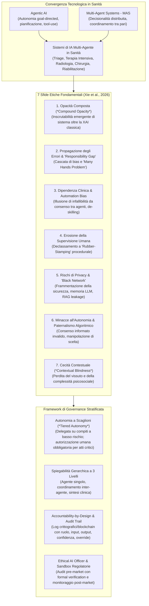
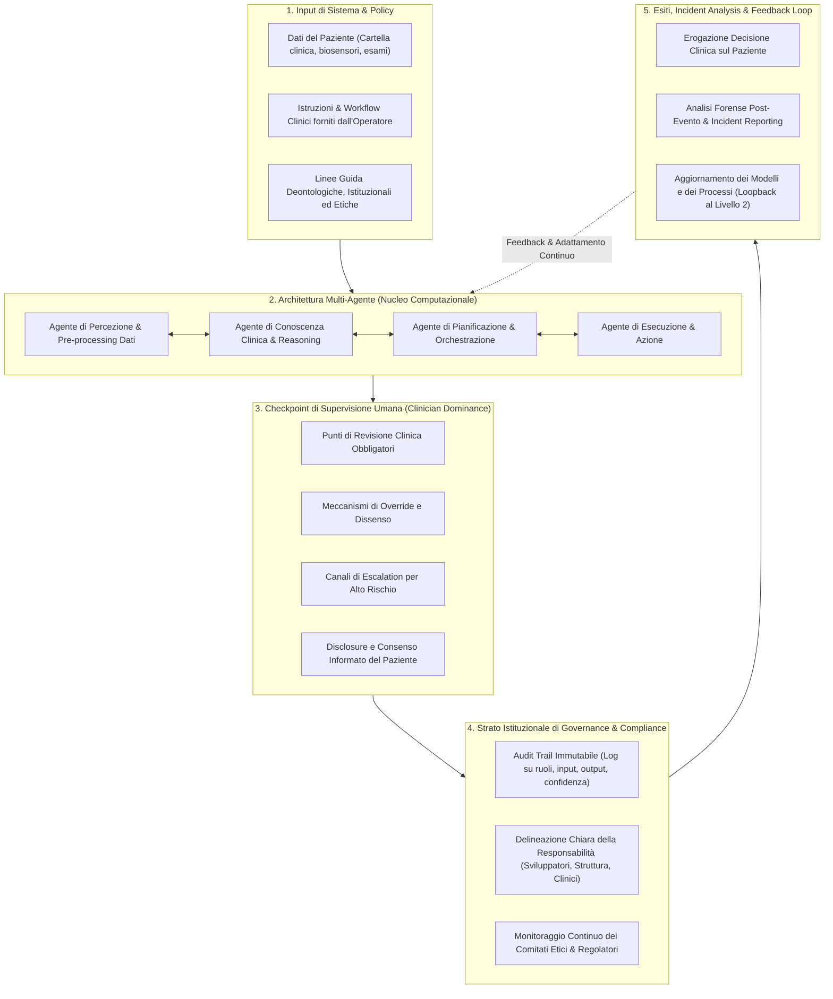

# Ethical Issues in Multi-Agent AI Systems for Healthcare: A Narrative Review (Xie et al., 2026)

## Definizione Operativa
- Narrative review sistematica pubblicata su *Frontiers in Public Health* (aprile 2026) da Zhibin Xie, Hongyu Wang, Lexuan Dai, Zikai Wang, Haitao Song e Jingzhe Qian (*Shanghai Jiao Tong University*, *The Chinese University of Hong Kong*, *University of Southern California*, *Shanghai Artificial Intelligence Research Institute*; doi: 10.3389/fpubh.2026.1792627).
- **Inquadramento dello Studio:** Sintesi qualitativa di 21 studi (2022–2025) selezionati da *PubMed*, *Scopus* e *Web of Science* secondo le linee guida SANRA. L'opera formalizza la convergenza tra **Agentic AI** (autonomia funzionale goal-directed senza prompting continuo) e **Multi-Agent Systems - MAS** (architetture a processo decisionale distribuito), analizzando come le interazioni emergenti tra molteplici agenti specializzati amplifichino i rischi dei singoli modelli di intelligenza artificiale e introducano inediti dilemmi etico-giuridici nella pratica medica e clinica.
- **Utilità Clinica e di Governance:** Identifica una tassonomia strutturata di **7 sfide etiche fondamentali** (opacità composta, propagazione a cascata degli errori, dipendenza clinica con bias di automazione, erosione della supervisione umana sostanziale, vulnerabilità di sicurezza e privacy, minacce al consenso informato e paternalismo algoritmico, cecità contestuale e perdita di sfumature idiografiche) e propone un **framework di governance integrata a livelli** basato su [[tiered-autonomy-in-clinical-ai|autonomia a scaglioni (*tiered autonomy*)]], spiegabilità gerarchica, audit trail crittografici e design centrato sulla responsabilità (*accountability-by-design*).

---

## Le 7 Sfide Etiche dei Sistemi Multi-Agente

### 1. Opacità Composta (*Compound Opacity*)
- **Inscrutabilità Emergente:** Nei sistemi multi-agente, i compiti sono decomposti tra agenti specializzati (percezione, reasoning, pianificazione, esecuzione) spesso orchestrati da LLM. Anche qualora i singoli moduli fossero parzialmente interpretabili, il loro scambio dinamico di segnali di controllo, feedback e stati intermedi produce un'opacità sistemica di livello superiore (*system-level inscrutability*) che rende impossibile ricostruire i percorsi causali dopo un esito avverso (Salehi et al., 2025).
- **Superamento della XAI Tradizionale:** I metodi di *Explainable AI* convenzionali (es. saliency maps, SHAP, LIME) sono stati concepiti per modelli diagnostici isolati e statici. Essi falliscono nel decifrare la negoziazione inter-agente in flussi clinici complessi (es. radiologia agentica integrata a refertazione e triage).
- **Asimmetria di Responsabilità nei Team Ibridi:** Gli studi empirici sulle dinamiche di team uomo-IA dimostrano che gli umani tendono ad addossarsi la colpa individuale degli errori, mentre attribuiscono implicitamente i successi al sistema tecnologico (Yousefi et al., 2025). L'opacità priva il medico della base informativa necessaria per contestare gli output algoritmici.

---

### 2. Propagazione degli Errori e Difficoltà di Attribuzione (*Error Propagation & Attribution*)
- **Effetto a Cascata (*Error Cascading*):** Un'imprecisione o un bias introdotto da un agente a monte (es. nel pre-processing o nell'interpretazione di un dato di laboratorio) si propaga ai moduli a valle, i quali trattano le conclusioni intermedie come evidenze autoritative anziché probabilistiche e revocabili (Brohi et al., 2025).
- **Il "Many Hands Problem" e il Responsibility Gap:** L'autorità decisionale è frammentata tra molteplici componenti algoritmici, sviluppatori, integratori, istituzioni sanitarie e clinici utilizzatori. Nessun singolo attore esercita il controllo totale sulla decisione finale, rendendo inapplicabili i tradizionali criteri medico-legali di colpa o negligenza individuale (Reiter et al., 2025; Hughes et al., 2025; Cestonaro et al., 2023).
- **Comportamenti Emergenti non Previsti:** L'evoluzione dinamica dello stato interno degli LLM e le routine di auto-correzione inter-agente possono innescare pattern decisionali emergenti mai osservati in fase di validazione, complicando l'attribuzione causale e legale del danno.

---

### 3. Dipendenza Clinica Accresciuta e Bias di Automazione
- **Illusione di Infallibilità da Consenso Apparente:** Quando un gruppo di agenti specializzati concorda su un'ipotesi diagnostico-terapeutica, l'output assume una veste di oggettività e consenso (*veneer of consensus*) che disincentiva psicologicamente il medico dal formulare obiezioni critiche o dal dare credito alla propria intuizione clinica (Brohi et al., 2025; Bellahsen-Harrar et al., 2025).
- **De-skilling e Atrofia Professionale:** La delega cognitiva continuativa delle funzioni di sintesi dati, ragionamento differenziale e refertazione rischia di degradare l'acume diagnostico dei medici nel lungo periodo (Sapkota et al., 2025; Holmes et al., 2025), lasciandoli disarmati di fronte a guasti del sistema o a casi limite (*edge cases*) in cui l'IA manca di contesto.
- **Dinamiche nei Servizi di Salute Mentale D2C:** Nelle piattaforme digitali direct-to-consumer non supervisionate, gli utenti sviluppano legami di attaccamento parasociale con gli agenti terapeutici (Panda & Binkley, 2025), affidandosi acriticamente al feedback algoritmico ed escludendo la presa in carico professionale.

---

### 4. Erosione della Supervisione Umana Sostanziale
- **Dalla Supervisione Attiva al "Rubber-Stamping":** I framework multi-agente dotati di memoria a lungo termine, pianificazione e cicli di auto-correzione operano con minima interazione umana in tempo reale. In assenza di checkpoint stringenti, il ruolo del clinico (*human-in-the-loop*) si degrada a una mera ratifica formale o timbratura passiva di decisioni già prese (Bani Issa, 2025).
- **Diluizione dell'Agency Morale:** Con la concessione di una parziale autonomia di ragionamento agli agenti, l'agency morale umana si disperde nei team uomo-macchina (Reiter et al., 2025). In chirurgia robotica e ambienti ad alta intensità, la continuità operativa semi-autonoma espone al rischio di azioni lesive non tempestivamente intercettate.
- **Principio Operativo di Non Maleficenza:** Hutler et al. (2023) e Hu et al. (2025) evidenziano che l'incorporazione del "primum non nocere" richiede che ogni azione dell'IA sia chiaramente circoscritta, tracciabile e istantaneamente reversibile da parte del clinico umano.

---

### 5. Rischi di Privacy e Sicurezza dei Dati ("Black Network")
- **Superficie di Attacco Amplificata:** Il continuo scambio di informazioni cliniche riservate tra agenti eterogenei su reti decentralizzate crea una "rete nera" (*black network*) complessa da monitorare, in cui l'anello debole (es. un agente che accede ad API esterne prive di crittografia) compromette l'intero perimetro di sicurezza (Stein et al., 2025).
- **Memorizzazione negli LLM e Vulnerabilità nei RAG:** I grandi modelli linguistici impiegati come motori di ragionamento possono memorizzare e rigurgitare inavvertitamente dati sanitari protetti (PHI), mentre i moduli di *Retrieval-Augmented Generation* aumentano l'esposizione qualora interroghino repository clinici non preventivamente filtrati o anonimizzati (Hu et al., 2025).
- **Criticità Normativa (HIPAA/GDPR):** L'opacità dei messaggi inter-agente ostacola la ricostruzione delle motivazioni di accesso al dato, violando i requisiti di audit trail richiesti dal GDPR e dai protocolli di conformità sanitaria.

---

### 6. Minacce all'Autonomia del Paziente e al Consenso Informato
- **Invalidità del Consenso Tecnico:** L'autonomia del paziente presuppone la comprensione trasparente di rischi, benefici e alternative. Se la catena inferenziale multi-agente è incomprensibile agli stessi esperti, il consenso prestato dal paziente diviene sostanzialmente viziato o privo di validità (Morley et al., 2020).
- **Paternalismo Algoritmico (*Algorithmic Paternalism*):** I modelli generativi possono veicolare subtle distorsioni persuasive (*nudging*), indirizzando il paziente verso determinate scelte sanitarie basate sui bias del training set anziché sui valori individuali dell'assistito (Holmes et al., 2025).
- **Divario di Consapevolezza:** Evidenze sperimentali (Bani Issa, 2025) segnalano che la stragrande maggioranza dei pazienti rimane ignara del livello di autonomia assunto dagli agenti di IA in procedure chirurgiche o percorsi diagnostici complessi. Soares et al. (2023) confermano che l'accettazione morale delle interazioni sanitarie mediate da IA è massima solo quando è preservata l'autonomia di scelta del paziente.

---

### 7. Cecità Contestuale (*Contextual Blindness*) e Perdita di Sfumature
- **Disconnessione tra Conoscenza Globale e Contesto Idiografico:** Pur disponendo di un immenso patrimonio informativo standardizzato, i modelli multi-agente difettano di adattabilità culturale e comprensione della situazione contingente (Luo et al., 2025). I nodi di orchestrazione tendono ad aggregare e riassumere i dati, eliminando segnali rari o casi limite (*edge cases*) che in medicina e psicoterapia hanno valore clinico decisivo.
- **Incapacità di Riconoscere la Rilevanza Morale (*Moral Salience*):** I modelli formali e di logica deontica non possono distinguere la differenza qualitativa tra un danno terapeutico accettabile (es. incisione chirurgica programmata) e una lesione accidentale, mancando della comprensione dell'intenzionalità medica e dell'esperienza vissuta (*lived experience*) del paziente (Hutler et al., 2023; Reiter et al., 2025).

---

## Tabella Sinottica delle Sfide e Soluzioni di Mitigazione

| Sfida Etica | Descrizione nell'Architettura Multi-Agente | Implicazioni Cliniche e Deontologiche | Strategie di Mitigazione Proposte |
| :--- | :--- | :--- | :--- |
| **Opacità Composta** | Stratificazione di agenti con reasoning parzialmente opaco; imperscrutabilità sistemica emergente (Salehi et al., 2025). | Compromissione della trasparenza e della fiducia; fallimento delle spiegazioni post-hoc degli eventi avversi. | Spiegabilità gerarchica multilivello; registrazione delle comunicazioni inter-agente in linguaggio naturale; XAI all'orchestrazione (Hu et al., 2025). |
| **Propagazione Errori** | Errori a monte trattati come dati certi a valle; fallimenti emergenti non riconducibili a un singolo nodo. | *Responsibility gap*; impossibilità di attribuire colpa professionale o difetto di prodotto (Hughes et al., 2025). | Audit trail crittografici/blockchain; test in sandbox modulari; framework di responsabilità condivisa (*shared liability*) (Niraula et al., 2025). |
| **Dipendenza Clinica** | Falso consenso tra agenti e assertività linguistica che inibiscono il dissenso (Yousefi et al., 2025). | De-skilling; atrofia del giudizio clinico indipendente; accettazione di indicazioni distorte (Holmes et al., 2025). | UI centrate sull'incertezza e sui divari di confidenza; meccanismi obbligatori di override; programmi di AI literacy (Brohi et al., 2025). |
| **Erosione Controllo** | Autonomia operativa e cicli chiusi di pianificazione/esecuzione senza feedback continuo (Bani Issa, 2025). | Supervisione ridotta a ratifica formale (*rubber-stamping*); ritardo negli interventi correttivi (Reiter et al., 2025). | **Autonomia a scaglioni (*Tiered Autonomy*)** basata su rischio e reversibilità; vincoli rigidi human-in-the-loop (Kim et al., 2025). |
| **Rischi di Privacy** | Condivisione distribuita di dati sensibili; frammentazione delle policy di sicurezza tra agenti (Stein et al., 2025). | Rischio di data breach; violazione GDPR/HIPAA; memorizzazione non controllata nei pesi dei modelli LLM. | Federated learning; prove a conoscenza zero (*zero-knowledge proofs*); identità decentralizzata; logging immutabile (Cherif et al., 2024). |
| **Minacce all'Autonomia** | Mancata tracciabilità delle inferenze e scarsa consapevolezza del paziente sull'autonomia dell'IA (Bani Issa, 2025). | Consenso informato nullo o indebolito; paternalismo algoritmico e manipolazione delle decisioni di cura. | Divulgazione trasparente della presenza di IA; informative adatte ai pazienti; mediazione clinica interpretativa obbligatoria. |
| **Cecità Contestuale** | Ottimizzazione su pattern probabilistici generali con scarto delle sfumature psicosociali e culturali (Luo et al., 2025). | Piani terapeutici generici o inadatti; insensibilità etica; disallineamento rispetto ai valori personali del paziente. | Interfacce per l'inserimento manuale del contesto da parte del medico; strati di vincoli etici locali; primato del giudizio clinico. |

---

## Il Framework di Governance Stratificata a 5 Livelli

### Componenti Chiave del Framework
1. **Autonomia a Scaglioni (*Tiered Autonomy*):** La delega operativa non è uniforme, ma calibrata sulla gravità dell'atto medico e sulla reversibilità dell'azione:
   - *Basso Rischio / Alta Reversibilità (es. bozze di referto, estrazione dati):* Massima autonomia dell'agente.
   - *Rischio Intermedio / Interpretativo:* Richiesta di conferma clinica preventiva.
   - *Alto Rischio / Decisioni Critiche (diagnosi, prescrizioni, procedure invasive):* Autorizzazione esplicita e diretta del medico umano. L'escalation al controllo umano si attiva automaticamente in caso di disaccordo tra agenti (*inter-agent disagreement*) o crollo della metrica di confidenza.
2. **Accountability-by-Design e Audit Trail Strutturato:** Ogni singola raccomandazione o decisione generata da un agente deve essere registrata con: identità dell'agente, ruolo assegnato, input ricevuto, output generato, stima dell'incertezza/confidenza, impatti a valle sui moduli successivi ed eventuali tentativi di override umano (Phiri, 2025; Kulothungan, 2025).
3. **L'Istituzione dell'Ethical AI Officer:** Proposta da Thurzo (2025) come figura di supervisione tecnica e deontologica analoga all'ispettore di sicurezza aerea. È incaricato di condurre verifiche formali pre-rilascio (*model checking*, prove a conoscenza zero) e audit forensi post-incidente sui registri crittografici.
4. **Allineamento con la Normativa Globale:** Il framework si allinea formalmente alle direttive **WHO AI for Health** (2024; auditabilità, trasparenza e salvaguardia dei diritti del paziente) e agli obblighi stringenti dell'**EU AI Act** (2024; categorizzazione dei sistemi ad alto rischio, gestione del rischio lungo l'intero ciclo di vita e obbligo di post-market surveillance).

---

## Barriere di Implementazione e Costi di Governance
- **Carico Formativo e "AI Literacy":** L'efficacia della supervisione umana rischia di essere vanificata se il personale sanitario non possiede competenze adeguate. Sia l'EU AI Act che l'American Medical Association (AMA, 2025) sottolineano la necessità di investire in programmi continui di alfabetizzazione sull'IA per preservare l'indipendenza intellettuale del clinico.
- **Incertezza Medico-Legale:** La mancanza di regimi di responsabilità chiari disincentiva l'adozione istituzionale per il timore di contenziosi da *malpractice*. È necessaria l'introduzione di schemi di responsabilità condivisa in cui i fornitori garantiscano l'accuratezza tecnica entro intervalli di confidenza certificati, lasciando al medico la piena autorità clinica.
- **Sostenibilità Economica e Vigilanza Continua:** La transizione da verifiche statiche pre-market a una sorveglianza continuativa post-deployment (audit in tempo reale, ri-certificazioni periodiche, integrazione con cartelle cliniche elettroniche EHR) impone costi infrastrutturali e di personale che possono sovraccaricare le strutture sanitarie con risorse limitate.

---

## Riferimenti Bibliografici
- Xie, Z., Wang, H., Dai, L., Wang, Z., Song, H., & Qian, J. (2026). Ethical issues in multi-agent AI systems for healthcare: a narrative review. *Frontiers in Public Health*, 14, 1792627. https://doi.org/10.3389/fpubh.2026.1792627
- American Medical Association [AMA]. (2025). AMA Adopts Policy to Advance AI Literacy in Medical Education. AMA Press Releases.
- American Medical Association [AMA]. (2025). To Implement Health AI, First Decide Who's Accountable. AMA Digital Health Practice Management.
- Bani Issa, H. (2025). Robotic surgery and the law: defining control and criminal responsibility. *Journal of Soft Computing and Data Mining*, 6, 423–434. https://doi.org/10.30880/jscdm.2025.06.01.028
- Bellahsen-Harrar, Y., Lubrano, M., Lépine, C., Beaufrère, A., Bocciarelli, C., Brunet, A., et al. (2025). Exploring the risks of over-reliance on AI in diagnostic pathology. *PLoS ONE*, 20, e0323270. https://doi.org/10.1371/journal.pone.0323270
- Brohi, S., ul-ain Mastoi, Q., Jhanjhi, N. Z., & Pillai, T. (2025). A research landscape of agentic AI and large language models: applications, challenges and future directions. *Algorithms*, 18, 499. https://doi.org/10.3390/a18080499
- Cestonaro, C., Delicati, A., Marcante, B., Caenazzo, L., & Tozzo, P. (2023). Defining medical liability when artificial intelligence is applied on diagnostic algorithms: a systematic review. *Frontiers in Medicine*, 10, 1305756. https://doi.org/10.3389/fmed.2023.1305756
- Chaffer, T. J., Littlejohn, J., Nadarasa, A., & Lamschtein, C. (2025). Self-Sovereign Patient as a Cornerstone of Healthcare 4.0. *Blockchain in Healthcare Today*, 8, 1. https://doi.org/10.30953/bhty.v8.414
- Cherif, A. N., Youssfi, M., En-Naimani, Z., Tadlaoui, A., Soulami, M., Bouattane, O., et al. (2024). CQRS and blockchain with zero-knowledge proofs for secure multi-agent decision-making. *International Journal of Advanced Computer Science and Applications*. https://doi.org/10.14569/IJACSA.2024.0151188
- European Union. (2024). Regulation Laying Down Harmonised Rules on Artificial Intelligence (Artificial Intelligence Act). *Official Journal of the European Union*.
- Fahrner, L. J., Chen, E., Topol, E., & Rajpurkar, P. (2025). The generative era of medical AI. *Cell*, 188, 3648–3660. https://doi.org/10.1016/j.cell.2025.05.018
- Holmes, S. A., Faria, V., & Moulton, E. A. (2025). Generative AI in healthcare: challenges to patient agency and ethical implications. *Frontiers in Digital Health*, 7, 1524553. https://doi.org/10.3389/fdgth.2025.1524553
- Hu, Y., Liu, J., & Jiang, W. (2025). Large language models in nephrology: applications and challenges in chronic kidney disease management. *Renal Failure*, 47, 2555686. https://doi.org/10.1080/0886022X.2025.2555686
- Hughes, L., Dwivedi, Y. K., Malik, T., Shawosh, M., Albashrawi, M., Jeon, I., et al. (2025). AI agents and agentic systems: a multi-expert analysis. *Journal of Computer Information Systems*, 65, 489–517. https://doi.org/10.1080/08874417.2025.2483832
- Hutler, B., Rieder, T. N., Mathews, D. J. H., Handelman, D., & Greenberg, A. M. (2023). Designing robots that do no harm: understanding the challenges of Ethics for Robots. *AI and Ethics*, 4, 463–471. https://doi.org/10.1007/s43681-023-00283-8
- Kim, Y., Jeong, H., Park, C., Park, E., Zhang, H., Liu, X., et al. (2025). Tiered agentic oversight: a hierarchical multi-agent system for AI safety in healthcare. *arXiv preprint arXiv:2506.12482*.
- Kulothungan, V. (2025). Using blockchain ledgers to record AI decisions in IoT. *IoT*, 6, 37. https://doi.org/10.3390/iot6030037
- Luo, M.,支援, Z., Gao, J., Sun, Y., Chen, L., & Feng, X. (2025). Evaluating the role of ChatGPT in rehabilitation medicine: a narrative review. *Frontiers in Digital Health*, 7, 1618510. https://doi.org/10.3389/fdgth.2025.1618510
- Morley, J., Machado, C., Burr, C., Cowls, J., Joshi, I., Taddeo, M., et al. (2020). The ethics of AI in health care: a mapping review. *Social Science & Medicine*, 260, 113172. https://doi.org/10.1016/j.socscimed.2020.113172
- Niraula, D., Shotande, M., & Naqa, I. E. E. (2025). Human-machine interaction in the age of generative AI. *Cancer Journal*, 31, 797.
- Panda, O. D., & Binkley, C. E. (2025). Governance of direct-to-user digital mental health tools: emphasizing transparency over paternalism. *Hastings Center Report*, 3, 29–33. https://doi.org/10.1002/hast.5009
- Phiri, C. C. (2025). Creating characteristically auditable agentic AI systems. In *Proceedings of the Intelligent Robotics FAIR (2025)*. https://doi.org/10.1145/3759355.3759356
- Reiter, P., Norman, U., Weinberger, N., & Bruno, B. (2025). Artificial moral agents: should machines take ethical responsibility? In *2025 IEEE International Conference on Advanced Robotics and its Social Impacts (ARSO)* (pp. 218–224). IEEE. https://doi.org/10.1109/ARSO64737.2025.11124921
- Salehi, S., Singh, Y., Habibi, P., & Erickson, B. (2025). Beyond single systems: how multi-agent ai is reshaping ethics in radiology. *Bioengineering*, 12, 1100. https://doi.org/10.3390/bioengineering12101100
- Sapkota, R., Roumeliotis, K. I., & Karkee, M. (2025). AI agents vs. agentic AI: a conceptual taxonomy, applications and challenges. *Information Fusion*, 126, 103599. https://doi.org/10.1016/j.inffus.2025.103599
- Soares, A., Piçarra, N., Giger, J. C., Oliveira, R., & Arriaga, P. (2023). Ethics 4.0: ethical dilemmas in healthcare mediated by social robots. *International Journal of Social Robotics*, 15, 807–823. https://doi.org/10.1007/s12369-023-00983-5
- Stein, S., Pilgermann, M., Weber, S. B., & Sedlmayr, M. (2025). Leveraging MDS2 and SBOM data for LLM-assisted vulnerability analysis of medical devices. *Computational and Structural Biotechnology Journal*, 28, 267–280. https://doi.org/10.1016/j.csbj.2025.07.012
- Thurzo, A. (2025). Provable AI ethics and explainability in medical and educational AI agents: trustworthy ethical firewall. *Electronics*. https://doi.org/10.20944/preprints202502.2232.v1
- World Health Organization [WHO]. (2024). *Ethics and Governance of Artificial Intelligence for Health: Guidance on Large Multi-Modal Models*. Geneva: WHO.
- Yousefi, M., Shahi, A., Sharifi, M., Romera, A. J. J., Hoermann, S., & Piumsomboon, T. (2025). Team dynamics in human-AI collaboration: effects on confidence, satisfaction, and accountability. In *Proceedings of the 27th International Conference on Multimodal Interaction*. https://doi.org/10.1145/3716553.3750776

---

## Relazioni
- Vedi anche: [[compound-opacity-in-multi-agent-systems]], [[tiered-autonomy-in-clinical-ai]], [[human-oversight-and-liability-in-clinical-ai]], [[algorithmic-paternalism-in-ai-mental-health]], [[modello-centauro-clinico]], [[gdpr-governance-mental-health-ai]], [[three-layer-governance-framework]], [[automated-clinical-ai-red-teaming]], [[clinical-decision-making-and-artificial-intelligence]], [[over-deference-in-llm-supervision]], [[uso-problematico-chatbot-ai]], [[ethical-guidance-professional-practice-1]]
