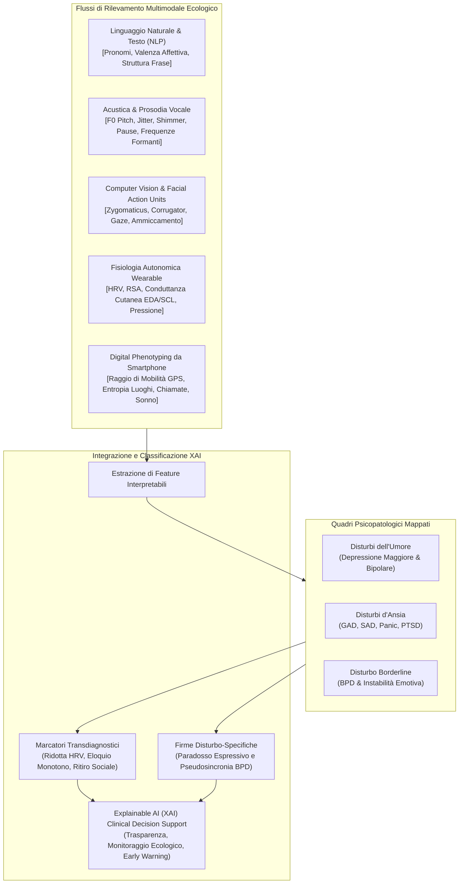
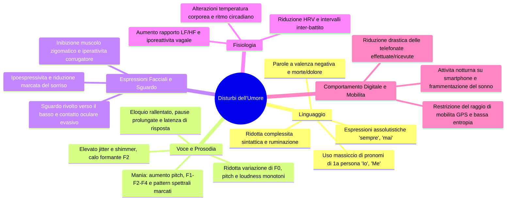
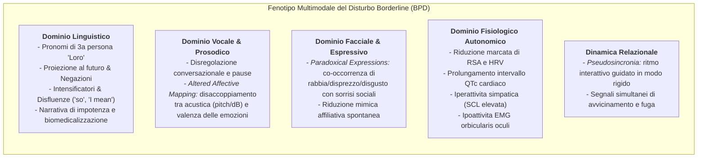

# Multimodal Observable Cues in Mood, Anxiety, and Borderline Personality Disorders: A Review of Reviews to Inform Explainable AI in Mental Health (Močnik et al., 2025)

## Definizione Operativa
- Rassegna di rassegne sistematiche e di scoping condotta secondo la metodologia di Arksey e O'Malley e le linee guida PRISMA-ScR (Grega Močnik, Ana Rehberger, Žan Smogavc, Izidor Mlakar, Urška Smrke e Sara Močnik, Università di Maribor e Centro Medico Universitario di Maribor, 2025; *Frontiers in Artificial Intelligence*, doi: [10.3389/frai.2025.1696448](https://doi.org/10.3389/frai.2025.1696448)).
- **Sintesi Empirica e Metodologica:** Analizza 24 rassegne sistematiche e di scoping pubblicate tra il 2018 e il 2024 (selezionate da un corpus iniziale di 3.733 record unici da Web of Science e Scopus) che esaminano indicatori osservabili e misurabili oggettivamente (senza ricorrere a neuroimaging non accessibile come fMRI o a risposte indotte da task artificiali) attraverso sei domini: (1) linguaggio, (2) voce e prosodia, (3) espressioni facciali, (4) comunicazione non verbale/motoria, (5) segnali fisiologici e (6) comportamento digitale passivo (mobilità GPS, smartphone, sonno, social network).
- **Contributo Unico e Innovativo:** Rappresenta la prima sintesi della letteratura ad associare esplicitamente la **fattibilità clinica** e il **potenziale di rilevamento passivo (*passive sensing*)** dei biomarcatori digitali multimodali su tre classi diagnostiche fondamentali:
  1. *Disturbi dell'Umore* (Depressione Maggiore, Disturbo Bipolare in fase depressiva, eutimica e maniacale);
  2. *Disturbi d'Ansia* (Disturbo d'Ansia Generalizzata [GAD], Disturbo di Panico, Fobia Sociale [SAD], Disturbo da Stress Post-Traumatico [PTSD]);
  3. *Disturbo Borderline di Personalità* (BPD).
- **Fondamento per l'Explainable AI (XAI):** Fornisce un'ontologia empirica di feature interpretabili che colmano il divario di fiducia tra modelli di machine learning "black-box" e clinici, distinguendo chiaramente tra **meccanismi transdiagnostici condivisi** (es. calo di HRV, appiattimento prosodico) e **firme comportamentali disturbo-specifiche** (es. l'ambivalenza affettivo-relazionale e la pseudosincronia nel BPD).

## Evidenze dalla Letteratura
### Metodologia della Rassegna
1. **Protocollo:** Conforme alle linee guida PRISMA-ScR (Arksey & O'Malley, 2005; Levac et al., 2010; Tricco et al., 2018).
2. **Fonti e Stringhe di Ricerca:** Ricerca estesa condotta su Web of Science e Scopus (fino a dicembre 2024), integrata da Google Scholar.
3. **Criteri di Inclusione ed Esclusione:**
   - *Inclusi:* Rassegne sistematiche, scoping review e meta-analisi incentrate su segnali osservabili, spontanei e quantificabili digitalmente in popolazioni con depressione, disturbo bipolare, disturbi d'ansia e BPD.
   - *Esclusi:* Studi primari isolati; popolazioni con disturbi neurologici o demenze; studi basati esclusivamente su neuroimaging non accessibile nella clinica di routine (fMRI, PET, CT, EMG facciale invasiva in laboratorio); compiti sperimentali artificiali (task-evoked); pubblicazioni prive di grounding teorico validato.
4. **Volume del Campione:**
   - 4.216 record identificati $\rightarrow$ 3.733 record unici dopo rimozione duplicati $\rightarrow$ 224 esaminati in full-text $\rightarrow$ **24 rassegne incluse** (17 rassegne sistematiche, 6 scoping review, 1 meta-review).
   - Le rassegne incluse sintetizzano in media 60 studi primari ciascuna ($\text{SD} = 50$, range: 9–184).
   - Distribuzione tematica: 21 rassegne su disturbi dell'umore (20 depressione, 7 disturbo bipolare), 10 su disturbi d'ansia e 1 specifica sul Disturbo Borderline di Personalità (Močnik et al., 2024).

### Tassonomia dei Segnali Osservabili per Categoria Diagnostica

#### 1. Disturbi dell'Umore (Depressione Maggiore e Disturbo Bipolare)

- **Linguaggio e Stile Lessicale:** Focalizzazione su di sé (*self-focused attention*), lessico di valenza negativa, costrutti assolutistici.
- **Voce e Acustica Paralinguistica:** Rallentamento, pause, riduzione della dinamica di frequenza ed intensità (appiattimento).
- **Mimica Facciale e Oculometria:** Ipoespressività (*flat affect*), iperattivazione del corrugatore, evitamento contatto oculare.
- **Segnali Fisiologici:** HRV soppressa, rapporto LF/HF elevato.
- **Digital Phenotyping:** Contrazione raggio mobilità, riduzione contatti, frammentazione sonno.

#### 2. Disturbi d'Ansia (GAD, SAD, Disturbo di Panico, PTSD)
- **Linguaggio:** *Negativity bias*, termini di minaccia e vigilanza visiva.
- **Voce:** Eloquio appiattito, pause (PTSD).
- **Fisiologia:** Diminuzione marcata di RSA e HF-HRV (core marker), iperattivazione simpatica, instabilità respiratoria.
- **Comportamento:** Evitamento spazi pubblici, restrizione transizioni spaziali.

#### 3. Disturbo Borderline di Personalità (BPD)

- Caratterizzato da **ambivalenza strutturale, disconnessione tra canali espressivi e instabilità relazionale**.

### Matrice Comparativa Transdiagnostica

| Dominio Sensoriale / Marker | Depressione Maggiore | Mania Bipolare | Disturbi d'Ansia | Disturbo Borderline (BPD) | Rilevamento Passivo |
| :--- | :--- | :--- | :--- | :--- | :---: |
| **Perno Linguistico** | Autofocalizzazione (1ª pers. sing.) | Logorrea, grandiosità | Negativity bias | Esternalizzazione (3ª pers.) | $\checkmark$ |
| **Parametri Vocali** | F0 monotono, pause lunghe | Pitch elevato, formanti $F_1\text{–}F_4 \uparrow$ | Prosodia piatta | *Altered affective mapping* | $\checkmark$ |
| **Mimica Facciale** | Ipoespressività | Ipermimia | Ipervigilanza oculare | **Espressioni paradossali** | $\checkmark$ |
| **Biomarcatori HRV / RSA** | HRV $\downarrow$, LF/HF $\uparrow$ | HRV $\uparrow$ | HRV $\downarrow$, RSA $\downarrow$ | HRV $\downarrow$, QTc prolungato | $\checkmark$ |
| **Sistema Elettrodermico** | SCL $\downarrow$ | Variabilità elevata | SCL $\uparrow$ | SCL tonica $\uparrow$ | $\checkmark$ |
| **Mobilità GPS** | Raggio compresso | Raggio espanso | Evitamento | Spostamenti irregolari | $\checkmark$ |
| **Uso Smartphone** | Chiamate $\downarrow$, screen-time $\uparrow$ | Chiamate lunghe $\uparrow$ | App passive $\uparrow$ | Messaggistica frequente | $\checkmark$ |

**Riferimenti Bibliografici:**
- Močnik, G., Rehberger, A., Smogavc, Ž., Mlakar, I., Smrke, U., & Močnik, S. (2025). Multimodal observable cues in mood, anxiety, and borderline personality disorders: a review of reviews to inform explainable AI in mental health. *Frontiers in Artificial Intelligence*, 8:1696448. https://doi.org/10.3389/frai.2025.1696448
- Močnik, S., Smrke, U., Mlakar, I., Močnik, G., Gregorič Kumperščak, H., & Plohl, N. (2024). Beyond clinical observations: a scoping review of AI-detectable observable cues in borderline personality disorder. *Frontiers in Psychiatry*, 15:1345916. https://doi.org/10.3389/fpsyt.2024.1345916
- Smrke, U., Mlakar, I., Rehberger, A., Žužek, L., & Plohl, N. (2024). Decoding anxiety: a scoping review of observable cues. *Digital Health*, 10:20552076241297006. https://doi.org/10.1177/20552076241297006
- Khoo, L., Lim, M., Chong, C. Y., & McNaney, R. (2024). Machine learning for multimodal mental health detection: a systematic review of passive sensing approaches. *Sensors*, 24(2), 348. https://doi.org/10.3390/s24020348
- Liu, H., Wu, H., Yang, Z., Ren, Z., Dong, Y., Zhang, G., et al. (2024). An historical overview of artificial intelligence for diagnosis of major depressive disorder. *Frontiers in Psychiatry*, 15:1417253. https://doi.org/10.3389/fpsyt.2024.1417253
- Zierer, C., Behrendt, C., & Lepach-Engelhardt, A. C. (2024). Digital biomarkers in depression: a systematic review and call for standardization and harmonization of feature engineering. *Journal of Affective Disorders*, 356, 438–449. https://doi.org/10.1016/j.jad.2024.03.163
- Koppe, G., Meyer-Lindenberg, A., & Durstewitz, D. (2021). Deep learning for small and big data in psychiatry. *Neuropsychopharmacology*, 46(1), 176–190. https://doi.org/10.1038/s41386-020-0767-z
- Wang, P., Liu, A., & Sun, X. (2025). Integrating emotion dynamics in mental health: a trimodal framework combining ecological momentary assessment, physiological measurements, and speech emotion recognition. *Interdisciplinary Medicine*, 3:e20240095. https://doi.org/10.1002/INMD.20240095
- Quintana, D. S., Alvares, G. A., & Heathers, J. A. J. (2016). Guidelines for reporting articles on psychiatry and heart rate variability (GRAPH): recommendations to advance research communication. *Translational Psychiatry*, 6(5), e803. https://doi.org/10.1038/tp.2016.73

## Relazioni
- [[multimodal-observable-cues-in-psychiatry]]
- [[bpd-multimodal-behavioral-markers]]
- [[multimodal-anxiety-detection-ai]]
- [[explainable-mental-health-diagnosis]]
- [[social-media-phenotyping-anxiety]]
- [[wearable-sensor-fusion-adherence]]
- [[fdgth-07-1646724]]
- [[fpsyg-16-1715306]]
- [[2607-25667v1]]
- [[algorithmic-tractability-in-psychotherapy]]
- [[modello-centauro-clinico]]
- [[ai-enhanced-cbt]]
