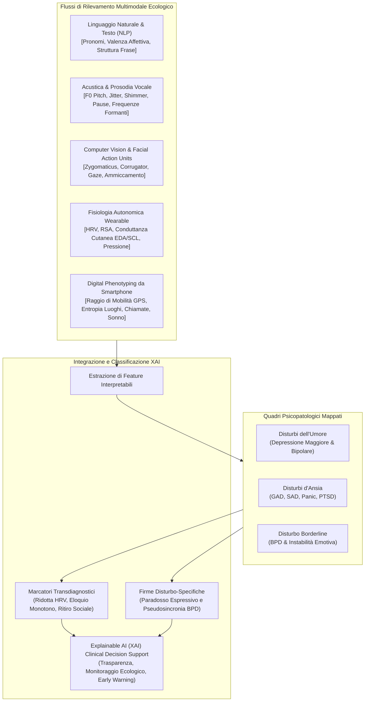
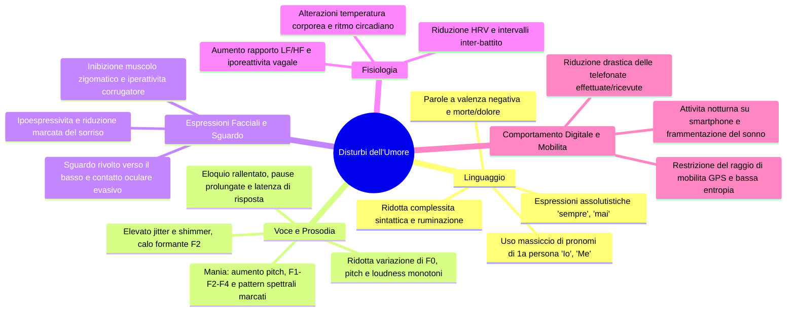
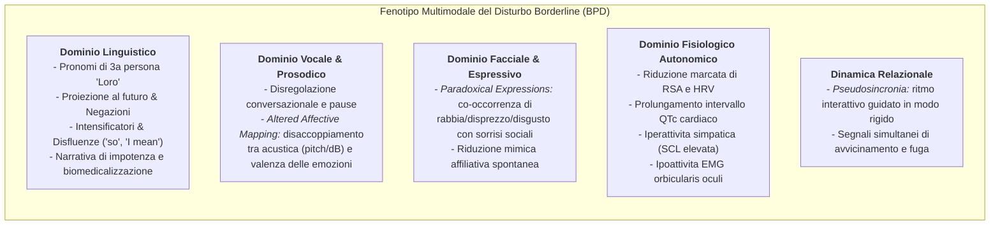
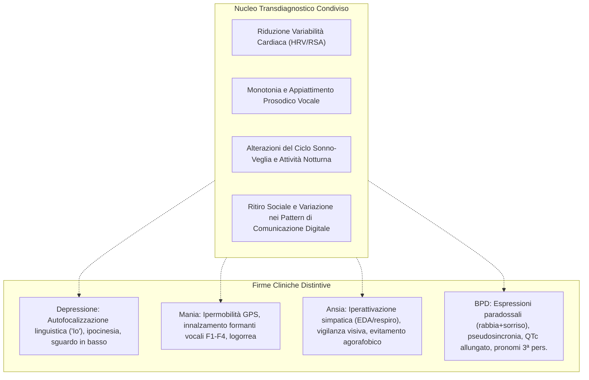

# Multimodal Observable Cues in Mood, Anxiety, and Borderline Personality Disorders: A Review of Reviews to Inform Explainable AI in Mental Health (Močnik et al., 2025)

## Definizione Operativa
- Rassegna di rassegne sistematiche e di scoping condotta secondo la metodologia di Arksey e O'Malley e le linee guida PRISMA-ScR (Grega Močnik, Ana Rehberger, Žan Smogavc, Izidor Mlakar, Urška Smrke e Sara Močnik, Università di Maribor e Centro Medico Universitario di Maribor, 2025; *Frontiers in Artificial Intelligence*, doi: [10.3389/frai.2025.1696448](https://doi.org/10.3389/frai.2025.1696448)).
- **Sintesi Empirica e Metodologica:** Analizza 24 rassegne sistematiche e di scoping pubblicate tra il 2018 e il 2024 (selezionate da un corpus iniziale di 3.733 record unici da Web of Science e Scopus) che esaminano indicatori osservabili e misurabili oggettivamente (senza ricorrere a neuroimaging non accessibile come fMRI o a risposte indotte da task artificiali) attraverso sei domini: (1) linguaggio, (2) voce e prosodia, (3) espressioni facciali, (4) comunicazione non verbale/motoria, (5) segnali fisiologici e (6) comportamento digitale passivo (mobilità GPS, smartphone, sonno, social network).
- **Contributo Unico e Innovativo:** Rappresenta la prima sintesi della letteratura ad associare esplicitamente la **fattibilità clinica** e il **potenziale di rilevamento passivo (*passive sensing*)** dei biomarcatori digitali multimodali su tre classi diagnostiche fondamentali:
  1. *Disturbi dell'Umore* (Depressione Maggiore, Disturbo Bipolare in fase depressiva, eutimica e maniacale);
  2. *Disturbi d'Ansia* (Disturbo d'Ansia Generalizzata [GAD], Disturbo di Panico, Fobia Sociale [SAD], Disturbo da Stress Post-Traumatico [PTSD]);
  3. *Disturbo Borderline di Personalità* (BPD).
- **Fondamento per l'Explainable AI (XAI):** Fornisce un'ontologia empirica di feature interpretabili che colmano il divario di fiducia tra modelli di machine learning "black-box" e clinici, distinguendo chiaramente tra **meccanismi transdiagnostici condivisi** (es. calo di HRV, appiattimento prosodico) e **firme comportamentali disturbo-specifiche** (es. l'ambivalenza affettivo-relazionale e la pseudosincronia nel BPD).

---

## Metodologia della Rassegna

1. **Protocollo:** Conforme alle linee guida PRISMA-ScR (Arksey & O'Malley, 2005; Levac et al., 2010; Tricco et al., 2018).
2. **Fonti e Stringhe di Ricerca:** Ricerca estesa condotta su Web of Science e Scopus (fino a dicembre 2024), integrata da Google Scholar.
3. **Criteri di Inclusione ed Esclusione:**
   - *Inclusi:* Rassegne sistematiche, scoping review e meta-analisi incentrate su segnali osservabili, spontanei e quantificabili digitalmente in popolazioni con depressione, disturbo bipolare, disturbi d'ansia e BPD.
   - *Esclusi:* Studi primari isolati; popolazioni con disturbi neurologici o demenze; studi basati esclusivamente su neuroimaging non accessibile nella clinica di routine (fMRI, PET, CT, EMG facciale invasiva in laboratorio); compiti sperimentali artificiali (task-evoked); pubblicazioni prive di grounding teorico validato.
4. **Volume del Campione:**
   - 4.216 record identificati $\rightarrow$ 3.733 record unici dopo rimozione duplicati $\rightarrow$ 224 esaminati in full-text $\rightarrow$ **24 rassegne incluse** (17 rassegne sistematiche, 6 scoping review, 1 meta-review).
   - Le rassegne incluse sintetizzano in media 60 studi primari ciascuna ($\text{SD} = 50$, range: 9–184).
   - Distribuzione tematica: 21 rassegne su disturbi dell'umore (20 depressione, 7 disturbo bipolare), 10 su disturbi d'ansia e 1 specifica sul Disturbo Borderline di Personalità (Močnik et al., 2024).

---

## Tassonomia dei Segnali Osservabili per Categoria Diagnostica

### 1. Disturbi dell'Umore (Depressione Maggiore e Disturbo Bipolare)

- **Linguaggio e Stile Lessicale:**
  - Marcata focalizzazione su di sé (*self-focused attention*): prevalenza statistica di pronomi di prima persona singolare (*I, me, my*), associata a ridotto uso di pronomi plurali.
  - Lessico dominato da valenza negativa (*hurt, tears, alone, hate, worry, depressed, hopeless, worthless*) e termini legati a morte e sofferenza somatica.
  - Presenza di costrutti assolutistici (*always, never*), forme passive/ausiliari e ridotta complessità sintattica (frasi più brevi, minori subordinate avverbiali).
  - Tendenza alla ruminazione verbale e diminuzione quantitativa delle interazioni scritte sui social network (con picchi di posting desincronizzati attorno a mezzanotte).
- **Voce e Acustica Paralinguistica:**
  - Rallentamento della velocità di eloquio (*speech rate*), incremento della latenza di risposta (*response latency*) e frequenti pause prolungate prima e durante l'emissione verbale.
  - Riduzione dell'escursione della frequenza fondamentale ($F_0$) e della dinamica di intensità (*loudness*), che producono un eloquio marcatamente piatto e monotono.
  - Aumento delle micro-fluttuazioni di frequenza (*jitter*) e ampiezza (*shimmer*), riflettenti un alterato controllo neuromotorio laringeo.
  - Calo della seconda formante acustica ($F_2$) nella depressione, in netto contrasto con l'elevazione di $F_1, F_2, F_4$ e della variabilità prosodica negli stati maniacali bipolari.
- **Mimica Facciale e Oculometria:**
  - Marcata ipoespressività (*flat affect*), riduzione della frequenza e intensità del sorriso con paralisi/ipoattivazione del muscolo grande zigomatico (*zygomaticus major*).
  - Prevalenza di angoli della bocca rivolti verso il basso e iperattivazione persistente del muscolo corrugatore del sopracciglio (*corrugator supercilii*).
  - Alterazioni oculomotorie: riduzione dei movimenti saccadici, fissazione visiva rigida, evitamento del contatto oculare e deviazione sistematica dello sguardo verso il basso (*downward gaze*).
- **Segnali Fisiologici Autonomici:**
  - Soppressione della variabilità della frequenza cardiaca (HRV) nei domini del tempo (SDNN, RMSSD) e della frequenza (calo dell'alta frequenza HF).
  - Elevazione del rapporto LF/HF (sbilanciamento simpatico con perdita del tono vagale).
  - Pressione arteriosa sistolica e diastolica mediamente più elevata e ridotta conduttanza cutanea tonica (SCL).
  - Appiattimento dell'ampiezza dell'oscillazione termica cutanea circadiana con innalzamento termico notturno.
- **Comportamento Digitale, Mobilità e Sonno (*Passive Sensing*):**
  - Mobilità GPS: forte contrazione del raggio di spostamento, prolungamento del tempo trascorso a casa, drastica riduzione del numero di luoghi nuovi visitati e bassa entropia spaziale.
  - Telefono e Rete: calo del volume e della durata delle chiamate vocali in uscita/entrata, riduzione dei contatti rubrica attivi, incremento dello screen-time notturno con sblocchi frequenti e di breve durata.
  - Sonno e Ritmi Circadiani: disallineamento circadiano, sonno frammentato con risvegli multipli (oppure pattern di ipersonnia con inerzia motoria).
  - Differenziale con la Mania: gli episodi maniacali mostrano pattern opposti (aumento del raggio di viaggio, incremento delle chiamate, accelerazione verbale, riduzione del bisogno di sonno).

---

### 2. Disturbi d'Ansia (GAD, SAD, Disturbo di Panico, PTSD)

- **Linguaggio e Bias Attenzionale:**
  - Presenza di un *negativity bias* generale con riduzione delle parole a valenza positiva.
  - Segnali dominio-specifici: frequente ricorso a parole legate a ricompensa/obiettivi nel GAD (*reward-related words*) e a termini visivi/percettivi nell'Ansia Sociale (*vision-related words*), indicativi di ipervigilanza e monitoraggio continuo dell'ambiente sociale e delle minacce esterne.
- **Voce e Prosodia:**
  - Eloquio appiattito e monotono con interruzioni e pause prolungate, particolarmente evidenti durante compiti di rievocazione del trauma nel PTSD (indice di soppressione emotiva e sovraccarico cognitivo da iperarousal).
- **Disfunzione Fisiologica (Core Biomarker per l'Ansia):**
  - Costituisce l'indicatore oggettivo più consistente e robusto tra tutti i disturbi d'ansia.
  - Diminuzione marcata dell'aritmia sinusale respiratoria (RSA) e della HF-HRV, documentata sin dall'età pediatrica e adolescenziale (segno di de-attivazione del freno vagale parasimpatico).
  - Iperattivazione simpatica cronica con incremento della frequenza cardiaca a riposo e della conduttanza cutanea (EDA/SCL), specialmente marcata nel PTSD.
  - Instabilità respiratoria: cicli di inspirazione/espirazione accorciati, ritmi respiratori irregolari e iperventilazione subclinica.
  - Pressione arteriosa elevata nelle 24 ore e incremento della variabilità pressoria nel GAD.
- **Comportamento e Geofencing Digitale:**
  - Evitamento attivo di spazi pubblici, luoghi affollati o contesti sociali/religiosi.
  - Restrizione delle transizioni spaziali (es. percorsi rigidi e obbligati casa-supermercato).
  - Incremento del tempo speso su app passive, videogiochi e app sanitarie/di controllo dei sintomi; distanziamento spaziale mantenuto anche da avatar/personaggi virtuali (SAD).

---

### 3. Disturbo Borderline di Personalità (BPD)

Il BPD mostra una configurazione di biomarcatori qualitativamente differente rispetto ai disturbi internalizzanti (depressione/ansia), caratterizzata da **ambivalenza strutturale, disconnessione tra canali espressivi e instabilità relazionale**:

- **Stile Linguistico ed Esternalizzazione:**
  - A differenza della depressione (dove prevale l'Io autoreferenziale), nel BPD emerge una preferenza per espressioni impersonali ed esternalizzate, con massiccio uso di pronomi di terza persona plurale (*they/loro*) e forme temporali proiettate al futuro.
  - Frequente inserimento di negazioni, intensificatori emotivi, congiunzioni e marcatori di disfluenza conversazionale (*"so"*, *"I mean"*, *"because"*).
  - Discrepanza di valenza tra canali: marcata tonalità affettiva negativa nei testi scritti e digitali, a fronte di un affetto apparentemente più neutro o controllato durante interviste cliniche vis-à-vis.
- **Acustica e Alterata Mappatura Emozionale (*Altered Affective Mapping*):**
  - Presenza di disconnessione strutturale tra i parametri acustici primari (frequenza fondamentale $F_0$, ampiezza in decibel) e il contenuto emotivo espresso (es. aggettivi ed interiezioni di rabbia o disgusto non accompagnati dalle tipiche modulazioni di pitch osservate nei controlli sani).
  - Elevata frequenza di pause e ritmo conversazionale irregolare.
- **Espressioni Facciali Paradossali e Segnalazione Conflittuale:**
  - Clusterizzazione in due sottogruppi: (a) cluster ad alta espressività negativa (rabbia, disprezzo, disgusto) che co-occorrono simultaneamente con sorrisi sociali; (b) cluster a bassa intensità negativa che preserva espressioni di affiliazione.
  - Netta prevalenza di espressioni di **disgusto e disprezzo** rispetto alla tristezza pura.
  - Il sorriso sociale persistente funge da maschera protettiva o tentativo disperato di mantenere il contatto interpersonale a fronte di un profondo distress interno (*paradoxical smiling*).
- **Fisiologia e Conduzione Cardiaca:**
  - Diminuzione marcata di RSA e HRV correlata alla severità sintomatologica.
  - Iperattivazione simpatica tonica (elevata conduttanza cutanea SCL).
  - **Prolungamento dell'intervallo QTc** cardiaco a riposo (riflettente un'alterata ripolarizzazione ventricolare legata allo stress cronico e alla disfunzione autonomica).
  - Ipoattività del muscolo *orbicularis oculi* all'elettromiografia (EMG), correlata al blocco della reattività mimica perioculare spontanea.
- **Comunicazione Non Verbale e Pseudosincronia:**
  - Deficit di cenni prosociali spontanei (riduzione del sollevamento delle sopracciglia e dell'inclinazione del capo).
  - Comparsa di **pseudosincronia non verbale**: i pazienti con BPD tendono a forzare e guidare rigidamente il ritmo dello scambio comunicativo con il partner, anziché co-costruire una sincronia fluida e bidirezionale.

---

## Matrice Comparativa Transdiagnostica

| Dominio Sensoriale / Marker | Depressione Maggiore | Mania Bipolare | Disturbi d'Ansia | Disturbo Borderline (BPD) | Rilevamento Passivo |
| :--- | :--- | :--- | :--- | :--- | :---: |
| **Perno Linguistico** | Autofocalizzazione (1ª persona sing.), lessico di dolore/morte | Logorrea, grandiosità, disinibizione | Negativity bias, termini di minaccia e vigilanza visiva | Esternalizzazione (3ª persona), intensificatori, negazioni | $\checkmark$ (SMS, Social) |
| **Parametri Vocali** | Eloquio lento, F0 monotono, pause lunghe, jitter $\uparrow$ | Pitch elevato, formanti $F_1\text{–}F_4 \uparrow$, spettro marcato | Prosodia piatta, pause in trauma recall, ipointensità | Disregolazione conversazionale, *altered affective mapping* | $\checkmark$ (Chiamate, Audio) |
| **Mimica Facciale** | Ipoespressività, zigomatico inibito, sguardo in basso | Espressioni vivaci, ipermimia | Ipervigilanza oculare, tensione facciale | **Espressioni paradossali** (disgusto/rabbia + sorriso sociale) | $\checkmark$ (Webcam, App) |
| **Biomarcatori HRV / RSA** | HRV $\downarrow$, LF/HF $\uparrow$, tono vagale depresso | HRV $\uparrow$ rispetto a depressione ed eutimia | HRV $\downarrow$, RSA $\downarrow$ (core marker d'ansia) | HRV $\downarrow$, RSA $\downarrow$, prolungamento **QTc** | $\checkmark$ (Smartwatch, ECG) |
| **Sistema Elettrodermico** | Conduttanza cutanea tonica (SCL) $\downarrow$ | Variabilità elevata | Conduttanza cutanea (SCL) $\uparrow$, reattività fasica $\uparrow$ | SCL tonica $\uparrow$, instabilità simpatica | $\checkmark$ (Sensori da polso) |
| **Mobilità GPS & Geofence** | Raggio compresso, tempo a casa $\uparrow$, bassa entropia | Raggio espanso, viaggi frequenti $\uparrow$, cell tower changes $\uparrow$ | Evitamento di spazi pubblici, percorsi stereotipati | Spostamenti irregolari, impulsività negli spostamenti | $\checkmark$ (GPS passivo) |
| **Uso dello Smartphone** | Chiamate $\downarrow$, screen-time notturno $\uparrow$, unlock brevi | Chiamate lunghe $\uparrow$, messaggi inviati $\uparrow$ | App passive $\uparrow$, monitoraggio continuo | Messaggistica frequente, instabilità interattiva | $\checkmark$ (Log di sistema) |

---

## Integrazione con l'Explainable AI (XAI) e Architetture Future

### 1. Dalla Black-Box all'Interpretabilità Clinica
I modelli di intelligenza artificiale applicati alla salute mentale affrontano spesso una barriera di diffidenza dovuta alla natura imperscrutabile delle reti neurali profonde. L'impiego di **indicatori oggettivi osservabili** fornisce il substrato ideale per l'[[explainable-mental-health-diagnosis|Explainable AI (XAI)]]:
- **Trasparenza delle Decisioni:** Anziché generare uno score di rischio opaco, il sistema XAI può esplicitare le componenti cliniche dell'inferenza (es. *"Rischio di ricaduta depressiva stimato all'85% basato su: contrazione del raggio GPS del 60%, calo del 40% nell'escursione di F0 vocale, e incremento di pronomi di 1ª persona singolare nelle comunicazioni digitali"*).
- **Allineamento ai Criteri Nosografici:** I segnali multimodali si mappano direttamente sui criteri del DSM-5-TR e dell'ICD-11 (es. anedonia, rallentamento psicomotorio, faticabilità, labilità affettiva).

### 2. Il Framework Trimodale di Dinamica Emotiva (Wang et al., 2025)
La rassegna evidenzia l'emergere di framework ecologici integrati in tempo reale, in grado di catturare le fluttuazioni transitorie dello stato mentale attraverso tre canali sinergici:
1. *Ecological Momentary Assessment (EMA):* Micro-valutazioni soggettive periodiche sullo stato dell'umore;
2. *Rilevamento Fisiologico Continuo:* Monitoraggio autonomico tramite biosensori da polso (HRV, EDA);
3. *Speech Emotion Recognition (SER):* Riconoscimento computazionale dell'affetto dai flussi audio vocali quotidiani.

### 3. Soluzione al "Small-Data Problem" in Psichiatria (Koppe et al., 2021)
Poiché i dataset psichiatrici individuali longitudinali sono intrinsecamente ridotti e rumorosi, lo sviluppo di sistemi clinici operativi deve fondarsi su:
- *Few-shot Learning* e *Transfer Learning* da modelli fondazionali multimodali;
- Calibrazione personalizzata con *Science-Guided Machine Learning (SGML)*;
- Adattamento progressivo al baseline fisiologico e comportamentale del singolo paziente.

---

## Limiti Metodologici e Considerazioni Etico-Deontologiche

1. **Sbilanciamento della Letteratura:** Ampia predominanza di studi sulla depressione unipolare (20 rassegne), moderata sui disturbi d'ansia (10) e marcata scarsità sul Disturbo Borderline (1 sola rassegna sistematica, Močnik et al., 2024).
2. **Eterogeneità Metodologica e Disegni Cross-Sectional:** Gli studi primari differiscono ampiamente per hardware impiegato, frequenze di campionamento e algoritmi di feature extraction. La maggior parte dei dati proviene da studi trasversali che non permettono inferenze causali sull'evoluzione temporale dei sintomi.
3. **Fattori Confluenti Non Controllati (*Confounders*):** La quasi totalità delle rassegne non controlla sistematicamente l'effetto dei farmaci psicotropi (es. antidepressivi triciclici, SSRI, antipsicotici o beta-bloccanti, noti per alterare pesantemente l'HRV e la frequenza cardiaca; Quintana et al., 2016), delle comorbidità somatiche, del consumo di sostanze e del livello di fitness fisico.
4. **Bias Algoritmico e Demografico (*WEIRD Population Bias*):** Gli algoritmi downstream di Computer Vision (riconoscimento delle emozioni facciali) e NLP (analisi del sentimento) sono spesso addestrati su popolazioni occidentali, bianche e adulte, introducendo potenziali distorsioni sistematiche se applicati a popolazioni pediatriche, anziane o culturalmente eterogenee.
5. **Privacy, Consenso e Sovranità del Dato:** Il tracciamento passivo continuo (GPS, chiamate, digitazione tastiera) solleva interrogativi etici critici che richiedono conformità a standard GDPR, architetture *edge AI* con elaborazione locale del dato e protocolli di consenso informato dinamico (Welzel et al., 2025).

---

## Riferimenti Bibliografici
- Močnik, G., Rehberger, A., Smogavc, Ž., Mlakar, I., Smrke, U., & Močnik, S. (2025). Multimodal observable cues in mood, anxiety, and borderline personality disorders: a review of reviews to inform explainable AI in mental health. *Frontiers in Artificial Intelligence*, 8:1696448. https://doi.org/10.3389/frai.2025.1696448
- Močnik, S., Smrke, U., Mlakar, I., Močnik, G., Gregorič Kumperščak, H., & Plohl, N. (2024). Beyond clinical observations: a scoping review of AI-detectable observable cues in borderline personality disorder. *Frontiers in Psychiatry*, 15:1345916. https://doi.org/10.3389/fpsyt.2024.1345916
- Smrke, U., Mlakar, I., Rehberger, A., Žužek, L., & Plohl, N. (2024). Decoding anxiety: a scoping review of observable cues. *Digital Health*, 10:20552076241297006. https://doi.org/10.1177/20552076241297006
- Khoo, L., Lim, M., Chong, C. Y., & McNaney, R. (2024). Machine learning for multimodal mental health detection: a systematic review of passive sensing approaches. *Sensors*, 24(2), 348. https://doi.org/10.3390/s24020348
- Liu, H., Wu, H., Yang, Z., Ren, Z., Dong, Y., Zhang, G., et al. (2024). An historical overview of artificial intelligence for diagnosis of major depressive disorder. *Frontiers in Psychiatry*, 15:1417253. https://doi.org/10.3389/fpsyt.2024.1417253
- Zierer, C., Behrendt, C., & Lepach-Engelhardt, A. C. (2024). Digital biomarkers in depression: a systematic review and call for standardization and harmonization of feature engineering. *Journal of Affective Disorders*, 356, 438–449. https://doi.org/10.1016/j.jad.2024.03.163
- Koppe, G., Meyer-Lindenberg, A., & Durstewitz, D. (2021). Deep learning for small and big data in psychiatry. *Neuropsychopharmacology*, 46(1), 176–190. https://doi.org/10.1038/s41386-020-0767-z
- Wang, P., Liu, A., & Sun, X. (2025). Integrating emotion dynamics in mental health: a trimodal framework combining ecological momentary assessment, physiological measurements, and speech emotion recognition. *Interdisciplinary Medicine*, 3:e20240095. https://doi.org/10.1002/INMD.20240095
- Quintana, D. S., Alvares, G. A., & Heathers, J. A. J. (2016). Guidelines for reporting articles on psychiatry and heart rate variability (GRAPH): recommendations to advance research communication. *Translational Psychiatry*, 6(5), e803. https://doi.org/10.1038/tp.2016.73

---

## Related pages
- [[multimodal-observable-cues-in-psychiatry]]
- [[bpd-multimodal-behavioral-markers]]
- [[multimodal-anxiety-detection-ai]]
- [[explainable-mental-health-diagnosis]]
- [[social-media-phenotyping-anxiety]]
- [[wearable-sensor-fusion-adherence]]
- [[fdgth-07-1646724]]
- [[fpsyg-16-1715306]]
- [[2607.25667v1]]
- [[algorithmic-tractability-in-psychotherapy]]
- [[modello-centauro-clinico]]
- [[ai-enhanced-cbt]]
