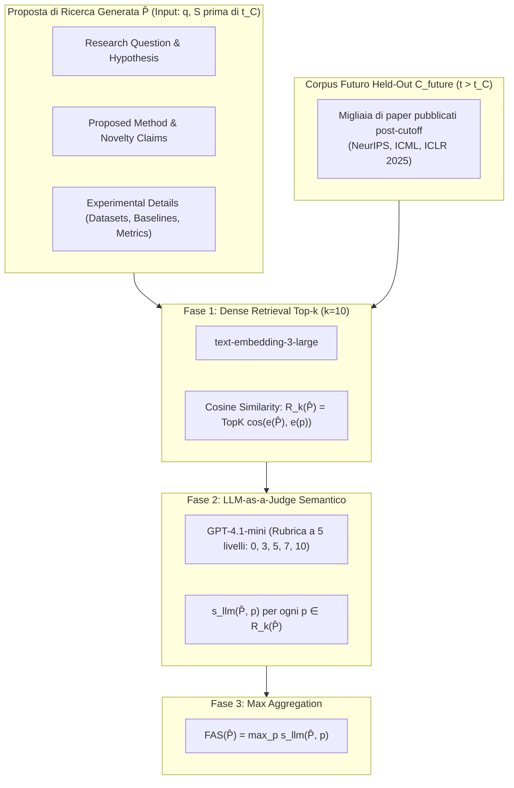

---
tags: [future-alignment-score, evaluation-metrics, scientific-forecasting, semantic-alignment, llm-evaluation, verifiable-surrogates, scientific-discovery]
source_papers: ["2603.27146v3.pdf"]
---

# Future Alignment Score (FAS)

## Definizione Operativa
- Metrica di valutazione oggettiva e automatica introdotta da Heng Wang et al. (UIUC, 2026) per quantificare la qualità delle proposte di ricerca generate da [[large-language-models]]. Il FAS misura il grado di **allineamento semantico tra una proposta scientifica strutturata $\hat{P}$** (prodotta a partire da letteratura antecedente a una data di cutoff $t_C$) e gli **articoli scientifici reali pubblicati dalla comunità umana in un corpus futuro $\mathcal{C}_{\text{future}}$ ($t > t_C$)**.
- **Principio di Verifica Oggettiva:** Sostituisce i giudizi soggettivi basati su preferenze estetiche o novità generica con un principio di corrispondenza storica (*grounded in future publications*). Se una proposta anticipa fedelmente traiettorie che la comunità scientifica ha successivamente esplorato e validato attraverso pubblicazioni peer-reviewed, essa dimostra di possedere una fondatezza metodologica e concettuale non casuale.
- **Utilità Metodologica e Paralleli Clinici/CBT:** Oltre alla ricerca informatica, il principio del FAS offre un paradigma per la validazione predittiva di piani di intervento psicoterapeutico e protocolli di case conceptualization: valutare se le ipotesi cliniche o i compiti comportamentali formulati da un agente predicano accuratamente i progressi o le difficoltà emergenti registrate in sessioni cliniche successive.

---

## Evidenze dalla Letteratura

### 1. Inquadramento Teorico: La Difficoltà di Valutare l'Ideazione Scientifica
- **Assenza di Ground-Truth Univoco:** Nelle attività scientifiche aperte, non esiste una risposta "corretta" prefissata come nei benchmark di question answering. La bontà di un'ipotesi si misura sulla sua capacità di aprire nuove linee di indagine feconde e tecnicamente solide (Wang et al., 2024a; Si et al., 2025).
- **Fallimento dei Giudici Tradizionali e Costo della Human Evaluation:** I giudici basati su LLM non calibrati soffrono di bias di verbosità (*verbosity bias*) e allineamento superficiale. D'altra parte, reclutare esperti di settore per valutare centinaia di proposte richiede mesi di lavoro ed è soggetto a forte disaccordo tra pari (Si et al., 2026a).
- **Il FAS come Surrogato Verificabile (*Verifiable Surrogate*):** Il FAS non pretende di essere una misura esaustiva di ogni sfaccettatura dell'ingegno scientifico, ma fornisce un segnale automatico, scalabile e temporalmente rigoroso per guidare l'addestramento e il benchmarking di modelli generativi (Wang et al., 2026).

---

### 2. Formulazione Matematica e Scelte di Design

#### A. Algoritmo di Calcolo
Dato un tempo di cutoff $t_C$, il corpus futuro è $\mathcal{C}_{\text{future}} = \{p \in \mathcal{C} \mid t_p > t_C\}$. Per una proposta $\hat{P}$:
1. **Recupero Denso Top-$k$:**
   $$R_k(\hat{P}) = \text{TopK}_{p \in \mathcal{C}_{\text{future}}} \cos\big(e(\hat{P}), e(p)\big)$$
   con $k=10$ ed $e(\cdot)$ calcolato tramite `text-embedding-3-large`.
2. **Scoring Semantico Multi-Livello:**
   Un giudice $s_{\text{llm}}(\hat{P}, p) \in [0, 10]$ valuta la similarità concettuale secondo la rubrica:
   - $0$: Completamente slegato (*completely unrelated*).
   - $3$: Stessa macro-area ma focus specifico differente (*same broad area, different focus*).
   - $5$: Correlato con sovrapposizione di idee chiave (*related with overlapping ideas*).
   - $7$: Direzione di ricerca fortemente analoga (*very similar direction*).
   - $10$: Quasi identico (*nearly identical*).
3. **Aggregazione per Massimo (*Max Aggregation*):**
   $$\text{FAS}(\hat{P}) = \max_{p \in R_k(\hat{P})} s_{\text{llm}}(\hat{P}, p)$$

#### B. Rationale della Max Aggregation vs Media
La formulazione scientifica è intrinsecamente un problema di predizione *one-of-many*: una proposta brillante è quella che anticipa anche solo **un singolo paper rivoluzionario**, indipendentemente da quanti altri paper nella stessa area stiano seguendo strade diverse.
- Se si utilizzasse la media $\frac{1}{k}\sum s_{\text{llm}}$, verrebbero favorite proposte generiche e banali posizionate al centroide della letteratura (es. "applicare trasformatori a dati multimodali"), penalizzando le idee metodologicamente affilate e specifiche.
- L'operatore $\max$ premia invece la precisione predittiva di singole traiettorie emergenti.

---

### 3. Decomposizione Component-Level FAS
Poiché le proposte generate seguono uno schema rigidamente strutturato, il FAS viene calcolato sia globalmente sia disaggregato per ciascuna componente:
- **FAS-Hypothesis:** Misura quanto l'ipotesi teorica anticipi le scoperte o le congetture validate nel futuro.
- **FAS-Method:** Valuta se l'algoritmo o l'architettura tecnica proposta corrisponda a soluzioni effettivamente implementate.
- **FAS-Novelty:** Quantifica la capacità del modello di rivendicare innovazioni rispetto allo stato dell'arte che si riveleranno realmente originali.
- **FAS-Experiment:** Misura la precisione nella previsione dei benchmark, dataset e protocolli di test futuri.

---

### 4. Risultati Empirici e Proprietà di Robustezza

#### A. Guadagni Sperimentali su Modelli SFT (Wang et al., 2026)
| Modello | Baseline Prompting | SFT + Stepwise CoT | Incremento Relativo |
| :--- | :---: | :---: | :---: |
| **Qwen2.5-14B-Instruct** | 63.0 | **69.7** | **+10.6%** |
| **Qwen2.5-7B-Instruct** | 63.6 | **66.5** | **+4.6%** |
| **Llama-3.1-8B-Instruct** | 62.1 | **65.3** | **+5.2%** |

I guadagni maggiori si registrano su **Hypothesis** (fino a 71.4) e **Proposed Method** (fino a 63.5), mentre la pianificazione sperimentale (*Experiment Details*, 56.7) si conferma la sfida più ardua per gli LLM.

#### B. Robustezza e Accordo tra Giudici (Inter-Judge Agreement)
- **Variazione di $k$:** Il passaggio da $k=10$ a $k=5$ produce punteggi quasi identici ($6.94$ vs $6.93$) con correlazione altissima ($r = 0.946, \rho = 0.931$), dimostrando che i candidati più rilevanti si concentrano stabilmente nelle prime 5 posizioni.
- **Accordo tra Giudici di Fascia Differente:** Il confronto tra GPT-4.1-mini, GPT-4o-mini e GPT-5-mini evidenzia un accordo dell'**86%–99% entro 1 punto** di scarto e preserva identica la graduatoria dei modelli (`Stepwise CoT > Monolithic CoT > Prompting`), con correlazioni di Pearson $r \ge 0.80$.

---

### 5. Limiti e Compensazioni Metodologiche
1. **Bias verso la Scienza Incrementale e Ricombinativa:** Essendo ancorato alle pubblicazioni accettate nelle conferenze top-tier, il FAS premia prevalentemente le direzioni di ricerca modali e mainstream. Non è progettato per catturare idee contrarian o scoperte rivoluzionarie *out-of-the-box* che richiedono decenni per essere comprese.
2. **Necessità di Calibrazione Temporale per Disciplina:** L'orizzonte di 1 anno ($2024 \to 2025$) è ideale per il ritmo frenetico dell'Intelligenza Artificiale, ma deve essere esteso a 3–5 anni per discipline a ciclo lungo (medicina, biologia molecolare, fisica teorica).
3. **Integrazione con Metriche Complementari:** Nelle applicazioni pratiche, gli autori raccomandano di associare al FAS indicatori di novità intrinseca, diversità e fattibilità empirica.

---

## Riferimenti Bibliografici
- Wang, H., Jiang, P., Sun, J., Shi, Z., Yu, H., Han, J., & Ji, H. (2026). Learning to Predict Future-Aligned Research Proposals with Language Models. *arXiv preprint arXiv:2603.27146v3 [cs.CL]*, 1–31. https://doi.org/10.48550/arXiv.2603.27146
- Ajith, A., Singh, A., DeYoung, J., Kunievsky, N., Kozlowski, A. C., Tafjord, O., Evans, J., Weld, D. S., Hope, T., & Downey, D. (2026). Prescience: A benchmark for forecasting scientific contributions. *arXiv preprint arXiv:2602.20459*.
- Si, C., Yang, D., & Hashimoto, T. (2025). Can LLMs generate novel research ideas? A large-scale human study with 100+ NLP researchers. In *The Thirteenth International Conference on Learning Representations (ICLR 2025)*.
- Si, C., Hashimoto, T., & Yang, D. (2026a). The ideation-execution gap: Execution outcomes of LLM-generated versus human research ideas. In *The Fourteenth International Conference on Learning Representations (ICLR 2026)*.
- Wang, Q., Downey, D., Ji, H., & Hope, T. (2024a). SciMON: Scientific inspiration machines optimized for novelty. In *Proceedings of ACL 2024*, 279–299.

---

## Relazioni
- Vedi anche: [[2603.27146v3]], [[stepwise-cot]], [[time-sliced-scientific-forecasting]], [[hypothesis-generation]], [[hybrid-ai-research-workflows]], [[large-language-models]], [[structured-literature-reviews]], [[llm-assisted-synthesis]], [[wang-et-al-2026]]
