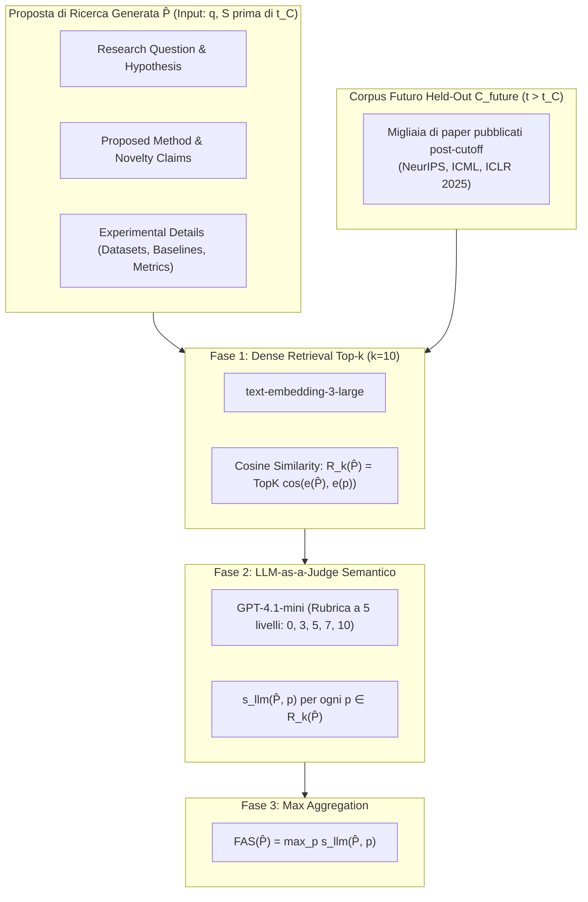

# Future Alignment Score (FAS)

## Definizione Operativa
- Metrica di valutazione oggettiva e automatica introdotta da Heng Wang et al. (UIUC, 2026) per quantificare la qualità delle proposte di ricerca generate da [[large-language-models]]. Il FAS misura il grado di **allineamento semantico tra una proposta scientifica strutturata $\hat{P}$** (prodotta a partire da letteratura antecedente a una data di cutoff $t_C$) e gli **articoli scientifici reali pubblicati dalla comunità umana in un corpus futuro $\mathcal{C}_{\text{future}}$ ($t > t_C$)**.
- **Principio di Verifica Oggettiva:** Sostituisce i giudizi soggettivi basati su preferenze estetiche o novità generica con un principio di corrispondenza storica (*grounded in future publications*). Se una proposta anticipa fedelmente traiettorie che la comunità scientifica ha successivamente esplorato e validato attraverso pubblicazioni peer-reviewed, essa dimostra di possedere una fondatezza metodologica e concettuale non casuale.
- **Utilità Metodologica e Paralleli Clinici/CBT:** Oltre alla ricerca informatica, il principio del FAS offre un paradigma per la validazione predittiva di piani di intervento psicoterapeutico e protocolli di case conceptualization: valutare se le ipotesi cliniche o i compiti comportamentali formulati da un agente predicano accuratamente i progressi o le difficoltà emergenti registrate in sessioni cliniche successive.

## Evidenze dalla Letteratura

### 1. Inquadramento Teorico
- **Assenza di Ground-Truth Univoco:** Nelle attività scientifiche aperte, non esiste una risposta "corretta" prefissata. La bontà di un'ipotesi si misura sulla sua capacità di aprire nuove linee di indagine feconde e tecnicamente solide (Wang et al., 2024a; Si et al., 2025).
- **Fallimento dei Giudici Tradizionali:** I giudici basati su LLM non calibrati soffrono di bias di verbosità. Reclutare esperti richiede tempo ed è soggetto a forte disaccordo (Si et al., 2026a).
- **Il FAS come Surrogato Verificabile:** Fornisce un segnale automatico, scalabile e temporalmente rigoroso per guidare l'addestramento (Wang et al., 2026).

### 2. Formulazione Matematica
Dato un tempo di cutoff $t_C$, il corpus futuro è $\mathcal{C}_{\text{future}} = \{p \in \mathcal{C} \mid t_p > t_C\}$. Per una proposta $\hat{P}$:
1. **Recupero Denso Top-$k$:** $R_k(\hat{P}) = \text{TopK}_{p \in \mathcal{C}_{\text{future}}} \cos\big(e(\hat{P}), e(p)\big)$ ($k=10$).
2. **Scoring Semantico:** $s_{\text{llm}}(\hat{P}, p) \in [0, 10]$ con rubrica crescente (0: slegato, 10: identico).
3. **Aggregazione:** $\text{FAS}(\hat{P}) = \max_{p \in R_k(\hat{P})} s_{\text{llm}}(\hat{P}, p)$.
- **Rationale Max Aggregation:** Premia la capacità di anticipare almeno una traiettoria rivoluzionaria, evitando il bias verso la banalità generica della media.

### 3. Decomposizione e Risultati
- **Componenti:** FAS-Hypothesis, FAS-Method, FAS-Novelty, FAS-Experiment.
- **Robustezza:** Correlazione alta tra giudici e stabilità al variare di $k$.

### 4. Limiti
1. **Bias verso Scienza Incrementale:** Premia il mainstream, non le idee contrarian.
2. **Calibrazione Temporale:** Necessita adattamento per discipline a ciclo lungo (medicina, fisica).
3. **Integrazione:** Da affiancare a metriche di novità intrinseca.

**Riferimenti Bibliografici:**
- Wang, H., Jiang, P., Sun, J., Shi, Z., Yu, H., Han, J., & Ji, H. (2026). Learning to Predict Future-Aligned Research Proposals with Language Models. *arXiv preprint arXiv:2603.27146v3 [cs.CL]*.
- Ajith, A., et al. (2026). Prescience: A benchmark for forecasting scientific contributions. *arXiv preprint arXiv:2602.20459*.
- Si, C., Yang, D., & Hashimoto, T. (2025). Can LLMs generate novel research ideas? In *ICLR 2025*.
- Si, C., Hashimoto, T., & Yang, D. (2026a). The ideation-execution gap. In *ICLR 2026*.
- Wang, Q., et al. (2024a). SciMON: Scientific inspiration machines optimized for novelty. In *Proceedings of ACL 2024*.

## Relazioni
- Vedi anche: [[2603-27146v3]], [[stepwise-cot]], [[time-sliced-scientific-forecasting]], [[hypothesis-generation]], [[hybrid-ai-research-workflows]], [[large-language-models]], [[structured-literature-reviews]], [[llm-assisted-synthesis]], [[wang-et-al-2026]]
