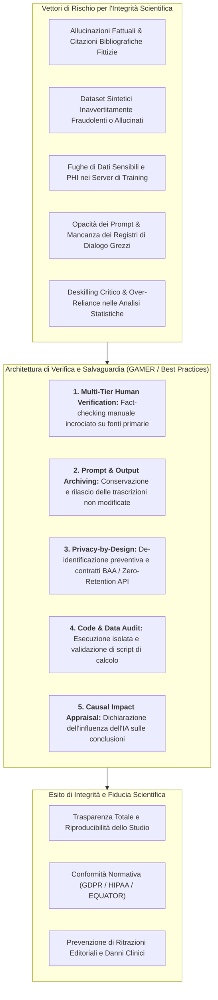

# GAI Research Integrity and Verification in Medical Science

## Definizione Operativa
Il paradigma di **GAI Research Integrity and Verification** (Integrità della Ricerca e Verifica dei Contenuti generati da IA) definisce l'insieme sistematico di protocolli operativi, controlli metodologici e standard etico-deontologici necessari a garantire l'accuratezza fattuale, la riproducibilità scientifica e la conformità normativa nell'impiego di strumenti di Intelligenza Artificiale Generativa (LLM, Large Visual Models, agenti multimodali) nella ricerca biomedica e psicologica (Luo et al., 2025; *BMJ Evidence-Based Medicine*).

- **Principio Fondante di Responsabilità Autoriale Collettiva (*Author Collective Responsibility*):** Poiché i sistemi di IA generativa operano su basi predittivo-probabilistiche prive di comprensione semantica, intenzione morale o soggettività giuridica, l'IA non può essere designata co-autrice di alcuno studio. Gli autori umani assumono la responsabilità integrale, solidale e non delegabile per l'autenticità di tutti i dati, il codice di analisi, le citazioni bibliografiche e le interpretazioni cliniche prodotte con l'ausilio di tali tecnologie.
- **Utilità Clinica e di Metodologia della Ricerca:** Previene la diffusione nella letteratura scientifica di allucinazioni fattuali, referenze bibliografiche inesistenti (*phantom citations*), codici statistici contenenti bug subdoli e dataset sintetici fraudolenti, tutelando contestualmente i dati sanitari protetti (*Protected Health Information - PHI*) e la riservatezza dei pazienti.

## Evidenze dalla Letteratura

### Vettori di Rischio
I rischi principali includono:
- **Allucinazioni Fattuali e Fabbricazione di Citazioni:** Gli LLM ottimizzano la coerenza statistica e linguistica anziché la verità referenziale, generando citazioni inesistenti o distorcendo dosaggi e linee guida (Kacena et al., 2024).
- **Generazione di Dati Sintetici e Rischi di Frode Involontaria:** L'uso di modelli generativi per creare coorti di controllo sintetiche, se non validato contro distribuzioni empiriche, mina la credibilità delle evidenze (Naddaf, 2023).
- **Context Leakage e Fughe di PHI:** L'immissione di dati sanitari in interfacce commerciali espone i pazienti a rischi di memorizzazione (Wu et al., 2024; Zhou et al., 2024).
- **Opacità di Prompting e Crisi di Riproducibilità:** La mancanza di registri dei prompt, versioni dei checkpoint e iperparametri rende gli esperimenti basati su GAI irriproducibili (Luo et al., 2025).

### Protocolli e Standard (GAMER)
- **Human Verification:** Verifica bibliografica puntuale su database primari e validazione manuale dei codici generati (Luo et al., 2025; Ordak, 2024).
- **Audit Trail:** Necessità di archiviare prompt, trascrizioni grezze e log di raffinamento in repository Open Science.
- **Privacy-by-Design:** Applicazione del principio di minimizzazione dei dati, rimozione degli identificatori HIPAA e uso di modelli *on-premise* o API enterprise (Flanagin et al., 2024).
- **Valutazione d'Impatto:** Documentazione esplicita su come l'IA ha influenzato l'interpretazione dei risultati e la formulazione delle conclusioni.

**Riferimenti Bibliografici:**
- Luo, X., Tham, Y. C., Giuffrè, M., et al. (2025). Reporting guideline for the use of Generative Artificial intelligence tools in MEdical Research: the GAMER Statement. *BMJ Evidence-Based Medicine*, 30(6), 390–400. https://doi.org/10.1136/bmjebm-2025-113825
- Naddaf, M. (2023). ChatGPT generates fake data set to support scientific hypothesis. *Nature*, 623(7989), 895–896.
- Kacena, M. A., Plotkin, L. I., & Fehrenbacher, J. C. (2024). The Use of Artificial Intelligence in Writing Scientific Review Articles. *Current Osteoporosis Reports*, 22(1), 115–121.
- Anderson, N., Belavy, D. L., Perle, S. M., et al. (2023). AI did not write this manuscript, or did it? Can we trick the AI text detector into generated texts? The potential future of ChatGPT and AI in Sports & Exercise Medicine manuscript generation. *BMJ Open Sport & Exercise Medicine*, 9(1), e001568.
- Wu, X., Duan, R., & Ni, J. (2024). Unveiling security, privacy, and ethical concerns of ChatGPT. *Journal of Information and Intelligence*, 2(2), 102–115.
- Zhou, J., Müller, H., Holzinger, A., et al. (2024). Ethical ChatGPT: Concerns, Challenges, and Commandments. *Electronics*, 13(17), 3417.
- Ordak, M. (2024). Using ChatGPT in Statistical Analysis: Recommendations for JACC Journals. *JACC: Advances*, 3(1), 100776.
- Flanagin, A., Pirracchio, R., Khera, R., et al. (2024). Reporting Use of AI in Research and Scholarly Publication—JAMA Network Guidance. *JAMA*, 331(13), 1096–1098.

## Relazioni
- [[gamer2025-1]]
- [[gamer-reporting-guideline]]
- [[chart-reporting-guideline]]
- [[elevate-genai-framework]]
- [[ai-research-ethics]]
- [[gdpr-governance-mental-health-ai]]
- [[human-in-the-reasoning]]
- [[large-language-models]]
- [[prompting-in-psychology]]
- [[generative-ai-in-research]]
