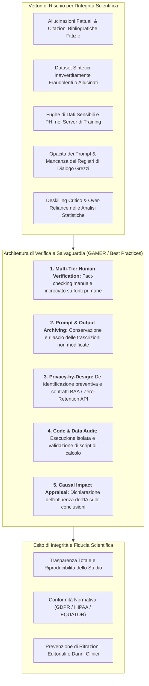
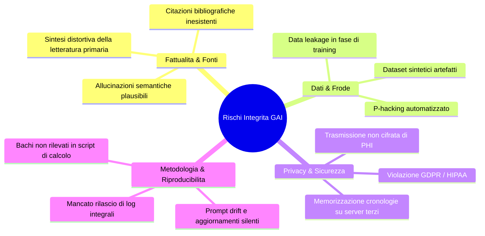

# GAI Research Integrity and Verification in Medical Science

## Definizione Operativa
- Il paradigma di **GAI Research Integrity and Verification** (Integrità della Ricerca e Verifica dei Contenuti generati da IA) definisce l'insieme sistematico di protocolli operativi, controlli metodologici e standard etico-deontologici necessari a garantire l'accuratezza fattuale, la riproducibilità scientifica e la conformità normativa nell'impiego di strumenti di Intelligenza Artificiale Generativa (LLM, Large Visual Models, agenti multimodali) nella ricerca biomedica e psicologica (Luo et al., 2025; *BMJ Evidence-Based Medicine*).
- **Principio Fondante di Responsabilità Autoriale Collettiva (*Author Collective Responsibility*):** Poiché i sistemi di IA generativa operano su basi predittivo-probabilistiche prive di comprensione semantica, intenzione morale o soggettività giuridica, l'IA non può essere designata co-autrice di alcuno studio. Gli autori umani assumono la responsabilità integrale, solidale e non delegabile per l'autenticità di tutti i dati, il codice di analisi, le citazioni bibliografiche e le interpretazioni cliniche prodotte con l'ausilio di tali tecnologie.
- **Utilità Clinica e di Metodologia della Ricerca:** Previene la diffusione nella letteratura scientifica di allucinazioni fattuali, referenze bibliografiche inesistenti (*phantom citations*), codici statistici contenenti bug subdoli e dataset sintetici fraudolenti, tutelando contestualmente i dati sanitari protetti (*Protected Health Information - PHI*) e la riservatezza dei pazienti.

---

## Vettori di Rischio per l'Integrità Scientifica nell'Era della GenAI

### 1. Allucinazioni Fattuali e Fabbricazione di Citazioni
- Gli LLM ottimizzano la coerenza statistica e linguistica del testo anziché la verità referenziale. In ambito medico, ciò genera frequentemente:
  - *Citazioni allucinate plausibili:* Articoli scientifici con titoli verosimili, PMID o DOI fittizi o attribuiti a ricercatori di rilievo che non hanno mai pubblicato tali lavori (Kacena et al., 2024).
  - *Distorsione di dosaggi e linee guida:* Sintesi apparentemente autorevoli che omettono controindicazioni critiche o alterano posologie farmacologiche.

### 2. Generazione di Dati Sintetici e Rischi di Frode Involontaria
- L'impiego di modelli generativi per l'imputazione di dati mancanti o per la creazione di coorti di controllo sintetiche comporta il rischio di fabbricare pattern numerici privi di fondamento biologico (Naddaf, 2023). Se non esplicitamente dichiarati e validati contro distribuzioni empiriche reali, tali dataset minano la credibilità dell'intera base di evidenze.

### 3. Context Leakage e Fughe di Dati Sanitari Protetti (PHI)
- L'immissione di vignette cliniche, trascrizioni di colloqui terapeutici, referti istologici o immagini diagnostiche in interfacce web commerciali di LLM (senza accordi BAA o opzioni di opt-out per il retraining) espone i dati dei pazienti a memorizzazione e potenziale estrazione tramite tecniche di *data extraction attack* (Wu et al., 2024; Zhou et al., 2024).

### 4. Opacità di Prompting e Crisi di Riproducibilità
- La mancata registrazione dei prompt esatti, dei system instructions, delle versioni di checkpoint (es. `gpt-4o-2024-05-13` vs `gpt-4o`) e degli iperparametri (temperatura, top-p) rende gli esperimenti basati su GAI intrinsecamente irriproducibili da ricercatori indipendenti (Luo et al., 2025).

---

## Protocolli di Verifica e Salvaguardia Metodologica (Standard GAMER)

```mermaid
flowchart LR
    subgraph FaseInput ["1. Controllo Input & Privacy"]
        I1["De-identificazione rigorosa (Criteri Safe Harbor / GDPR)"]
        I2["Uso di API con crittografia & Zero Data Retention"]
        I3["Archiviazione versionata dei prompt e system instructions"]
    end

    subgraph FaseElaborazione ["2. Esecuzione & Tracciamento"]
        E1["Fissazione temperatura (es. temp=0 per determinismo)"]
        E2["Salvataggio log integrali delle risposte grezze (*Unedited*)"]
        E3["Isolamento sessioni per prevenire *context leakage*"]
    end

    subgraph FaseVerifica ["3. Human-in-the-Loop Audit"]
        V1["Fact-checking 100% delle citazioni bibliografiche su PubMed/Crossref"]
        V2["Ispezione manuale riga per riga di codice R/Python generato"]
        V3["Valutazione di coerenza clinico-metodologica"]
    end

    FaseInput --> FaseElaborazione --> FaseVerifica
```

### 1. Protocollo di Human Verification e Fact-Checking Multilivello (Item 7 GAMER)
1. **Verifica Bibliografica Puntuale:** Ciascuna referenza generata o suggerita dalla GAI deve essere reperita manualmente nel database primario (PubMed, Scopus, Web of Science, DOI Resolver) per accertarne l'esistenza, gli autori corretti, l'anno e l'effettiva concordanza con l'affermazione testuale.
2. **Validazione di Codice e Algoritmi:** Qualsiasi script di analisi statistica (es. modelli di regressione, meta-analisi, trasformazione matriciale) generato da GAI deve essere testato su dataset di controllo sintetici noti prima dell'applicazione ai dati sperimentali.
3. **Controllo di Coerenza Semantica:** Gli autori devono rileggere criticamente i testi revisionati dalla GAI per accertarsi che il *polishing* stilistico non abbia introdotto alterazioni concettuali o attenuato affermazioni di cautela epistemica (*hedging*).

### 2. Conservazione dei Log e Rilascio delle Risposte Grezze (Item 3 GAMER)
- Gli autori devono istituire un archivio di audit trail contenente:
  - Tutti i prompt iniziali e i prompt di follow-up/raffinamento.
  - Le trascrizioni complete e grezze generate dal modello (*unedited responses*), senza correzioni umane a posteriori.
  - Tali record devono essere caricati come file di testo/JSON nei materiali supplementari della pubblicazione o su repository Open Science certificati (OSF, Zenodo).

### 3. Procedure di Anonimizzazione e Privacy-by-Design (Item 8 GAMER)
- Applicazione del principio di minimizzazione dei dati prima di qualsiasi query.
- Rimozione di tutti i 18 identificatori diretti e indiretti definiti dallo standard HIPAA Safe Harbor e conformità alle direttive GDPR per i dati di categoria particolare (art. 9 GDPR).
- Impiego preferenziale di modelli open-weights eseguiti in locale (*on-premise*) o di endpoint API enterprise con garanzie contrattuali che vietino l'uso dei dati trasmessi per l'addestramento continuo.

### 4. Valutazione d'Impatto Causale su Risultati e Conclusioni (Item 9 GAMER)
- Gli autori devono documentare in modo esplicito nella discussione o nelle conclusioni dell'articolo:
  - In quale misura i suggerimenti della GAI abbiano indirizzato la selezione dei test statistici, l'interpretazione fisiopatologica o la formulazione delle raccomandazioni cliniche.
  - I limiti intrinseci legati all'uso di strumenti probabilistici e le cautele adottate per evitare bias di conferma o sovrastima di efficacia.

---

## Riferimenti Bibliografici
- Luo, X., Tham, Y. C., Giuffrè, M., et al. (2025). Reporting guideline for the use of Generative Artificial intelligence tools in MEdical Research: the GAMER Statement. *BMJ Evidence-Based Medicine*, 30(6), 390–400. https://doi.org/10.1136/bmjebm-2025-113825
- Naddaf, M. (2023). ChatGPT generates fake data set to support scientific hypothesis. *Nature*, 623(7989), 895–896.
- Kacena, M. A., Plotkin, L. I., & Fehrenbacher, J. C. (2024). The Use of Artificial Intelligence in Writing Scientific Review Articles. *Current Osteoporosis Reports*, 22(1), 115–121.
- Anderson, N., Belavy, D. L., Perle, S. M., et al. (2023). AI did not write this manuscript, or did it? Can we trick the AI text detector into generated texts? The potential future of ChatGPT and AI in Sports & Exercise Medicine manuscript generation. *BMJ Open Sport & Exercise Medicine*, 9(1), e001568.
- Wu, X., Duan, R., & Ni, J. (2024). Unveiling security, privacy, and ethical concerns of ChatGPT. *Journal of Information and Intelligence*, 2(2), 102–115.
- Zhou, J., Müller, H., Holzinger, A., et al. (2024). Ethical ChatGPT: Concerns, Challenges, and Commandments. *Electronics*, 13(17), 3417.
- Ordak, M. (2024). Using ChatGPT in Statistical Analysis: Recommendations for JACC Journals. *JACC: Advances*, 3(1), 100776.
- Flanagin, A., Pirracchio, R., Khera, R., et al. (2024). Reporting Use of AI in Research and Scholarly Publication—JAMA Network Guidance. *JAMA*, 331(13), 1096–1098.

---

## Related pages
- [[GAMER2025]]
- [[gamer-reporting-guideline]]
- [[chart-reporting-guideline]]
- [[elevate-genai-framework]]
- [[ai-research-ethics]]
- [[gdpr-governance-mental-health-ai]]
- [[human-in-the-reasoning]]
- [[large-language-models]]
- [[prompting-in-psychology]]
- [[generative-ai-in-research]]
