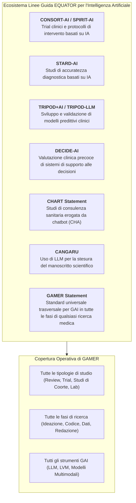
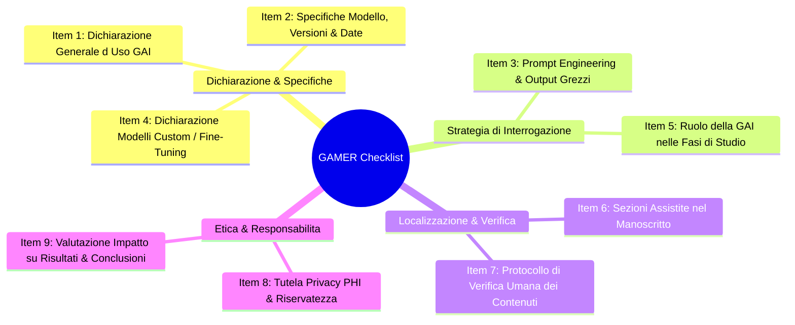
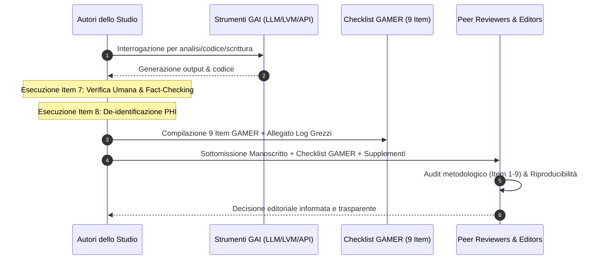

# GAMER Reporting Guideline (Generative Artificial Intelligence Tools in MEdical Research)

## Definizione Operativa
- Il **GAMER Reporting Guideline** (*Generative Artificial intelligence tools in MEdical Research*) è lo standard metodologico internazionale registrato presso l'**EQUATOR Network** (*Enhancing the QUAlity and Transparency Of health Research*) progettato per guidare, uniformare e verificare la rendicontazione trasparente dell'uso di strumenti di intelligenza artificiale generativa (GAI) nella ricerca biomedica e clinica (Luo et al., 2025; *BMJ Evidence-Based Medicine*, doi: 10.1136/bmjebm-2025-113825).
- **Consenso Globale e Ambito Trasversale:** Sviluppato da un panel multidisciplinare di **51 esperti internazionali provenienti da 26 paesi** mediante un processo Delphi a doppio round e consensus meeting sincroni, GAMER si caratterizza per una portata universale: a differenza di linee guida vincolate a specifici disegni di studio (es. trial clinici in CONSORT-AI, accuratezza diagnostica in STARD-AI, modelli predittivi in TRIPOD-LLM), GAMER si applica a **qualsiasi disegno di ricerca** (revisioni sistematiche, meta-analisi, studi osservazionali, trial clinici, protocolli di laboratorio, studi bioinformatici) e a **tutte le fasi operative** (ideazione, disegno sperimentale, coding, estrazione/trasformazione dati, scrittura e revisione del manoscritto).
- **Architettura a 9 Item:** La checklist si articola in 9 item essenziali che coprono la dichiarazione d'uso, le specifiche e il versioning del modello, il prompt engineering e il rilascio dei prompt/risposte grezzi, l'eventuale fine-tuning di modelli personalizzati, i ruoli operativi, le sezioni manoscritte assistite, il protocollo di verifica umana dei contenuti, la salvaguardia della privacy dei dati sanitari (PHI) e la stima dell'impatto su risultati e conclusioni.

---

## I 9 Domini Metodologici della Checklist GAMER

### 1. Dichiarazione Generale d'Uso (Item 1)
- **Requisito:** Dichiarare esplicitamente se sono stati impiegati strumenti di IA generativa (es. LLM, Large Visual Models, generatori di immagini/audio) in qualsiasi fase della ricerca o nella stesura del manoscritto.
- **Eccezioni:** Non include strumenti dedicati esclusivamente alla traduzione linguistica automatica (es. Google Translate) o motori di ricerca convenzionali.
- **Flusso Condizionale:** Se la risposta è "No", la compilazione dei restanti item della checklist decade.

### 2. Specifiche del Modello, Versioning e Coordinate Temporali (Item 2)
- **Identificatori Tecnici:** Nome commerciale completo, sviluppatore, numero di versione univoco o identificatore di checkpoint (es. `gpt-4o-2024-05-13`, `claude-3-5-sonnet-20240620`, `gemini-1.5-pro`).
- **Canale di Accesso:** Dichiarare se l'interrogazione è avvenuta tramite interfaccia web consumer (con memoria di sessione) oppure via chiamate API batch dirette.
- **Finestra Temporale:** Indicare il giorno/periodo esatto di utilizzo (data di inizio e fine delle interrogazioni) per controllare l'effetto del *model drift* e degli aggiornamenti silenti dei pesi da parte dei provider.
- **Iperparametri Operativi:** Documentare temperatura (es. `temp=0` per massima riproducibilità deterministica), top-p, context window length e system prompts configurati.

### 3. Prompt Engineering e Trascrizioni Grezze (*Unedited Responses*) (Item 3)
- **Tecniche di Prompting:** Dettagliare la strategia adottata (zero-shot, few-shot prompting, chain-of-thought, prompt iterativi a spirale, template standardizzati).
- **Rilascio Integrale:** Obbligo di fornire il testo completo dei prompt e **tutte le risposte grezze non modificate (*unedited responses*)** come materiale supplementare o in repository aperti (OSF, GitHub, Zenodo), garantendo la piena riproducibilità scientifica.

### 4. Sviluppo di Nuovi Modelli e Fine-Tuning (Item 4)
- **Tracciabilità dei Modelli Derivati:** Se i ricercatori hanno sviluppato, riaddestrato o raffinato un modello personalizzato per il loro studio clinico, devono riportare il modello base originario (nome, licenza, parametri es. `LLaMA-3-70B`, `BigBird`, `YOLOv7`).
- **Pipeline di Training:** Documentare la composizione e provenienza del dataset di fine-tuning (es. cartelle cliniche de-identificate, note di dimissione), le tecniche di ottimizzazione (LoRA, QLoRA, full parameter fine-tuning) e gli iperparametri di addestramento.

### 5. Ruolo Operativo della GAI nelle Fasi di Studio (Item 5)
- **Mappatura delle Funzioni:** Esplicitare le mansioni delegate all'IA in ogni fase della ricerca:
  1. *Ideazione e Ipotesi:* Generazione di idee concettuali o formulazione di quesiti PICO.
  2. *Progettazione del Protocollo:* Strutturazione metodologica e criteri di inclusione/esclusione.
  3. *Generazione di Codice:* Scrittura di script di analisi statistica (R, Python), pipeline bioinformatiche o web scraping.
  4. *Estrazione e Trasformazione Dati:* Tabulazione di note cliniche narrative, estrazione di covariate da paper scientifici.
  5. *Redazione e Polishing:* Stesura di bozze testuali, sintesi di paragrafi o correzione orto-sintattica.

### 6. Sezioni Specifiche del Manoscritto Assistite (Item 6)
- **Mappatura Topografica nel Testo:** Indicare puntualmente quali sezioni, paragrafi, tabelle o figure (es. "Figura 1B generata con DALL-E 3") sono state prodotte o rifinite tramite GAI.
- **Nota di Flessibilità:** Se lo strumento è stato impiegato esclusivamente per la correzione grammaticale globale dell'intero testo (*proofreading*), non è necessario elencare i singoli paragrafi.

### 7. Protocollo di Verifica dei Contenuti e Modifiche (Item 7)
- **Human-in-the-Loop Obbligatorio:** Delineare la procedura con cui gli autori umani hanno verificato la fattualità delle informazioni generate.
- **Fact-Checking delle Citazioni:** Controllo sistematico dell'esistenza reale e della pertinenza delle referenze bibliografiche per prevenire l'inclusione di fonti allucinate.
- **Verifica del Codice e dei Dati:** Audit manuale del codice statistico e dei calcoli quantitativi generati dall'AI prima della loro esecuzione su dataset reali.

### 8. Tutela della Privacy e Riservatezza dei Dati (Item 8)
- **Protezione PHI (*Protected Health Information*):** Descrizione delle misure adottate per prevenire l'immissione di dati personali o sanitari non de-identificati nelle interfacce web commerciali di LLM.
- **Compliance Normativa:** Garanzie di conformità al GDPR (Regolamento UE 2016/679) e all'HIPAA (es. contratti BAA *Business Associate Agreement* con i cloud provider che escludano l'impiego dei prompt per il riaddestramento dei modelli).

### 9. Impatto su Risultati, Accuratezza e Conclusioni (Item 9)
- **Valutazione Critica Post-hoc:** Analisi trasparente di come la GAI possa aver condizionato l'interpretazione dei risultati, l'accuratezza diagnostico-statistica o le conclusioni finali.
- **Principio di Responsabilità Autoriale Collettiva:** Riaffermazione che l'IA non può essere considerata co-autrice e che tutti gli autori umani rispondono solidalmente di ogni errore, omissione o distorsione presente nell'articolo.

---

## Matrice di Confronto: GAMER vs Altre Reporting Guidelines per l'IA

| Dimensione | GAMER (2025) | CONSORT-AI / SPIRIT-AI (2020) | TRIPOD-LLM (2025) | CHART (2025) | CANGARU (2023) |
| :--- | :--- | :--- | :--- | :--- | :--- |
| **Disegno di Studio** | **Tutti i tipi di studio (universale)** | Trial clinici randomizzati (RCT) | Modelli predittivi clinici | Studi di Chatbot Health Advice (CHA) | Redazione manoscritta generale |
| **Fasi Coperte** | **Tutte (ideazione, coding, dati, testo)** | Protocollo e conduzione trial | Sviluppo e validazione modello | Valutazione performance chatbot | Redazione del manoscritto |
| **Tecnologia Focus** | **GAI (LLM, LVM, multimodale)** | Qualsiasi intervento basato su IA | LLM per predizione clinica | Chatbot conversazionali LLM | ChatGPT / LLM per scrittura |
| **Output Grezzi** | **Richiesti (materiali supplementari)** | Dati aggregati di trial | Matrici di calibrazione/ROC | Trascrizioni integrali query | Opzionali / non standardizzati |
| **Verifica Umana** | **Item 7 dedicato & esplicito** | Endpoint di sicurezza clinica | Validazione metrica statistica | Blinding e expert scoring | Responsabilità autoriale generica |

---

## Workflow Operativo per Autori, Revisori ed Editor

---

## Riferimenti Bibliografici
- Luo, X., Tham, Y. C., Giuffrè, M., et al. (2025). Reporting guideline for the use of Generative Artificial intelligence tools in MEdical Research: the GAMER Statement. *BMJ Evidence-Based Medicine*, 30(6), 390–400. https://doi.org/10.1136/bmjebm-2025-113825
- Luo, X., Tham, Y. C., Daher, M., et al. (2024). Protocol for developing the reporting guideline for the use of chatbots and other Generative Artificial intelligence tools in MEdical Research (GAMER). *medRxiv* / *BMJ Open*, 14, e081155.
- Collins, G. S., Moons, K. G. M., Dhiman, P., et al. (2024). TRIPOD+AI statement: updated guidance for reporting clinical prediction models that use regression or machine learning methods. *BMJ*, 385, e078378.
- Gallifant, J., Afshar, M., Ameen, S., et al. (2025). The TRIPOD-LLM reporting guideline for studies using large language models. *Nature Medicine*, 31(1), 60–69.
- Liu, X., Cruz Rivera, S., Moher, D., et al. (2020). Reporting guidelines for clinical trial reports for interventions involving artificial intelligence: the CONSORT-AI extension. *Nature Medicine*, 26(9), 1364–1374.
- The CHART Collaborative (Huo, B., Guyatt, G. H., et al.). (2025). Reporting guideline for chatbot health advice studies: The CHART Statement. *JAMA Network Open*, 8(8), e2530220.

---

## Related pages
- [[GAMER2025]]
- [[gai-research-integrity-and-verification]]
- [[chart-reporting-guideline]]
- [[elevate-genai-framework]]
- [[ai-research-ethics]]
- [[generative-ai-in-research]]
- [[prompting-in-psychology]]
- [[large-language-models]]
- [[gdpr-governance-mental-health-ai]]
- [[human-in-the-reasoning]]
