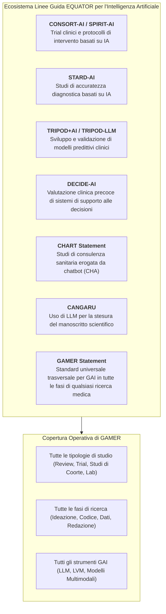
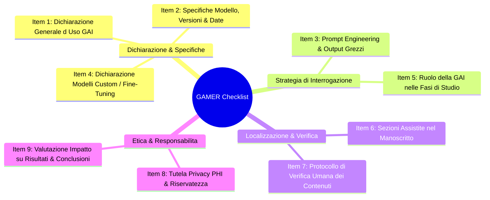

# GAMER Reporting Guideline (Generative Artificial Intelligence Tools in MEdical Research)

## Definizione Operativa
- Il **GAMER Reporting Guideline** (*Generative Artificial intelligence tools in MEdical Research*) è lo standard metodologico internazionale registrato presso l'**EQUATOR Network** (*Enhancing the QUAlity and Transparency Of health Research*) progettato per guidare, uniformare e verificare la rendicontazione trasparente dell'uso di strumenti di intelligenza artificiale generativa (GAI) nella ricerca biomedica e clinica (Luo et al., 2025; *BMJ Evidence-Based Medicine*, doi: 10.1136/bmjebm-2025-113825).
- **Consenso Globale e Ambito Trasversale:** Sviluppato da un panel multidisciplinare di **51 esperti internazionali provenienti da 26 paesi** mediante un processo Delphi a doppio round e consensus meeting sincroni, GAMER si caratterizza per una portata universale: a differenza di linee guida vincolate a specifici disegni di studio (es. trial clinici in CONSORT-AI, accuratezza diagnostica in STARD-AI, modelli predittivi in TRIPOD-LLM), GAMER si applica a **qualsiasi disegno di ricerca** (revisioni sistematiche, meta-analisi, studi osservazionali, trial clinici, protocolli di laboratorio, studi bioinformatici) e a **tutte le fasi operative** (ideazione, disegno sperimentale, coding, estrazione/trasformazione dati, scrittura e revisione del manoscritto).
- **Architettura a 9 Item:** La checklist si articola in 9 item essenziali che coprono la dichiarazione d'uso, le specifiche e il versioning del modello, il prompt engineering e il rilascio dei prompt/risposte grezzi, l'eventuale fine-tuning di modelli personalizzati, i ruoli operativi, le sezioni manoscritte assistite, il protocollo di verifica umana dei contenuti, la salvaguardia della privacy dei dati sanitari (PHI) e la stima dell'impatto su risultati e conclusioni.

## Evidenze dalla Letteratura
Il GAMER Statement (Luo et al., 2025) rappresenta l'apice dell'attuale sforzo internazionale per mitigare i rischi associati all'uso non trasparente delle GAI nella ricerca clinica. La letteratura corrente evidenzia come, senza linee guida rigorose, l'integrazione di LLM comporti rischi sistematici:
1.  **Allucinazioni bibliografiche:** Creazione di referenze inesistenti (Item 7).
2.  **Bias metodologici:** Distorsioni introdotte da prompt non standardizzati o modelli non documentati (Item 2, 3).
3.  **Violazioni di Privacy:** Esposizione accidentale di PHI in interfacce cloud pubbliche (Item 8).
4.  **Riproducibilità:** Impossibilità di replicare analisi basate su output GAI (Item 3, 4).

L'impatto di GAMER è validato dal suo confronto con altre linee guida di settore (CONSORT-AI, TRIPOD-LLM, CHART, CANGARU), posizionandosi come il framework di riferimento per l'intero ciclo di vita della ricerca.

### I 9 Domini Metodologici della Checklist GAMER

### Dettaglio Checklist
- **1. Dichiarazione Generale d'Uso (Item 1):** Esplicitare l'impiego di GAI.
- **2. Specifiche del Modello (Item 2):** Versione, sviluppatore, data, iperparametri.
- **3. Prompt Engineering & Output Grezzi (Item 3):** Strategia di prompting e rilascio materiale integrale.
- **4. Fine-Tuning (Item 4):** Tracciabilità modelli custom e dataset di training.
- **5. Ruolo Operativo (Item 5):** Mappatura fasi assistite (Ideazione, Analisi, Scrittura).
- **6. Sezioni Manoscritto (Item 6):** Identificazione topografica delle parti assistite.
- **7. Verifica Umana (Item 7):** Fact-checking obbligatorio e audit del codice.
- **8. Privacy (Item 8):** Protezione PHI e compliance (GDPR/HIPAA).
- **9. Impatto (Item 9):** Valutazione critica post-hoc su risultati e conclusioni.

**Riferimenti Bibliografici:**
- Luo, X., Tham, Y. C., Giuffrè, M., et al. (2025). Reporting guideline for the use of Generative Artificial intelligence tools in MEdical Research: the GAMER Statement. *BMJ Evidence-Based Medicine*, 30(6), 390–400. https://doi.org/10.1136/bmjebm-2025-113825
- Luo, X., Tham, Y. C., Daher, M., et al. (2024). Protocol for developing the reporting guideline for the use of chatbots and other Generative Artificial intelligence tools in MEdical Research (GAMER). *medRxiv* / *BMJ Open*, 14, e081155.
- Collins, G. S., Moons, K. G. M., Dhiman, P., et al. (2024). TRIPOD+AI statement: updated guidance for reporting clinical prediction models that use regression or machine learning methods. *BMJ*, 385, e078378.
- Gallifant, J., Afshar, M., Ameen, S., et al. (2025). The TRIPOD-LLM reporting guideline for studies using large language models. *Nature Medicine*, 31(1), 60–69.
- Liu, X., Cruz Rivera, S., Moher, D., et al. (2020). Reporting guidelines for clinical trial reports for interventions involving artificial intelligence: the CONSORT-AI extension. *Nature Medicine*, 26(9), 1364–1374.
- The CHART Collaborative (Huo, B., Guyatt, G. H., et al.). (2025). Reporting guideline for chatbot health advice studies: The CHART Statement. *JAMA Network Open*, 8(8), e2530220.

## Relazioni
- [[gamer2025-1]]
- [[gai-research-integrity-and-verification]]
- [[chart-reporting-guideline]]
- [[elevate-genai-framework]]
- [[ai-research-ethics]]
- [[generative-ai-in-research]]
- [[prompting-in-psychology]]
- [[large-language-models]]
- [[gdpr-governance-mental-health-ai]]
- [[human-in-the-reasoning]]
