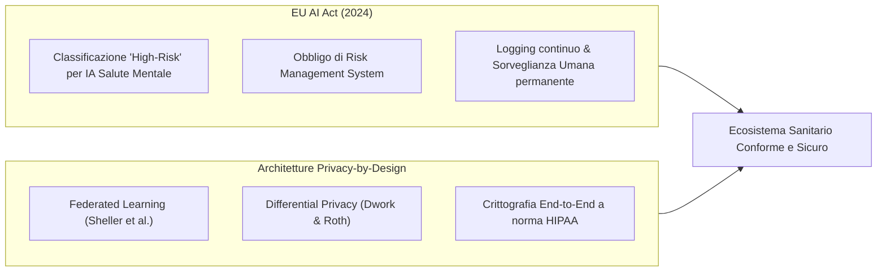

# GDPR Governance e Protezione Dati nell'IA per la Salute Mentale

## Definizione Operativa
- Framework di conformità giuridico-regolatoria basato sul **Regolamento Generale sulla Protezione dei Dati (GDPR - Regolamento UE 2016/679)**, sull'**HIPAA** statunitense e sull'**EU AI Act (2024)**, applicato alle tecnologie di intelligenza artificiale nella salute mentale (Kandeel et al., 2026).
- **Tensione Strutturale:** L'IA clinica richiede grandi moli di dati longitudinali ad altissima risoluzione (trascritti di colloqui, registrazioni vocali, metriche fisiologiche da wearable, post social, cartelle cliniche), mentre i dati psichiatrici costituiscono la categoria di informazioni personali più sensibile, soggetta a gravissimi rischi di stigmatizzazione sociale, discriminazione assicurativo-lavorativa e violazione dell'intimità.

```mermaid
flowchart TD
    subgraph GDPR_Principles ["Principi Fondamentali GDPR (Artt. 5 e 9)"]
        P1["Art. 9: Divieto Trattamento Dati Sensibili / Eccezione Consenso Esplicito"]
        P2["Art. 5.1.a: Liceità, Correttezza e Trasparenza (Right to Explanation)"]
        P3["Art. 5.1.b: Limitazione delle Finalità (Divieto di Purpose Creep Commerciale)"]
        P4["Art. 5.1.c: Minimizzazione dei Dati (Raccolta strettamente necessaria)"]
        P5["Art. 5.1.d/e: Esattezza & Limitazione della Conservazione (Storage Limits)"]
    end

    subgraph CriticalVulnerabilities ["Vulnerabilità Evidenziate nella Letteratura"]
        V1["Solo il 17% degli studi tratta formalmente la conformità regolatoria"]
        V2["45% delle app di salute mentale prive di crittografia a norma HIPAA"]
        V3["60% delle app condivide dati sanitari con terze parti pubblicitarie (Caso BetterHelp)"]
        V4["De-anonimizzazione: Rocher et al. dimostrano re-identificazione via ZIP code/metadati"]
        V5["Area grigia social media: Raccolta massiva post senza consenso informato"]
    end

    subgraph TechnicalSolutions ["Soluzioni Tecnologiche Privacy-Preserving"]
        T1["Federated Learning: Addestramento decentralizzato senza scambio dati grezzi"]
        T2["Differential Privacy: Rumore statistico calibrato matematicamente"]
        T3["Data Retention Limits: Cancellazione log a 30 giorni (best-practice Woebot)"]
        T4["EU AI Act High-Risk: Audit indipendenti terzi e logging continuo"]
    end

    GDPR_Principles --> CriticalVulnerabilities
    CriticalVulnerabilities --> TechnicalSolutions
```

---

## Analisi Giuridica dei Vincoli del GDPR

### 1. Dati Particolari e Consenso Esplicito (Articolo 9 GDPR)
- I dati relativi alla salute mentale, i parametri biometrici e i profili genetici costituiscono *"categorie particolari di dati personali"* (Art. 9.1 GDPR), il cui trattamento è vietato in linea di principio, salvo deroga per consenso esplicito, salvaguardia di interessi vitali o ricerca scientifica protetta da adeguate misure di garanzia (Art. 9.2).
- **Criticità:** Molti studi di screening NLP su social network (Twitter/X, Reddit) acquisiscono dati senza richiedere consenso esplicito, operando in una zona grigia che espone a rischi popolazioni fragili e adolescenti (D'Alfonso et al., 2025; Kandeel et al., 2026).

### 2. Limitazione delle Finalità e *"Purpose Creep"* (Articolo 5.1.b GDPR)
- I dati conferiti per scopi terapeutici o di autovalutazione non possono essere utilizzati per scopi secondari non autorizzati.
- **Lo Scandalo BetterHelp:** Caso paradigmatico in cui una delle maggiori piattaforme di teleterapia ha ceduto informazioni sanitarie intime degli utenti (risposte a questionari psicologici ed e-mail) a Facebook, Pinterest e Snapchat per micro-targeting pubblicitario, violando radicalmente le promesse contrattuali di riservatezza (Martinez-Martin & Kreitmair, 2018).

### 3. Minimizzazione dei Dati e Conservazione Limitata (Articoli 5.1.c e 5.1.e)
- Le piattaforme devono raccogliere solo i dati strettamente necessari. Strumenti di *digital phenotyping* tramite sensori wearable tendono a raccogliere continuamente geolocalizzazione e tracciati fisiologici non necessari.
- **Best Practice di Conservazione:** Applicazioni come **Woebot** impongono un limite di conservazione dei dati pari a 30 giorni con immediata anonimizzazione dei log conversazionali (Darcy et al., 2021).

### 4. Il Rischio di Re-identificazione dei Dati Sanitari
- Rocher et al. (2019) hanno dimostrato che il 99.98% degli individui americani può essere ri-identificato in qualsiasi dataset "anonimizzato" utilizzando appena 15 attributi demografici e metadati ausiliari (come codice postale/ZIP code, data di nascita e genere). L'anonimizzazione puramente nominale è quindi insufficiente a garantire la sicurezza.

---

## Standard Industriali, EU AI Act e Soluzioni Tecniche

1. **Classificazione High-Risk (EU AI Act 2024):** Poiché l'IA in salute mentale impatta direttamente su diritti fondamentali, sicurezza e benessere psicologico, è soggetta a rigorosa conformità pre-market, audit di non discriminazione e monitoraggio post-marketing.
2. **Federated Learning:** Addestra i modelli spostando i pesi algoritmici tra i server ospedalieri periferici senza che i dati grezzi dei pazienti lascino mai i nodi locali sicuri (Sheller et al., 2020).
3. **Differential Privacy:** Aggiunge rumore statistico calibrato ai gradienti e ai dati aggregati, impedendo matematicamente attacchi di estrazione o re-identificazione (Dwork & Roth, 2014).

---

**Riferimenti Bibliografici:**
- Kandeel, M. E., Abo Hamza, E. G., Abouahmed, A., et al. (2026). AI Applications Integrating Legal and Regulatory Perspectives in Mental Health: Systematic Review. *JMIR AI*, 5, e84305. https://doi.org/10.2196/84305
- Benjamens, S., Dhunnoo, P., & Meskó, B. (2020). The state of artificial intelligence-based FDA-approved medical devices and algorithms. *npj Digital Medicine*, 3(1), 60–64.
- D'Alfonso, S., Coghlan, S., Schmidt, S., & Mangelsdorf, S. (2025). Ethical dimensions of digital phenotyping within the context of mental healthcare. *J Technol Behav Sci*, 10(1), 132–147.
- Dwork, C., & Roth, A. (2014). The algorithmic foundations of differential privacy. *Found Trends Theor Comput Sci*, 9(3-4), 211–487.
- Martinez-Martin, N., & Kreitmair, K. (2018). Ethical issues for direct-to-consumer digital psychotherapy apps. *JMIR Ment Health*, 5(2), e32.
- Rocher, L., Hendrickx, J. M., & de Montjoye, Y. A. (2019). Estimating the success of re-identifications in incomplete datasets using generative models. *Nat Commun*, 10(1), 3069.
- Sheller, M. J., Edwards, B., Reina, G. A., et al. (2020). Federated learning in medicine: facilitating multi-institutional collaborations without sharing patient data. *Sci Rep*, 10(1), 12598.

---

## Relazioni
- Vedi anche: [[ai-v5-e84305]], [[algorithmic-paternalism-in-ai-mental-health]], [[three-layer-governance-framework]], [[software-as-a-medical-device-salute-mentale]], [[audit-bias-llm-clinici]], [[ai-research-ethics]], [[five-axis-clinical-evaluation]], [[modello-centauro-clinico]]
