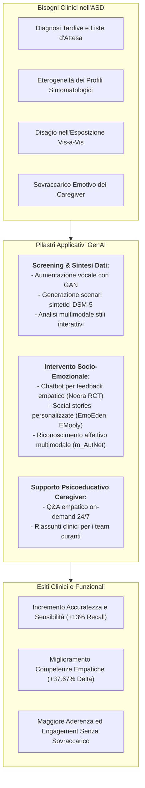

# GenAI in Autism Spectrum Disorders (Applicazioni dell'IA Generativa nello Spettro Autistico)

## Definizione Operativa
- Insieme di metodologie e architetture computazionali generative (Large Language Models, Generative Adversarial Networks, modelli multimodali Vision-Language, agenti robotici e realtà aumentata) impiegate per automatizzare, scalare e personalizzare lo screening precoce, la valutazione diagnostica, l'intervento socio-emotivo e il supporto psicoeducativo ai caregiver nei disturbi dello spettro autistico (Sohn et al., 2025).
- **Utilità CBT:** Consente allo psicoterapeuta dell'età evolutiva e dell'adulto di creare ambienti di apprendimento socio-relazionale altamente adattivi (storie sociali dinamiche, simulatori di conversazione empatica, decodifica pragmatica real-time), superando la rigidità dei materiali cartacei tradizionali e riducendo l'ansia da esposizione sociale diretta.

---

## Evidenze dalla Letteratura

### 1. Efficacia Clinica e Metriche nei Trial Sperimentali
- **Training Empatico con Feedback Generativo:** In uno studio randomizzato controllato su 30 adolescenti e adulti con ASD, l'uso del chatbot generativo Noora (basato su GPT-4) ha prodotto un miglioramento medio del **37.67%** nelle risposte empatiche corrette rispetto al 2.53% del gruppo di controllo in lista d'attesa, con una generalizzazione positiva nelle interazioni sociali quotidiane (Koegel et al., 2025).
- **Apprendimento Socio-Emotivo con Realtà Aumentata (AR):** L'integrazione di storie sociali generate da GPT-3.5/4 all'interno di un'applicazione AR (EMooly) ha consentito a bambini autistici di ottenere un incremento significativo nei punteggi dei quiz di riconoscimento emotivo (+1.50 su 10 punti vs -0.41 nel controllo tradizionale), aumentando il coinvolgimento collaborativo con il genitore (Lyu et al., 2024).
- **Riconoscimento Emotivo Multimodale:** L'architettura m_AutNet (che fonde reti CNN facciali, audio e allineamento Wasserstein GAN) ha raggiunto l'**88.25% di accuratezza** nel tracciamento degli stati affettivi in bambini con comportamenti motori stereotipati, superando i sistemi unimodali convenzionali (Kurian & Tripathi, 2025).
- **Aumentazione di Dati Clinici Rari:** L'impiego di GPT-3.5/4 per sintetizzare 4.200 manifestazioni comportamentali coerenti con il DSM-5 ha migliorato la recall dei modelli di classificazione clinica (BioBERT) del **+13%**, dimostrando il potenziale dei modelli generativi nel colmare la scarsità di dataset clinici annotati (Woolsey et al., 2024).
- **Supporto Psicoeducativo ai Caregiver ed Empatia Percepita:** Nel confronto tra medici specialisti e modelli linguistici (ChatGPT-4 ed ERNIE Bot) su 239 quesiti di consultazione online, ChatGPT ha ottenuto punteggi statisticamente superiori nell'espressione empatica (+0.51 su scala Likert a 5 punti), offrendo una risorsa scalabile per rassicurare e guidare le famiglie (He et al., 2024).

---

### 2. Limiti Tecnici, Bias e Rischi Specifici Documentati
- **Superiorità dei Modelli Specialistici rispetto ai VLM Generici:** Nella codifica automatizzata degli stili di interazione genitore-bambino (FOS-II), modelli specialistici multimodali dedicati (AV-FOS) hanno superato GPT-4V, evidenziando che i modelli generalisti *zero-shot* difettano di ancoraggio clinico fine su compiti diagnostici complessi (Zhao et al., 2025; Sohn et al., 2025).
- **Allucinazioni Semantiche e Rumore nei Dati Sintetici:** Sebbene la generazione di dati sintetici aumenti la sensibilità diagnostica, essa può introdurre una riduzione della precisione (-16%) a causa di pattern spurie o descrizioni cliniche stereotipate (Woolsey et al., 2024).
- **Mancanza di Trasparenza nei Processi Decisionali (Black Box):** Gli LLM non rendono esplicite le caratteristiche linguistiche o paralinguistiche specifiche che motivano una determinata stima di rischio, limitando la fiducia del clinico e l'adozione nei percorsi diagnostici ufficiali (Sohn et al., 2025; Adilakshmi et al., 2023).
- **Rischio di Dipendenza Tecnologica e Vulnerabilità Pediatrica:** I minori con ASD possono interpretare i prompt dell'IA in modo iper-letterale o sviluppare attaccamento disfunzionale; è necessaria la costante supervisione clinica e il rispetto del consenso dinamico del minore (Sohn et al., 2025; Torous et al., 2021).

---

## Riferimenti Bibliografici
- Sohn, J.-S., Lee, E., Kim, J.-J., Oh, H.-K., & Kim, E. (2025). Implementation of generative AI for the assessment and treatment of autism spectrum disorders: a scoping review. *Frontiers in Psychiatry*, 16, 1628216. https://doi.org/10.3389/fpsyt.2025.1628216
- Deng, J., Cummins, N., Schmitt, M., Qian, K., Ringeval, F., & Schuller, B. (2017). Speech-based diagnosis of autism spectrum condition by generative adversarial network representations. In *Proceedings of the 2017 International Conference on Digital Health* (pp. 53–57). ACM. https://doi.org/10.1145/3079452.3079463
- He, W., Zhang, W., Jin, Y., Zhou, Q., Zhang, H., & Xia, Q. (2024). Physician versus large language model chatbot responses to web-based questions from autistic patients in Chinese: cross-sectional comparative analysis. *Journal of Medical Internet Research*, 26, e54706. https://doi.org/10.2196/54706
- Koegel, L. K., Ponder, E., Bruzzese, T., Wang, M., Semnani, S. J., Chi, N., et al. (2025). Using artificial intelligence to improve empathetic statements in autistic adolescents and adults: A randomized clinical trial. *Journal of Autism and Developmental Disorders*. https://doi.org/10.1007/s10803-025-06734-x
- Kurian, A., & Tripathi, S. (2025). M_AutNet–a framework for personalized multimodal emotion recognition in autistic children. *IEEE Access*, 13, 1651–1662. https://doi.org/10.1109/ACCESS.2024.3403087
- Lyu, Y., Liu, D., An, P., Tong, X., Zhang, H., Katsuragawa, K., et al. (2024). EMooly: supporting autistic children in collaborative social-emotional learning with caregiver participation through interactive AI-infused and AR activities. *Proceedings of the ACM on Interactive, Mobile, Wearable and Ubiquitous Technologies*, 8(3), 1–36. https://doi.org/10.1145/3699738
- Woolsey, C. R., Bisht, P., Rothman, J., & Leroy, G. (2024). Utilizing large language models to generate synthetic data to increase the performance of BERT-based neural networks. *Proceedings of the AMIA Joint Summits on Translational Science*, 2024, 429–438.
- Zhao, Z., Chung, E., Chung, K. M., & Park, C. H. (2025). AV-FOS: A transformer-based audio-visual multi-modal interaction style recognition for children with autism based on the family observation schedule (FOS-II). *IEEE Journal of Biomedical and Health Informatics*. https://doi.org/10.1109/JBHI.2025.3542066

---

## Relazioni
- Vedi anche: [[fpsyt-16-1628216]], [[embedded-ethics-interface]], [[ai-assistive-autism-communication]], [[simulazione-pazienti-ai]], [[applied-theory-of-mind-llm]], [[conversational-agents-mental-health]], [[digital-therapeutics-ai]], [[synthetic-psychopathology]]
