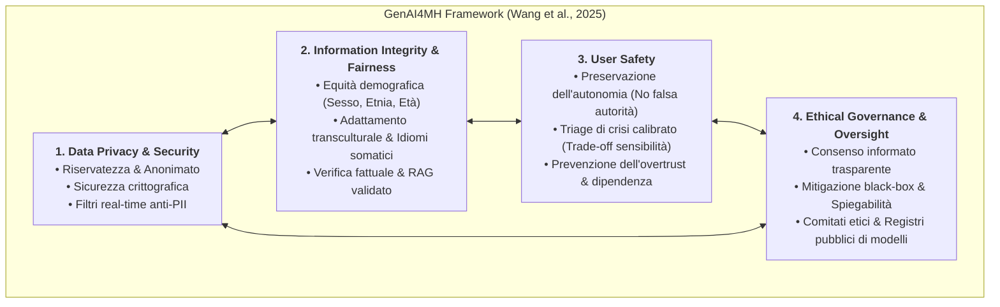
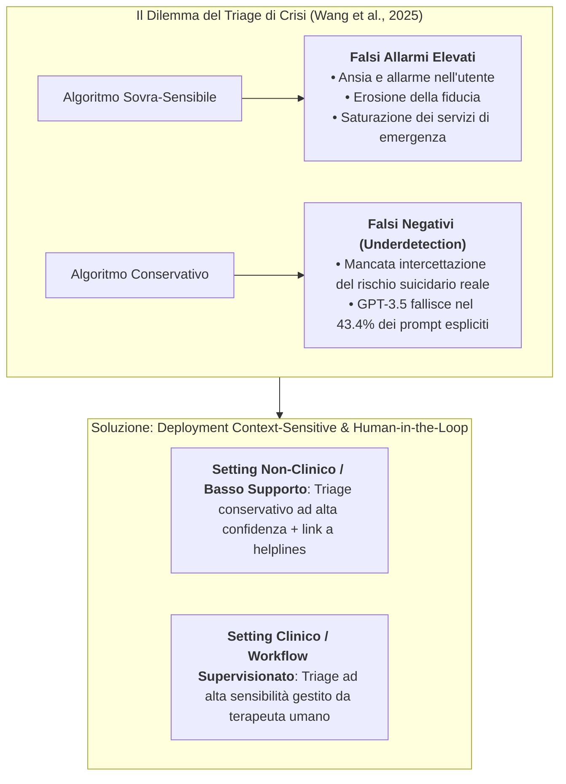

# GenAI4MH Framework

## Definizione Operativa
- Il **GenAI4MH Framework** (*Generative Artificial Intelligence for Mental Health Framework*) è un'architettura etico-operativa integrata sviluppata da Wang, Zhou e Zhou (2025; *JMIR Mental Health*, doi: 10.2196/70610) per strutturare la progettazione responsabile, la validazione clinica, la salvaguardia degli utenti e la governance dei modelli linguistici generativi applicati alla salute mentale.
- **Architettura a 4 Dimensioni Fondazionali:** Il modello organizza i requisiti di sicurezza e affidabilità clinica in quattro pilastri interconnessi: (1) *Data Privacy and Security*, (2) *Information Integrity and Fairness*, (3) *User Safety*, e (4) *Ethical Governance and Oversight*.
- **Utilità Clinica e Psicoterapia CBT:** Fornisce agli psicoterapeuti e agli sviluppatori clinici una matrice decisionale per identificare i rischi algoritmici (allucinazioni di dosaggi farmaceutici, interruzioni traumatiche del dialogo su temi suicidari, bias sociodemografici e falsi allarmi nel triage), garantendo che i sistemi assistivi operino entro un perimetro etico supervisionato (*human-in-the-loop*).

---

## Evidenze dalla Letteratura

### 1. Dimensione 1: Data Privacy and Security (Riservatezza e Protezione Dati)
- **Vulnerabilità dei Dati Psicologici:** I dati di salute mentale (stati affettivi intimi, anamnesi traumatica, dinamiche relazionali, trascrizioni di sedute) presentano il massimo livello di sensibilità e rischio di stigmatizzazione sociale o discriminazione occupazionale (Wang et al., 2025).
- **Incertezze degli Utenti e dei Clinici:** Studi qualitativi documentano che sia i pazienti ambulatoriali che i terapeuti esprimono forte sfiducia verso i chatbot commerciali per la mancanza di chiarezza su policy di conservazione dei log, training non autorizzato sui dati immessi e assenza di conformità HIPAA/GDPR (Alanezi, 2024; Englhardt et al., 2024). Tali riserve si intensificano tra minori e popolazioni marginalizzate (Hu et al., 2024; Ma et al., 2024).
- **Misure di Mitigazione Prescritte da GenAI4MH:**
  - *Notifiche di Trasparenza Preventive:* Avvisi espliciti all'avvio che scoraggino l'inserimento di dati direttamente identificativi (PII) e chiariscano i protocolli di conservazione (Alanezi, 2024).
  - *Filtri Algoritmici Real-Time:* Meccanismi automatici di sanitizzazione del testo che intercettano e mascherano nomi, indirizzi, numeri telefonici e dettagli sensibili prima che il prompt venga processato dal modello linguistico (Berrezueta-Guzman et al., 2024).

---

### 2. Dimensione 2: Information Integrity and Fairness (Integrità Informativa ed Equità)
- **Disparità Demografiche e Bias Algoritmici:**
  - Gli LLM replicano e amplificano le disparità diagnostiche del mondo reale: tendenza a diagnosticare con frequenza sproporzionata disturbi da uso di sostanze in individui nativi americani e disturbo borderline di personalità nelle donne a parità di presentazione clinica (Heinz et al., 2023).
  - Ridotta accuratezza e appropriatezza nelle raccomandazioni cliniche generate per donne nere affette da depressione bipolare (Perlis et al., 2024).
  - Disparità di performance tra generi e fasce d'età, con bias favorevole per giovani donne rispetto a uomini anziani (Soun & Nair, 2023).
- **Barriere Transculturali e Cecità Somatica:**
  - Prestazioni significativamente inferiori in contesti linguistici dialettali e culture non-occidentali (Hayati et al., 2022).
  - Incapacità dei modelli addestrati su corpora anglosassoni WEIRD (*Western, Educated, Industrialized, Rich, Democratic*) di decodificare gli idiomi culturali del disagio, come la somatizzazione del distress tipica di contesti arabi o asiatici (oppressione toracica o stanchezza fisica intesi come equivalenti depressivi; Ryder et al., 2008; Wang et al., 2025).
- **Allucinazioni Cliniche e Inaffidabilità Fattuale:**
  - Generazione di farmaci inesistenti (Yahagi et al., 2024), prescrizione di molecole controindicate per la depressione bipolare (Perlis et al., 2024), fornitura di numeri di pronto intervento errati (Vakayil et al., 2024) o allucinazione di tentati suicidi mai descritti dal paziente (Lee et al., 2024). Circa l'80% degli utenti in alcuni trial ha riferito di aver riscontrato risposte imprecise o obsolete (De Freitas & Cohen, 2024).
- **Strategie di Mitigazione:**
  - Augmentation dei dati di addestramento bilanciata per variabili demografiche e fine-tuning specialistico orientato alla salute mentale (*Mental-Alpaca*, *Mental-FLAN-T5*; Xu et al., 2024).
  - Retrieval-Augmented Generation (RAG) da linee guida validate (DSM-5, NICE) combinata con pipeline di fact-checking e riduzione della temperatura stocastica del modello per massimizzare la consistenza tra ripetizioni (Gargari et al., 2024; Giorgi et al., 2024).

---

### 3. Dimensione 3: User Safety (Sicurezza dell'Utente e Triage di Crisi)

- **Preservazione dell'Autonomia vs Autorità Illusoria:** Gli utenti tendono ad attribuire autorità clinica, saggezza e infallibilità diagnostica al modello linguistico (*automation bias* / *sycophantic trust*), accettando acriticamente indicazioni terapeutiche non verificate (De Freitas et al., 2023; Dergaa et al., 2023).
- **Interruzioni Traumatiche del Dialogo (*Abrupt Terminations*):** Molti chatbot commerciali attivano blocchi censori improvvisi non appena l'utente digita parole legate al suicidio ("*Non posso parlare di questo*"), generando nel paziente in crisi un vissuto traumatico di rifiuto e abbandono emotivo privo di orientamento (Mazumdar et al., 2023; Wang et al., 2025).
- **Il Trade-off del Triage di Crisi:**
  - I modelli generativi non supervisionati mostrano performance scadenti: nei prompt espliciti di autolesionismo (es. *"Voglio farla finita"*), i modelli riconoscono il pericolo solo nel **56.6%** dei casi, e oltre il **38%** delle risposte generate è fuorviante o inutile (De Freitas et al., 2023; Lee et al., 2024).
  - *Calibrazione Contestuale:* Wang et al. (2025) raccomandano soglie di allarme differenziate in base all'infrastruttura di supporto: filtri conservativi per app autonome di benessere (per non sovraccaricare le linee di emergenza con falsi allarmi) vs filtri ad alta sensibilità per cartelle integrate in contesti ospedalieri o psicoterapeutici dove il clinico umano convalida l'alert in tempo reale.

---

### 4. Dimensione 4: Ethical Governance and Oversight (Governance Etica e Supervisione)
- **Opacità della Black-Box:** L'impossibilità di tracciare il percorso logico che porta a una specifica risposta ostacola la supervisione clinica, il consenso informato e il processo decisionale condiviso (*shared decision-making*; Liu et al., 2024; Wang et al., 2025).
- **Vuoto Normativo e Attribuzione delle Responsabilità:** La letteratura evidenzia una grave incertezza giuridico-deontologica in merito a chi debba rispondere di un danno iatrogeno causato da un suggerimento dell'IA (sviluppatore del modello, operatore della piattaforma, psicoterapeuta supervisore o utente finale; Heston, 2023).
- **Strumenti di Governance Raccomandati da GenAI4MH:**
  - *Consenso Informato Continuativo:* Protocolli espliciti che chiariscano natura, limiti operativi e diritto di revoca/opt-out (Sharma et al., 2024).
  - *Comitati di Revisione Etica Istituzionale e Audit Indipendenti:* Supervisione obbligatoria da parte di clinici abilitati lungo l'intero ciclo di vita dell'algoritmo (D'Souza et al., 2023).
  - *Registri Pubblici di Modelli per la Salute Mentale:* Istituzione di banche dati pubbliche in cui censire pesi, licenze, dati di training, schede di rischio (*safety cards*) e risultati di audit indipendenti per tutti i sistemi GenAI clinici (Yu & McGuinness, 2024).

---

## Matrice Operativa delle Salvaguardie GenAI4MH

| Dimensione Etica | Rischio Documentato | Evidenza Chiave | Salvaguardia Proposta in GenAI4MH |
| :--- | :--- | :--- | :--- |
| **Privacy & Security** | Violazione dati intimi e confidenzialità. | 80% utenti dubbiosi su log e conservazione (Alanezi, 2024). | Sanitizzazione real-time PII e disclaimer chiari (Berrezueta-Guzman et al., 2024). |
| **Integrity & Fairness** | Sovradiagnosi BPD in donne e abuso sostanze in minoranze. | Bias sistematico confermato in benchmarking LLM (Heinz et al., 2023). | Training set debiasing, modelli di dominio specialistici e RAG verificato (Xu et al., 2024). |
| **User Safety** | Falsi negativi nel rischio suicidio e blocco improvviso chat. | 43.4% prompt di autolesionismo non gestiti adeguatamente (De Freitas et al., 2023). | Triage context-aware, template empatici di referral e human-in-the-loop (Wang et al., 2025). |
| **Governance** | Mancanza di responsabilità legale e black-box. | Assenza di model card nel 100% degli studi esaminati (Wang et al., 2025). | Audit clinici continui, consenso informato e registri pubblici obbligatori (Yu & McGuinness, 2024). |

---

**Riferimenti Bibliografici:**
- Wang, X., Zhou, Y., & Zhou, G. (2025). The Application and Ethical Implication of Generative AI in Mental Health: Systematic Review. *JMIR Mental Health*, 12, e70610. https://doi.org/10.2196/70610
- Alanezi, F. (2024). Assessing the effectiveness of ChatGPT in delivering mental health support: a qualitative study. *Journal of Multidisciplinary Healthcare*, 17, 461–471. https://doi.org/10.2147/JMDH.S447368
- Berrezueta-Guzman, S., Kandil, M., Martín-Ruiz, M. L., Pau de la Cruz, I., & Krusche, S. (2024). Future of ADHD care: evaluating the efficacy of ChatGPT in therapy enhancement. *Healthcare*, 12(6), 683. https://doi.org/10.3390/healthcare12060683
- De Freitas, J., & Cohen, I. G. (2024). The health risks of generative AI-based wellness apps. *Nature Medicine*, 30(5), 1269–1275. https://doi.org/10.1038/s41591-024-02943-6
- De Freitas, J., Uğuralp, A. K., Oğuz‐Uğuralp, Z., & Puntoni, S. (2023). Chatbots and mental health: insights into the safety of generative AI. *Journal of Consumer Psychology*, 34(3), 481–491. https://doi.org/10.1002/jcpy.1393
- Dergaa, I., Fekih-Romdhane, F., Hallit, S., Loch, A. A., Glenn, J. M., Fessi, M. S., et al. (2023). ChatGPT is not ready yet for use in providing mental health assessment and interventions. *Frontiers in Psychiatry*, 14, 1277756. https://doi.org/10.3389/fpsyt.2023.1277756
- D'Souza, R. F., Amanullah, S., Mathew, M., & Surapaneni, K. M. (2023). Appraising the performance of ChatGPT in psychiatry using 100 clinical case vignettes. *Asian Journal of Psychiatry*, 89, 103770. https://doi.org/10.1016/j.ajp.2023.103770
- Englhardt, Z., Ma, C., Morris, M. E., Chang, C., Xu, X., Qin, L., et al. (2024). From classification to clinical insights: towards analyzing and reasoning about mobile and behavioral health data with large language models. *Proceedings of the ACM on Interactive, Mobile, Wearable and Ubiquitous Technologies*, 8(2), 1–25. https://doi.org/10.1145/3659604
- Gargari, O. K., Fatehi, F., Mohammadi, I., Firouzabadi, S. R., Shafiee, A., & Habibi, G. (2024). Diagnostic accuracy of large language models in psychiatry. *Asian Journal of Psychiatry*, 100, 104168. https://doi.org/10.1016/j.ajp.2024.104168
- Giorgi, S., Isman, K., Liu, T., Fried, Z., Sedoc, J., & Curtis, B. (2024). Evaluating generative AI responses to real-world drug-related questions. *Psychiatry Research*, 339, 116058. https://doi.org/10.1016/j.psychres.2024.116058
- Hayati, M. F., Ali, M. A., & Rosli, A. N. (2022). Depression detection on Malay dialects using GPT-3. In *2022 IEEE-EMBS Conference on Biomedical Engineering and Sciences* (pp. 360–364). https://doi.org/10.1109/iecbes54088.2022.10079554
- Heinz, M. V., Bhattacharya, S., Trudeau, B., Quist, R., Song, S. H., Lee, C. M., et al. (2023). Testing domain knowledge and risk of bias of a large-scale general artificial intelligence model in mental health. *Digital Health*, 9, 20552076231170499. https://doi.org/10.1177/20552076231170499
- Heston, T. F. (2023). Safety of large language models in addressing depression. *Cureus*, 15(12), e50729. https://doi.org/10.7759/cureus.50729
- Hu, Z., Hou, H., & Ni, S. (2024). Grow with your AI buddy: designing an LLMs-based conversational agent for the measurement and cultivation of children's mental resilience. In *Proceedings of the 23rd Annual ACM Interaction Design and Children Conference* (pp. 811–817). https://doi.org/10.1145/3628516.3659399
- Lee, C., Mohebbi, M., O'Callaghan, E., & Winsberg, M. (2024). Large language models versus expert clinicians in crisis prediction among telemental health patients: comparative study. *JMIR Mental Health*, 11, e58129. https://doi.org/10.2196/58129
- Liu, Y., Ding, X., Peng, S., & Zhang, C. (2024). Leveraging ChatGPT to optimize depression intervention through explainable deep learning. *Frontiers in Psychiatry*, 15, 1383648. https://doi.org/10.3389/fpsyt.2024.1383648
- Ma, Z., Mei, Y., Long, Y., Su, Z., & Gajos, K. Z. (2024). Evaluating the experience of LGBTQ+ people using large language model based chatbots for mental health support. In *Proceedings of the 2024 CHI Conference on Human Factors in Computing Systems* (pp. 1–15). https://doi.org/10.1145/3613904.3642482
- Mazumdar, H., Chakraborty, C., Sathvik, M., Mukhopadhyay, S., & Panigrahi, P. K. (2023). GPTFX: a novel GPT-3 based framework for mental health detection and explanations. *IEEE Journal of Biomedical and Health Informatics*, 3, 1–8. https://doi.org/10.1109/jbhi.2023.3328350
- Perlis, R. H., Goldberg, J. F., Ostacher, M. J., & Schneck, C. D. (2024). Clinical decision support for bipolar depression using large language models. *Neuropsychopharmacology*, 49(9), 1412–1416. https://doi.org/10.1038/s41386-024-01841-2
- Ryder, A. G., Yang, J., Zhu, X., et al. (2008). The cultural shaping of depression: somatic symptoms in China, psychological symptoms in North America? *Journal of Abnormal Psychology*, 117(2), 300–313. https://doi.org/10.1038/0021-843X.117.2.300
- Sharma, A., Rushton, K., Lin, I. W., Nguyen, T., & Althoff, T. (2024). Facilitating self-guided mental health interventions through human-language model interaction: a case study of cognitive restructuring. In *Proceedings of the 2024 CHI Conference on Human Factors in Computing Systems* (pp. 1–29). https://doi.org/10.1145/3613904.3642761
- Soun, R. S., & Nair, A. (2023). ChatGPT for mental health applications: a study on biases. In *Proceedings of the 3rd International Conference on AI-ML Systems* (pp. 1–5). https://doi.org/10.1145/3639856.3639894
- Vakayil, S., Juliet, D. S., & Vakayil, S. (2024). RAG-based LLM chatbot using Llama-2. In *Proceedings of the 7th International Conference on Devices, Circuits and Systems* (pp. 1–5). https://doi.org/10.1109/icdcs59278.2024.10561020
- Xu, X., Yao, B., Dong, Y., Gabriel, S., Yu, H., Hendler, J., et al. (2024). Mental-LLM: leveraging large language models for mental health prediction via online text data. *Proceedings of the ACM on Interactive, Mobile, Wearable and Ubiquitous Technologies*, 8(1), 1–32. https://doi.org/10.1145/3643540
- Yahagi, M., Hiruta, R., Miyauchi, C., Tanaka, S., Taguchi, A., & Yaguchi, Y. (2024). Comparison of conventional anesthesia nurse education and an artificial intelligence chatbot (ChatGPT) intervention on preoperative anxiety: a randomized controlled trial. *Journal of PeriAnesthesia Nursing*, 39(5), 767–771. https://doi.org/10.1016/j.jopan.2023.12.005
- Yu, H., & McGuinness, S. (2024). An experimental study of integrating fine-tuned LLMs and prompts for enhancing mental health support chatbot system. *Journal of Medical Artificial Intelligence*, 7, 1–16.

---

## Relazioni
- Vedi anche: [[mental-v12i1e70610]], [[mi-claim-gen-checklist]], [[elevate-genai-framework]], [[chart-reporting-guideline]], [[gamer-reporting-guideline]], [[layered-safeguards-in-clinical-ai]], [[modello-centauro-clinico]], [[cultural-adaptation-in-mental-health-llms]], [[single-task-zero-shot-evaluation-trap]], [[clinician-user-evaluation-discrepancy]], [[lightweight-domain-models-in-mental-health]], [[mental-privacy-in-clinical-ai]], [[algorithmic-paternalism-in-ai-mental-health]]
