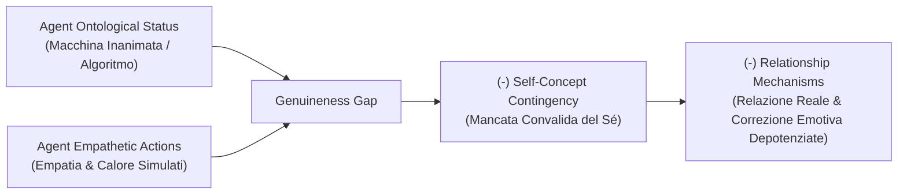

# Genuineness Gap

## Definizione Operativa
- Costrutto teorico introdotto da Herbener e Damholdt (2025) che descrive la frattura psicologica e relazionale tra i comportamenti empatici, calorosi e validanti esibiti da un agente artificiale (LLM o chatbot) e la consapevolezza dell'utente circa la sua natura ontologica di macchina inanimata, governata da pattern statistici e priva di coscienza, stati mentali interni o intenzionalità autentica.
- **Utilità CBT:** Spiega perché l'eccellente fluidità conversazionale ed empatia linguistica di un'IA non siano sufficienti a innescare i fattori comuni di cambiamento (es. connessione relazionale profonda, senso di amabilità e riparazione di schemi disfunzionali interpersonali). Fornisce una giustificazione teorica per riservare gli interventi basati esclusivamente su agenti autonomi a compiti di abilità/psychoeducation e affidare la relazione al terapeuta umano nei modelli blended care.

## Evidenze dalla Letteratura
- **Intersoggettività e Cognizione Sociale Predittiva:** Negli scambi umani, la cognizione sociale inferisce costantemente intenzioni, sentimenti e scopi altrui (*Theory of Mind*, Stern, 2005; Tamir & Thornton, 2018). Con un'entità artificiale non esistono stati interni reali: la consapevolezza di interagire con un dispositivo software riduce la percezione di autenticità (*self-congruence*) e l'efficacia del supporto sociale percepito (Seitz, 2024; Lee & Hahn, 2024).
- **Incompatibilità con la "Real Relationship" (Gelso, 2014):** La relazione terapeutica profonda nel modello contestuale si fonda su due dimensioni: *Genuineness* (esprimersi autenticamente in accordo col proprio Sé) e *Realism* (percezione accurata e befitting dell'altro). Poiché l'IA non possiede un Sé né una volontà propria, i criteri concettuali della relazione reale non possono essere soddisfatti (Herbener & Damholdt, 2025).
- **Reflected Appraisal e Minata Contingenza del Concetto di Sé:** Secondo la teoria del *reflected appraisal* (Sullivan, 1953; Wallace & Tice, 2012), il concetto di Sé si struttura interiorizzando la valutazione che gli altri hanno di noi. Sapere che l'accoglienza del chatbot deriva da un algoritmo vincolato a generare risposte compiacenti e non da un libero giudizio umano di stima rende il Sé del paziente non dipendente da tale riscontro (*decreased self-concept contingency*), vanificando il potenziale di auto-accrescimento dell'autostima.
- **Depotenziamento delle Esperienze Emotive Correttive:** L'esperienza emotiva correttiva (Alexander & French, 1946; Goldfried, 2012) scaturisce dalla disconferma delle aspettative di rifiuto o giudizio negativo da parte di un altro individuo. L'assenza di rischio sociale e la natura artificiale del partner conversazionale indeboliscono la portata trasformativa dell'esperienza.
- **Modulazione dell'Antropomorfismo e Dinamica Dual-Process:** L'antropomorfizzazione (stimolata da solitudine, ansia sociale o corporeità tecnologica) può mascherare temporaneamente il Genuineness Gap attraverso il Sistema 1 (euristico/intuitivo), ma la persistente attivazione del Sistema 2 (analitico/riflessivo) continua a richiamare la natura meccanica dell'agente (Epley et al., 2007; Złotowski et al., 2018; Leichtmann et al., 2025).

**Riferimenti Bibliografici:**
- Herbener, A. B., & Damholdt, M. F. (2025). A Theoretical Framework of the Processes of Change in Psychotherapy Delivered by Artificial Agents. *arXiv preprint arXiv:2509.02144v1 [cs.HC]*.
- Gelso, C. (2014). A tripartite model of the therapeutic relationship: Theory, research, and practice. *Psychotherapy Research*, 24(2), 117–131.
- Sullivan, H. S. (1953). *The interpersonal theory of psychiatry*. W. W. Norton & Co.
- Wallace, H. M., & Tice, D. M. (2012). Reflected appraisal through a 21st-century looking glass. In *Handbook of self and identity* (2nd ed., pp. 124–140). Guilford Press.
- Goldfried, M. R. (2012). The corrective experience: A core principle for therapeutic change. In *Transformation in psychotherapy* (pp. 13–29). American Psychological Association.
- Seitz, L. (2024). Artificial empathy in healthcare chatbots: Does it feel authentic? *Computers in Human Behavior: Artificial Humans*, 2, 100067.

## Relazioni
- Vedi anche: [[2509.02144v1]], [[credibility-gap]], [[processes-of-change-in-psychotherapy]], [[simulated-empathy-vs-authentic-presence]], [[simulated-therapeutic-alliance]], [[digital-therapeutic-alliance]], [[anthropomorphism-in-ai]], [[modello-centauro-clinico]]
