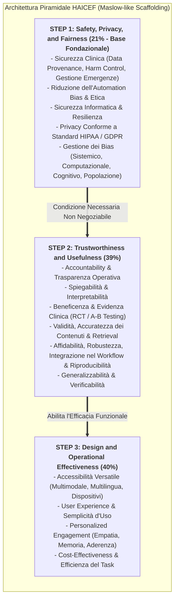
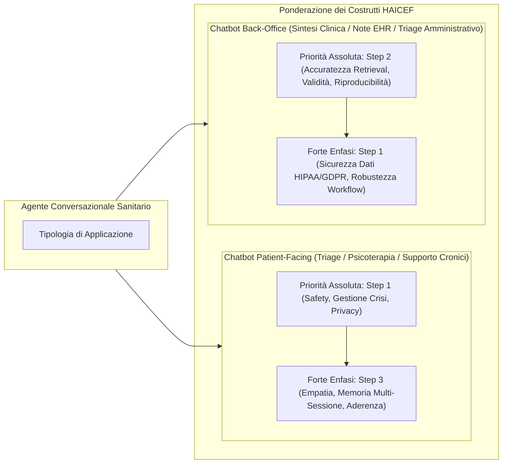

---
tags: [haicef, chatbot-evaluation, evaluation-framework, healthcare-ai, conversational-agents, safety-first, maslow-hierarchy, multi-stakeholder-evaluation, chai]
source_papers: ["ai_v4i1e69006.pdf"]
---

# Health Care AI Chatbot Evaluation Framework (HAICEF)

## Definizione Operativa
- Il **Health Care AI Chatbot Evaluation Framework (HAICEF)** è un meta-framework gerarchico e standardizzato per la valutazione sistematica, sicura ed etica degli agenti conversazionali e chatbot basati su intelligenza artificiale impiegati in ambito medico e psicoterapeutico (Hua et al., 2025; *JMIR AI*, doi:10.2196/69006).
- **Origine e Metodologia:** Sviluppato attraverso una revisione sistematica guidata dai criteri PRISMA condotta su 5 database scientifici (PubMed, EMBASE, APA PsycINFO, Cochrane Library, Google Scholar), che ha identificato e integrato 11 framework preesistenti. Tramite analisi fattoriale qualitativa e cicli iterativi di consensus tra clinici, pazienti, sviluppatori tecnologici, epidemiologi ed esperti di politiche sanitarie, HAICEF de-duplica ed estrae **271 quesiti di valutazione** organizzati su **3 livelli gerarchici di priorità**, **18 costrutti intermedi** (secondo livello) e **60 costrutti granulari** (terzo livello, di cui 56 coperti da quesiti attivi).
- **Filosofia dello "Scaffolding" Non-Scoring:** A differenza dei sistemi di benchmarking che producono un singolo punteggio numerico aggregato (spesso fuorviante a causa dell'eterogeneità clinica e delle differenze tra setting), HAICEF si configura come un'**impalcatura decisionale adattabile (*flexible scaffold*)**. Consente a diversi decisori (sviluppatori che progettano un algoritmo, comitati etici, clinici che selezionano un tool o pazienti) di ponderare selettivamente i costrutti pertinenti al loro specifico caso d'uso.

---

## I Tre Livelli Gerarchici della Piramide Valutativa

### Livello 1: Safety, Privacy, and Fairness (Fondazione Necessaria - 21% delle domande)
- **Principio Safety-First:** Ispirato alla gerarchia dei bisogni di Maslow e al framework per app dell'American Psychiatric Association (Henson et al., 2019), il primo gradino stabilisce che se un sistema fallisce i criteri di sicurezza clinica, protezione dei dati o equità algoritmica, la valutazione si arresta immediatamente. Nessuna eccellenza nell'interfaccia utente o nella fluidità stilistica può compensare una falla nella sicurezza.
- **Sotto-Costrutti Chiave:**
  - *Data Provenance:* Tracciamento rigoroso delle fonti di addestramento (distinzione tra dati clinici validati da cartelle EHR e dati non curati da social media).
  - *Harm Control & Critical Help:* Meccanismi deterministici di intercettazione di crisi acute (suicidio, autolesionismo, violenza) con deviazione immediata a risorse umane.
  - *Automation Bias Reduction:* Prompting e design dell'interfaccia che contrastano l'accettazione passiva e acritica delle risposte da parte dell'utente.
  - *Privacy & Data Protection:* Conformità stringente a normative internazionali (HIPAA negli USA, GDPR in Europa), crittografia avanzata e divieto di riutilizzo dei dialoghi per fine-tuning commerciale non autorizzato.
  - *Fairness:* Mitigazione proattiva dei bias demografici per evitare disparità di accuratezza verso minoranze o gruppi vulnerabili.

---

### Livello 2: Trustworthiness and Usefulness (Validità e Affidabilità Clinica - 39% delle domande)
- **Scopo:** Valutare se il chatbot fornisce informazioni clinicamente corrette, stabili nel tempo e integrabili nei percorsi di cura reali.
- **Sotto-Costrutti Chiave:**
  - *Validità e Accuratezza:* Precisione nel recupero delle informazioni (*retrieval accuracy*), comprensione delle sfumature linguistiche del paziente e correttezza dei consigli generati.
  - *Beneficenza e Prove Cliniche:* Necessità di validare l'efficacia tramite trial clinici controllati randomizzati (RCT) o test A/B rigorosi prima della diffusione di massa.
  - *Reliability & Workflow Integration:* Capacità del sistema di mantenere stabilità operativa senza fallimenti tecnici, gestire input anomali (*robustness*) e integrarsi fluidamente nei flussi di lavoro sanitari esistenti.
  - *Trasparenza e Spiegabilità:* Comunicazione esplicita dei limiti del sistema e interpretabilità del processo inferenziale per i professionisti sanitari.

---

### Livello 3: Design and Operational Effectiveness (Esperienza e Accessibilità - 40% delle domande)
- **Scopo:** Ottimizzare l'interazione e garantire che il sistema sia accessibile, inclusivo ed economicamente sostenibile.
- **Sotto-Costrutti Chiave:**
  - *Accessibilità Versatile:* Supporto multilingua, interfacce multimodali (testo, audio/voce, visivo) e compatibilità cross-platform (smartphone, web, tablet).
  - *Personalized Engagement:* Capacità di mantenere la memoria conversazionale multi-turno e multi-sessione, adattare la strategia comunicativa e stabilire un'alleanza di lavoro simulata (*rapport building*) senza indurre false illusioni umane.
  - *Task Efficiency & Cost-Effectiveness:* Tempi di risposta rapidi, risposte concise e azionabili, sostenibilità economica ed ecologica, e dimostrazione di un valore aggiunto superiore rispetto alle cure consuete.

---

## Mappatura dei Casi d'Uso: Patient-Facing vs Back-Office

HAICEF è progettato per essere modulare e adattarsi a diverse tipologie di agenti conversazionali sanitari:

---

## Applicazione nella Salute Mentale e Psicoterapia CBT

1. **Gestione del Rischio Clinico e Allucinazioni:** Nei contesti di supporto psicologico, la generazione incontrollata di testo da parte di LLM può indurre iatrogenesi (es. incoraggiamento di deliri, minimizzazione del rischio suicidario, interruzione prematura dell'esposizione). HAICEF impone guardrail stringenti di *Harm Control* e *Outcome Accuracy*.
2. **Contrasto dell'Automation Bias:** I pazienti in condizioni di sofferenza psicologica presentano elevata suggestionabilità. HAICEF valuta se l'interfaccia include marker epistemici espliciti e avvisi che stimolino il pensiero critico e l'autonomia del paziente.
3. **Memoria e Sintonizzazione Progressiva:** Per gli interventi cognitivo-comportamentali tra le sedute (es. diari ABC, ristrutturazione cognitiva, monitoraggio comportamentale), HAICEF valuta la consistenza del modello nel tempo e la sua capacità di non perdere il contesto clinico accumulato (*Progress Awareness*).

---

## Riferimenti Bibliografici
- Coalition for Health AI (CHAI). (2023). *Blueprint for Trustworthy AI: Implementation Guidance and Assurance for Healthcare*. Published online April 2023. https://www.coalitionforhealthai.org/
- Henson, P., David, G., Albright, K., & Torous, J. (2019). Deriving a practical framework for the evaluation of health apps. *The Lancet Digital Health*, 1(2), e52-e54. https://doi.org/10.1016/S2589-7500(19)30013-5
- Hua, Y., Xia, W., Bates, D., Hartstein, G. L., Kim, H. T., Li, M., Nelson, B. W., Stromeyer, C., IV, King, D., Suh, J., Zhou, L., & Torous, J. (2025). Standardizing and Scaffolding Health Care AI-Chatbot Evaluation: Systematic Review. *JMIR AI*, 4, e69006. https://doi.org/10.2196/69006

---

## Relazioni
- Scheda sintesi collegata: [[ai_v4i1e69006]]
- Concetti correlati: [[chai-blueprint-health-ai]], [[healthcare-conversational-agents]], [[five-axis-clinical-evaluation]], [[software-as-a-medical-device-salute-mentale]], [[three-layer-governance-framework]], [[rlhf-safety-therapeutic-conflict]], [[reflective-interpretability]], [[audit-bias-llm-clinici]], [[simulated-therapeutic-alliance]].
