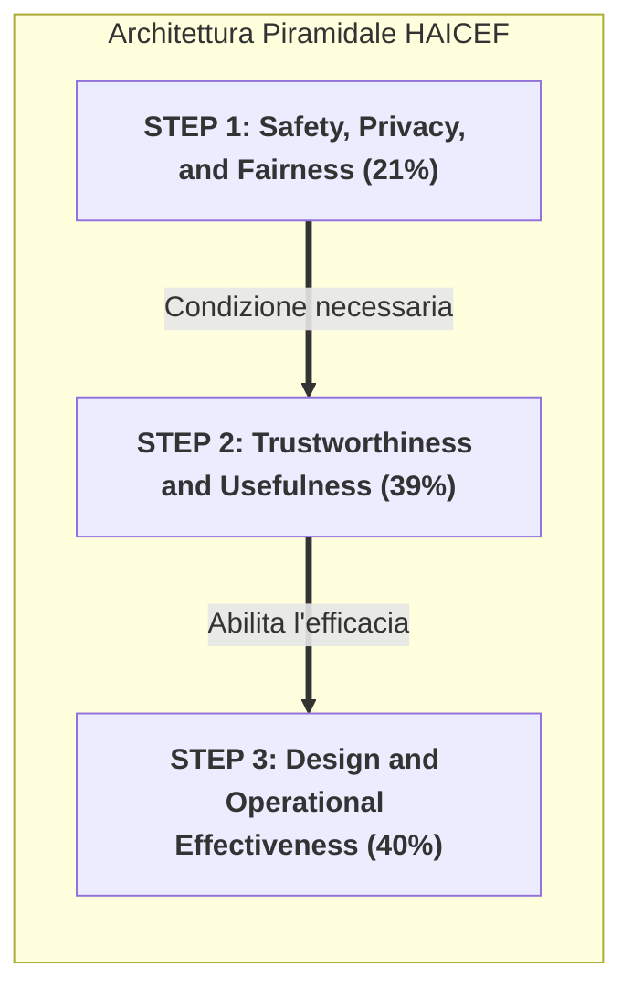

# Health Care AI Chatbot Evaluation Framework (HAICEF)

## Definizione Operativa
Il **Health Care AI Chatbot Evaluation Framework (HAICEF)** è un meta-framework gerarchico e standardizzato per la valutazione sistematica, sicura ed etica degli agenti conversazionali e chatbot basati su intelligenza artificiale impiegati in ambito medico e psicoterapeutico (Hua et al., 2025; *JMIR AI*, doi:10.2196/69006).

Sviluppato tramite revisione sistematica PRISMA su 5 database, integra 11 framework preesistenti. Attraverso analisi fattoriale e consenso multidisciplinare, definisce **271 quesiti di valutazione** organizzati su **3 livelli gerarchici**, **18 costrutti intermedi** e **60 costrutti granulari**.

Si configura come un'**impalcatura decisionale adattabile (*flexible scaffold*)** non-scoring, permettendo ai diversi decisori di ponderare i costrutti in base al caso d'uso specifico, anziché basarsi su un singolo punteggio aggregato.

## Evidenze dalla Letteratura

### Architettura Piramidale
Il framework è strutturato secondo una gerarchia ispirata a Maslow:

### I Tre Livelli
1.  **Livello 1 (Safety, Privacy, and Fairness - 21%):** Fondazione non negoziabile. Include *Data Provenance*, *Harm Control*, *Automation Bias Reduction*, *Privacy* e *Fairness*.
2.  **Livello 2 (Trustworthiness and Usefulness - 39%):** Valuta accuratezza, *Retrieval*, *Beneficenza* (validata tramite trial), *Reliability* e *Trasparenza*.
3.  **Livello 3 (Design and Operational Effectiveness - 40%):** Focalizzato su accessibilità multimodale, *Personalized Engagement* (alleanza simulata) e *Task Efficiency*.

### Applicazione Clinica
Il framework distingue tra:
- **Patient-Facing:** Enfasi su sicurezza, gestione crisi ed empatia.
- **Back-Office:** Enfasi su accuratezza del retrieval e integrazione workflow.

**Riferimenti Bibliografici:**
- Coalition for Health AI (CHAI). (2023). *Blueprint for Trustworthy AI: Implementation Guidance and Assurance for Healthcare*. https://www.coalitionforhealthai.org/
- Henson, P., David, G., Albright, K., & Torous, J. (2019). Deriving a practical framework for the evaluation of health apps. *The Lancet Digital Health*, 1(2), e52-e54. https://doi.org/10.1016/S2589-7500(19)30013-5
- Hua, Y., et al. (2025). Standardizing and Scaffolding Health Care AI-Chatbot Evaluation: Systematic Review. *JMIR AI*, 4, e69006. https://doi.org/10.2196/69006

## Relazioni
- Scheda sintesi collegata: [[ai-v4i1e69006]]
- Concetti correlati: [[chai-blueprint-health-ai]], [[healthcare-conversational-agents]], [[five-axis-clinical-evaluation]], [[software-as-a-medical-device-salute-mentale]], [[three-layer-governance-framework]], [[rlhf-safety-therapeutic-conflict]], [[reflective-interpretability]], [[audit-bias-llm-clinici]], [[simulated-therapeutic-alliance]].
