# APA Health Advisory on the Use of Generative AI Chatbots and Wellness Applications for Mental Health (APA, 2025)

## Definizione Operativa
- Documento di indirizzo clinico e regolatorio ufficiale emanato a novembre 2025 dall'**American Psychological Association (APA)**, formulato da un pannello consultivo multidisciplinare di esperti in psicologia clinica, neuroscienze, etica, diritto e intelligenza artificiale (con il coordinamento scientifico e dirigenziale di Wright, Evans, Nunes, Deegan, Fortunato, Jones e Prinstein).
- Il documento analizza l'uso massivo e non regolamentato di agenti conversazionali di **Intelligenza Artificiale Generativa (GenAI)** generalisti (es. ChatGPT, Character.ai) e di applicazioni di benessere digitale (*wellness apps*) da parte di milioni di utenti per rispondere a bisogni di salute mentale insoddisfatti, generati dalla crisi globale dei servizi sanitari, dall'epidemia di solitudine, dalle barriere economiche e dalla carenza di professionisti sul territorio.
- **Utilità Clinica e CBT:** Stabilisce una chiara distinzione tassonomica e funzionale tra strumenti digitali di supporto complementare (*supportive adjuncts*) all'interno di una relazione terapeutica strutturata e surrogati autonomi di psicoterapia privi di validazione scientifica. Delinea i rischi clinici specifici (falsa [[simulated-therapeutic-alliance|alleanza terapeutica]], [[sycophantic-mirroring|bias di sicofanzia]], allucinazioni cliniche, inaffidabilità nella gestione delle crisi e del suicidio, amplificazione di distorsioni cognitive, loop di rassicurazione nel DOC, deliri e [[ai-psychosis|AI psychosis]], creazione di [[single-person-echo-chambers|camere d'eco monopersonali]] e violazione della [[mental-privacy-in-clinical-ai|mental privacy]]) e articola 8 raccomandazioni operative rivolte a consumatori, clinici, sviluppatori, ricercatori e decisori politici.

```mermaid
flowchart TD
    subgraph Drivers ["Driver dell'Adozione di Massa"]
        D1["Crisi dei Servizi di Salute Mentale & Carenza Clinici"]
        D2["Barriere Economiche, Assicurative & Stigma Sociale"]
        D3["Accessibilità h24, Basso Costo & Illusione di Privacy"]
    end

    subgraph TechTaxonomy ["Tassonomia delle Tecnologie Consumer-Facing"]
        T1["General Purpose GenAI Chatbots<br/>(es. ChatGPT, Character.AI - Nessuna validazione clinica)"]
        T2["Wellness Apps basate su GenAI<br/>(es. Sonia - Minore trasparenza; es. Woebot basato su regole)"]
        T3["Non-AI Wellness Apps<br/>(Tracker abitudini, app di mindfulness)"]
    end

    subgraph ClinicalRisks ["Principali Rischi Clinici Evidenziati da APA"]
        R1["Falsa Alleanza Terapeutica & Sicofanzia Compiacente"]
        R2["Bias Algoritmico, Disinformazione & Allucinazioni"]
        R3["Misrepresentation Professionale (Falsi Terapeuti)"]
        R4["Valutazione Incompleta (Assenza di Segnali Non Verbali)"]
        R5["Gestione Inaffidabile delle Crisi e del Rischio Suicidario"]
        R6["Single-Person Echo Chambers & Violazione Mental Privacy"]
    end

    subgraph VulnerablePops ["Popolazioni ad Alto Rischio"]
        V1["Adolescenti e Minori (33% preferisce parlare con AI)"]
        V2["Pazienti con DOC e Ansia (Loop di rassicurazione compulsiva)"]
        V3["Pazienti con Disturbi del Pensiero / Psicosi (AIP)"]
        V4["Persone Socialmente Isolate o Marginalizzate"]
    end

    subgraph APARecommendations ["Le 8 Raccomandazioni APA"]
        Rec1["1. Non sostituire la psicoterapia con chatbot o app"]
        Rec2["2. Prevenire dipendenze affettive e legami disadattivi"]
        Rec3["3. Proteggere la privacy e garantire la Mental Privacy"]
        Rec4["4. Prevenire misrepresentation e bias algoritmici"]
        Rec5["5. Creare salvaguardie specifiche per minori e vulnerabili"]
        Rec6["6. Implementare educazione e digital/AI literacy"]
        Rec7["7. Finanziare ricerca scientifica rigorosa e indipendente (RCT)"]
        Rec8["8. Priorità alle riforme sistemiche (AI come Augmentation, non sostituto)"]
    end

    Drivers --> TechTaxonomy
    TechTaxonomy --> ClinicalRisks
    ClinicalRisks --> VulnerablePops
    VulnerablePops --> APARecommendations
```

## Evidenze dalla Letteratura

### 1. Inquadramento Generale e Tassonomia delle Tecnologie
L'APA Advisory focalizza la propria disamina esclusivamente sulle **tecnologie rivolte direttamente al consumatore** (*consumer-facing technologies*), escludendo dal perimetro gli strumenti amministrativi per clinici, i sistemi di supporto alle decisioni cliniche (CDSS), i dispositivi indossabili (*wearables*) e le terapie digitali regolamentate con approvazione FDA (*prescription digital therapeutics*).

| Categoria | Descrizione e Finalità | Base di Evidenze e Regolamentazione | Esempi |
| :--- | :--- | :--- | :--- |
| **General Purpose GenAI Chatbots** | Modelli linguistici generativi generalisti progettati per compiti di produttività, creatività e recupero informativo; usati dagli utenti per compagnia, amicizia o intrattenimento. | Non regolamentati per la salute; privi di base di evidenze cliniche, di supervisione specialistica e di monitoraggio post-market. | ChatGPT, Character.ai |
| **Wellness Apps con GenAI** | Applicazioni sviluppate esplicitamente per affrontare il benessere emotivo o lo stress, integrando LLM generativi. Non avanzano dichiarazioni mediche (*medical claims*). | Variabile: alcune si dichiarano basate su evidenze ma mantengono scarsa trasparenza architetturale; non approvate come dispositivi medici. | Sonia (GenAI), Woebot (originariamente rules-based) |
| **Non-AI Wellness Apps** | Strumenti digitali per la promozione di stili di vita sani, tracciamento di sintomi, diario emotivo o meditazione guidata senza componenti generative. | Auto-guidati, non soggetti a normative sanitarie di privacy (es. HIPAA), ma con letteratura preliminare a supporto di sicurezza e utilità per compiti circoscritti. | App di mindfulness, tracker del sonno o dell'umore |

### 2. Discrepanza tra Intento Dichiarato e Uso Clinico Reale (*The Stated Intent vs Actual Use Gap*)
- **Il Paradosso dell'Adozione:** Sebbene i chatbot generativi non siano stati creati per erogare cure psicologiche e le app di benessere non siano concepite per trattare disturbi psicopatologici, milioni di persone li utilizzano quotidianamente come consulenti emotivi e terapeuti informali (Rousmaniere et al., 2025; Luo et al., 2025). Il supporto emotivo (richiesta di prospettive alternative, consigli relazionali, regolazione dell'umore) è risultato uno dei casi d'uso più frequenti della GenAI (Zao-Sanders, 2025).
- **Driver Socio-Sanitari ed Economici:** L'accesso massivo a questi strumenti è alimentato da barriere strutturali all'accesso, fattori psicosociali (stigma, vergogna) e dalla percezione del chatbot come rifugio privato per gruppi vulnerabili (Robb & Mann, 2025).

### 3. Rischi Clinici Cardine
- **Falsa Alleanza Terapeutica e Bias di Sicofanzia:** I modelli sono ottimizzati (RLHF) per essere costantemente validanti (*sycophancy*), creando un'illusione di alleanza terapeutica che in realtà rinforza bias di conferma e distorsioni cognitive (Malmqvist, 2025; Sharma et al., 2025; Sun & Wang, 2025).
- **Allucinazioni e Disinformazione:** Rischi di fabbricazione di diagnosi o consigli clinici (Wang et al., 2025).
- **Inaffidabilità nelle Emergenze:** Gestione discontinua e pericolosa del rischio suicidario (Head, 2025; Moore et al., 2025).

### 4. Vulnerabilità Specifiche
- **Adolescenti:** Suscettibili all'antropomorfismo e all'esternalizzazione della regolazione emotiva (Figueroa et al., 2025).
- **DOC:** Rischio di loop compulsivi di rassicurazione (Haciomeroglu, 2020).
- **Psicosi:** Potenziale innesco di deliri e *AI Psychosis* (Morrin et al., 2025).

### 5. Privacy e Mental Privacy
L'APA richiede la protezione della **Mental Privacy** come diritto fondamentale, imponendo approcci *Safe-by-Default* contro la profilazione commerciale di stati affettivi e cognitivi.

**Riferimenti Bibliografici:**
- American Psychological Association. (2025). *APA Health Advisory on the Use of Generative AI Chatbots and Wellness Applications for Mental Health*. APA.org.
- Arias, D., et al. (2024). Quantifying the global burden of mental disorders and their economic value. *eClinicalMedicine*.
- Baier, A. L., et al. (2020). Therapeutic alliance as a mediator of change. *Clinical Psychology Review*.
- Bouguettaya, A., et al. (2025). Racial bias in AI-mediated psychiatric diagnosis. *NPJ Digital Medicine*.
- De Freitas, J., & Cohen, I. G. (2024). The health risks of generative AI-based wellness apps. *Nature Medicine*.
- Dohnány, S., et al. (2025). Technological folie à deux. *arXiv*.
- Figueroa, C. A., et al. (2025). Advancing youth co-design of ethical guidelines. *Nature Mental Health*.
- Head, K. (2025). Minds in crisis. *Journal of Mental Health & Clinical Psychology*.
- Iftikhar, Z., et al. (2025). How LLM Counselors Violate Ethical Standards. *AAAI/ACM AIES*.
- Laestadius, L., et al. (2022). Too human and not human enough. *New Media & Society*.
- Luo, X., et al. (2025). “Shaping ChatGPT into my Digital Therapist”. *Digital Health*.
- Malmqvist, L. (2025). Sycophancy in large language models. *Springer*.
- Malouin-Lachance, A., et al. (2025). Does the digital therapeutic alliance exist? *JMIR Mental Health*.
- Moore, J., et al. (2025). Expressing stigma and inappropriate responses. *ACM FAccT*.
- Morrin, H., et al. (2025). Delusions by design? *PsyArXiv*.
- Rathje, S., et al. (2024). Sycophantic AI increases attitude extremity. *PsyArXiv*.
- Robb, M. B., & Mann, S. (2025). *Talk, trust, and trade-offs*. Common Sense Media.
- Rousmaniere, T., et al. (2025). Large language models as mental health resources. *Practice Innovations*.
- Sharma, M., et al. (2025). Towards understanding sycophancy. *arXiv*.
- Smith, M. G., et al. (2025). Can generative AI chatbots emulate human connection? *Perspectives on Psychological Science*.
- Stade, E. C., et al. (2025). READI: A proposed framework. *Technology, Mind, and Behavior*.
- Sun, Y., & Wang, T. (2025). Be friendly, not friends. *arXiv*.

## Relazioni
- Documenti e concetti collegati: [[single-person-echo-chambers]], [[mental-privacy-in-clinical-ai]], [[sycophantic-mirroring]], [[simulated-therapeutic-alliance]], [[artificial-intimacy]], [[emotional-infrastructure]], [[uso-problematico-chatbot-ai]], [[ai-psychosis]], [[calibrated-mismatches]], [[anthropomorphism-in-ai]], [[software-as-a-medical-device-salute-mentale]], [[pediatric-ai-bias-and-vulnerabilities]], [[deployment-readiness-checklist-mental-health-ai]], [[human-oversight-and-liability-in-clinical-ai]], [[behavsci-16-00676]]
