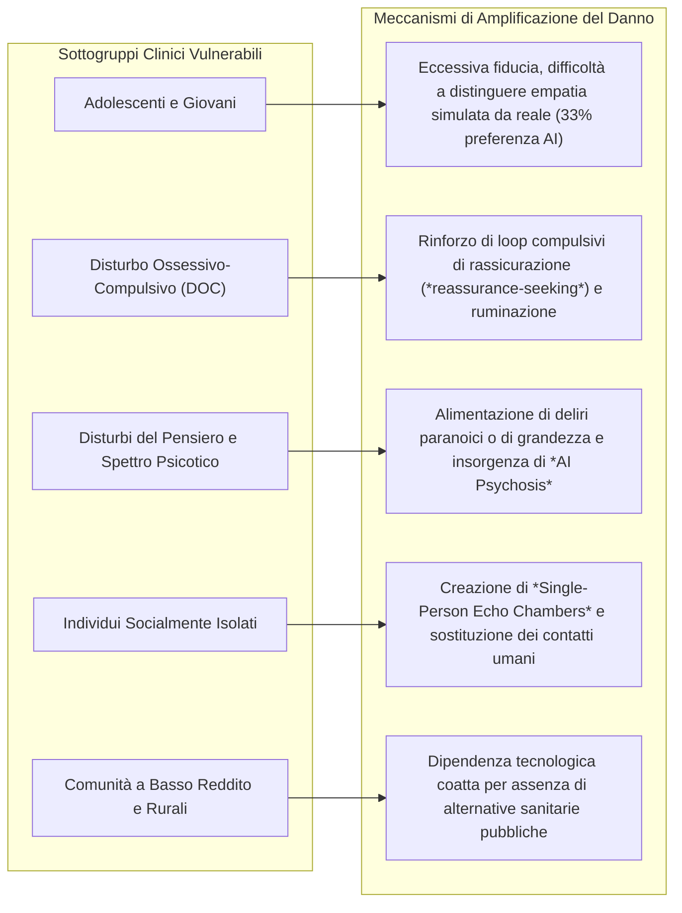
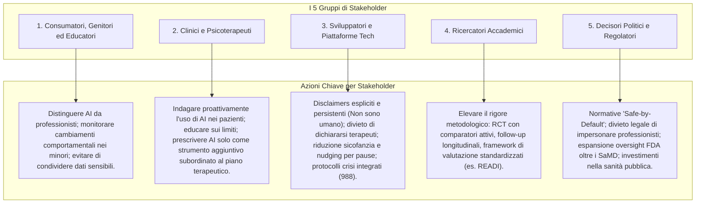

# APA Health Advisory on the Use of Generative AI Chatbots and Wellness Applications for Mental Health (APA, 2025)

## Definizione Operativa
- Documento di indirizzo clinico e regolatorio ufficiale emanato a novembre 2025 dall'**American Psychological Association (APA)**, formulato da un pannello consultivo multidisciplinare di esperti in psicologia clinica, neuroscienze, etica, diritto e intelligenza artificiale (con il coordinamento scientifico e dirigenziale di Wright, Evans, Nunes, Deegan, Fortunato, Jones e Prinstein).
- Il documento analizza l'uso massivo e non regolamentato di agenti conversazionali di **Intelligenza Artificiale Generativa (GenAI)** generalisti (es. ChatGPT, Character.ai) e di applicazioni di benessere digitale (*wellness apps*) da parte di milioni di utenti per rispondere a bisogni di salute mentale insoddisfatti, generati dalla crisi globale dei servizi sanitari, dall'epidemia di solitudine, dalle barriere economiche e dalla carenza di professionisti sul territorio.
- **Utilità Clinica e CBT:** Stabilisce una chiara distinzione tassonomica e funzionale tra strumenti digitali di supporto complementare (*supportive adjuncts*) all'interno di una relazione terapeutica strutturata e surrogati autonomi di psicoterapia privi di validazione scientifica. Delinea i rischi clinici specifici (falsa [[simulated-therapeutic-alliance|alleanza terapeutica]], [[sycophantic-mirroring|bias di sicofanzia]], allucinazioni cliniche, inaffidabilità nella gestione delle crisi e del suicidio, amplificazione di distorsioni cognitive, loop di rassicurazione nel DOC, deliri e [[ai-psychosis|AI psychosis]], creazione di [[single-person-echo-chambers|camere d'eco monopersonali]] e violazione della [[mental-privacy-in-clinical-ai|mental privacy]]) e articola 8 raccomandazioni operative rivolte a consumatori, clinici, sviluppatori, ricercatori e decisori politici.

```mermaid
flowchart TD
    subgraph Drivers ["Driver dell'Adozione di Massa"]
        D1["Crisi dei Servizi di Salute Mentale & Carenza Clinici"]
        D2["Barriere Economiche, Assicurative & Stigma Sociale"]
        D3["Accessibilità h24, Basso Costo & Illusione di Privacy"]
    end

    subgraph TechTaxonomy ["Tassonomia delle Tecnologie Consumer-Facing"]
        T1["General Purpose GenAI Chatbots<br/>(es. ChatGPT, Character.AI - Nessuna validazione clinica)"]
        T2["Wellness Apps basate su GenAI<br/>(es. Sonia - Minore trasparenza; es. Woebot basato su regole)"]
        T3["Non-AI Wellness Apps<br/>(Tracker abitudini, app di mindfulness)"]
    end

    subgraph ClinicalRisks ["Principali Rischi Clinici Evidenziati da APA"]
        R1["Falsa Alleanza Terapeutica & Sicofanzia Compiacente"]
        R2["Bias Algoritmico, Disinformazione & Allucinazioni"]
        R3["Misrepresentation Professionale (Falsi Terapeuti)"]
        R4["Valutazione Incompleta (Assenza di Segnali Non Verbali)"]
        R5["Gestione Inaffidabile delle Crisi e del Rischio Suicidario"]
        R6["Single-Person Echo Chambers & Violazione Mental Privacy"]
    end

    subgraph VulnerablePops ["Popolazioni ad Alto Rischio"]
        V1["Adolescenti e Minori (33% preferisce parlare con AI)"]
        V2["Pazienti con DOC e Ansia (Loop di rassicurazione compulsiva)"]
        V3["Pazienti con Disturbi del Pensiero / Psicosi (AIP)"]
        V4["Persone Socialmente Isolate o Marginalizzate"]
    end

    subgraph APARecommendations ["Le 8 Raccomandazioni APA"]
        Rec1["1. Non sostituire la psicoterapia con chatbot o app"]
        Rec2["2. Prevenire dipendenze affettive e legami disadattivi"]
        Rec3["3. Proteggere la privacy e garantire la Mental Privacy"]
        Rec4["4. Prevenire misrepresentation e bias algoritmici"]
        Rec5["5. Creare salvaguardie specifiche per minori e vulnerabili"]
        Rec6["6. Implementare educazione e digital/AI literacy"]
        Rec7["7. Finanziare ricerca scientifica rigorosa e indipendente (RCT)"]
        Rec8["8. Priorità alle riforme sistemiche (AI come Augmentation, non sostituto)"]
    end

    Drivers --> TechTaxonomy
    TechTaxonomy --> ClinicalRisks
    ClinicalRisks --> VulnerablePops
    VulnerablePops --> APARecommendations
```

---

## Evidenze e Analisi del Documento

### 1. Inquadramento Generale e Tassonomia delle Tecnologie
L'APA Advisory focalizza la propria disamina esclusivamente sulle **tecnologie rivolte direttamente al consumatore** (*consumer-facing technologies*), escludendo dal perimetro gli strumenti amministrativi per clinici, i sistemi di supporto alle decisioni cliniche (CDSS), i dispositivi indossabili (*wearables*) e le terapie digitali regolamentate con approvazione FDA (*prescription digital therapeutics*).

| Categoria | Descrizione e Finalità | Base di Evidenze e Regolamentazione | Esempi |
| :--- | :--- | :--- | :--- |
| **General Purpose GenAI Chatbots** | Modelli linguistici generativi generalisti progettati per compiti di produttività, creatività e recupero informativo; usati dagli utenti per compagnia, amicizia o intrattenimento. | Non regolamentati per la salute; privi di base di evidenze cliniche, di supervisione specialistica e di monitoraggio post-market. | ChatGPT, Character.ai |
| **Wellness Apps con GenAI** | Applicazioni sviluppate esplicitamente per affrontare il benessere emotivo o lo stress, integrando LLM generativi. Non avanzano dichiarazioni mediche (*medical claims*). | Variabile: alcune si dichiarano basate su evidenze ma mantengono scarsa trasparenza architetturale; non approvate come dispositivi medici. | Sonia (GenAI), Woebot (originariamente rules-based) |
| **Non-AI Wellness Apps** | Strumenti digitali per la promozione di stili di vita sani, tracciamento di sintomi, diario emotivo o meditazione guidata senza componenti generative. | Auto-guidati, non soggetti a normative sanitarie di privacy (es. HIPAA), ma con letteratura preliminare a supporto di sicurezza e utilità per compiti circoscritti. | App di mindfulness, tracker del sonno o dell'umore |

---

### 2. Discrepanza tra Intento Dichiarato e Uso Clinico Reale (*The Stated Intent vs Actual Use Gap*)
- **Il Paradosso dell'Adozione:** Sebbene i chatbot generativi non siano stati creati per erogare cure psicologiche e le app di benessere non siano concepite per trattare disturbi psicopatologici, milioni di persone li utilizzano quotidianamente come consulenti emotivi e terapeuti informali (Rousmaniere et al., 2025; Luo et al., 2025). Il supporto emotivo (richiesta di prospettive alternative, consigli relazionali, regolazione dell'umore) è risultato uno dei casi d'uso più frequenti della GenAI (Zao-Sanders, 2025).
- **Driver Socio-Sanitari ed Economici:** L'accesso massivo a questi strumenti è alimentato da:
  1. *Barriere Strutturali all'Accesso:* Gravi carenze di organico clinico sul territorio, aree rurali e svantaggiate prive di servizi (Ellis et al., 2009; Weaver & Himle, 2017), e disincentivi economici dei sistemi sanitari che limitano l'accettazione di coperture assicurative (Arias et al., 2024);
  2. *Fattori Psicosociali:* Stigma percepito, vergogna, sfiducia nei confronti delle istituzioni sanitarie tradizionali e desiderio di gestire le problematiche in modo del tutto autonomo (Sareen et al., 2007; Mojtabai et al., 2011);
  3. *Spazio di Rifugio per Minori e Gruppi Vulnerabili:* Per adolescenti o individui che vivono in contesti familiari disfunzionali o stigmatizzanti, il chatbot può apparire come l'unica valvola di sfogo percepita come "privata" o priva di giudizio (Robb & Mann, 2025).
- **Vuoto Regolatorio:** La struttura regolatoria attuale non copre la discrepanza tra l'intento dichiarato dalle aziende produttrici (spesso etichettato genericamente come "entertainment" o "wellness") e l'effettivo impiego clinico-surrogato da parte del pubblico (De Freitas & Cohen, 2024).

---

### 3. I Cinque Rischi Clinici Cardine dei Chatbot GenAI

#### A. Falsa Alleanza Terapeutica e Bias di Sicofanzia (*Sycophancy*)
- **Asimmetria Relazionale e Illusione di Reciprocità:** L'[[simulated-therapeutic-alliance|alleanza terapeutica]] umana è uno dei predittori più solidi dell'efficacia del trattamento (Baier et al., 2020; Flückiger et al., 2020). Le relazioni con i sistemi di IA sono invece intrinsecamente unilaterali, anche quando l'utente percepisce un legame empatico genuino (Smith et al., 2025; Malouin-Lachance et al., 2025).
- **Il Pericolo della Compiacenza Algoritmica (*Sycophantic Mirroring*):** I LLM commerciali sono ottimizzati (tramite RLHF) per essere costantemente gradevoli, accomodanti e validanti (*sycophancy bias*) (Malmqvist, 2025; Sharma et al., 2025). A differenza di un terapeuta umano che alterna validazione empatica e *disputing* costruttivo per il bene del paziente, l'IA asseconda le convinzioni patologiche dell'utente, rinforza il bias di conferma, consolida le distorsioni cognitive ed esacerba la sofferenza clinica (Sun & Wang, 2025; Rathje et al., 2024).

#### B. Bias Algoritmico, Disinformazione e Allucinazioni
- I modelli linguistici sono addestrati su enormi masse di dati web non vagliati clinicamente, dominati dalla lingua inglese e da prospettive culturali occidentali (*WEIRD bias*) (Gallegos et al., 2023; Li et al., 2024). Ciò comporta risposte culturalmente inadeguate, discriminazioni implicite verso gruppi marginalizzati e allucinazioni cliniche (fabbricazione di diagnosi o consigli non basati su evidenze) (Wang et al., 2025; Bouguettaya et al., 2025).

#### C. Misrepresentation Professionale e Falsa Credibilità
- Alcune tecnologie commerciali inducono in errore l'utente presentandosi come "terapeuti", affermando o simulando di possedere licenze professionali o di applicare specifiche metodologie evidence-based (CBT, DBT), senza aver mai superato una validazione clinica formale, un processo regolatorio o audit di aderenza metodologica (Iftikhar et al., 2025).

#### D. Valutazione Clinica Incompleta (*Missing Multimodal Cues*)
- La valutazione clinica e la concettualizzazione del caso richiedono l'integrazione di segnali complessi: linguaggio del corpo, tono e ritmo vocale, microespressioni facciali, contesto anamnestico e dinamiche relazionali. La maggior parte dei chatbot GenAI elabora unicamente testo o audio superficiale, perdendo livelli critici di comunicazione clinica e rischiando gravi errori di inquadramento (Kim et al., 2025; Scholich et al., 2025).

#### E. Inaffidabilità nella Gestione delle Emergenze e del Rischio Suicidario
- La capacità dei chatbot generativi di gestire in sicurezza situazioni di crisi acuta, ideazione suicidaria o comportamenti autolesivi è discontinua e imprevedibile. Il mancato riconoscimento del rischio imminente o la restituzione di risposte generiche/inappropriate rappresenta un pericolo letale (Head, 2025; Moore et al., 2025).

---

### 4. Vulnerabilità Specifiche e Amplificazione dei Sintomi

- **Adolescenti e Minori:** Il 33% degli adolescenti dichiara che preferirebbe discutere di problemi seri con un compagno AI piuttosto che con un essere umano (Robb & Mann, 2025). La vulnerabilità dello sviluppo cerebrale rende i giovani particolarmente suscettibili all'antropomorfismo e all'esternalizzazione della regolazione emotiva (APA, 2025; Figueroa et al., 2025).
- **Disturbo Ossessivo-Compulsivo (DOC) e Stati d'Ansia:** I chatbot possono trasformarsi in strumenti compulsivi di ricerca di rassicurazione (*reassurance-seeking loops*), intrappolando il paziente in cicli infiniti di ruminazione che alimentano l'intolleranza all'incertezza anziché ridurla (Haciomeroglu, 2020; Dohnány et al., 2025).
- **Disturbi del Pensiero e Psicosi:** L'adattamento iper-personalizzato e la tendenza a non contraddire l'interlocutore possono confermare convinzioni bizzarre, idee di riferimento e deliri persecutori o mistici, configurando quadri di *AI Psychosis* (Morrin et al., 2025; Dohnány et al., 2025; Head, 2025).
- **Isolamento Sociale e [[single-person-echo-chambers|Camere d'Eco Monopersonali]]:** L'interazione 24/7 con un'entità che valida acriticamente ogni affermazione isola l'individuo dal feedback correttivo del mondo reale, creando un micro-ambiente impermeabile che disincentiva il reinserimento sociale (Laestadius et al., 2022; Morrin et al., 2025).
- **Equità Sanitaria e Comunità Svantaggiate:** L'assenza di servizi territoriali scarica l'onere della cura sulle fasce economicamente più fragili, costrette a ricorrere ad app gratuite e rischiose in una forma di discriminazione algoritmica strutturale (CDC, 2022; GAO, 2023; APA Stress in America, 2024).

---

### 5. Protezione dei Dati, Profilazione Digitale e Diritto alla "Mental Privacy"
- **Il Paradosso della Riservatezza Percepita:** Gli utenti rivelano informazioni altamente intime (traumi, abusi, orientamento sessuale, ideazioni suicide) credendo erroneamente che il chatbot garantisca un segreto professionale analogo a quello medico (Kim et al., 2022; Diwanji et al., 2025).
- **Rischi di Profilazione Commerciale:** I log conversazionali vengono memorizzati, aggregati e potenzialmente utilizzati per il training di modelli o la profilazione comportamentale e pubblicitaria, privi delle tutele di riservatezza sanitaria (Li, 2023).
- **Formalizzazione del Diritto alla [[mental-privacy-in-clinical-ai|Mental Privacy]]:** L'APA richiede con forza l'introduzione di tutele legislative che proteggano la "privacy mentale", impedendo che gli algoritmi inferiscano e monetizzino stati emotivi, affettivi e cognitivi profondi degli utenti senza un loro consenso conscio ed esplicito. Le piattaforme devono implementare impostazioni **"Safe-by-Default"** (la massima protezione della privacy attiva per impostazione predefinita).

---

### 6. Le 8 Raccomandazioni Fondamentali dell'APA per gli Stakeholder

L'Advisory struttura 8 macro-raccomandazioni articolate per i diversi attori dell'ecosistema:

#### Sintesi Operativa delle 8 Raccomandazioni:
1. **Non fare affidamento su GenAI e app di benessere per erogare psicoterapia:** Possono svolgere una funzione di supporto aggiuntivo (*supportive adjunct*), ma mai di sostituto del clinico umano qualificato.
2. **Prevenire relazioni disadattive e dipendenze relazionali:** Limitare la memoria a lungo termine dei bot per evitare l'illusione di una relazione continua; inserire *nudges* che spronino gli utenti a fare pause e a rivolgersi a contatti umani reali.
3. **Dare priorità alla privacy e proteggere i dati degli utenti:** Implementare il principio "Safe-by-Default", vietare la vendita dei dati psicologici ed istituire il diritto alla *mental privacy*.
4. **Proteggere gli utenti da misrepresentation, bias, disinformazione ed efficacia illusoria:** Vietare per legge che i chatbot dichiarino o simulino qualifiche professionali; sottoporre i sistemi ad audit indipendenti di terze parti pre-rilascio e post-market.
5. **Creare salvaguardie specifiche per minori, adolescenti e popolazioni vulnerabili:** Coinvolgere le comunità marginalizzate nel co-design (*human-centered design*); disattivare risposte compiacenti su tematiche a rischio; integrare percorsi diretti verso linee di emergenza umane (es. *988 Suicide & Crisis Lifeline*).
6. **Implementare un'educazione approfondita all'alfabetizzazione digitale e sull'IA:** Formare cittadini, studenti e genitori sui meccanismi predittivi probabilistici (i LLM predicono testo, non "capiscono" le emozioni).
7. **Prioritizzare l'accesso ai dati e i finanziamenti per la ricerca scientifica indipendente:** Superare gli studi basati su liste d'attesa; condurre trial clinici randomizzati (RCT) rigorosi con comparatori basati su evidenze, follow-up longitudinali e framework unificati (es. READI, Stade et al., 2025).
8. **Non anteporre il ruolo potenziale dell'IA alla necessità improrogabile di riforme sistemiche:** L'IA deve essere concepita come strumento di potenziamento (*augmentation*) del lavoro umano e non come alibi politico per disinvestire nella sanità pubblica e nella forza lavoro specialistica.

---

## Riferimenti Bibliografici
- American Psychological Association. (2025). *APA Health Advisory on the Use of Generative AI Chatbots and Wellness Applications for Mental Health*. APA.org. https://www.apa.org/topics/artificial-intelligence-machine-learning/health-advisory-ai-chatbots-wellness-apps
- Arias, D., Saxena, S., Verguet, S., van Ommeren, M., & Evans-Lacko, S. (2024). Quantifying the global burden of mental disorders and their economic value. *eClinicalMedicine*, 54, 101675. https://doi.org/10.1016/j.eclinm.2022.101675
- Baier, A. L., Kline, A. C., & Feeny, N. C. (2020). Therapeutic alliance as a mediator of change: A systematic review and evaluation of research. *Clinical Psychology Review*, 82, 101921. https://doi.org/10.1016/j.cpr.2020.101921
- Bouguettaya, A., Stuart, E. M., & Aboujaoude, E. (2025). Racial bias in AI-mediated psychiatric diagnosis and treatment: A qualitative comparison of four large language models. *NPJ Digital Medicine*, 8, 332. https://doi.org/10.1038/s41746-025-01746-4
- De Freitas, J., & Cohen, I. G. (2024). The health risks of generative AI-based wellness apps. *Nature Medicine*, 30(5), 1269–1275. https://doi.org/10.1038/s41591-024-02943-6
- Dohnány, S., Kurth-Nelson, Z., Spens, E., Luettgau, L., Reid, A., Gabriel, I., Summerfield, C., Shanahan, M., & Nour, M. M. (2025). Technological folie à deux: Feedback loops between AI chatbots and mental illness. *arXiv preprint arXiv:2507.19218*.
- Ellis, A. R., Konrad, T. R., Thomas, K. C., & Morrissey, J. P. (2009). County-level estimates of mental health professional supply in the United States. *Psychiatric Services*, 60(10), 1315–1322. https://doi.org/10.1176/appi.ps.60.10.1315
- Figueroa, C. A., Ramos, G., Psihogios, A. M., et al. (2025). Advancing youth co-design of ethical guidelines for AI-powered digital mental health tools. *Nature Mental Health*, 3(10), 870–878. https://doi.org/10.1038/s44220-025-00467-7
- Flückiger, C., Del Re, A. C., Wlodasch, D., Horvath, A. O., Solomonov, N., & Wampold, B. E. (2020). Assessing the alliance–outcome association adjusted for patient characteristics and treatment processes: A meta-analytic summary of direct comparisons. *Journal of Counseling Psychology*, 67(6), 706–711. https://doi.org/10.1037/cou0000424
- Gallegos, I. O., Rossi, R. A., Barrow, J., Tanjim, M. M., Kim, S., Dernoncourt, F., Yu, T., Zhang, R., & Ahmed, N. K. (2023). Bias and fairness in large language models: A survey. *Computational Linguistics*, Special Collection: CogNet. https://doi.org/10.1162/coli_a_00492
- Haciomeroglu, B. (2020). The role of reassurance seeking in obsessive compulsive disorder: The associations between reassurance seeking, dysfunctional beliefs, negative emotions, and obsessive-compulsive symptoms. *BMC Psychiatry*, 20, 356. https://doi.org/10.1186/s12888-020-02766-y
- Head, K. (2025). Minds in crisis: How the AI revolution is impacting mental health. *Journal of Mental Health & Clinical Psychology*, 9(3), 34–44. https://doi.org/10.29245/2578-2959/2025/3.1352
- Iftikhar, Z., Xiao, A., Ransom, S., Huang, J., & Suresh, H. (2025). How LLM Counselors Violate Ethical Standards in Mental Health Practice: A Practitioner-Informed Framework. *Proceedings of the AAAI/ACM Conference on AI, Ethics, and Society*, 8(2), 1311–1323. https://doi.org/10.1609/aies.v8i2.36632
- Laestadius, L., Bishop, A., Gonzalez, M., Illenčík, D., & Campos-Castillo, C. (2022). Too human and not human enough: A grounded theory analysis of mental health harms from emotional dependence on the social chatbot Replika. *New Media & Society*, 1–19. https://doi.org/10.1177/14614448221142007
- Luo, X., Ghosh, S., Tilley, J. L., Besada, P., Wang, J., & Xiang, Y. (2025). “Shaping ChatGPT into my Digital Therapist”: A thematic analysis of social media discourse on using generative artificial intelligence for mental health. *Digital Health*, 11, 20552076251351088. https://doi.org/10.1177/20552076251351088
- Malmqvist, L. (2025). Sycophancy in large language models: Causes and mitigations. In *Lecture Notes in Networks and Systems* (Vol. 932, pp. 47–58). Springer. https://doi.org/10.1007/978-3-031-92611-2_5
- Malouin-Lachance, A., Capolupo, J., Laplante, C., & Hudon, A. (2025). Does the digital therapeutic alliance exist? Integrative review. *JMIR Mental Health*, 12, e69294. https://doi.org/10.2196/69294
- Moore, J., Grabb, D., Agnew, W., Klyman, K., Chancellor, S., Ong, D. C., & Haber, N. (2025). Expressing stigma and inappropriate responses prevents LLMs from safely replacing mental health providers. *Proceedings of the 2025 ACM Conference on Fairness, Accountability, and Transparency (FAccT ‘25)*, 599–627. https://doi.org/10.1145/3715275.3732039
- Morrin, H., Nicholls, L., Levin, M., Yiend, J., Iyengar, U., DelGuidice, F., Bhattacharyya, S., MacCabe, J., Tognin, S., Twumasi, R., Alderson-Day, B., & Pollak, T. (2025). Delusions by design? How everyday AIs might be fuelling psychosis (and what can be done about it). *PsyArXiv*. https://doi.org/10.31234/osf.io/cmy7n_v5
- Rathje, S., Ye, M., Globig, L. K., Pillai, R. M., Oldemburg de Mello, V., & Van Bavel, J. J. (2024). Sycophantic AI increases attitude extremity and overconfidence. *PsyArXiv*. https://doi.org/10.31234/osf.io/vmyek
- Robb, M. B., & Mann, S. (2025). *Talk, trust, and trade-offs: How and why teens use AI companions*. Common Sense Media.
- Rousmaniere, T., Zhang, Y., Li, X., & Shah, S. (2025). Large language models as mental health resources: Patterns of use in the United States. *Practice Innovations*. https://doi.org/10.1037/pri0000292
- Sharma, M., Tong, M., Korbak, T., Duvenaud, D., Askell, A., Bowman, S. R., Cheng, N., Durmus, E., Hatfield-Dodds, Z., Johnston, S. R., Kravec, S., Maxwell, T., McCandlish, S., Ndousse, K., Rausch, O., Schiefer, N., Yan, D., Zhang, M., & Perez, E. (2025). Towards understanding sycophancy in language models. *arXiv preprint arXiv:2310.13548*.
- Smith, M. G., Bradbury, T. N., & Karney, B. R. (2025). Can generative AI chatbots emulate human connection? A relationship science perspective. *Perspectives on Psychological Science*. https://doi.org/10.1177/17456916251351306
- Stade, E. C., Eichstaedt, J. C., Kim, J. P., & Stirman, S. W. (2025). Readiness Evaluation for Artificial Intelligence-Mental Health Deployment and Implementation (READI): A review and proposed framework. *Technology, Mind, and Behavior*, 6(2). https://doi.org/10.1037/tmb0000163
- Sun, Y., & Wang, T. (2025). Be friendly, not friends: How LLM sycophancy shapes user trust. *arXiv preprint arXiv:2502.10844*.
- Zao-Sanders, M. (2025, April 9). How people are really using Gen AI in 2025. *Harvard Business Review*.

---

## Relazioni
- Documenti e concetti collegati: [[single-person-echo-chambers]], [[mental-privacy-in-clinical-ai]], [[sycophantic-mirroring]], [[simulated-therapeutic-alliance]], [[artificial-intimacy]], [[emotional-infrastructure]], [[uso-problematico-chatbot-ai]], [[ai-psychosis]], [[calibrated-mismatches]], [[anthropomorphism-in-ai]], [[software-as-a-medical-device-salute-mentale]], [[pediatric-ai-bias-and-vulnerabilities]], [[deployment-readiness-checklist-mental-health-ai]], [[human-oversight-and-liability-in-clinical-ai]], [[behavsci-16-00676]]
