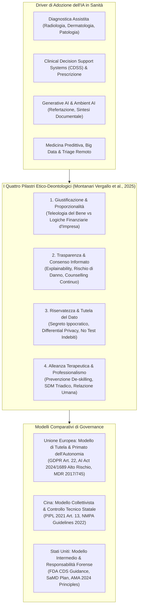

# How Could Artificial Intelligence Change the Doctor–Patient Relationship? A Medical Ethics Perspective (Montanari Vergallo et al., 2025)

## Definizione Operativa
- Narrative review bioetica e medico-legale pubblicata su *Healthcare* (MDPI, Settembre 2025) da un gruppo interdisciplinare guidato da Gianluca Montanari Vergallo, Laura Leondina Campanozzi, Matteo Gulino, Lorena Bassis, Pasquale Ricci, Simona Zaami, Susanna Marinelli, Vittoradolfo Tambone e Paola Frati (Sapienza Università di Roma, Università Campus Bio-Medico di Roma, Università di Roma Tor Vergata, Link Campus University, Università Politecnica delle Marche).
- **Quesito Etico-Clinico Cardine:** In che modo l'integrazione crescente dei sistemi di intelligenza artificiale (dalla diagnostica per immagini alla medicina predittiva, dai Clinical Decision Support Systems ai modelli linguistici generativi) trasforma la relazione medico-paziente, le dinamiche di consenso informato, la tutela della riservatezza dei dati e l'autonomia professionale del clinico?
- **Tesi Centrale:** L'IA possiede un potenziale rilevante nel ridurre il carico burocratico e ottimizzare l'accuratezza diagnostica e terapeutica, ma il suo impiego rischia di trasformare la relazione di cura in una transazione tecnica spersonalizzata. Se l'atto clinico viene ridotto a computazione statistica e il medico a mero esecutore o validatore di output opachi, si compromette il processo di [[shared-decision-making-in-clinical-ai|decisione clinica condivisa (SDM)]], esponendo i pazienti a forme inedite di [[algorithmic-paternalism-in-ai-mental-health|paternalismo tecnologico]]. L'integrazione dell'IA deve dunque preservare il primato ontologico della relazione umana e conformarsi a rigorosi quadri di [[comparative-ai-health-governance|governance comparativa e responsabilità etica]].

---

## Evidenze dalla Letteratura e Analisi Tematica

### 1. Giustificazione e Fondamento dell'Impiego dell'IA per il Paziente
- **Proporzionalità e Diritti Fondamentali:** Richiamando la *Raccomandazione sull'Etica dell'Intelligenza Artificiale* dell'UNESCO (2021), l'adozione di qualsiasi sistema di IA in sanità deve soddisfare tre condizioni inderogabili:
  1. *Appropriatezza, Desiderabilità e Proporzionalità* per il raggiungimento di un fine lecito di cura;
  2. *Rispetto Assoluto dei Diritti Umani* e non violazione dei valori etici fondanti;
  3. *Idoneità Contestuale e Rigore Scientifico*.
- **Rifiuto dell'Approccio Utilitaristico di Mercato:** Gli autori mettono in guardia contro l'implementazione dell'IA basata su mere logiche aziendali di riduzione costi/benefici (es. algoritmi di stima dell'aspettativa di vita configurati per negare il ricovero ospedaliero a pazienti critici al fine di contenere i costi di degenza; Woopen, 2019).
- **Il Principio Tomista del Bene e dell'Utile:** Riprendendo la prospettiva di San Tommaso d'Aquino (*Summa Theologica*), la review sottolinea che ciò che è utile non possiede in sé la ragione del bene, ma è buono solo in quanto mezzo finalizzato al bene della persona (come una medicina amara è utile solo se orientata alla guarigione). L'innovazione tecnologica non può essere autoreferenziale: ciò che è autenticamente buono è anche veramente utile, ma non tutto ciò che è tecnicamente utile è eticamente buono.
- **Evidenze di Superiorità Clinica vs Fallibilità:** Secondo la guida WHO (2021) su *Ethics and Governance of AI for Health*, l'affidamento all'IA è giustificato solo quando vi è solida evidenza empirica di superiorità o parità rispetto al giudizio umano, prevenendo esiti avversi evitabili. In assenza di evidenze conclusive o in presenza di bias nei dati di addestramento, l'uso acritico dell'algoritmo compromette la sicurezza clinica e distrugge la fiducia terapeutica.

---

### 2. Comunicazione e Consenso Informato sull'Uso dell'IA
- **L'Obbligo Informativo e la Sfida della Black-Box:** Sebbene non vi sia un precedente storico nell'ottenere il consenso preventivo all'uso di ogni singolo ausilio tecnologico, l'introduzione di algoritmi decisionali opachi modifica radicalmente la natura dell'atto clinico. Omettere la comunicazione sull'uso dell'IA lede l'autonomia, l'integrità personale e la trasparenza (Prakash et al., 2022).
- **Esplicabilità (*Explainability*) come Prerequisito di Fiducia:** L'esplicabilità — intesa come la capacità degli esseri umani di comprendere le ragioni logico-inferenziali alla base di una previsione o diagnosi algoritmica (Hildt, 2025) — è indispensabile affinché il medico utilizzi l'IA come autentico "secondo parere" (*second opinion*) anziché subirne passivamente l'output.
- **Il Rischio del Nuovo Paternalismo ("Computer Knows Best"):** La mancata comprensione delle logiche algoritmiche espone il paziente e il medico a una regressione paternalistica, in cui la decisione clinica viene imposta da un sistema informatico presunto infallibile (*computer knows best*; McDougall, 2019).
- **Il Counselling come Processo Organico:** Il consenso informato per l'IA non può ridursi a un modulo burocratico una tantum, ma deve strutturarsi come un percorso relazionale di counselling continuo (analogamente alla genetica e alla medicina di precisione; Zaami et al., 2022; Meekins-Doherty et al., 2025). Il dovere di disclosure deve essere graduato in funzione del rischio di danno e della capacità decisionale del paziente (Mello et al., 2025).

---

### 3. Riservatezza, Protezione dei Dati e Segreto Professionale
- **Il Valore Fondativo della Confidenzialità:** Dalla tradizione ippocratica, la riservatezza è la condizione di possibilità della fiducia clinica. Se il paziente teme la dispersione o commercializzazione dei propri dati sensibili, trattiene dettagli anamnestici cruciali, compromettendo la qualità diagnostica (Nicholas & Sotiris, 2010).
- **Rischi Specifici dell'Innovazione Algoritmica (Rapporto CDBIO Consiglio d'Europa, 2021):**
  1. *Accesso Indebito di Terze Parti:* Cessione di cartelle cliniche elettroniche de-identificate a vendor commerciali per il training di modelli proprietari, con persistenti rischi di re-identificazione (Ohm, 2010; Dwork, 2006).
  2. *Prescrizione di Esami Non Clinicamente Necessari:* Il rischio distorsivo per cui i clinici o le strutture sanitarie siano incentivati a richiedere esami strumentali aggiuntivi privi di beneficio terapeutico per il paziente, unicamente finalizzati a raccogliere dataset di addestramento e validazione per sistemi di IA.
- **Strumenti di Tutela:** Implementazione vincolante di protocolli di *Differential Privacy* (Dwork, 2006) e piani rigorosi di data governance conformi agli standard internazionali (WHO, 2021; UNESCO, 2021).

---

### 4. Alleanza Terapeutica e Professionalismo Medico
- **Rischio di De-skilling e Atrofia Diagnostica:** L'eccessivo affidamento (*over-reliance*) e la delega totale del processo decisionale alla macchina rischiano di atrofizzare le competenze cliniche critiche del medico, riducendone la sensibilità diagnostica e la capacità di ragionare autonomamente in situazioni complesse (Chen et al., 2021; Coeckelbergh, 2013).
- **Erosione della Decisione Condivisa (*Shared Decision-Making*):** La vera decisione clinica condivisa si realizza quando medico e paziente integrano competenza tecnica, empatia, valori soggettivi e preferenze esistenziali (Lorenzini et al., 2023). L'interposizione di sistemi algoritmici rischia di escludere entrambi gli attori dal dialogo, sostituendo la deliberazione ermeneutica con una standardizzazione impersonale.
- **Il Paradosso del Tempo Clinico:** Se da un lato l'IA generativa (es. trascrizione note ambientali, refertazione automatica) promette di alleggerire il carico burocratico e liberare tempo per il contatto empatico (Liu et al., 2018; Kingsford & Ambrose, 2024), dall'altro impone al medico un pesante onere aggiuntivo: quello di verificare i dati grezzi analizzati dall'IA e spiegare al paziente il funzionamento e i limiti del sistema, richiedendo paradossalmente più tempo e maggiori competenze di pensiero critico (Cartolovni et al., 2023).
- **Inversione Mezzi-Fini ed Etica della Responsabilità:** Richiamando la filosofia di Hans Jonas (*Il principio responsabilità*, 1984), la tecnica medica non può invertire il rapporto mezzi-fini trasformando l'essere umano in una mera variabile statistica. Il medico non è un processore di dati e il paziente non è un aggregato di parametri: l'atto terapeutico è ontologicamente fondato sulla presenza autentica e sulla responsabilità morale del curante (Bauer, 2004; Akingbola et al., 2024).

---

## Mappatura degli Impatti dell'IA sulla Relazione Terapeutica

### Tabella 1: Principali Applicazioni dell'IA in Sanità e Rischi Etici Correlati
*(Adattata da Montanari Vergallo et al., 2025, Tabella 1)*

| Applicazione Sanitaria | Opportunità Cliniche | Principali Rischi Etico-Deontologici |
| :--- | :--- | :--- |
| **Diagnostica Assistita** (Radiologia, Dermatologia, Anatomia Patologica) | Incremento dell'accuratezza diagnostica; riduzione degli errori; refertazione più rapida. | Trasferimento dell'autorità clinica all'algoritmo; errori indotti da bias; de-skilling professionale; opacità logico-inferenziale. |
| **Medicina Predittiva & Big Data Analytics** | Prevenzione personalizzata; stratificazione del rischio; ottimizzazione dei percorsi di cura. | Profilazione eccessiva del paziente; rischio di discriminazione e stigmatizzazione; vulnerabilità della riservatezza dei dati. |
| **IA Generativa** (Refertazione, Sintesi Documentale, Comunicazione) | Redazione tempestiva di cartelle e relazioni cliniche; maggiore efficienza operativa. | Allucinazioni e informazioni fuorvianti; perdita di riservatezza su cloud commerciali; banalizzazione della narrazione clinica. |
| **Telemedicina & Triage Automatizzato** | Accesso rapido e capillare alle cure per popolazioni disagiate; monitoraggio remoto continuo. | Riduzione del contatto umano; esclusione di pazienti a bassa alfabetizzazione digitale; rischio di dipendenza da sistemi automatici. |
| **Clinical Decision Support Systems (CDSS)** | Maggiore precisione terapeutica; riduzione di errori prescrittivi; trattamenti sartoriali. | Erosione dell'autonomia decisionale del medico; automazione passiva (*automation bias*); difficoltà nel consenso informato. |
| **Robotica Chirurgica e Assistenziale** | Altissima precisione chirurgica; minore invasività; supporto nelle attività di assistenza quotidiana. | Distanziamento fisico ed emotivo dal paziente; costi elevati e barriere di equità di accesso; perdita di abilità manuali. |

---

### Tabella 2: Impatto dell'IA sui Diversi Livelli della Relazione Medico-Paziente
*(Adattata da Montanari Vergallo et al., 2025, Tabella 2)*

| Dimensione Relazionale | Benefici Potenziali | Rischi Etici e Criticità |
| :--- | :--- | :--- |
| **Qualità della Cura** | Maggiore accuratezza diagnostico-terapeutica; personalizzazione predittiva. | Errori da bias nei dati; opacità del modello; de-skilling; logiche di profitto anteposte al paziente. |
| **Accessibilità** | Riduzione delle liste d'attesa; continuità assistenziale; monitoraggio a distanza. | Divario digitale (*digital divide*); disuguaglianze socio-economiche nell'accesso alle tecnologie. |
| **Autonomia del Medico** | Supporto decisionale informato; riduzione della burocrazia; più tempo per l'ascolto. | De-skilling cognitivo; subordinazione dell'autorità clinica alle direttive algoritmiche. |
| **Consenso Informato e Fiducia** | Più tempo teorico a disposizione per informare e dialogare. | Eccessiva complessità tecnica; opacità del consenso; perdita di fiducia verso il giudizio umano. |
| **Equità** | Potenziale riduzione delle disparità tramite standardizzazione evidence-based. | Scarsa accuratezza su minoranze e gruppi vulnerabili sottorappresentati nei dataset di training. |
| **Riservatezza dei Dati** | Sistemi avanzati di anonimizzazione e crittografia. | Ri-identificazione dei profili; uso secondario non autorizzato dei dati clinici. |

---

## Quadro Comparativo dei Modelli di Governance Internazionale

### Tabella 3: Matrice Comparativa tra Unione Europea, Cina e Stati Uniti
*(Sintesi strutturata da Montanari Vergallo et al., 2025, Tabella 3)*

| Dimensione Giuridico-Etica | Unione Europea | Cina | Stati Uniti |
| :--- | :--- | :--- | :--- |
| **Principali Fonti Normative** | - GDPR 2016/679 (Reg. UE) - AI Act 2024/1689 (Reg. UE) - MDR 2017/745 (Medical Devices) | - Personal Information Protection Law (PIPL 2021) - NMPA Guidelines (2022) su AI SaMD | - FDA CDS Guidance (2022) - FDA AI/ML SaMD Action Plan (2021) - Assenza di cornice federale unica |
| **Rapporto Medico-IA** | L'IA è rigorosamente uno strumento ausiliario (*human-in-the-loop*); divieto di sostituzione. | L'IA è ausiliaria e subordinata al controllo statale e alla conformità industriale. | L'IA assiste ma non sostituisce; responsabilità legale primaria in capo al clinico. |
| **Trasparenza verso il Paziente** | - Obbligo di informativa chiara sull'uso di IA - Requisito di esplicabilità (*explainability*) - Informativa su limiti e margini di errore | Nessun obbligo espresso di disclosure dell'uso di IA o di spiegazione dettagliata dell'algoritmo al paziente. | Principio AMA (2024): disclosure proporzionale al livello di rischio clinico per la sicurezza del paziente. |
| **Diritto di Contestazione Algoritmica** | Diritto esplicito all'intervento umano e a rifiutare decisioni interamente automatizzate (Art. 22 GDPR). | Non previsto a livello normativo individuale. | Non riconosciuto come diritto formale verso il medico, ma rilevante come vizio di consenso e colpa medica. |
| **Modello di Relazione Medico-Paziente** | **Modello di Tutela dei Diritti:** Primato dell'autonomia e autodeterminazione del paziente. | **Modello Collettivista:** Fiducia riposta nell'istituzione/medico; consenso limitato; centralità statale. | **Modello Intermedio/Forense:** Autonomia tutelata tramite consenso informato e responsabilità civile del medico. |

---

## Conclusioni e Implicazioni per la Pratica Clinica

1. **Non-Intercambiabilità tra Medico e Tecnico:** L'atto medico non può essere delegato a logiche ingegneristiche o a sistemi autonomi. Il clinico deve conservare la piena padronanza interpretativa dei dati strumentali per verificare in prima persona la bontà dell'output algoritmico.
2. **Prevenzione del Burnout e della Disaffezione Professionale:** Come ammonisce la WHO (2021), una gestione impropria dell'IA che espropria il medico della sua autonomia e moltiplica gli adempimenti di decodifica tecnologica rischia di generare frustrazione e abbandono precoce della professione medica.
3. **Integrazione con la Formazione Medica e Psicologica:** È indispensabile inserire nei percorsi formativi universitari e post-laurea moduli specifici di *AI literacy*, etica della tecnologia e pensiero critico, consentendo ai futuri professionisti di governare gli strumenti senza subirne la fascinazione acritica.
4. **Primato dell'Etica della Cura:** In conformità con la lezione di Hans Jonas, l'applicazione dell'IA in medicina deve consolidare, anziché erodere, l'etica della responsabilità e la dimensione relazionale della cura.

---

## Riferimenti Bibliografici
- Montanari Vergallo, G., Campanozzi, L. L., Gulino, M., Bassis, L., Ricci, P., Zaami, S., Marinelli, S., Tambone, V., & Frati, P. (2025). How Could Artificial Intelligence Change the Doctor–Patient Relationship? A Medical Ethics Perspective. *Healthcare*, 13(18), 2340. https://doi.org/10.3390/healthcare13182340
- Akingbola, A., Adeleke, O., Idris, A., Adewole, O., & Adegbesan, A. (2024). Artificial intelligence and the dehumanization of patient care. *Journal of Medicine, Surgery, and Public Health*, 3, 100138. https://doi.org/10.1016/j.glmedi.2024.100138
- American Medical Association [AMA]. (2024). *Augmented Intelligence Development, Deployment, and Use in Health Care*. AMA Principles.
- Aquinas, T. (1981). *Summa Theologica*. Fathers of the English Dominican Province, Trans.; University of Notre Dame Press: Notre Dame, IN, USA.
- Bauer, K. (2004). Cybermedicine and the moral integrity of the physician–patient relationship. *Ethics and Information Technology*, 6(2), 83–91. https://doi.org/10.1023/B:ETIN.0000047477.67499.7d
- Cartolovni, A., Malešević, A., & Poslon, L. (2023). Critical analysis of the AI impact on the patient-physician relationship: A multi-stakeholder qualitative study. *Digital Health*, 9, 20552076231220833. https://doi.org/10.1177/20552076231220833
- Chen, Y., Stavropoulou, C., Narasinkan, R., Baker, A., & Scarbrough, H. (2021). Professionals’ responses to the introduction of AI innovations in radiology and their implications for future adoption: A qualitative study. *BMC Health Services Research*, 21(1), 813. https://doi.org/10.1186/s12913-021-06836-w
- Coeckelbergh, M. (2013). E-care as craftsmanship: Virtuous work, skilled engagement, and information technology in health care. *Medicine, Health Care and Philosophy*, 16(4), 807–816. https://doi.org/10.1007/s11019-013-9481-4
- Council of Europe - Steering Committee for Human Rights in the fields of Biomedicine and Health [CDBIO]. (2021). *The Impact of Artificial Intelligence on the Doctor-Patient Relationship* (Report by B. Mittelstadt). Strasbourg: Council of Europe.
- Dwork, C. (2006). Differential privacy. In *Automata, Languages and Programming* (pp. 1–12). Springer: Berlin/Heidelberg.
- European Parliament and Council of the European Union. (2016). Regulation (EU) 2016/679 (General Data Protection Regulation - GDPR). *Official Journal of the European Union*, L119, 1–88.
- European Parliament and Council of the European Union. (2024). Regulation (EU) 2024/1689 laying down harmonised rules on Artificial Intelligence (Artificial Intelligence Act). *Official Journal of the European Union*.
- Hildt, E. (2025). What Is the Role of Explainability in Medical Artificial Intelligence? A Case-Based Approach. *Bioengineering*, 12(4), 375. https://doi.org/10.3390/bioengineering12040375
- Jonas, H. (1984). *The Imperative of Responsibility: In Search of An Ethics for the Technological Age*. University of Chicago Press.
- Kingsford, P. A., & Ambrose, J. A. (2024). Artificial intelligence and the doctor-patient relationship. *American Journal of Medicine*, 137(5), 381–382. https://doi.org/10.1016/j.amjmed.2024.01.006
- Liu, X., Keane, P. A., & Denniston, A. K. (2018). Time to regenerate: The doctor in the age of artificial intelligence. *Journal of the Royal Society of Medicine*, 111(4), 113–116. https://doi.org/10.1177/0141076818762648
- Lorenzini, G., Arbelaez Ossa, L., Shaw, D. M., & Elger, B. S. (2023). Artificial intelligence and the doctor–patient relationship expanding the paradigm of shared decision making. *Bioethics*, 37(5), 424–429. https://doi.org/10.1111/bioe.13158
- McDougall, R. J. (2019). Computer knows best? The need for value-flexibility in medical AI. *Journal of Medical Ethics*, 45(3), 156–160. https://doi.org/10.1136/medethics-2018-105118
- Mello, M. M., Char, D., & Xu, S. H. (2025). Ethical Obligations to Inform Patients About Use of AI Tools. *JAMA*, 334(8), 767–770. https://doi.org/10.1001/jama.2025.10985
- Nicholas, N., & Sotiris, S. (2010). Understanding confidentiality and the law on access to medical records. *Obstetrics, Gynaecology & Reproductive Medicine*, 20(5), 161–163. https://doi.org/10.1016/j.ogrm.2010.02.007
- Ohm, P. (2010). Broken promises of privacy: Responding to the surprising failure of anonymization. *UCLA Law Review*, 57, 1701–1777.
- Prakash, S., Balaji, J. N., Joshi, A., & Surapaneni, K. M. (2022). Ethical Conundrums in the Application of Artificial Intelligence (AI) in Healthcare—A Scoping Review of Reviews. *Journal of Personalized Medicine*, 12(11), 1914. https://doi.org/10.3390/jpm12111914
- Shortliffe, E. H., & Sepúlveda, M. J. (2018). Clinical decision support in the era of artificial intelligence. *JAMA*, 320(21), 2199–2200. https://doi.org/10.1001/jama.2018.17163
- UNESCO. (2021). *Recommendation on the Ethics of Artificial Intelligence*. Paris: UNESCO.
- Woopen, C. (2019). Ethical principles and democratic prerequisites for shaping robotics and artificial intelligence. In *Humans, Machines and Health* (pp. 217–228). Vatican City: Pontifical Academy for Life.
- World Health Organization [WHO]. (2021). *Ethics and Governance of Artificial Intelligence for Health*. Geneva: WHO Guidance.
- World Medical Association [WMA]. (2019). *WMA Statement on Augmented Intelligence in Medical Care*. Ferney-Voltaire: WMA.
- Zaami, S., Melcarne, R., Patrone, R., Gullo, G., Negro, F., Napoletano, G., et al. (2022). Oncofertility and Reproductive Counseling in Patients with Breast Cancer: A Retrospective Study. *Journal of Clinical Medicine*, 11(5), 1311. https://doi.org/10.3390/jcm11051311

---

## Relazioni
- Vedi anche: [[shared-decision-making-in-clinical-ai]], [[comparative-ai-health-governance]], [[clinical-decision-making-and-artificial-intelligence]], [[informed-consent-for-clinical-ai]], [[algorithmic-paternalism-in-ai-mental-health]], [[human-oversight-and-liability-in-clinical-ai]], [[gdpr-governance-mental-health-ai]], [[three-layer-governance-framework]], [[information-without-explanation-in-clinical-ai]], [[modello-centauro-clinico]], [[simulated-empathy-vs-authentic-presence]], [[ai-research-ethics]], [[tiered-autonomy-in-clinical-ai]]
