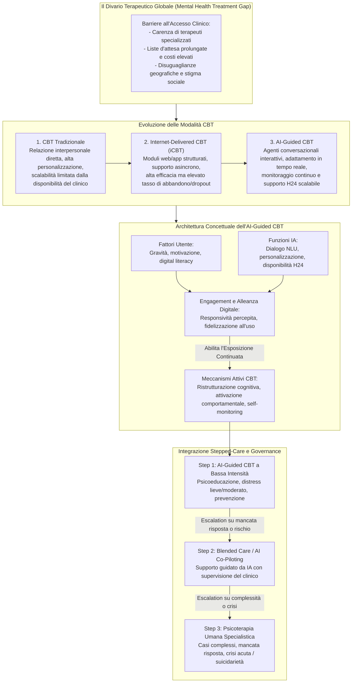
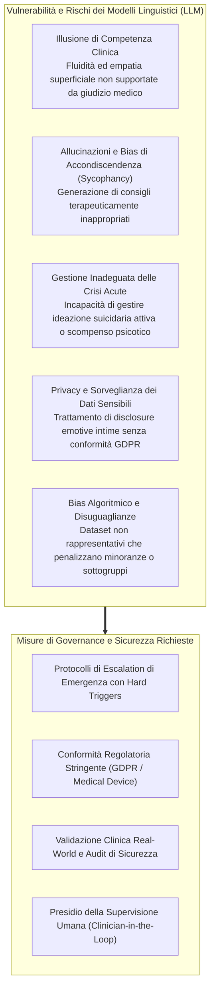
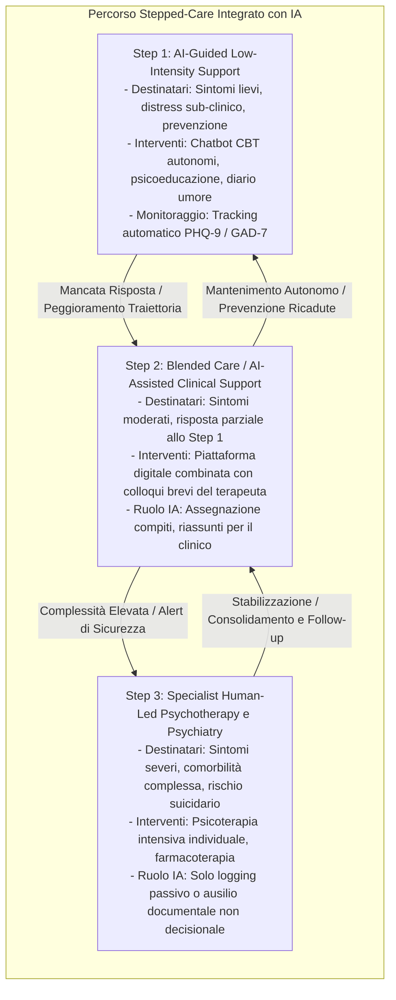

# AI-Guided Cognitive Behavioral Therapy for Depression and Anxiety: Bridging the Mental Health Treatment Gap Through Digital Psychiatry (Stojanovic, Stankovic, & Ristic, 2026)

## Definizione Operativa e Sintesi Esecutiva
- **Revisione narrativa focalizzata con strategia di ricerca strutturata** condotta da Aleksandra Stojanovic, Miodrag Stankovic e Aleksandra Ristic (*Center for Mental Health Protection, University Clinical Center Niš* e *Faculty of Medicine, University of Niš*, Serbia; *Healthcare*, 14, 2334, 2026), che analizza la letteratura (2010–2025 su PubMed, Scopus e Google Scholar; 35 fonti chiave) sull'integrazione dell'Intelligenza Artificiale nella Terapia Cognitivo-Comportamentale (CBT) per i disturbi depressivi e d'ansia.
- **Il Mental Health Treatment Gap:** Nonostante la CBT rappresenti il trattamento psicoterapeutico di prima linea evidence-based per ansia e depressione, l'accesso alle cure rimane gravemente limitato da barriere strutturali, economiche, geografiche, carenza di professionisti sanitari e stigma.
- **Il Continuo Tecnologico della CBT:** L'articolo traccia l'evoluzione della CBT da quella **tradizionale guidata dal terapeuta** (in presenza/teleterapia) all'**iCBT** (*Internet-delivered CBT*, moduli strutturati web/mobile) fino alla **CBT Guidata da IA (*AI-Guided CBT*)** (agenti conversazionali, piattaforme adattive dinamiche, monitoraggio continuo e fenotipizzazione digitale).
- **L'Architettura Concettuale dell'AI-Guided CBT:** Gli autori formalizzano un modello multidimensionale che connette dinamicamente le caratteristiche dell'utente (gravità, digital literacy, motivazione), le funzionalità tecnologiche dell'IA (interattività, personalizzazione adattiva, disponibilità continua), i mediatori di engagement (alleanza terapeutica digitale percepita) e i meccanismi attivi della CBT (ristrutturazione cognitiva, attivazione comportamentale, esposizione, self-monitoring).
- **Risoluzione del Dilemma Meccanicistico (Relazionale vs. Funzionale):** La revisione chiarisce che la cosiddetta "alleanza terapeutica digitale" e la responsività percepita agiscono principalmente come **catalizzatori di engagement e aderenza**, mentre il vero driver dell'efficacia clinica e della riduzione dei sintomi rimane l'**esposizione strutturata e ripetuta alle tecniche CBT**.
- **Modello di Implementazione Stepped-Care:** L'IA non deve sostituire il clinico umano, ma essere posizionata come intervento scalabile a bassa intensità all'interno di modelli di cure a gradini (*stepped-care*) e ibridi (*blended care*), riservando la presa in carico umana ai casi complessi, moderato-severi, o in fase di crisi acuta.

---

## Analisi Comparativa: CBT Tradizionale, iCBT e AI-Guided CBT

Il documento formalizza una dettagliata matrice comparativa (Tabella 2 del testo originale) che discrimina le tre generazioni di erogazione della Terapia Cognitivo-Comportamentale:

| Dimensione | CBT Tradizionale (Therapist-Led) | CBT Digitale / iCBT | CBT Guidata da IA (AI-Guided CBT) |
| :--- | :--- | :--- | :--- |
| **Modalità di Erogazione** | Sedute in presenza (*face-to-face*) o videosedute individuali con terapeuta qualificato | Moduli CBT strutturati fruibili via web browser o applicazione mobile | Piattaforma digitale interattiva o agente conversazionale intelligente (chatbot/LLM) |
| **Coinvolgimento Umano** | **Elevato:** il terapeuta dirige valutazione, formulazione clinica, intervento e monitoraggio | **Variabile:** non guidato (*self-help*), guidato o parzialmente supportato da un tutor | **Basso-Moderato:** guida automatizzata con opzione di supervisione/escalation clinica |
| **Livello di Personalizzazione** | Basata su formulazione del caso clinico, giudizio esperto e feedback del paziente | Basata su moduli sequenziali predefiniti e percorsi selezionati dall'utente | **Adattiva in tempo reale:** basata su input utente, traiettorie sintomatologiche e pattern di interazione |
| **Relazione Terapeutica** | Alleanza terapeutica interpersonale diretta, dinamica e basata su sintonia emotiva | Supporto terapeutico limitato o mediato dal sistema a seconda del grado di guida | **Alleanza Terapeutica Digitale:** responsività percepita che sostiene l'engagement (non sostituisce l'alleanza umana) |
| **Monitoraggio dei Sintomi** | Valutazione periodica tramite colloquio clinico e scale psicometriche standardizzate | Autosomministrazione ripetuta di questionari self-report e progress tracking | **Monitoraggio continuo/frequente:** questionari integrati, feedback d'interazione e fenotipizzazione digitale passiva |
| **Meccanismi CBT Cardine** | Ristrutturazione cognitiva, attivazione comportamentale, esposizione, abilità di coping, prevenzione ricadute | Esercizi strutturati, psicoeducazione modulare, compiti comportamentali, diari di automonitoraggio | Erogazione interattiva di tecniche CBT, prompt socratici adattivi, loop di feedback e self-monitoring continuo |
| **Accessibilità e Scalabilità** | **Limitata:** vincolata a disponibilità del terapeuta, costi, dislocazione geografica e liste d'attesa | **Elevata:** più scalabile della terapia classica, specie in formati guidati di self-help | **Massima:** scalabilità teoricamente illimitata e disponibilità H24, ma dipendente dall'accesso digitale |
| **Principali Limitazioni** | Vincoli di forza lavoro, costi elevati, disparità di accesso territoriale | Elevato tasso di abbandono (*dropout*), engagement variabile, rigidità modulare | Evidenze a lungo termine limitate, rischi di sicurezza/allucinazioni LLM, bias algoritmici, questioni etico-legali |
| **Ruolo Clinico Ottimale** | Trattamento specialistico di prima linea per quadri complessi e severità moderato-grave | Intervento a bassa intensità o adiuvante per sintomatologia lieve-moderata | Supporto complementare a bassa intensità in modelli *stepped-care* o ibridi |

---

## Il Framework Concettuale dell'AI-Guided CBT

Stojanovic e colleghi (2026) propongono un'architettura integrata che scompone l'intervento in livelli funzionali interconnessi:

```mermaid
flowchart LR
    subgraph Inputs ["1. Input e Moderatori Utente"]
        U1["Gravità Clinica (Lieve/Moderata vs Severa)"]
        U2["Digital Literacy e Competenze Tecnologiche"]
        U3["Motivazione e Preferenza per Self-Care"]
        U4["Comorbilità e Supporto Sociale"]
    end

    subgraph CoreAI ["2. Funzionalità Tecnologiche dell'IA"]
        F1["NLU e Interfaccia Conversazionale Fluida"]
        F2["Personalizzazione Adattiva dei Contenuti"]
        F3["Disponibilità Continua e Immediatezza H24"]
        F4["Notifiche Intelligenti e Micro-Interventi"]
    end

    subgraph Mediators ["3. Meccanismi di Engagement"]
        M1["Alleanza Terapeutica Digitale Percepita"]
        M2["Sensazione di Supporto e Validazione"]
        M3["Aderenza Continuata e Riduzione del Dropout"]
    end

    subgraph TherapeuticEngine ["4. Meccanismi Attivi CBT"]
        C1["Ristrutturazione Cognitiva (Thought Records)"]
        C2["Attivazione Comportamentale Pianificata"]
        C3["Esposizione Graduata e Skills Training"]
        C4["Symptom Tracking e Digital Phenotyping"]
    end

    subgraph Outcomes ["5. Esiti Clinici e Sistemici"]
        O1["Riduzione Sintomi Depressivi e Ansiosi"]
        O2["Aumento dell'Autoefficacia e Self-Management"]
        O3["Decompressione dei Servizi Specialistici"]
        O4["Riduzione del Mental Health Treatment Gap"]
    end

    Inputs --> CoreAI
    CoreAI --> Mediators
    Mediators -->|Fattore Abilitante| TherapeuticEngine
    TherapeuticEngine --> Outcomes
```

### Componenti Fondative del Modello:
1. **Determinanti Individuali e Moderatori di Risposta:** L'efficacia non è uniforme. Fattori quali il livello di ansia/depressione di base, la familiarità tecnologica, l'età e la preferenza per il supporto autonomo determinano l'aderenza.
2. **Leve Tecnologiche dell'Interazione:** La fluidità del linguaggio naturale e l'adattabilità dei percorsi trasformano la fruizione passiva di testi in un'esperienza interattiva e conversazionale.
3. **Engagement come Ponte Clinico:** L'esperienza utente (*UX*), la reattività tempestiva e la sensazione di essere ascoltati mantengono il paziente ancorato al percorso, contrastando l'attrito che storicamente penalizza le app di salute mentale.
4. **Attivazione dei Processi Cognitivo-Comportamentali:** Il lavoro clinico effettivo avviene attraverso compiti strutturati (sfida ai pensieri disfunzionali, monitoraggio dell'umore, pianificazione di attività piacevoli o di padronanza).

---

## Il Dibattito: Alleanza Digitale vs. Meccanismi Funzionali di Cambiamento

Uno dei contributi teorici più rilevanti della revisione è l'analisi critica della natura dell'**Alleanza Terapeutica Digitale (*Digital Therapeutic Alliance*)**:

- **La Distinzione tra Alleanza Autentica e Responsività Percepita:**
  - Nella psicoterapia tradizionale, l'alleanza terapeutica (modello di Bordin) richiede un'intenzionalità reciproca, sintonizzazione affettiva autentica e negoziazione dinamica di obiettivi e compiti condivisi.
  - Nei sistemi di IA, la "comprensione" è una simulazione algoritmica basata sul riconoscimento di pattern linguistici.
- **Il Dilemma Meccanicistico:**
  - *Ipotesi Relazionale:* Il miglioramento clinico deriva dall'esperienza soggettiva di supporto emotivo e validazione offerta dal chatbot.
  - *Ipotesi Funzionale (Sostenuta dagli Autori):* L'alleanza digitale funge da **abilitatore di ingaggio (*engagement facilitator*)**, mentre la riduzione dei sintomi è causata dall'**esposizione ripetuta, sistematica e strutturata alle tecniche CBT** (ristrutturazione cognitiva, attivazione comportamentale, desensibilizzazione).
- **Implicazioni per la Progettazione Clinica dell'IA:** I sistemi basati su LLM non devono mirare a creare un'illusione di intimità umana (*empathy trap* o *artificial intimacy*), ma devono ottimizzare la chiarezza didattica, la puntualità dei promemoria e l'accuratezza nella guida agli esercizi cognitivo-comportamentali.

---

## Monitoraggio dei Sintomi e Fenotipizzazione Digitale

La revisione esamina il passaggio dalla valutazione psicometrica episodica al monitoraggio longitudinale continuo:
1. **Scale Standardizzate Integrate:** Somministrazione dinamica e cadenzata di scale validate (PHQ-9 per la depressione; GAD-7 per l'ansia) che permettono di tracciare le traiettorie di risposta e calcolare curve di miglioramento o deterioramento in tempo reale.
2. **Fenotipizzazione Digitale (*Digital Phenotyping*):** Raccolta passiva di biomarcatori comportamentali derivati dallo smartphone (attività motoria, variabilità del sonno, latenze di risposta, pattern di utilizzo delle app, tratti linguistici e stilistici nelle interazioni scritte).
3. **Valore Clinico e Rischi:**
   - *Vantaggi:* Rilevamento precoce di oscillazioni timiche sub-cliniche o segnali prodromici di ricaduta; aumento della consapevolezza metacognitiva del paziente.
   - *Limiti:* Mancanza di validazione clinica su larga scala per molti indici passivi, rischio di falsi allarmi e delicate questioni relative alla privacy e alla sorveglianza continuata dei dati sensibili.

---

## Sicurezza Clinica, Questioni Etiche e Governance degli LLM

L'integrazione dei Large Language Models (LLM) di ultima generazione offre una fluidità conversazionale inedita ma pone specifiche criticità:

- **L'Illusione di Empatia Clinica:** La capacità generativa degli LLM può indurre gli utenti a rivelare traumi profondi o crisi complesse per le quali l'agente non è clinicamente validato né strutturato per intervenire.
- **Protocolli di Escalation Rigidi:** Presenza indispensabile di filtri deterministici per l'identificazione di parole chiave legate a suicidio, autolesionismo o violenza, con interruzione del dialogo automatico e re-indirizzamento a linee telefoniche di emergenza o contatto diretto con il curante.
- **Protezione Dati e Normative (GDPR):** Necessità di crittografia avanzata, consenso informato trasparente, minimizzazione dei dati personali e garanzia che i log clinici non vengano impiegati per il riaddestramento di modelli commerciali aperti.

---

## Implementazione Clinica nei Modelli Stepped-Care e Ibridi

Gli autori sottolineano che l'AI-guided CBT non deve operare come silos isolato ma integrarsi organicamente nelle reti di salute mentale:

### Fattori Chiave per l'Implementation Science:
1. **Formazione dei Clinici:** Addestramento degli psicoterapeuti all'uso degli strumenti digitali, all'interpretazione delle dashboard sintomatologiche e alla gestione dei limiti degli algoritmi.
2. **Integrazione nei Flussi di Lavoro:** Compatibilità tecnica con le cartelle cliniche elettroniche (*EHR*) e definizione chiara delle responsabilità medico-legali.
3. **Modelli di Rimborsabilità:** Riconoscimento tariffario e assicurativo per gli interventi digitali validati (es. analoghi ai percorsi DiGA in Germania o FDA digital therapeutics).

---

## Valutazione Metodologica, Limiti e Direzioni di Ricerca

### Limiti della Letteratura Evidenziati:
- **Eterogeneità Metodologica:** Gli studi inclusi spaziano da semplici chatbot a regole fisse a complessi agenti generativi, rendendo complesse le metanalisi cumulative.
- **Follow-up Breve:** Prevalenza di studi con valutazioni a 4-8 settimane, con scarsità di dati sul mantenimento dei guadagni clinici e sulla prevenzione delle ricadute a 6-12 mesi.
- **Bias di Auto-Selezione:** Campioni spesso composti da popolazioni giovani, altamente istruite e motivate (es. studenti universitari), con limitata generalizzabilità a coorti cliniche reali e anziane.

### Priorità di Ricerca Future:
1. **Trial Clinici Randomizzati Rigorosi (RCT) in Real-World Settings:** Valutare l'efficacia comparativa rispetto alle cure usuali (*TAU*) e alle terapie guidate da umani.
2. **Dissezionamento dei Meccanismi di Cambiamento:** Condurre studi di mediazione statistica per isolare il peso relativo della frequenza di interazione, della ristrutturazione cognitiva e dell'alleanza digitale percepita.
3. **Sviluppo di Linee Guida e Standard di Certificazione:** Formalizzazione di criteri condivisi per la valutazione di sicurezza, efficacia clinica e trasparenza degli algoritmi terapeutici.

---

## Riferimenti Bibliografici

- Stojanovic, A., Stankovic, M., & Ristic, A. (2026). AI-Guided Cognitive Behavioral Therapy for Depression and Anxiety: Bridging the Mental Health Treatment Gap Through Digital Psychiatry. *Healthcare*, 14(15), 2334. https://doi.org/10.3390/healthcare14152334
- Abd-Alrazaq, A., Rababeh, A., Alajlani, M., Bewick, B. M., & Househ, M. (2020). Effectiveness and safety of using chatbots to improve mental health: Systematic review and meta-analysis. *Journal of Medical Internet Research*, 22(7), e16021.
- Andersson, G., Titov, N., Dear, B. F., Rozental, A., & Carlbring, P. (2019). Internet-delivered psychological treatments: From innovation to implementation. *World Psychiatry*, 18(1), 20–28.
- Beck, A. T., Rush, A. J., Shaw, B. F., Emery, G., DeRubeis, R. J., & Hollon, S. D. (2024). *Cognitive Therapy of Depression*. Guilford Publications.
- Carlbring, P., Andersson, G., Cuijpers, P., Riper, H., & Hedman-Lagerlöf, E. (2017). Internet-based vs. face-to-face cognitive behavior therapy for psychiatric and somatic disorders: An updated systematic review and meta-analysis. *Cognitive Behaviour Therapy*, 47(1), 1–18.
- Chen, L. T., Yang, L. C., Lin, F. Y., & Lin, Y. H. (2025). Systematic review: The integration of artificial intelligence-powered cognitive-behavioural therapy for autonomous mental health management. *Archives of Psychiatric Nursing*, 57, 151916.
- Cuijpers, P., Karyotaki, E., Reijnders, M., & Huibers, M. J. H. (2018). Who benefits from psychotherapies for adult depression? A meta-analytic update. *Cognitive Behaviour Therapy*, 47(2), 91–106.
- Farzan, M., Ebrahimi, H., Pourali, M., & Sabeti, F. (2025). Artificial intelligence-powered cognitive behavioral therapy chatbots, a systematic review. *Iranian Journal of Psychiatry*, 20(1), 102–110.
- Hua, Y., Na, H., Li, Z., Liu, F., Fang, X., Clifton, D., & Torous, J. (2025). A scoping review of large language models for generative tasks in mental health care. *NPJ Digital Medicine*, 8, 265.
- Inkster, B., Sarda, S., & Subramanian, V. (2021). An empathy-driven, conversational artificial intelligence agent for digital mental health: Real-world data evaluation. *JMIR mHealth and uHealth*, 9(11), e19065.
- Kazdin, A. E. (2019). Annual research review: Expanding mental health services through novel models of intervention delivery. *Journal of Child Psychology and Psychiatry*, 60(4), 455–472.
- Lawrence, H. R., Schneider, R. A., Rubin, S. B., Matarić, M. J., McDuff, D. J., & Jones Bell, M. (2024). The opportunities and risks of large language models in mental health. *JMIR Mental Health*, 11, e59479.
- Moshe, I., Terhorst, Y., Philippi, P., Domhardt, M., Cuijpers, P., Cristea, I., ... & Sander, L. B. (2021). Digital interventions for the treatment of depression: A meta-analytic review. *Psychological Bulletin*, 147(8), 749–786.
- Torous, J., Bucci, S., Bell, I. H., Kessing, L. V., Faurholt-Jepsen, M., Whelan, P., ... & Firth, J. (2021). The growing field of digital psychiatry: Current evidence and the future of apps, social media, chatbots, and virtual reality. *World Psychiatry*, 20(3), 318–335.
- Vaidyam, A. N., Wisniewski, H., Halamka, J. D., Kashavan, M. S., & Torous, J. B. (2019). Chatbots and conversational agents in mental health: A review of the psychiatric landscape. *Canadian Journal of Psychiatry*, 64(7), 456–464.
- World Health Organization. (2022). *World Mental Health Report: Transforming Mental Health for All*. World Health Organization.

---

## Relazioni
- Vedi anche: [[conceptual-architecture-of-ai-guided-cbt]], [[functional-vs-relational-mechanisms-in-ai-therapy]], [[healthcare-14-00820]], [[healthcare-13-02340]], [[cbt-dialogue-systems-and-tools]], [[ai-enhanced-cbt]], [[digital-therapeutic-alliance]], [[stepped-care-ai-integration]], [[clinical-readiness-gap-in-mh-chatbots]], [[power-safety-paradox]], [[tiered-human-ai-healing-ecosystem]], [[simulated-empathy-vs-authentic-presence]], [[modello-centauro-clinico]], [[fpubh-14-1792627]], [[2407.19422v1]], [[2508.00847v1]]
