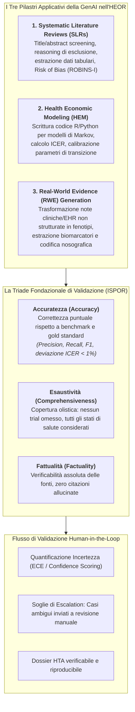
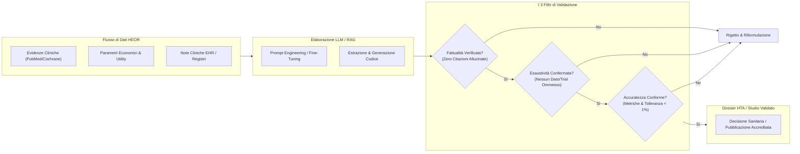

# Validazione di Modelli di IA Generativa nell'HEOR (Health Economics and Outcomes Research)

## Definizione Operativa
- La **Validazione della GenAI nell'HEOR** definisce l'insieme di principi metodologici, metriche computazionali e protocolli di verifica umana necessari per valutare l'affidabilità, la sicurezza e la trasferibilità clinico-economica dei Large Language Models (LLM) quando impiegati per compiti critici di sintesi delle evidenze, modellazione economica e generazione di evidenze dal mondo reale (*Real-World Evidence* - RWE) (Fleurence et al., 2025; Reason et al., 2024; Robinson et al., 2023).
- **La Specificità dell'HEOR:** A differenza di applicazioni puramente conversazionali o diagnostiche, i compiti HEOR richiedono un'interazione ibrida tra ragionamento quantitativo (calcoli parametrici, tassi di sconto, matrici di Markov), comprensione semantica specialistica (criteri PICO, estrazione dati clinici da EHR) e rigore regolatorio per i dossier di Health Technology Assessment (HTA).
- **La Triade Qualitativa Cardine:** Secondo il framework [[elevate-genai-framework]] (ISPOR 2025), la validazione nell'HEOR non può ridursi alla sola "accuratezza statistica", ma deve essere articolata nella triade inscindibile di **Accuratezza (*Accuracy*)**, **Esaustività (*Comprehensiveness*)** e **Fattualità (*Factuality*)**, integrata con la quantificazione dell'incertezza e la calibrazione probabilistica.

---

## I Tre Ambiti Applicativi e le relative Sfide di Validazione

### 1. Automazione delle Revisioni Sistematiche (SLR)
- **Compiti Svolti:** Screening di massa di titoli/abstract basato su criteri di inclusione/esclusione; estrazione strutturata di endpoint clinici e grandezze d'effetto; classificazione del rischio di bias.
- **Evidenze e Benchmark (es. Bio-SIEVE):** Modelli specializzati tramite instruction tuning (es. LLaMA/Guanaco 7B addestrati su 7.330 review Cochrane; Robinson et al., 2023) raggiungono precisione dell'85% e recall dell'82%, superando i modelli statistici tradizionali. Tuttavia, la formulazione del ragionamento di esclusione (*exclusion reasoning*) rimane fragile rispetto a modelli commerciali a larga scala.
- **Rischio Critico:** Il *falso negativo* nello screening: escludere erroneamente un trial clinico cardine inficia l'intera validità della successiva meta-analisi (fallimento dell'esaustività).

### 2. Modellazione Economica Sanitaria (HEM)
- **Compiti Svolti:** Generazione automatica di script di simulazione (in R o Python); programmazione di alberi decisionali e catene di Markov a stati discreti (es. *Progression-Free*, *Progressed Disease*, *Death*); determinazione degli *Incremental Cost-Effectiveness Ratios* (ICER).
- **Evidenze e Benchmark (es. Reason et al., 2024):** Utilizzando GPT-4 via prompt engineering iterativo, è stato possibile replicare con successo modelli completi di costo-efficacia per carcinoma polmonare (NSCLC, 93% di run esenti da errori) e renale (RCC), con stime ICER discostanti di meno dell'1% rispetto ai modelli pubblicati.
- **Rischio Critico:** Allucinazioni algebriche e discrepanze di discounting/cicli temporali nascoste nel codice generato, che richiedono auditing riga per riga da parte di economisti sanitari.

### 3. Generazione di Real-World Evidence (RWE)
- **Compiti Svolti:** Estrazione di variabili cliniche complesse (es. stato mutazionale PD-L1, presenza di opacità a vetro smerigliato nei referti radiologici, compliance farmacologica) da testi liberi in Cartelle Cliniche Elettroniche (EHR).
- **Rischio Critico:** *Domain shift* e disomogeneità lessicale tra strutture ospedaliere; rischio di de-anonimizzazione e violazione della privacy (HIPAA/GDPR) durante il processing con LLM cloud.

---

## Analisi Comparata della Triade di Qualità

| Dimensione | Quesito Metodologico Fondamentale | Metriche Tipiche | Esempio di Fallimento Specifico nell'HEOR |
| :--- | :--- | :--- | :--- |
| **Accuratezza (*Accuracy*)** | *I singoli dati, decisioni o stime numeriche generati corrispondono esattamente alla ground truth?* | Precision, Recall, F1-Score, AUC, Scostamento % ICER, BLEU. | Un LLM assegna un costo unitario errato a un farmaco, alterando il calcolo dell'ICER pur avendo strutturato correttamente le equazioni. |
| **Esaustività (*Comprehensiveness*)** | *Tutti i componenti necessari, prospettive di costo, trial e stati di transizione sono stati inclusi?* | Valutazione qualitativa di esperti, coverage ratio rispetto a checklist HTA/PRISMA. | In una SLR per un nuovo oncologico, l'LLM analizza perfettamente 8 studi ma salta il trial di fase III fondamentale per mancata interpretazione dei filtri temporali. |
| **Fattualità (*Factuality*)** | *Le affermazioni, i dati citati e i riferimenti bibliografici sono reali, verificabili e non inventati?* | Tasso di allucinazione (*hallucination rate*), verifica incrociata automatica/manuale delle fonti primarie. | Il modello genera una rassegna con citazioni bibliografiche formalmente perfette (titolo plausibile, autori noti) con DOI inesistenti o conclusioni attribuite erroneamente. |

---

## Calibrazione dell'Incertezza e Paradigma Human-in-the-Loop

Nell'applicazione dell'IA all'economia sanitaria, l'iperconfidenza (*overconfidence*) dell'LLM rappresenta una delle vulnerabilità più insidiose:
1. **Expected Calibration Error (ECE):** Misura lo scostamento tra la probabilità stimata dal modello (es. confidenza del 95% che un abstract sia pertinente) e la frequenza empirica reale di correttezza. Nei modelli linguistici attuali, l'ECE è spesso elevato a causa del fine-tuning RLHF che induce compiacenza.
2. **Soglie di Revisione Dinamica:** Nei protocolli ibridi uomo-macchina, gli abstract o i blocchi di codice la cui confidenza cade al di sotto di una soglia prefissata (es. $< 0.90$) vengono deviati automaticamente a un revisore umano esperto, garantendo la sicurezza senza annullare i guadagni di efficienza.
3. **Tutela dei Dati Tramite Dati Fittizi (*Dummy Data*):** Per validare pipeline di simulazione economica su LLM commerciali senza violare le normative sulla privacy (GDPR/HIPAA), è buona prassi sostituire i dati reali sensibili con dataset fittizi di pari struttura durante la fase di programmazione e debug del codice.

---

## Riferimenti Bibliografici
- Fleurence, R. L., Dawoud, D., Bian, J., Higashi, M. K., Wang, X., Xu, H., Chhatwal, J., & Ayer, T. (2025). ELEVATE-GenAI: Reporting Guidelines for the Use of Large Language Models in Health Economics and Outcomes Research: An ISPOR Working Group Report. *Value in Health*, 28(11), 1611–1625. https://doi.org/10.1016/j.jval.2025.06.018
- Reason, T., Rawlinson, W., Langham, J., Gimblett, A., Malcolm, B., & Klijn, S. (2024). Artificial intelligence to automate health economic modelling: a case study to evaluate the potential application of large language models. *PharmacoEconomics - Open*, 8(2), 191–203.
- Robinson, A., Thorne, W., Wu, B. P., et al. (2023). Bio-sieve: Exploring instruction tuning large language models for systematic review automation. *arXiv preprint arXiv:2308.06610*.
- Hasan, B., Saadi, S., Rajjoub, N. S., et al. (2024). Integrating large language models in systematic reviews: a framework and case study using ROBINS-I for risk of bias assessment. *BMJ Evidence-Based Medicine*, 29(6), 394–398.
- Zhao, T., Wei, M., Preston, J. S., & Poon, H. (2024). Automatic calibration and error correction for large language models via pareto optimal self-supervision. *arXiv preprint arXiv:2306.16564*.

---

## Related pages
- [[ELEVATE-GenAI2025]]
- [[elevate-genai-framework]]
- [[chart-reporting-guideline]]
- [[CHART2025]]
- [[traffic-light-quality-appraisal-clinical-ai]]
- [[human-in-the-reasoning]]
- [[structured-literature-reviews]]
- [[gdpr-governance-mental-health-ai]]
- [[large-language-models]]
- [[validita-psicometrica-llm]]
