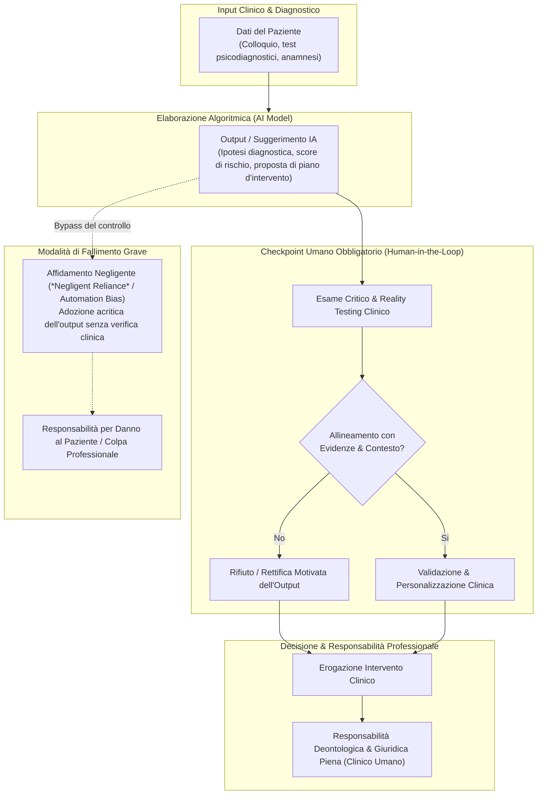

---
tags: [human-oversight, professional-liability, clinical-ai, human-in-the-loop, automation-bias, negligent-reliance, malpractice, continuing-education, apa-ethics, clinical-competence]
source_papers: ["ethical-guidance-professional-practice (1).pdf"]
---

# Supervisione Umana e Responsabilità Professionale nell'IA Clinica (Human Oversight & Liability in Clinical AI)

## Definizione Operativa
- Principio cardine di governance etico-giuridica e clinica stabilito dalle linee guida dell'**American Psychological Association (APA, 2025)** che definisce la non-delegabilità della responsabilità decisionale del professionista della salute mentale (*health service psychologist*) nell'impiego di tecnologie di intelligenza artificiale.
- **Assunto di Base:** L'IA deve operare esclusivamente come dispositivo di **potenziamento decisionale (*augmentation*)** e mai come sostituto autonomo (*replacement*) del ragionamento clinico.
- **Rischio Giuridico di "Negligent Reliance":** L'adozione passiva o acritica di raccomandazioni algoritmiche non validate, o la mancata supervisione umana dei processi automatizzati, espone il clinico a profili di colpa professionale per negligenza, imprudenza o imperizia, in quanto i sistemi di IA sono privi di personalità giuridica e non possono assumere responsabilità medico-legali.

---

## Dimensioni Concettuali e Applicative

### 1. Augmentation vs Replacement nel Ragionamento Clinico
- **L'Intelligenza Artificiale come Strumento Consultivo:** L'IA può analizzare moli massive di dati, sintetizzare trascrizioni di seduta e suggerire correlazioni cliniche probabilistiche. Tuttavia, essa manca di intenzionalità, autentica comprensione contestuale, sintonizzazione affettiva e capacità di cogliere la complessità idiografica del paziente.
- **Autonomia Professionale Indipendente:** Il clinico deve mantenere un'indipendenza di giudizio che gli consenta di scartare le raccomandazioni del modello qualora contrastino con la propria valutazione clinica diretta, con le linee guida della letteratura scientifica accreditata o con la volontà espressa dal paziente.

---

### 2. Architettura dei Punti di Intervento Umano (*Human-in-the-Loop*)
Per conformarsi alle linee guida APA (2025), le organizzazioni sanitarie e i singoli professionisti devono strutturare flussi di lavoro che includano espliciti cancelli decisionali umani:
1. **Verifica della Coerenza Clinica:** Controllo preventivo dell'adeguatezza delle risposte o formulazioni dell'IA prima della loro integrazione nella cartella o condivisione con il paziente.
2. **Contrasto all'[[over-deference-in-llm-supervision|Automation Bias / Over-Deference]]:** La tendenza cognitiva a fidarsi passivamente delle conclusioni generate da macchine computazionali deve essere attivamente contrastata attraverso il *critical questioning* e il confronto con parametri empirici oggettivi.
3. **Tracciabilità delle Decisioni:** Documentazione trasparente delle motivazioni per cui una raccomandazione dell'IA è stata accolta, modificata o integralmente rigettata.

---

### 3. La Dottrina dell'Affidamento Negligente (*Negligent Reliance*)
L'integrazione clinica dell'IA non costituisce in nessun caso uno scudo di immunità legale (*liability shield*):
- **Profili di Responsabilità Medica e Psicologica:** Se un'indicazione terapeutica o diagnostica fornita da un'IA genera un danno al paziente (es. mancata rilevazione del rischio suicidario o intervento controindicato), la responsabilità giuridica ricade sul professionista che ha avallato la raccomandazione.
- **Fattori Costitutivi della Negligenza:**
  - *Mancata Validazione:* Utilizzo di tool non certificati o privi di validazione scientifica pubblicata per il contesto clinico specifico;
  - *Assenza di Supervisione:* Mancata esecuzione di controlli umani sistematici sugli output prima dell'atto clinico;
  - *Mancata Trasparenza:* Omissione dell'informativa al paziente sull'impiego dello strumento.

---

### 4. Il Dovere Deontologico di Formazione Continua (*Continuing Education*)
L'imperizia tecnologica non è ammessa come giustificazione deontologica. L'APA stabilisce l'obbligo per i professionisti di:
- **Acquisire Alfabetizzazione sull'IA (*AI Literacy*):** Comprensione dei principi base del machine learning, delle architetture generative, delle metriche di accuratezza psicometrica e delle modalità di addestramento dei modelli.
- **Aggiornamento Continuativo:** Partecipazione regolare a moduli di formazione continua (CE) dedicati all'evoluzione degli algoritmi clinici, alla sicurezza dei dati sanitari e alle tecniche di identificazione delle allucinazioni e dei bias algoritmici.

---

## Sintesi Comparativa dei Livelli di Responsabilità

| Aspetto | Sviluppatore / Vendor IA | Professionista Sanitario / Psicologo |
| :--- | :--- | :--- |
| **Ruolo Primario** | Progettazione, addestramento, testing tecnico e fornitura del software. | Valutazione clinica, decisione diagnostico-terapeutica ed erogazione della cura. |
| **Ambito di Responsabilità** | Sicurezza informatica, aderenza a specifiche tecniche e dichiarazione trasparente dei dati di training. | Responsabilità diretta sul benessere del paziente, consenso informato e appropriatezza clinica dell'intervento. |
| **Profilo di Colpa Tipico** | Difetto del prodotto, mancata conformità normativa pre-market (es. EU AI Act / FDA). | Negligenza clinica, affidamento acritico (*negligent reliance*), violazione del codice deontologico. |

---

## Riferimenti Bibliografici
- American Psychological Association [APA] - Mental Health Technology Advisory Committee [MHTAC]. (2025). *Ethical Guidance for AI in the Professional Practice of Health Service Psychology*. Washington, D.C.: APA.
- American Psychological Association [APA]. (2017). *Ethical Principles of Psychologists and Code of Conduct*. Washington, D.C.: APA.
- Cabitza, F., Campagner, A., & Balsano, C. (2020). Bridging the uncanny valley of artificial intelligence in medicine. *Future Healthcare Journal*, 7(2), e37–e40. https://doi.org/10.7861/fhj.2020-0037
- Char, D. S., Abràmoff, M. D., & Feudtner, C. (2020). Identifying ethical considerations for machine learning healthcare applications. *The American Journal of Bioethics*, 20(11), 7–17. https://doi.org/10.1080/15265161.2020.1819469
- Xu, H., & Shuttleworth, K. M. (2024). Medical artificial intelligence and the black box problem: A view based on the ethical principle of “Do no harm”. *Intelligent Medicine*, 4(1), 52–57. https://doi.org/10.1016/j.imed.2023.08.002

---

## Relazioni
- Vedi anche: [[ethical-guidance-professional-practice-1]], [[informed-consent-for-clinical-ai]], [[over-deference-in-llm-supervision]], [[modello-centauro-clinico]], [[clinical-decision-making-and-artificial-intelligence]], [[three-layer-governance-framework]], [[algorithmic-paternalism-in-ai-mental-health]], [[gdpr-governance-mental-health-ai]], [[software-as-a-medical-device-salute-mentale]], [[automated-clinical-ai-red-teaming]]