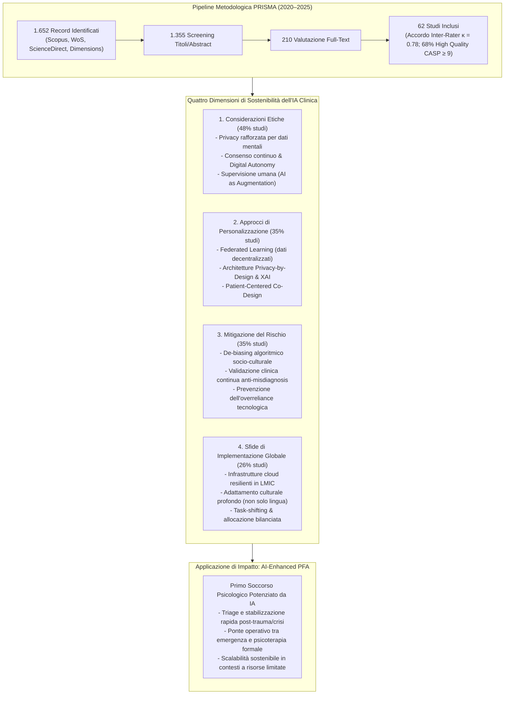

# Sustainability of AI-Assisted Mental Health Intervention: A Review of the Literature from 2020–2025 (Espino Carrasco et al., 2025)

## Definizione Operativa e Sintesi Esecutiva
- **Revisione sistematica della letteratura** condotta secondo le linee guida **PRISMA** e valutata mediante scala qualitativa **CASP** (12 punti) su **62 studi inclusi** (estratti da 1.652 record iniziali tra gennaio 2020 e dicembre 2025 su Scopus, Web of Science, ScienceDirect e Dimensions) da un consorzio accademico peruviano (Danicsa Karina Espino Carrasco et al., *International Journal of Environmental Research and Public Health*, 2025, 22, 1382).
- **Inquadramento della Sostenibilità nell'IA Clinica:** Il lavoro definisce la sostenibilità dell'IA per la salute mentale non come mero mantenimento economico-tecnologico nel tempo, bensì come un equilibrio integrato tra quattro dimensioni inscindibili:
  1. *Etica e Deontologia:* tutela della privacy sui dati mentali ipersensibili, consenso informato dinamico/continuo ([[digital-autonomy|autonomia digitale]]), equità algoritmica e inderogabile supervisione clinica umana (*human oversight*).
  2. *Personalizzazione e Preservazione della Riservatezza:* risoluzione del tradizionale dilemma tra efficacia personalizzata e tutela della confidenzialità attraverso l'[[federated-learning-and-differential-privacy-mental-health|apprendimento federato (Federated Learning)]], architetture *privacy-by-design* (es. RADAR-base) e progettazione partecipata centrata sul paziente (*patient-centered design*).
  3. *Mitigazione dei Rischi e Sicurezza Clinica:* contrasto al bias algoritmico tramite integrazione di competenze culturali (non solo matematiche), validazione empirica continua contro errori diagnostici e gestione dell'integrazione clinico-organizzativa per evitare la distruzione dell'alleanza terapeutica.
  4. *Sfide di Implementazione Globale e Risorse:* scalabilità infrastrutturale e computazionale (inclusi i paesi a basse e medie risorse / LMIC), adattamento transculturale sistemico dei modelli e schemi di *task-shifting* e allocazione sostenibile.
- **Proposta Chiave di Integrazione:** Identificazione del **Primo Soccorso Psicologico potenziato da IA ([[ai-enhanced-psychological-first-aid|AI-Enhanced Psychological First Aid - PFA]])** quale interfaccia ponte sostenibile per colmare i divari di accesso (*care gaps*) e le carenze di personale sanitario nei contesti a basse risorse o post-trauma (es. disastri climatici, emergenze educative), garantendo un primo triage e stabilizzazione a basso costo e ad alta accettabilità culturale.

---

## Evidenze dalla Letteratura e Analisi Metodologica

### 1. Dati Bibliometrici e Distribuzione Tecnologico-Clinica
- **Accelerazione Temporale della Ricerca:** Il **74,2%** degli studi inclusi è stato pubblicato nel quadriennio 2022–2025, con il picco massimo nel **2025 (25,8%, 16 studi)** e nel **2024 (24,2%, 15 studi)**, evidenziando una transizione rapida da riflessioni teoriche preliminari a sperimentazioni applicate.
- **Tecnologie di IA Esaminate:**
  - *Machine Learning tradizionale:* 45,0% (16 studi su algoritmi supervisionati/non supervisionati);
  - *Natural Language Processing (NLP):* 23,0% (estrazione di marcatori linguistici, social media monitoring);
  - *Deep Learning & Reti Neurali:* 15,0% (riconoscimento visivo delle espressioni, data fusion complessa);
  - *Explainable AI (XAI):* 9,0% (modelli interpretabili per il supporto decisionale clinico);
  - *Federated Learning (FL):* 8,0% (architetture distribuite privacy-preserving);
  - *Chatbot / Agenti Conversazionali:* 6,5% (interventi digitali interattivi).
- **Target Psicopatologici e Clinici:**
  - *Depressione:* 32,0% (screening, monitoraggio tramite digital phenotyping);
  - *Disturbi d'Ansia:* 28,0% (interventi su studenti e popolazione generale);
  - *Benessere Generale e Stress:* 29,0% (wellness sul posto di lavoro, smart homes);
  - *Disturbo da Stress Post-Traumatico (PTSD) e Traumi:* 8,1% (risposta a traumi climatici e disastri);
  - *Disturbo Bipolare:* 6,0% e *Psicosi:* 5,0% (monitoraggio longitudinale);
  - *Prevenzione del Suicidio:* 3,0% (modelli predittivi spiegabili su social media).
- **Geografia della Produzione e Divari Globali:** La leadership scientifica è concentrata in **Stati Uniti, Regno Unito, Cina e Canada** (Figure 4). La limitata rappresentazione dei paesi del Sud globale evidenzia un rischio sistemico di *geographical bias*, in quanto le tecnologie vengono sviluppate in paesi ad alto reddito ma necessitano di scalare in aree a risorse limitate dove i bisogni di salute mentale sono più critici.

---

### 2. Dimensione Etica: Privacy Rafforzata, Autonomia Digitale e Primato Umano
- **Ipersensibilità del Dato Mentale:** La letteratura ([20, 22, 45]) dimostra che le informazioni psicologiche ed emotive possiedono una vulnerabilità intrinseca superiore ai dati sanitari generali: richiedono standard crittografici avanzati, protocolli di cancellazione certa e separazione netta tra piattaforme cliniche e tracciamento commerciale.
- **Consenso Informato Dinamico (*Digital Autonomy*):** Il consenso per l'uso dell'IA nella salute mentale non può essere un modulo statico firmato una tantum ([21, 23]). La nozione di *autonomia digitale* richiede:
  - Spiegazioni trasparenti e calibrate sui livelli di alfabetizzazione digitale dell'utente;
  - Consenso modulare e revocabile in itinere rispetto a specifiche funzioni (es. analisi del sentiment, registrazione vocale, riconoscimento facciale delle emozioni [57]);
  - Cautele deontologiche dedicate per popolazioni vulnerabili (adolescenti, pazienti traumatizzati).
- **Supervisione Clinica Inderogabile (*Human-in-the-Loop*):** Tutti gli studi di riferimento ([3, 24, 27, 30]) convergono sul principio che l'IA debba operare esclusivamente come **aumento e supporto decisionale** (*AI as augmentation*), mai come sostituto del clinico. L'eliminazione del professionista umano compromette la connessione interpersonale, distrugge l'alleanza terapeutica e dissolve la catena di responsabilità medico-legale in caso di eventi avversi.

---

### 3. Personalizzazione e Risoluzione del Trade-Off tramite Federated Learning
- **Il Dilemma Storico tra Personalizzazione e Riservatezza:** Nei modelli tradizionali di machine learning centralizzato, l'ottimizzazione degli algoritmi su traiettorie individuali richiede la concentrazione di grandi moli di dati sensibili (diari clinici, registrazioni audio, risposte a questionari) su server unificati, esponendo i pazienti a rischi catastrofici di data breach o re-identificazione.
- **Il Ruolo Chiave del Federated Learning (FL):** Gli studi analizzati ([22, 28, 29]) identificano nel Federated Learning la svolta architetturale per la sostenibilità:
  - *Data Locality:* I dati grezzi del paziente non lasciano mai il dispositivo locale (smartphone, tablet o server ospedaliero protetto);
  - *Model Training Distribuito:* L'algoritmo viene addestrato localmente e trasmette al server centrale unicamente i pesi e i gradienti di aggiornamento matematico (spesso protetti da *Differential Privacy*);
  - *Personalizzazione Accurata ed Equa:* Consente ai modelli di apprendere da popolazioni eterogenee senza violare i confini di confidenzialità né violare normative stringenti come GDPR o HIPAA.
- **Piattaforme di Digital Phenotyping Sicuro:** Sistemi come **RADAR-base** ([32]) e piattaforme basate su sensoristica indossabile IoT ([73]) mostrano che la raccolta passiva di biomarker digitali (sonno, mobilità, prosodia vocale) può essere integrata in modo eticamente sostenibile solo combinando crittografia *end-to-end* e tecniche di **Explainable AI (XAI)** che rendono chiaro al paziente e al terapeuta il motivo di ogni alert clinico.

---

### 4. Mitigazione del Rischio Clinico e Integrazione Culturale del De-Biasing
- **Il Bias Algoritmico come Questione Socio-Culturale:** Contrariamente alla visione riduzionista che interpreta il bias come un mero errore statistico di campionamento, la review ([8, 20, 24, 25, 52]) evidenzia che il bias algoritmico nella salute mentale è intrinsecamente radicato nelle discrepanze culturali, linguistiche e contestuali:
  - Algoritmi addestrati su popolazioni occidentali ad alto reddito (WEIRD) falliscono nel riconoscere espressioni sintomatologiche mediate da costrutti culturali diversi (es. somatizzazione del distress emotivo vs verbalizzazione diretta).
  - La mitigazione del bias richiede team interdisciplinari e audit periodici condotti con esperti culturali locali, non solo metriche astratte di parità matematica.
- **Prevenzione del Misdiagnosis e Sicurezza Diagnostica:** Studi di data fusion multimodale e deep learning ([51, 58]) evidenziano come la diagnosi precoce (es. autismo infantile, rischio suicidario) richieda una validazione clinica longitudinale e protocolli continui di monitoraggio delle prestazioni per prevenire falsi positivi stigmatizzanti o falsi negativi fatali ([33, 35, 36]).

---

### 5. Sfide di Implementazione e Integrazione con il Primo Soccorso Psicologico (PFA)
- **Barriere Tecnico-Infrastrutturali:** L'implementazione nei sistemi sanitari pubblici e nei contesti a basse risorse affronta colli di bottiglia severi: scarsità di potenza di calcolo, connettività instabile, frammentazione dei sistemi informativi ospedalieri ([37, 38, 65]).
- **Il Modello AI-Enhanced Psychological First Aid (PFA):**
  - Nei paesi a basse e medie risorse (LMIC), dove il rapporto tra psichiatri/psicoterapeuti e popolazione è drammaticamente deficitario ([42]), l'IA non può pretendere di erogare psicoterapia ad alta intensità.
  - Può invece potenziare in modo sostenibile i protocolli di **Primo Soccorso Psicologico (Psychological First Aid)** ([53, 56, 71]):
    - Interventi di stabilizzazione emotiva immediata, psicoeducazione e grounding post-evento traumatico (es. disastri climatici, crisi umanitarie);
    - Integrazione con pratiche di cura comunitarie e conoscenze tradizionali locali ([56]);
    - Modelli di *task-shifting* ([42]), in cui operatori non specialisti ed educatori ([53]) utilizzano toolkit assistiti da IA per identificare precocemente il distress e indirizzare i casi critici ai pochi specialisti disponibili.

---

## Matrice Analitica delle Dimensioni di Sostenibilità

| Dimensione | Fattori Chiave di Rischio | Soluzioni Tecnologiche & Cliniche | Risultato per la Sostenibilità |
| :--- | :--- | :--- | :--- |
| **Etica & Deontologia** | Violazione privacy dati mentali; paternalismo algoritmico; de-skilling clinico | Consenso dinamico (*digital autonomy*); crittografia avanzata; *human oversight* mandatorio | Fiducia sistemica, conformità normativa, salvaguardia dell'alleanza terapeutica |
| **Personalizzazione** | Dilemma isolamento vs centralizzazione dati; perdita di specificità | **Federated Learning**; architetture *privacy-by-design*; XAI per trasparenza inferenziale | Interventi su misura senza accentramento di PII; alta accuratezza diagnostica distribuita |
| **Mitigazione Rischi** | Bias algoritmico WEIRD; allucinazioni diagnostiche; overreliance | Audit di equità culturalmente contestualizzati; data fusion validata; continuous performance monitoring | Equità di trattamento, sicurezza clinica, minimizzazione del danno iatrogeno |
| **Implementazione Globale** | Deficit infrastrutturale in LMIC; barriere economiche; shortage di clinici | **AI-Enhanced Psychological First Aid**; modelli di *task-shifting*; architetture edge/cloud ibride | Scalabilità democratica, riduzione dei care gaps, resilienza comunitaria post-crisi |

---

## Riferimenti Bibliografici
- Espino Carrasco, D. K., Palomino Alcántara, M. d. R., Arbulú Pérez Vargas, C. G., Santa Cruz Espino, B. M., Dávila Valdera, L. J., Vargas Cabrera, C., Espino Carrasco, M., Dávila Valdera, A., & Agurto Córdova, L. M. (2025). Sustainability of AI-Assisted Mental Health Intervention: A Review of the Literature from 2020–2025. *International Journal of Environmental Research and Public Health*, 22(9), 1382. https://doi.org/10.3390/ijerph22091382
- Campion, J., Javed, A., Lund, C., Sartorius, N., Saxena, S., Marmot, M., Allan, J., & Udomratn, P. (2022). Public mental health: Required actions to address implementation failure in the context of COVID-19. *Lancet Psychiatry*, 9(2), 169–182. https://doi.org/10.1016/S2215-0366(21)00417-0
- Dhar, S., & Sarkar, U. (2024). Safeguarding Data Privacy and Informed Consent: Ethical Imperatives in AI-Driven Mental Healthcare. In *Intersections of Law and Computational Intelligence in Health Governance* (pp. 197–219). IGI Global. https://doi.org/10.4018/979-8-3693-1384-8.ch010
- Fiske, A., Henningsen, P., & Buyx, A. (2019). Your robot therapist will see you now: Ethical implications of embodied artificial intelligence in psychiatry, psychology, and psychotherapy. *Journal of Medical Internet Research*, 21(5), e13216. https://doi.org/10.2196/13216
- Kagee, A. (2023). Designing interventions to ameliorate mental health conditions in resource-constrained contexts: Some considerations. *South African Journal of Psychology*, 53(4), 429–437. https://doi.org/10.1177/00812463231195610
- Koutsouleris, N., Hauser, T. U., Skvortsova, V., & De Choudhury, M. (2022). From promise to practice: Towards the realisation of AI-informed mental health care. *Lancet Digital Health*, 4(11), e829–e840. https://doi.org/10.1016/S2589-7500(22)00153-4
- Laacke, S., Mueller, R., Schomerus, G., & Salloch, S. (2021). Artificial intelligence, social media and depression. A new concept of health-related digital autonomy. *American Journal of Bioethics*, 21(4), 4–20. https://doi.org/10.1080/15265161.2020.1863509
- McInnis, M. G., & Merajver, S. D. (2011). Global mental health: Global strengths and strategies. Task-shifting in a shifting health economy. *Asian Journal of Psychiatry*, 4(3), 165–171. https://doi.org/10.1016/j.ajp.2011.08.005
- Pardeshi, S. M., & Jain, D. C. (2024). AI in mental health federated learning and privacy. In *Federated Learning and Privacy-Preserving in Healthcare AI* (pp. 274–287). IGI Global. https://doi.org/10.4018/979-8-3693-0803-5.ch014
- Rashid, Z., Folarin, A. A., Zhang, Y., Ranjan, Y., Conde, P., Sankesara, H., Sun, S., Stewart, C., Laiou, P., & Dobson, R. J. B. (2024). Digital phenotyping of mental and physical conditions: Remote monitoring of patients through RADAR-Base platform. *JMIR Mental Health*, 11, e51259. https://doi.org/10.2196/51259
- Timmons, A. C., Duong, J. B., Simo Fiallo, N., Lee, T., Vo, H. P. Q., Ahle, M. W., Comer, J. S., Brewer, L. C., Frazier, S. L., & Chaspari, T. (2023). A call to action on assessing and mitigating bias in artificial intelligence applications for mental health. *Perspectives on Psychological Science*, 18(5), 1062–1096. https://doi.org/10.1177/17456916221134497

---

## Relazioni
- Concetti chiave: [[multidimensional-sustainability-mental-health-ai]], [[ai-enhanced-psychological-first-aid]], [[federated-learning-and-differential-privacy-mental-health]], [[algorithmic-bias-and-digital-inequalities]], [[consenso-dinamico-e-governance-dati-ia]], [[tiered-human-ai-healing-ecosystem]], [[power-safety-paradox]], [[human-in-the-reasoning]], [[clinical-readiness-gap-in-mh-chatbots]]
