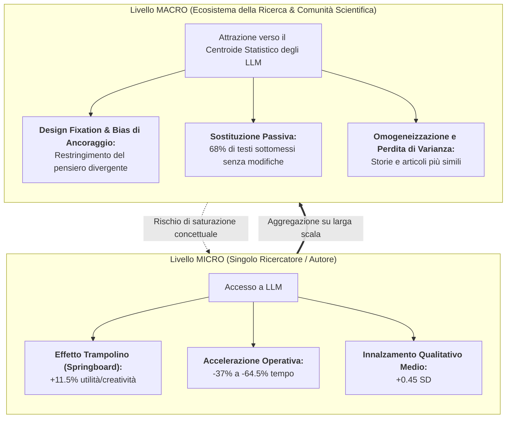

# Individual Boost vs Collective Homogenization Paradox

## Definizione Operativa
Il **Paradosso del Potenziamento Individuale vs Omogeneizzazione Collettiva** (*Individual Boost vs Collective Homogenization Paradox*) è un fenomeno socio-cognitivo ed epistemologico documentato da studi empirici ad alto impatto (Doshi & Hauser, 2024 su *Science Advances*; Noy & Zhang, 2023 su *Science*; Moongela et al., 2024; sintetizzati da Mabirizi et al., 2025 su *Discover Artificial Intelligence*).

- **A livello Micro (Singolo Ricercatore / Scrittore):** L'accesso a Large Language Models (LLM) agisce come un equalizzatore e acceleratore di efficacia, incrementando la velocità di esecuzione (+37–64.5%), la qualità media percepita (+0.45 deviazioni standard) e l'utilità/creatività del prodotto finale (+11.5%), avvantaggiando in modo sproporzionatamente elevato i soggetti con abilità di baseline inferiori o con barriere linguistiche (*skill-leveling effect*).
- **A livello Macro (Ecosistema Scientifico e Culturale Collettivo):** L'aggregazione di testi e ipotesi assistiti dai medesimi modelli probabilistici induce una marcata contrazione della varianza semantica, stilistica e concettuale. I contenuti prodotti convergono verso i cluster centrali di probabilità dei dati di pre-training, impoverendo la novità radicale e la biodiversità epistemica dell'ecosistema della ricerca.

## Evidenze dalla Letteratura

### 1. Le Evidenze Sperimentali Fondative
1. **Doshi & Hauser (2024, *Science Advances*):** L'impiego della GenAI produce un beneficio sproporzionato per gli autori con minore creatività innata, innalzando l'utilità dei testi fino all'11.5%. Tuttavia, la creatività del singolo cresce a prezzo della perdita di diversità collettiva del corpus.
2. **Noy & Zhang (2023, *Science*):** Riduzione del tempo di stesura del 37–40% e incremento della qualità media. Il 68% dei partecipanti ha sottomesso l'output grezzo dell'IA senza correzioni, confermando la transizione verso una sostizione standardizzante.
3. **Moongela et al. (2024) e Lee et al. (2025, *ACM CHI*):** L'interazione precoce con suggerimenti LLM innesca la *design fixation* e un eccesso di fiducia (*overconfidence*) in elaborati formalmente eleganti ma concettualmente standardizzati.

### 2. Dinamiche a Confronto: Micro vs Macro

| Dimensione | Dinamica a Livello Singolo (Micro) | Dinamica a Livello Collettivo (Macro) |
| :--- | :--- | :--- |
| **Produttività** | Salto quantitativo immediato. | Esplosione di sottomissioni; *review overload*. |
| **Stile** | Miglioramento della fluidità (vantaggio ESL). | Appiattimento su un registro stilistico monocorde. |
| **Ipotesi** | Brainstorming rapido. | Convergenza sui medesimi collegamenti probabilistici. |
| **Autonomia** | Percezione di competenza accresciuta. | Rischio di dipendenza e atrofia del pensiero divergente. |

**Riferimenti Bibliografici:**
- Doshi, A. R., & Hauser, O. P. (2024). Generative AI enhances individual creativity but reduces the collective diversity of novel content. *Science Advances*, 10(28), eadn5290. https://doi.org/10.1126/sciadv.adn5290
- Mabirizi, V., Katushabe, C., Muhoza, G., & Rugasira, J. (2025). A systematic review of the impact of generative AI on postgraduate research. *Discover Artificial Intelligence*, 5, 238.
- Aytes, S. A., Baek, J., & Hwang, S. J. (2025). Sketch-of-thought: Efficient llm reasoning with adaptive cognitive-inspired sketching. *arXiv preprint*, arXiv:2503.05179.
- Lee, H.-P., et al. (2025). The impact of generative AI on critical thinking. In *CHI 2025*.
- Moongela, H., et al. (2024). The Effect of Generative Artificial Intelligence on Cognitive Thinking Skills. *SACAIR 2024*.
- Noy, S., & Zhang, W. (2023). Experimental evidence on the productivity effects of generative artificial intelligence. *Science*, 381(6654), 187–192.

## Relazioni
- Vedi anche: [[s44163-025-00495-3]], [[three-pillar-postgraduate-ai-framework]], [[criteria-centric-genai-integration]], [[eight-step-genai-research-workflow]], [[cognitive-debt-in-generative-ai]], [[ai-literacy-in-academia]], [[ai-research-ethics]]
