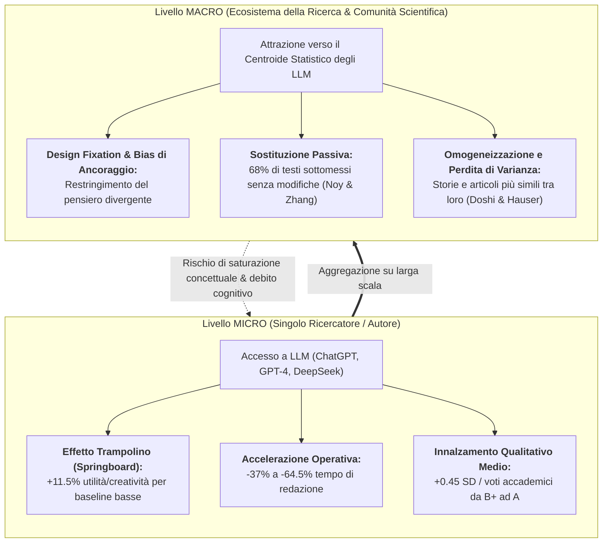
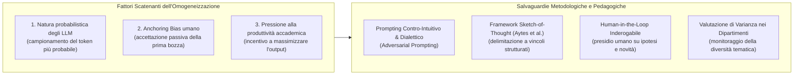

# Individual Boost vs Collective Homogenization Paradox in Generative AI (Paradosso del Potenziamento Individuale vs Omogeneizzazione Collettiva)

## Definizione Operativa
- Il **Paradosso del Potenziamento Individuale vs Omogeneizzazione Collettiva** (*Individual Boost vs Collective Homogenization Paradox*) è un fenomeno socio-cognitivo ed epistemologico documentato da studi empirici ad alto impatto (Doshi & Hauser, 2024 su *Science Advances*; Noy & Zhang, 2023 su *Science*; Moongela et al., 2024; sintetizzati da Mabirizi et al., 2025 su *Discover Artificial Intelligence*).
- **Enunciato del Paradosso:**
  - **A livello Micro (Singolo Ricercatore / Scrittore):** L'accesso a Large Language Models (LLM) agisce come un equalizzatore e acceleratore di efficacia, incrementando la velocità di esecuzione (+37–64.5%), la qualità media percepita (+0.45 deviazioni standard) e l'utilità/creatività del prodotto finale (+11.5%), avvantaggiando in modo sproporzionatamente elevato i soggetti con abilità di baseline inferiori o con barriere linguistiche (*skill-leveling effect*).
  - **A livello Macro (Ecosistema Scientifico e Culturale Collettivo):** L'aggregazione di testi e ipotesi assistiti dai medesimi modelli probabilistici induce una marcata **contrazione della varianza semantica, stilistica e concettuale**. I contenuti prodotti convergono verso i cluster centrali di probabilità dei dati di pre-training, impoverendo la novità radicale e la biodiversità epistemica dell'ecosistema della ricerca.

---

## Evidenze Empiriche e Meccanismi Neuro-Cognitivi

### 1. Le Evidenze Sperimentali Fondative

1. **Doshi & Hauser (2024, *Science Advances* - 293 scrittori, 600 valutatori):**
   - L'impiego della GenAI produce un beneficio sproporzionato per gli autori con minore creatività innata, innalzando l'utilità e la valutazione dei loro testi fino all'11.5%.
   - Tuttavia, l'analisi delle metriche di similarità semantica rivela che le opere prodotte con l'ausilio dell'IA risultano significativamente più simili tra loro rispetto a quelle scritte da autori umani indipendenti. La creatività del singolo cresce a prezzo della **perdita di diversità collettiva del corpus**.
2. **Noy & Zhang (2023, *Science* - 453 professionisti laureati):**
   - Riduzione del tempo di stesura del 37–40% e incremento della qualità media di 0.45 deviazioni standard.
   - Ciononostante, il **68% dei partecipanti trattati ha sottomesso l'output grezzo dell'IA senza alcuna correzione o personalizzazione umana**, confermando la transizione da supporto collaborativo a mera *sostituzione standardizzante*.
3. **Moongela et al. (2024) e Lee et al. (2025, *ACM CHI*):**
   - L'interazione precoce con suggerimenti generati da LLM innesca il fenomeno della *design fixation* (fissazione progettuale): il ricercatore adatta inconsapevolmente la traiettoria di indagine alle risposte probabilistiche del modello.
   - Si documenta un marcato *cognitive offloading* (scarico cognitivo), con riduzione dello sforzo critico ed eccesso di fiducia (*overconfidence*) nei confronti di elaborati formalmente eleganti ma concettualmente standardizzati.

---

### 2. Dinamiche a Confronto: Micro vs Macro

| Dimensione | Dinamica a Livello Singolo (Micro) | Dinamica a Livello Collettivo (Macro) |
| :--- | :--- | :--- |
| **Produttività e Output** | Salto quantitativo immediato; completamento rapido di paper, proposal e review. | Esplosione del volume di sottomissioni; saturazione dei comitati di peer-review (*review overload*). |
| **Qualità e Stile** | Eliminazione di errori grammaticali, miglioramento della fluidità lessicale (grande vantaggio per ESL). | Appiattimento su un registro stilistico monocorde, prevedibile e standardizzato (*AI prose*). |
| **Spazio delle Ipotesi** | Brainstorming rapido, reperimento agevole di connessioni note e concetti correlati. | Convergenza sui medesimi collegamenti probabilistici; marginalizzazione di teorie eterodosse o contro-intuitive. |
| **Autonomia Epistemica** | Percezione di competenza accresciuta (*amplified agency*). | Rischio di dipendenza sistemica e progressiva atrofia del pensiero divergente non assistito. |

---

---

## Strategie di Mitigazione Pedagogica ed Epistemica

Per sfruttare l'aumento di produttività individuale senza sacrificare la diversità concettuale e l'innovazione radicale, Mabirizi et al. (2025) e la letteratura metodologica avanzata raccomandano quattro presidi:

1. **Adversarial & Divergent Prompting (Prompting Dialettico e Divergente):** Addestrare ricercatori e studenti a non utilizzare l'LLM per ottenere "la risposta media", bensì per sollecitare obiezioni estreme, confutazioni metodologiche, scenari contro-intuitivi e prospettive marginali (superando l'effetto specchio e la tendenza all'acquiescenza algoritmica).
2. **Adozione del Framework *Sketch-of-Thought* (Aytes et al., 2025):** Utilizzare l'IA per tracciare bozze logiche scheletriche (*sketches*) e vincoli linguistici definiti, demandando interamente all'intelletto del ricercatore l'articolazione profonda, la connessione concettuale originale e la sintesi argomentativa.
3. **Divieto di Delega sulle Decisioni Epistemiche Cardine:** Come formalizzato anche nel modello [[criteria-centric-genai-integration]], la definizione dello scopo, la delimitazione delle domande di ricerca, la valutazione critica della validità metodologica dei dati e le conclusioni teoriche devono rimanere ad esclusivo presidio umano.
4. **Audit Istituzionali della Diversità Tematica:** Inserire nei comitati di dottorato e nei processi di revisione interdipartimentale metriche di originalità qualitativa volte a premiare approcci non convenzionali e a scoraggiare la proliferazione di tesi modellate su strutture ricorsive predeterminate.

---

## Riferimenti Bibliografici
- Doshi, A. R., & Hauser, O. P. (2024). Generative AI enhances individual creativity but reduces the collective diversity of novel content. *Science Advances*, 10(28), eadn5290. https://doi.org/10.1126/sciadv.adn5290
- Mabirizi, V., Katushabe, C., Muhoza, G., & Rugasira, J. (2025). A systematic review of the impact of generative AI on postgraduate research: opportunities, challenges, and ethical implications. *Discover Artificial Intelligence*, 5, Article 238. https://doi.org/10.1007/s44163-025-00495-3
- Aytes, S. A., Baek, J., & Hwang, S. J. (2025). Sketch-of-thought: Efficient llm reasoning with adaptive cognitive-inspired sketching. *arXiv preprint*, arXiv:2503.05179.
- Lee, H.-P., Sarkar, A., Tankelevitch, L., Drosos, I., Rintel, S., Banks, R., & Wilson, N. (2025). The impact of generative AI on critical thinking: Self-reported reductions in cognitive effort and confidence effects from a survey of knowledge workers. In *Proceedings of the 2025 CHI Conference on Human Factors in Computing Systems* (pp. 1–22). ACM. https://doi.org/10.1145/3706598.3713778
- Moongela, H., Matthee, M., Turpin, M., & van der Merwe, A. (2024). The Effect of Generative Artificial Intelligence on Cognitive Thinking Skills in Higher Education Institutions: A Systematic Literature Review. In *Southern African Conference for Artificial Intelligence Research* (pp. 355–371). Springer.
- Noy, S., & Zhang, W. (2023). Experimental evidence on the productivity effects of generative artificial intelligence. *Science*, 381(6654), 187–192. https://doi.org/10.1126/science.adh2586
- Siemens, G., Marmolejo-Ramos, F., Gabriel, F., Medeiros, K., Marrone, R., Joksimovic, S., & de Laat, M. (2022). Human and artificial cognition. *Computers and Education: Artificial Intelligence*, 3, 100107.
- Zhai, C., Wibowo, S., & Li, L. D. (2024). The effects of over-reliance on AI dialogue systems on students' cognitive abilities: a systematic review. *Smart Learning Environments*, 11, 24.

---

## Relazioni
- Vedi anche: [[s44163-025-00495-3]], [[three-pillar-postgraduate-ai-framework]], [[criteria-centric-genai-integration]], [[eight-step-genai-research-workflow]], [[structured-literature-reviews]], [[cognitive-debt-in-generative-ai]], [[ai-literacy-in-academia]], [[ai-research-ethics]], [[mabirizi-et-al-2025]]
