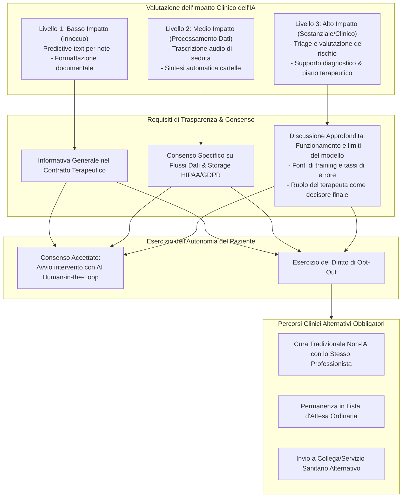

---
tags: [informed-consent, clinical-ai, apa-ethics, patient-autonomy, proportional-disclosure, opt-out-rights, mental-health-governance, gdpr-article-9]
source_papers: ["ethical-guidance-professional-practice (1).pdf"]
---

# Consenso Informato per l'IA nella Pratica Clinica e Psicologica (Informed Consent for Clinical AI)

## Definizione Operativa
- Modello etico-deontologico e procedurale formalizzato dalle linee guida dell'**American Psychological Association (APA, 2025)** che definisce i requisiti di trasparenza, autonomia decisionale e tutela dei diritti del paziente quando sistemi di Intelligenza Artificiale (algoritmi predittivi, Large Language Models, piattaforme di digital health) sono impiegati nella pratica clinica e psicologica.
- **Fondamento Deontologico:** Ancorato al *Principio E: Rispetto per i Diritti e la Dignità delle Persone* del Codice Etico APA (2017), il consenso informato per l'IA supera la semplice sottoscrizione burocratica, configurandosi come un processo relazionale continuo e trasparente volto a garantire l'autentica autodeterminazione del paziente rispetto all'intermediazione tecnologica del proprio percorso di cura.

---

## Dimensioni Chiave del Consenso Informato per l'IA

### 1. Il Modello della Divulgazione Graduata (*Proportional Disclosure*)
Le linee guida APA (2025) stabiliscono che il livello di disclosure e discussione deve essere direttamente proporzionale al potenziale impatto dell'IA sull'esito clinico e sui diritti del paziente:
1. **Applicazioni Subliminali/Strumentali:** Funzionalità di mera produttività redazionale (es. suggeritori predittivi nella digitazione delle note) non richiedono sessioni dedicate, ma possono essere incluse sinteticamente nella descrizione degli strumenti di gestione dello studio.
2. **Applicazioni di Processamento Vocale e Sintesi:** Strumenti di trascrizione e analisi semantica delle registrazioni di seduta necessitano di una chiara informativa sui flussi di dati, sulla presenza di crittografia end-to-end e sull'eventuale ritenzione dei log.
3. **Applicazioni Sostanziali e Diagnostico-Terapeutiche:** Quando l'algoritmo elabora dati per suggerire diagnosi, stimare il rischio di drop-out o proporre moduli di intervento psicoterapeutico, il clinico ha l'obbligo etico di:
   - Illustrare specificamente il nome, la natura e il funzionamento dello strumento;
   - Spiegare perché l'IA viene introdotta e quali benefici attesi giustificano il suo impiego;
   - Chiarire che il sistema algoritmico ha margini di incertezza e non sostituisce il giudizio umano.

---

### 2. Requisiti di Contenuto del Modulo Informativo
Il consenso informato scritto e verbale deve contenere:
- **Natura dell'IA e Ruolo nel Setting:** Spiegazione in linguaggio accessibile, privo di opacità tecnologica o gergo ingegneristico, comprensibile sul piano culturale, evolutivo e linguistico del paziente.
- **Limiti e Rischi di Errore:** Esplicitazione dei rischi di allucinazione, bias intrinseci o interpretazioni contestuali errate tipiche dei modelli generativi e predittivi.
- **Politica di Gestione del Dato:** Indicazione trasparente di come le informazioni personali e cliniche vengono archiviate, aggregate, de-identificate o condivise con terze parti cloud, garantendo la conformità alle normative sanitarie (HIPAA / GDPR).
- **Punto di Contatto Dedicato:** Indicazione chiara dei canali attraverso cui il paziente può rivolgere domande, richiedere chiarimenti tecnici o comunicare la revoca del consenso.

---

### 3. Il Diritto Incondizionato di Opt-Out e la Garanzia di Percorsi Alternativi
Un principio fondamentale sancito dall'APA (2025) è la salvaguardia della non-penalizzazione del paziente che rifiuta l'intermediazione algoritmica:
- **Nessuna Coercizione Diretta o Indiretta:** L'accesso alle cure non può essere subordinato all'accettazione obbligatoria di strumenti di IA.
- **Obbligo di Presentare Alternative Valide:** Il clinico deve discutere apertamente e con obiettività i pro e i contro delle opzioni non-IA disponibili, tra cui:
  - Erogazione della psicoterapia o consulenza in modalità tradizionale *face-to-face* o telepsicologia classica con lo stesso professionista;
  - Mantenimento della posizione standard nelle graduatorie di accesso o liste d'attesa;
  - Invio concordato ad altre strutture o professionisti che non impiegano tali tecnologie.

---

## Confronto: Consenso Tradizionale vs Consenso per l'IA Clinica

| Dimensione | Consenso Informato Tradizionale | Consenso Informato per l'IA Clinica (APA 2025) |
| :--- | :--- | :--- |
| **Oggetto dell'Atto** | Natura del trattamento, confidenzialità, onorari, limiti del segreto professionale. | Ruolo degli algoritmi, flussi dati terzi, validazione clinica, limiti probabilistici. |
| **Dinamica Temporale** | Solitamente una tantum all'avvio della presa in carico. | Continuo e dinamico, aggiornato all'introduzione di nuovi tool o aggiornamenti di modello. |
| **Gestione della Privacy** | Segreto professionale custodito dal singolo clinico/struttura. | Tracciamento della catena di fornitura cloud, crittografia, server terzi e rischi di re-identificazione. |
| **Autonomia del Paziente** | Diritto di interrompere il trattamento. | Diritto di rifiutare selettivamente l'IA preservando la continuità della cura umana (*opt-out*). |

---

## Riferimenti Bibliografici
- American Psychological Association [APA] - Mental Health Technology Advisory Committee [MHTAC]. (2025). *Ethical Guidance for AI in the Professional Practice of Health Service Psychology*. Washington, D.C.: APA.
- American Psychological Association [APA]. (2017). *Ethical Principles of Psychologists and Code of Conduct*. Washington, D.C.: APA.
- Martinez-Martin, N., & Kreitmair, K. (2018). Ethical issues for direct-to-consumer digital psychotherapy apps. *JMIR Mental Health*, 5(2), e32. https://doi.org/10.2196/mental.9423
- Blease, C., Kharko, A., Annoni, M., Gaab, J., & Locher, C. (2021). Machine learning in psychological interventions: Patients' perspectives and ethical considerations. *Frontiers in Psychiatry*, 12, 608881. https://doi.org/10.3389/fpsyt.2021.608881

---

## Relazioni
- Vedi anche: [[ethical-guidance-professional-practice-1]], [[human-oversight-and-liability-in-clinical-ai]], [[gdpr-governance-mental-health-ai]], [[algorithmic-paternalism-in-ai-mental-health]], [[three-layer-governance-framework]], [[prosocial-advance-directives]], [[human-in-the-reasoning]]