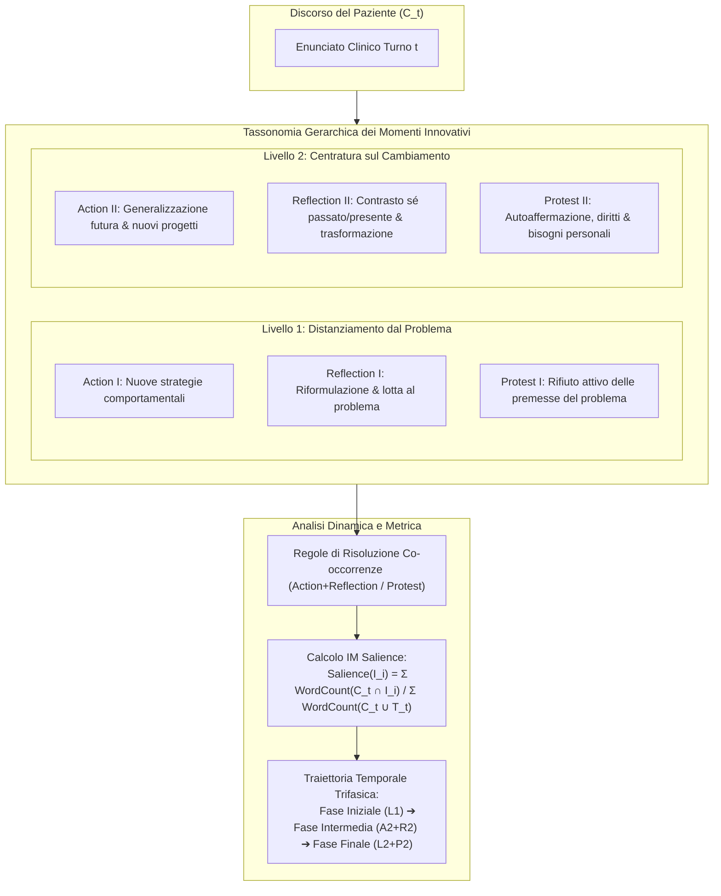

---
tags: [innovative-moment-assessment, ima-framework, imcs, terapia-narrativa, valutazione-processuale, salienza-narrativa, traiettorie-cliniche, llm-psicoterapia]
source_papers: ["2507.20241v2.pdf"]
---

# Innovative Moment Assessment (IMA)

## Definizione Operativa
- Metodologia di valutazione clinica computazionale e process-oriented introdotta da Feng et al. (2025) per quantificare l'efficacia dei dialoghi psicoterapeutici attraverso il tracciamento sistematico degli **Innovative Moments (IM)** nel discorso del paziente.
- **Utilità CBT / Psicoterapia:** Supera i limiti dei benchmark statici di NLP (BLEU, ROUGE, BERTScore) e dei punteggi generici di empatia o alleanza (che non colgono la dinamica temporale del cambiamento), traducendo l'*Innovative Moments Coding System* (IMCS; Gonçalves et al., 2011, 2012) in un protocollo analitico per misurare la progressione dal distanziamento dal problema alla ristrutturazione identitaria e all'empowerment comportamentale.

## Evidenze dalla Letteratura
- **Tassonomia dei 6 Momenti Innovativi (IM) su Due Livelli:**
  - *Livello 1: Creazione del Distanziamento dal Problema (Fasi precoci di decostruzione):*
    1. **Action I:** Nuove azioni o strategie intraprese per contrastare il problema ed esplorazione attiva di soluzioni.
    2. **Reflection I:** Nuove comprensioni/riformulazioni del problema, presa di coscienza della sua influenza nefasta e intenzione esplicita di combatterlo (*"L'ansia vuole bloccarmi, ma non intendo cedere"*).
    3. **Protest I:** Rifiuto esplicito e contestazione attiva del problema, delle sue assunzioni o delle persone che lo alimentano.
  - *Livello 2: Centratura sul Cambiamento (Fasi avanzate di ricostruzione identitaria):*
    1. **Action II:** Generalizzazione dei comportamenti positivi verso il futuro e in altri ambiti di vita; impegno in relazioni o progetti inediti.
    2. **Reflection II:** Contrasto temporale esplicito tra sé passato e presente; presa di coscienza del percorso trasformativo compiuto (*"Prima mi sarei abbattuto per giorni; ora riconosco la mia forza"*).
    3. **Protest II:** Piena autoaffermazione ed empowerment; rivendicazione incondizionata dei propri bisogni, diritti e valori autentici (*"Ho il diritto di dire di no e di pensare al mio benessere"*).
- **Regole di Codifica e Risoluzione delle Co-occorrenze:**
  - Se *Action* e *Reflection* co-occorrono nello stesso turno, vengono codificate entrambe come categorie distinte.
  - Se *Action* o *Reflection* co-occorrono con *Protest*, l'enunciato viene etichettato prioritariamente come *Protest* (secondo lo standard clinico di Gonçalves et al., 2011).
  - Gli enunciati meramente descrittivi o privi di riflessione vengono classificati come `None`.
- **Metrica di Salienza dei Momenti Innovativi (IM Salience):**
  $$\text{Salience}(I_i) = \frac{\sum_{t=1}^N \text{WordCount}(C_t \cap I_i)}{\sum_{t=1}^N \text{WordCount}(C_t \cup T_t)}$$
  La metrica quantifica la percentuale di discorso orientato al cambiamento rispetto alla totalità dell'interazione verbale, consentendo il confronto statistico rigoroso tra modelli terapeutici.
- **Traiettoria Temporale del Cambiamento Psicoterapeutico:**
  - Nei trial clinici condotti con l'agente [[interactive-narrative-therapist]], l'analisi IMA documenta un pattern trifasico speculare ai processi di psicoterapia umana riuscita (Montesano et al., 2017):
    1. *Fase Iniziale (Turni 3–20):* Netta dominanza di IM di Livello 1, guidata da *Reflection I*.
    2. *Fase Intermedia (Turni 21–35):* Picco di transizione con crescita congiunta di *Action II* e *Reflection II* (la ristrutturazione cognitiva apre simultaneamente nuove possibilità d'azione).
    3. *Fase Finale (Turni 36–50):* Consolidamento continuo di IM di Livello 2 e comparsa di *Protest II*, attestando l'acquisizione di solida agency personale.
- **Rivelazione della "Trappola del Conforto" negli LLM Generalisti:**
  - L'analisi IMA dimostra che modelli come GPT-4o e Claude-3.7 mostrano un'alta frequenza di risposte di rassicurazione ma ottengono una salienza di Livello 2 molto ridotta (~4–5%), mantenendo il cliente bloccato nella descrizione del problema. Al contrario, INT raggiunge una salienza complessiva del **29.70%** (quasi raddoppiando Action II all'8.73% e Reflection II al 9.68%).

**Riferimenti Bibliografici:**
- Feng, Y., Wang, J., Zhang, W., Chen, Z., Shen, Y., Xiao, X., Huang, M., Jing, L., & Yu, J. (2025). Reframe Your Life Story: Interactive Narrative Therapist and Innovative Moment Assessment with Large Language Models. *arXiv preprint arXiv:2507.20241v2*. https://arxiv.org/abs/2507.20241
- Gonçalves, M. M., Ribeiro, A. P., Mendes, I., Matos, M., & Santos, A. (2011). Tracking novelties in psychotherapy process research: The innovative moments coding system. *Psychotherapy Research*, 21(5), 497–509.
- Gonçalves, M. M., Mendes, I., Cruz, G., Ribeiro, A. P., Sousa, I., Angus, L., & Greenberg, L. S. (2012). Innovative moments and change in client-centered therapy. *Psychotherapy Research*, 22(4), 389–401.
- Montesano, A., Oliveira, J. T., & Gonçalves, M. M. (2017). How do self-narratives change during psychotherapy? A review of innovative moments research. *Journal of Systemic Therapies*, 36(3), 81–96.
- White, M. (2007). *Maps of narrative practice*. WW Norton & Company.

## Relazioni
- Vedi anche: [[2507.20241v2]], [[interactive-narrative-therapist]], [[terapia-narrativa-ia]], [[process-of-change]], [[clinical-fidelity-assessment]], [[process-based-therapy]], [[crdial-framework]], [[simulazione-pazienti-ai]]