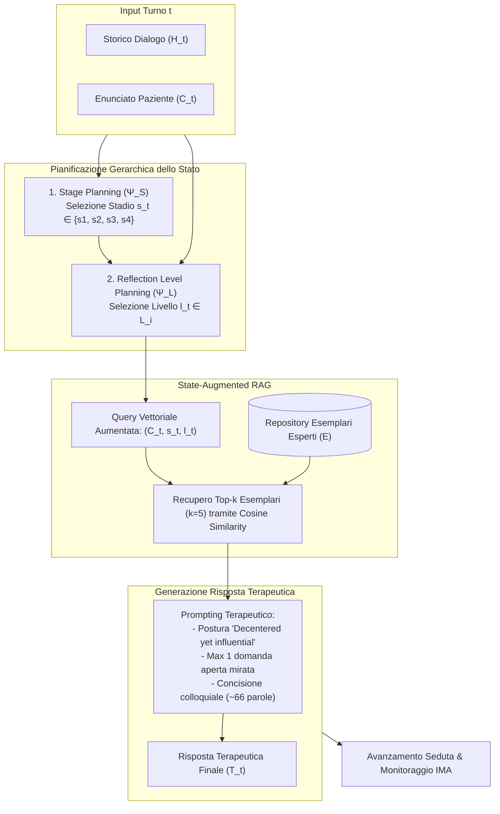

---
tags: [interactive-narrative-therapist, int-framework, terapia-narrativa, state-planning, reflection-levels, rag, llm-psicoterapia, architettura-clinica]
source_papers: ["2507.20241v2.pdf"]
---

# Interactive Narrative Therapist (INT)

## Definizione Operativa
- Framework architetturale e computazionale basato su Large Language Models (LLM) progettato da Feng et al. (2025) per simulare l'intervento di psicoterapeuti narrativi esperti attraverso una progressione clinica theory-driven e progression-aware.
- **Utilità CBT / Psicoterapia:** Supera i limiti critici del role-playing diretto (in cui gli LLM rimangono bloccati in cicli sterili di rassicurazione empatica o avanzano prematuramente compromettendo l'alleanza terapeutica), implementando uno spazio formale di pianificazione gerarchica $\Phi = \langle \mathcal{S}, \mathcal{L} \rangle$ che calibra gli stadi clinici macroscopici e la profondità dei livelli di riflessione intra-stadio in base alla prontezza del paziente (*client readiness*), supportato da Retrieval-Augmented Generation (RAG) da interventi clinici di esperti.

## Evidenze dalla Letteratura
- **I Quattro Stadi Terapeutici Sequenziali ($\mathcal{S}$):**
  1. **$s_1$: Trust Building (*Reassuring*)** – Costruzione di una base sicura, ascolto non giudicante ed esplorazione empatica delle problematiche e delle emozioni associate (White, 2007).
  2. **$s_2$: Problem Externalization (*Empowering*)** – Separazione concettuale del problema dall'identità del cliente (*"il problema è il problema, la persona non è il problema"*), disattivando auto-incolpamento e patologizzazione (White & Epston, 1990).
  3. **$s_3$: Re-authoring Conversation (*Transformative*)** – Esplorazione attiva degli eventi eccezionali (*unique outcomes*) che contraddicono la narrazione dominante e costruzione di nuove storie generative.
  4. **$s_4$: Re-membering Conversation (*Reconnecting*)** – Ricostruzione dei legami con figure significative (reali, storiche o simboliche) e valorizzazione dell'influenza relazionale reciproca.
- **Pianificazione Granulare dei Livelli di Riflessione ($\mathcal{L}_i$):**
  - *Trust Building (2 livelli):* $L_1$ (Esplorazione dell'evento problematico), $L_2$ (Supporto empatico e validazione).
  - *Problem Externalization (4 livelli):* $L_1$ (Negoziazione del nome metaforico del problema), $L_2$ (Mappatura degli effetti su contesti di vita), $L_3$ (Valutazione dell'influenza del problema), $L_4$ (Giustificazione valoriale delle valutazioni).
  - *Re-authoring Conversation (3 livelli):* $L_1$ (Elaborazione di unique outcomes/eccezioni), $L_2$ (Panorama dell'identità: scopi, valori e motivazioni), $L_3$ (Panorama dell'azione: pianificazione di comportamenti concreti).
  - *Re-membering Conversation (4 livelli):* $L_1$ (Contributo delle figure significative), $L_2$ (Vedere se stessi attraverso gli altri), $L_3$ (Proprio contributo alla vita altrui), $L_4$ (Implicazioni del contributo per l'identità altrui).
- **Retrieval-Augmented Generation Guidato dallo Stato:** Ad ogni turno, la query aumentata $(C_t, s_t, l_t^t)$ recupera i 5 interventi esemplari di psicoterapeuti esperti più simili mediante cosine similarity su dense embeddings, guidando la generazione verso uno stile maieutico naturale.
- **Efficacia Sperimentale (Feng et al., 2025):**
  - Nei blind trial con 200 partecipanti umani e 260 clienti simulati, INT supera costantemente tutti i modelli basati su role-playing diretto (GPT-4o, Claude-3.7, Gemini-2.5-pro, DeepSeek-V3) nelle dimensioni chiave: **Empowering (3.11 vs 2.77)**, **Transformative (3.42 vs 2.56)** e **Reconnecting (3.37 vs 2.61)**.
  - Genera interazioni più lunghe (57 turni medi vs 42 di GPT-4o role-playing), risposte più focalizzate e concise (66.1 vs 113.0 parole per turno) e stimola una maggiore elaborazione narrativa nel paziente (38.8 vs 31.5 parole per turno).

**Riferimenti Bibliografici:**
- Feng, Y., Wang, J., Zhang, W., Chen, Z., Shen, Y., Xiao, X., Huang, M., Jing, L., & Yu, J. (2025). Reframe Your Life Story: Interactive Narrative Therapist and Innovative Moment Assessment with Large Language Models. *arXiv preprint arXiv:2507.20241v2*. https://arxiv.org/abs/2507.20241
- White, M. (2007). *Maps of narrative practice*. WW Norton & Company.
- White, M., & Epston, D. (1990). *Narrative means to therapeutic ends*. WW Norton & Company.
- Madigan, S. (2011). *Narrative therapy*. American Psychological Association.

## Relazioni
- Vedi anche: [[2507-20241v2]], [[innovative-moment-assessment]], [[terapia-narrativa-ia]], [[crdial-framework]], [[crispers-models-and-dataset]], [[clinical-fidelity-assessment]], [[simulazione-pazienti-ai]], [[ai-assisted-psychotherapy]], [[process-of-change]], [[active-ai-therapeutic-agent]]