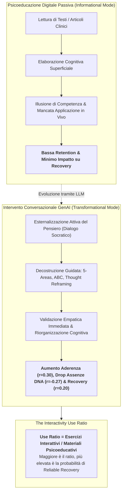
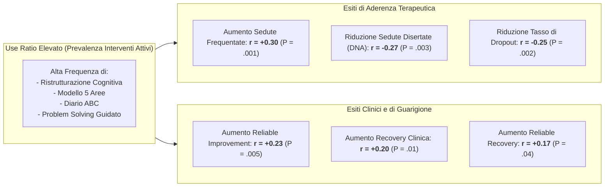
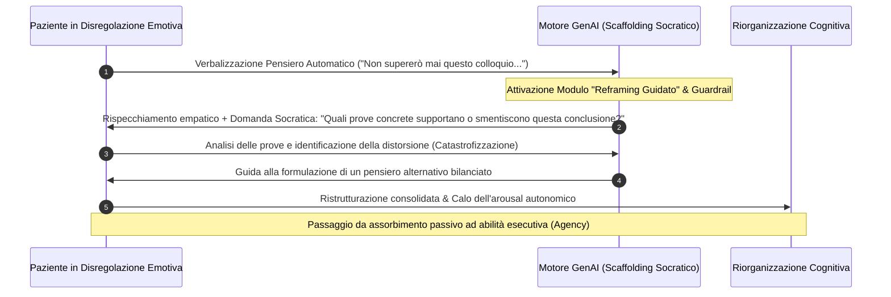

# Interactive vs. Psychoeducational AI Engagement

## Definizione Operativa
Il concetto di **Interactive vs. Psychoeducational AI Engagement** definisce la distinzione funzionale, clinica ed empirica tra due modalità primarie di erogazione di contenuti digitali in salute mentale assistita da intelligenza artificiale:

1. **Interventi CBT Attivo-Interattivi:** Esercizi conversazionali generativi guidati (es. decodifica e ristrutturazione dei pensieri automatici negativi, modello delle 5 aree, analisi funzionale ABC, compiti di esposizione o problem-solving) in cui l'utente esternalizza attivamente il proprio vissuto e riceve scaffolding socratico in tempo reale da un modello linguistico ([[large-language-models|LLM]]);
2. **Materiali Psicoeducativi Passivi:** Contenuti informativi, dispense didattiche o articoli teorici digitalizzati sul funzionamento dei disturbi d'ansia e depressivi e sui principi della CBT, fruiti mediante lettura o consultazione unidirezionale (Habicht et al., 2025; *Journal of Medical Internet Research*, doi: [10.2196/60435](https://doi.org/10.2196/60435)).

**Rilevanza Clinica:** Dimostra che la semplice trasposizione digitale di manuali o testi psicoeducativi all'interno di un'applicazione non è sufficiente a produrre cambiamenti sintomatici significativi o ad attenuare il fenomeno del dropout. Al contrario, è il **tasso di utilizzo interattivo (*use ratio*)** — ovvero la proporzione di esercizi pratici guidati completati rispetto alle letture teoriche — a costituire il fattore predittivo primario dell'aderenza alle sedute e della remissione clinica.

## Evidenze dalla Letteratura
Nell'indagine condotta da Habicht et al. (2025) all'interno di 5 servizi NHS Talking Therapies nel Regno Unito, su un sottogruppo di 100 pazienti che avevano completato sia interventi attivi che moduli psicoeducativi (media esercizi attivi: 6.7, SD 4.78; media psicoeducazione: 6.5, SD 4.22), è stato calcolato il parametro quantitativo:

$$\text{Use Ratio} = \frac{\text{Numero di Interventi CBT Interattivi Completati}}{\text{Numero di Materiali Psicoeducativi Letti}}$$

### Sintesi delle Correlazioni Parametriche:
Un rapporto sbilanciato a favore degli esercizi interattivi predice in modo robusto e statisticamente significativo:
1. La **frequenza complessiva alle sedute cliniche con il terapeuta umano** ($r = 0.30, P = .001$);
2. La **riduzione delle sedute perse/annullate all'ultimo minuto** ($r = -0.27, P = .003$);
3. La **protezione contro il dropout** ($r = -0.25, P = .002$);
4. Il **miglioramento affidabile dei sintomi depressivi e ansiosi** ($r = 0.23, P = .005$);
5. Il **tasso di remissione clinica / recovery** ($r = 0.20, P = .01$);
6. La **guarigione affidabile combinata / reliable recovery** ($r = 0.17, P = .04$).

#### Meccanismi Neurocognitivi e Psicologici dell'Interattività Generativa

1. **Externalization & Linguistic Framing:** Nel feedback qualitativo dello studio su 113 utenti (Habicht et al., 2025), il **26.5% dei partecipanti** ha indicato come beneficio primario l'acquisizione di *consapevolezza e chiarezza* derivante dall'atto di dover formulare i propri stati affettivi in parole all'interno del dialogo con l'assistente virtuale.
2. **Apprendimento Trasformativo vs Informativo:** La psicoeducazione passiva agisce sul piano informativo; l'intervento interattivo guidato da LLM agisce come uno *scaffolding procedurale* che allena la funzione riflessiva e sviluppa senso di auto-efficacia (*agency*).
3. **Superamento della Fatica Digitale:** Il chatbot generativo riduce la soglia di attrito cognitivo segmentando l'esercizio in micro-scambi conversazionali calorosi e privi di minaccia valutativa.

**Riferimenti Bibliografici:**
- Habicht, J., Dina, L.-M., McFadyen, J., Stylianou, M., Harper, R., Hauser, T. U., & Rollwage, M. (2025). Generative AI–Enabled Therapy Support Tool for Improved Clinical Outcomes and Patient Engagement in Group Therapy: Real-World Observational Study. *Journal of Medical Internet Research*, 27, e60435. https://doi.org/10.2196/60435
- Borghouts, J., Eikey, E., Mark, G., De Leon, C., Schueller, S. M., Schneider, M., et al. (2021). Barriers to and facilitators of user engagement with digital mental health interventions: systematic review. *Journal of Medical Internet Research*, 23(3), e24387.
- Kazantzis, N., Whittington, C., Zelencich, L., Kyrios, M., Norton, P. J., & Hofmann, S. G. (2016). Quantity and quality of homework compliance: a meta-analysis of relations with outcome in cognitive behavior therapy. *Behavior Therapy*, 47(5), 755–772.
- McFadyen, J., Habicht, J., Dina, L. M., Harper, R., Hauser, T. U., & Rollwage, M. (2024). AI-enabled conversational agent increases engagement with cognitive-behavioral therapy: a randomized controlled trial. *medRxiv*, 10.1101/2024.11.01.24316565.
- Rollwage, M., Juchems, K., Pisupati, S., Prichard, G., Balogh, A., McFadyen, J., et al. (2024). The Limbic Layer: transforming large language models (LLMs) into clinical mental health experts. *PsyArXiv*, 10.31234/osf.io/9d7tp.

## Relazioni
- [[jmir-2025-1-e60435]]
- [[ai-supported-between-session-engagement]]
- [[ai-enhanced-cbt]]
- [[digital-therapeutic-alliance]]
- [[modello-centauro-clinico]]
- [[cognitive-bias-rectification-in-llms]]
- [[relational-engagement-paradox-genai]]
- [[cbt-dialogue-systems-and-tools]]
- [[clinical-readiness-gap-in-mh-chatbots]]
- [[concetti/between-session-continuity-ai]]
- [[care-continuum-ai-functions-mental-health]]
