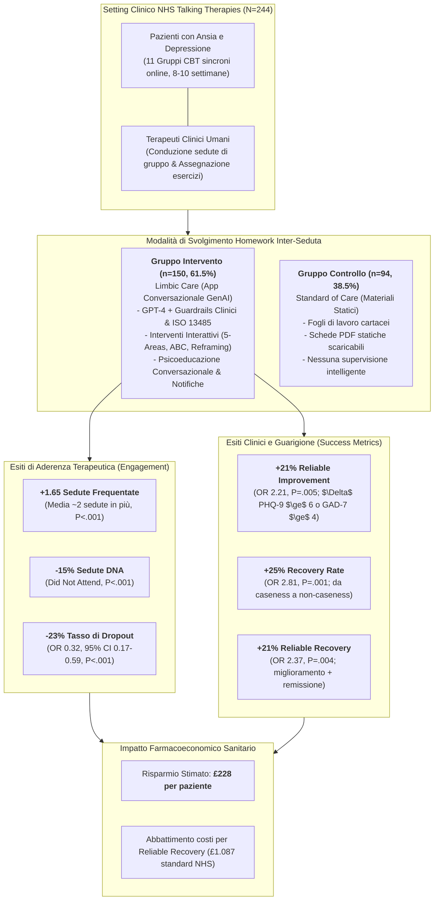
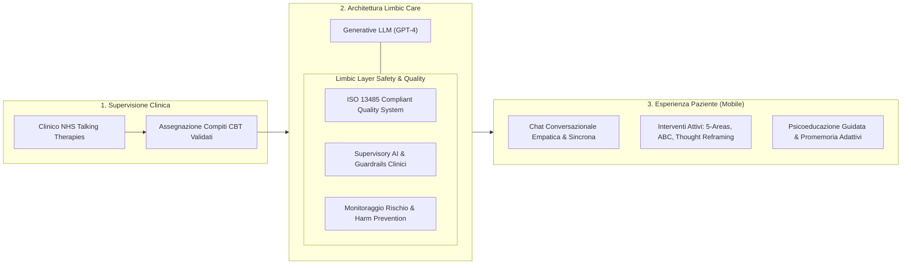
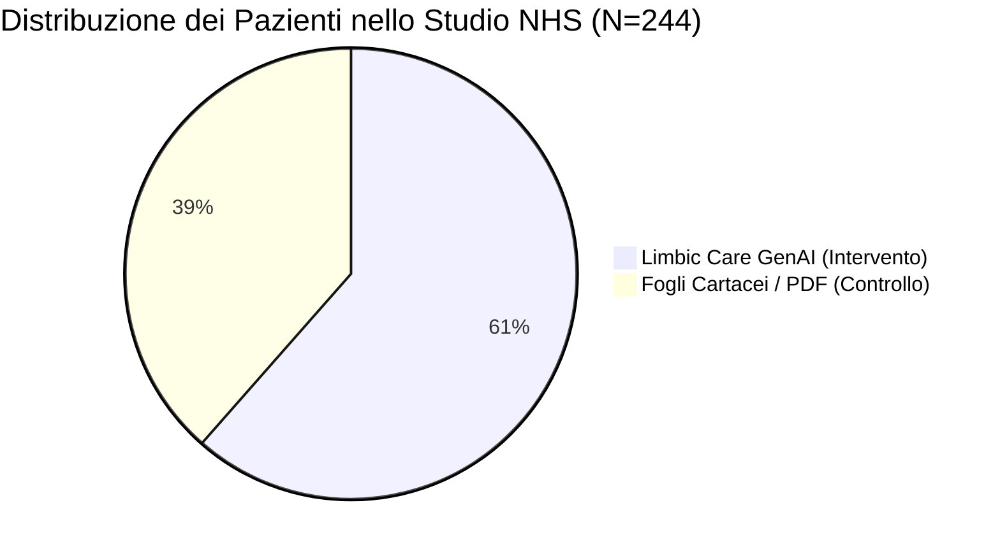
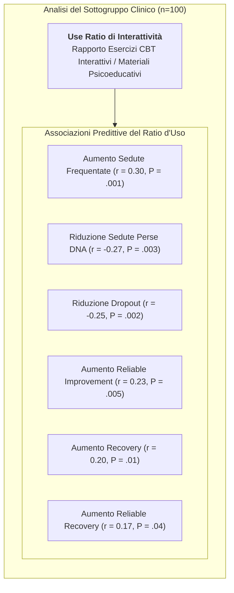
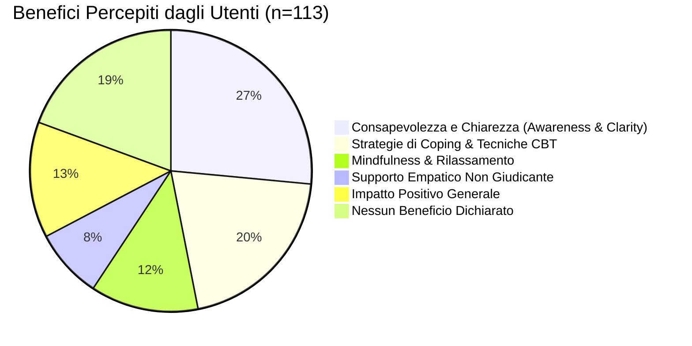

# Generative AI–Enabled Therapy Support Tool for Improved Clinical Outcomes and Patient Engagement in Group Therapy: Real-World Observational Study (Habicht et al., 2025)

## Definizione Operativa
- **Studio osservazionale real-world multisito** condotto da Johanna Habicht, Larisa-Maria Dina, Jessica McFadyen, Mona Stylianou, Ross Harper, Tobias U. Hauser e Max Rollwage (*Limbic Ltd*, *King's College London*, *Everyturn Mental Health*, *Max Planck UCL Centre for Computational Psychiatry and Ageing Research*, *Eberhard Karls University of Tübingen* e *German Center for Mental Health*; pubblicato su *Journal of Medical Internet Research - JMIR*, 2025, vol. 27, e60435, DOI: [10.2196/60435](https://doi.org/10.2196/60435)).
- **Inquadramento e Obiettivo:** Valutare l'efficacia clinica e l'impatto sull'aderenza terapeutica di uno strumento di supporto basato su Intelligenza Artificiale Generativa (**Limbic Care**, powered by GPT-4 con filtri di sicurezza e conformità **ISO 13485**) impiegato tra le sedute di una psicoterapia cognitivo-comportamentale di gruppo (*group-based CBT*) sincrona su base web all'interno di 5 servizi del **National Health Service (NHS) Talking Therapies** nel Regno Unito.
- **Campione e Disegno di Ricerca:**
  - *Coorte clinica (N=244):* 150 pazienti (61.5%) nel gruppo di intervento (utilizzo dell'app conversazionale per completare i compiti terapeutici assegnati dal clinico) vs 94 pazienti (38.5%) nel gruppo di controllo (completamento dei medesimi compiti tramite schede cartacee o PDF statici convenzionali). Entrambi i gruppi hanno seguito gli stessi protocolli terapeutici e le medesime sedute di gruppo con terapeuti umani.
  - *Studio qualitativo parallelo (n=113):* Campione non clinico con sintomatologia ansioso-depressiva moderata (PHQ-9/GAD-7 $\ge 5$) reclutato su Prolific per analizzare mediante *reflexive thematic analysis* i meccanismi soggettivi di beneficio e le aree di miglioramento.
- **Risultati Chiave:**
  1. *Aderenza e Coinvolgimento:* I pazienti del gruppo IA hanno partecipato a un numero significativamente maggiore di sedute ($\Delta \approx +2$ sedute, $b=1.65$, $P<.001$), hanno registrato una riduzione di **15 punti percentuali** nelle sedute disertate/annullate all'ultimo minuto (*Did Not Attend - DNA*, $b=-14.97$, $P<.001$) e un abbattimento di **23 punti percentuali** nel tasso di abbandono precoce della terapia (*dropout*, $\text{OR}=0.32$, $P<.001$).
  2. *Efficacia Clinica e Guarigione:* Il gruppo IA ha mostrato tassi nettamente superiori di miglioramento affidabile (**+21 punti percentuali**, $\text{OR}=2.21$, $P=.005$), remissione clinica / recovery (**+25 punti percentuali**, $\text{OR}=2.81$, $P=.001$) e guarigione affidabile / reliable recovery (**+21 punti percentuali**, $\text{OR}=2.37$, $P=.004$).
  3. *Relazione Dose-Risposta e Primato dell'Interattività:* La frequenza d'uso dell'app e il numero di esercizi completati correlano positivamente con tutti gli esiti clinici. Inoltre, il rapporto tra esercizi CBT attivi/interattivi (es. reframing cognitivo, modello delle 5 aree, ABC comportamentale) e materiali puramente psicoeducativi passivi predice una maggiore aderenza e un superiore tasso di guarigione.
  4. *Valutazione Economica:* L'incremento del 21% nella reliable recovery si traduce in un valore sanitario stimato di **£228 ($284.40 USD) generato per singolo paziente** a fronte dei costi standard NHS per trattamenti a bassa intensità (£1.087 per recovery).

---

## Evidenze dalla Letteratura

### 1. Inquadramento Teorico: La Crisi di Aderenza e il Dropout nella CBT di Gruppo
- **Prevalenza Globale e Limiti della CBT:** I disturbi depressivi e d'ansia colpiscono oltre il 29% della popolazione mondiale nel corso della vita, con un incremento globale stimato del 27.6% (depressione) e del 25.6% (ansia) a seguito della pandemia da COVID-19 (Steel et al., 2014; COVID-19 Mental Disorders Collaborators, 2021). Sebbene la CBT sia il trattamento d'elezione di prima linea (*NICE guidelines* NG222 e CG113), meta-analisi su oltre 400 trial evidenziano che il **58% dei pazienti non risponde in modo soddisfacente al trattamento** (Cuijpers et al., 2023).
- **Il Ruolo Critico del Lavoro Inter-Seduta (*Between-Session Support*):** L'esecuzione dei compiti a casa (*homework assignments*) è un fattore determinante e predittore primario del successo terapeutico nella CBT (Kazantzis et al., 2004, 2010, 2016; Mausbach et al., 2010; Lebeau et al., 2013). La pratica quotidiana consente la generalizzazione e il consolidamento delle strategie di coping negli ambienti reali di vita.
- **La Vulnerabilità Specifica della CBT di Gruppo:** Nei formati di terapia di gruppo, i tassi di abbandono (*dropout*) risultano sistematicamente più elevati e i tassi di guarigione inferiori rispetto ai percorsi individuali (Fanous & Daniels, 2020; Fernandez et al., 2015; Hans & Hiller, 2013), principalmente a causa della minore personalizzazione dell'interazione e della tendenza all'evitamento dei compiti statici non supervisionati.
- **Il Limite dei Materiali Statici:** Le tradizionali schede cartacee o i PDF statici registrano tassi elevati di mancata compilazione, procrastinazione o compilazione retrospettiva fittizia prima della seduta.

---

### 2. Disegno dello Studio, Setting NHS e Architettura di Limbic Care

- **Setting Clinico:** 5 servizi NHS Talking Therapies per ansia e depressione gestiti da *Everyturn Mental Health* nel Regno Unito, strutturati secondo il manuale operativo nazionale NHS (1 seduta iniziale di assessment + 6-8 sedute sincrone di gruppo online condotte da psicoterapeuti accreditati).
- **Intervento Sperimentale (Limbic Care):**
  - Applicazione mobile conversazionale per pazienti adulti ($\ge 18$ anni).
  - Motore di dialogo basato su GPT-4 (OpenAI) incapsulato nel framework di sicurezza proprietario *Limbic Layer* (Rollwage et al., 2024), conforme al sistema di gestione qualità per dispositivi medici **ISO 13485**.
  - Il sistema non effettua diagnosi autonome né modifica i protocolli di cura: eroga in modalità conversazionale e interattiva i materiali clinici standardizzati selezionati dal terapeuta.
  - Distinzione modulare tra:
    1. *Interventi CBT interattivi:* esercizi guidati passo-passo (es. decodifica delle distorsioni cognitive, modello delle 5 aree [pensieri, emozioni, sensazioni corporee, comportamenti], registri di ristrutturazione cognitiva, diari comportamentali ABC);
    2. *Materiali psicoeducativi:* spiegazioni teoriche e approfondimenti concettuali sulla CBT erogati in formato conversazionale.
- **Gruppo di Controllo:** Pazienti arruolati negli stessi gruppi CBT che hanno scelto di svolgere gli esercizi inter-seduta tramite la modalità convenzionale (schede cartacee e PDF scaricabili).
- **Omogeneità al Baseline:** I due gruppi non presentavano differenze significative per età (intervento: 40.3 anni; controllo: 40.5 anni; $P=.91$), etnia (88.7% vs 83% White; $P=.53$), gravità depressiva basale PHQ-9 (12.6 vs 12.0; $P=.36$), gravità ansiosa basale GAD-7 (12.0 vs 12.1; $P=.81$), tempi di attesa pre-trattamento (35.4 vs 34.4 giorni; $P=.75$) e modalità di invio tramite self-referral IA (73.3% vs 66%; $P=.28$). I modelli statistici hanno controllato per le differenze di genere (74% vs 61.7% donne, $P=.04$) e orientamento sessuale (86% vs 73.4% eterosessuali, $P=.02$).

---

### 3. Risultati Quantitativi: Aderenza Terapeutica ed Efficacia Clinica

#### Tabella Comparativa degli Esiti Clinici e di Coinvolgimento

| Metrica di Outcome | Gruppo Intervento GenAI ($n=150$) | Gruppo Controllo Standard ($n=94$) | Differenza in Punti % / $\Delta$ | Parametro Statistico ($b$ / OR) [95% CI] | Valore $P$ |
| :--- | :---: | :---: | :---: | :---: | :---: |
| **Sedute Frequentate (Totale)** | Maggiore frequenza | Frequenza standard | **+1.65 sedute** ($\approx +2$) | $b = 1.65$ [$1.051, 2.200$] | **$<.001$** |
| **Proporzione Sedute DNA (Did Not Attend)** | Significativamente ridotta | Frequenza standard | **-15%** | $b = -14.97$ [$-21.464, -8.400$] | **$<.001$** |
| **Tasso di Dropout (Abbandono Precoce)** | Significativamente inferiore | Frequenza standard | **-23%** | $\text{OR} = 0.32$ [$0.171, 0.595$] | **$<.001$** |
| **Miglioramento Affidabile (Reliable Improvement)** | Superiore | Frequenza standard | **+21%** | $\text{OR} = 2.21$ [$1.279, 3.834$] | **$.005$** |
| **Remissione Clinica (Recovery Rate)** | Superiore | Frequenza standard | **+25%** | $\text{OR} = 2.81$ [$1.561, 5.069$] | **$.001$** |
| **Guarigione Affidabile (Reliable Recovery)** | Superiore | Frequenza standard | **+21%** | $\text{OR} = 2.37$ [$1.311, 4.290$] | **$.004$** |

*Note sulle metriche standard NHS Talking Therapies:*
- **Reliable Improvement:** Riduzione $\ge 6$ punti al PHQ-9 (depressione) o $\ge 4$ punti al GAD-7 (ansia) tra la prima e l'ultima rilevazione validata.
- **Recovery:** Paziente classificato come caso clinico al baseline (PHQ-9 $\ge 10$ o GAD-7 $\ge 8$) che scende sotto la soglia di caseness clinica al termine della terapia.
- **Reliable Recovery:** Criterio combinato più rigoroso: soddisfacimento simultaneo sia del miglioramento affidabile che della remissione clinica completa.

---

### 4. Analisi Dose-Risposta e Retention dell'Applicazione

- **Retention e Utilizzo nel Tempo:** I pazienti del gruppo di intervento hanno utilizzato l'applicazione per una media di **23 sessioni complessive** nell'arco del trattamento (8-10 settimane). La curva di retention ha evidenziato tassi elevati e stabili:
  - *Settimana 1:* 79.3% (119/150)
  - *Settimana 2:* 64.0% (96/150)
  - *Settimana 3:* 51.3% (77/150)
  - *Settimana 4:* 42.0% (63/150)
  - *Settimana 5:* 35.3% (53/150)
  - *Settimana 6:* 19.3% (29/150)
- **Correlazioni Parametriche Dose-Risposta:**
  - *Esercizi completati vs Sedute frequentate:* $r = 0.46$, $P < .001$ (forte associazione positiva).
  - *Esercizi completati vs Sedute perse (DNA):* $r = -0.35$, $P < .001$ (riduzione delle assenze ingiustificate).
  - *Esercizi completati vs Tasso di Dropout:* $r_{pb} = -0.23$, $P = .004$ (effetto protettivo contro l'abbandono).
  - *Esercizi completati vs Esiti di Efficacia:* Correlazione statisticamente significativa con miglioramento affidabile ($r_{pb} = 0.22$, $P = .007$), recovery ($r_{pb} = 0.18$, $P = .02$) e reliable recovery ($r_{pb} = 0.17$, $P = .04$).
  - *Tempo trascorso e sessioni totali in app:* Il tempo totale e il numero di accessi all'app correlano con minor dropout ($r = -0.25$, $P = .007$), maggiore reliable improvement ($r = 0.23$, $P = .01$) e migliore reliable recovery ($r = 0.17$, $P = .046$).

---

### 5. Interventi CBT Interattivi vs Psicoeducazione Passiva: Il "Use Ratio"

- Nel sottogruppo di 100 pazienti che hanno completato sia esercizi CBT interattivi che letture psicoeducative (media interventi: 6.7, SD 4.78; media psicoeducazione: 6.5, SD 4.22), gli autori hanno calcolato il **rapporto di utilizzo** (*use ratio* = interventi CBT attivi / materiali psicoeducativi).
- **Risultato Clinico Cruciale:** La proporzione di esercizi CBT attivi e interattivi rispetto alla semplice lettura informativa è risultata il fattore trainante di tutti i miglioramenti clinici e comportamentali. La semplice digitalizzazione passiva di contenuti educativi non produce i benefici trasformativi generati dal dialogo interattivo guidato da GenAI.

---

### 6. Indagine Qualitativa sull'Esperienza Utente (n=113)

Nello studio qualitativo condotto su un campione con distress psicologico su Prolific, l'analisi tematica riflessiva (*reflexive thematic analysis*) ha identificato i seguenti fattori di beneficio e ambiti di sviluppo:

1. **Maggiore Consapevolezza e Chiarezza (26.5%, 30/113):** Esplicitare i propri pensieri e sentimenti in formato testuale conversazionale aiuta a strutturare l'esperienza interna e a ridefinire le prospettive emotive (*"L'atto di mettere i miei pensieri e sentimenti in parole mi aiuta a fare chiarezza"*).
2. **Apprendimento ed Esercizio di Tecniche CBT (20.4%, 23/113):** Comprensione e applicazione pratica degli schemi cognitivi nella vita reale (*"Ogni volta che ho aperto l'app Limbic, mi ha fornito uno spazio sicuro, rassicurazione, validazione e opzioni strategiche"*).
3. **Mindfulness e Decompressione Emotiva (12.4%, 14/113):** Accesso immediato a pratiche di grounding e regolazione emotiva in situazioni di stress acuto.
4. **Ascolto Empatico e Assenza di Giudizio (8.0%, 9/113):** Opportunità di confidarsi senza timore del giudizio umano quando il terapeuta non è disponibile (*"È davvero piacevole parlare apertamente con un'IA che non giudica i tuoi sentimenti"*).
5. **Aree di Perfezionamento Segnalate (33.6%, 38/113):**
   - Riconoscibilità della natura artificiale (15.0%, 17/113): pur percependo un alto grado di personalizzazione, gli utenti rilevano pattern linguistici artificiali;
   - Richiesta di funzionalità aggiuntive (9.7%, 11/113);
   - Notifiche più contestuali e personalizzate (3.5%, 4/113);
   - Eccessiva rigidità dei filtri di sicurezza (*safety guardrails*) che occasionalmente limitano la fluidità del dialogo (2.7%, 3/113).

---

### 7. Analisi Economica e Sostenibilità nei Servizi Sanitari Pubblici

- **Costo Standard nel Sistema NHS:** Nei servizi NHS Talking Therapies per cure a bassa intensità, il costo medio sostenuto dal sistema sanitario per ogni guarigione affidabile (*reliable recovery*) è stimato in **£1.087 ($1.355,91 USD)** (Steen, 2020).
- **Valore Generato dall'Aumento di Recovery (+21%):** Assumendo che l'incremento di 21 punti percentuali nella guarigione affidabile sia direttamente riconducibile all'adozione dell'assistente IA, il valore clinico-economico netto generato corrisponde a **£228 ($284,40 USD) per singolo paziente trattato**.
- **Efficienza Operativa del Servizio:** L'abbattimento del 15% delle sedute DNA e del 23% dei dropout permette di liberare capacità clinica pregiata, riducendo i tempi di attesa per le coorti successive e massimizzando l'efficienza allocativa dei fondi pubblici in salute mentale.

---

## Conclusioni e Implicazioni Cliniche

- **Il Ruolo Trasformativo della GenAI tra le Sedute:** L'integrazione di assistenti conversazionali empatici e basati su LLM non sostituisce il terapeuta umano, ma funge da catalizzatore per l'implementazione pratica della CBT nella vita quotidiana del paziente, sanando la principale causa di inefficacia terapeutica (*homework failure*).
- **Dalla Psicoeducazione Passiva all'Intervento Generativo:** I benefici clinici sono trainati dalla natura interattiva e personalizzata degli esercizi di ristrutturazione cognitiva, che superano strutturalmente l'efficacia dei supporti statici tradizionali.
- **Garanzie di Sicurezza e Modello Centauro:** L'adozione di rigorosi guardrails ingegneristici conformi a standard di qualità medica (ISO 13485) e l'ancoraggio esclusivo ai contenuti approvati dal clinico garantiscono un profilo di rischio controllato a fronte di sostanziali guadagni di efficacia terapeutica e sostenibilità economica.

---

## Riferimenti Bibliografici
- Habicht, J., Dina, L.-M., McFadyen, J., Stylianou, M., Harper, R., Hauser, T. U., & Rollwage, M. (2025). Generative AI–Enabled Therapy Support Tool for Improved Clinical Outcomes and Patient Engagement in Group Therapy: Real-World Observational Study. *Journal of Medical Internet Research*, 27, e60435. https://doi.org/10.2196/60435
- Borghouts, J., Eikey, E., Mark, G., De Leon, C., Schueller, S. M., Schneider, M., et al. (2021). Barriers to and facilitators of user engagement with digital mental health interventions: systematic review. *Journal of Medical Internet Research*, 23(3), e24387.
- Cuijpers, P., Miguel, C., Harrer, M., Plessen, C. Y., Ciharova, M., Ebert, D., et al. (2023). Cognitive behavior therapy vs. control conditions, other psychotherapies, pharmacotherapies and combined treatment for depression: a comprehensive meta-analysis including 409 trials with 52,702 patients. *World Psychiatry*, 22(1), 105–115.
- Gilbert, S., Harvey, H., Melvin, T., Vollebregt, E., & Wicks, P. (2023). Large language model AI chatbots require approval as medical devices. *Nature Medicine*, 29(10), 2396–2398.
- Kazantzis, N., Whittington, C., Zelencich, L., Kyrios, M., Norton, P. J., & Hofmann, S. G. (2016). Quantity and quality of homework compliance: a meta-analysis of relations with outcome in cognitive behavior therapy. *Behavior Therapy*, 47(5), 755–772.
- McFadyen, J., Habicht, J., Dina, L. M., Harper, R., Hauser, T. U., & Rollwage, M. (2024). AI-enabled conversational agent increases engagement with cognitive-behavioral therapy: a randomized controlled trial. *medRxiv*, 10.1101/2024.11.01.24316565.
- Rollwage, M., Habicht, J., Juechems, K., Carrington, B., Viswanathan, S., Stylianou, M., et al. (2023). Using conversational AI to facilitate mental health assessments and improve clinical efficiency within psychotherapy services: real-world observational study. *JMIR AI*, 2, e44358.
- Rollwage, M., Juchems, K., Pisupati, S., Prichard, G., Balogh, A., McFadyen, J., et al. (2024). The Limbic Layer: transforming large language models (LLMs) into clinical mental health experts. *PsyArXiv*, 10.31234/osf.io/9d7tp.
- Steen, S. (2020). A cost-benefit analysis of the improving access to psychological therapies programme using its key defining outcomes. *Journal of Health Psychology*, 25(13-14), 2487–2498.

---

## Relazioni
- [[ai-supported-between-session-engagement]]
- [[interactive-vs-psychoeducational-ai-engagement]]
- [[ai-enhanced-cbt]]
- [[digital-therapeutic-alliance]]
- [[modello-centauro-clinico]]
- [[clinical-readiness-gap-in-mh-chatbots]]
- [[software-as-a-medical-device-salute-mentale]]
- [[relational-engagement-paradox-genai]]
- [[layered-safeguards-in-clinical-ai]]
- [[concetti/between-session-continuity-ai]]
- [[care-continuum-ai-functions-mental-health]]
- [[tiered-human-ai-healing-ecosystem]]
