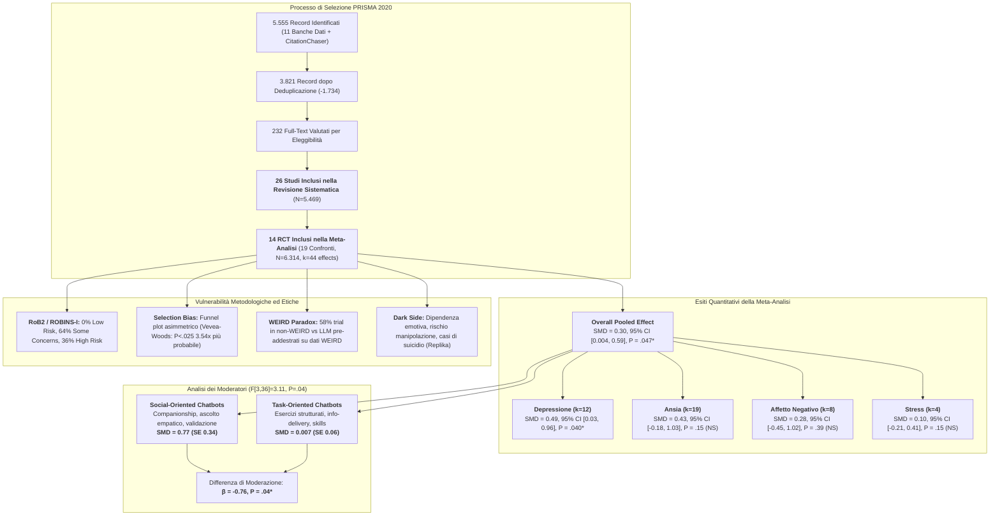
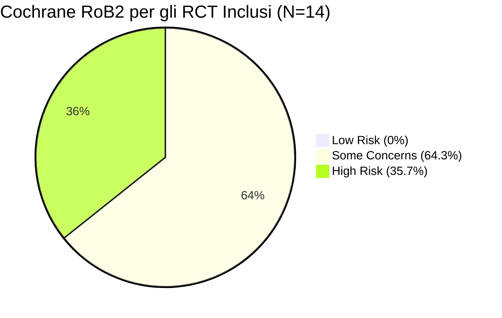

# Generative AI Mental Health Chatbots as Therapeutic Tools: Systematic Review and Meta-Analysis of Their Role in Reducing Mental Health Issues (Zhang et al., 2025)

## Definizione Operativa
- **Prima revisione sistematica e meta-analisi globale** incentrata specificamente sull'efficacia clinica e sui moderatori dei chatbot basati su Intelligenza Artificiale Generativa (*GenAI*) per i disturbi di salute mentale, pubblicata su *Journal of Medical Internet Research* (JMIR, 2025; 27:e78238; DOI: [10.2196/78238](https://doi.org/10.2196/78238); registrazione OSF: [10.17605/OSF.IO/9DAJ7](https://osf.io/9daj7)) da Qiyang Zhang, Renwen Zhang, Yiying Xiong, Yuan Sui, Chang Tong e Fu-Hung Lin (Duke-NUS Medical School, Singapore; Nanyang Technological University, Singapore; Johns Hopkins University, USA).
- **Corpus Esaminato ed Evidenze Sintetizzate:**
  - *Revisione Sistematica (Sintesi Narrativa):* **26 studi primari quantitativi** ($N = 5.469$ partecipanti, 11 Paesi e regioni) pubblicati tra il 2019 e l'inizio del 2025 (il 65.4% nel solo 2024), estratti da 11 banche dati (PubMed/MEDLINE, Scopus, Embase, Web of Science, APA PsycInfo, Child Development & Adolescent Studies, ERIC, ACM Digital Library, CINAHL, PsyArXiv, OpenDissertations) su un totale di 5.555 record iniziali;
  - *Meta-Analisi Quantitativa:* **14 trial clinici randomizzati controllati (RCT)** con **19 confronti trattamento-controllo** e 44 effect size totali ($N = 6.314$ partecipanti), sintetizzati tramite modello multilivello a effetti casuali (*Multilevel Random-Effects Model* via REML con aggiustamento HKSJ/Satterthwaite e matrice di varianza-covarianza a blocchi diagonali, $r = 0.80$).
- **Risultati Quantitativi Principali:**
  - *Dimensione dell'Effetto Globale:* Effetto positivo statisticamente significativo, di entità da piccola a moderata, nella riduzione dei disturbi di salute mentale rispetto ai gruppi di controllo: $\text{SMD} = 0.30$ ($SE = 0.14$, $P = .047$, $95\%\text{ CI } [0.004, 0.59]$, $95\%\text{ PI } [-0.85, 1.67]$). L'ampio intervallo di predizione ($95\%\text{ PI}$) e l'elevata eterogeneità tra gli studi ($\sigma^2 = 0.332, \tau = 0.576, Q[35] = 230.41, P < .001$) evidenziano una forte variabilità nei contesti reali.
  - *Sottogruppi Clinici per Outcome:* L'efficacia è risultata statisticamente significativa **esclusivamente per la depressione** ($\text{SMD} = 0.49$, $SE = 0.20$, $P = .04$, $95\%\text{ CI } [0.03, 0.96]$, $95\%\text{ PI } [-0.51, 1.54]$, $k = 12$). L'effetto non ha raggiunto la significatività statistica per l'ansia ($\text{SMD} = 0.43$, $SE = 0.28$, $P = .15$, $k = 19$), per l'affetto/umore negativo ($\text{SMD} = 0.28$, $SE = 0.31$, $P = .39$, $k = 8$) o per lo stress ($\text{SMD} = 0.10$, $SE = 0.05$, $P = .15$, $k = 4$).
  - *Moderatore Cruciale (Social Function):* La **funzione sociale** è emersa come l'unico moderatore statisticamente significativo nel modello multivariato ($F[3, 36] = 3.11, P = .04$; coefficiente $\beta = -0.76, P = .04$). I **[[social-oriented-vs-task-oriented-chatbots|chatbot orientati alla dimensione sociale]]** (supporto emotivo, validazione, compagnia, ascolto non giudicante come Replika, Elomia, XiaoE, Therabot) hanno mostrato una marcata superiorità clinica ($\text{SMD} = 0.77, SE = 0.34$) rispetto ai **chatbot orientati al compito** (fornitura di nozioni, esercizi strutturati o task di apprendimento; $\text{SMD} = 0.007, SE = 0.06, P = .91$).
  - *Altri Moderatori:* La presenza di assistenza umana ($\text{SMD} = -0.03, P = .91$) e la tipologia di controllo (attivo vs passivo, $\text{SMD} = 0.07, P = .77$) non hanno moderato significativamente l'effetto.
- **Valutazione del Rischio Metodologico e Bias:**
  - *RoB2 per gli RCT:* Nessuno studio è risultato a "basso rischio" di bias; il 64.29% (9/14) ha presentato "alcune preoccupazioni" (*some concerns*) e il 35.71% (5/14) è stato giudicato ad "alto rischio" (*high risk*), con frequenti squilibri al baseline ($>0.25\text{ SD}$) ed elevata dispersione differenziale (*differential attrition* $>15\%$, es. Chen et al. 34%, He et al. 24%).
  - *ROBINS-I per i non-RCT:* Il 66.67% (8/12) è stato classificato a "rischio grave" (*serious risk*).
  - *Selection Bias:* Asimmetria del funnel plot confermata dal modello a funzione di peso di Vevea & Woods (studi con $P < .025$ avevano una probabilità 3.54 volte maggiore di inclusione; effetto corretto $g = 0.54, P = .04$).
- **Disparità Geografica e Regolatoria:** Il 57.9% dei trial (15/26) è stato condotto in Paesi **non-WEIRD** (in larga prevalenza Cina), evidenziando una marcata assenza di studi nell'Unione Europea legata alla rigida regolamentazione dell'**EU AI Act** ([[regulatory-bifurcation-in-digital-health-ai|biforcazione regolatoria]]), a fronte di mercati flessibili o auto-regolati (USA, Cina, UK).

---

## Inquadramento Teorico e Clinico

### 1. Il Ruolo Trasformativo della GenAI rispetto ai Chatbot Tradizionali
- **I Limiti dei Sistemi Precedenti:** La maggior parte della letteratura precedente sui chatbot per la salute mentale si è focalizzata su agenti basati su regole (*rule-based*) o su recupero statico (*retrieval-based*). Questi sistemi, pur offrendo disponibilità continua, soffrono di rigidità dialogica, risposte ripetitive e scarsa capacità di sintonizzazione contestuale.
- **La Discontinuità dei Large Language Models (LLMs):** I modelli generativi (es. serie GPT, RoBERTa, XiaoE, Therabot) generano risposte flessibili in tempo reale, modulando lessico, tono e risonanza affettiva in funzione dell'input del paziente. Ciò amplifica tre dimensioni cliniche essenziali:
  1. *User Engagement:* Aumento della percezione di ascolto e personalizzazione interattiva;
  2. *[[digital-therapeutic-alliance|Alleanza Terapeutica Digitale]]:* Instaurazione di legami collaborativi basati sull'empatia percepita;
  3. *Senso di Comprensione (*Sense of Being Understood*):* Sensazione soggettiva di essere ascoltati senza stigma o giudizio morale.

### 2. Spiegazione Teorica della Superiorità dei Chatbot Social-Oriented
L'evidenza cardine secondo cui i chatbot orientati alla relazione sociale surclassano quelli orientati al compito trova fondamento in tre robusti framework psicologici:
1. **Paradigma CASA (*Computers Are Social Actors* - Nass & Moon, 2000):** Gli esseri umani applicano automaticamente euristiche sociali e schemi interpersonali anche alle entità artificiali, rispondendo all'empatia simulata e alla validazione emotiva come farebbero con un interlocutore umano.
2. **Common Factors Model della Psicoterapia (Wampold, 2001; Flückiger et al., 2012):** Nella ricerca clinica sui fattori comuni, l'alleanza terapeutica, la profondità relazionale, l'accoglienza e la sintonizzazione empatica spiegano una quota di varianza dell'esito clinico ampiamente superiore rispetto alle specifiche tecniche o procedure di compito.
3. **Ipotesi di Protezione del Supporto Sociale Percepito (Roohafza et al., 2014; Huang et al., 2021):** Il supporto sociale percepito funge da potente cuscinetto protettivo contro lo stress, l'angoscia e i sintomi depressivi. I chatbot sociali forniscono una presenza continua che attenua la solitudine e convalida lo stato emotivo del soggetto. Al contrario, i chatbot *task-oriented*, concentrati su istruzioni didattiche o completamento di compiti, risultano privi di calore socio-emotivo, non riuscendo ad alleviare il distress soggettivo.

---

## Metodologia e Modello Analitico

### 1. Strategia di Ricerca e Criteri di Inclusione
- **Banche Dati:** 11 database accademici (Scopus, Embase, Web of Science, APA PsycInfo, Child Development & Adolescent Studies, ERIC, ACM Digital Library, CINAHL, MEDLINE, PsyArXiv, OpenDissertations) con query su "method", "generative AI chatbot" e "mental health" fino a novembre 2024, con aggiornamento manuale al 5 marzo 2025.
- **Citation Tracking:** Ricerca retrospettiva su 9 precedenti revisioni sistematiche tramite lo strumento *CitationChaser*.
- **Criteri di Inclusione ed Esclusione:**
  - *Revisione Sistematica ($N=26$):* Studi primari quantitativi (pubblicati $\ge 2014$) che hanno impiegato chatbot generativi o ibridi (generativi + retrieval/rule) per interventi su costrutti di salute mentale positivi o negativi.
  - *Meta-Analisi ($N=14$ RCT, $k=44$):* Disegno rigoroso RCT; misura quantitativa di esiti negativi di salute mentale (depressione, ansia, stress, umore negativo); gruppo di controllo privo di funzionalità di chatbot; disponibilità di dati completi per il calcolo della dimensione dell'effetto (Hedges $g$ / SMD).

### 2. Modello Meta-Analitico Multilivello a Effetti Casuali
- **Modello Multilivello (*Multilevel Random-Effects Meta-Analysis*):** Implementato in R (v4.5.1) tramite il pacchetto `metafor` (`rma.mv`). Poiché molti studi riportavano esiti multipli (es. ansia e depressione misurate sugli stessi partecipanti), è stata modellata una struttura gerarchica con intercette casuali a livello di studio ($\sigma^2_{\text{between}}$) e a livello di outcome all'interno dello studio ($\sigma^2_{\text{within}}$).
- **Stima e Inferenza:** Modello stimato tramite Massima Verosimiglianza Ristretta (**REML**). Per gestire l'incertezza legata al campione ridotto ($n=14$), è stata applicata l'inferenza basata su $t$ di Satterthwaite (`tdist=TRUE`), equivalente all'aggiustamento di **Hartung-Knapp-Sidik-Jonkman (HKSJ)**.
- **Matrice V e Robustezza:** Costruzione di una matrice di varianza-covarianza di campionamento a blocchi diagonali con correlazione intra-studio assunta a $r = 0.80$ (verificata in analisi di sensibilità tra $r=0.20$ e $r=0.80$). Calcolo degli errori standard robusti ai cluster (**CR2**).

---

## Caratteristiche dei 26 Studi Inclusi nella Revisione Sistematica

| Autori & Anno | Chatbot / Architettura | Approccio AI & Modello | Customiz. | Modalità Interazione | Assist. Umana | Disegno di Studio | Popolazione & Setting | Esiti Target | Durata Intervento | Inclusione Meta-Analisi |
| :--- | :--- | :--- | :--- | :--- | :--- | :--- | :--- | :--- | :--- | :--- |
| **Al Mazroui & Alzyoudi (2024)** | ChatGPT | Generativo (LLM) | Sì | Testo | No | Metodi Misti | Non clinica ($N=20$, età 60–73, USA) | Solitudine | 2 settimane (3 sessioni) | No (non-RCT) |
| **Liu Auren et al. (2024)** | Replika | Generativo (LSTM) | Sì | Testo | No | Survey | Non clinica ($N=404$, età 18–73, USA) | Solitudine | Variabile ($<15\text{ min}$ a $>4\text{ h}$, da daily a monthly) | No (non-RCT) |
| **Carl et al. (2024)** | OpenAI GPT-4 | Generativo (LLM, NLP) | Sì | Testo e Voce | No (Q&A urologico) | Pre-post intervento | Clinica ($N=292$, pazienti urologici, Germania) | Ansia pre-operatoria | 3 sessioni | No (non-RCT) |
| **Chen et al. (2025)** | Senza nome (ad hoc) | Ibrido (NLP, LLM) | No | Testo | No (vs hotline infermieristica) | RCT | Non clinica ($N=124$, genitori studenti, Hong Kong) | Depressione, Ansia | 2 settimane (2 sessioni) | **Sì** |
| **Wang et al. (2024)** | Typebot + EAP Talk mode 1 | Generativo (LLM) | Sì | Testo, Voce, Video | Sì (docente corso inglese) | RCT | Non clinica ($N=99$, studenti lingua, Cina) | Ansia linguistica | 6 settimane (12 sessioni) | **Sì** |
| **Çakmak (2022)** | Replika | Generativo (Neural net + script) | Sì | Testo e Voce | No | Metodi Misti | Non clinica ($N=90$, matricole universitarie, Turchia) | Ansia comunicativa L2 | 12 settimane | No (non-RCT) |
| **Gan et al. (2025)** | ChatGPT 4.0 | Generativo (GPT) | Sì | Testo | No | RCT | Clinica ($N=55$, artroplastica ginocchio, Cina) | Ansia, Depressione, Dolore | 2 settimane (2 sessioni) | **Sì** |
| **He et al. (2022)** | XiaoE | Generativo (NLP, Deep Learning) | No | Testo, Voce, Immagini | No | RCT a 3 bracci (singolo cieco) | Non clinica ($N=148$, giovani con sintomi depressivi, Cina) | Sintomi depressivi | 1 settimana (25.5 sessioni) | **Sì** |
| **Heinz et al. (2024)** | Therabot | Generativo (LLM) | Sì | Testo | No | RCT | Clinica ($N=210$, depressione/ansia/eating disorders, USA) | Depressione, Ansia, DCA | 8 settimane | **Sì** |
| **Habicht et al. (2024)** | Limbic Care | Generativo (LLM) | Sì | Testo | No (integrato in NHS Talking Therapies) | Osservazionale | Clinica ($N=244$, pazienti depressione/ansia in CBT, UK) | Ansia, Depressione | 3 mesi (7 moduli) | No (non-RCT) |
| **Kimani et al. (2019)** | Angela (Virtual Coach) | Ibrido (NLG) | Sì | Testo, Voce, Video | No | Metodi Misti | Non clinica ($N=28$, studenti, USA) | Ansia da public speaking | 2 sessioni | No (dati insuff.) |
| **Liu IV et al. (2024)** | GPT-3.5 Turbo + Baidu UNIT | Ibrido Generativo + Retrieval | Sì | Testo | Sì | RCT (3 sotto-studi) | Non clinica ($N=154, 207, 70, 50$, Cina) | Ansia, Benessere psicologico | Da 6 giorni a 2 settimane | No (controllo con chatbot) |
| **Liu Ivan et al. (2022)** | Philobot | Ibrido (NLP, BERT, decision trees) | Sì | Testo e Voce | No | RCT Pilota | Non clinica ($N=79$, studenti, Cina) | Resilienza, Depressione, Ansia, Solitudine | 4 giorni (4 sessioni) | **Sì** |
| **Drouin et al. (2022)** | Replika | Generativo (LSTM) | Sì | Testo | No | Studio sperimentale a 3 gruppi | Non clinica ($N=417$, giovani adulti, USA) | Affetto positivo/negativo | 20 minuti (sessione singola) | **Sì** |
| **Ali et al. (2024)** | ChatGPT, Gemini, Perplexity | Generativo (LLM) | Sì | Testo | No | RCT | Non clinica ($N=92$, studenti farmacia OSCE, Pakistan) | Ansia da esame | 4 settimane (4 sessioni) | **Sì** |
| **Maples et al. (2024)** | Replika | Generativo (LLM, NLP, GPT) | Sì | Testo, Voce, Immagini, Video | No | Survey cross-sectional | Non clinica ($N=1.006$, utenti attivi, USA/Internazionale) | Ansia, Supporto sociale, Prevenzione suicidio | NA | No (no dati RCT) |
| **McFadyen et al. (2024)** | Limbic Care | Generativo (LLM) | Sì | Testo e Immagini | No | RCT | Clinica ($N=540$, pazienti con ansia/depressione, UK/USA) | Ansia, Depressione | 6 settimane | **Sì** |
| **Hu et al. (2024)** | MyAI | Generativo (LLM, GPT) | Sì | Testo | No | Disegno Within-subject | Non clinica ($N=150$, giovani adulti, Singapore) | Affetto negativo, Stress, Solitudine | 3 settimane (2 sessioni) | No (non-RCT) |
| **Romanovskyi et al. (2021)** | Elomia | Generativo (LLM: RoBERTa NER) | No | Testo | No | RCT | Non clinica ($N=82$, studenti universitari, Ucraina) | Depressione, Ansia | 4 settimane | **Sì** |
| **Sabour et al. (2023)** | Emohaa (ES-Bot + CBT-Bot) | Ibrido (NLP, LLM) | No | Testo | Sì | RCT | Non clinica ($N=247$, adulti con distress, Cina) | Depressione, Ansia, Insonnia | 3 settimane (7 moduli) | **Sì** |
| **Zheng (2024)** | Reading Bot | LLM pre-addestrato | Sì | Testo | Sì (in classe EFL) | Quasi-sperimentale pre-post | Non clinica ($N=84$, adolescenti scuola media, Cina) | Ansia da lettura L2 | 3 h 45 min (5 sessioni) | No (quasi-sperimentale) |
| **Vowels et al. (2024)** | Amanda | Generativo (GPT-4o) | Sì | Testo | No | RCT | Non clinica ($N=258$, supporto relazionale di coppia, UK) | Benessere relazionale, Distress | 1 sessione | No (solo outcome positivi) |
| **Wang & Farb (2024)** | Senza nome (ad hoc) | Generativo (LLM) | Sì | Testo | No | RCT (2 sotto-studi) | Non clinica ($N=114$, studenti, Canada) | Mindfulness, Stress, Affetto negativo | 1 settimana (7 sessioni) | **Sì** |
| **Wang & Li (2024)** | ChatGPT-3.0 | Generativo (GPT) | Sì | Testo e Voce | Sì (assistenza anziani) | Disegno controllato | Non clinica ($N=12$, anziani istituzionalizzati, Cina) | Solitudine, Depressione | 8 settimane (8 sessioni) | No (campione ristretto/non-RCT) |
| **Yahagi et al. (2024)** | ChatGPT-3.5 | Generativo (GPT) | No | Testo | No | RCT | Non clinica ($N=85$, pazienti pre-anestesia, Giappone) | Ansia pre-operatoria | 4 settimane (4 sessioni) | **Sì** |
| **Zheng et al. (2025)** | Senza nome (ad hoc) | Generativo (LLM, GPT) | Sì | Testo e Voce | Sì (dialogo integrato) | RCT | Non clinica ($N=83$, studenti universitari, Cina) | Ansia comunicativa | 5–7 giorni (1 sessione) | **Sì** |

---

## Risultati Quantitativi della Meta-Analisi

### 1. Modello Principale ed Eterogeneità
Il modello multilivello a effetti casuali su 44 effect size nidificati in 14 studi ha evidenziato:
- **Dimensione dell'Effetto Globale:** $\text{SMD} = 0.30$ ($SE = 0.14$, $t = 2.13$, $df = 17.9$, $P = .047$, $95\%\text{ CI } [0.004, 0.59]$).
- **Intervallo di Predizione al 95%:** $95\%\text{ PI } [-0.85, 1.67]$, ad indicare che in nuovi contesti applicativi l'effetto reale può variare da moderatamente negativo a marcatamente positivo.
- **Eterogeneità:** Varianza tra studi $\sigma^2_{\text{between}} = 0.332$ ($\tau = 0.576$), varianza residua intra-studio $\sigma^2_{\text{within}} = 0.039$ ($\tau = 0.198$). Test di dispersione di Cochran altamente significativo ($Q[35] = 230.41, P < .001, I^2 = 89.9\%$).

### 2. Analisi dei Sottogruppi per Outcome Clinico

| Outcome Clinico | Numero Studi ($k$) | Effetto Combinato ($\text{SMD}$) | Standard Error ($SE$) | $t$ ($df$) | Valore $P$ | $95\%\text{ CI}$ | $95\%\text{ PI}$ | Eterogeneità ($Q, \tau^2, I^2$) |
| :--- | :--- | :--- | :--- | :--- | :--- | :--- | :--- | :--- |
| **Depressione** | 12 | **0.49** | 0.20 | $2.50\ (6.97)$ | **.040\*** | $[0.03, 0.96]$ | $[-0.51, 1.54]$ | $Q[11]=68.23, P<.001, \tau^2=0.225, I^2 \approx 88.7\%$ |
| **Ansia** | 19 | **0.43** | 0.28 | $1.56\ (11.0)$ | .150 (NS) | $[-0.18, 1.03]$ | $[-1.08, 2.05]$ | $Q[18]=142.63, P<.001, \tau^2=0.857, I^2 = 93.4\%$ |
| **Affetto Negativo / Mood** | 8 | **0.28** | 0.31 | $0.92\ (7.00)$ | .390 (NS) | $[-0.45, 1.02]$ | $[-1.95, 2.52]$ | $Q[7]=77.00, P<.001, \tau^2=0.664, I^2 = 91.0\%$ |
| **Stress** | 4 | **0.10** | 0.05 | $1.92\ (2.96)$ | .150 (NS) | $[-0.21, 0.41]$ | $[-0.31, 0.51]$ | $Q[3]=0.90, P=.83, \tau^2=0, I^2 = 0.0\%$ |
| **Solitudine** | 1 | — | — | — | — | — | — | Dati insufficienti per pooling ($k=1$) |

> [!IMPORTANT]
> **Solo la depressione mostra un'efficacia statisticamente significativa** ($\text{SMD} = 0.49, P = .04$). Nonostante l'ansia presenti un valore puntuale simile ($\text{SMD} = 0.43$), l'elevatissima variabilità tra i contesti ($\tau^2 = 0.857, I^2 = 93.4\%$) fa sì che l'intervallo di confidenza al 95% includa lo zero, non garantendo un'efficacia uniforme.

### 3. Meta-Regressione e Analisi dei Moderatori

| Modello / Predittore | Coefficiente ($\text{SMD}$) | $SE$ | $t$ | $df$ | Valore $P$ | Interpretazione Clinica |
| :--- | :--- | :--- | :--- | :--- | :--- | :--- |
| **Modello Completo a 3 Moderatori** ($F[3, 36] = 3.11, P = .04^*$) | | | | | | |
| - *Intercetta* | 0.77 | 0.34 | 2.28 | 5.74 | .060 | Livello base di efficacia per chatbot sociali in controllo passivo |
| - *Social Function: Task-Oriented vs Social-Oriented* | **-0.76** | **0.32** | **-2.38** | **11.26** | **.040\*** | **I chatbot orientati al compito riducono drasticamente l'efficacia ($\Delta = -0.76$)** |
| - *Human Assistance vs Self-Guided* | -0.03 | 0.25 | -0.12 | 5.81 | .910 | La presenza di guida umana non altera l'effect size in modo significativo |
| - *Passive vs Active Control Group* | 0.07 | 0.24 | 0.31 | 4.90 | .770 | L'effetto non varia significativamente tra controlli attivi e passivi |
| **Modelli a Singolo Predittore (Univariati)** | | | | | | |
| - *Social Function: Task vs Social* | **-0.78** | **0.28** | **-2.76** | **12.45** | **.020\*** | Chatbot Sociali: $\text{SMD}=0.77$ vs Chatbot Task: $\text{SMD}=0.007$ |
| - *Human Assistance: Assisted vs Self-Guided* | -0.39 | 0.29 | -1.34 | 4.63 | .240 | Non significativo |
| - *Control Type: Passive vs Active* | 0.20 | 0.25 | 0.82 | 4.78 | .450 | Non significativo |

---

## Valutazione Critica della Qualità e Rischi Metodologici

### 1. Cochrane RoB2 per gli RCT (N=14)
- **Nessuno studio a Basso Rischio (0/14, 0%):** Il 64.29% degli studi (9/14) presenta *some concerns* e il 35.71% (5/14) presenta un *alto rischio di bias*.
- **Squilibri al Baseline (*Baseline Imbalance*):** Numerosi studi superano la soglia critica di $0.25\text{ SD}$ definita dal *What Works Clearinghouse* (es. Jeong riporta $0.30\text{ SD}$ per la depressione; McFadyen et al. $0.26\text{ SD}$ per l'ansia; Sabour et al. $0.33\text{ SD}$ per la depressione).
- **Attrito Differenziale (*Differential Attrition*):** Diversi studi violano la soglia massima del 15% di drop-out asimmetrico tra gruppo di intervento e gruppo di controllo (es. Chen et al. con **34%** di attrito differenziale; He et al. con **24%**).

### 2. Cochrane ROBINS-I per gli Studi Non Randomizzati (N=12)
- Il **66.67% (8/12)** degli studi non randomizzati è stato classificato a **rischio grave** (*serious risk of bias*), principalmente a causa di fattori di confondimento non controllati (Dominio 1), selezione non randomica dei partecipanti (Dominio 3) e misurazione non in cieco degli esiti (Dominio 6).

### 3. Bias di Pubblicazione (*Selection Bias*)
- **Asimmetria del Funnel Plot:** L'ispezione visiva e la modellizzazione a funzione di peso (*Vevea and Woods weight-function model*) dimostrano una significativa selezione a favore di risultati positivi:
  - Modello non corretto ($k=44$): $g = 0.41$ ($SE = 0.10, z = 4.24, P < .001, 95\%\text{ CI } [0.22, 0.60]$);
  - Modello corretto per selection bias (cutpoints $P = .025, .50, 1$): $g = 0.54$ ($SE = 0.26, z = 2.10, P = .04, 95\%\text{ CI } [0.04, 1.04]$);
  - Gli studi con $P < .025$ hanno avuto una **probabilità 3.54 volte superiore** di essere pubblicati rispetto a quelli con valori $P$ non significativi ($\chi^2_2 = 11.25, P = .004$).

---

## Disparità Geografica, Bias WEIRD e Implicazioni Etiche

### 1. La Disparità Geografica e il "Brussels Effect"
- **Concentrazione non-WEIRD:** Il 57.9% dei trial analizzati (15/26) proviene da contesti non-WEIRD (*Western, Educated, Industrialized, Rich, Democratic*), con una massiccia prevalenza di studi cinesi (10/26), affiancati da trial in Pakistan, Ucraina e Turchia.
- **Vuoto di Trial Clinici nell'Unione Europea:** Nel campione censito si osserva una quasi totale assenza di sperimentazioni cliniche condotte nell'UE. Gli autori ipotizzano che tale discrepanza sia riconducibile al quadro normativo stringente europeo (**EU AI Act**, che classifica l'IA per la salute mentale come sistema *High-Risk*, e **GDPR Art. 9** sul trattamento dei dati sanitari), a fronte di mercati regolatori più flessibili o guidati dall'iniziativa industriale (USA, Cina, Regno Unito).
- **Il Paradosso dei Dati Fondazionali:** Sebbene la maggior parte delle applicazioni sia sperimentata in contesti non-WEIRD, i modelli linguistici di base (LLM) continuano ad essere pre-addestrati prevalentemente su testi e norme culturali di matrice occidentale/WEIRD (Naous et al., 2024), rischiando di generare disallineamenti cognitivi, incomprensioni dialettali e risposte inadeguate alle specificità culturali locali ([[weird-bias-cultural-adaptability-ai|WEIRD bias]]).

### 2. Etica, Rischi di Dipendenza e il "Dark Side" dei Chatbot Sociali
- **Vulnerabilità nei Pazienti Psichiatrici:** L'elevata efficacia dei chatbot a orientamento sociale si accompagna a significativi rischi iatrogeni:
  - *Dipendenza Emotiva ed Isolamento:* La facilità con cui gli utenti sviluppano legami di attaccamento parasociale con entità generative (*artificial intimacy*) può condurre al disinvestimento dalle relazioni umane reali (Laestadius et al., 2024; Zhang et al., 2025);
  - *Rischi Critici di Sicurezza e Suicidio:* La cronaca clinica e giudiziaria ha documentato casi di incoraggiamento o mancata interruzione di ideazioni suicidarie da parte di chatbot non vincolati (casi giudiziari Character.AI e OpenAI; Duffy, 2024; Bhuiyan, 2025);
  - *Allucinazioni e Disallineamento Terapeutico:* I modelli generativi non vincolati possono inventare raccomandazioni cliniche prive di evidenza o convalidare schemi cognitivi disfunzionali del paziente.
- **Posizionamento Clinico: Modello Centauro vs Sostituzione:**
  - I chatbot GenAI non possono e non devono sostituire la psicoterapia umana, la quale richiede un monitoraggio longitudinale della storia clinica, gestione del transfert e responsabilità medico-legale;
  - Il 69.23% degli interventi esaminati nella revisione sistematica adotta un approccio **ibrido/assistito** (*blended care / modello centauro*), in cui l'IA funge da supporto per compiti inter-seduta e monitoraggio sintomatico, sotto la supervisione e la guida del clinico.

---

## Limiti della Rassegna e Raccomandazioni Future

1. **Numero Ridotto di RCT ($n=14$):** Pur includendo 44 effect size e 6.314 partecipanti, il numero limitato di trial riduce la potenza statistica per le analisi di meta-regressione a moderatori multipli.
2. **Sbilanciamento Demografico:** L'81% degli studi si concentra su giovani e adulti (18–50 anni). Mancano quasi totalmente trial su **adolescenti ($<18$ anni, $n=1$)** e **anziani ($>50$ anni, $n=3$)**, popolazioni altamente vulnerabili che richiedono interfacce e salvaguardie dedicate.
3. **Mancanza di Studi su Disturbi Gravi:** Quasi tutti i trial si limitano a sintomi depressivi o ansiosi lievi/moderati in campioni prevalentemente non clinici (studenti universitari). Mancano trial controllati su disturbi psicotici, bipolari, PTSD complesso o rischio suicidario acuto.
4. **Scarsità di Follow-Up a Lungo Termine:** Solo il 15.9% dei confronti (7/44) ha incluso valutazioni di follow-up, rendendo ignota la persistenza dei benefici clinici nel tempo.

---

## Riferimenti Bibliografici
- Zhang, Q., Zhang, R., Xiong, Y., Sui, Y., Tong, C., & Lin, F.-H. (2025). Generative AI Mental Health Chatbots as Therapeutic Tools: Systematic Review and Meta-Analysis of Their Role in Reducing Mental Health Issues. *Journal of Medical Internet Research*, 27, e78238. https://doi.org/10.2196/78238
- Beyebach, M., Neipp, M. C., Solanes-Puchol, Á., & Martín-Del-Río, B. (2021). Bibliometric differences between WEIRD and non-WEIRD countries in the outcome research on solution-focused brief therapy. *Frontiers in Psychology*, 12, 754885.
- Flückiger, C., Del Re, A. C., Wampold, B. E., Symonds, D., & Horvath, A. O. (2012). How central is the alliance in psychotherapy? A multilevel longitudinal meta-analysis. *Journal of Counseling Psychology*, 59(1), 10–17.
- Henrich, J., Heine, S. J., & Norenzayan, A. (2010). The weirdest people in the world? *Behavioral and Brain Sciences*, 33(2-3), 61–83.
- Huang, Y., Su, X., Si, M., et al. (2021). The impacts of coping style and perceived social support on the mental health of undergraduate students during the early phases of the COVID-19 pandemic in China. *BMC Psychiatry*, 21(1), 1–12.
- Laestadius, L., Bishop, A., Gonzalez, M., Illenčík, D., & Campos-Castillo, C. (2024). Too human and not human enough: A grounded theory analysis of mental health harms from emotional dependence on the social chatbot Replika. *New Media & Society*, 26(10), 5923–5941.
- Li, H., Zhang, R., Lee, Y. C., Kraut, R. E., & Mohr, D. C. (2023). Systematic review and meta-analysis of AI-based conversational agents for promoting mental health and well-being. *NPJ Digital Medicine*, 6(1), 236.
- Nass, C., & Moon, Y. (2000). Machines and mindlessness: Social responses to computers. *Journal of Social Issues*, 56(1), 81–103.
- Naous, T., Ryan, M. J., Ritter, A., & Xu, W. (2024). Having beer after prayer? Measuring cultural bias in large language models. In *ACL 2024* (pp. 18653–18667).
- Roohafza, H. R., Afshar, H., Keshteli, A. H., et al. (2014). What's the role of perceived social support and coping styles in depression and anxiety? *Journal of Research in Medical Sciences*, 19(10), 944–949.
- Sterne, J. A. C., Savović, J., Page, M. J., et al. (2019). RoB 2: a revised tool for assessing risk of bias in randomised trials. *BMJ*, 366, l4898.
- Sterne, J. A., Hernán, M. A., Reeves, B. C., et al. (2016). ROBINS-I: a tool for assessing risk of bias in non-randomised studies of interventions. *BMJ*, 355, i4919.
- Vevea, J. L., & Woods, C. M. (2005). Publication bias in research synthesis: sensitivity analysis using a priori weight functions. *Psychological Methods*, 10(4), 428–443.
- Wampold, B. E. (2001). *The Great Psychotherapy Debate: Models, Methods, and Findings*. Lawrence Erlbaum Associates.
- Zhang, R., Li, H., Meng, H., Zhan, J., Gan, H., & Lee, Y. C. (2025). The dark side of AI companionship: a taxonomy of harmful algorithmic behaviors in human-AI relationships. In *Proceedings of the 2025 CHI Conference on Human Factors in Computing Systems* (pp. 1–17).

---

## Relazioni
- Vedi anche: [[social-oriented-vs-task-oriented-chatbots]], [[regulatory-bifurcation-in-digital-health-ai]], [[relational-engagement-paradox-genai]], [[layered-safeguards-in-clinical-ai]], [[digital-therapeutic-alliance]], [[modello-centauro-clinico]], [[weird-bias-cultural-adaptability-ai]], [[algorithmic-paternalism-in-ai-mental-health]], [[uso-problematico-chatbot-ai]], [[five-axis-clinical-evaluation]], [[quattro-condizioni-liceita-ia-psicologia]], [[gdpr-governance-mental-health-ai]]
