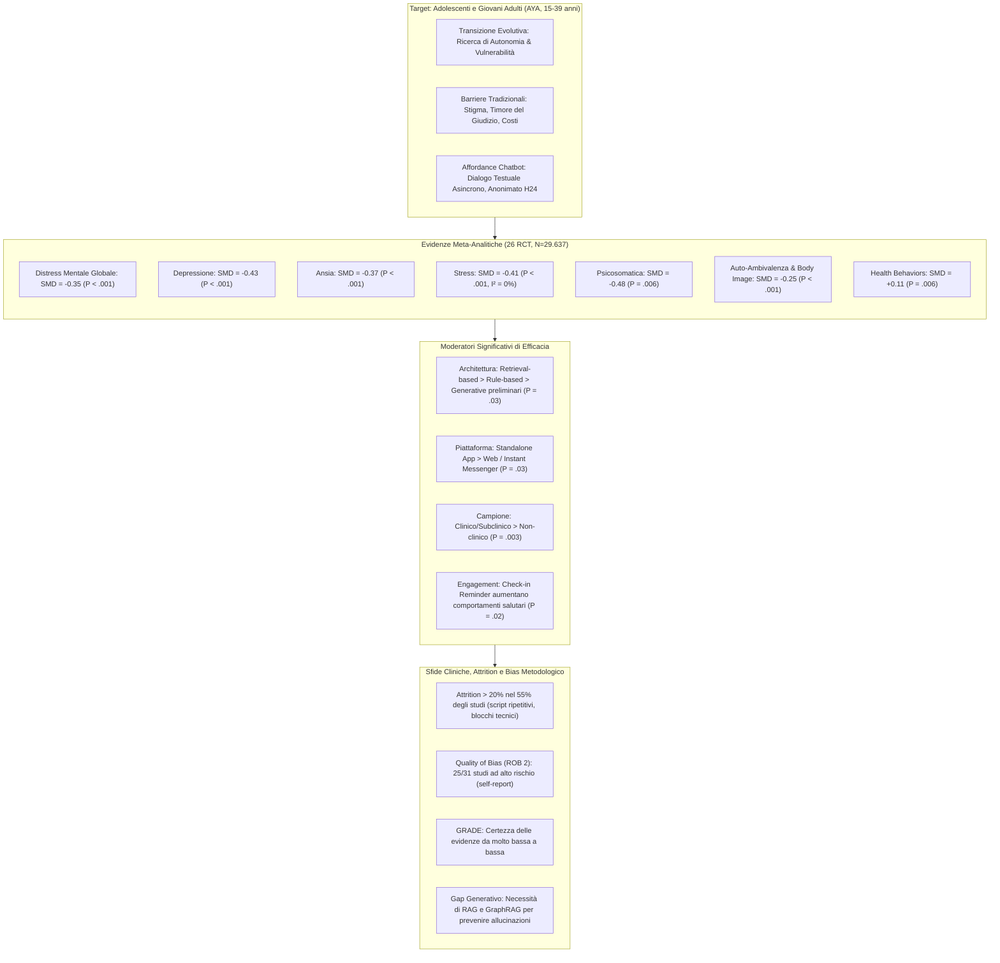
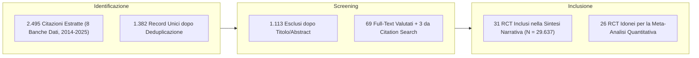
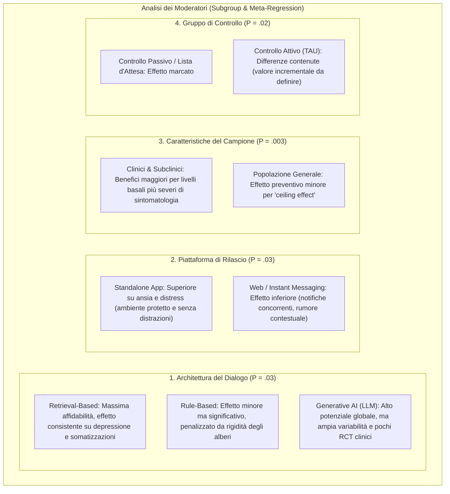

# The Effectiveness of AI Chatbots in Alleviating Mental Distress and Promoting Health Behaviors Among Adolescents and Young Adults: Systematic Review and Meta-Analysis (Feng et al., 2025)

## Definizione Operativa
- **Revisione sistematica e meta-analisi PRISMA 2020** registrata su **PROSPERO (CRD42024603472)** condotta da Xinyu Feng, Lidan Tian, Grace W K Ho, Janelle Yorke e Vivian Hui (*School of Nursing, Hong Kong Polytechnic University* e *University of Pittsburgh*, pubblicata sul *Journal of Medical Internet Research* - JMIR 2025;27:e79850; DOI: [10.2196/79850](https://doi.org/10.2196/79850)).
- **Campione e Selezione:** Sintetizza in modo rigoroso **31 trial clinici randomizzati controllati (RCT)** per un totale di **29.637 partecipanti** (adolescenti e giovani adulti, età 15–39 anni), estratti da 8 database internazionali (*PubMed, PsycINFO, Cochrane Library, CINAHL, Embase, Web of Science, Scopus, IEEE Xplore*) nel decennio **2014–2025**. Di questi, 26 studi sono stati inclusi nella meta-analisi quantitativa.
- **Utilità Clinica e per i DMHI (Digital Mental Health Interventions):** Costituisce la prima meta-analisi specificamente focalizzata sulla popolazione AYA (*Adolescents and Young Adults*), una fascia evolutiva cerniera caratterizzata da alta vulnerabilità psicosociale (depressione, ansia, immagine corporea, dipendenze, stress da transizione), forte bisogno di autonomia e privacy, ma spiccata riluttanza verso i canali di cura tradizionali per timore di stigma sociale o giudizio.
- **Risultanze Chiave dell'Efficacia:**
  - *Distress Mentale Complessivo:* Effetto significativo da piccolo a moderato a favore dei chatbot ($\text{SMD} = -0.35$, $95\%\ \text{CI} [-0.46, -0.24]$, $P < .001$).
  - *Sintomi Specifici:* Riduzione significativa di depressione ($\text{SMD} = -0.43$, $P < .001$), ansia ($\text{SMD} = -0.37$, $P < .001$), stress ($\text{SMD} = -0.41$, $P < .001$, $I^2 = 0\%$), sintomi psicosomatici ($\text{SMD} = -0.48$, $P = .006$), affettività negativa ($\text{SMD} = -0.27$, $P = .04$) e, per la prima volta in letteratura, un beneficio significativo su **auto-ambivalenza e distress per l'immagine corporea** ($\text{SMD} = -0.25$, $P < .001$).
  - *Comportamenti di Salute:* Incremento significativo dei comportamenti salutari favorevoli ($\text{SMD} = 0.11$, $P = .006$).
  - *Outcome Positivi:* Modesto incremento di soddisfazione di vita e benessere ($\text{SMD} = 0.12$, $P = .01$), ma assenza di effetti statisticamente significativi su affettività positiva ($\text{SMD} = 0.03$, $P = .73$) e autoefficacia ($\text{SMD} = 0.14$, $P = .33$).
- **Moderatori Architetturali e Tecnologici:**
  - *Sistemi di Dialogo:* I chatbot basati su **[[retrieval-vs-generative-clinical-chatbots|retrieval]]** mostrano la massima affidabilità ed efficacia clinica evidence-based su depressione e somatizzazioni ($P = .03$ e $P = .001$), superando i sistemi rigidi rule-based. I modelli generativi (LLM) mostrano potenziale elevato ma evidenze cliniche RCT ancora preliminari e ampia variabilità.
  - *Formato di Rilascio:* Le **app mobili standalone** risultano nettamente superiori alle integrazioni su instant messaging o siti web ($P = .03$), riducendo le distrazioni contestuali e favorendo l'ingaggio focalizzato.
  - *Promemoria Attivi:* I reminder e le notifiche di check-in aumentano significativamente l'aderenza e il cambiamento comportamentale ($P = .02$).
  - *Gravità di Base:* I benefici sono significativamente amplificati nei campioni clinici e subclinici rispetto a popolazioni non cliniche ($P = .003$).

---

## Evidenze dalla Letteratura

### 1. Inquadramento Clinico ed Evolutivo negli Adolescenti e Giovani Adulti (AYA)
- **Vulnerabilità Epidemiologica e Barriere di Accesso:** La fascia d'età tra 15 e 39 anni attraversa passaggi evolutivi critici (consolidamento dell'identità personale, pressioni accademiche e lavorative, instabilità economica, dinamiche relazionali intime), presentando i tassi più elevati di esordio di disturbi dell'umore, ansia e comportamenti a rischio (Feng et al., 2025).
- **Il "Treatment Gap" negli AYA:** Nonostante il forte disagio, gli adolescenti e i giovani adulti sono la fascia demografica meno incline a rivolgersi ai servizi sociosanitari tradizionali, soprattutto per tematiche considerate sensibili o stigmatizzanti (violenza domestica, abusi, salute sessuale e riproduttiva, infezioni sessualmente trasmissibili, uso di sostanze, immagine corporea e dismorfofobia).
- **Le Affordance Terapeutiche dei Chatbot Testuali:**
  - *Assenza di Indizi di Valutazione Sociale:* A differenza di avatar virtuali, ambienti immersivi di realtà virtuale o robot umanoidi (dove segnali sociali visivi o prosodici possono innescare ansia da giudizio e inibizione), i chatbot basati su **dialogo testuale scritto** offrono un canale confidenziale, anonimo e percepito come non giudicante.
  - *Asincronicità e Riflessione Metacognitiva:* La possibilità di leggere, riflettere e rispondere ai propri ritmi rimuove l'ansia della risposta immediata in tempo reale, agevolando l'elaborazione emotiva e l'esplorazione autonoma.
  - *Accessibilità e Costo-Efficacia:* La disponibilità h24 su dispositivi smartphone già integrati nella vita quotidiana elimina le barriere logistiche e finanziarie.

---

### 2. Metodologia di Revisione Sistematica (PRISMA 2020) e Valutazione della Qualità

- **Protocollo e Banche Dati:** Ricerca sistematica condotta su *PubMed, PsycINFO, Cochrane Library, CINAHL, Embase, Web of Science, Scopus* e *IEEE Xplore* per pubblicazioni in lingua inglese tra il 1° gennaio 2014 e il 26 gennaio 2025.
- **Criteri PICOS:**
  - *Popolazione:* Adolescenti e giovani adulti (15–39 anni), campioni clinici, subclinici o di popolazione generale.
  - *Intervento:* Chatbot interattivi bidirezionali autonomi (senza intervento umano co-presente) con finalità di sollievo psicologico o promozione di comportamenti di salute.
  - *Comparatore:* Controlli attivi (Treatment As Usual - TAU), controlli informativi (opuscoli educativi, e-book) o controlli passivi (lista d'attesa, sola valutazione).
  - *Outcome:* Esiti di salute mentale DSM-5, comportamenti di salute (sonno, fumo, sostanze, attività fisica), metriche di usabilità e ingaggio.
  - *Disegno:* Trial Clinici Randomizzati Controllati (RCT).
- **Valutazione del Rischio di Bias (Cochrane RoB 2):**
  - Accordo inter-rater tra revisori con Cohen $\kappa = 0.471 - 0.523$.
  - **25 studi su 31 (80,6%) sono stati classificati ad alto rischio complessivo di bias (*high risk of bias*)**.
  - *Principali cause di distorsione:* Dipendenza universale da scale di self-report non accecabili (16 studi ad alto rischio di bias di misurazione); tassi elevati di drop-out (>20% nel 55% degli studi) privi di adeguate analisi intention-to-treat per dati mancanti (14 studi ad alto rischio); mancanza di protocolli prospettici registrati o discrepanze tra esiti pianificati e riportati (12 studi con alcune riserve).
- **Certezza delle Evidenze (GRADE):** La qualità complessiva delle evidenze per la maggior parte degli esiti è stata valutata come **molto bassa o bassa** (*very low to low certainty*), imponendo cautela nell'estrapolazione clinica.

---

### 3. Risultati Quantitativi della Meta-Analisi

| Outcome Clinico / Comportamentale | Numero Studi (RCT) | Campione (Int / Ctrl) | Effect Size (SMD [95% CI]) | Valore $P$ | Eterogeneità ($I^2$, $P$) | Stabilità Sensitivity (Leave-One-Out) |
| :--- | :--- | :--- | :--- | :--- | :--- | :--- |
| **Distress Mentale Globale** | 21 | 2.813 / 3.116 | **-0.35 [-0.46, -0.24]** | **< .001** | $I^2 = 81\%$, $P < .001$ | Stabile (-0.30 a -0.36) |
| **Depressione** | 17 | Multipli | **-0.43 [-0.62, -0.23]** | **< .001** | $I^2 = 81\%$, $P < .001$ | Stabile (-0.34 a -0.47) |
| **Ansia** | 18 | Multipli | **-0.37 [-0.58, -0.17]** | **< .001** | $I^2 = 87\%$, $P < .001$ | Stabile (-0.35 a -0.41) |
| **Stress Percepito** | 6 | Multipli | **-0.41 [-0.50, -0.31]** | **< .001** | **$I^2 = 0\%$, $P = .54$** | Robusto (-0.40 a -0.56) |
| **Sintomi Psicosomatici** | 5 | Multipli | **-0.48 [-0.82, -0.14]** | **= .006** | $I^2 = 76\%$ ($35\%$ senza Sabour) | Robusto (-0.36 a -0.49) |
| **Affettività Negativa** | 11 | Multipli | **-0.27 [-0.53, -0.01]** | **= .04** | $I^2 = 83\%$ ($0\%$ senza Romanovskyi) | Stabile (-0.26 a -0.31) |
| **Auto-Ambivalenza & Body Image** | 4 | Multipli | **-0.25 [-0.34, -0.17]** | **< .001** | $I^2 = 38\%$, $P = .19$ | Robusto (-0.20 a -0.31) |
| **Soddisfazione di Vita / Benessere**| 7 (10 esiti) | Multipli | **+0.12 [0.03, 0.21]** | **= .01** | $I^2 = 44\%$, $P = .06$ | Moderato (0.07 a 0.13) |
| **Affettività Positiva** | 11 | Multipli | +0.03 [-0.15, 0.21] | = .73 (NS) | $I^2 = 63\%$, $P = .002$ | Non significativo |
| **Autoefficacia** | 6 | Multipli | +0.14 [-0.14, 0.41] | = .33 (NS) | $I^2 = 86\%$, $P < .01$ | Non significativo |
| **Cambiamento Comportamenti Salute** | 6 (9 esiti) | Multipli | **+0.11 [0.03, 0.19]** | **= .006** | $I^2 = 46\%$, $P = .06$ | Robusto (0.09 a 0.14) |

#### Approcci Terapeutici Utilizzati negli Studi Inclusi:
- **Cognitive Behavioral Therapy (CBT):** 21 studi (67,7%) — approccio dominante per ristrutturazione cognitiva, esposizione e attivazione comportamentale.
- **Mindfulness-Based Interventions:** 9 studi (29,0%) — meditazione guidata, defusione, scansione corporea.
- **Motivational Interviewing (MI):** 5 studi (16,1%) — bilancio decisionale, gestione delle dipendenze da sostanze e fumo.
- **Stress Management & Coping:** 4 studi (12,9%).
- **Acceptance and Commitment Therapy (ACT):** 3 studi (9,7%).
- **Interpersonal Psychotherapy (IPT):** 3 studi (9,7%).
- **Dialectical Behavior Therapy (DBT):** 3 studi (9,7%) — tolleranza al distress, regolazione emotiva.
- **Positive Psychology:** 2 studi (6,5%) — gratitudine, punti di forza.
- **Emotion-Focused Therapy (EFT):** 2 studi (6,5%).

---

### 4. Analisi dei Moderatori dell'Efficacia

1. **Architettura Computazionale del Dialogo:**
   - I chatbot basati su **retrieval** (selezione della risposta ottimale da repository clinici pre-validati tramite NLP/classificatori) hanno dimostrato l'efficacia più consistente e solida per depressione ($P = .03$) e sintomi psicosomatici ($P = .001$).
   - I chatbot **rule-based** (alberi a decisioni fisse) mostrano effetti positivi ma ridotti, ostacolati dall'incapacità di gestire risposte aperte.
   - I chatbot **generativi** (GPT, BERT) mostrano l'effect size nominale più alto per distress generale, ma intervalli di confidenza molto ampi e non-significatività negli esiti specifici, dovuti alla scarsità di RCT dedicati e alla mancanza di protocolli di sicurezza standardizzati.
2. **Formato di Deployment:** Le app per smartphone dedicate (*standalone*) superano significativamente i bot integrati in piattaforme social/instant messaging (es. Facebook Messenger, WeChat) o web browser ($P = .03$ su distress, $P = .05$ su ansia, $P = .002$ su sintomi psicosomatici). L'ambiente dedicato favorisce la concentrazione ed evita le distrazioni dei feed social.
3. **Livello di Gravità Clinica Basale:** I partecipanti con sintomi moderati-severi o diagnosi accertate traggono benefici marcatamente superiori rispetto ai soggetti non clinici ($P = .003$), evidenziando che i chatbot fungono da efficaci moltiplicatori di cura specialmente in presenza di reale sofferenza psicologica.
4. **Promemoria e Notifiche di Check-in:** La presenza di notifiche periodiche o check-in sull'umore correla con un significativo miglioramento nei comportamenti salutari ($P = .02$), agendo come *cue to action* comportamentale.
5. **Effetto di Genere (Meta-Regressione):** Gli studi con percentuali più elevate di partecipanti di sesso femminile hanno mostrato miglioramenti significativamente maggiori nel benessere globale ($P = .02$), probabilmente legato a una maggiore propensione all'auto-esplorazione emotiva riflessiva.

---

### 5. Dinamiche di Ingaggio, Barriere e il Paradosso dell'Aderenza
- **Il Fenomeno del Drop-Out:** Oltre la metà degli studi inclusi (17/31, 54,8%) ha registrato un tasso di abbandono (*attrition*) superiore al 20% nel braccio d'intervento.
- **Relazione Dose-Risposta:** Negli studi che hanno tracciato la telemetria d'uso, la frequenza di interazione e il numero di sessioni completate sono risultati positivamente correlati con:
  - Riduzione dei sintomi di ADHD ($P = .03$);
  - Riduzione del senso di solitudine ($P < .006$);
  - Tendenza al miglioramento di ansia ($P = .06$), depressione ($P = .08$) e qualità di vita ($P = .07$).
  - Aumento progressivo dell'impegno al cambiamento comportamentale (*commitment to change*) nel tempo ($P < .001$).
- **Facilitatori dell'Interazione (Feedback Utente):**
  - Supporto non giudicante ed empatia percepita (n=6 studi);
  - Facilità di accesso e comodità alternativa alla terapia frontale (n=4 studi);
  - Chiarezza degli esercizi psicoeducativi strutturati (n=6 studi);
  - Elementi visivi interattivi (emoji, avatar grafici, sintesi settimanali).
- **Barriere Principali e Frustrazione dell'Utente:**
  - *Rigidità e Ripetitività degli Script (n=10 studi):* La ripetizione di pattern predefiniti spezza l'alleanza digitale e provoca noia o disingaggio precoce.
  - *Incapacità di Gestire Input Aperti o Imprevisti (n=6 studi):* Risposte non pertinenti quando l'utente condivide vissuti complessi.
  - *Mancanza di Profondità Clinica (n=5 studi):* Feedback percepito come troppo generico o superficiale.
  - *Errori Tecnici, Latenza e Loop Conversazionali (n=7 studi):* Bug che bloccano la sessione, compromettendo la fiducia.

---

### 6. Implicazioni Tecnologiche e Nuove Frontiere di Ricerca
- **Il Limite del Modello Black-Box nei LLM Clinici:** Sebbene i modelli generativi offrano fluidità ed empatia percepita superiore, l'impossibilità di prevedere a priori la traiettoria conversazionale (*black-box nature*) pone rischi inaccettabili in salute mentale (allucinazioni di consigli medici scorretti, rispecchiamento sicofantico, incapacità di gestire dichiarazioni di autolesionismo o rischio suicidario).
- **La Soluzione RAG e GraphRAG:** Feng et al. (2025) individuano nel **Retrieval-Augmented Generation (RAG)** e nel **Graph-based RAG (GraphRAG)** la soluzione architetturale strategica:
  1. *Ancoraggio Clinico:* Collegare i modelli generativi a basi di conoscenza mediche e manuali evidence-based strutturati a grafo.
  2. *Riduzione delle Allucinazioni:* Vincolare la generazione testuale a evidenze recuperate in tempo reale.
  3. *Sicurezza e Tracciabilità:* Garantire percorsi di escalation deterministici e conformità alla privacy e al segreto clinico.

---

## Riferimenti Bibliografici
- Feng, X., Tian, L., Ho, G. W. K., Yorke, J., & Hui, V. (2025). The Effectiveness of AI Chatbots in Alleviating Mental Distress and Promoting Health Behaviors Among Adolescents and Young Adults: Systematic Review and Meta-Analysis. *Journal of Medical Internet Research*, 27, e79850. https://doi.org/10.2196/79850
- Fitzpatrick, K. K., Darcy, A., & Vierhile, M. (2017). Delivering cognitive behavior therapy to young adults with symptoms of depression and anxiety using a fully automated conversational agent (Woebot): A randomized controlled trial. *JMIR Mental Health*, 4(2), e19. https://doi.org/10.2196/mental.7785
- Bricker, J. B., Sullivan, B., Mull, K., Santiago-Torres, M., & Lavista Ferres, J. M. (2024). Conversational chatbot for cigarette smoking cessation: Results from the 11-step user-centered design development process and randomized controlled trial. *JMIR mHealth and uHealth*, 12, e57318. https://doi.org/10.2196/57318
- He, Y., Yang, L., Qian, C., et al. (2023). Conversational agent interventions for mental health problems: Systematic review and meta-analysis of randomized controlled trials. *Journal of Medical Internet Research*, 25, e43862. https://doi.org/10.2196/43862
- Page, M. J., McKenzie, J. E., Bossuyt, P. M., et al. (2021). The PRISMA 2020 statement: An updated guideline for reporting systematic reviews. *BMJ*, 372, n71. https://doi.org/10.1136/bmj.n71

---

## Relazioni
- Vedi anche: [[retrieval-vs-generative-clinical-chatbots]], [[aya-digital-mental-health-affordances]], [[clinical-readiness-gap-in-mh-chatbots]], [[cbt-dialogue-systems-and-tools]], [[emotional-infrastructure]], [[artificial-intimacy]], [[ai-psychosis]], [[sycophantic-mirroring]], [[layered-safeguards-in-clinical-ai]], [[traffic-light-quality-appraisal-clinical-ai]], [[wearable-sensor-fusion-adherence]], [[pediatric-ai-bias-and-vulnerabilities]], [[large-language-models]], [[rag-in-psicoterapia]]
