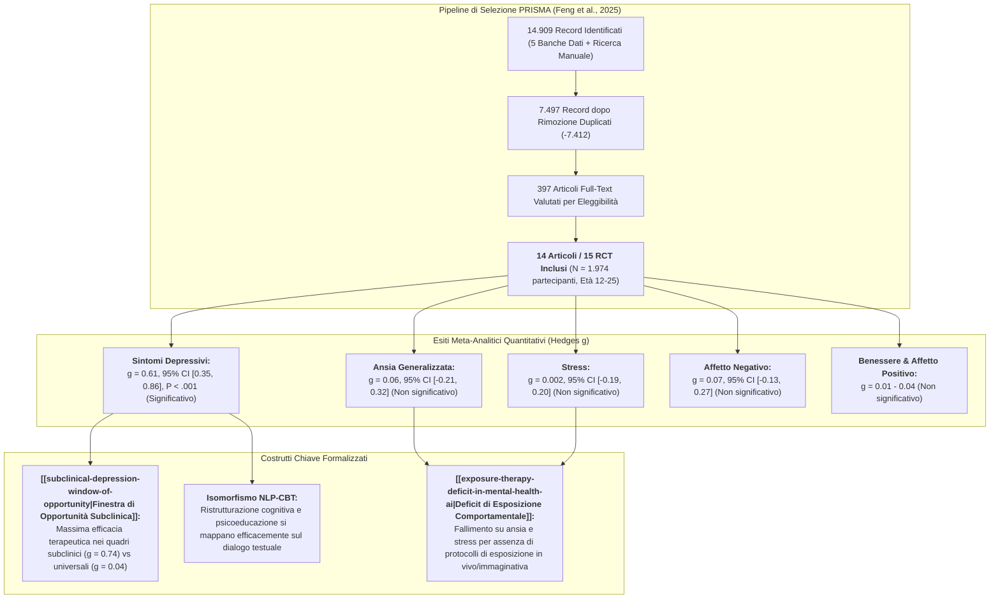
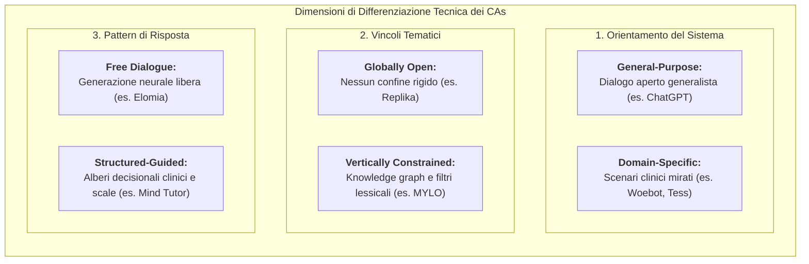
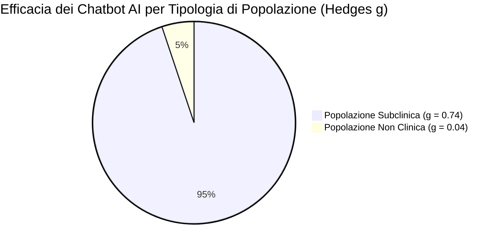

# Effectiveness of AI-Driven Conversational Agents in Improving Mental Health Among Young People: Systematic Review and Meta-Analysis (Feng et al., 2025)

## Definizione Operativa
- **Prima revisione sistematica e meta-analisi globale** specificamente focalizzata sull'efficacia degli **agenti conversazionali guidati da intelligenza artificiale (AI-driven Conversational Agents - CAs)** dotati di Natural Language Processing ([[large-language-models|NLP]]) o Machine Learning (ML) nel miglioramento della salute mentale di **adolescenti e giovani adulti (12–25 anni)**.
- **Dati Bibliografici:** Pubblicata su *Journal of Medical Internet Research* (JMIR, 2025; 27:e69639; DOI: [10.2196/69639](https://doi.org/10.2196/69639)) da Yi Feng, Yaming Hang, Wenzhi Wu, Xiaohang Song, Xiyao Xiao, Fangbai Dong e Zhihong Qiao (Central University of Finance and Economics; Beijing Normal University; Lingxin AI; Henan Agricultural University, Pechino, Cina).
- **Corpus Esaminato:**
  - *Ricerca Sistematica (PRISMA):* 14.909 record identificati attraverso 5 banche dati (*PubMed*, *PsycINFO*, *EMBASE*, *Cochrane Library*, *Web of Science*) dall'inizio delle registrazioni fino al 6 agosto 2024;
  - *Inclusione Finale:* **14 articoli con 15 trial clinici randomizzati controllati (RCT)**, per un campione aggregato di **1.974 partecipanti** (range 42–415 per studio).
- **Evidenze Quantitative Chiave:**
  - *Effetto Selettivo sulla Depressione:* Gli agenti conversazionali AI hanno prodotto un effetto statisticamente significativo di entità da moderata ad ampia nella riduzione dei sintomi depressivi ($\text{Hedges } g = 0.50$, $95\%\text{ CI } [0.18, 0.82]$; dopo rimozione dell'outlier: **$g = 0.61$, $95\%\text{ CI } [0.35, 0.86]$, $P < .001$**).
  - *Insignificanza Statistica su Altri Esiti:* Gli effetti aggregati (aggiustati per publication bias con *trim-and-fill*) sono risultati **tutti non significativi** per l'ansia generalizzata ($g = 0.06$, $95\%\text{ CI } [-0.21, 0.32]$), lo stress ($g = 0.002$, $95\%\text{ CI } [-0.19, 0.20]$), l'affetto positivo ($g = 0.01$, $95\%\text{ CI } [-0.24, 0.27]$), l'affetto negativo ($g = 0.07$, $95\%\text{ CI } [-0.13, 0.27]$) e il benessere psicologico ($g = 0.04$, $95\%\text{ CI } [-0.21, 0.29]$).
  - *Moderatore Cruciale (Popolazione Subclinica):* La tipologia di campione è risultata l'unico moderatore statisticamente significativo ($Q_b = 8.46, P = .02$). I CAs hanno mostrato la massima efficacia nelle popolazioni **subcliniche** (**$g = 0.74$, $95\%\text{ CI } [0.50, 0.98]$**), a fronte di un effetto nullo nelle popolazioni non cliniche ($g = 0.04$, $95\%\text{ CI } [-0.38, 0.46]$) e dell'insufficienza dei chatbot come intervento autonomo per la depressione clinica maggiore formale ($g = 0.91$, $95\%\text{ CI } [-0.11, 1.94]$, $N=1$).
  - *Invarianza Tecnica:* Modalità di interazione (testuale vs multimodale), piattaforma di erogazione (app standalone vs instant messenger) e durata dell'intervento non hanno moderato l'effetto sulla depressione.

---

## Evidenze dalla Letteratura

### 1. Metodologia di Revisione e Criteri di Eleggibilità (PICOS)
- **Popolazione:** Giovani con età media compresa tra 12 e 25 anni (adolescenti e giovani adulti), appartenenti a popolazioni cliniche ($n=1$), subcliniche con sintomi autodichiarati o rilevati da screening ($n=7$), o non cliniche/studenti universitari generali ($n=8$).
- **Intervento:** Interventi basati su CAs dotati di tecnologie di intelligenza artificiale (NLP o machine learning) capaci di comprendere l'intento dell'utente, analizzare il contesto e generare o recuperare risposte appropriate in modo dinamico.
- **Comparatore:** Qualsiasi condizione di controllo (gruppi di controllo attivo come psicoeducazione o treatment-as-usual, liste d'attesa o sola valutazione).
- **Esiti Misurati:** Misure quantificate di depressione, ansia generalizzata, stress, affetto positivo, affetto negativo e benessere mentale al post-test.
- **Disegno di Studio:** Esclusivamente trial clinici randomizzati e controllati (RCT). Esclusi studi senza NLP/AI, non-RCT, abstract congressuali e pubblicazioni non in lingua inglese.

---

### 2. Tassonomia Architetturale dei Conversational Agents Inclusi

Gli autori delineano una rigorosa categorizzazione tecnica e funzionale dei moderni CAs per la salute mentale:

- **Architettura Computazionale Prevalente:**
  - *Retrieval-Based CAs:* 12 studi (sistemi basati su recupero di pattern con NLP);
  - *Generative CAs:* 3 studi (sistemi basati su modelli generativi pre-addestrati come GPT);
  - *Ibridi (Retrieval + Generative):* 1 studio (Liu et al., 2024);
  - *Modalità di Interazione:* 13 studi puramente testuali, 3 studi multimodali (avatar/voce).

---

### 3. Risultati della Sintesi Meta-Analitica per Outcome

Tutti gli effect size sono stati calcolati come **Hedges $g$** con modello a effetti casuali (*random-effects model*). Valori positivi indicano una superiorità dell'intervento CA rispetto al controllo.

| Outcome Clinico | $N$ Studi (Confronti) | $N$ Partecipanti | Hedges $g$ Grezzo $[95\%\text{ CI}]$ | Eterogeneità ($I^2, Q$) | Hedges $g$ dopo Outlier $[95\%\text{ CI}]$ | Trim-and-Fill Adjusted $g$ $[95\%\text{ CI}]$ | Significatività Clinica |
| :--- | :--- | :--- | :--- | :--- | :--- | :--- | :--- |
| **Sintomi Depressivi** | 10 | 1.488 | $0.50\ [0.18, 0.82]$ | $I^2 = 89.7\%, Q_9 = 39.64^{***}$ | **$0.61\ [0.35, 0.86]^{***}$** ($N=9, I^2=54.9\%$) | **$0.61\ [0.35, 0.86]^{***}$** (Nessun bias rilevato) | **Significativo** (Effetto medio-grande) |
| **Ansia Generalizzata** | 10 | 1.428 | $0.42\ [-0.04, 0.87]$ | $I^2 = 87.4\%, Q_9 = 71.45^{***}$ | $0.17\ [-0.07, 0.42]$ ($N=9, I^2=51.3\%$) | $0.06\ [-0.21, 0.32]$ (2 studi imputati a sx) | **Non Significativo** ($P = .17$) |
| **Stress Percepito** | 4 | 592 | $0.002\ [-0.19, 0.20]$ | $I^2 = 0.0\%, Q_3 = 2.39$ ($P=.50$) | Nessun outlier identificato | $0.002\ [-0.19, 0.20]$ | **Non Significativo** ($P = .98$) |
| **Affetto Positivo** | 7 | 896 | $0.01\ [-0.24, 0.27]$ | $I^2 = 63.1\%, Q_6 = 16.28^{*}$ | Nessun outlier identificato | $0.01\ [-0.24, 0.27]$ | **Non Significativo** ($P = .92$) |
| **Affetto Negativo** | 7 | 896 | $0.36\ [-0.04, 0.76]$ | $I^2 = 84.3\%, Q_6 = 38.11^{***}$ | $0.11\ [-0.06, 0.28]$ ($N=6, I^2=11.3\%$) | $0.07\ [-0.13, 0.27]$ (1 studio imputato a sx) | **Non Significativo** ($P = .17$) |
| **Benessere Mentale** | 4 | 560 | $0.04\ [-0.21, 0.29]$ | $I^2 = 32.3\%, Q_3 = 4.43$ ($P=.22$) | Nessun outlier identificato | $0.04\ [-0.21, 0.29]$ | **Non Significativo** ($P = .76$) |

*Note:* $^{*} P < .05$, $^{***} P < .001$. Outlier per depressione: Bird et al. (2018; $g = -0.20$); outlier per ansia e affetto negativo: Romanovskyi & Pidbutska (2021; $g = 1.21$).

---

### 4. Analisi dei Moderatori per i Sintomi Depressivi

L'analisi dei sottogruppi (modello a effetti misti) e la meta-regressione (metodo di massima verosimiglianza illimitata) hanno isolato i determinanti dell'efficacia sui sintomi depressivi:

| Moderatore | Livello / Sottogruppo | $n$ Studi | Hedges $g\ [95\%\text{ CI}]$ | $Q_w\ (P)$ | $Q_b\ (P)$ | Interpretazione Clinica |
| :--- | :--- | :--- | :--- | :--- | :--- | :--- |
| **Tipologia di Campione** | **Subclinico** Non clinico Clinico | 6 2 1 | **$0.74\ [0.50, 0.98]$** $0.04\ [-0.38, 0.46]$ $0.91\ [-0.11, 1.94]$ | $8.07\ (.15)$ $0.18\ (.67)$ — | **$8.46\ (.02)^{*}$** | **Unico moderatore significativo.** La depressione subclinica beneficia massimamente dell'intervento; i campioni generali mostrano floor effect. |
| **Modalità Interazione** | Testuale Multimodale | 7 2 | $0.52\ [0.17, 0.86]$ $0.82\ [0.54, 1.09]$ | $15.57\ (.02)$ $0.00\ (.99)$ | $1.71\ (.19)$ | Nessuna differenza statisticamente significativa tra solo testo e sistemi multimodali/avatar. |
| **Gruppo di Controllo** | Controllo attivo Solo informazioni Waitlist/Assessment | 5 3 1 | $0.62\ [0.21, 1.04]$ $0.52\ [0.23, 0.81]$ $0.91\ [-0.11, 1.94]$ | $14.77\ (.005)$ $1.69\ (.43)$ — | $0.61\ (.74)$ | L'effetto antidepressivo rimane solido anche a confronto con controlli attivi psicoeducativi. |
| **Piattaforma Consegna** | Instant Messenger Standalone App | 5 4 | $0.59\ [0.15, 1.03]$ $0.62\ [0.29, 0.96]$ | $11.15\ (.03)$ $6.52\ (.09)$ | $0.06\ (.97)$ | Piattaforme proprietarie e app di messaggistica ottengono esiti sovrapponibili nei giovani. |
| **Durata Intervento** | $0–4$ settimane $> 4$ settimane | 7 2 | $0.55\ [0.23, 0.86]$ $0.83\ [0.42, 1.24]$ | $16.79\ (.01)$ $0.03\ (.87)$ | $1.19\ (.28)$ | Interventi brevi (fino a 1 mese) ed estesi producono riduzioni depressive analoghe. |

- **Meta-Regressione Continua:**
  - *Età media:* $\beta = -0.06$, $SE = 0.06$, $z = -0.98$, $P = .33$ (Invariante tra 12 e 25 anni);
  - *Anno di pubblicazione:* $\beta = 0.05$, $SE = 0.05$, $z = 0.99$, $P = .32$;
  - *Percentuale femminile:* $\beta = -0.01$, $SE = 0.01$, $z = -0.69$, $P = .49$ (Efficacia equivalente per maschi e femmine);
  - *Punteggio di qualità metodologica:* $\beta = 0.08$, $SE = 0.08$, $z = 1.02$, $P = .31$.

---

### 5. Valutazione Metodologica e Rischio di Bias (Cochrane RoB)
- **Qualità Globale Subottimale:** Solo uno studio su 15 (He et al., 2022 [41]) ha soddisfatto tutti i 6 criteri di qualità Cochrane.
  - *Blinding dei partecipanti e del personale (Performance Bias):* Assente o non descritto nel 40% degli studi (6/15);
  - *Blinding dei valutatori degli esiti (Detection Bias):* Omesso nel 60% degli studi (9/15);
  - *Selective Reporting Bias:* Il 53.3% degli studi (8/15) non presentava pre-registrazione del protocollo di trial clinico.
- **Assenza di Follow-up a Lungo Termine:** La totalità degli studi inclusi ha misurato gli outcome esclusivamente all'immediato post-test, impedendo di valutare la persistenza nel tempo dei benefici clinici.

---

## Inquadramento Teorico e Clinico

### 1. La Superiorità dei Sistemi NLP rispetto ai Sistemi Digitali Tradizionali
- Le precedenti meta-analisi che includevano sistemi digitali non-NLP (come le prime forme di iCBT computerizzata statica) riportavano effect size contenuti per la depressione ($g = 0.26–0.29$; He et al., 2023; Zhong et al., 2024).
- Al contrario, l'integrazione di NLP e machine learning incrementa l'effect size a **$g = 0.61$**. L'NLP consente una comprensione contestuale profonda dell'input dell'utente, simulando scambi conversazionali umani personalizzati che accrescono l'ingaggio terapeutico (*therapeutic engagement*) e l'introspezione del giovane utente.

### 2. La [[subclinical-depression-window-of-opportunity|Finestra di Opportunità Subclinica]]
- La marcata discrepanza tra l'effetto sui campioni subclinici ($g = 0.74$) e non clinici ($g = 0.04$) convalida l'impiego dei CAs nei modelli di cura a gradini (*stepped-care model*).
- Nei giovani sani (non clinici), la somministrazione universale di chatbot produce un *floor effect* (assenza di distress da mitigare).
- Nei giovani con depressione subclinica (disregolazione dell'umore, anedonia iniziale, ruminazione), il chatbot funge da intercettore precoce, riducendo i sintomi e prevenendo la transizione verso il Disturbo Depressivo Maggiore (MDD conclamato).

### 3. Il [[exposure-therapy-deficit-in-mental-health-ai|Deficit di Esposizione Comportamentale]] per Ansia e Stress
- Perché i chatbot AI falliscono nell'ansia ($g = 0.06$) e nello stress ($g = 0.002$) pur funzionando nella depressione ($g = 0.61$)?
- **Isomorfismo Cognitivo vs Corporeo/Esperienziale:** Gli interventi digitali per la depressione poggiano su ristrutturazione cognitiva (*cognitive reappraisal*) e attivazione comportamentale verbale, compiti perfettamente eseguibili in chat testuale.
- Al contrario, l'ansia patologica e lo stress cronico richiedono **tecniche di esposizione intensiva (in vivo, immaginativa, interocettiva)** ed estinzione della paura basata sull'apprendimento inibitorio. I chatbot testuali non sono attualmente equipaggiati per guidare, monitorare e calibrare l'esposizione ansiogena in sicurezza senza la presenza del clinico umano.
- **Assenza di Moduli di Psicologia Positiva:** I chatbot analizzati derivano prevalentemente da manuali CBT deficit-oriented, risultando incapaci di promuovere attivamente costrutti di benessere e affetto positivo ($g = 0.01 - 0.04$).

---

## Riferimenti Bibliografici
- **Feng, Y., Hang, Y., Wu, W., Song, X., Xiao, X., Dong, F., & Qiao, Z. (2025).** Effectiveness of AI-Driven Conversational Agents in Improving Mental Health Among Young People: Systematic Review and Meta-Analysis. *Journal of Medical Internet Research*, 27, e69639. https://doi.org/10.2196/69639
- **Bird, T., Mansell, W., Wright, J., Gaffney, H., & Tai, S. (2018).** Manage your life online: a web-based randomized controlled trial evaluating the effectiveness of a problem-solving intervention in a student sample. *Behavioural and Cognitive Psychotherapy*, 46(5), 570–582.
- **Cuijpers, P., Koole, S. L., van Dijke, A., Roca, M., Li, J., & Reynolds, C. F. (2014).** Psychotherapy for subclinical depression: meta-analysis. *British Journal of Psychiatry*, 205(4), 268–274.
- **He, Y., Yang, L., Zhu, X., Wu, B., Zhang, S., Qian, C., et al. (2022).** Mental health chatbot for young adults with depressive symptoms during the COVID-19 pandemic: single-blind, three-arm randomized controlled trial. *Journal of Medical Internet Research*, 24(11), e40719.
- **He, Y., Yang, L., Qian, C., Li, T., Su, Z., Zhang, Q., et al. (2023).** Conversational agent interventions for mental health problems: systematic review and meta-analysis of randomized controlled trials. *Journal of Medical Internet Research*, 25, e43862.
- **Li, H., Zhang, R., Lee, Y. C., Kraut, R. E., & Mohr, D. C. (2023).** Systematic review and meta-analysis of AI-based conversational agents for promoting mental health and well-being. *NPJ Digital Medicine*, 6(1), 236.
- **Liu, I., Liu, F., Xiao, Y., Huang, Y., Wu, S., & Ni, S. (2024).** Investigating the key success factors of chatbot-based positive psychology intervention with retrieval- and generative pre-trained transformer (GPT)-based chatbots. *International Journal of Human-Computer Interaction*, 41(1), 341–352.
- **Romanovskyi, O., & Pidbutska, N. (2021).** Elomia Chatbot: the effectiveness of artificial intelligence in the fight for mental health. *COLINS 2021*, 1215–1224.
- **Zhong, W., Luo, J., & Zhang, H. (2024).** The therapeutic effectiveness of artificial intelligence-based chatbots in alleviation of depressive and anxiety symptoms in short-course treatments: a systematic review and meta-analysis. *Journal of Affective Disorders*, 356, 459–469.

---

## Relazioni
- [[subclinical-depression-window-of-opportunity]]: Finestra di opportunità clinica e massima efficacia dei chatbot AI per la depressione subclinica giovanile.
- [[exposure-therapy-deficit-in-mental-health-ai]]: Discrepanza di efficacia tra depressione e ansia/stress dovuta all'assenza di moduli di esposizione comportamentale negli agenti AI.
- [[jmir-v27-e78238]]: Meta-analisi di Zhang et al. (2025) sul confronto tra chatbot social-oriented e task-oriented nella salute mentale.
- [[jmir-v27-e79850]]: Meta-analisi di Feng et al. (2025) sulle affordance digitali e distress corporeo negli adolescenti e giovani adulti (AYA).
- [[cpp-33-e70242-1]]: Revisione sistematica di Orrù & Mannarini (2026) su trattabilità algoritmica e modelli NLP in psicologia clinica.
- [[aya-digital-mental-health-affordances]]: Proprietà d'uso e anonimato dei chatbot per la popolazione giovanile.
- [[clinical-readiness-gap-in-mh-chatbots]]: Il divario di prontezza clinica tra performance conversazionale ed efficacia clinica evidence-based.
- [[ai-enhanced-cbt]]: Integrazione di tecniche cognitivo-comportamentali negli agenti conversazionali.
- [[modello-centauro-clinico]]: Cooperazione human-in-the-loop per l'integrazione di strumenti digitali nella cura a gradini.
