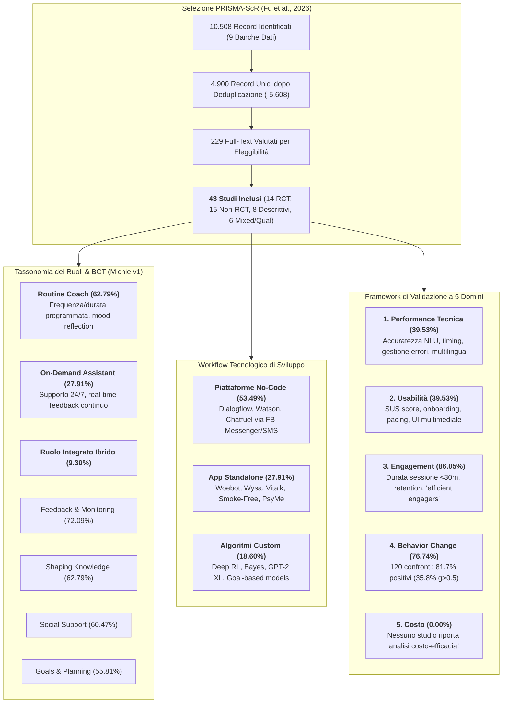
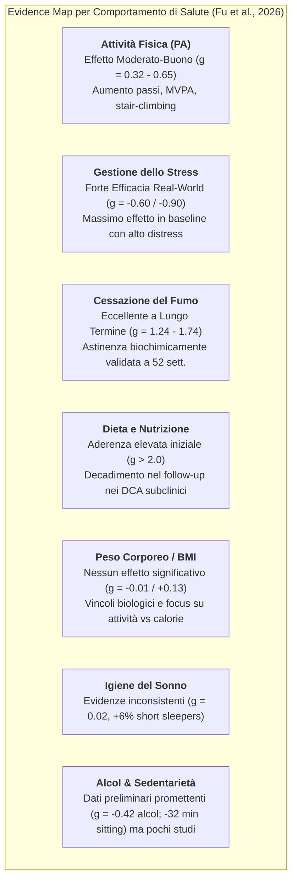
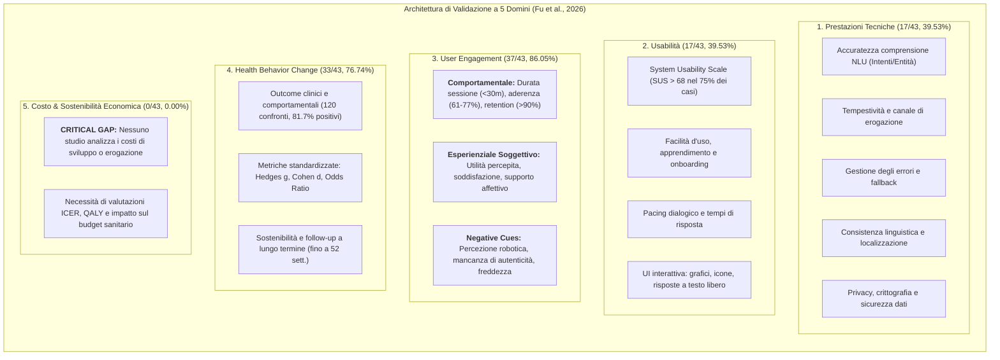

# The Development and Use of AI Chatbots for Health Behavior Change: Scoping Review (Fu et al., 2026)

## Definizione Operativa
- **Scoping Review globale e sistematica PRISMA-ScR** registrata su **Open Science Framework (OSF:** [osf.io/wcspx/overview](https://osf.io/wcspx/overview)) condotta da Lingyi Fu, Ryan Burns, Yuhuan Xie, Jincheng Shen, Shandian Zhe, Paul Estabrooks e Yang Bai (*Department of Health and Kinesiology, School of Medicine, and Kahlert School of Computing, University of Utah*), pubblicata sul *Journal of Medical Internet Research* (JMIR, 2026; 28:e79677; DOI: [10.2196/79677](https://doi.org/10.2196/79677)).
- **Corpus Esaminato ed Evidenze Sintetizzate:**
  - *Ricerca Sistematica:* Screening di **10.508 record iniziali** estratti da 9 banche dati multidisciplinari, biomediche e tecnologiche (*PubMed, CINAHL, MEDLINE, Embase, Web of Science, Scopus, APA PsycINFO, IEEE Xplore, ACM Digital Library*) fino al 13 marzo 2024.
  - *Campione Incluso:* **43 studi primari** pubblicati tra il 2018 e l'inizio del 2024 (il 25.58% nel 2023), con campionari da 7 a 57.214 partecipanti ($N$ totale aggregato $>70.000$), valutati metodologicamente tramite il *Mixed Methods Appraisal Tool* (MMAT; Cohen $\kappa = 0.83$). I disegni includono 14 trial randomizzati controllati (RCT, 32.56%), 15 trial quantitativi non randomizzati (34.88%), 8 studi descrittivi quantitativi (18.60%), 4 studi mixed-methods (9.30%) e 2 qualitativi (4.65%).
- **I Tre Assi Chiave della Sintesi:**
  1. *Tassonomia Funzionale dei Ruoli:* Distinzione empirica tra **[[routine-coach-vs-on-demand-assistant|Routine Coach]]** (62.79%, 27/43; dosaggio prefissato per check periodici) e **[[routine-coach-vs-on-demand-assistant|On-Demand Assistant]]** (27.91%, 12/43; accesso asincrono 24/7 con feedback immediato), oltre a modelli integrati (9.30%, 4/43).
  2. *Mappatura delle Tecniche di Cambiamento Comportamentale (BCT Taxonomy v1):* Codifica sistematica secondo Michie et al. (93 tecniche in 16 cluster; affidabilità inter-rater 81.70%). I cluster predominanti sono *Feedback e Monitoraggio* (72.09%), *Shaping Knowledge* (62.79%), *Supporto Sociale* (60.47%) e *Obiettivi e Pianificazione* (55.81%).
  3. *Framework di Validazione a Cinque Domini:* Integrazione del *Digital Health Scorecard* (Mathews et al., 2019) con il *Framework di Engagement* (Perski et al., 2017) su **[[five-domain-chatbot-validation-framework|5 cluster di valutazione]]**: *Prestazioni Tecniche* (39.53%), *Usabilità* (39.53%), *User Engagement* (86.05%), *Esiti di Salute Comportamentale* (76.74%) e *Costo* (0.00% - gap sistemico della letteratura).
- **Esiti Clinico-Comportamentali Complessivi:**
  - Su 33 studi che hanno valutato esiti comportamentali con **120 confronti pre-post o trattamento-controllo**, l'**81.67% (98/120)** ha riportato variazioni positive, ma solo il **35.83% (43/120)** ha evidenziato effetti di entità da moderata a grande ($\text{Hedges } g, \text{OR o Cohen } d > 0.50$).
  - I benefici più consistenti si concentrano su **attività fisica (PA)**, **gestione dello stress**, **cessazione del fumo** e **dieta**, mentre l'evidenza rimane scarsa o non significativa per sonno, calo ponderale (peso/BMI), alcol e sedentarietà.

---

## Inquadramento Teorico e Architetturale

### 1. Comportamenti Target e Pilastri della Lifestyle Medicine
La revisione adotta la classificazione della medicina dello stile di vita (*lifestyle medicine*) analizzando 8 comportamenti di salute target:
- **Comportamento Singolo (*One Health Behavior - OHB*):** 29/43 studi (67.44%), dominati da gestione dello stress (10/43, 23.26%), attività fisica (8/43, 18.60%) e disassuefazione da fumo (6/43, 13.95%).
- **Comportamenti Multipli (*Multiple Health Behaviors - MHBs*):** 14/43 studi (32.56%), prevalentemente combinazioni tra dieta e attività fisica ($n=4$), dieta e gestione del peso ($n=2$), oppure interventi integrati su dieta, attività fisica, sonno e stress ($n=2$).

| Comportamento Target | Studi Singoli (OHB) | Studi Multipli (MHB) | Totale Presenze ($N=43$) |
| :--- | :--- | :--- | :--- |
| **Attività Fisica (PA)** | 8 (18.60%) | 10 (23.26%) | **18 (41.86%)** |
| **Gestione dello Stress** | 10 (23.26%) | 6 (13.95%) | **16 (37.21%)** |
| **Alimentazione e Dieta** | 1 (2.33%) | 10 (23.26%) | **11 (25.58%)** |
| **Cessazione del Fumo** | 6 (13.95%) | 1 (2.33%) | **7 (16.28%)** |
| **Igiene del Sonno** | 1 (2.33%) | 6 (13.95%) | **7 (16.28%)** |
| **Controllo del Peso (Weight Management)** | 2 (4.65%) | 4 (9.30%) | **6 (13.95%)** |
| **Consumo di Alcol** | 1 (2.33%) | 0 (0.00%) | **1 (2.33%)** |
| **Comportamento Sedentario** | 0 (0.00%) | 1 (2.33%) | **1 (2.33%)** |

### 2. Modelli Teorici Guida
Il 65.12% (28/43) degli studi ha fondato il design conversazionale su solide teorie psicologiche e comportamentali (20 approccio a singola teoria, 8 approcci multi-teorici integrati):
1. **[[ai-enhanced-cbt|Cognitive Behavioral Therapy (CBT)]] (46.43%, 13/28):** Ristrutturazione cognitiva dei pensieri disfunzionali, monitoraggio dell'umore e compiti comportamentali graduati;
2. **Motivational Interviewing (MI) (21.53%, 6/28):** Stile comunicativo direttivo centrato sulla persona per esplorare e risolvere l'ambivalenza verso il cambiamento;
3. **Modello COM-B (*Capability, Opportunity, Motivation - Behavior*) (14.29%, 4/28):** Mappatura delle barriere fisiche, psicologiche e ambientali che regolano l'adozione dell'abitudine;
4. **Altri Modelli:** *Habit Formation Model* (HFM), *Positive Psychology*, *Self-Regulatory Message Framing*, *5A Clinic Practice Guidelines* e *Transtheoretical Model*.

### 3. Tassonomia BCT (Michie v1) e Divergenza nei Ruoli
L'applicazione delle 93 tecniche BCT ha mostrato una chiara gerarchia:
- **Cluster Altamente Utilizzati:** *Feedback and Monitoring* (Cluster B: 72.09%), *Shaping Knowledge* (Cluster D: 62.79%), *Social Support* (Cluster C: 60.47%) e *Goals and Planning* (Cluster A: 55.81%).
- **Cluster Sottoutilizzati o Assenti:** *Antecedents* (Cluster L: 0%), *Scheduled Consequences* (Cluster N: 0%) e ristrutturazione ambientale, a causa della limitata capacità dei chatbot testuali di manipolare direttamente i contesti fisici degli utenti.
- **Asimmetria tra Ruoli:** La tecnica di *Feedback and Monitoring* (B) è implementata nel **91.67% (11/12)** degli *On-Demand Assistants* (grazie al monitoraggio dinamico continuo e al tracciamento in tempo reale) contro il **62.96% (17/27)** dei *Routine Coaches* (focalizzati su valutazioni retrospettive una tantum come diari del sonno o journaling di gratitudine).

---

## Workflow Tecnologico e Architetture di Sistema

L'architettura funzionale dei chatbot per il cambiamento comportamentale si articola su tre componenti fondamentali:

```mermaid
flowchart LR
    subgraph FrontendModule ["1. Frontend Interface"]
        F1["Social Messaging<br/>(FB Messenger, Slack, Telegram, LINE)"]
        F2["SMS Texting"]
        F3["Web Application"]
        F4["Native Mobile App"]
    end

    subgraph BackendModule ["2. Backend AI Core"]
        B1["<b>Dialog Understanding (NLU)</b><br/>Intent Classification & Entity Recognition"]
        B2["<b>Dialog Management</b><br/>Domain Knowledge & Policy Logic"]
        B3["<b>Dialog Generation</b><br/>Template, Retrieval o Generative LLM"]
    end

    subgraph ExternalModule ["3. External Ecosystem & Webhooks"]
        E1["<b>Wearable Trackers (WATs)</b><br/>Fitbit, Garmin, Apple Health"]
        E2["<b>Databases</b><br/>PostgreSQL, MongoDB, MySQL"]
        E3["<b>Human In-The-Loop</b><br/>Clinici, Terapisti, Visite Oncologiche"]
    end

    FrontendModule <--> BackendModule
    BackendModule <--> ExternalModule
```

### 1. Piattaforme No-Code / Low-Code (53.49%, 23/43)
- L'approccio prevalente sfrutta piattaforme commerciali con algoritmi di Natural Language Understanding (NLU) preconfigurati: **Google Dialogflow** (34.78%, 8/23) e **IBM Watson** (34.78%, 8/23), seguiti da Chatfuel e X2AI.
- Canali di distribuzione predominanti: Facebook Messenger, Slack e SMS. L'estensione delle logiche conversazionali avviene tramite webhook e funzioni cloud collegate a database esterni (MongoDB, PostgreSQL, Google Cloud Functions).
- *Vantaggio:* Consente a ricercatori clinici e comportamentali privi di competenze informatiche avanzate di progettare ed eseguire trial su campioni vastissimi (fino a 57.214 utenti o su 262 centri sanitari territoriali).

### 2. Applicazioni Standalone Integrate (27.91%, 12/43)
- Sistemi proprietari che incapsulano l'intero stack applicativo: *Woebot* (CBT e regolazione affettiva), *Wysa* (supporto al benessere, journaling ed escalation a terapisti umani), *Vitalk*, *Smoke-Free* e *PsyMe*.
- Offrono moduli integrati come grafici di aderenza, biblioteche di auto-aiuto, pulsanti di distress internazionale ed esercizi di respirazione guidata.

### 3. Algoritmi Custom e Modelli Avanzati (18.60%, 8/43)
- Sviluppo di pipeline dedicate basate su modelli probabilistici di Bayes (per la personalizzazione dei bisogni), combinazioni di NLP e **GPT-2 XL** per la generazione di riflessioni empatiche in Motivational Interviewing, **Deep Reinforcement Learning (DRL)** per la modulazione adattiva delle notifiche e algoritmi di apprendimento supervisionato su obiettivi clinici (*goal-based*).

### 4. Interventi Multicomponenti e Integrazione con Wearable (37.21%, 16/43)
- Il 37.21% degli studi integra il chatbot con altri dispositivi o interventi clinici umani:
  - *[[wearable-sensor-fusion-adherence|Wearable Activity Trackers (WATs)]]:* Il 57.14% degli studi con sensori indossa tracker (es. accelerometri, smartwatch) sincronizzati automaticamente via API con il chatbot per il feedback bidirezionale; il restante 42.86% li usa per l'auto-monitoraggio manuale guidato dagli obiettivi del bot;
  - *Setting Clinici Umani:* Chatbot integrati all'interno di percorsi di chemioterapia per tumore colorettale, ambulatori pediatrici per l'obesità, visite mediche di medicina generale e percorsi di psicoterapia a distanza.

---

## Risultati Quantitativi ed Esiti Comportamentali

### 1. Panoramica degli Effetti (120 Confronti su 33 Studi)
- **Cambiamenti Positivi Generali:** L'81.67% (98/120) dei confronti ha evidenziato miglioramenti nella direzione attesa.
- **Entità Clinica dell'Effetto:** Solo il **35.83% (43/120)** ha raggiunto una dimensione dell'effetto di entità almeno moderata ($\text{Hedges } g \ge 0.50$ o $\text{Cohen } d \ge 0.50$ o $\text{OR} > 1.5$).
- **Disparità per Comportamento Specifico:**
  - *Attività Fisica (PA):* Aumenti significativi dei passi giornalieri, del tempo in attività moderata-vigorosa (MVPA) e delle abitudini di salita scale ($g = 0.32 - 0.65$);
  - *Gestione dello Stress:* Notevoli riduzioni dello stress percepito sia in contesti controllati sia in studi real-world ($g = -0.60$ fino a $g = -0.90$ con Vitalk e Woebot);
  - *Cessazione del Fumo:* Elevata efficacia a lungo termine nel raggiungimento e mantenimento dell'astinenza biochimicamente validata ($g = 1.40$ a 12 settimane, $g = 1.74$ a 24 settimane e $g = 1.24$ a 52 settimane con CureApp; $\text{OR} = 1.01 - 1.12$);
  - *Alimentazione e Dieta:* Miglioramento dell'aderenza dietetica e consumo di frutta/verdura ($g = 2.04 - 2.06$ in popolazioni anziane), ma con decadimento temporale nei sintomi di disturbi alimentari subclinici (da $g = -0.41$ a 12 settimane a $g = -0.20$ a 24 settimane);
  - *Sonno, Peso Corporeo, Alcol e Sedentarietà:* Evidenze scarse o deludenti. Nel calo ponderale non emergono variazioni significative di BMI o circonferenza vita ($g = -0.01$ a 6 settimane, $g = -0.05$ a 24 settimane, $g = +0.13$ a 48 settimane), attribuibili ai vincoli omeostatici fisiologici e al fatto che i chatbot promuovono comportamenti attivi piuttosto che restrizioni caloriche dirette.

### 2. Moderatori di Efficacia: Durata, Modalità ed Engagement
1. **Durata dell'Intervento:**
   - Interventi prolungati ($>6$ settimane fino a 48 settimane) accumulano benefici progressivi superiori su peso, circonferenza vita, dieta e probabilità di astinenza da fumo ($\text{OR} = 1.01$ a 48 settimane vs $\text{OR} = 0.84$ a 24 settimane).
2. **Modalità Conversazionale (Text-Only vs Altre Modalità):**
   - I chatbot puramente testuali mostrano un'efficacia inferiore se confrontati direttamente con chatbot video ($g=0.35$ vs $g=1.14$ in PA), avatar umani virtuali ($d=0.36$ vs $d=0.52$ nello stress) o teleterapia umana ($d=0.54$).
   - Tuttavia, gli **interventi multicomponenti** che integrano il chatbot testuale con la terapia tradizionale o con farmacoterapia superano nettamente la terapia tradizionale isolata o i soli farmaci.
3. **Dinamiche di Engagement e il Paradosso degli "Efficient Engagers":**
   - L'intensità d'uso e la qualità dell'esperienza predicono il successo comportamentale.
   - Sorprendentemente, Hoffman et al. (2023) identificano il cluster degli **"Efficient Engagers"**: utenti con frequenza d'interazione quantitativamente minore ma con una solida [[digital-therapeutic-alliance|alleanza terapeutica digitale]] percepita, i quali ottengono riduzioni di stress significativamente maggiori ($g = -0.60$) rispetto agli utenti intensivi tipici ($g = -0.25$).

---

## Il Framework di Validazione a Cinque Domini

Fu et al. perfezionano la validazione degli agenti conversazionali strutturando le metriche su **5 domini interconnessi**:

---

## Gap Metodologici, Bias e Prospettive Future

1. **Il Gap Totale della Valutazione Economica (0% Cost Evidence):**
   - Nonostante la promessa che i chatbot rappresentino interventi a basso costo e scalabili per decongestionare i sistemi sanitari, **nessuno dei 43 studi inclusi** ha quantificato i costi di licenza, hosting infrastrutturale, integrazione clinica o costo-efficacia per QALY/DALY.
2. **Bias di Campionamento e Mancanza di Diversità (WEIRD & Non-Clinical Skew):**
   - Il 74.42% degli studi è stato condotto in Paesi occidentali industrializzati (USA 28.13%, Paesi Bassi 15.63%, Italia 15.63%, UK 15.63%) e l'83.72% su campioni di adulti sani non clinici. Esiste una marcata carenza di trial su adolescenti, popolazioni anziane fragili, minoranze linguistiche e pazienti con patologie croniche severe.
3. **Necessità del Global Digital Health Score (GDHS):**
   - Gli autori propongono la definizione di soglie standardizzate di benchmark (es. punteggio $\ge 75\%$ di utilità percepita = accuratezza 10/10) per aggregare i 5 domini in un unico indice globale comparabile tra studi differenti prima del deployment clinico su larga scala.

---

## Collegamenti Strutturali con la Knowledge Base

- **Tassonomia dei Ruoli e Dosaggio:** Approfondita in [[routine-coach-vs-on-demand-assistant|Routine Coach vs On-Demand Assistant in Health Behavior Chatbots]].
- **Architettura di Valutazione Multidimensionale:** Dettagliata in [[five-domain-chatbot-validation-framework|Framework di Validazione a Cinque Domini per Chatbot di Salute Comportamentale]].
- **Confronto con i Modelli Funzionali:** Confronta con la distinzione tra supporto empatico e compiti in [[social-oriented-vs-task-oriented-chatbots|Social-Oriented vs Task-Oriented Chatbots]] e le architetture dialogiche in [[retrieval-vs-generative-clinical-chatbots|Retrieval vs Generative Clinical Chatbots]].
- **Alleanza e Meccanismi Relazionali:** Si collega a [[digital-therapeutic-alliance|Alleanza Terapeutica Digitale]] e alle dinamiche negli adolescenti in [[aya-digital-mental-health-affordances|AYA Digital Mental Health Affordances]].
- **Integrazione Sensoriale e Aderenza:** Si collega a [[wearable-sensor-fusion-adherence|Wearable Sensor Fusion Adherence]].
- **Linee Guida di Valutazione Clinica:** Completa i criteri di [[five-axis-clinical-evaluation|Five-Axis Clinical Evaluation Framework]] e [[heor-generative-ai-validation|HEOR Generative AI Validation]].

---
*Fonte Primaria: Fu L, Burns R, Xie Y, Shen J, Zhe S, Estabrooks P, Bai Y. "The Development and Use of AI Chatbots for Health Behavior Change: Scoping Review." Journal of Medical Internet Research (JMIR), 2026; 28:e79677. DOI: 10.2196/79677.*
