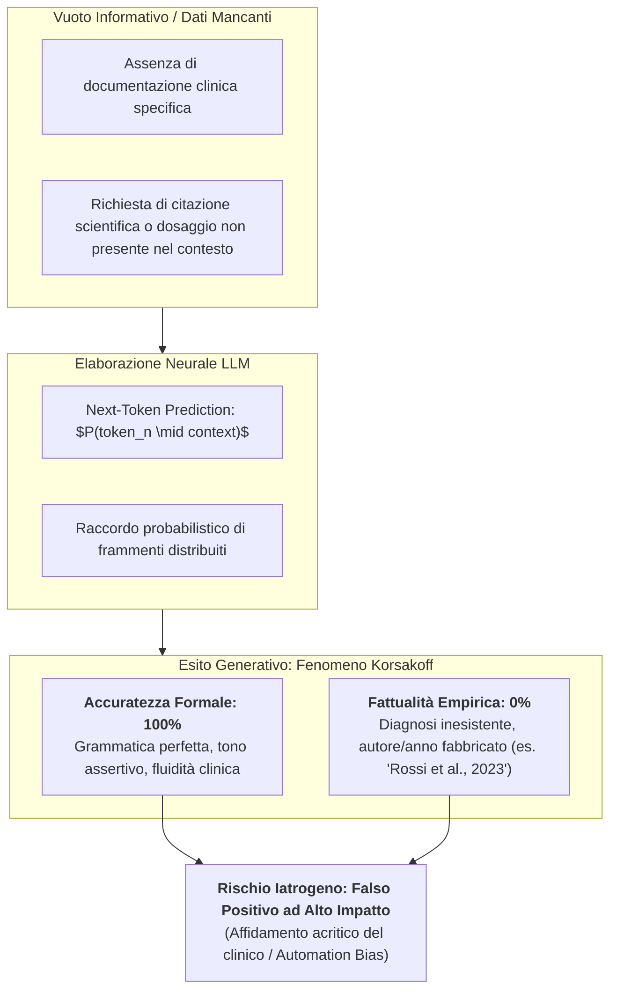
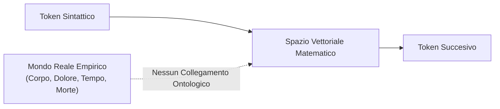

# Confabulazione di Tipo Korsakoff e Dissociazione Accuratezza-Fattualità nei Modelli Linguistici

## Definizione Operativa
- La **Confabulazione di Tipo Korsakoff negli LLM** è un'analogia neuropsicologica ed epistemologica utilizzata nell'[[assessment-cognitivo-ai|Assessment Cognitivo dell'AI]] per descrivere la propensione intrinseca dei [[large-language-models]] a colmare lacune informative, ambiguità contestuali o assenza di dati empirici generando narrazioni, diagnosi o riferimenti bibliografici **sintatticamente ineccepibili, altamente plausibili ma completamente privi di fondamento reale**.
- **La Dissociazione Cardine: Accuratezza vs Fattualità:**
  - **Accuratezza (Accuracy):** Misura della correttezza formale, coerenza grammaticale, eleganza stilistica e fluidità espositiva del testo generato rispetto alle regole del linguaggio naturale.
  - **Fattualità (Factuality):** Grado di riscontro empirico, verità clinico-biomedica oggettiva e corrispondenza veritiera con i dati anamnestici, nosografici o sperimentali del mondo reale (ELEVATE-GenAI, 2025).
- **Assenza di Intento Ingannevole:** Come nel paziente affetto da amnesia diencefalica (Sindrome di Wernicke-Korsakoff) la confabulazione scaturisce dal tentativo automatico di ricostruire la continuità mnestica senza alcuna consapevolezza di falsità né intento fraudolento, così l'LLM non "mente" deliberatamente, ma ottimizza unicamente il calcolo stocastico di probabilità del token successivo (*Next-Token Prediction*), operando in totale assenza di *Concept Grounding*.

## Evidenze dalla Letteratura
Il confronto clinico-epistemologico tra l'amnesia organica e la generazione neurale evidenzia le seguenti dinamiche:

| Parametro | Sindrome Neurologica di Korsakoff | Modelli Linguistici di Grandi Dimensioni (LLM) |
| :--- | :--- | :--- |
| **Eziologia / Causa Primaria** | Danno talamico e dei corpi mammillari (deficit di tiamina / alcolismo cronico); grave compromissione della memoria dichiarativa anterograda. | Architettura probabilistica priva di memoria episodica dinamica; assenza di ancoraggio fisico al mondo reale (*Concept Grounding* deficit). |
| **Manifestazione Fenomenica** | Produzione spontanea o provocata di ricordi autobiografici fabbricati ma esposti con ferma convinzione soggettiva. | Generazione di anamnesi fittizie, correlazioni diagnostiche spurie e referti convincenti ma inventati, esposti con certezza assertiva. |
| **Intenzionalità Cognitiva** | **Zero intenzione ingannevole:** Il paziente compensa inconsapevolmente il vuoto cognitivo. | **Zero intenzione menzognera:** La rete neurale massimizza la plausibilità statistica sintattica locale. |
| **Rischio nel Setting Clinico** | Disorientamento spazio-temporale e disadattamento funzionale del paziente. | Induzione di *Automation Bias*, errori prescrittivi e allucinazioni cliniche assunte come vere dal terapeuta. |

### Il Deficit Strutturale di Concept Grounding
La vulnerabilità alla confabulazione deriva dalla natura puramente sintattica dei modelli di linguaggio:
1. **Assenza di Radicamento Esperienziale:** L'algoritmo manipola simboli senza possedere un modello del mondo.
2. **Sensibilità Sintattica (Brittleness):** La minima alterazione del testo di input può deviare la traiettoria probabilistica, commutando un output clinicamente fattuale in una confabulazione iatrogena.

Il framework internazionale **[[elevate-genai2025-1|ELEVATE-GenAI]]** (ISPOR Working Group, 2025) formalizza la scomposizione della validità scientifica dell'output generativo in tre parametri distinti: Accuratezza, Esaustività e Fattualità.

**Riferimenti Bibliografici:**
- ISPOR Working Group (2025). *ELEVATE-GenAI: Framework for Clinical AI Assessment*.
- Letteratura clinica corrente su *Clinical AI Cognitive Assessment*.

## Relazioni
- [[clinical-ai-cognitive-assessment]] - Sintesi della Masterclass sull'assessment cognitivo dell'AI e superamento dell'illusione relazionale.
- [[diagnosis-of-thought-framework]] - Framework DoT per il disaccoppiamento tra fatti empirici e inferenze cliniche nel prompting.
- [[elevate-genai2025-1]] - Linee guida ISPOR con standardizzazione della triade Accuratezza, Esaustività e Fattualità.
- [[large-language-models]] - Architettura tecnica, next-token prediction e limiti probabilistici.
- [[anthropomorphism-in-ai]] - Effetto ELIZA e sovrastima delle facoltà cognitive degli algoritmi.
- [[simulated-empathy-vs-authentic-presence]] - Distinzione tra simulazione linguistica e presenza empatica reale.
- [[mind-safe-framework]] - Architettura a guardrails per l'intercettazione dei rischi e la messa in sicurezza dei flussi clinici.
- [[coast-framework-clinical-prompting]] - Strutturazione del prompt clinico per vincolare il ragionamento ed evitare allucinazioni.
- [[modello-centauro-clinico]] - Modello integrato di supervisione clinica uomo-macchina.
