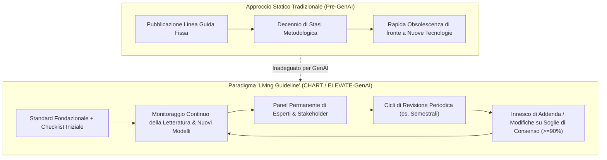
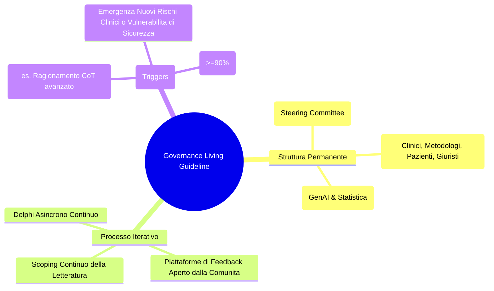

# Living Guidelines nell'Intelligenza Artificiale Sanitaria

## Definizione Operativa
- Il modello delle **Living Guidelines** (linee guida viventi o dinamiche) nell'Intelligenza Artificiale Sanitaria rappresenta un paradigma metodologico e regolatorio in cui gli standard di rendicontazione scientifica e di valutazione clinica vengono continuamente aggiornati attraverso processi iterativi, periodici e formalizzati di consenso tra esperti.
- **Superamento delle Linee Guida Statiche:** Tradizionalmente, le reporting guidelines biomediche della rete [[chart-reporting-guideline|EQUATOR Network]] (come CONSORT, STROBE o PRISMA) venivano pubblicate come documenti monolitici e statici, soggetti a revisioni distanziate da 5-10 anni. Nell'era dell'Intelligenza Artificiale Generativa e dei [[large-language-models|Large Language Models]], il ritmo vertiginoso delle innovazioni architetturali rende obsoleti gli standard statici nel giro di pochi mesi.
- **Applicazione nei Nuovi Framework (CHART ed ELEVATE-GenAI):** Sia lo Statement [[chart-reporting-guideline|CHART]] per i chatbot sanitari (Huo et al., 2025) sia il framework [[elevate-genai-framework|ELEVATE-GenAI]] per l'[[heor-generative-ai-validation|HEOR]] (Fleurence et al., 2025) sono stati concepiti esplicitamente come *Living Guidelines*, integrando strutture permanenti di governance, cicli di revisione programmata (es. revisioni semestrali nei primi due anni per CHART) e meccanismi di aggiornamento basati su evidenze emergenti.

---

## Razionale Metodologico: Perché l'IA Richiede Standard Viventi

1. **Transizione Architetturale Rapida:** L'evoluzione dall'elaborazione del testo unimodale ai Large Multimodal Models (LMM capaci di elaborare immagini mediche, tracciati ECG e referti audio) e ai sistemi agentici complessi (*Agentic AI*) richiede l'introduzione repentina di nuovi parametri di reporting (es. calibrazione cross-modale, latenza inter-agente, protocolli di tool-calling).
2. **Drift dei Modelli Commerciali (*Model Drift & Silent Updates*):** I modelli closed-source erogati via cloud subiscono continui aggiornamenti non dichiarati dai vendor, alterando il loro comportamento stocastico e le prestazioni diagnostiche nel tempo.
3. **Maturazione delle Metriche di Valutazione:** Come evidenziato dalla classificazione dei livelli di maturità in ELEVATE-GenAI, ambiti come la misurazione del bias algoritmico (*Fairness*), la calibrazione dell'incertezza e la sicurezza della privacy presentano metriche ancora a bassa maturità, destinate a evolversi rapidamente grazie alla ricerca empirica.

---

## Architettura di Governance di una Living Guideline

### Elementi Operativi Chiave:
- **Panel Permanente di Esperti:** Mantenimento in carica di un comitato di stakeholder internazionali incaricato di valutare proposte di modifica o estensione degli item.
- **Soglie Formalizzate di Consenso:** Introduzione di criteri decisionali rigorosi (ad esempio, voto qualificato con soglia di consenso $\ge 90\%$ tra i membri del panel) prima di modificare la numerazione o i requisiti obbligatori della checklist.
- **Versionamento Trasparente:** Pubblicazione di release con identificatori semantici chiari (es. CHART v1.0, v1.1, v2.0) corredate da changelog dettagliati per consentire ai ricercatori di tracciare quale versione della linea guida è stata impiegata nel loro studio.

---

## Quadro Comparativo: Linee Guida Tradizionali vs. Living Guidelines

| Caratteristica | Linee Guida Statiche Tradizionali | Living Guidelines nell'IA Sanitaria |
| :--- | :--- | :--- |
| **Frequenza di Revisione** | 5 – 10 anni (ad hoc) | Continua / Semestrale per i primi 2 anni |
| **Adattabilità Tecnologica** | Bassa (pensate per metodologie stabili) | Altissima (progettate per l'evoluzione rapida di LLM e LMM) |
| **Struttura Organizzativa** | Gruppo di lavoro sciolto dopo la pubblicazione | Panel e Steering Committee permanente attivo |
| **Gestione di Ambiti a Bassa Maturità**| Item omessi fino a consolidamento definitivo | Item inclusi con classificazione di maturità dinamica |
| **Integrazione con la Comunità** | Feedback post-pubblicazione limitato | Piattaforme digitali aperte di raccolta feedback e casi studio |

---

## Implicazioni Regolatorie e per la Ricerca

- **Per le Riviste Biomediche:** Gli editori scientifici devono richiedere agli autori di indicare non solo l'adozione dello standard (es. CHART o ELEVATE-GenAI), ma anche il numero di versione specifico della linea guida vigente alla data del protocollo di studio.
- **Per le Autorità Sanitarie e HTA:** Agenzie come FDA, EMA, NICE e CDA-AMC possono allineare i propri requisiti di evidenza a standard metodologici continuamente sincronizzati con lo stato dell'arte tecnologico.
- **Per i Ricercatori:** Garanzia che gli studi metodologici rimangano conformi alle best practice più recenti, prevenendo il rifiuto di pubblicazioni dovuto all'uso di criteri di valutazione obsoleti.

---

## Voci Correlate
- [[linee-guida-reporting-ai-generativa-chart-elevate|Sintesi: Linee Guida per il Reporting della GenAI in Medicina ed Economia Sanitaria]]
- [[chart-reporting-guideline|CHART Reporting Guideline]]
- [[elevate-genai-framework|ELEVATE-GenAI Framework]]
- [[accuratezza-vs-fattualita-in-genai|Accuratezza vs. Fattualità nei Modelli di Intelligenza Artificiale]]
- [[heor-generative-ai-validation|Validazione della GenAI nell'HEOR]]
- [[comparative-ai-health-governance|Governance Comparativa dell'IA in Sanità]]
- [[traffic-light-quality-appraisal-clinical-ai|Traffic Light Quality Appraisal per l'IA Clinica]]
- [[large-language-models|Large Language Models (LLM)]]
