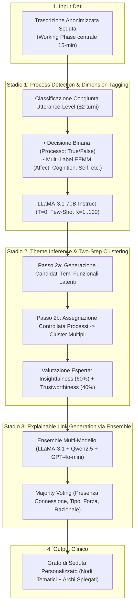

# Pipeline Multi-Stadio di Concettualizzazione Clinica basata su LLM

## Definizione Operativa
- La **pipeline multi-stadio per la concettualizzazione del caso clinico** (*Multi-Stage LLM Pipeline for Clinical Case Conceptualization*) è un'architettura modulare di elaborazione del linguaggio naturale (NLP) introdotta da Ong et al. (2025) per convertire le trascrizioni grezze dei colloqui terapeutici in grafi esplicativi e funzionali (*personalized networks*).
- **Utilità Clinica e Metodologica:** Supera i limiti dei tentativi basati su un singolo prompt diretto (*direct single-shot prompting*), che falliscono nel gestire simultaneamente la complessità del ragionamento clinico. Decompone il processo in tre stadi sequenziali guidati da prompt specializzati, validati e iterativamente ottimizzati con la supervisione di clinici esperti: (1) rilevamento dei processi e categorizzazione dimensionale EEMM; (2) clustering a due fasi in temi clinici latenti; (3) generazione di connessioni dirette spiegate tramite ensemble multi-modello.

---

## Evidenze dalla Letteratura
- **Decomposizione dei Compiti e Controllo delle Allucinazioni:** I compiti clinici richiedono astrazione su diversi livelli gerarchici. Nei test condotti da Ong et al. (2025) su 77 sedute terapeutiche, l'esecuzione simultanea di estrazione, clustering e inferenza causale in un solo prompt ha prodotto mappe generiche o logicamente incoerenti. La segmentazione in stadi sequenziali ha permesso di calibrare prompt dedicati e vincolare i formati di output (JSON schema) a temperatura $T=0$.
- **I Tre Stadi dell'Architettura:**
  1. *Stadio 1 (Process Detection):* LLaMA-3.1-70B analizza ogni enunciato del paziente integrando il contesto conversazionale immediato ($\pm 2$ turni). L'in-context learning con esempi bilanciati ($K=1..100$) aumenta la precisione del $15\%$ e la classificazione dimensionale dell'$8\%$ rispetto allo zero-shot, raggiungendo una sensibilità $>90\%$ rispetto all'annotazione degli esperti.
  2. *Stadio 2 (Two-Step Clustering):* Raggruppa i processi in temi psicologici latenti (es. identificando l'evitamento emotivo sotteso sia all'iperlavoro sia all'uso compulsivo dei social). La separazione tra la generazione delle etichette (Passo 2a) e l'allocazione controllata degli enunciati (Passo 2b) supera nettamente il clustering a singolo passaggio in tutte le metriche cliniche (rilevanza, novità, specificità).
  3. *Stadio 3 (Ensemble Link Generation):* Stima gli archi orientati (eccitatori/inibitori) e le relative spiegazioni testuali. Il confronto tra strategie di aggregazione ha dimostrato che l'**ensemble multi-modello** (LLaMA-3.1 + Qwen2.5 + GPT-4o-mini con majority voting) produce reti significativamente più chiare, coerenti e clinicamente rilevanti rispetto a ensemble basati unicamente su variazioni di prompt o temperatura.
- **Superiorità Clinica rispetto alla Baseline a Prompt Diretto:**
  - Nel confronto cieco condotto con 3 psicologi clinici valutatori:
    - *Supporto alla Pianificazione del Trattamento:* **92.4%** di preferenza per la pipeline multi-stadio vs 7.6% per la baseline ($\kappa = 0.79$).
    - *Significatività Clinica dei Temi:* **89.4%** vs 10.6% ($\kappa = 0.62$).
    - *Qualità e Logica delle Connessioni:* **77.3%** vs 22.7% ($\kappa = 0.44$).

**Riferimenti Bibliografici:**
- Ong, C. W., Arnaout, H., Sheehan, K., Fox, E., Owtscharow, E., & Gurevych, I. (2025). Using Large Language Models to Create Personalized Networks From Therapy Sessions. *arXiv preprint arXiv:2512.05836v1 [cs.AI]*, 1–63.
- Huang, C., & He, G. (2024). Text clustering as classification with llms. *arXiv preprint arXiv:2410.00927*.
- Trad, F., & Chehab, A. (2025). To ensemble or not: Assessing majority voting strategies for phishing detection with large language models. In *Intelligent Systems and Pattern Recognition* (pp. 158–173). Springer Nature Switzerland.

## Relazioni
- Vedi anche: [[2512.05836v1]], [[personalized-networks-in-psychotherapy]], [[extended-evolutionary-meta-model]], [[bottom-up-clinical-documentation]], [[ensemble-prompting-in-clinical-nlp]], [[ai-assisted-psychotherapy]], [[modello-centauro-clinico]]
