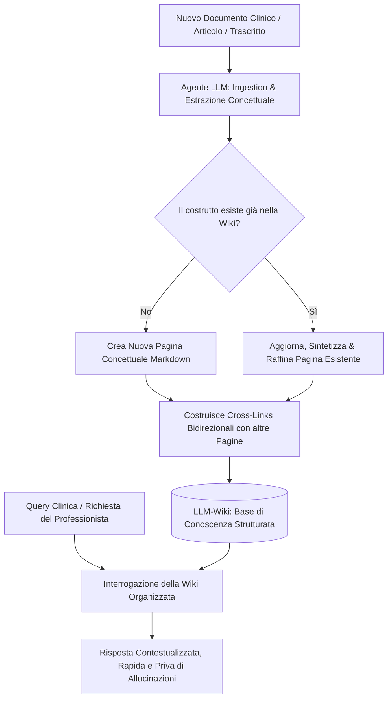

# LLM-Wiki (Architettura di Conoscenza Processuale)

**Summary**: Paradigma di gestione e strutturazione della conoscenza computazionale introdotto da Andrej Karpathy. Invece di interrogare archivi statici di documenti grezzi tramite Retrieval-Augmented Generation (RAG vettoriale a frammenti), un agente LLM cura, sintetizza e aggiorna continuamente un'enciclopedia/wiki strutturata in Markdown con collegamenti ipertestuali concettuali bidirezionali.
**Sources**: 07-17 Riunione_ Corso di Formazione sull'IA in Psicologia e Utilizzo Clinico.txt
**Last updated**: 2026-08-27
---

## 1. Definizione e Origine Metodologica

Il paradigma **LLM-Wiki** è un'architettura di gestione della conoscenza (*Knowledge Management*) proposta dall'informatico **Andrej Karpathy** (co-fondatore di OpenAI ed ex-direttore dell'AI in Tesla) per superare le limitazioni intrinseche dei sistemi tradizionali basati su **RAG (Retrieval-Augmented Generation)** e di strumenti come *Google NotebookLM*.

Nel modello RAG convenzionale:
- I documenti originali vengono archiviati come testi grezzi e suddivisi meccanicamente in frammenti vettoriali (*chunks*).
- Quando l'utente formula una domanda, il sistema esegue una ricerca per somiglianza semantica, recupera i frammenti più vicini e tenta di comporre una risposta estemporanea.
- Questo approccio soffre frequentemente di **frammentazione contestuale**, allucinazioni da decontestualizzazione e incapacità di cogliere la visione sistemica e trasversale di un corpus di conoscenze complesso.

Nel modello **LLM-Wiki**, il ruolo del modello linguistico passa da "motore di ricerca estemporaneo" a **curatore enciclopedico continuo**:
- Il sistema mantiene un'enciclopedia viva e strutturata in formato aperto (**Markdown**).
- Ogni nuovo documento in ingresso non viene semplicemente accodato a un database, ma viene letto, compreso, distillato e integrato organicamente.
- La conoscenza viene organizzata e gerarchizzata per **macro-temi, costrutti clinici, protocolli operativi e nodi decisionali**, arricchita da una rete fitta di collegamenti ipertestuali bidirezionali (*cross-linking*).

---

## 2. Confronto Architetturale: RAG Tradizionale vs LLM-Wiki

| Dimensione | RAG Tradizionale / NotebookLM | Architettura LLM-Wiki |
| :--- | :--- | :--- |
| **Natura del Repository** | Archivio statico di file grezzi (PDF, TXT, DOCX) suddivisi in chunk vettoriali. | Enciclopedia dinamica in Markdown strutturata e concettualmente gerarchizzata. |
| **Momento di Sintesi** | *Reattivo*: sintesi ed estrazione avvengono on-demand durante la formulazione del prompt. | *Proattivo*: distillazione, integrazione e cross-linking avvengono alla fase di *ingestion*. |
| **Unità Informativa** | Frammenti di testo isolati (*vector chunks*). | Pagine concettuali interconnesse, verificate e contestualizzate. |
| **Rischio di Frammentazione** | Elevato (*fragmentation loss* e decontestualizzazione di passaggi clinici). | Minimo: ogni concetto è inserito nella sua cornice teorico-procedurale. |
| **Evoluzione della Conoscenza** | Lineare/cumulativa (i documenti si accumulano senza ristrutturare l'archivio). | Processuale/organica (la conoscenza pregressa viene continuamente aggiornata e affinata). |
| **Efficienza di Query** | Lenta e costosa computazionalmente (rielaborazione costante di frammenti grezzi). | Estremamente rapida e precisa (interrogazione di sintesi già distillate). |

---

## 3. Workflow Operativo in 4 Fasi

1. **Assimilazione Proattiva (*Proactive Ingestion*)**:
   All'inserimento di un nuovo testo (linea guida, trascrizione di seduta, articolo scientifico), l'LLM esegue una scansione olistica per identificare concetti cardine, evidenze empiriche, matrici psicopatologiche e implicazioni pratiche.
2. **Aggiornamento Incrementale (*Incremental Synthesis*)**:
   Il modello valuta la congruenza con le pagine preesistenti nella Wiki: integra nuovi dati, riconcilia eventuali discrepanze teoriche, aggiorna le tabelle comparative e documenta l'evoluzione delle evidenze.
3. **Tessitura dei Collegamenti (*Dense Cross-Linking*)**:
   L'agente genera collegamenti semantici bidirezionali (es. `[[costrutto-clinico]]`), connettendo costrutti diagnostici, protocolli d'intervento, bias cognitivi e basi teoriche in una mappa concettuale navigabile.
4. **Interrogazione ad Alto Livello (*High-Order Retrieval*)**:
   Il clinico non è più costretto a formulare query tipo *"cerca tra i miei documenti il capitolo sul rimuginio"*, ma può chiedere direttamente *"quali sono le strategie di intervento evidence-based validate nella nostra knowledge base per il rimuginio ossessivo?"*, ricevendo una risposta istantanea, esaustiva e fondata su tutta la letteratura integrata nel tempo.

---

## 4. Applicazioni nella Formazione e nella Clinica Psicoterapeutica

- **Potenziamento del [[second-brain-clinico|Second Brain Clinico]]**: Consente al terapeuta di mantenere un archivio personale sempre coerente e aggiornato senza il logorante lavoro manuale di riclassificazione delle note di seduta e dei protocolli.
- **Supporto ad Agenti Didattici Specialistici**: Architettura ideale per alimentare sistemi come *[[libet-prime|Libet Prime]]* o simulatori clinici (*[[trainer-simulator|Trainer Simulator]]*), fornendo una base di conoscenza costantemente raffinata e rigorosamente verificata.
- **Integrazione con la [[bottom-up-clinical-documentation|Documentazione Clinica Bottom-Up]]**: Permette di assimilare le discussioni delle riunioni d'équipe, trasformando i casi clinici discussi verbalmente in voci enciclopediche e alberi decisionali consultabili da tutti i membri del centro clinico.

---

## Related pages
- [[07-17_Riunione_Corso_Formazione]]
- [[second-brain-clinico]]
- [[bottom-up-clinical-documentation]]
- [[libet-prime]]
- [[trainer-simulator]]
- [[microprogettazione-formativa-ia]]
- [[human-in-the-reasoning]]
- [[augmented-psychotherapy]]
- [[ai-assisted-psychotherapy]]
- [[06-10_Lezione_RAG_LLM]]
- [[05-08_Riunione_Knowledge_Base]]
