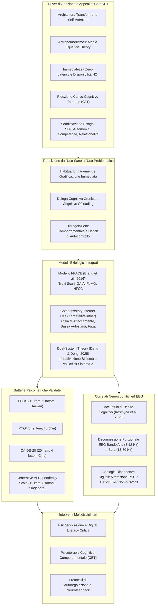
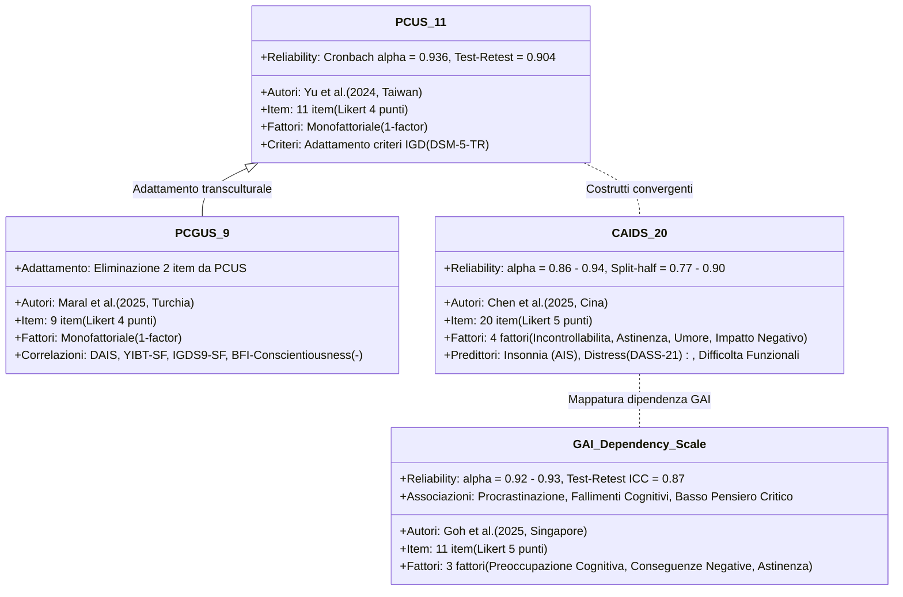
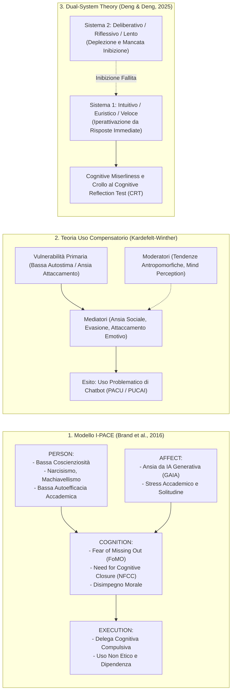
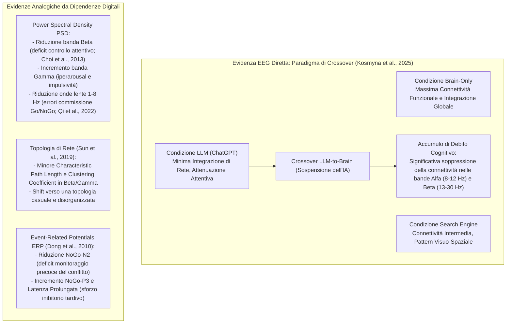
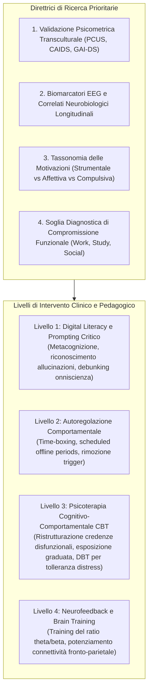

# Problematic ChatGPT Use: Manifestations, Etiologies, and Evaluation (Liao, Ko, & Yen, 2026)

## Definizione Operativa
- Rassegna narrativa, teorica e neurofisiologica pubblicata sul *Biomedical Journal* da Hui-Yuan Liao, Chih-Hung Ko e Cheng-Fang Yen (Department of Psychiatry, Kaohsiung Medical University & Hospital, Taiwan, 2026; DOI: [10.1016/j.bj.2026.100998](https://doi.org/10.1016/j.bj.2026.100998)) che sintetizza le evidenze emergenti sull'**uso problematico di ChatGPT e dell'Intelligenza Artificiale Generativa (GAI)**, analizzandone le manifestazioni cliniche, i fattori eziologici, gli strumenti di assessment psicometrico e i correlati neurofisiologici (EEG).
- **Utilità Clinica e di Ricerca:** Supera la visione puramente funzionale della tecnologia, inquadrando la transizione dall'uso normativo e adattivo (efficienza, supporto allo studio, riduzione del carico cognitivo) all'**uso compulsivo e disadattivo**, caratterizzato da perdita di controllo, astinenza emotiva, compromissione funzionale e accumulo di **debito cognitivo** ([[cognitive-debt-in-generative-ai|Cognitive Debt]]). Integra modelli psicologici consolidati ([[uso-problematico-chatbot-ai|I-PACE]], Teoria dell'Uso Compensatorio di Internet, Teoria del Doppio Sistema Cognitivo) e introduce i primi riscontri elettroencefalografici diretti (attenuazione della connettività nelle bande $\alpha$ e $\beta$) e analogici (alterazioni PSD ed ERP NoGo-N2/P3) per fondare interventi preventivi e terapeutici multidimensionali (CBT, digital literacy, neurofeedback).

---

## Evidenze dalla Letteratura

### 1. Fattori di Diffusione e Appeal Psicologico di ChatGPT
L'adozione su scala globale di ChatGPT e dei modelli linguistici di grandi dimensioni ([[large-language-models]]) poggia su un'intersezione di fattori tecnologici, cognitivi e motivazionali identificati da Liao et al. (2026):
1. **Antropomorfismo e Media Equation Theory:** Secondo la *Media Equation Theory* (Reeves & Nass, 1996), gli esseri umani tendono ad applicare automaticamente euristiche sociali e affettive a media dotati di attributi umani. La fluidità sintattica, la prosodia testuale e la sintonizzazione contestuale di ChatGPT stimolano la percezione di intenzionalità e presenza soggettiva (*mind perception*), facilitando un legame parasociale ([[anthropomorphism-in-ai]]).
2. **Consapevolezza Contestuale e Memoria Cross-Sessione:** La capacità del modello di tracciare il contesto intra-dialogo (e cross-sessione nelle versioni avanzate come GPT-4 e GPT-5) modella un'interazione individualizzata che accresce la fiducia e la dipendenza dell'utente.
3. **Ottimizzazione del Carico Cognitivo (*Cognitive Load Theory*):** Sweller (2011) postula che la memoria di lavoro possiede capacità limitate. ChatGPT riduce il carico cognitivo estraneo (*extraneous cognitive load*) sintetizzando e strutturando grandi masse di informazioni, fornendo soluzioni pronte all'uso.
4. **Cultura dell'Immediatezza e Assenza di Latenza:** In un ecosistema di sovraccarico informativo, la risposta in tempo reale risponde alle aspettative di gratificazione istantanea della cultura digitale *zero-latency*.
5. **Soddisfazione dei Bisogni Psicologici di Base (*Self-Determination Theory*):** Ai sensi della teoria di Deci e Ryan (2012), l'interfaccia appaga simultaneamente:
   - *Autonomia:* Libertà totale nella formulazione dei prompt e nella traiettoria dell'esplorazione;
   - *Competenza:* Risoluzione rapida ed efficace di problemi accademici o lavorativi complessi;
   - *Relazionalità (Relatedness):* Conversazione priva di giudizio, che simula vicinanza empatica e ascolto incondizionato.

---

### 2. Dati Epidemiologici e Prevalenza
Gli studi preliminari evidenziano un'ampia diffusione dell'uso disadattivo, in particolare tra le popolazioni giovanili e universitarie:
- **Campione Cinese Universitario (Zhang et al., 2025; $N = 1.004$):** Il **45.8%** dei partecipanti ha utilizzato regolarmente ChatGPT nell'ultimo mese; tra gli utilizzatori, il **38.2%** manifestava un uso problematico lieve e il **37.6%** un uso problematico moderato. Gli utenti presentavano livelli di depressione (misurati con PHQ-9) significativamente superiori ai non-utenti, con la resilienza psicologica che fungeva da fattore protettivo indiretto riducendo la vulnerabilità depressiva.
- **Campione Universitario di Conversational AI for Companionship (Lai et al., 2025; $N = 1.379$):** L'utilizzo di chatbot per supporto emotivo/compagnia risultava positivamente correlato alla depressione, con la solitudine (*loneliness*) che agiva come mediatore cardine; il genere e la percezione della mente (*mind perception*) moderavano significativamente la sequenza patogena.

---

### 3. Mappatura e Proprietà degli Strumenti Psicometrici

La letteratura ha formalizzato quattro principali scale psicometriche validate per la quantificazione della dipendenza da IA generativa:

| Scala | Campione & Paese | Struttura Fattoriale | Metriche di Attendibilità | Correlati e Validità di Criterio |
| :--- | :--- | :--- | :--- | :--- |
| **PCUS** (*Problematic ChatGPT Use Scale*) | $N = 1.040$ adulti, età media 25.5 (Yu et al., 2024, Taiwan) | **1 fattore** (11 item su scala Likert 1-4); copre 6 dimensioni IGD: preoccupazione, astinenza, tolleranza, perdita di controllo, conflitto, modificazione dell'umore. | $\alpha = 0.936$; Test-retest a 4 settimane $r = 0.904$. Modello CFA con indici di fit ottimali. | Correlazione positiva con depressione (CES-D) e tempo di utilizzo. Punteggi più alti negli uomini. |
| **PCGUS** (*Problematic ChatGPT Use Scale - Turkish*) | $N = 864$ adulti in 2 studi (Maral et al., 2025, Turchia) | **1 fattore** (9 item, rimossi 2 item per saturazioni inadeguate). | Elevata coerenza interna e validità convergente. | Correlazione positiva con dipendenza da IA (DAIS), dipendenza da Internet (YIBT-SF), gaming disorder (IGDS9-SF) e distress (DASS-21). Correlazione negativa con la **Coscienziosità** (BFI). Mediazione dell'autocontrollo sul benessere soggettivo. |
| **CAIDS-20** (*Conversational AI Dependence Scale*) | $N = 2.315$ universitari in 3 studi (Chen et al., 2025, Cina) | **4 fattori** (20 item): Incontrollabilità (tolleranza + preoccupazione), Sintomi di astinenza, Modificazione dell'umore, Impatto negativo. | $\alpha = 0.86 - 0.94$; Composite Reliability (CR) = $0.86 - 0.91$; AVE = $0.55 - 0.72$; Split-half = $0.77 - 0.90$. | Predittore positivo di insonnia (Athens Insomnia Scale), distress (DASS-21) e disfunzione nella vita quotidiana/accademica. Predittore negativo di benessere soggettivo (USP-SWB). Più elevato nei maschi, studenti senior e aree rurali. |
| **Generative AI Dependency Scale** | $N = 1.333$ in 6 studi (Goh et al., 2025, Singapore) | **3 fattori** (11 item su scala Likert 1-5): Preoccupazione cognitiva, Conseguenze negative, Astinenza. | $\alpha = 0.92 - 0.93$; Test-retest ICC = $0.87$. Invarianza di misura per genere e cultura. | Correlazione elevata con dipendenze digitali pregresse ($r = 0.85$). Associata a: bassa soddisfazione dei bisogni primari, alto FoMO, **procrastinazione**, **fallimenti cognitivi** (CFQ-7), **ridotto pensiero critico** (CTDS-11), calo del rendimento lavorativo/accademico, ridotta chiarezza del concetto di sé e solitudine. |

---

### 4. Modelli Eziopatogenetici e Meccanismi Teorici

#### A. Il Modello I-PACE applicato all'IA Generativa
- **Tratti di Personalità e Dark Triad (Kırcaburun & Özdemir, 2026):** Il **narcisismo** è risultato il predittore primario diretto e indiretto dell'uso problematico di GAI (PGAIU). Il **machiavellismo** e la **psicopatia** non mostrano effetti diretti ma sono collegati a PGAIU attraverso una mediazione a catena (*chain mediation*) composta da **disimpegno morale** (*moral disengagement*) e **uso non etico di GAI** (*unethical AI use*): il disimpegno morale razionalizza comportamenti scorretti (es. plagio, scorciatoie accademiche), rinforzando la dipendenza grazie al raggiungimento di obiettivi senza sforzo cognitivo.
- **Autoefficacia Accademica e Stress (Zhang et al., 2024):** Negli studenti con bassa autoefficacia si genera un incremento dello stress accademico che alza le aspettative di performance riposte nell'IA, inducendo un ciclo di dipendenza funzionale.
- **Ansia da IA Generativa (GAIA) e FoMO (Chen, 2025):** L'ansia di essere rimpiazzati nel lavoro o di non padroneggiare gli strumenti GAI (GAIA) alimenta direttamente l'uso problematico. Tale relazione è totalmente mediata dal **FoMO** (*Fear of Missing Out*), con il **Need for Cognitive Closure (NFCC)** che modera significativamente la relazione: individui con elevato bisogno di certezza e chiusura cognitiva sviluppano un legame più intenso tra FoMO e dipendenza da ChatGPT.

#### B. Teoria dell'Uso Compensatorio di Internet (CIUT)
- **Bassa Autostima, Evasione e "Lato Oscuro del Flow" (Yao et al., 2025):** Utenti con bassa autostima ricorrono ai chatbot per sottrarsi al giudizio sociale del mondo reale; l'esperienza di assorbimento totale (*flow state*) nel dialogo con l'IA diventa disadattiva, trasformandosi in una fuga passivizzante.
- **Ansia di Attaccamento e Legame Emotivo (Heng & Zhang, 2025):** L'ansia di attaccamento predice l'uso problematico di IA conversazionale sia direttamente sia indirettamente tramite l'attaccamento emotivo al chatbot. Tale dinamica è moderata dalla **tendenza all'antropomorfismo**: in chi antropomorfizza maggiormente, l'ansia di attaccamento genera legami emotivi simbiotici e compulsivi con l'agente artificiale.
- **Mediazione Seriale Ansia Sociale $\rightarrow$ Solitudine $\rightarrow$ Ruminazione (Hu, Mao, & Kim, 2023):** L'ansia sociale induce isolamento e solitudine, che esasperano la ruminazione mentale, sfociando nell'uso compulsivo del chatbot. La *Mind Perception* esercita un duplice ruolo: accentua il legame diretto tra ansia sociale e uso problematico (fornendo un senso di co-presenza), ma attenua l'effetto della ruminazione sull'uso, presumibilmente per reazioni di *uncanny valley* quando l'IA appare eccessivamente cosciente.

#### C. Teoria del Doppio Sistema Cognitivo e Avarizia Cognitiva
- **Iperattivazione del Sistema 1 vs Paralisi del Sistema 2 (Deng & Deng, 2025):** L'uso dipendente da ChatGPT è trainato da una preponderanza del sistema cognitivo intuitivo (euristico, a basso dispendio di energia) a scapito del sistema deliberativo (analitico, regolatorio).
- **Avarizia Cognitiva (*Cognitive Miserliness*) e Deficit di Riflessione:** L'uso compulsivo è positivamente correlato all'avarizia cognitiva e negativamente correlato alle prestazioni al **Cognitive Reflection Test (CRT)**. L'esternalizzazione algoritmica del ragionamento abitua l'utente a scorciatoie cognitive immediate, indebolendo la capacità di analisi critica. L'orientamento individuale (*independent self-construal*) amplifica il ricorso al Sistema 1 intuitivo.

---

### 5. Neurocognizione ed Evidenze Elettroencefalografiche (EEG)

#### A. Evidenza Sperimentale Diretta: L'Accumulo di "Debito Cognitivo" (Kosmyna et al., 2025)
L'unico studio EEG controllato disponibile su campioni impegnati in compiti di scrittura complessa (54 studenti universitari) ha confrontato tre condizioni:
1. *Brain-only:* Utilizzo esclusivo delle risorse cognitive interne (ha mostrato la massima connettività funzionale e la più ampia integrazione inter-emisferica);
2. *Search engine:* Ricerca convenzionale su web (integrazione intermedia);
3. *LLM (ChatGPT):* Scrittura guidata da IA (ha manifestato la minore integrazione di rete).
- **Effetto Crossover (LLM-to-Brain):** Quando gli utenti abituati all'assistenza di ChatGPT sono stati costretti a eseguire il task senza ausilio tecnologico, l'EEG ha registrato una **marcata riduzione della connettività funzionale nelle bande $\alpha$ (8–12 Hz) e $\beta$ (13–30 Hz)** rispetto a chi aveva lavorato sempre in autonomia. Ciò dimostra che la delega all'IA genera una disattivazione delle reti fronto-parietali e una compromissione acuta nella mobilitazione delle risorse cognitive endogene (*cognitive debt*).
- Al contrario, il gruppo *Brain-to-LLM* ha mantenuto un'elevata riattivazione dei nodi parieto-occipitali e prefrontali, preservando l'efficacia del richiamo mnestico.

#### B. Evidenze Elettrofisiologiche Analogiche e Potenziali Biomarcatori
Dalla letteratura consolidata su Internet Addiction Disorder (IAD) e Internet Gaming Disorder (IGD), Liao et al. (2026) derivano i pattern neurobiologici candidati per l'assessment oggettivo della dipendenza da ChatGPT:

| Parametro Elettrofisiologico | Modificazione Documentata nelle Dipendenze Comportamentali | Correlato Neurofunzionale e Clinico |
| :--- | :--- | :--- |
| **Power Spectral Density (PSD) Banda $\beta$ (13–30 Hz)** | Marcata **riduzione** del potere spettrale a riposo (Choi et al., 2013). | Deficit di vigilanza, calo del controllo esecutivo frontale e ridotta inibizione top-down. |
| **Power Spectral Density (PSD) Banda $\gamma$ (>30 Hz)** | Significativo **incremento** della potenza spettrale (Choi et al., 2013). | Iperarousal corticale, impulsività elevata, craving e reattività esagerata a stimoli gratificanti. |
| **PSD Slow-Wave (1–8 Hz: $\delta$ e $\theta$)** | **Riduzione** generalizzata del potere nelle frequenze lente (Qi et al., 2022). | Correlata linearmente con l'aumento degli errori di commissione nel task Go/NoGo (disfunzione frontale del controllo inibitorio). |
| **Rapporti Spettrali ($\theta/\beta$ e $\alpha/\theta$)** | Alterazione dei ratio di modulazione cortico-sottocorticale. | Indicatori di dispersione attentiva, ridotta stabilità esecutiva e affaticamento cognitivo. |
| **Metriche di Rete Topologica (Graph Theory)** | Riduzione della *lunghezza del percorso caratteristico* (*path length*) e del *coefficiente di clustering* (*clustering coefficient*) in banda $\beta$ e $\gamma$ (Sun et al., 2019). | Riorganizzazione della rete verso pattern topologici randomizzati, con perdita di modularità nelle aree frontali e parietali. |
| **ERP: Componente NoGo-N2 (200–350 ms)** | **Riduzione dell'ampiezza** del picco negativo fronto-centrale (Dong et al., 2010). | Deficit nel rilevamento e monitoraggio precoce del conflitto cognitivo e della risposta automatica. |
| **ERP: Componente NoGo-P3 (300–600 ms)** | **Incremento dell'ampiezza e prolungamento della latenza** (Dong et al., 2010). | Compensazione energetica tardiva per sopperire al deficit inibitorio precoce; aumentato sforzo cognitivo durante l'inibizione. |

---

### 6. Agenda di Ricerca e Interventi Clinico-Educativi

1. **Digital Literacy e Prompting Metacognitivo:** Formazione obbligatoria per studenti e professionisti finalizzata a comprendere i limiti architetturali dei modelli linguistici, decostruire l'illusione di comprensione emotiva e prevenire l'accettazione acritica degli output.
2. **Autoregolazione Comportamentale ed Ecosistema Digitale:** Definizione di limiti temporali giornalieri, disattivazione delle notifiche push, programmazione di finestre di lavoro prive di ausili digitali (*unassisted brain-only blocks*) per preservare le funzioni cognitive endogene.
3. **Psicoterapia Cognitivo-Comportamentale (CBT):**
   - Ristrutturazione delle credenze disfunzionali sull'onniscienza dell'IA e sul bisogno di certezza assoluta;
   - Trattamento delle condizioni primarie sottostanti (bassa autostima, ansia sociale, evitamento esperienziale);
   - Esercizi di esposizione graduata alla gestione autonoma dei compiti e tolleranza della frustrazione da incertezza ([[quattro-condizioni-liceita-ia-psicologia]]).
4. **Protocolli di Neurofeedback:** Interventi basati su EEG per il riequilibrio delle frequenze corticali (protocolli di incremento $\beta$ e modulazione $\theta/\beta$) per potenziare il controllo inibitorio e ristabilire l'integrità delle reti esecutive fronto-parietali.

---

## Related pages
- [[uso-problematico-chatbot-ai]]
- [[cognitive-debt-in-generative-ai]]
- [[psychometric-assessment-problematic-ai-use]]
- [[anthropomorphism-in-ai]]
- [[large-language-models]]
- [[modello-centauro-clinico]]
- [[human-in-the-reasoning]]
- [[quattro-condizioni-liceita-ia-psicologia]]
- [[digital-therapeutic-alliance]]
- [[over-deference-in-llm-supervision]]
- [[single-person-echo-chambers]]
