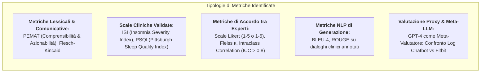

# A Scoping Review of Large Language Models in Personal Sleep Wellness (Mansoor, 2025)

## Definizione Operativa
- Rassegna sistematica di mappatura (*scoping review*) condotta da Hamid Mansoor (Department of Computer Science, University of Manitoba; DOI: [10.1016/j.mcpdig.2025.100301](https://doi.org/10.1016/j.mcpdig.2025.100301)), pubblicata su *Mayo Clinic Proceedings: Digital Health* (2025), che sintetizza ed esamina 21 studi empirici e metodologici (pubblicati tra gennaio 2020 e giugno 2025) conformi alle linee guida PRISMA-ScR sull'impiego dei Large Language Models ([[large-language-models|LLM]]) nella salute e nel benessere del sonno in ambito non clinico e quotidiano (*personal sleep wellness*).
- **Utilità Clinica e CBT:** Struttura per la prima volta la letteratura scientifica sull'intersezione tra IA generativa e medicina/igiene del sonno in 4 casi d'uso primari: (1) Psicoeducazione e risposta a quesiti generali; (2) Supporto a condizioni specifiche (Apnea Ostruttiva del Sonno - OSA, terapia con pressione positiva continua PAP e stimolazione del nervo ipoglosso HGNS); (3) Raccomandazioni personalizzate e coaching multimodale integrato con sensori indossabili (Fitbit, Oura, EEG); (4) Erogazione di interventi di Terapia Cognitivo-Comportamentale per l'Insonnia digitale ([[digital-cbt-i-conversational-agents|dCBT-I]]). Mappa inoltre le strategie di adattamento (LoRA, distillazione Chain-of-Thought, architetture a grafo e multi-agente) ed evidenzia i limiti metodologici della ricerca attuale (prevalenza di valutazioni basate su esperti o proxy, assenza di RCT longitudinali).

```mermaid
flowchart TD
    subgraph UseCases ["4 Casi d'Uso Principali (Mansoor, 2025)"]
        UC1["1. Educazione e Q&A sul Sonno<br/>(Kim et al., 2024; Bragazzi & Garbarino, 2024)"]
        UC2["2. Supporto a Condizioni Specifiche - OSA<br/>(Campbell et al., 2023; Pordzik et al., 2024; Mira et al., 2024)"]
        UC3["3. Raccomandazioni e Coaching Multimodale<br/>(PhysioLLM, PH-LLM, HealthGuru, Corda et al., 2024)"]
        UC4["4. CBT-I Digitale e Auto-Aiuto Guidato<br/>(ZzzMate, ChatGLM-LoRA, SleepCoT, Chan et al., 2024)"]
    end

    subgraph DataModalities ["Flussi e Fonti di Dati"]
        D1["Sensori Wearable & Fisiologia (Fitbit, Oura, EEG)"]
        D2["Dati Autoriferiti & EMA (PSQI, Diari del Sonno)"]
        D3["Dataset Sintetici & Benchmark (PH-LLM 857 casi, SleepCoT)"]
    end

    subgraph TechnicalStrategies ["Tecniche di Adattamento & Architetture"]
        T1["Proprietary LLMs (GPT-4o, Gemini) vs Open-Source (ChatGLM, Qwen, Llama 3)"]
        T2["Parameter-Efficient Tuning (LoRA 450 epoche)"]
        T3["CoT Distillation (GPT-4o -> Qwen2.5)"]
        T4["Graph-Augmented LLMs & Multi-Agent Bandit Selection"]
    end

    subgraph EvaluationMethods ["Framework di Valutazione"]
        E1["Expert Review & Consensus (Likert, Fleiss κ, PEMAT)"]
        E2["Pilot User Studies & RCTs (ISI, PSQI, aderenza)"]
        E3["Proxy & Meta-Evaluation (GPT-4 Evaluator, Log vs Sensor)"]
    end

    subgraph CriticalChallenges ["Sfide Aperte & Direzioni Future"]
        C1["Rischio Allucinazioni su Terapie Avanzate (HGNS)"]
        C2["Personalizzazione su Larga Scala & Privacy"]
        C3["Ragionamento Multimodale Temporale Disgiunto"]
        C4["Mancanza di RCT Longitudinali a Lungo Termine"]
    end

    DataModalities --> TechnicalStrategies
    TechnicalStrategies --> UseCases
    UseCases --> EvaluationMethods
    EvaluationMethods --> CriticalChallenges
```

---

## Evidenze dalla Letteratura

### 1. Metodologia di Rassegna (PRISMA-ScR)
- **Strategia di Ricerca:** Lo studio ha interrogato 4 banche dati accademiche (Scopus, Web of Science, PubMed, IEEE Xplore) coprendo il periodo 1 gennaio 2020 – 1 giugno 2025, integrando ricerche manuali delle bibliografie.
- **Processo di Selezione:** Dei 633 record identificati inizialmente (376 rimossi prima dello screening), 257 abstract sono stati esaminati e 63 report a testo completo sono stati valutati per l'eleggibilità, portando all'inclusione finale di **21 studi empirici e metodologici**.
- **Criteri di Inclusione ed Esclusione:** Inclusione focalizzata su sistemi LLM interattivi orientati all'utente comune e alla salute/benessere quotidiano del sonno (inclusa la psicoeducazione terapeutica per OSA, PAP e HGNS); esclusi i lavori puramente clinici, diagnostici ospedalieri, rivolti solo al personale sanitario o privi di interazione utente-centrica.
- **Trasparenza Metodologica:** Lo screening è stato condotto da un singolo revisore con registrazione sistematica dei motivi di esclusione in linea con le linee guida PRISMA-ScR per scoping review esplorative.

---

### 2. Analisi dei 4 Casi d'Uso Chiave

#### A. Educazione sul Sonno e Question Answering
- **Debunking dei Miti e Accuratezza:** Bragazzi e Garbarino (2024) hanno dimostrato che ChatGPT è in grado di sfatare efficacemente i miti più diffusi sul sonno, mostrando un'elevata concordanza con le valutazioni degli esperti (Intraclass Correlation Coefficient $ICC > 0.8$).
- **Confronto Specialistico e Supporto Emotivo:** Kim et al. (2024) hanno testato ChatGPT-4 su 140 quesiti comuni relativi ai disturbi del sonno a confronto con medici specialisti: sebbene gli esperti abbiano mostrato una lieve preferenza per le risposte dei colleghi umani (56%), gli utenti laici (*laypeople*) hanno valutato ChatGPT-4 significativamente superiore per chiarezza espositiva e tono di supporto emotivo.
- **Quesiti sull'Insonnia:** Alapati et al. (2024) hanno documentato un'elevata accuratezza clinica e flessibilità di ChatGPT nell'adattarsi sia a prompt orientati al paziente sia a prompt tecnici per medici, pur riscontrando una moderata affidabilità inter-rater e segnalando cautela sulla correttezza delle citazioni bibliografiche fornite.
- **Confronto Testa-a-Testa:** Cheong et al. (2024) hanno confrontato ChatGPT e Google Bard su 46 quesiti informativi sull'OSA, evidenziando la netta superiorità di ChatGPT per comprensibilità (90.8%) e azionabilità (73.04%) secondo il *Patient Education Materials Assessment Tool* (PEMAT) e l'indice Flesch-Kincaid, senza generare errori clinici pericolosi.

#### B. Supporto a Condizioni Specifiche (Apnea Ostruttiva del Sonno - OSA)
- **Spiegazione dei Trattamenti:** Campbell et al. (2023) hanno rilevato che le spiegazioni fornite da ChatGPT sulle terapie per l'OSA personalizzate con i dati del paziente erano preferite rispetto a risorse web statiche e allineate ai domini clinici.
- **FAQ su PAP e Stimolazione del Nervo Ipoglosso (HGNS):** Pordzik et al. (2024) hanno analizzato ChatGPT-4o su FAQ relative a ventilazione meccanica a pressione positiva (PAP) e stimolazione del nervo ipoglosso (HGNS). Il modello ha ottenuto un tasso di completezza dell'**88%** per la PAP nelle valutazioni degli esperti (Likert a 6 punti, indice di Fleiss $\kappa$), ma ha evidenziato cali prestazionali significativi sulle terapie HGNS più recenti, attribuibili alla scarsità di dati nel corpus di addestramento e ad ambiguità terminologiche sui dispositivi medici.
- **Consenso Diagnostico tra Esperti e Limiti di Consenso:** Mira et al. (2024) hanno condotto uno studio multinazionale coinvolgendo 350 otorinolaringoiatri e 10 super-esperti per valutare i suggerimenti diagnostici di ChatGPT-3.5 nell'OSA: sebbene la concordanza su singoli item superasse il 75%, il consenso unanime sull'intera risposta si è verificato solo in 4 casi su 10, e i super-esperti hanno assegnato punteggi significativamente inferiori al modello ($p = .0009$), sconsigliandone l'uso non supervisionato.
- **Sensibilizzazione e Auto-valutazione:** Bilal et al. (2024) hanno teorizzato il ruolo dei chatbot LLM nell'intercettare popolazioni non informate, guidandole all'auto-riconoscimento dei sintomi di OSA e all'invio tempestivo a consulti specialistici.

#### C. Raccomandazioni Personalizzate e Coaching Multimodale
- **PhysioLLM e Sensori Fisiologici:** Fang et al. (2024) hanno sviluppato *PhysioLLM*, che correla serie temporali di sensori Fitbit (efficienza del sonno, irrequietezza notturna, passi diurni) generando spiegazioni conversazionali contestuali; in un trial su 24 utenti, il sistema è risultato significativamente più azionabile ed efficace rispetto a LLM generici o app commerciali.
- **Graph-Augmented LLMs:** Subramanian et al. (2024) hanno implementato un framework potenziato da grafi di similarità intra- e inter-paziente e pesi di importanza delle feature fisiologiche (da anelli Oura), generando prompt arricchiti che migliorano drasticamente la personalizzazione senza richiedere il riaddestramento del modello per ogni nuovo utente.
- **PH-LLM (Personal Health Large Language Model):** Cosentino et al. (2024) hanno addestrato un modello basato su Gemini su 857 casi clinici longitudinali multimodali annotati da esperti (sonno, attività fisica, alimentazione, umore), raggiungendo performance vicine a quelle di clinici esperti nella generazione di raccomandazioni sul sonno.
- **HealthGuru e Teoria del Cambiamento Comportamentale:** Wang et al. (2025) hanno progettato *HealthGuru*, un'architettura multi-agente che impiega algoritmi *multi-armed bandit* per selezionare dinamicamente lo stile motivazionale più efficace (logico vs empatico-emotivo) sulla base dello storico delle interazioni e del feedback in tempo reale.
- **Previsione Predittiva e EMA:** Corda et al. (2024) hanno combinato modelli di machine learning predittivo del sonno con LLM per generare suggerimenti comportamentali interpretabili basati su sensori dello smartphone e questionari *Ecological Momentary Assessment* (EMA).
- **Discrepanza tra Sonno Soggettivo e Oggettivo:** Jang et al. (2023) hanno confrontato i log del sonno raccolti tramite chatbot con i dati oggettivi dei dispositivi Fitbit su oltre 500 utenti, rilevando marcate discrepanze individuali tra percezione soggettiva e durata misurata, dimostrando come la fusione dei due flussi sia indispensabile per calibrare i consigli.
- **Popolazioni Specifiche:** Ahmed et al. (2025) hanno testato Meta-Llama-3-Instruct con dati Fitbit e indici PSQI per migliorare sonno e performance accademica in studenti; Ajovalasit et al. (2024) hanno validato *NightCare Assistant* per il monitoraggio del sonno geriatrico con interfaccia vocale gradita dai caregiver.

#### D. CBT-I Digitale e Auto-Aiuto Guidato
- **ZzzMate e Consapevolezza Emotiva:** Tang et al. (2025) hanno sviluppato *ZzzMate* (basato su Qwen1.5), un chatbot per la dCBT-I che integra il riconoscimento delle emozioni autocoscienti (*self-conscious emotions*, quali colpa per la mancata igiene del sonno o orgoglio per il raggiungimento dei target) per stimolare l'auto-efficacia e consolidare le abitudini.
- **ChatGLM-LoRA per Interventi di Insonnia:** Chen et al. (2024) hanno addestrato ChatGLM tramite fine-tuning LoRA su 764 dialoghi clinici sul sonno (450 epoche, ottimizzatore AdamW); in un trial clinico di 1 settimana ($N=16$), oltre il 50% dei pazienti ha riportato miglioramenti misurabili della qualità del sonno.
- **Efficacia in Trial Randomizzato Controllato (RCT):** Chan et al. (2024) hanno condotto un RCT comparativo valutando un percorso di dCBT-I con e senza coaching via chatbot rispetto a coaching umano: il gruppo supportato dal chatbot ha mostrato miglioramenti significativi nei tassi di aderenza terapeutica e una riduzione clinicamente rilevante dell'Insomnia Severity Index (ISI).
- **SleepCoT e Distillazione CoT:** Zheng et al. (2024) hanno ideato *SleepCoT*, distillando le catene di ragionamento (*Chain-of-Thought*) da GPT-4o su modelli compatti Qwen2.5 addestrati su profili fisiologici sintetici con vincoli comportamentali, ottenendo coerenza logica, personalizzazione ed efficienza on-device.

---

### 3. Tabella Sinottica degli Studi Inclusi nella Rassegna

| Studio | Anno | Caso d'Uso | Design dello Studio | Metriche Primarie | Modalità Dati | Modello / Setup |
| :--- | :--- | :--- | :--- | :--- | :--- | :--- |
| **Ahmed et al.** | 2025 | Coaching personalizzato | Proof-of-concept | PSQI, performance accademica | Sensori + Self-report | Meta-Llama-3-Instruct |
| **Ajovalasit et al.** | 2024 | Coaching geriatrico | Studio survey | Usabilità/accettabilità caregiver | Self-report + Feedback | NightCare Assistant |
| **Alapati et al.** | 2024 | Educazione sonno | Expert review | Accuratezza, leggibilità, affidabilità | Testo | ChatGPT |
| **Bilal et al.** | 2024 | Supporto OSA | Concettuale | Consapevolezza, auto-diagnosi | N/A | ChatGPT |
| **Bragazzi & Garbarino** | 2024 | Educazione sonno | Expert review | Accuratezza, ICC (>0.8), leggibilità | Testo | ChatGPT |
| **Campbell et al.** | 2023 | Supporto OSA | Expert review | Accuratezza, personalizzazione | Prompt con self-report | ChatGPT-3.5 |
| **Chan et al.** | 2024 | CBT-I e self-help | RCT | ISI, aderenza terapeutica | Self-report | dCBT-I Chatbot Coach |
| **Chen et al.** | 2024 | CBT-I e self-help | Pilot study ($N=16$) | Engagement, aderenza, sonno | Self-report | ChatGLM + LoRA |
| **Cheong et al.** | 2024 | Educazione sonno | Expert review | PEMAT, leggibilità, azionabilità | Testo | ChatGPT vs Google Bard |
| **Corda et al.** | 2024 | Coaching personalizzato | Pilot user study | Fiducia, aderenza, engagement | Sensori smartphone + EMA | ML + LLM Pipeline |
| **Cosentino et al.** | 2024 | Coaching personalizzato | Dataset benchmark | Performance su 857 casi clinici | Dati sintetici + sensori | PH-LLM (Gemini) |
| **Fang et al.** | 2024 | Coaching personalizzato | User + Expert review | Azionabilità, chiarezza, personalizzazione | Sensori Fitbit | PhysioLLM |
| **Jang et al.** | 2023 | Coaching personalizzato | Studio comparativo ($N>500$) | Concordanza durata sonno soggettiva/oggettiva | Sensori Fitbit + Chat log | Chatbot Sleep Log |
| **Kim et al.** | 2024 | Educazione sonno | Expert + Lay ratings | Accuratezza, supporto emotivo, chiarezza | Testo (140 domande) | ChatGPT-4 vs Specialisti |
| **Mira et al.** | 2024 | Supporto OSA | Expert consensus (350 ORL) | Concordanza diagnostica con esperti | Testo | ChatGPT-3.5 |
| **Pordzik et al.** | 2024 | Supporto OSA/PAP/HGNS | Pilot + Expert review | Coerenza, completezza, Fleiss $\kappa$ | Testo | ChatGPT-4o |
| **Sano et al.** | 2024 | Integrazione multimodale | Esplorazione tecnica | Fattibilità, interpretabilità | EEG + Comportamento | LLM Multimodale |
| **Subramanian et al.** | 2024 | Coaching personalizzato | Meta-valutazione | Azionabilità, completezza | Sensori Oura + Grafi | Graph-Augmented LLM |
| **Tang et al.** | 2025 | CBT-I e self-help | Pilot study ($N=4$) | Engagement, emozioni autocoscienti | Self-report | ZzzMate (Qwen1.5) |
| **Wang et al.** | 2025 | Coaching comportamentale | Feedback utente | Aderenza, engagement | Self-report + Framework | HealthGuru (Multi-Agent) |
| **Zheng et al.** | 2024 | Educazione e coaching | Sviluppo modello | Coerenza logica, personalizzazione | Dati sintetici | SleepCoT (Distillato) |

---

### 4. Metriche di Valutazione e Strategie di Valutazione Proxy

- **Meta-Valutazione Automatica tramite LLM:** Subramanian et al. (2024) hanno impiegato GPT-4 come meta-valutatore per quantificare rilevanza, azionabilità e livello di personalizzazione dei consigli generati da altri modelli, evidenziando come prompt strutturati con grafi di similarità ricevano punteggi significativamente più alti.
- **Validazione tramite Sensori Indossabili:** Jang et al. (2023) hanno utilizzato i dati oggettivi Fitbit come termine di confronto per verificare l'accuratezza dei log del sonno raccolti conversazionalmente, scoprendo che la percezione qualitativa del riposo altera sistematicamente la stima soggettiva del tempo trascorso a letto.

---

### 5. Sfide Aperte, Limiti della Ricerca e Direzioni Future

1. **Rischio di Allucinazioni e Lacune nelle Terapie Complesse:**
   - Sebbene i modelli generino risposte fluide e rassicuranti, emergono allucinazioni cliniche e omissioni su trattamenti specialistici o di recente approvazione (es. HGNS, Pordzik et al., 2024), con rischi di disinformazione dell'utente privo di supervisione clinica.
2. **Personalizzazione su Larga Scala e Integrazione Multimodale:**
   - I framework standard RAG e fine-tuning faticano a integrare serie temporali fisiologiche eterogenee e disgiunte nel tempo (es. livello di attività diurna con pattern EEG o ipnogrammi notturni). Soluzioni basate su grafi di similarità (Subramanian et al., 2024) e benchmark curati (Cosentino et al., 2024) indicano la via per scalare la personalizzazione preservando la riservatezza dei dati biometrici.
3. **Fragilità Metodologica e Assenza di RCT a Lungo Termine:**
   - La quasi totalità degli studi si basa su test pilota di breve durata (1-2 settimane), valutazioni qualitative di panel di esperti o proxy computazionali. Risulta indispensabile condurre RCT longitudinali multicentrici della durata di diversi mesi, impiegando popolazioni eterogenee (anziani, adolescenti, lavoratori turnisti, soggetti con comorbidità psichiatriche) per misurare la sostenibilità del cambiamento comportamentale e gli esiti clinici oggettivi.

---

## Riferimenti Bibliografici
- Mansoor, H. (2025). A Scoping Review of Large Language Models in Personal Sleep Wellness. *Mayo Clinic Proceedings: Digital Health*, 3(4), 100301. https://doi.org/10.1016/j.mcpdig.2025.100301
- Ahmed, A., Aziz, S., Abd-Alrazaq, A., AlSaad, R., & Sheikh, J. (2025). Leveraging LLMs and wearables to provide personalized recommendations for enhancing student well-being and academic performance through a proof of concept. *Scientific Reports*, 15(1), 4591. https://doi.org/10.1038/s41598-025-89386-2
- Ajovalasit, M., Attori, I., Caon, M., et al. (2024). Caregiver acceptability of an LLM-powered assistant interface to improve sleep quality of the elderly. In H. Plácido da Silva & P. Cipresso (Eds.), *International Conference on Computer-Human Interaction Research and Applications* (pp. 323–338). Springer Nature.
- Alapati, R., Campbell, D., Molin, N., et al. (2024). Evaluating insomnia queries from an artificial intelligence chatbot for patient education. *Journal of Clinical Sleep Medicine*, 20(4), 583–594. https://doi.org/10.5664/jcsm.10948
- Bilal, M., Jamil, Y., Rana, D., & Shah, H. H. (2024). Enhancing awareness and self-diagnosis of obstructive sleep apnea using AI-powered chatbots: the role of ChatGPT in revolutionizing healthcare. *Annals of Biomedical Engineering*, 52(2), 136–138. https://doi.org/10.1007/s10439-023-03298-8
- Bragazzi, N. L., & Garbarino, S. (2024). Assessing the accuracy of generative conversational artificial intelligence in debunking sleep health myths: mixed methods comparative study with expert analysis. *JMIR Formative Research*, 8(1), e55762. https://doi.org/10.2196/55762
- Campbell, D. J., Estephan, L. E., Mastrolonardo, E. V., Amin, D. R., Huntley, C. T., & Boon, M. S. (2023). Evaluating chatGPT responses on obstructive sleep apnea for patient education. *Journal of Clinical Sleep Medicine*, 19(12), 1989–1995. https://doi.org/10.5664/jcsm.10728
- Chan, W. S., Cheng, W. Y., Lok, S. H. C., et al. (2024). Assessing the short-term efficacy of digital cognitive behavioral therapy for insomnia with different types of coaching: randomized controlled comparative trial. *JMIR Mental Health*, 11(1), e51716. https://doi.org/10.2196/51716
- Chen, Y., Pan, S., Xia, Y., et al. (2024). A conversational application for insomnia treatment: leveraging the ChatGLM-LoRA model for cognitive behavioral therapy. In *2024 IEEE International Conference on Cybernetics and Intelligent Systems (CIS) and IEEE International Conference on Robotics, Automation and Mechatronics (RAM)* (pp. 360–367). IEEE.
- Cheong, R. C. T., Unadkat, S., Mcneillis, V., et al. (2024). Artificial intelligence chatbots as sources of patient education material for obstructive sleep apnoea: ChatGPT versus google bard. *European Archives of Oto-Rhino-Laryngology*, 281(2), 985–993. https://doi.org/10.1007/s00405-023-08319-9
- Corda, E., Massa, S. M., & Riboni, D. (2024). Context-aware behavioral tips to improve sleep quality via machine learning and large language models. *Future Internet*, 16(2), 46. https://doi.org/10.3390/fi16020046
- Cosentino, J., Belyaeva, A., Liu, X., et al. (2024). Towards a personal health large language model. *arXiv preprint arXiv:2406.06474*. https://doi.org/10.48550/arXiv.2406.06474
- Fang, C. M., Danry, V., Whitmore, N., et al. (2024). Physiollm: supporting personalized health insights with wearables and large language models. *arXiv preprint arXiv:2406.19283*. https://doi.org/10.48550/arXiv.2406.19283
- Jang, H., Lee, S., Son, Y., et al. (2023). Exploring variations in sleep perception: Comparative study of ChatBot sleep logs and Fitbit sleep data. *JMIR mHealth and uHealth*, 11(1), e49144. https://doi.org/10.2196/49144
- Kim, J., Lee, S. Y., Kim, J. H., et al. (2024). Chatgpt vs. sleep disorder specialist responses to common sleep queries: Ratings by experts and laypeople. *Sleep Health*, 10(6), 665–670. https://doi.org/10.1016/j.sleh.2024.08.011
- Mira, F. A., Favier, V., Dos Santos Sobreira Nunes, H., et al. (2024). Chat GPT for the management of obstructive sleep apnea: do we have a polar star? *European Archives of Oto-Rhino-Laryngology*, 281(4), 2087–2093. https://doi.org/10.1007/s00405-023-08270-9
- Pordzik, J., Bahr-Hamm, K., Huppertz, T., et al. (2024). Patient support in obstructive sleep apnoea by a large language model—ChatGPT4 on answering frequently asked questions on first line positive airway pressure and second line hypoglossal nerve stimulation therapy: a pilot study. *Nature and Science of Sleep*, 16, 2269–2277. https://doi.org/10.2147/NSS.S495654
- Sano, A., Amores, J., & Czerwinski, M. (2024). Exploration of LLMs, EEG, and behavioral data to measure and support attention and sleep. *arXiv preprint arXiv:2408.07822*. https://doi.org/10.48550/arXiv.2408.07822
- Subramanian, A., Yang, Z., Azimi, I., & Rahmani, A. M. (2024). Graph-augmented LLMs for personalized health insights: a case study in sleep analysis. In *Proceedings of the 2024 IEEE 20th International Conference on Body Sensor Networks (BSN)* (pp. 1–4). IEEE.
- Tang, X., Li, Z., Sun, X., Xu, X., & Zhang, M. L. (2025). Zzzmate: a self-conscious emotion-aware Chatbot for sleep intervention. In N. Yamashita, V. Evers, K. Yatani, & X. Ding (Eds.), *Proceedings of the Extended Abstracts of the CHI Conference on Human Factors in Computing Systems* (pp. 1–7). ACM.
- Wang, X., Griffith, J., Adler, D. A., Castillo, J., Choudhury, T., & Wang, F. (2025). Exploring personalized health support through data-driven, theory-guided LLMs: a case study in sleep health. In *Proceedings of the 2025 CHI Conference on Human Factors in Computing Systems* (pp. 1–15). ACM.
- Zheng, H., Xing, X., & Xu, X. (2024). SleepCoT: a lightweight personalized sleep health model via chain-of-thought distillation. *arXiv preprint arXiv:2410.16924*. https://doi.org/10.48550/arXiv.2410.16924

## Relazioni
- Vedi anche: [[personal-sleep-wellness-llm]], [[digital-cbt-i-conversational-agents]], [[wearable-sensor-fusion-adherence]], [[cbt-dialogue-systems-and-tools]], [[conceptual-architecture-of-ai-guided-cbt]], [[ai-supported-between-session-engagement]], [[routine-coach-vs-on-demand-assistant]], [[large-language-models]], [[five-domain-chatbot-validation-framework]]
