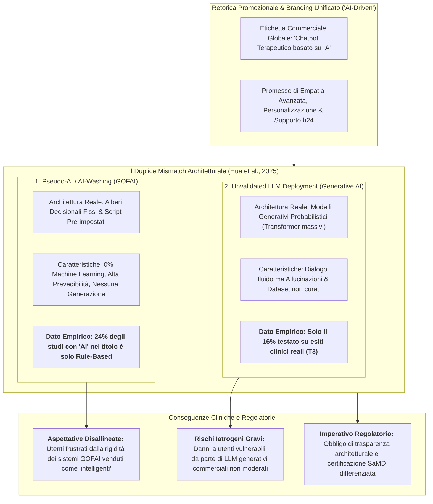

---
tags: [marketing-architecture-mismatch, ai-washing, terminological-ambiguity, gofai-vs-connectionism, clinical-ai-safety, regulatory-transparency, commercial-chatbots, mental-health-apps]
source_papers: ["WPS-24-383.pdf"]
---

# Marketing-Architecture Mismatch in Mental Health AI (Discrepanza tra Retorica Commerciale e Architettura Algoritmica)

## Definizione Operativa
- Il **Marketing-Architecture Mismatch in Mental Health AI** (Discrepanza tra Retorica Promozionale e Architettura Computazionale Reale) è un fenomeno critico ed epistemologico evidenziato da Hua, Siddals, Torous et al. (*World Psychiatry*, 2025; 24(3): 383–394; doi: [10.1002/wps.21352](https://doi.org/10.1002/wps.21352)) che descrive la sistematica incongruenza tra come gli agenti conversazionali per la salute mentale vengono presentati sul mercato o nella letteratura (*“AI-driven”*, *“terapeuta basato su intelligenza artificiale”*, *“LLM-powered”*) e l'effettivo motore computazionale che genera le risposte.
- **La Doppia Distorsione Sistemica:**
  1. **"AI-Washing" dei Sistemi Deterministici (GOFAI):** L'attribuzione dell'etichetta "Intelligenza Artificiale" a semplici script cablati (*rule-based systems*) e alberi decisionali deterministici privi di qualsiasi apprendimento statistico dai dati (*machine learning*) o capacità generativa. Nello studio di Hua et al. (2025), ben il **24% degli studi scientifici con il termine "AI" nel titolo utilizzava in realtà architetture puramente basate su regole statiche**.
  2. **Sovraestensione e Deployment Prematuro di LLM Non Validati:** L'immissione sul mercato di modelli linguistici generativi commerciali avanzati (GPT-4, Claude, Gemini, LLaMA) promossi come surrogati empatici o clinici sulla base di benchmark linguistici astratti (es. superamento di esami medici o simulazioni di empatia in laboratorio), quando in realtà **solo il 16% degli studi su LLM è stato sottoposto a trial di efficacia clinica (T3)** e i modelli presentano gravi rischi di allucinazione, violazione della privacy e risposte non conformi ai protocolli di crisi.
- **Utilità Clinica e Deontologica:** Permette a psicoterapeuti, psichiatri e comitati etici di demistificare l'*"illusione di intelligenza"* (*AI illusion*). Consente di distinguere tra strumenti digitali protocollari sicuri (in cui la rigidità deterministica è una scelta deliberata di sicurezza per evitare danni iatrogeni) e sistemi generativi probabilistici ad alto rischio che necessitano di vigilanza clinica e certificazione medica formale.

---

## Evidenze dalla Letteratura

### 1. La Fenomenologia dell'AI-Washing nella Ricerca e nel Mercato
- **Uso Ambiguo del Termine "AI":** Storicamente, il concetto di Intelligenza Artificiale ha abbracciato sia la *Good Old-Fashioned Artificial Intelligence (GOFAI)* basata su logica simbolica e regole esplicite (Weizenbaum, 1966; Boden, 2014), sia il moderno paradigma connessionista e probabilistico basato su reti neurali profonde (LeCun et al., 2015; Vaswani et al., 2017).
- **Evidenza Empirica Quantitativa (Hua et al., 2025):**
  - Su 160 studi esaminati, 139 (87%) non contenevano "AI" nel titolo, descrivendo puntualmente il sistema come "conversational agent", "rule-based chatbot" o "mobile intervention".
  - Dei 21 studi (13%) che hanno inserito esplicitamente "AI" nel titolo:
    - Il **57%** impiegava effettivamente Large Language Models;
    - Il **19%** impiegava algoritmi di machine learning classico (SVM, BERT per classificazione);
    - Ben il **24% impiegava sistemi basati su regole deterministiche**, privi di qualsiasi componente di apprendimento o inferenza da dati.
- **Strategie Commerciali di App Diffuse:** Piattaforme storiche come Woebot e Wysa hanno a lungo promosso i propri servizi definendoli "AI", pur basandosi originariamente su alberi di decisione scritti da clinici (*expert-crafted decision trees*) con componenti di NLP limitate al riconoscimento di intenti tramite keyword o semplici classificatori. Sebbene tale scelta fosse metodologicamente appropriata per garantire la sicurezza del paziente ed evitare allucinazioni (Darcy, 2023), l'etichettatura come "IA" ha alimentato aspettative errate da parte di utenti e clinici.

---

### 2. GOFAI vs Connessionismo: La Sicurezza della Rigidità vs il Rischio della Fluidità
La discrepanza tra marketing e architettura cela un profondo trade-off clinico-ingegneristico:

| Dimensione | Sistemi Rule-Based (GOFAI / Scripted) | Sistemi LLM Generativi (Connectionist / Deep Learning) |
| :--- | :--- | :--- |
| **Generazione Linguistica** | Frasi predefinite scritte da clinici, selezione da menu o pattern matching | Generazione probabilistica parola per parola in linguaggio naturale libero |
| **Prevedibilità dell'Output** | **100% Deterministico** (nessun rischio di generare consigli non approvati) | **Stocastico / Probabilistico** (rischio di allucinazioni e risposte imprevedibili) |
| **Gestione delle Crisi Suicidarie** | Attivazione immediata e garantita di schermate e numeri di emergenza | Rischio di bypass (*jailbreak*), minimizzazione o incoraggiamento involontario |
| **Adattabilità al Contesto** | Estremamente rigida; incapace di gestire input complessi fuori copione | Altamente fluida e contestuale; eccellente coerenza multi-turn |
| **Validazione Clinica (T3)** | **65% di tutti i trial clinici pubblicati** (PHQ-9, GAD-7) | **Solo il 16% sottoposto a trial clinico reale** (77% bloccato in test T1) |

- **Il Falso Mito della Superiorità Generativa:** La fluidità conversazionale degli LLM viene frequentemente scambiata dal pubblico e dagli sviluppatori non clinici per "comprensione empatica". Tuttavia, in contesti clinici strutturati (es. psicoeducazione per l'ADHD, monitoraggio dell'umore, diari del sonno), i sistemi deterministici controllati offrono garanzie di affidabilità e aderenza alle linee guida che i modelli generativi non possono assicurare.

---

### 3. Rischi Clinici ed Etici del Deployment Prematuro di LLM Commerciali
Quando le aziende immettono sul mercato modelli generativi non moderati presentandoli come assistenti di benessere mentale senza una rigorosa validazione T3, emergono gravi rischi per la salute pubblica:
1. **Consigli Non Validati da Dataset Non Curati:** A differenza delle app terapeutiche basate su manuali clinici validati, gli LLM commerciali si basano su corpora web eterogenei contenenti disinformazione, credenze pseudoscientifiche e stereotipi stigmatizzanti (Hua et al., 2025; Lawrence et al., 2024).
2. **Autorivelazione Incontrollata (*Privacy Leakage*):** L'elevata naturalezza del dialogo induce negli utenti uno stato di confidenza e disinibizione (*deep self-disclosure*), spingendoli a condividere traumi infantili, abusi o condotte illecite su server commerciali non protetti da normative sanitarie (Nong & Ji, 2025).
3. **Fallimento dei Protocolli di Sicurezza e Azioni Legali:** Il contrasto tra proclami commerciali e realtà clinica ha portato a gravi ripercussioni:
   - *Caso Replika (2023-2024):* Generazione di risposte inappropriate, incoraggiamento di dinamiche di dipendenza affettiva e fallimenti nella gestione di utenti con ideazione suicidaria (Roose, 2024; Blease & Torous, 2023).
   - *Diffida APA alla FTC (20 Dicembre 2024):* L'American Psychological Association ha presentato un esposto formale alla Federal Trade Commission statunitense denunciando le pratiche ingannevoli e i pericoli derivanti dal deployment non regolamentato e ingannevole di tecnologie di IA generativa rivolte a minori e popolazioni vulnerabili (Evans, 2024).

---

### 4. Proposte per la Trasparenza Architetturale e la Regolazione
Per risolvere il *marketing-architecture mismatch*, la comunità scientifica e gli organi regolatori (Hua et al., 2025; Rajpurkar & Topol, 2025) propongono:
- **Obbligo di Dichiarazione Architetturale Trasparente:** Imporre agli sviluppatori di app sanitarie e agli autori di studi accademici di specificare chiaramente se l'applicazione impiega:
  - (a) *Script deterministici guidati da regole*;
  - (b) *Classificatori di Machine Learning su dati strutturati*;
  - (c) *Modelli di linguaggio generativi probabilistici (LLM)*, indicando modello base, dataset di fine-tuning e guardrail attivi.
- **Etichettatura Informativa per gli Utenti (*Nutrition Labels for Health AI*):** Chiarire all'utente prima dell'uso se sta interagendo con un percorso strutturato predefinito o con un agente generativo che può commettere errori fattuali.
- **Certificazione Basata sull'Architettura:** I sistemi generativi che generano testo libero devono soddisfare requisiti di trial clinico (T3) e audit di sicurezza molto più stringenti rispetto ai sistemi a moduli deterministici chiusi.

---

## Riferimenti Bibliografici
- Hua, Y., Siddals, S., Ma, Z., Galatzer-Levy, I., Xia, W., Hau, C., Na, H., Flathers, M., Linardon, J., Ayubcha, C., & Torous, J. (2025). Charting the evolution of artificial intelligence mental health chatbots from rule-based systems to large language models: a systematic review. *World Psychiatry*, 24(3), 383–394. https://doi.org/10.1002/wps.21352
- Boden, M. A. (2014). GOFAI. In K. Frankish & W. M. Ramsey (Eds.), *The Cambridge Handbook of Artificial Intelligence* (pp. 89–107). Cambridge University Press.
- Darcy, A. (2023). Why generative AI is not yet ready for mental healthcare. *Woebot Health Whitepaper*.
- Evans, A. C. (2024). *Letter to the Federal Trade Commission regarding concerns about the perils and unintended consequences to the public resulting from the underregulated development and deceptive deployment of generative AI*. American Psychological Association.
- Lawrence, H. R., Schneider, R. A., Rubin, S. B., et al. (2024). The opportunities and risks of large language models in mental health. *JMIR Mental Health*, 11, e59479. https://doi.org/10.2196/59479
- Nong, P., & Ji, M. (2025). Expectations of healthcare AI and the role of trust: understanding patient views on how AI will impact cost, access, and patient-provider relationships. *Journal of the American Medical Informatics Association*, 32(4), 795–799. https://doi.org/10.1093/jamia/ocae324
- Rajpurkar, P., & Topol, E. J. (2025). A clinical certification pathway for generalist medical AI systems. *The Lancet*, 405(10472), 20–22. https://doi.org/10.1016/S0140-6736(24)02551-7
- Roose, K. (2024). Can A.I. be blamed for a teen’s suicide? *The New York Times*, October 23, 2024.
- Wang, P. (2019). On defining artificial intelligence. *Journal of Artificial General Intelligence*, 10(2), 1–37. https://doi.org/10.2478/jagi-2019-0002
- Weizenbaum, J. (1966). ELIZA—a computer program for the study of natural language communication between man and machine. *Communications of the ACM*, 9(1), 36–45.

---

## Relazioni
- Concetti correlati:
  - [[three-tier-evaluation-framework-mental-health-ai]] (Il framework traslazionale T1-T2-T3 per la validazione dei chatbot)
  - [[validation-gap-in-mental-health-llms]] (Il divario di validazione clinica basato su esiti proxy)
  - [[clinical-readiness-gap-in-mh-chatbots]] (Il divario di prontezza clinica nei chatbot di salute mentale)
  - [[safety-mechanisms-ai-chatbots]] (Meccanismi di sicurezza, guardrail e moderazione attiva nei chatbot)
  - [[emotional-infrastructure]] (L'IA come infrastruttura emotiva e rischio di stampella digitale)
  - [[artificial-intimacy]] (Attaccamento parasociale e illusione relazionale con agenti sintetici)
  - [[demarcazione-wellness-vs-samd-salute-mentale]] (Distinzione regolatoria tra app di benessere e dispositivi medici)
- Sintesi di riferimento:
  - [[wps-24-383]] (Hua et al., 2025: Revisione sistematica sull'evoluzione dei chatbot per la salute mentale)
  - [[behavsci-16-00676]] (Neacșu, 2026: Opportunità e rischi clinici dell'IA in psicoterapia)
  - [[health-advisory-ai-chatbots-wellness-apps-mental-health]] (Linee guida di safety per chatbot e app di salute mentale)