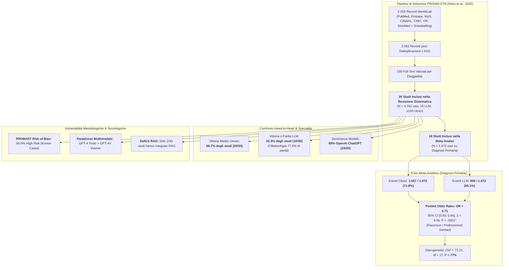
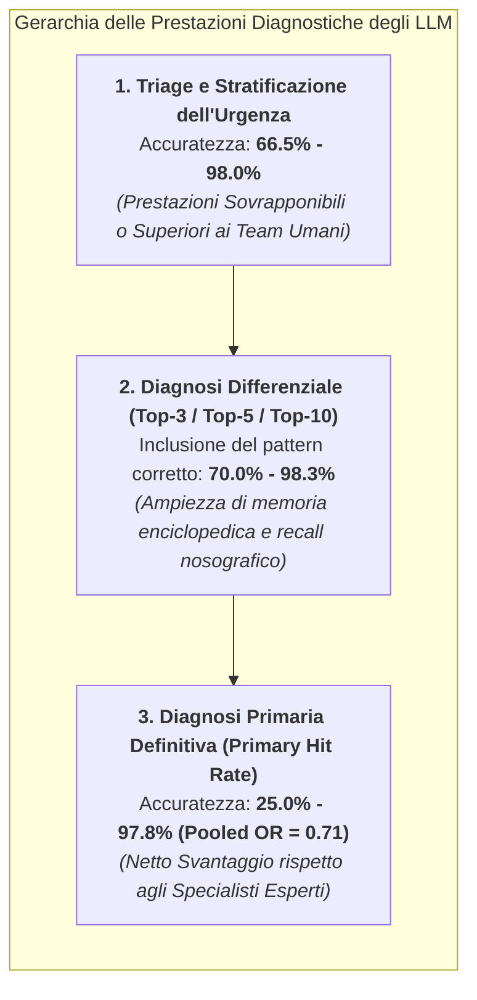
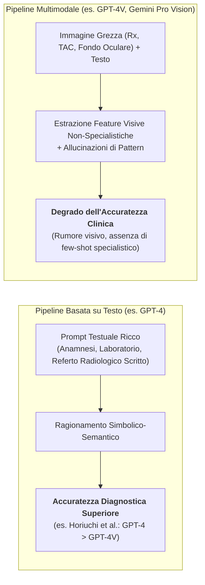
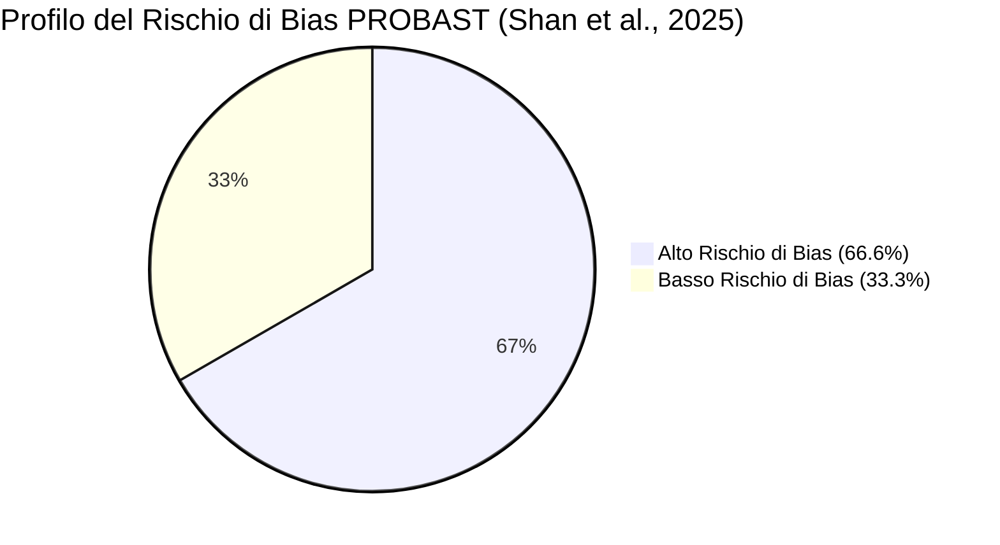
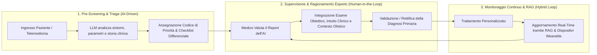

# Comparing Diagnostic Accuracy of Clinical Professionals and Large Language Models: Systematic Review and Meta-Analysis (Shan et al., 2025)

## Definizione Operativa e Sintesi Esecutiva
- **Prima revisione sistematica e meta-analisi globale PRISMA-DTA** che confronta direttamente l'accuratezza diagnostica clinica e le capacità di triage dei Large Language Models (LLM) rispetto a medici e professionisti sanitari umani, condotta da Guxue Shan, Xiaonan Chen, Chen Wang, Li Liu, Yuanjing Gu, Huiping Jiang e Tingqi Shi (*Nanjing Drum Tower Hospital, Nanjing University of Chinese Medicine* e *Nanjing University*, Cina), pubblicata su *JMIR Medical Informatics* (2025; 13:e64963; DOI: [10.2196/64963](https://doi.org/10.2196/64963)).
- **Corpus Esaminato e Dati Sintetizzati:**
  - *Revisione Sistematica:* **30 studi comparativi primari** ($N = 4.762$ casi clinici complessivi, 19 LLM analizzati, oltre 193 clinici umani di controllo dai medici specializzandi a esperti con oltre 30 anni di esperienza) pubblicati tra il 2017 e l'inizio del 2025 (12 nel 2023, 16 nel 2024, 2 nel 2025), estratti da 7 banche dati internazionali e cinesi (PubMed, Embase, Web of Science, CINAHL, CNKI, VIP, SinoMed) su un totale di 2.503 record iniziali.
  - *Meta-Analisi Quantitativa:* **18 studi** focalizzati specificamente sull'accuratezza della diagnosi primaria (*primary diagnosis accuracy*, $N = 1.472$ casi), sintetizzati tramite modello a effetti fissi di Mantel-Haenszel.
- **Risultati Quantitativi Cardine:**
  - *Meta-Analisi dell'Accuratezza Diagnostica Primaria:* I professionisti clinici umani superano in modo statisticamente significativo i modelli LLM: **Odds Ratio pooled $\text{OR} = 0.71$** ($95\%\text{ CI } [0.60, 0.84]$, $Z = 4.06, P < .0001$).
  - *Eventi Diagnostici Corretti Totali:* I clinici hanno formulato la diagnosi corretta nel **$71.8\%$** dei casi ($1.057/1.472$) contro il **$65.1\%$** degli LLM ($959/1.472$).
  - *Eterogeneità:* Elevata eterogeneità complessiva tra gli studi ($\chi^2 = 73.22, df = 17, P < .00001, I^2 = 77\%$), che si riduce nelle analisi per sottogruppo in oftalmologia pur confermando il vantaggio dei clinici specialisti.
  - *Range di Accuratezza Diagnostica Primaria:* Per il modello ottimale, l'accuratezza diagnostica primaria varia dal **$25.0\%$ al $97.8\%$** (con soglia clinica di accettabilità convenzionale fissata all'$80\%$).
  - *Range di Accuratezza di Triage:* Le prestazioni di triage clinico dei modelli spaziano dal **$66.5\%$ al $98.0\%$**, dimostrando notevole robustezza nell'assegnazione dei livelli di urgenza in pronto soccorso.
  - *Confronto Diretto Head-to-Head (30 studi):* Nel **$66.7\%$ degli studi** ($20/30$), i medici hanno mostrato un'accuratezza superiore ai modelli; nel **$33.3\%$ degli studi** ($10/30$), gli LLM (nello specifico ChatGPT/GPT-4) hanno raggiunto o superato l'accuratezza dei medici di controllo.
- **Dominanza dei Modelli e Modalità Operative:**
  - Nel **$85\%$ degli studi comparativi** ($24/30$), i modelli della famiglia **OpenAI (ChatGPT / GPT-3.5, GPT-4, GPT-4o, GPT-4V)** hanno ottenuto le prestazioni diagnostiche migliori. Solo 6 studi hanno visto primeggiare modelli non-GPT (Claude-2.0, Claude 3 Opus, Claude 3.5 Sonnet, Google Bard, Microsoft Bing, ERNIE 4.0).
  - L'**$80\%$ degli studi** ($24/30$) ha utilizzato gli LLM tramite interfaccia web ufficiale pubblica, dimostrando un'elevata accessibilità ma sollevando questioni di riproducibilità e versioning.
  - Solo **2 studi** su 30 hanno impiegato architetture con [[rag-in-psicoterapia|Retrieval-Augmented Generation (RAG)]], evidenziando un grave deficit nell'integrazione di basi di conoscenza cliniche esterne verificate.
- **Il Paradosso Multimodale:** L'integrazione di immagini cliniche/radiologiche nei prompt (es. GPT-4V) **non ha migliorato** l'accuratezza diagnostica rispetto al solo testo, risultando talvolta controproducente (es. Horiuchi et al., 2025; Suh et al., 2024), a causa dell'assenza di fine-tuning visivo specialistico e della suscettibilità al rumore delle immagini generiche.
- **Valutazione del Rischio di Bias (PROBAST):** Il **$66.6\%$ degli studi** ($20/30$) presenta un **alto rischio di bias** secondo il framework PROBAST (*Prediction Model Risk of Bias Assessment Tool*), dovuto principalmente alla natura retrospettiva su casi già diagnosticati (*known case diagnosis*), campioni ridotti ($<50$ casi in 14 studi) e mancata trasparenza sui dati di pre-addestramento proprietari (*black-box problem*).



---

## Analisi Comparativa dell'Accuratezza per Disciplina Clinica

La meta-analisi di Shan et al. (2025) evidenzia una marcata eterogeneità di performance tra i diversi ambiti specialistici della medicina:

| Disciplina Clinica | Studi Chiave Inclusi | Dimensione Campionaria | Modello LLM Ottimale | Performance LLM vs Medico | Livello di Accordo / Note Cliniche |
| :--- | :--- | :--- | :--- | :--- | :--- |
| **Oftalmologia** | Zhang et al. (2024), Lyons et al. (2024), Shemer et al. (2024), Rojas-Carabali et al. (2023), Delsoz et al. (2023, 2024), Ming et al. (2024), Liu et al. (2023) | 9 studi ($N = 1.488$ casi totali) | GPT-4 / GPT-4o / GPT-3.5 | **Parità nel 77.8% dei casi:**<br/>- Triage: $98.0\%$ vs $86.0\%$ (Lyons)<br/>- Diagnosi primaria: $85\%$ vs $96.7\%$ (Delsoz); $59.6\%$ vs $60.6\%$ (Ming) | Area con le migliori performance complessive; forte convergenza diagnostica su descrizioni testuali di lesioni corneali, glaucoma e uveite. |
| **Medicina Interna (GIM)** | Hirosawa et al. (2023a, 2023b, 2023c), Mitsuyama et al. (2024), Nakaura et al. (2024), Li et al. (2024) | 6 studi ($N = 644$ casi) | GPT-4 / Bard / Claude 3.5 Sonnet | **Vantaggio Umano:**<br/>- Diagnosi primaria: $60\%$ vs $50\%$ (Hirosawa 2023a); $40.2\%$ vs $64.6\%$ (Bard); $53.3\%$ vs $93.3\%$ (Hirosawa 2023c); $54\%$ vs $100\%$ (Nakaura) | I medici internisti mantengono un netto vantaggio nella diagnosi primaria; gli LLM recuperano terreno se valutati sull'inclusione nella Top-5/Top-10 differenziale ($83.3\%$ vs $98.3\%$). |
| **Pronto Soccorso e Triage (ED)** | Paslı et al. (2024), Fraser et al. (2023), Arslan et al. (2025) | 3 studi ($N = 1.266$ casi) | GPT-4 / Copilot Pro | **Alta Accuratezza di Triage:**<br/>- Triage Paslı: $95.6\%$ vs $92.8\%$ (vs ED team)<br/>- Triage Arslan: $66.5\%$ vs $65.2\%$ (vs infermieri triage)<br/>- Diagnosi Fraser: $40\%$ vs $47\%$ | GPT-4 dimostra capacità di triage paragonabili o lievemente superiori ai team di emergenza, ma precisione diagnostica etiologica inferiore. |
| **Medicina Generale / Casi Complessi** | Sarangi et al. (2023), Suh et al. (2024), Ito et al. (2023) | 3 studi ($N = 355$ casi) | GPT-4 / GPT-4V / Bard / Bing | **Prestazioni Miste:**<br/>- Ito et al.: $97.8\%$ vs $91.1\%$ (GPT-4 vs clinici)<br/>- Sarangi: $53.3\%$ vs $60.4\%$<br/>- Suh: $48.9\%$ vs $60.5\%$ | Variazioni estreme dipendenti dalla complessità della vignetta clinica e dalla presenza di bias razziali/demografici nei prompt (es. studio di Ito et al.). |
| **Ortopedia e Traumatologia** | Horiuchi et al. (2025), Mohammadi et al. (2024) | 2 studi ($N = 217$ casi) | GPT-4 / GPT-4o / GPT-4V | **Vantaggio Umano/Parità:**<br/>- Horiuchi: $43\%$ vs $47\%$ (primaria); $58\%$ vs $62.5\%$ (Top-3)<br/>- Mohammadi (fratture tibiali): AUC $0.73$ vs $0.74$ | Su compiti radiologici ortopedici complessi, i radiologi umani mantengono il primato; l'aggiunta di immagini non ha superato i referti testuali. |
| **Cardiotoracica e Pneumologia** | Kaya et al. (2024), Gunes et al. (2024) | 2 studi ($N = 520$ casi) | GPT-4 / Claude 3 Opus | **Risultati Discordanti:**<br/>- Kaya (miocardite RMN): $81\%$ vs $91.3\%$ ($F_1 = 85\%$ vs $92.7\%$ per radiologi)<br/>- Gunes (toracica): $70.3\%$ vs $46.8\%$ (LLM supera radiologi generali) | Notevole discrepanza basata sul livello di iperspecializzazione del gruppo umano di controllo (radiologi generali vs specialisti cardiovascolari). |
| **Otorinolaringoiatria (ORL)** | Makhoul et al. (2024) | 1 studio ($N = 32$ casi, 20 clinici) | GPT-3.5 | **Parità Differenziale:**<br/>- Top-3 differenziale: $70.8\%$ vs $71.3\%$ (vs specialisti ORL e MMG) | ChatGPT ha dimostrato capacità di diagnosi differenziale sovrapponibili a specialisti e medici di famiglia. |
| **Immunologia e Malattie Rare** | Pillai et al. (2023) | 1 studio ($N = 40$ casi) | GPT-4 / GPT-3.5 / LLaMA 2 | **Vantaggio Internista:**<br/>- Diagnosi primaria: $25\%$ vs $47.5\%$<br/>- Top-5 differenziale: $45\%$ vs $60\%$ | Su patologie rare autoimmuni (FMF, DIRA), il ragionamento clinico umano supera marcatamente l'AI. |
| **Neonatologia e Pediatria** | Levin et al. (2024) | 1 studio ($N = 6$ casi complessi, 32 infermieri) | GPT-4 / Claude-2.0 | **Superiorità Specialistica Umana:**<br/>- Triage/accuratezza: $70.8\%$ vs $82.5\%$ | Gli infermieri specialisti neonatali superano GPT-4 e Claude nella gestione delle emergenze neonatali. |
| **Endocrinologia (Tiroide)** | Wang et al. (2024) | 1 studio ($N = 109$ casi ecografici, 40 medici) | GPT-4 (*ThyroAIGuide*) | **Superiorità Endocrinologi:**<br/>- Accuratezza: $73.6\%$ vs $87.4\%$ | Piattaforma personalizzata con Chain-of-Thought; pur migliorando la spiegabilità, resta inferiore all'occhio clinico umano. |
| **Dermatologia** | Stoneham et al. (2023) | 1 studio ($N = 36$ casi) | GPT-4 | **Superiorità Dermatologo:**<br/>- Diagnosi primaria: $56\%$ vs $83\%$ | Il clinico umano mantiene un distacco di 27 punti percentuali nella diagnosi morfologica cutanea. |

---

## Analisi del Forest Plot della Meta-Analisi

La meta-analisi quantitativa condotta su **18 studi** ($N = 1.472$ casi con outcome dicotomico di correttezza diagnostica primaria) ha prodotto un **Odds Ratio combinato di $\text{OR} = 0.71$** ($95\%\text{ CI } [0.60, 0.84], P < .0001$). 

```
Studio o Sottogruppo        Eventi LLM   Eventi Clinici   Peso (%)   Odds Ratio [95% CI] (M-H, Fissi)
----------------------------------------------------------------------------------------------------
Delsoz et al. 2023               17/20            19/20       0.8%   0.30 [0.03, 3.15]
Delsoz et al. 2024                 8/11              7/11       0.6%   1.52 [0.25, 9.29]
Fraser et al. 2023               16/40            19/40       3.4%   0.74 [0.30, 1.79]
Gunes et al. 2024                87/124           58/124       5.1%   2.68 [1.59, 4.51]  * (Favorisce LLM)
Hirosawa et al. 2023a            31/52            26/52       3.1%   1.48 [0.68, 3.21]
Hirosawa et al. 2023b            33/82            53/82       9.3%   0.37 [0.20, 0.69]  * (Favorisce Clinici)
Hirosawa et al. 2023c            16/30            28/30       3.8%   0.08 [0.02, 0.41]  * (Favorisce Clinici)
Horiuchi et al. 2025             46/106           50/106       8.3%   0.86 [0.50, 1.48]
Ito et al. 2023                  44/45            41/45       0.3%   4.29 [0.46, 40.01]
Kaya et al. 2024                321/396          362/396     20.2%   0.40 [0.26, 0.62]  * (Favorisce Clinici)
Ming et al. 2024                 62/104           63/104       7.5%   0.96 [0.55, 1.67]
Mitsuyama et al. 2024           110/150          104/150       8.2%   1.22 [0.74, 2.01]
Nakaura et al. 2024              15/28            28/28       3.9%   0.02 [0.00, 0.36]  * (Favorisce Clinici)
Pillai et al. 2023               10/40            19/40       4.2%   0.37 [0.14, 0.95]  * (Favorisce Clinici)
Rojas-Carabali et al. 2023       16/25            21/25       2.2%   0.34 [0.09, 1.30]
Sarangi et al. 2023              64/120           72/120       9.9%   0.76 [0.46, 1.27]
Shemer et al. 2024               43/63            57/63       5.3%   0.23 [0.08, 0.61]  * (Favorisce Clinici)
Stoneham et al. 2023             20/36            30/36       3.9%   0.25 [0.08, 0.75]  * (Favorisce Clinici)
----------------------------------------------------------------------------------------------------
Totale (95% CI)                 959/1472        1057/1472    100.0%   0.71 [0.60, 0.84]  (Z = 4.06, P < .0001)
Eterogeneità: Chi² = 73.22, df = 17 (P < .00001), I² = 77%
Test per l'effetto complessivo: Z = 4.06 (P < .0001)
```

### Fattori Esplicativi dell'Eterogeneità ($I^2 = 77\%$)
1. **Gradiente di Competenza dei Gruppi di Controllo:** Negli studi in cui gli LLM sono stati confrontati con medici specializzandi o non-specialisti (es. Gunes et al., dove il controllo erano radiologi generali su casi toracici complessi), l'LLM ha primeggiato ($\text{OR} = 2.68$). Quando il confronto è avvenuto con specialisti senior o pannelli accademici (es. Nakaura et al., Hirosawa et al., Kaya et al.), i medici hanno surclassato nettamente l'IA ($\text{OR} = 0.02 - 0.40$).
2. **Formulazione del Prompt e Strutturazione dell'Input:** Gli studi con prompt a testo libero grezzo (*free text*) hanno registrato una dispersione di accuratezza molto maggiore rispetto a quelli che hanno utilizzato schemi strutturati tipo [[coast-framework-clinical-prompting|COAST]] o tecniche *Chain-of-Thought* (Wang et al., 2024).
3. **Complessità Nosografica:** Nelle patologie con percorsi diagnostici algoritmici lineari (es. triage oftalmico o urgenze di pronto soccorso), l'LLM performa a livelli eccellenti ($>80-95\%$); nelle patologie rare o sistemiche (autoimmunità, miocarditi atipiche), l'assenza di intuito clinico e di ragionamento causale penalizza l'algoritmo.

---

## [[diagnostic-accuracy-gap-llm-vs-physicians|Il Divario Diagnostico Strutturale tra LLM e Medici]]

Dall'analisi sistematica emergono tre livelli gerarchici di competenza clinica in cui gli LLM esibiscono comportamenti profondamente divergenti:



1. **Precisione di Triage Elevata ($66.5\% - 98.0\%$):** Negli scenari di pronto soccorso (Paslı et al., Arslan et al.) e oftalmologia (Lyons et al.), gli LLM eccellono nell'individuare i "segnali di allarme" (*red flags*) e assegnare codici di priorità clinica appropriati, grazie alla loro capacità di mappare checklist di emergenza.
2. **Recall Differenziale Eccellente ($70\% - 98\%$):** Quando il compito richiede di generare una lista di 5 o 10 ipotesi diagnostiche plausibili, i modelli beneficiano della vastità dei dati di pre-addestramento, coprendo un ampio spettro di possibilità patologiche.
3. **Crollo sulla Diagnosi Primaria Singola:** Il deficit emerge nel momento in cui il modello deve compiere il salto induttivo: gerarchizzare i dati, pesare un'anomalia aspecifica rispetto al quadro generale e scegliere *una singola diagnosi più probabile*. Gli LLM soffrono della [[single-correct-answer-fallacy-in-clinical-ai|fallacia della risposta corretta singola]] e non sanno gestire l'incertezza diagnostica tacita tipica dell'esperienza clinica umana.

---

## [[multimodal-diagnostic-paradox-in-llms|Il Paradosso Multimodale nei Modelli Clinici]]

Una delle scoperte più rilevanti della revisione di Shan et al. riguarda il confronto tra modelli puramente testuali e modelli multimodali visione-linguaggio (VLM):



- **Perché l'Immagine Riduce la Performance?**
  1. *Assenza di Fine-Tuning Specialistico:* I modelli VLM generici (come GPT-4V o Gemini Pro Vision) sono addestrati su immagini web generiche e mancano della risoluzione e della calibrazione necessarie per discriminare micro-lesioni (es. fratture da stress al piatto tibiale, opacità polmonari sfumate, microaneurismi retinici).
  2. *Rumore Visivo e Distrazione dell'Attenzione:* L'elaborazione di feature visive grezze compete con i pesi dell'attenzione testuale, portando il modello a "vedere" reperti inesistenti (*visual hallucinations*) o a trascurare dati anamnestici dirimenti.
  3. *Il Ruolo del Referto Scritto:* Un testo redatto da un medico o radiologo funge già da distillato concettuale ad alto valore informativo; alimentare l'LLM con il testo del referto produce risultati diagnostici nettamente superiori rispetto al fargli interpretare direttamente l'immagine grezza.
- **La Soluzione Emergente:** Sistemi ibridi con encoder visivi specialistici dedicati (es. *EyeGPT*, *SkinGPT-4*, *ThyroAIGuide*) addestrati specificamente su dataset clinici annotati.

---

## Valutazione Metodologica PROBAST e Limiti della Letteratura

Gli autori hanno applicato lo strumento **PROBAST** (*Prediction Model Risk of Bias Assessment Tool*) per valutare i 30 studi inclusi:



### Cause Principali dell'Alto Rischio di Bias:
1. **Bias da Casi Noti (*Known Case Diagnosis*):** Quasi tutti gli studi utilizzano casi clinici retrospettivi pubblicati su riviste (es. casi clinici del *NEJM*, *Diagnosis Please*) o cartelle archiviate con diagnosi già accertata. Il testo dei case report pubblicati potrebbe essere già stato incluso nel corpus di pre-addestramento degli LLM (*data contamination / test set leakage*).
2. **Dimensioni Campionarie Esigue:** Nel **$46.7\%$ degli studi** ($14/30$), il set di verifica conteneva meno di 50 casi clinici (es. Levin et al. $N=6$, Delsoz et al. $N=11$, Huang et al. $N=20$), riducendo drasticamente la potenza statistica.
3. **Mancanza di Test in Real-Time:** Tutti i 30 studi hanno condotto test su dati statici di laboratorio (*benchmarking offline*); **nessuno studio** ha valutato l'impatto degli LLM durante l'interazione clinica reale con pazienti vivi.
4. **Opacità dei Modelli (*Black-Box Dilemma*):** L'impossibilità di conoscere la composizione esatta dei dataset di addestramento dei modelli commerciali proprietari (OpenAI, Anthropic, Google) impedisce una verifica esterna rigorosa.

---

## Il Modello di Collaborazione "Human-AI Centaur"

Shan e colleghi concludono che l'obiettivo dell'integrazione clinica non deve essere la sostituzione del medico, ma la realizzazione del **modello collaborativo Centauro** (*Human-AI Collaboration*):



- **Divisione del Lavoro Cognitivo:** L'LLM gestisce il carico nozionistico di routine, la generazione rapida della lista differenziale e il triage preliminare; il clinico umano mantiene la responsabilità decisionale finale (*human oversight and liability*), interpreta quadri atipici, contestualizza i valori emotivo-relazionali e valida la diagnosi.

---

## Collegamenti Concettuali e Ontologici

### Concetti Correlati nella Knowledge Base
- [[diagnostic-accuracy-gap-llm-vs-physicians|Diagnostic Accuracy Gap: LLMs vs Clinical Professionals]] — Approfondimento teorico-metodologico sulle determinanti del divario di accuratezza diagnostica.
- [[multimodal-diagnostic-paradox-in-llms|Multimodal Diagnostic Paradox in LLMs]] — Analisi del degrado prestazionale causato dall'integrazione di immagini non calibrate rispetto a prompt testuali strutturati.
- [[single-correct-answer-fallacy-in-clinical-ai|Single Correct Answer Fallacy in Clinical AI]] — La trappola concettuale di valutare l'IA su scenari a risposta univoca anziché sulla gestione della complessità probabilistica.
- [[modello-centauro-clinico|Modello Centauro Clinico]] — Il paradigma di co-ragionamento sinergico uomo-macchina.
- [[traffic-light-quality-appraisal-clinical-ai|Traffic Light Quality Appraisal Framework]] — Strumenti per la valutazione del rischio di bias e della trasferibilità clinica degli algoritmi.
- [[rag-in-psicoterapia|RAG e Clinical Decision Support]] — L'integrazione di basi di conoscenza indicizzate per prevenire allucinazioni diagnostiche.
- [[human-in-the-reasoning|Human-in-the-Reasoning]] — Il mantenimento dell'intuito e del giudizio clinico esperto al centro della decisione terapeutica.

---

## Riferimento Bibliografico Ufficiale
Shan G, Chen X, Wang C, Liu L, Gu Y, Jiang H, Shi T. **Comparing Diagnostic Accuracy of Clinical Professionals and Large Language Models: Systematic Review and Meta-Analysis**. *JMIR Med Inform* 2025;13:e64963. DOI: [10.2196/64963](https://doi.org/10.2196/64963).

