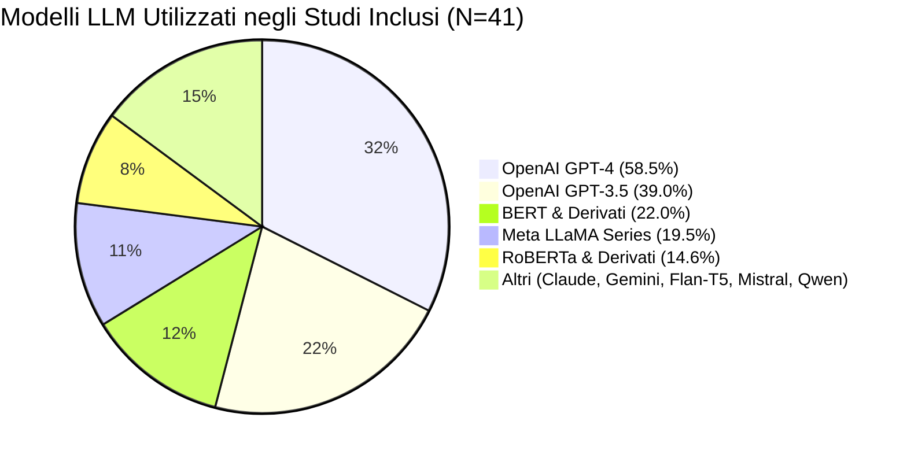
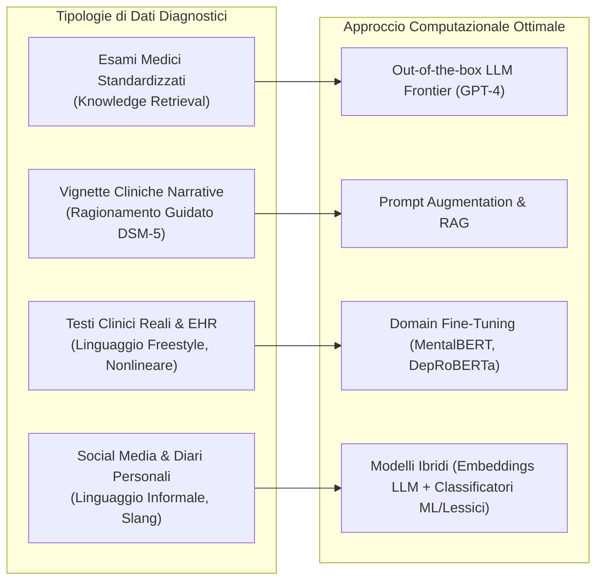
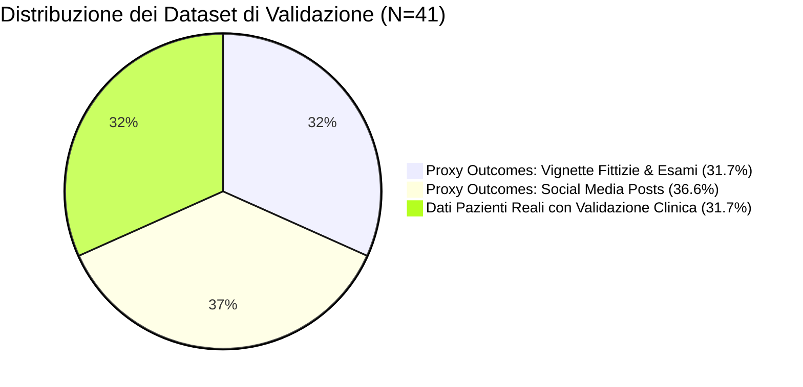

# Large Language Models and Their Applications in Mental Health: Scoping Review (Lokadjaja et al., 2026)

## Definizione Operativa
- **Scoping Review sistematica** condotta secondo le linee guida **PRISMA-ScR** e pubblicata su *JMIR Mental Health* da Matheus Calvin Lokadjaja, Jordon Junyang Kho, Peter Johannes Schulz e Wilson Wen Bin Goh (Lee Kong Chian School of Medicine, Nanyang Technological University; Ewha Womans University; Imperial College London; Institute of Mental Health Singapore, 2026; DOI: [10.2196/88057](https://doi.org/10.2196/88057)).
- **Oggetto e Ambito:** Mappatura sistematica e analisi critica di 41 studi peer-reviewed (selezionati da un corpus iniziale di 3.121 record indicizzati su *PubMed*, *Scopus* e *Web of Science* tra gennaio 2021 e ottobre 2025, filtrati rigorosamente per pubblicazioni in riviste di primo quartile Q1) incentrati sull'impiego dei Large Language Models (LLM) in ambito psichiatrico e psicologico.
- **Tassonomia dei Casi d'Uso:** Categorizza le applicazioni clinico-tecnologiche in tre domini principali:
  1. **Diagnostica (75,6%, 31/41 studi):** Rilevamento diretto e classificazione di disturbi mentali da esami standardizzati, vignette cliniche, cartelle cliniche (EHR), diari personali e post su social network.
  2. **Prognostica (12,2%, 5/41 studi):** Previsione del decorso a lungo termine, stima del rischio di ricaduta e predizione di crisi acute (MDD, schizofrenia, ideazione suicidaria).
  3. **Supporto Decisionale / CDSS (17,1%, 7/41 studi):** Estrazione automatica e sintesi di colloqui clinici, delineazione dei sintomi, triage algoritmico e raccomandazioni terapeutiche evidence-based.
- **Il Divario di Validazione (*Validation Gap*):** Denuncia una profonda discrepanza metodologica ed epistemologica nel panorama scientifico: mentre la maggior parte degli studi riporta performance quantitativamente elevate (spesso superiori ai clinici), **solo il 31,7% (13/41) valida i modelli su dati di pazienti reali a confronto con valutazioni di clinici esperti**, mentre il restante 68,3% fa affidamento su misure surrogate (*proxy outcomes*) come quesiti d'esame a scelta multipla, vignette fittizie o post di social media.

```mermaid
flowchart TD
    subgraph CorpusSelection ["Selezione del Corpus (PRISMA-ScR)"]
        P1["3.121 Record Iniziali (PubMed, Scopus, WoS)"] --> P2["993 Duplicati Rimossi"]
        P2 --> P3["1.601 Esclusi (Filtro Top-Quartile Q1)"]
        P3 --> P4["527 Valutati a Testo Pieno"]
        P4 --> P5["41 Studi Inclusi nel Review"]
    end

    subgraph UseCases ["Stratificazione dei Casi d'Uso"]
        UC1["Diagnostica (75,6% / n=31):<br/>Esami Medici (6), Vignette (7), Testi Clinici/Social (18)"]
        UC2["Prognostica (12,2% / n=5):<br/>Decorso Clinico, Esiti Schizofrenia/MDD, Crisi Telehealth"]
        UC3["Supporto Decisionale (17,1% / n=7):<br/>Sintesi Sedute, Delineazione Sintomi, Triage EHR, EEG Copilot"]
    end

    subgraph ArchitecturalLandscape ["Paesaggio dei Modelli"]
        M1["Decoder-Only (82,9%): GPT-4 (58,5%), GPT-3.5 (39%), LLaMA (19,5%)"]
        M2["Encoder-Only & Ibridi (34,1%): BERT (22%), RoBERTa (14,6%), Flan-T5"]
        M3["Fine-Tuning di Dominio (31,7%): MentalBERT, MentalLLaMA, DepRoBERTa, TinyBERT"]
    end

    subgraph ValidationGap ["Il Divario Critico di Validazione"]
        V1["68,3% su Proxy Outcomes<br/>(Vignette fittizie, Esami a scelta multipla, Social)"]
        V2["31,7% su Dati Pazienti Reali<br/>(Cartelle cliniche, Trascrizioni colloqui, Diari con validazione clinica)"]
        V3["Rischi: Allucinazioni da comorbilità, Falsi positivi, Bias di pubblicazione"]
    end

    P5 --> UseCases
    UseCases --> ArchitecturalLandscape
    ArchitecturalLandscape --> ValidationGap
```

---

## Evidenze dalla Letteratura

### 1. Metodologia di Scoping Review e Criteri di Selezione
- **Database e Finestra Temporale:** Estrazione condotta il 4 novembre 2025 su *PubMed*, *Web of Science* e *Scopus* per articoli pubblicati tra il **1° gennaio 2021 e il 31 ottobre 2025** (con inclusione degli *online-ahead-of-print*).
- **Processo di Screening Multi-Rater:** 3.121 paper identificati $\rightarrow$ rimozione di 993 duplicati $\rightarrow$ applicazione automatica del criterio di qualità bibliometrica (esclusione di 1.601 paper non appartenenti a riviste nel top quartile Q1 di Scopus/SCImago o JCR) $\rightarrow$ valutazione di 527 full-text $\rightarrow$ **41 studi empirici inclusi** (screening indipendente da 2 revisori con terzo revisore per dirimere discrepanze e un quarto revisore senior come valutatore metodologico).
- **Criteri di Esclusione Specifica:** Esclusi review paper, articoli non clinici, lavori in cui la salute mentale era marginale e studi basati esclusivamente su dati sintetici (a causa della scarsa affidabilità traslazionale dei dati sintetici nella medicina evidence-based).

---

### 2. Panorama dei Modelli e Architetture Computazionali

- **Dominio delle Architetture Closed-Source Decoder-Only:**
  - I modelli **decoder-only** rappresentano la stragrande maggioranza (**82,9%**, 34/41 studi), guidati dalle iterazioni di OpenAI: **GPT-4 (58,5%, 24/41)** e **GPT-3.5 (39,0%, 16/41)**.
  - I modelli **encoder-only** costituiscono il **34,1%** (14/41 studi), principalmente rappresentati da BERT (22,0%, 9/41) e RoBERTa (14,6%, 6/41), ampiamente usati per estrazione di feature, embeddings e classificazione semantica supervisionata.
  - I modelli **encoder-decoder** (es. Flan-T5, BART) sono stati impiegati nel supporto decisionale e nell'estrazione di informazioni cliniche strutturate (Mahbub et al., 2025; Adhikary et al., 2024).
- **Adattamento di Dominio (*Fine-Tuning*):**
  - Sebbene tutti gli studi abbiano testato modelli out-of-the-box, solo circa un terzo degli studi (**31,7%**, 13/41) ha valutato modelli specialistici sottoposti a fine-tuning di dominio (es. *MentalBERT*, *MentaLLaMA*, *Mental-LLM*, *MentalQLM*, *DepRoBERTa*, *Mental-Alpaca*, *RedditBERT*, *TinyBERT*).
  - La limitata diffusione del fine-tuning clinico è attribuibile agli elevati requisiti computazionali e alla scarsità di dataset clinici aperti e conformi alla privacy.

---

### 3. Matrice Comparativa degli Studi Cardine

| Studio | Anno | Caso d'Uso | Condizione Clinica | Dataset | Architettura LLM & Setup | Risultati Chiave & Metriche | Limiti Principali |
| :--- | :--- | :--- | :--- | :--- | :--- | :--- | :--- |
| **Schubert et al. [24]** | 2023 | Diagnosi | Salute mentale / Neurologia | Esami di abilitazione medica | GPT-4 vs GPT-3.5 (Untuned) | GPT-4 supera GPT-3.5 e la media umana nelle categorie cognitive e comportamentali | Allucinazioni espresse con alta sicurezza in compiti di ordine cognitivo superiore |
| **Watari et al. [28]** | 2023 | Diagnosi | Psichiatria generale | General Medicine In-Training Exam (Gmite, Giappone) | GPT-4 (Untuned) | GPT-4 supera gli specializzandi nella media generale, ma gli specializzandi superano GPT-4 in "Psichiatria" | La psichiatria risulta la categoria clinica con la performance peggiore per GPT-4 |
| **Li et al. [26]** | 2024 | Diagnosi | Psichiatria generale | Esame di abilitazione psichiatrica (Taiwan) | GPT-4, Bard, LLaMA-2 (Untuned) | GPT-4 supera l'esame di licenza e mostra abilità nella diagnosi differenziale | GPT-4 fallisce rispetto a psichiatri esperti; LLaMA-2 e Bard falliscono l'esame |
| **Levkovich & Elyoseph [17]** | 2023 | Diagnosi | Depressione | Vignette cliniche | GPT-3.5, GPT-4 (Untuned) | Aderenza alle linee guida ufficiali; assenza di bias per genere o status socioeconomico del paziente | Difficoltà nel gestire scenari contenenti violenza sessuale per blocco dei filtri di sicurezza |
| **Levkovich & Elyoseph [32]** | 2023 | Diagnosi | Rischio Suicidario | Vignette cliniche | GPT-3.5, GPT-4 (Untuned) | GPT-4 eguaglia o supera i professionisti della salute mentale nella stratificazione del rischio | GPT-3.5 tende a sottostimare sistematicamente il rischio di suicidio acuto |
| **Wislocki et al. [34]** | 2025 | Diagnosi | Trauma, DOC, Abuso di sostanze | Vignette cliniche | Gemini 1.5 Flash, GPT-4o mini, Claude Sonnet, LLaMA-3 | I modelli LLM mostrano minore *diagnostic overshadowing* da trauma rispetto ai clinici umani | Valutazione basata esclusivamente su vignette testuali fittizie |
| **Ohse et al. [36]** | 2024 | Diagnosi | Depressione | Trascrizioni di interviste cliniche reali | GPT-4, GPT-3.5, LLaMA-2 13B, BERT (Untuned vs Fine-tuned) | GPT-3.5 fine-tunato supera GPT-4 out-of-the-box nella diagnosi da colloquio clinico | Modelli open-source limitati da cutoff di conoscenza più arretrati |
| **Shin et al. [37]** | 2024 | Diagnosi | Depressione & Suicidio | Diari personali di utenti reali | GPT-3.5, GPT-4 (Untuned vs Fine-tuned) | GPT-3.5 fine-tunato ottiene la massima accuratezza diagnostica superando GPT-4 untuned | Dati raccolti da campioni omogenei sudcoreani |
| **Dalal et al. [48]** | 2024 | Diagnosi | Depressione | Post da social media (Reddit) | BERT, RoBERTa, MentalBERT, MentaLLaMA + Lessico PHQ-9 | Modello ibrido BERT infuso con lessico PHQ-9 supera i modelli generalisti e specifici | Linguaggio social non standardizzato; rischio di falsi positivi |
| **Palominos et al. [49]** | 2025 | Diagnosi | Schizofrenia e Psicosi | Trascrizioni cliniche longitudinali | BERT, SBERT (Embeddings) | Indice composito di comportamento semantico traccia l'evoluzione dei sintomi psicotici nel tempo | Complessità di calibrazione cross-linguistica |
| **Lee et al. [19]** | 2024 | Prognosi | Crisi psichiatriche e Suicidio | Dati clinici di tele-salute mentale reale | GPT-4 (Untuned) | GPT-4 eguaglia i clinici esperti nell'estrarre indicatori di rischio e predire crisi future | Elevato tasso di falsi positivi; performance ridotta su casi clinici ambigui |
| **Elyoseph & Levkovich [54]** | 2024 | Prognosi | Schizofrenia | Vignette cliniche | GPT-4, Bard, Claude, GPT-3.5 | GPT-4 e Claude comparabili agli esperti; GPT-3.5 mostra pessimismo diagnostico ingiustificato | Limitato a scenari sintetici |
| **Adhikary et al. [20]** | 2024 | Supporto Decisionale | Counseling psicologico | Sessioni di counseling clinico | 11 LLM (MentalBART, MentalLlama, Mistral, Flan-T5, LLaMA-2, Phi-2) | I modelli specifici di dominio superano nettamente i generalisti nel sintetizzare le sedute | I modelli faticano a distinguere dettagli oggettivi da interpretazioni del terapeuta e perdono segnali di suicidio |
| **Taylor et al. [58]** | 2024 | Supporto Decisionale | Triage Salute Mentale Generale | Cartelle cliniche elettroniche NHS (UK) | TinyBERT, MobileBERT, DistilBERT, BERT vs LLaMA-2 7B | Piccoli modelli fine-tunati superano LLaMA-2 7B per accuratezza ed efficienza a basse risorse | Valutazione su dataset monocentrico NHS |
| **Chen et al. [23]** | 2025 | Supporto Decisionale | Diagnostica psichiatrica | Tracciati EEG + Dati clinici | LLM leggeri multimodali (Qwen, DeepSeek, InternLM) | Copilot multimodale estrae stati emotivi da EEG e genera proposte terapeutiche | Modelli molto grandi meno precisi nella terminologia specialistica |
| **Perlis et al. [59]** | 2024 | Supporto Decisionale | Depressione Bipolare | Vignette cliniche complesse | GPT-4 Turbo con Prompt Augmentation | GPT-4 potenziato supera i medici di medicina generale nella scelta terapeutica per depressione bipolare | Mancanza di test su cartelle cliniche in tempo reale |

---

### 4. Analisi Dettagliata per Casi d'Uso

#### A. Diagnostica (75,6% degli studi, 31/41)
1. **Esami di Abilitazione Medica (6 studi):**
   - L'impiego di esami licensing (Corea, Taiwan, Cile, esami di neurologia/medicina generale) evidenzia l'eccezionale capacità di knowledge retrieval dei modelli frontier (GPT-4, Claude 3.5 Sonnet, Gemini 1.5 Pro).
   - **La "Specificità Psichiatrica":** In molteplici studi comparativi (es. Watari et al., 2023), la psichiatria si è rivelata la disciplina con il punteggio relativo più basso per i modelli linguistici, poiché i costrutti psichiatrici richiedono inferenza contestuale, comprensione delle intenzioni e integrazione di anamnesi complesse piuttosto che mera memorizzazione nozionistica.
   - **Allucinazioni e Catastrophic Forgetting:** Schubert et al. (2023) e Herrmann-Werner et al. (2024) documentano che gli LLM manifestano errori critici formulati con "totale sicurezza assertiva" (*high confidence*), fallendo nel mantenere la memoria del contesto clinico quando interpellati su ragionamenti diagnostici complessi.
2. **Vignette Cliniche (7 studi):**
   - Negli scenari clinici strutturati, GPT-4 ha mostrato un'aderenza rigorosa alle linee guida DSM-5 e una sorprendente **assenza di bias demografici** (Levkovich & Elyoseph, 2023) e una minore suscettibilità al *diagnostic overshadowing* rispetto ai clinici umani quando esposto a traumi pregressi (Wislocki et al., 2025).
   - *Limiti:* GPT-3.5 tende a sottostimare il rischio suicidario (Levkovich & Elyoseph, 2023); i filtri di sicurezza aziendali bloccano l'analisi di casi clinici con contenuti di violenza o traumi sessuali; difficoltà marcata su disturbi dell'umore complessi come ciclotimia e disregolazione distruttiva (Gargari et al., 2024).
3. **Dati Clinici Reali, Diari e Social Media (18 studi):**
   - Sui testi a stile libero non standardizzati, il **fine-tuning specialistico** si rivela determinante: modelli compatti fine-tunati (es. GPT-3.5 fine-tunato da Ohse et al., 2024 o Shin et al., 2024) superano sistematicamente GPT-4 out-of-the-box nella classificazione di depressione e rischio suicidario.
   - **Modelli Ibridi LLM-ML:** L'integrazione di embeddings di modelli linguistici (BERT, RoBERTa, SBERT) con classificatori classici (SVM, MLP, CNN, LSTM) o lessici strutturati (es. integrazione di regole PHQ-9 in Dalal et al., 2024 o XLM-RoBERTa + MLP in Thomas et al., 2025) produce i risultati più robusti, spiegabili e resilienti.

---

#### B. Prognostica e Monitoraggio del Decorso (12,2% degli studi, 5/41)
- **Stima degli Esiti a Lungo Termine:** Nei test su vignette di depressione maggiore e schizofrenia, GPT-4, Bard e Claude hanno fornito prognosi sovrapponibili a quelle di pool di esperti psichiatri, mentre GPT-3.5 ha mostrato un bias pessimistico ingiustificato (Elyoseph et al., 2024; Elyoseph & Levkovich, 2024).
- **Predizione di Crisi in Telemedicina:** Lee et al. (2024) hanno impiegato GPT-4 su dati reali di tele-salute mentale per anticipare crisi acute, dimostrando una capacità predittiva analoga ai clinici esperti. Tuttavia, il modello ha mostrato un **tasso elevato di falsi positivi** e un'affidabilità degradata nei casi clinici ambigui e non eclatanti.

---

#### C. Supporto Decisionale Clinico (CDSS) e Triage (17,1% degli studi, 7/41)
- **Estrazione e Sintesi di Sedute Terapeutiche:** Adhikary et al. (2024) e So et al. (2024) dimostrano che modelli linguistici dedicati (MentalBART, MentalLlama, GPT-3.5 tuned) estraggono con precisione sintomi e momenti salienti dalle trascrizioni di counseling. Tuttavia, le analisi qualitative rivelano che gli LLM tendono a confondere le espressioni del paziente con le interpretazioni del terapeuta e possono mancare indicatori critici di rischio suicidario sotteso.
- **Efficienza dei Modelli Compatti nel Triage Sanitario:** Taylor et al. (2024) hanno dimostrato che architetture diminutive fine-tunate (*TinyBERT*, *MobileBERT*, *DistilBERT*) ottengono un'accuratezza superiore rispetto a modelli a 7 miliardi di parametri (LLaMA-2 7B) nel triage di cartelle cliniche elettroniche NHS, garantendo un'implementazione a bassissimo costo computazionale.
- **Supporto alla Prescrizione nella Depressione Bipolare:** Perlis et al. (2024) hanno dimostrato che GPT-4 potenziato con prompt clinici strutturati supera i medici di medicina generale nella scelta dei trattamenti per la depressione bipolare, riducendo gli errori di prescrizione di antidepressivi in monoterapia.

---

### 5. Il Divario di Validazione Clinica (*Validation Gap*)

Il contributo concettuale più rilevante della scoping review di Lokadjaja et al. (2026) risiede nell'evidenziazione sistematica del **Validation Gap**:

1. **Predominanza di Misure Surrogate:** Il **68,3%** degli studi valuta i modelli esclusivamente su quesiti teorici a scelta multipla, casi clinici sintetici o post estratti da piattaforme come Reddit e Twitter.
2. **Illusione di Prontezza Clinica (*Clinical Readiness Fallacy*):** I modelli che eccellono sui dati puliti e standardizzati falliscono frequentemente nel contesto ospedaliero e ambulatoriale reale a causa del rumore nei dati, delle comorbilità multiple, dei bias di registrazione e del gergo clinico informale.
3. **Bias di Pubblicazione nell'Era dell'Hype su GenAI:** Gli autori sottolineano come la letteratura attuale sia fortemente sbilanciata verso la pubblicazione di esiti positivi, mentre i fallimenti algoritmici, i falsi positivi e le allucinazioni cliniche rischiano di rimanere non documentati.
4. **Assenza di Coinvolgimento dei Pazienti (*Patient Advocacy Gap*):** Nessuno degli studi inclusi ha integrato la prospettiva diretta dei pazienti o associazioni di tutela nel design o nella validazione delle applicazioni di IA.

---

### 6. Sfide Etico-Giuridiche, Riservatezza dei Dati e Modelli Open-Source
- **Rischio di Data Leakage nei Modelli Commerciali:** La forte dipendenza da API closed-source (OpenAI GPT nel 97,5% dei modelli commerciali esaminati) introduce rischi di violazione della privacy del paziente, violazione del GDPR (Art. 9 per dati biometrici e sanitari) e delle normative HIPAA.
- **La Necessità di Modelli Open-Weight Locali:** Per superare le barriere di adozione ospedaliera, la ricerca futura deve concentrarsi su modelli open-source (es. LLaMA-3, Qwen, Mistral) e modelli specialistici leggeri (SLM) distribuibili *on-premise* senza condivisione di dati verso server terzi.
- **Multimodalità:** Il 90,2% degli studi attuali si limita al solo testo, ignorando biomarcatori prosodici, espressioni facciali e parametri fisiologici indispensabili per una valutazione psichiatrica olistica.

---

## Riferimenti Bibliografici
- Lokadjaja, M. C., Kho, J. J., Schulz, P. J., & Goh, W. W. B. (2026). Large Language Models and Their Applications in Mental Health: Scoping Review. *JMIR Mental Health*, 13, e88057. https://doi.org/10.2196/88057
- Adhikary, P. K., Srivastava, A., Kumar, S., et al. (2024). Exploring the efficacy of large language models in summarizing mental health counseling sessions: benchmark study. *JMIR Ment Health*, 11, e57306.
- Chen, H., Zeng, W., Chen, C., et al. (2025). EEG emotion copilot: optimizing lightweight LLMs for emotional EEG interpretation with assisted medical record generation. *Neural Netw*, 192, 107848.
- Dalal, S., Tilwani, D., Gaur, M., et al. (2024). A cross attention approach to diagnostic explainability using clinical practice guidelines for depression. *IEEE JBHI*, 2024, 1–11.
- Herrmann-Werner, A., Festl-Wietek, T., Holderried, F., et al. (2024). Assessing ChatGPT's mastery of Bloom's taxonomy using psychosomatic medicine exam questions. *J Med Internet Res*, 26, e52113.
- Lee, C., Mohebbi, M., O'Callaghan, E., & Winsberg, M. (2024). Large language models versus expert clinicians in crisis prediction among telemental health patients. *JMIR Ment Health*, 11, e58129.
- Levkovich, I., & Elyoseph, Z. (2023). Identifying depression and its determinants upon initiating treatment: ChatGPT versus primary care physicians. *Fam Med Community Health*, 11(4), e002391.
- Levkovich, I., & Elyoseph, Z. (2023). Suicide risk assessments through the eyes of ChatGPT-3.5 versus ChatGPT-4: vignette study. *JMIR Ment Health*, 10, e51232.
- Li, D. J., Kao, Y. C., Tsai, S. J., et al. (2024). Comparing the performance of ChatGPT GPT-4, Bard, and Llama-2 in the Taiwan psychiatric licensing examination. *Psychiatry Clin Neurosci*, 78(6), 347–352.
- Ohse, J., Hadžić, B., Mohammed, P., et al. (2024). Zero-shot strike: testing the generalisation capabilities of out-of-the-box LLM models for depression detection. *Comput Speech Lang*, 88, 101663.
- Perlis, R. H., Goldberg, J. F., Ostacher, M. J., & Schneck, C. D. (2024). Clinical decision support for bipolar depression using large language models. *Neuropsychopharmacology*, 49(9), 1412–1416.
- Schubert, M. C., Wick, W., & Venkataramani, V. (2023). Performance of large language models on a neurology board-style examination. *JAMA Netw Open*, 6(12), e2346721.
- Shin, D., Kim, H., Lee, S., et al. (2024). Using large language models to detect depression from user-generated diary text data. *J Med Internet Res*, 26, e54617.
- So, J., Chang, J., Kim, E., et al. (2024). Aligning large language models for enhancing psychiatric interviews through symptom delineation and summarization. *JMIR Form Res*, 8, e58418.
- Taylor, N., Ghose, U., Rohanian, O., et al. (2024). Efficiency at scale: investigating the performance of diminutive language models in clinical tasks. *Artif Intell Med*, 157, 103002.
- Watari, T., Takagi, S., Sakaguchi, K., et al. (2023). Performance comparison of ChatGPT-4 and Japanese medical residents in the general medicine in-training examination. *JMIR Med Educ*, 9, e52202.
- Wislocki, K. E., Sami, S., Liberzon, G., & Zalta, A. K. (2025). Comparing generative artificial intelligence and mental health professionals for clinical decision-making with trauma-exposed populations. *JMIR Ment Health*, 12, e80801.

---

## Relazioni
- [[validation-gap-in-mental-health-llms]]
- [[lightweight-domain-models-in-mental-health]]
- [[ai-v5-e84305]]
- [[clinical-readiness-gap-in-mh-chatbots]]
- [[evidence-adoption-gap-ai-mental-health]]
- [[specialized-nlp-models-mental-health]]
- [[modello-centauro-clinico]]
- [[human-in-the-reasoning]]
- [[open-data-scarcity-clinical-psychology]]
- [[single-correct-answer-fallacy-in-clinical-ai]]
- [[synthetic-psychopathology]]
- [[audit-bias-llm-clinici]]
- [[gdpr-governance-mental-health-ai]]
- [[layered-safeguards-in-clinical-ai]]
