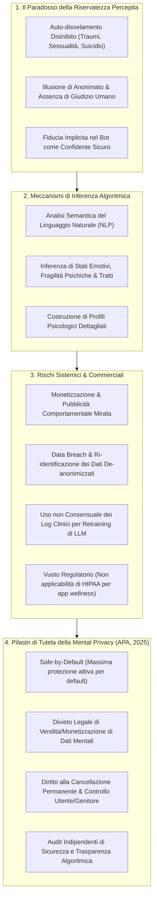

# Mental Privacy in Clinical AI

## Definizione Operativa
- Principio etico-giuridico e costrutto di tutela clinico-tecnologica formalizzato dall'**American Psychological Association (APA, 2025)** e integrato nel dibattito internazionale sui *neurorights* e sulla governance dei dati sanitari (De Freitas & Cohen, 2024; Li, 2023). 
- Definisce il diritto fondamentale e inalienabile dell'individuo alla salvaguardia della propria sfera psichica interiore — inclusi stati emotivi, processi cognitivi, tratti di personalità, vulnerabilità affettive e inclinazioni comportamentali — contro l'estrazione non consensuale, l'inferenza algoritmica automatizzata, il tracciamento covert e la monetizzazione commerciale da parte di modelli di intelligenza artificiale generativa (LLM), chatbot o applicazioni di benessere digitale (*wellness apps*).
- **Utilità Clinica e CBT:** Fornisce una cornice per proteggere l'alleanza terapeutica e la confidenzialità nel momento in cui i pazienti utilizzano assistenti digitali come strumenti aggiuntivi o succedanei della cura. Permette al terapeuta cognitivo-comportamentale di analizzare e decostruire l'illusione di sicurezza e confidenzialità che spinge i pazienti a un'auto-apertura disinibita (*uninhibited self-disclosure*) verso i bot, prevenendo abusi di profilazione psicologica digitale, manipolazione comportamentale e fuga di dati sensibili non protetti dalle normative sanitarie tradizionali.

---

## Evidenze dalla Letteratura

### 1. Il Vuoto Normativo e l'Illusione di Segretezza Sanitaria
- **Fallimento delle Normative Sanitarie Tradizionali (HIPAA Gaps):** Nella maggior parte delle giurisdizioni (es. Stati Uniti), le leggi sulla privacy medica (come l'HIPAA) vincolano esclusivamente i fornitori sanitari accreditati (*covered entities*) e i loro partner diretti (De Freitas & Cohen, 2024; APA, 2025). Le applicazioni commerciali di benessere mentale e i chatbot di General Purpose AI (es. ChatGPT, Character.ai, app di journaling) non ricadono in tale categoria e sono regolati unicamente da termini di servizio e informative sulla privacy unilaterali, spesso opache e mutevoli (Neal et al., 2022).
- **Il Paradosso del Disvelamento Disinibito:** Gli utenti — in particolare gli adolescenti e le persone marginalizzate — tendono a condividere confessioni più intime e dettagliate con un agente virtuale rispetto a un essere umano, percependo una totale assenza di bias o rischio sociale di rifiuto (Kim et al., 2022; Diwanji et al., 2025). Questa percezione di "sicurezza" è però illusoria, poiché l'interazione viene registrata, archiviata e processata su server remoti di aziende commerciali (Laestadius et al., 2022; Li, 2023).

---

### 2. Inferenze Algoritmiche e Profilazione Emotiva Inconsapevole
- **Inferenza di Stati Mentali Senza Disvelamento Diretto:** Gli odierni modelli di Natural Language Processing (NLP) e sentiment analysis sono in grado di ricostruire con precisione crescente diagnosi psichiatriche probabili, instabilità affettiva, rischio suicidario, tendenze ossessive e tratti di personalità a partire da indici linguistici sottili (scelta dei tempi verbali, coesione lessicale, latenze di risposta, orari di invio dei messaggi) senza che l'utente dichiari esplicitamente alcuna patologia (Wang et al., 2025; Bouguettaya et al., 2025).
- **Monetizzazione della Vulnerabilità Emotiva:** La raccolta continuativa di questi profili permette la creazione di banche dati predittive che possono essere impiegate per il targeting pubblicitario iper-personalizzato, modulato proprio sui picchi di vulnerabilità o disperazione dell'individuo, trasformando il disagio psicologico in un asset economico (APA, 2025).

---

### 3. I Pilastri di Tutela della Mental Privacy (APA, 2025)

L'APA Health Advisory formula specifiche prescrizioni per garantire la protezione effettiva della sfera mentale:

| Pilastro | Principio Operativo | Implicazione Tecnica e Regolatoria |
| :--- | :--- | :--- |
| **Safe-by-Default** | Le impostazioni a massima protezione della privacy devono essere attive per impostazione predefinita, non opzioni nascoste nei sottomenu. | Nessuna condivisione di dati per addestramento modelli a meno di un opt-in esplicito e consapevole dell'utente. |
| **Inviolabilità dei Dati Emotivi** | Divieto perentorio di vendita, cessione o commercializzazione dei dati e delle inferenze di salute mentale. | Separazione strutturale tra log conversazionali e database pubblicitari delle piattaforme tech. |
| **Diritto all'Oblio Psichico** | Possibilità per l'utente (o per i genitori di minori) di richiedere la cancellazione permanente e verificabile dei propri dati. | Eliminazione irreversibile di transcript e parametri di profiling dai database e dai pesi dei modelli sintetici. |
| **Trasparenza dei Dataset** | Obbligo per gli sviluppatori di dichiarare le fonti dei dati di training e le modalità di elaborazione algoritmica. | Audit indipendenti di terze parti senza conflitti di interesse su privacy, sicurezza e bias. |

---

### 4. Linee Guida per la Pratica Psicoterapeutica e Clinica
- **Indagine Attiva nel Setting:** Il terapeuta deve esplorare sistematicamente l'eventuale ricorso a chatbot da parte del paziente, chiarendo in modo psicoeducativo che i software commerciali non godono del segreto professionale e archiviano le interazioni su server aziendali.
- **Istruzioni di Minimizzazione del Rischio per il Paziente:**
  1. *De-identificazione rigorosa:* Non inserire mai nomi reali, luoghi, dettagli biografici specifici o informazioni di terzi nelle chat con i bot.
  2. *Controllo delle impostazioni di privacy:* Disattivare l'archiviazione della cronologia e l'utilizzo dei dati per l'addestramento dei modelli (*data training opt-out*).
  3. *Uso circoscritto:* Limitare l'interazione all'esecuzione di esercizi pratici definiti (es. simulazione di role-playing per l'ansia sociale) evitando di utilizzare il chatbot come diario emotivo per confessioni profonde.

---

## Riferimenti Bibliografici
- American Psychological Association. (2025). *APA Health Advisory on the Use of Generative AI Chatbots and Wellness Applications for Mental Health*. APA.org. https://www.apa.org/topics/artificial-intelligence-machine-learning/health-advisory-ai-chatbots-wellness-apps
- Bouguettaya, A., Stuart, E. M., & Aboujaoude, E. (2025). Racial bias in AI-mediated psychiatric diagnosis and treatment: A qualitative comparison of four large language models. *NPJ Digital Medicine*, 8, 332. https://doi.org/10.1038/s41746-025-01746-4
- De Freitas, J., & Cohen, I. G. (2024). The health risks of generative AI-based wellness apps. *Nature Medicine*, 30(5), 1269–1275. https://doi.org/10.1038/s41591-024-02943-6
- Diwanji, V. S., Geana, M., Pei, J., Nguyen, N., Izhar, N., & Chaif, R. H. (2025). Consumers’ emotional responses to ai-generated versus human-generated content: The role of perceived agency, affect and gaze in health marketing. *International Journal of Human-Computer Interaction*. Advance online publication. https://doi.org/10.1080/10447318.2025.2454954
- Kim, H. M., Xu, Y., & Wang, Y. (2022). Overcoming the mental health stigma through m-health apps: Results from the Healthy Minds Study. *Telemedicine and e-Health*, 28(10). https://doi.org/10.1089/tmj.2021.0418
- Laestadius, L., Bishop, A., Gonzalez, M., Illenčík, D., & Campos-Castillo, C. (2022). Too human and not human enough: A grounded theory analysis of mental health harms from emotional dependence on the social chatbot Replika. *New Media & Society*, 1–19. https://doi.org/10.1177/14614448221142007
- Li, J. (2023). Security implications of AI chatbots in health care. *Journal of Medical Internet Research*, 25, e47551. https://doi.org/10.2196/47551
- Neal, D., Engelsma, T., Tan, J., Craven, M. P., Marcilly, R., Peute, L., Dening, T., Jaspers, M., & Dröes, R. M. (2022). Limitations of the new ISO standard for health and wellness apps. *The Lancet Digital Health*, 4(2), e80–e82. https://doi.org/10.1016/S2589-7500(21)00273-9
- Wang, L., Bhanushali, T., Huang, Z., Yang, J., Badami, S., & Hightow-Weidman, L. (2025). Evaluating generative AI in mental health: Systematic review of capabilities and limitations. *JMIR Mental Health*, 12, e70014. https://doi.org/10.2196/70014

---

## Relazioni
- Concetti e fonti collegate: [[health-advisory-ai-chatbots-wellness-apps-mental-health]], [[single-person-echo-chambers]], [[gdpr-governance-mental-health-ai]], [[software-as-a-medical-device-salute-mentale]], [[emotional-infrastructure]], [[artificial-intimacy]], [[uso-problematico-chatbot-ai]], [[human-oversight-and-liability-in-clinical-ai]], [[pediatric-ai-bias-and-vulnerabilities]], [[open-weight-privacy-compliant-synthesis]]
