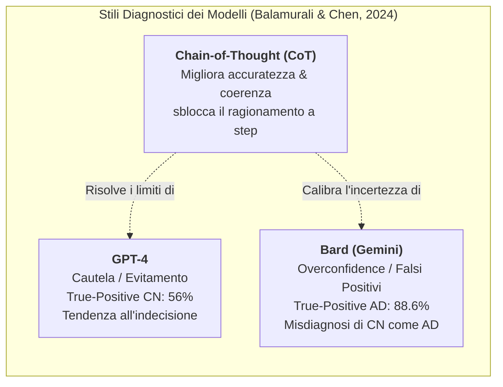
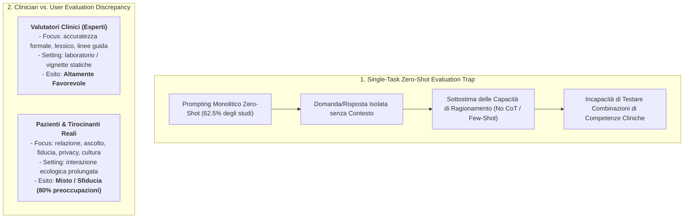

# Evaluating Generative AI in Mental Health: Systematic Review of Capabilities and Limitations (Wang et al., 2025)

## Definizione Operativa
- **Revisione sistematica** condotta secondo le linee guida **PRISMA 2020** e pubblicata su *JMIR Mental Health* da Liying Wang, Tanmay Bhanushali, Zhuoran Huang, Jingyi Yang, Sukriti Badami e Lisa Hightow-Weidman (*Institute on Digital Health and Innovation & Center of Population Sciences for Health Equity, Florida State University; University of Washington; Khoury College of Computer Sciences, Northeastern University; Columbia University*, 2025; DOI: [10.2196/70014](https://doi.org/10.2196/70014)).
- **Oggetto e Obiettivi:** Valutare in modo rigoroso e multidimensionale le capacità clinico-psicologiche reali dell'Intelligenza Artificiale Generativa (GenAI / LLM) nella salute mentale, analizzando in che misura i modelli linguistici (ChatGPT-3.5, ChatGPT-4.0, Google Bard/Gemini, Anthropic Claude) replichino le competenze operative di un terapeuta umano (psicoeducazione, assessment diagnostico-prognostico, consapevolezza emotiva, interventi CBT, competenza culturale ed etica).
- **Corpus Esaminato e Metodologia di Qualità:**
  - *Ricerca Sistematica:* Screening su 5 banche dati biomediche, ingegneristiche e psicologiche (*PubMed, Embase, Web of Science, Engineering Village, PsycINFO*) condotta a giugno 2024 senza restrizioni linguistiche o temporali.
  - *Selezione:* 1.046 record identificati $\rightarrow$ 953 record unici dopo deduplicazione $\rightarrow$ 46 full-text esaminati $\rightarrow$ **8 studi empirici originali inclusi** (pubblicati tra il 2023 e il 2024; n=2 USA, n=3 Israele, n=1 Singapore, n=1 Arabia Saudita, n=1 Regno Unito).
  - *Valutazione Metodologica:* Condotta con il **Mixed Methods Appraisal Tool (MMAT, versione 2018)** da revisori indipendenti con risoluzione per consenso.
- **Rilievi Chiave e Snodi Critici:**
  - *Punti di Forza Dimostrati:* Elevata qualità e chiarezza nelle risposte di **psicoeducazione** (leggibilità misurata con Gunning Fog Index a 13.8) e punteggi eccezionali di **consapevolezza emotiva** sulla scala LEAS (*Levels of Emotional Awareness Scale*), dove ChatGPT-3.5 supera le norme della popolazione generale umana.
  - *Debolezze e Rischi:* Accuratezza diagnostica incerta e polarizzata (GPT-4 indeciso/evitante, Bard iper-fiducioso con falsi positivi), superficialità nell'assessment clinico, marcato deficit di **competenza culturale e linguistica** (incapacità di decodificare idiomi culturali arabi o manifestazioni somatiche del disagio), e persistenti preoccupazioni di privacy, accuratezza e fiducia (espresse dall'80% degli utenti clinici).
  - *Critica Metodologica Strutturale:* La letteratura soffre della trappola dello strumento (*"Hammer and Nail Problem"*): 5 studi su 8 hanno impiegato unicamente un prompting **zero-shot** a singolo turno Q&A su vignette isolate. Tale approccio sottostima il potenziale del ragionamento clinico avanzato (ottenibile con **Few-Shot** e **Chain-of-Thought / CoT**) e oscura la profonda **[[clinician-user-evaluation-discrepancy|discrepanza tra valutazioni dei clinici (ottimistiche) ed esperienza diretta degli utenti reali (critica e diffidente)]]**.

```mermaid
flowchart TD
    subgraph SystematicReview ["PRISMA 2020 & MMAT Selection (Wang et al., 2025)"]
        P1["1.046 Record Estratti (5 Banche Dati)"] --> P2["953 Record Unici dopo Deduplicazione"]
        P2 --> P3["46 Articoli Full-Text Valutati"]
        P3 --> P4["<b>8 Studi Empirici Inclusi (2023-2024)</b><br/>Modelli: ChatGPT-3.5, GPT-4, Bard, Claude"]
    end

    subgraph Capabilities ["Competenze Cliniche Valutate"]
        C1["<b>Psicoeducazione (Forte)</b><br/>Comprensiva, chiara, Gunning Fog 13.8"]
        C2["<b>Emotional Awareness (Forte a livello testuale)</b><br/>Supera norme LEAS popolazione generale"]
        C3["<b>Diagnosi & Prognosi (Mista / Debole)</b><br/>GPT-4 indeciso, Bard overconfident; CoT migliora"]
        C4["<b>Interventi CBT & Coaching (Emergente)</b><br/>Goal setting (21%), ristrutturazione cognitiva, guided imagery"]
        C5["<b>Competenza Culturale (Grave Deficit)</b><br/>WEIRD bias, fallimento su idiomi arabi e somatizzazione"]
    end

    subgraph MethodologicalCritique ["Limiti Metodologici & 'Hammer and Nail' Trap"]
        M1["<b>[[single-task-zero-shot-evaluation-trap|Zero-Shot Single-Task Bias]]</b><br/>62.5% studi usa solo Q&A zero-shot statico, ignorando CoT e multi-turn"]
        M2["<b>[[clinician-user-evaluation-discrepancy|Discrepanza Clinico vs Utente]]</b><br/>Clinici entusiasti su task isolati vs Utenti insoddisfatti (80% sfiducia, assessment frettoloso)"]
        M3["<b>Assenza di Studi Longitudinali</b><br/>Mancanza di verifiche di efficacia e sicurezza a lungo termine"]
    end

    subgraph Recommendations ["Raccomandazioni per la Ricerca Futura"]
        R1["Prompting Avanzato: Few-Shot, Stepwise-CoT, Meta-Prompting"]
        R2["Framework di Valutazione Olistica Multi-Skill e Contestuale"]
        R3["Competenza Culturale basata sul Modello di Sue (Awareness, Knowledge, Skills)"]
        R4["Coinvolgimento di Pazienti Reali & Benchmark Comparativi Umano-IA"]
    end

    P4 --> Capabilities
    Capabilities --> MethodologicalCritique
    MethodologicalCritique --> Recommendations
```

---

## Evidenze dalla Letteratura

### 1. Inquadramento Epidemiologico e la Crisi della Forza Lavoro Clinica
- **Crescita della Domanda Post COVID-19:** Il carico globale dei disturbi mentali (depressione, disturbi d'ansia, trauma) è cresciuto vertiginosamente, superando la capacità di assorbimento dei servizi sanitari tradizionali (COVID-19 Mental Disorders Collaborators, 2021).
- **Carenza Strutturale di Specialisti (*HPSA*):** Negli Stati Uniti, le aree con carenza di professionisti della salute mentale (*Health Professional Shortage Areas*, con rapporto popolazione/terapeuta $\ge 30.000:1$) coinvolgono oltre **169 milioni di persone** (Behavioral Health Workforce Brief, 2023).
- **Ruolo dei Chatbot LLM Generativi:** L'accesso ubiquo e a costo marginale zero a modelli come ChatGPT, Bard e Claude ha spinto sia i clinici (per redazione note, diagnostica differenziale, bozze di piani di trattamento) sia gli utenti finali (come compagni terapeutici informali o sostituti di supporto) a ricorrere a tali strumenti (Maples et al., 2024; Stade et al., 2024). Tuttavia, la loro reale corrispondenza alle competenze cliniche umane necessitava di una verifica sistematica.

---

### 2. Sintesi degli 8 Studi Empirici Inclusi

| Studio Primario | Modello/i IA | Disegno & Campione | Dominio Clinico & Obiettivo | Risultati Chiave & Metriche | Limiti Principali Evidenziati |
| :--- | :--- | :--- | :--- | :--- | :--- |
| **Razdan et al. (2024)** | ChatGPT-3.5 | Task-based (Q&A); 2 urologi certificati | Psicoeducazione / Disfunzione erettile | Risposte valutate complete, empatiche e con **alta riproducibilità**; **Gunning Fog Index = 13.8** (adatto a licenza media-superiore). | Valutazione su risposte isolate; assenza di interazione con pazienti reali. |
| **Maurya et al. (2025)** | ChatGPT-3.5 | Task-based (Q&A su 7 categorie cliniche); 2 psicoterapeuti | Psicoeducazione (depressione, ansia, sostanze, spiritualità, lifestyle, relazioni) | Risposte giudicate complete, accurate, semplici, chiare, rilevanti ed ingaggianti. | Prompting zero-shot statico; mancata valutazione della tenuta nel dialogo dinamico. |
| **Elyoseph et al. (2023)** | ChatGPT-3.5 | Task-based (LEAS su 20 scenari); 2 psicologi + norma francese ($N=750$) | Consapevolezza emotiva (*Emotional Awareness*) | **ChatGPT-3.5 supera nettamente la norma della popolazione generale francese**; elevata appropriatezza contestuale e accordo inter-rater. | Test basato su scenari scritti di terze persone, non su risonanza affettiva reale. |
| **Hadar-Shoval et al. (2023)** | ChatGPT-3.5 | Task-based (LEAS adattata a vignette cliniche BPD vs Schizoide) | Mentalizzazione e differenziazione psicopatologica | Dimostra **plasticità di mentalizzazione**: differenzia BPD e disturbo schizoide per punteggi LEAS, numero di emozioni e intensità affettiva. | Simulazione artificiale circoscritta; nessun confronto con cartelle cliniche reali. |
| **Elyoseph & Levkovich (2024)** | GPT-4, GPT-3.5, Bard, Claude | Vignette cliniche; confronto tra IA, esperti clinici e opinione pubblica | Prognosi e recupero nella schizofrenia | **GPT-4, Bard e Claude generano prognosi allineate agli esperti clinici**; GPT-3.5 risulta marcatamente più pessimista. Tutti i modelli identificano il rischio di discriminazione. | Studio cross-sectional su vignette fittizie; assenza di follow-up longitudinale. |
| **Balamurali & Chen (2024)** | ChatGPT-3.5, GPT-4, Bard | Task-based; Zero-Shot vs Simplified CoT | Diagnosi differenziale tra Demenza di Alzheimer (AD) e Controllo Normale (CN) | GPT-4 supera il caso su CN (true-positive 56%), Bard raggiunge l'88.6% su AD. **CoT migliora significativamente GPT-3.5 e GPT-4** (ma non Bard). GPT-4 tende all'indecisione, Bard all'eccesso di sicurezza (*overconfidence*). | Mancanza di correlazione neuropsicologica avanzata o imaging; dataset limitato. |
| **Alanezi (2024)** | ChatGPT-3.5 | Studio qualitativo / trial utente: 24 pazienti ambulatoriali (ansia, depressione, disturbi comportamentali; 2 settimane $\ge 15$ min/die) | Efficacia percepita, supporto emotivo, tecniche CBT, barriere culturali | **80% (19/24) riporta aiuto nei sintomi**, 60% miglior literacy, 54% empatia non giudicante, 21% goal setting/CBT. **Tuttavia, l'80% esprime sfiducia nell'accuratezza**, lamenta assessment frettoloso privo di calore umano e fallimento su termini ed espressioni culturali arabe. | Campione ridotto di convenienza; interazione non guidata su dispositivi personali. |
| **Gore & Dove (2025)** | GenAI generica / ChatGPT | Survey qualitativa su 7 studenti tirocinanti in counseling e psicoterapia | Etica, affidabilità e ruolo della GenAI nel training clinico | Tirocinanti esprimono **forte scetticismo su accuratezza e trustworthiness**; sollevano rischi di privacy dei dati e bias insiti nei dati di pretraining. | Campione pilota ristretto ($n=7$); limitato al contesto formativo britannico. |

---

### 3. Analisi Dettagliata delle Competenze Cliniche

#### A. Psicoeducazione e Alfabetizzazione Sanitaria
- **Valutazione degli Esperti:** Nei compiti di psychoeducation, i modelli (ChatGPT-3.5 in primis) mostrano performance eccellenti per completezza, pertinenza e chiarezza (Maurya et al., 2025; Razdan et al., 2024).
- **Complessità Linguistica e Leggibilità:** L'indice Gunning Fog (13.8) rilevato da Razdan et al. colloca i testi a un livello di comprensibilità adatto a utenti con diploma di scuola superiore, segnalando la necessità di istruzioni di prompting mirate per adattare il registro a popolazioni con bassa scolarità.
- **Percezione degli Utenti:** Sebbene il 60% dei pazienti dichiari un miglioramento della propria alfabetizzazione sanitaria, l'**80% manifesta dubbi e riserve sull'affidabilità scientifica dei contenuti**, evidenziando una persistente ansia epistemica (Alanezi, 2024).

#### B. Diagnosi, Assessment e Ragionamento Prognostico
- **Comportamenti Diagnostici Asimmetrici:** Nel differenziare AD e CN, i modelli esibiscono pattern cognitivo-algoritmici opposti:
  - **ChatGPT-4:** Mostra cautela eccessiva ed evitamento decisionale (*indecisive behavior*), riducendo la sensibilità diagnostica;
  - **Google Bard (Gemini):** Mostra un pattern di *overconfidence*, diagnosticando con elevata certezza la patologia anche in soggetti sani (falsi positivi elevati) (Balamurali & Chen, 2024).
- **Assessment Prematuro e Mancanza di Esplorazione Clinica:** I pazienti reali segnalano un grave difetto di processo: l'IA tende a erogare consigli o suggerimenti di rimedi senza aver condotto un'anamnesi adeguata o un'esplorazione progressiva dei sintomi, generando la sensazione di una "macchina da prescrizione frettolosa" priva di ascolto clinico (Alanezi, 2024).
- **Prognosi Psichiatrica:** Nei quadri di schizofrenia, i modelli più evoluti (GPT-4, Bard, Claude) replicano le stime prognostiche dei clinici senior, mentre GPT-3.5 manifesta un bias negativo/pessimistico non giustificato dalle evidenze (Elyoseph & Levkovich, 2024).

#### C. Consapevolezza Emotiva, Teoria della Mente e Mentalizzazione
- **Superiorità nei Test Standardizzati (LEAS):** Su 20 scenari a valenza emotiva complessa, ChatGPT-3.5 ha totalizzato punteggi LEAS superiori alla media normativa della popolazione francese generale ($N=750$), dimostrando ricchezza lessicale, attribuzione corretta di stati affettivi e distinzione tra le emozioni del sé e dell'altro (Elyoseph et al., 2023).
- **Sensibilità Psicopatologica Personalizzata:** Il modello calibra coerentemente la propria analisi descrittiva quando analizza profili di personalità borderline (emozioni intense, instabili, polarizzate) rispetto a profili schizoidi (appiattimento affettivo, ridotta gamma emotiva) (Hadar-Shoval et al., 2023).
- **Paradosso Relazionale Umano-IA:** Nonostante i punteggi lessicali elevati, nell'interazione ecologica solo il **54% dei pazienti sperimenta reale supporto empatico** (sensazione di essere compresi e non giudicati), mentre il restante 46% percepisce una simulazione asettica e disincarnata priva di risonanza emotiva reale (*lack of human touch*) (Alanezi, 2024).

#### D. Abilità di Intervento Clinico e Strumenti CBT
- Nello studio ecologico di Alanezi (2024), ChatGPT-3.5 è stato impiegato spontaneamente dai pazienti come facilitatore di tecniche evidence-based:
  1. **Goal Setting & Action Planning (21%):** Definizione di micro-obiettivi realistici e monitoraggio dei progressi;
  2. **Ristrutturazione Cognitiva CBT:** Identificazione di pensieri automatici negativi (PAN) e formulazione di pensieri alternativi razionali;
  3. **Mindfulness & Guided Imagery:** Esercizi guidati di rilassamento e visualizzazione per la modulazione degli stati d'ansia;
  4. **Journaling Terapeutico:** Generazione di prompt per l'autosservazione e l'elaborazione emotiva quotidiana.

#### E. Competenze Culturali, Linguistiche e Barriere Etniche
- **WEIRD Bias & Cecità Somatica:** I modelli linguistici sono addestrati prevalentemente su testi occidentali, secolarizzati e anglofoni (Bender et al., 2021; Ferrara, 2023).
- **Espressione Somatica vs Psicologica del Distress:** Culture diverse manifestano il disagio psicologico con canali differenti; ad esempio, contesti asiatici (Cina) e arabi tendono a esprimere la depressione attraverso sintomi somatici (oppressione toracica, cefalea, esaurimento fisico) anziché attraverso categorie cognitive/affettive astratte tipiche del contesto nordamericano (Ryder et al., 2008). L'IA non istruita tende a misconoscere tali idiomi somatici, producendo errori di classificazione e raccomandazioni inappropriate.
- **Difficoltà con la Lingua e Cultura Araba:** I partecipanti allo studio di Alanezi (2024) hanno evidenziato come ChatGPT, pur traducendo la lingua araba standard, non colga i costrutti culturali, religiosi e relazionali sottostanti, compromettendo l'alleanza di lavoro e l'efficacia percepita.
- **Integrazione del Modello di Sue (2006):** Wang et al. propongono di adottare formalmente il modello di competenza culturale di Sue (*Cultural Awareness, Knowledge, and Skills*) come standard di riferimento per addestrare e sottoporre ad audit i sistemi di salute mentale digitali.

---

### 4. Critica Metodologica: La Trappola Zero-Shot e la Discrepanza Valutativa

La revisione di Wang et al. (2025) identifica due vulnerabilità epistemologiche dominanti nella letteratura scientifica corrente:

1. **La "Legge dello Strumento" (*Law of the Instrument / Hammer and Nail Problem*):**
   - L'impiego quasi esclusivo del prompting **zero-shot** riduce la valutazione clinica a un banale test nozionistico domanda-risposta.
   - Nella pratica psicoterapeutica reale, l'intervento non consiste mai in una risposta isolata, ma in un processo flessibile, contingente e combinatorio che intreccia simultaneamente assessment, validazione affettiva, calibratura della resistenza, riformulazione e psychoeducation (Prochaska & DiClemente, 1982).
   - L'adozione del paradigma **Chain-of-Thought (CoT)**, come dimostrato da Balamurali & Chen (2024), è indispensabile per strutturare la logica clinica a passaggi intermedi ed eliminare allucinazioni e fallacie diagnostiche.

2. **La Discrepanza Valutativa tra Esperti e Utenti Finali:**
   - I trial che impiegano **clinici come valutatori esterni** riportano quasi unanimemente risultati positivi su parametri tecnici (accuratezza, pertinenza, esaustività, aderenza alle linee guida).
   - Al contrario, gli studi che coinvolgono **pazienti o specializzandi** registrano forti resistenze: senso di alienazione per la mancanza di calore umano, disagio per l'assenza di un ascolto diagnostico approfondito prima dei consigli, e ansia legata alla riservatezza dei dati personali e ai bias algoritmici (Alanezi, 2024; Gore & Dove, 2025).

---

## Raccomandazioni per la Ricerca e l'Integrazione Clinica

1. **Adozione di Metodologie di Prompting e Fine-Tuning Avanzate:**
   - Superare il paradigma zero-shot integrando **Few-Shot Prompting**, **Chain-of-Thought (CoT)**, **Stepwise Reasoning** e architetture RAG per vincolare le risposte a basi di conoscenza clinica validate.
2. **Framework di Valutazione Composita Multi-Skill:**
   - Sviluppare protocolli di test che valutino non singole risposte, ma intere sessioni simulate (combinazione dinamica di ascolto empatico, assessment progressivo, gestione delle resistenze e interventi CBT).
3. **Audit di Competenza Culturale Transculturale:**
   - Testare i modelli su dataset linguistici non-occidentali, incorporando corpora nativi e istruzioni per il riconoscimento della somatizzazione e degli idiomi culturali del disagio (CFI del DSM-5).
4. **Studi Longitudinali ed Ecologici con Pazienti Reali:**
   - Condurre trial clinici controllati che misurino la ritenzione, l'alleanza digitale percepita, gli esiti sintomatici a 3-6-12 mesi e il rischio di dipendenza o paternalismo algoritmico.
5. **Human-in-the-Loop / Modello Centauro:**
   - Confinare la GenAI al ruolo di co-pilota assistivo (psychoeducation, bozze di formulazione, tracking tra le sedute), mantenendo la responsabilità diagnostica, decisionale e relazionale rigorosamente in capo allo psicoterapeuta umano.

---

**Riferimenti Bibliografici:**
- Wang, L., Bhanushali, T., Huang, Z., Yang, J., Badami, S., & Hightow-Weidman, L. (2025). Evaluating Generative AI in Mental Health: Systematic Review of Capabilities and Limitations. *JMIR Mental Health*, 12, e70014. https://doi.org/10.2196/70014
- Alanezi, F. (2024). Assessing the effectiveness of ChatGPT in delivering mental health support: a qualitative study. *Journal of Multidisciplinary Healthcare*, 17, 461–471. https://doi.org/10.2147/JMDH.S447368
- Balamurali, B. T., & Chen, J. M. (2024). Performance assessment of ChatGPT versus Bard in detecting Alzheimer’s dementia. *Diagnostics*, 14(8), 817. https://doi.org/10.3390/diagnostics14080817
- Bender, E. M., Gebru, T., McMillan-Major, A., & Shmitchell, S. (2021). On the Dangers of Stochastic Parrots: Can Language Models Be Too Big? *FAccT '21*, 610–623.
- Elyoseph, Z., Hadar-Shoval, D., Asraf, K., & Lvovsky, M. (2023). ChatGPT outperforms humans in emotional awareness evaluations. *Frontiers in Psychology*, 14, 1199058. https://doi.org/10.3389/fpsyg.2023.1199058
- Elyoseph, Z., & Levkovich, I. (2024). Comparing the perspectives of generative AI, mental health experts, and the general public on schizophrenia recovery: case vignette study. *JMIR Mental Health*, 11, e53043. https://doi.org/10.2196/53043
- Gore, S., & Dove, E. (2025). Ethical considerations in the use of artificial intelligence in counselling and psychotherapy training: a student stakeholder perspective—a pilot study. *Counselling and Psychotherapy Research*, 25(1), 2024. https://doi.org/10.1002/capr.12770
- Hadar-Shoval, D., Elyoseph, Z., & Lvovsky, M. (2023). The plasticity of ChatGPT’s mentalizing abilities: personalization for personality structures. *Frontiers in Psychiatry*, 14, 1234397. https://doi.org/10.3389/fpsyt.2023.1234397
- Maurya, R. K., Montesinos, S., Bogomaz, M., & DeDiego, A. C. (2025). Assessing the use of ChatGPT as a psychoeducational tool for mental health practice. *Counselling and Psychotherapy Research*, 25(1). https://doi.org/10.1002/capr.12759
- Prochaska, J. O., & DiClemente, C. C. (1982). Transtheoretical therapy: toward a more integrative model of change. *Psychotherapy: Theory, Research & Practice*, 19(3), 276–288.
- Razdan, S., Siegal, A. R., Brewer, Y., Sljivich, M., & Valenzuela, R. J. (2024). Assessing ChatGPT’s ability to answer questions pertaining to erectile dysfunction: can our patients trust it? *International Journal of Impotence Research*, 36(7), 734–740. https://doi.org/10.1038/s41443-023-00797-z
- Ryder, A. G., Yang, J., Zhu, X., et al. (2008). The cultural shaping of depression: somatic symptoms in China, psychological symptoms in North America? *Journal of Abnormal Psychology*, 117(2), 300–313. https://doi.org/10.1038/0021-843X.117.2.300
- Stade, E. C., Stirman, S. W., Ungar, L. H., et al. (2024). Large language models could change the future of behavioral healthcare: a proposal for responsible development and evaluation. *npj Mental Health Research*, 3(1), 12. https://doi.org/10.1038/s44184-024-00056-z
- Sue, S. (2006). Cultural competency: from philosophy to research and practice. *Journal of Community Psychology*, 34(2), 237–245. https://doi.org/10.1002/jcop.20095

---

## Relazioni
- Vedi anche: [[clinician-user-evaluation-discrepancy]], [[single-task-zero-shot-evaluation-trap]], [[cultural-adaptation-in-mental-health-llms]], [[modello-centauro-clinico]], [[simulated-empathy-vs-authentic-presence]], [[algorithmic-paternalism-in-ai-mental-health]], [[digital-therapeutic-alliance]], [[five-domain-chatbot-validation-framework]], [[stepwise-cot]], [[ai-enhanced-cbt]], [[fpsyg-16-1715306]], [[ai-v5-e84305]], [[jmir_v28i1e79677]]
