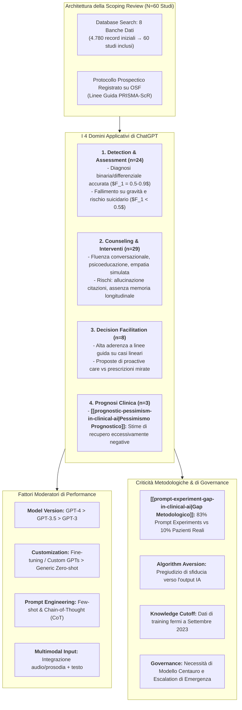
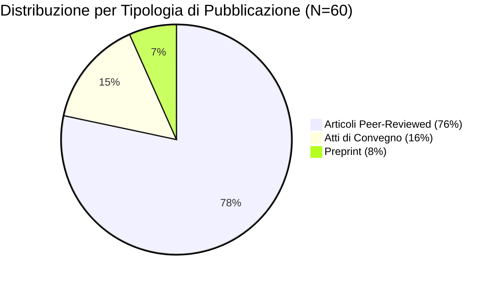
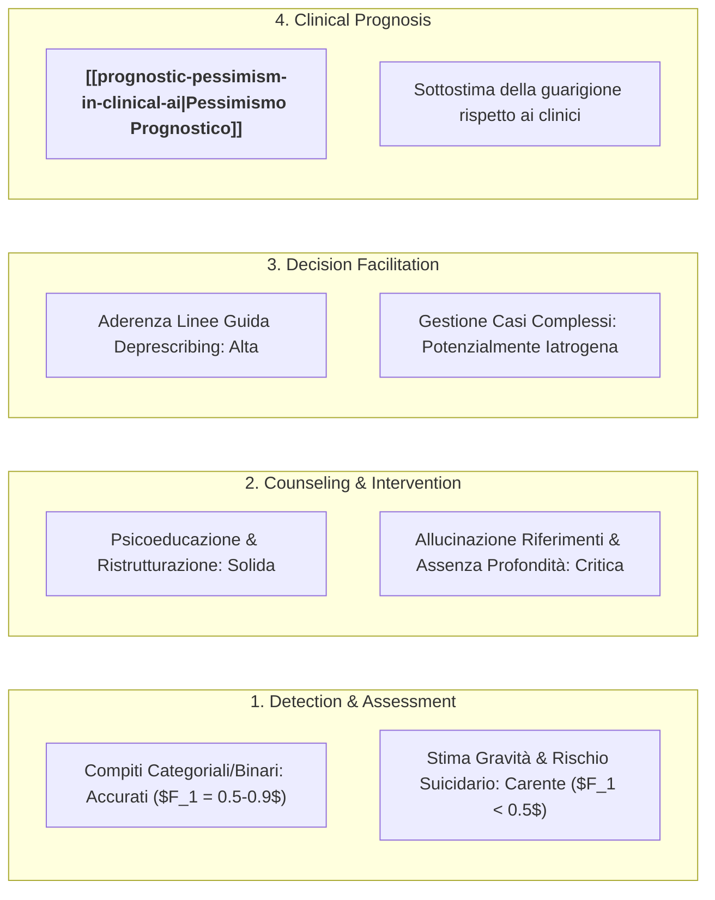
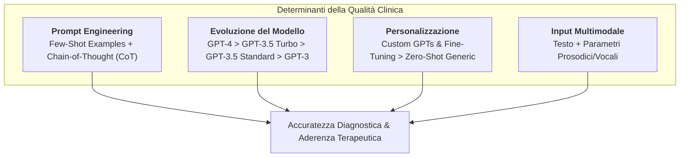
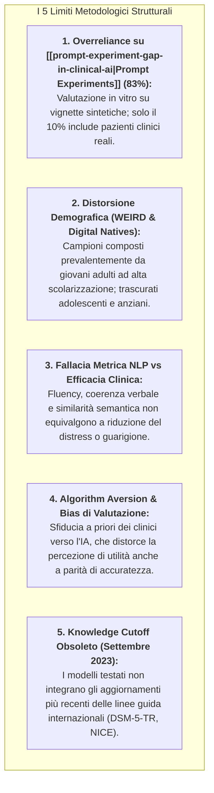

---
tags: [scoping-review, prisma-scr, chatgpt, large-language-models, mental-health-ai, clinical-decision-support, diagnostic-accuracy, counseling-chatbots, prognostic-pessimism, prompt-experiments, algorithmic-aversion, clinical-psychology, digital-mental-health]
source_papers: ["mental-v12-e81204.pdf"]
---

# ChatGPT Clinical Use in Mental Health Care: Scoping Review of Empirical Evidence (Balan & Gumpel, 2025)

## Definizione Operativa
- **Scoping Review sistematica** condotta secondo le linee guida **PRISMA-ScR** (*Preferred Reporting Items for Systematic Reviews and Meta-Analyses extension for Scoping Reviews*) e pubblicata su *JMIR Mental Health* (2025, vol. 12, e81204) da Raluca Balan e Thomas P. Gumpel (Seymour Fox School of Education, Hebrew University of Jerusalem; DOI: [10.2196/81204](https://doi.org/10.2196/81204)).
- **Oggetto e Ambito:** Prima mappatura esaustiva ed empirica dell'impiego clinico di ChatGPT in salute mentale, basata sull'inclusione di **60 studi primari** estratti da 8 banche dati internazionali (*Web of Science, PubMed, Scopus, PsycINFO, ACM Digital Library, IEEE Xplore, OATD, EBSCO, ProQuest*) fino ad aprile 2025 (protocollo registrato prospecticamente su Open Science Framework: [osf.io/z6kyg](https://osf.io/z6kyg)).
- **Tassonomia dei Domini Clinici Esaminati:**
  1. *Detection e Assessment (40%, n=24):* Screening sintomatico, classificazione diagnostica categoriale e differenziale, stima della gravità del disturbo e valutazione del rischio suicidario;
  2. *Counseling e Interventi Psicologici (48%, n=29):* Erogazione di psicoeducazione, ristrutturazione cognitiva, simulazione di colloqui empatici, formulazioni psicodinamiche e supporto terapeutico *standalone* o integrato;
  3. *Supporto alle Decisioni Cliniche (13%, n=8):* Aderenza alle linee guida evidence-based, pianificazione di piani di trattamento e gestione della deprescription (es. sospensione graduale delle benzodiazepine);
  4. *Prognosi e Previsione delle Traiettorie Cliniche (5%, n=3):* Stima delle probabilità di remissione, recupero e decorso a breve/lungo termine.
- **Contributi Chiave e Frontiere Critiche:** Evidenzia un marcato gradiente prestazionale: ChatGPT dimostra elevata accuratezza nella classificazione diagnostica binaria e differenziale (spesso eguagliando o superando i clinici umani), ma manifesta gravi vulnerabilità nella quantificazione della gravità, nella gestione del rischio suicidario e nei quadri clinici complessi. Formalizza inoltre due fenomeni sistemici di rilievo: il **[[prompt-experiment-gap-in-clinical-ai|gap dei prompt-experiments]]** (l'83.3% degli studi valuta vignette testuali sintetiche senza pazienti reali) e il **[[prognostic-pessimism-in-clinical-ai|pessimismo prognostico algoritmico]]** (tendenza sistematica di ChatGPT a stimare tassi di guarigione inferiori a quelli reali e clinici, rischiando la demoralizzazione del paziente).

---

## Evidenze dalla Letteratura

### 1. Metodologia di Selezione e Caratteristiche del Campione di Studi

- **Disegno di Ricerca:** Scoping review conforme agli standard metodologici Joanna Briggs Institute (JBI) e PRISMA-ScR, condotta per mappare sistematicamente la letteratura scientifica sull'uso clinico di ChatGPT (*Generative Pre-trained Transformer*, OpenAI).
- **Strategia di Ricerca e Flusso PRISMA:**
  - *Identificazione:* 4.780 record totali reperiti su 8 banche dati accademiche (Web of Science, PubMed, Scopus, PsycINFO, ACM DL, IEEE Xplore, OATD, EBSCO, ProQuest);
  - *Screening e De-duplicazione:* 2.342 abstract esaminati dopo rimozione duplicati $\rightarrow$ 2.149 esclusi;
  - *Full-text Eligibility:* 172 articoli a testo completo valutati in dettaglio da due revisori indipendenti secondo criteri Cochrane;
  - *Inclusione Finale:* **60 studi empirici primari** con outcome prestazionali quantitativi o qualitativi.

#### Sintesi Statistica delle Caratteristiche degli Studi (Tabella 1)

| Dimensione Analizzata | Categoria | Conteggio ($n$) | Percentuale (%) | Studi Esemplificativi |
| :--- | :--- | :--- | :--- | :--- |
| **Tipologia di Pubblicazione** | Peer-reviewed Journal | 47 | 78.3% | Cardamone et al., 2025; Kim et al., 2024; Levkovich, 2025 |
| | Conference Proceedings | 9 | 15.0% | Aragón et al., 2024; Berrezueta-Guzman et al., 2024; Tao et al., 2023 |
| | Preprint (arXiv / SSRN) | 4 | 6.7% | Lamichhane, 2023; Arcan et al., 2024; Spitale et al., 2024 |
| **Dominio Applicativo Primario** | Detection / Assessment | 24 | 40.0% | Elyoseph & Levkovich, 2023; Shin et al., 2024; Wei et al., 2023 |
| | Counseling e Trattamento | 29 | 48.3% | Alanzi et al., 2025; Kishimoto et al., 2025; Manole et al., 2024 |
| | Clinical Decision Support | 8 | 13.3% | Bužančić et al., 2024; Levkovich & Elyoseph, 2023; Galido et al., 2023 |
| | Prognosi Clinica | 3 | 5.0% | Elyoseph, Levkovich & Shinan-Altman, 2024; Levkovich, 2025 |
| **Focus Psicopatologico** | Salute Mentale Generale | 16 | 26.7% | Blyler & Seligman, 2024; Maurya et al., 2025; Naher, 2024 |
| | Depressione | 15 | 25.0% | Danner et al., 2023; Shin et al., 2024; Nedilko, 2023 |
| | Suicidio e Autolesionismo | 13 | 21.7% | Ghanadian et al., 2023; McBain et al., 2025; Van Meter et al., 2025 |
| | Disturbi d'Ansia | 8 | 13.3% | Alanzi et al., 2025; Levkovich et al., 2024; Kishimoto et al., 2025 |
| | Schizofrenia e Psicosi | 4 | 6.7% | El Haj et al., 2024; Galido et al., 2023; Elyoseph & Levkovich, 2024 |
| | Dipendenze da Sostanze | 3 | 5.0% | Giorgi et al., 2024; Russell et al., 2024; Spallek et al., 2023 |
| | Spettro Autistico (ASD) | 3 | 5.0% | He et al., 2024; McFayden et al., 2024; Wei et al., 2023 |
| | ADHD | 2 | 3.3% | Berrezueta-Guzman et al., 2024a, 2024b |
| | PTSD | 2 | 3.3% | Bartal et al., 2024; Levkovich, 2025 |
| | Altri (Bipolare, DOC, Insonnia) | 3 | 5.0% | Parker & Spoelma, 2024; Kim et al., 2024; Dergaa et al., 2023 |
| **Architettura ChatGPT** | Standard (Zero/Few-Shot) | 50 | 83.3% | Maggior parte degli studi su GPT-3.5 e GPT-4 |
| | Custom Instruction | 4 | 6.7% | Bartal et al., 2024; Shin et al., 2024; Ghanadian et al., 2023 |
| | Customized GPT (Agenti dedicati) | 6 | 10.0% | Berrezueta-Guzman et al., 2024; Heston, 2023; Manole et al., 2024 |
| **Disegno di Studio** | Prompt Experiments (Vignette) | 50 | 83.3% | Valutazione su prompt standardizzati senza utenti umani |
| | Trial Non Controllati | 5 | 8.3% | Alanzi et al., 2025; Alanezi, 2024; Manole et al., 2024 |
| | Trial Controllati (RCT) | 3 | 5.0% | Kishimoto et al., 2025; Melo et al., 2024; Wang & Li, 2024 |
| | Case Report / Case Study | 2 | 3.3% | Galido et al., 2023; Giray, 2025 |
| **Coinvolgimento Pazienti** | Nessuno (Simulazione) | 50 | 83.3% | Valutazione computazionale in vitro |
| | Popolazione Clinica Reale | 6 | 10.0% | Alanzi et al., 2025; Melo et al., 2024; Manole et al., 2024 |
| | Popolazione Generale | 4 | 6.7% | Giray, 2025; Kishimoto et al., 2025; Wang & Li, 2024 |
| **Elemento di Comparazione** | Modelli AI Concorrenti | 21 | 35.0% | Bard/Gemini, Claude, LLaMA-2, Bing Copilot, Chatbot a regole |
| | Professionisti della Salute Mentale | 19 | 31.7% | Psichiatri, Medici di Medicina Generale, Psicologi clinici |

---

### 2. Analisi Dettagliata dei Quattro Domini Clinici

#### A. Detection e Valutazione Psicopatologica (24 Studi)
- **Classificazione Categoriale e Differenziale:** Nei compiti di screening binario (presenza/assenza del disturbo) e diagnosi differenziale a coppie (es. ansia vs depressione, disturbo dello spettro autistico vs sindrome di Asperger), ChatGPT raggiunge punteggi $F_1$ compresi tra **0.50 e 0.90**.
  - In 4 studi, ChatGPT ha eguagliato o superato l'accuratezza diagnostica di medici generici e specialisti nel rilevare schizofrenia (El Haj et al., 2024), ansia infantile (Levkovich et al., 2024), DOC (Kim et al., 2024) e disturbi del neurosviluppo (Wei et al., 2023).
- **Vulnerabilità nei Compiti Dimensionali e di Rischio Acuto:** La performance crolla drasticamente ($F_1 < 0.50$) quando il modello è chiamato a:
  1. *Stimare la gravità dimensionale* della sintomatologia (Aragón et al., 2024);
  2. *Assegnare diagnosi su quadri clinici eterogenei o multi-comorbili* (Cardamone et al., 2025);
  3. *Valutare l'intenzionalità e l'escalation suicidaria* (Elyoseph & Levkovich, 2023; Lamichhane, 2023), tendendo a sottostimare il rischio imminente di tentativi anticonservativi.

#### B. Counseling e Interventi Psicologici (29 Studi)
- **Competenze Conversazionali e Micro-Abilità:** ChatGPT evidenzia una spiccata capacità di simulare un dialogo empatico, mantenere il flusso conversazionale, incoraggiare l'autonomia e applicare costrutti di psicoeducazione e reframing cognitivo (Maurya et al., 2025; Park et al., 2023).
- **Evidenze di Efficacia Sintomatica (4 Studi con Outcome Clinici):**
  - Due studi controllati hanno registrato una riduzione statisticamente significativa dell'ansia e un aumento della *self-compassion* (Kishimoto et al., 2025) e della qualità della vita (Melo et al., 2024).
  - Uno studio su anziani non ha evidenziato differenze rispetto al gruppo di controllo nella riduzione della tensione (Wang & Li, 2024), mentre un trial su ansia ha rilevato un miglioramento pre-post significativo con un GPT personalizzato (Manole et al., 2024).
- **Criticità Iatrogene e Limiti Strutturali:**
  - *Allucinazione di Riferimenti Bibliografici:* Tendenza pervasiva a fabbricare fonti, linee guida e risorse esterne inesistenti (*fabricated references*; Gravel et al., 2023);
  - *Superficialità e Mancanza di Memoria Longitudinale:* Assenza di contestualizzazione temporale a lungo termine e incapacità di sostenere processi di mentalizzazione complessi;
  - *Gestione del Rischio di Crisi:* Ritardi ingiustificati nell'invio a strutture di emergenza o risposte inadeguate in caso di *disclosure* suicidaria acuta (Heston, 2023; McBain et al., 2025).

#### C. Facilitazione delle Decisioni Cliniche (8 Studi)
- **Aderenza alle Linee Guida:** ChatGPT dimostra una rigorosa aderenza alle linee guida evidence-based nella gestione di quadri depressivi standard (Levkovich & Elyoseph, 2023) e nella deprescrizione graduale delle benzodiazepine (Bužančić et al., 2024), risultando talvolta più conforme alle raccomandazioni formali rispetto ai medici di base.
- **Stile Prescrittivo Proattivo:** Rispetto ai clinici umani (che privilegiano consulti psichiatrici mirati e modifiche farmacologiche puntuali), ChatGPT propone un ventaglio più ampio e proattivo di interventi integrati (medico curante, counselor, psicoterapeuta CBT, modifiche dello stile di vita).
- **Declino nei Casi Complessi:** La qualità delle raccomandazioni declina sensibilmente in presenza di insonnia cronica complessa o schizofrenia resistente al trattamento (Dergaa et al., 2023; Galido et al., 2023), generando suggerimenti potenzialmente controindicati.

#### D. Prognosi e Traiettorie di Malattia (3 Studi)
- **Il Fenomeno del [[prognostic-pessimism-in-clinical-ai|Pessimismo Prognostico]]:** In tutti gli studi dedicati alla prognosi (Elyoseph & Levkovich, 2024; Elyoseph, Levkovich & Shinan-Altman, 2024; Levkovich, 2025), ChatGPT ha formulato previsioni di recupero sistematicamente più negative e pessimistiche rispetto a quelle espresse da psichiatri esperti, psicologi e persino dal pubblico generale.
  - *ChatGPT-3.5:* Manifesta una visione eccessivamente negativa sugli outcome a breve termine;
  - *ChatGPT-4:* Mostra un pessimismo ancora più marcato sulla prognosi e sulla remissione a lungo termine.
- **Rischio Iatrogeno:** L'esposizione del paziente a prognosi algoritmiche infauste e ingiustificate rischia di indurre senso di impotenza appresa (*learned helplessness*), minando la speranza e la motivazione al trattamento (*treatment demoralization*).

---

### 3. Fattori Moderatori delle Performance di ChatGPT

1. **Prompt Engineering e Ragionamento Esplicito:** L'inclusione di esempi contestuali nel prompt (*few-shot prompting*) incrementa significativamente l'accuratezza di screening rispetto al *zero-shot* (Bartal et al., 2024; Shin et al., 2024). L'applicazione del paradigma **Chain-of-Thought (CoT)**, inducendo il modello a esplicitare il ragionamento clinico passo dopo passo, riduce i falsi positivi diagnostici (Shin et al., 2024).
2. **Generazione del Modello:** **GPT-4** costituisce la versione più solida ed empatica, con superiore allineamento evidence-based e sensibilità ai fattori di rischio clinico, sebbene mantenga difficoltà su disturbi psicotici ($F_1 = 0.55$; Levkovich, 2025). **GPT-3.5** mostra instabilità severa senza fine-tuning, mentre **GPT-3** offre benefici terapeutici marginali non superiori a semplici tecniche di rilassamento (Wang & Li, 2024).
3. **Customizzazione e Fine-Tuning:** I modelli ottimizzati su dati di dominio (*customized GPTs* o modelli con *custom instructions*) superano nettamente le istanze generiche di ChatGPT nella gestione dell'ADHD, dell'ansia e del supporto emotivo continuativo (Berrezueta-Guzman et al., 2024; Manole et al., 2024).
4. **Integrazione Multimodale:** L'arricchimento dell'input testuale con parametri acustici e prosodici (ritmo dell'eloquio e frequenza fondamentale) potenzia la capacità del modello di discriminare tra manifestazioni ansiose e depressive (Danner et al., 2023).

---

### 4. Limiti Metodologici della Letteratura ed Epistemologia Clinica

La review evidenzia profonde criticità metodologiche ed epistemologiche che impongono estrema cautela prima dell'adozione clinica su larga scala:

---

### 5. Guida all'Integrazione Clinica e Raccomandazioni di Governance

Balan & Gumpel (2025) delineano una matrice operativa per l'integrazione graduale e sicura di ChatGPT nei contesti assistenziali:

| Setting Sanitario / Target | Applicazioni Raccomandate (Safe & Effective) | Applicazioni Controindicate / Ad Alto Rischio | Livello di Supervisione Umana |
| :--- | :--- | :--- | :--- |
| **Centri di Counseling Universitario** | Psicoeducazione di primo livello; screening iniziale e triage per smistamento richieste; gestione carichi di picco. | Terapia *standalone* di crisi acute; gestione autonoma di breakdown psicotici o ideazione suicidaria. | **Stepped Care:** Supervisione continua con presa in carico umana immediata per punteggi di rischio medio-alti. |
| **Salute Mentale di Comunità (CSM)** | Strumento adiuvante (*adjunctive care*) per aree rurali o a basse risorse; tracking dell'aderenza e compiti a casa. | Diagnosi formale automatizzata; modifica autonoma dei dosaggi farmacologici. | **Human-in-the-Loop:** Revisione delle note e delle prescrizioni da parte dell'équipe multidisciplinare. |
| **Reparti Ospedalieri e SPDC** | Assistenza all'anamnesi iniziale (intake support); monitoraggio strutturato inter-seduta; supporto alla degenza. | Previsione della prognosi di dimissione (*prognostic pessimism bias*); gestione non presidiata di deliri. | **Massima Supervisione:** Solo compiti ausiliari di documentazione e supporto psicoeducativo. |

#### Principi di Governance e Salvaguardia
1. **Rifiuto dell'Uso Standalone Sostitutivo:** ChatGPT deve operare esclusivamente come strumento di supporto all'interno di un [[modello-centauro-clinico|modello centauro]], in cui il giudizio clinico e la responsabilità terapeutica rimangono saldamente in capo al professionista umano.
2. **Protocolli di Escalation Real-Time:** Obbligo di incorporare interruttori automatici di sicurezza che blocchino la generazione di testo e forniscano numeri di emergenza attivi in presenza di marcatori suicidari o autolesivi.
3. **Calibrazione Prognostica con Dati Longitudinali:** Divieto di utilizzare l'output prognostico di ChatGPT nella comunicazione con i pazienti senza una previa ricalibrazione basata su registri clinici longitudinali reali.
4. **Copartecipazione nello Sviluppo dei Prompt:** Coinvolgimento sistematico di clinici, psicoterapeuti e associazioni di pazienti nella progettazione di prompt clinici specializzati e framework di validazione continua.

---

## Riferimenti Bibliografici
- Balan, R., & Gumpel, T. P. (2025). ChatGPT Clinical Use in Mental Health Care: Scoping Review of Empirical Evidence. *JMIR Mental Health*, 12, e81204. https://doi.org/10.2196/81204
- Alanzi, T. M., Alharthi, A., Alrumman, S., et al. (2025). ChatGPT as a psychotherapist for anxiety disorders: an empirical study with anxiety patients. *Nutritional Health*, 31(3), 1111–1123. https://doi.org/10.1177/02601060241281906
- Aragón, M. E., Parapar, J., & Losada, D. E. (2024). Delving into the depths: evaluating depression severity through BDI-biased summaries. In *Proceedings of the 9th Workshop on Computational Linguistics and Clinical Psychology (CLPsych 2024)* (pp. 12–22).
- Bartal, A., Jagodnik, K. M., Chan, S. J., & Dekel, S. (2024). AI and narrative embeddings detect PTSD following childbirth via birth stories. *Scientific Reports*, 14(1), 8336. https://doi.org/10.1038/s41598-024-54242-2
- Berrezueta-Guzman, S., Kandil, M., Martín-Ruiz, M. L., Pau de la Cruz, I., & Krusche, S. (2024). Future of ADHD care: evaluating the efficacy of ChatGPT in therapy enhancement. *Healthcare*, 12(6), 683. https://doi.org/10.3390/healthcare12060683
- Bužančić, I., Belec, D., Držaić, M., et al. (2024). Clinical decision-making in benzodiazepine deprescribing by healthcare providers vs. AI-assisted approach. *British Journal of Clinical Pharmacology*, 90(3), 662–674. https://doi.org/10.1111/bcp.15963
- Cardamone, N. C., Olfson, M., Schmutte, T., et al. (2025). Classifying unstructured text in electronic health records for mental health prediction models: large language model evaluation study. *JMIR Medical Informatics*, 13, e65454. https://doi.org/10.2196/65454
- Danner, M., Hadzic, B., Gerhardt, S., et al. (2023). Advancing mental health diagnostics: GPT-based method for depression detection. In *2023 62nd Annual Conference of the Society of Instrument and Control Engineers (SICE)* (pp. 1290–1296).
- Dergaa, I., Fekih-Romdhane, F., Hallit, S., et al. (2023). ChatGPT is not ready yet for use in providing mental health assessment and interventions. *Frontiers in Psychiatry*, 14, 1277756. https://doi.org/10.3389/fpsyt.2023.1277756
- El Haj, M., Raffard, S., & Besche-Richard, C. (2024). Decoding schizophrenia: ChatGPT’s role in clinical and neuropsychological assessment. *Schizophrenia Research*, 267, 84–85. https://doi.org/10.1016/j.schres.2024.03.031
- Elyoseph, Z., & Levkovich, I. (2023). Beyond human expertise: the promise and limitations of ChatGPT in suicide risk assessment. *Frontiers in Psychiatry*, 14, 1213141. https://doi.org/10.3389/fpsyt.2023.1213141
- Elyoseph, Z., & Levkovich, I. (2024). Comparing the perspectives of generative AI, mental health experts, and the general public on schizophrenia recovery: case vignette study. *JMIR Mental Health*, 11, e53043. https://doi.org/10.2196/53043
- Elyoseph, Z., Levkovich, I., & Shinan-Altman, S. (2024). Assessing prognosis in depression: comparing perspectives of AI models, mental health professionals and the general public. *Family Medicine and Community Health*, 12(Suppl 1), e002583. https://doi.org/10.1136/fmch-2023-002583
- Galido, P. V., Butala, S., Chakerian, M., & Agustines, D. (2023). A case study demonstrating applications of ChatGPT in the clinical management of treatment-resistant schizophrenia. *Cureus*, 15(4), e38166. https://doi.org/10.7759/cureus.38166
- Ghanadian, H., Nejadgholi, I., & Al Osman, H. (2023). ChatGPT for suicide risk assessment on social media: quantitative evaluation of model performance, potentials and limitations. In *Proceedings of the 13th Workshop on Computational Approaches to Subjectivity, Sentiment, & Social Media Analysis* (pp. 172–183).
- Gravel, J., D’Amours-Gravel, M., & Osmanlliu, E. (2023). Learning to fake it: limited responses and fabricated references provided by ChatGPT for medical questions. *Mayo Clinic Proceedings: Digital Health*, 1(3), 226–234. https://doi.org/10.1016/j.mcpdig.2023.05.004
- Kim, J., Leonte, K. G., Chen, M. L., et al. (2024). Large language models outperform mental and medical health care professionals in identifying obsessive-compulsive disorder. *NPJ Digital Medicine*, 7(1), 193. https://doi.org/10.1038/s41746-024-01181-x
- Kishimoto, T., Hao, X., Chang, T., & Luo, Z. (2025). Single online self-compassion writing intervention reduces anxiety: with the feedback of ChatGPT. *Internet Interventions*, 39, 100810. https://doi.org/10.1016/j.invent.2025.100810
- Lamichhane, B. (2023). Evaluation of ChatGPT for NLP-based mental health applications. *arXiv preprint*, arXiv:2303.15727.
- Levkovich, I. (2025). Evaluating diagnostic accuracy and treatment efficacy in mental health: a comparative analysis of large language model tools and mental health professionals. *European Journal of Investigation in Health, Psychology and Education*, 15(1), 9. https://doi.org/10.3390/ejihpe15010009
- Levkovich, I., & Elyoseph, Z. (2023). Identifying depression and its determinants upon initiating treatment: ChatGPT versus primary care physicians. *Family Medicine and Community Health*, 11(4), e002391. https://doi.org/10.1136/fmch-2023-002391
- Levkovich, I., Rabin, E., Brann, M., & Elyoseph, Z. (2024). Large language models outperform general practitioners in identifying complex cases of childhood anxiety. *Digital Health*, 10, 20552076241294182. https://doi.org/10.1177/20552076241294182
- Manole, A., Cârciumaru, R., Brînzaș, R., & Manole, F. (2024). Harnessing AI in anxiety management: a chatbot-based intervention for personalized mental health support. *Information*, 15(12), 768. https://doi.org/10.3390/info15120768
- Maurya, R. K., Montesinos, S., Bogomaz, M., & DeDiego, A. C. (2025). Assessing the use of ChatGPT as a psychoeducational tool for mental health practice. *Counselling and Psychotherapy Research*, 25(1), e12759. https://doi.org/10.1002/capr.12759
- McBain, R. K., Cantor, J. H., Zhang, L. A., et al. (2025). Competency of large language models in evaluating appropriate responses to suicidal ideation: comparative study. *Journal of Medical Internet Research*, 27, e67891. https://doi.org/10.2196/67891
- Melo, A., Silva, I., & Lopes, J. (2024). ChatGPT: a pilot study on a promising tool for mental health support in psychiatric inpatient care. *International Journal of Psychiatric Trainees*, 2(2). https://doi.org/10.55922/001c.92367
- Park, H., Raymond Jung, M. W., Ji, M., Kim, J., & Oh, U. (2023). Muse alpha: primary study of AI chatbot for psychotherapy with socratic methods. In *2023 Congress in Computer Science, Computer Engineering, & Applied Computing (CSCE)* (pp. 2692–2693).
- Shin, D., Kim, H., Lee, S., Cho, Y., & Jung, W. (2024). Using large language models to detect depression from user-generated diary text data as a novel approach in digital mental health screening: instrument validation study. *Journal of Medical Internet Research*, 26, e54617. https://doi.org/10.2196/54617
- Wei, Q., Cui, Y., Wei, B., Cheng, Q., & Xu, X. (2023). Evaluating the performance of ChatGPT in differential diagnosis of neurodevelopmental disorders: a pediatricians-machine comparison. *Psychiatry Research*, 327, 115351. https://doi.org/10.1016/j.psychres.2023.115351

---

## Relazioni
- [[prognostic-pessimism-in-clinical-ai]]: Analisi approfondita del bias di pessimismo prognostico sistematico nei modelli generativi e dei rischi di demoralizzazione per il paziente.
- [[prompt-experiment-gap-in-clinical-ai]]: Disamina del divario metodologico tra benchmark sintetici su prompt e reale efficacia/sicurezza clinica su pazienti.
- [[clinical-readiness-gap-in-mh-chatbots]]: Divario tra fluenza linguistica computazionale ed evidenze cliniche rigorose negli agenti conversazionali.
- [[algorithmic-tractability-in-psychotherapy]]: Tassonomia della trattabilità computazionale dei disturbi mentali (Orrù & Mannarini, 2026).
- [[epistemological-paradox-in-clinical-ai]]: Il dilemma etico-metodologico della sperimentazione su popolazioni vulnerabili.
- [[CPP-33-e70242]]: Systematic review PRISMA di Orrù & Mannarini (2026) su AI e NLP in psicologia clinica.
- [[ai_v5i1e80348]]: Systematic review PRISMA 2020 di Cho et al. (2026) su metodologie ed etica dei chatbot LLM.
- [[ai-v5-e84305]]: Systematic review di Kandeel et al. (2026) su governance legale, GDPR e AI Act in salute mentale.
- [[modello-centauro-clinico]]: Paradigma di cooperazione Human-in-the-Loop tra terapeuta e intelligenza artificiale.
- [[sycophantic-mirroring]]: Meccanismo di validazione compiacente e distorsione del reality testing nei modelli linguistici.
- [[digital-therapeutic-alliance]]: Costrutto ed evidenze empiriche dell'alleanza di lavoro con agenti conversazionali.
