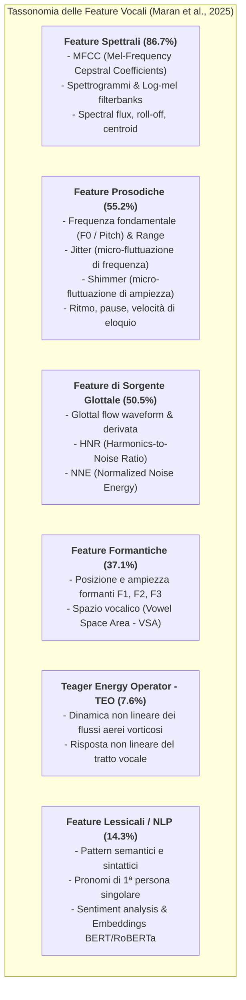
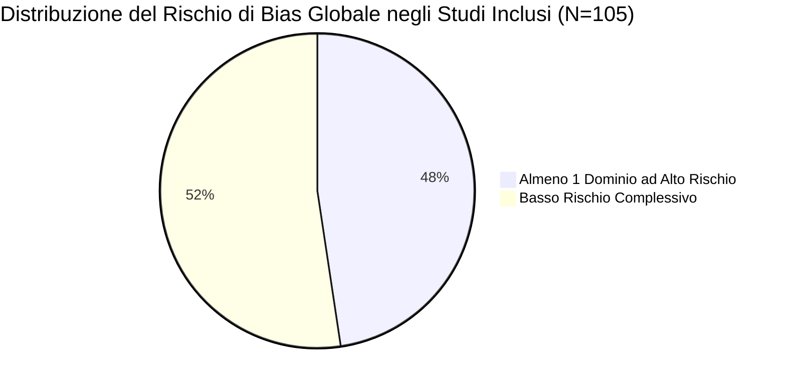

# Performance of Automatic Speech Analysis in Detecting Depression: Systematic Review and Meta-Analysis (Maran et al., 2025)

## Definizione Operativa
- **Revisione sistematica e meta-analisi** condotta secondo le linee guida **PRISMA-DTA** (*Preferred Reporting Items for Systematic Reviews and Meta-Analyses - Diagnostic Test Accuracy*) e registrata su PROSPERO (ID: [CRD42023444431](https://www.crd.york.ac.uk/PROSPERO/view/CRD42023444431)), pubblicata su *JMIR Mental Health* (ottobre 2025; 12:e67802; DOI: [10.2196/67802](https://doi.org/10.2196/67802)) dal gruppo di ricerca guidato da Patricia Laura Maran, María Dolores Braquehais e Amanda Rodríguez-Urrutia (*Vall d'Hebron Research Institute - VHIR, Universitat Autònoma de Barcelona, CIBERSAM, Galatea Clinic, Universitat Internacional de Catalunya*).
- **Oggetto e Ambito:** Rappresenta la **prima sintesi quantitativa esaustiva** delle prestazioni diagnostiche dell'analisi automatica del parlato (*Automatic Speech Analysis* - ASA / [[vocal-biomarkers-in-depression|biomarcatori vocali]]) per la rilevazione della depressione, includendo sia algoritmi di Machine Learning (ML) tradizionale sia architetture di Deep Learning (DL).
- **Corpus Esaminato e Metodologia di Selezione:**
  - *Ricerca Sistematica:* Screening su 8 banche dati (*MEDLINE, APA PsycInfo, Embase, CINAHL, IEEE Xplore, ACM Digital Library, Scopus, Google Scholar*) per il periodo gennaio 2013 – 1° aprile 2025.
  - *Selezione:* 1.345 record identificati $\rightarrow$ 872 unici dopo deduplicazione $\rightarrow$ 281 full-text valutati $\rightarrow$ **105 studi empirici inclusi** (55 paper di conferenza [52.4%], 48 articoli su riviste peer-reviewed [45.7%], 2 tesi di dottorato [1.9%]).
  - *Campione Complessivo:* 98 studi hanno riportato la dimensione campionaria con $N$ compreso tra 14 e 9.337 partecipanti (media 445.14, SD 1361.12; età media 37.47 anni; 60.8% donne; 45.9% soggetti depressi).
- **Innovazione Metodologica (Meta-Analisi a 3 Livelli):** Per superare la violazione dell'assunzione di indipendenza dovuta alla presenza di esperimenti multipli nello stesso studio, gli autori hanno applicato un **modello a effetti casuali a 3 livelli** (*Restricted Maximum Likelihood* - REML; Assink & Wibbelink, 2016; Van den Noortgate et al., 2013), modellando contemporaneamente la varianza campionaria, la varianza tra esperimenti entro lo stesso studio e la varianza tra popolazioni di studi diversi. Inoltre, per contrastare il *reporting bias* e la sovrastima delle performance, hanno estratto sia i valori minimi che massimi riportati.
- **Rilievi Chiave e Posizionamento Clinico:**
  - *Metriche Pooled:* L'accuratezza media aggregata oscilla tra **0.66** (minimi pooled, 95% CI 0.63–0.69) e **0.81** (massimi pooled, 95% CI 0.79–0.83). La sensibilità varia tra **0.63** e **0.84**, la specificità tra **0.60** e **0.83**, e la precisione tra **0.64** e **0.81**.
  - *Feature e Algoritmi Superiori:* Le feature basate sull'operatore energetico di Teager (**[[vocal-biomarkers-in-depression#teager-energy-operator-teo|Teager Energy Operator - TEO]]**, che cattura i flussi d'aria non lineari nel tratto vocale) e le architetture Deep Learning (**CNN e DNN**) superano significativamente gli altri approcci ($P=.04$).
  - *Verdetto Clinico:* L'ASA dimostra elevate potenzialità come **strumento complementare di screening e monitoraggio** (in medicina generale, telemedicina e contesti a basso accesso), ma la sua maturità per l'uso clinico autonomo (*standalone diagnostic tool*) rimane limitata da opacità algoritmica, bias dei dataset e predominanza del **[[self-report-proxy-bias-in-ai|proxy bias da questionari]]** rispetto a diagnosi cliniche strutturate.

```mermaid
flowchart TD
    subgraph InputSpeech ["Segnale Vocale & Task di Elicitazione"]
        S1["Free Speech / Intervista Spontanea (72.4%)"]
        S2["Compiti di Lettura Standardizzata (36.2%)"]
        S3["Conteggio & Vocali Sostenute (4.8%)"]
    end

    subgraph FeatureExtraction ["Estrazione Feature Acustiche & Lessicali"]
        F1["Spettrali (86.7%): MFCC, Spettrogrammi, Spectral Roll-off"]
        F2["Prosodiche (55.2%): Pitch/F0, Jitter, Shimmer, Intensità"]
        F3["Sorgente Glottale (50.5%) & Formanti F1-F3 (37.1%)"]
        F4["<b>Teager Energy Operator - TEO (7.6%)</b><br/><i>Migliore performance (P=.04)</i>"]
        F5["Lessicali/NLP (14.3%): BERT, RoBERTa, Sentiment"]
    end

    subgraph AIClassifiers ["Architetture di Classificazione AI"]
        A1["Support Vector Machine - SVM (41.0%)"]
        A2["<b>Convolutional Neural Networks - CNN (14.3%)</b>"]
        A3["<b>Deep Neural Networks - DNN (9.5%)</b>"]
        A4["Logistic Regression (13.3%) & Random Forest (10.5%)"]
        A5["GMM (8.6%), Ensemble (6.7%), KNN/MLP/Naive Bayes"]
    end

    subgraph MetaAnalysis ["Sintesi Quantitativa: Meta-Analisi a 3 Livelli (N=105)"]
        M1["Accuratezza Pooled: <b>0.66 - 0.81</b> (I² = 96.74%)"]
        M2["Sensibilità Pooled: <b>0.63 - 0.84</b> (I² = 99.93%)"]
        M3["Specificità Pooled: <b>0.60 - 0.83</b> (I² = 99.81%)"]
        M4["Precisione Pooled: <b>0.64 - 0.81</b> (I² = 99.81%)"]
    end

    subgraph CriticalBottlenecks ["Criticità Metodologiche & Bias Epistemici"]
        B1["<b>[[self-report-proxy-bias-in-ai|Proxy Bias da Questionario]]:</b> 70.5% usa PHQ/BDI invece di DSM/MINI/SCID"]
        B2["<b>Limiti di DAIC-WOZ:</b> Sbilanciamento classi (4:1) e genere (5:8 vs 2:7)"]
        B3["<b>Opacità & Mancanza di XAI:</b> Solo 2 studi usano LIME/SHAP"]
        B4["<b>Rischio di Bias QUADAS-2:</b> 47.6% ad alto rischio; 93.3% dati preprocessing carenti"]
    end

    InputSpeech --> FeatureExtraction
    FeatureExtraction --> AIClassifiers
    AIClassifiers --> MetaAnalysis
    MetaAnalysis --> CriticalBottlenecks
```

---

## Evidenze dalla Letteratura

### 1. Inquadramento Clinico ed Epidemiologico
- **Epidemiologia e Burden Globale:** Il Disturbo Depressivo Maggiore (MDD) colpisce circa **280 milioni di persone nel mondo** (3.8% della popolazione globale; WHO, 2008), costituendo una delle cause primarie di disabilità, perdita di produttività e mortalità prematura (Greenberg & Birnbaum, 2005; Evans-Lacko & Knapp, 2016). I pazienti depressi presentano un rischio di suicidio **20 volte superiore** alla popolazione generale (Lépine & Briley, 2011) e un'aspettativa di vita ridotta di 5-10 anni in presenza di comorbilità croniche (Moussavi et al., 2007; Chang et al., 2010).
- **Limiti della Diagnostica Tradizionale:**
  - L'assessment basato su criteri operazionali manualizzati (DSM-5-TR, ICD-11) mostra una modesta affidabilità inter-rater nei trial clinici di campo (*interrater reliability*; Regier et al., 2013).
  - Gli strumenti di screening self-report (come il PHQ-9) sono soggetti a distorsioni mnestiche, bias dell'intervistatore e **mascheramento intenzionale o inavvertito dei sintomi** da parte del paziente (Cummins et al., 2015).
  - La drammatica carenza globale di specialisti della salute mentale (circa 9 psichiatri per 100.000 abitanti nei paesi ad alto reddito e meno di 0.1 per 1.000.000 nei paesi a basso reddito; Oladeji & Gureje, 2016; Wainberg et al., 2017) impedisce l'intercettazione precoce del disturbo.
- **Razionale dell'Analisi Automatica del Parlato (ASA):**
  1. *Non invasività e ubiquità:* La voce può essere acquisita tramite comuni smartphone e computer senza ricorrere a costosi dispositivi indossabili o neuroimaging;
  2. *Resistenza alla manipolazione cosciente:* La depressione altera la coordinazione neuromotoria dell'apparato fono-articolatorio (rallentamento psicomotorio, riduzione della pressione subglottica, perdita di modulazione prosodica) e la microdinamica non lineare dei flussi aerei;
  3. *Doppia finestra osservativa:* Il parlato veicola simultaneamente *cosa viene detto* (contenuto lessicale/semantico) e *come viene detto* (proprietà acustiche, dinamica motoria glottale);
  4. *Invarianza biologica trans-linguistica:* L'anatomia dell'apparato vocale condivisa a livello di specie favorisce l'estrazione di marcatori acustici stabili tra lingue differenti (Low et al., 2020).

---

### 2. Metodologia di Revisione Sistematica e Meta-Analisi a 3 Livelli

#### A. Strategia di Ricerca e Criteri di Selezione
- Screening su 8 banche dati biomediche, ingegneristiche e computazionali (*MEDLINE, APA PsycInfo, Embase, CINAHL, IEEE Xplore, ACM Digital Library, Scopus, Google Scholar*) dal 2013 al 1° aprile 2025.
- Criteri di inclusione: studi primari in lingua inglese che valutano l'accuratezza diagnostica dell'ASA per la depressione riportando metriche complete (accuratezza, sensibilità, specificità, precisione o matrice di confusione). Sono stati inclusi journal paper, atti di conferenze e tesi di dottorato, escludendo preprint, review, editoriali e studi multimodali privi di scomposizione univariata della modalità audio.

#### B. Modello Meta-Analitico a Tre Livelli (REML)
Nelle rassegne di machine learning diagnostico, i singoli studi conducono frequentemente decine di esperimenti combinando feature, filtri e classificatori differenti. L'applicazione di meta-analisi convenzionali a 2 livelli violerebbe l'assunzione di indipendenza delle stime (Wilson & Lipsey, 2001).
Gli autori hanno implementato un modello a 3 livelli con il pacchetto `metafor` in R (Assink & Wibbelink, 2016; Van den Noortgate et al., 2013):
- **Livello 1:** Varianza di campionamento delle singole stime (*sampling error*);
- **Livello 2:** Varianza tra gli esperimenti condotti all'interno dello stesso studio (*within-study variance*);
- **Livello 3:** Varianza tra i diversi studi inclusi (*between-study variance*).

Inoltre, anziché selezionare unicamente la performance migliore (che genera un'evidente distorsione ottimistica nella letteratura; Liu et al., 2024), sono stati stimati separatamente il **pooled mean dei valori massimi** e il **pooled mean dei valori minimi** per ciascuna metrica.

---

### 3. Caratteristiche degli Studi Inclusi (N=105)

| Dimensione Analizzata | Distribuzione e Dati Quantitativi | Note Metodologiche & Trend |
| :--- | :--- | :--- |
| **Distribuzione Temporale** | 2013–2020: 27.6% (29/105) 2021–2023: 52.4% (55/105) 2024–2025: 16.2% (17/105) | Picco nel biennio 2022–2023 (20% ciascun anno); forte espansione post-avvento architetture Deep Learning/Transformer. |
| **Origine Geografica** | Cina (31.4%), India (11.4%), Ungheria (9.5%), Australia (5.7%), USA (5.7%), Malesia (4.8%), Corea del Sud (3.8%), UK (3.8%), Francia/Germania/Turchia (2.9% cad.), altri 10 paesi (0.95% cad.) | Chiara predominanza asiatica ed europea; l'Ungheria emerge come polo specializzato grazie al corpus DEPISDA. |
| **Tipologia Editoriale** | Conference papers: 52.4% (55/105) Journal papers: 45.7% (48/105) Tesi di dottorato: 1.9% (2/105) | Oltre la metà della letteratura proviene da atti congressuali di ingegneria/signal processing (ICASSP, INTERSPEECH, EMBC). |
| **Campione Partecipanti** | Range: 14 – 9.337 partecipanti Media: 445.14 ($SD = 1361.12$) Età media: 37.47 anni ($SD = 10.41$) Percentuale femminile: 60.8% ($SD = 15.6$) | Il 66.7% degli studi dispone di un campione statisticamente adeguato; prevalenza media di soggetti depressi = 45.9% ($SD = 11.9$). |
| **Task Vocale Elicitante** | Free speech / intervista: 72.4% (76/105) Lettura di testi: 36.2% (38/105) Conteggio numerico: 2.9% (3/105) Vocali sostenute: 1.9% (2/105) | Il parlato libero e spontaneo è di gran lunga il paradigma più informativo, consentendo l'analisi della prosodia conversazionale e delle pause. |
| **Tipologia di Dataset** | Handcrafted / Privati: 53.3% (56/105) DAIC-WOZ: 33.3% (35/105) AVEC Challenges: 9.5% (10/105) MODMA: 9.5% (10/105) CONVERGE (2.9%), DEPISDA (2.9%), ORI-DB (1.9%) | Più della metà degli studi usa dataset proprietari non condivisi; DAIC-WOZ domina i benchmark aperti. |
| **Strumento di Ground Truth** | PHQ-8 / PHQ-9: 48.6% (51/105) BDI / BDI-II: 21.9% (23/105) HAM-D: 9.5% (10/105) DSM / DSM-IV: 9.5% (10/105) CIDI: 3.8% (4/105), MINI: 2.9% (3/105) | **Oltre il 70% impiega questionari self-report** come proxy diagnostico; meno del 17% fa ricorso a interviste cliniche strutturate. |
| **Metodo di Validazione** | Hold-out cross-validation: 61.0% (64/105) K-fold cross-validation: 36.2% (38/105) Leave-one-out CV: 17.1% (18/105) Nested cross-validation: 1.9% (2/105) | La nested cross-validation (standard di riferimento per prevenire data leakage) è applicata in meno del 2% degli studi. |

---

### 4. Tassonomia delle Feature Vocali e Algoritmi di Intelligenza Artificiale

#### A. Algoritmi di Classificazione Più Utilizzati
1. **Support Vector Machine (SVM, 41.0%):** Algoritmo predominante nel ML classico, apprezzato per la solidità nella gestione di dati ad alta dimensionalità e dataset di dimensioni ridotte.
2. **Convolutional Neural Networks (CNN, 14.3%):** Impiegate per elaborare rappresentazioni visivo-spettrali (spettrogrammi 2D, matrici mel).
3. **Logistic Regression (13.3%) & Random Forest (10.5%):** Modelli lineari ed ensemble usati per benchmarking e selezione delle feature.
4. **Deep Neural Networks (DNN / MLP, 9.5% / 6.7%):** Reti dense multistrato per l'apprendimento di feature gerarchiche.
5. **Gaussian Mixture Models (GMM, 8.6%):** Storicamente usati per la modellizzazione di distribuzioni di densità acustica (i-vectors).
6. **Architetture Sequenziali & Transformer (LSTM 2.9%, RNN 1.9%, wav2vec 2.0 / Speechformer):** Modelli emergenti orientati alla dinamica temporale del parlato.

---

### 5. Risultati Quantitativi della Meta-Analisi a 3 Livelli

La meta-analisi ha quantificato le prestazioni aggregate separando le stime più ottimistiche (*highest estimates*) da quelle più conservative (*lowest estimates*) riportate negli studi:

| Metrica Diagnostica | Stime Massime Pooled (Highest) | 95% CI | Eterogeneità ($I^2$) | Stime Minime Pooled (Lowest) | 95% CI | Eterogeneità ($I^2$) |
| :--- | :--- | :--- | :--- | :--- | :--- | :--- |
| **Accuratezza (Accuracy)** | **0.81** (86 studi, 148 stime, $N=27.039$) | [0.79, 0.83] | 96.74% ($P<.001$) | **0.66** (65 studi, 114 stime, $N=16.394$) | [0.63, 0.69] | 94.44% ($P<.001$) |
| **Sensibilità (Sensitivity)** | **0.84** (81 studi, 135 stime, $N=36.096$) | [0.81, 0.86] | 99.93% ($P<.001$) | **0.63** (64 studi, 105 stime, $N=25.913$) | [0.58, 0.68] | 99.93% ($P<.001$) |
| **Specificità (Specificity)** | **0.83** (47 studi, 77 stime, $N=20.207$) | [0.79, 0.86] | 99.81% ($P<.001$) | **0.60** (34 studi, 55 stime, $N=10.553$) | [0.55, 0.66] | 97.81% ($P<.001$) |
| **Precisione (Precision)** | **0.81** (62 studi, 95 stime, $N=24.696$) | [0.77, 0.84] | 99.81% ($P<.001$) | **0.64** (46 studi, 73 stime, $N=22.215$) | [0.58, 0.70] | 99.81% ($P<.001$) |

#### B. Evidenze da Meta-Regressioni e Analisi di Sottogruppo
- **Superiorità delle Feature TEO ($P = .04$ per accuratezza, $P = .05$ per sensibilità, $P = .004$ per specificità):** Le feature basate sull'operatore energetico di Teager hanno dimostrato metriche aggregate statisticamente superiori rispetto alle altre feature acustiche convenzionali (MFCC, pitch, formanti). La teoria acustica di Teager & Teager (1990) evidenzia che la fonazione umana non è un processo puramente lineare, ma genera flussi d'aria a vortice nel tratto vocale la cui complicanza biomeccanica è sensibilissima alle variazioni toniche indotte dalla depressione.
- **Superiorità delle Architetture Deep Learning ($P = .04$):** CNN e DNN hanno superato gli algoritmi lineari convenzionali nell'accuratezza massima, mentre il classificatore Naïve Bayes ha mostrato le prestazioni peggiori.
- **Confronto con Meta-Analisi Precedenti:** La meta-analisi di Liu et al. (2024) aveva riportato un'accuratezza aggregata superiore pari a 0.87; tuttavia, tale rassegna era ristretta a soli 8 studi, esclusivamente di Deep Learning e limitati ad articoli su riviste dotati di matrici di confusione complete, selezionando solo la performance di punta. La presente meta-analisi (105 studi) fornisce un quadro ecologico più realistico e non inflazionato.

---

### 6. Valutazione del Rischio di Bias (QUADAS-2 Modificato)

Gli autori hanno valutato la qualità metodologica tramite la versione modificata dello strumento **QUADAS-2** (*Quality Assessment of Studies of Diagnostic Accuracy-Revised*; Abd-Alrazaq et al., 2023):

1. **Dominio Partecipanti (46.7% ad alto o incerto rischio):** Sebbene l'81% abbia impiegato campionamenti consecutivi o casuali e il 66.7% disponesse di numerosità adeguata, molti studi non hanno garantito una rappresentazione bilanciata o hanno introdotto esclusioni improprie.
2. **Dominio Index Test / Algoritmi (94.3% a basso rischio):** Tutti gli studi (100%) hanno descritto dettagliatamente i modelli AI impiegati e il 94.3% ha specificato chiaramente le feature estratte; tuttavia, nel **74.3% degli studi i dati erano insufficienti per verificare che l'estrazione delle feature fosse condotta in cieco rispetto all'outcome clinico**.
3. **Dominio Reference Standard (81% a basso rischio):** Il 91.4% ha impiegato standard di riferimento appropriati per la classificazione, ma nell'**81% degli studi mancavano informazioni sufficienti per garantire un intervallo temporale adeguato tra la registrazione vocale e l'assessment clinico** (problema di latenza diagnostica).
4. **Dominio Analisi dei Dati (43.8% a basso rischio / 56.2% critico):** Solo il **21.9% degli studi ha incluso tutti i partecipanti arruolati nell'analisi finale**; inoltre, nel **93.3% dei lavori le informazioni sul preprocessing dei dati acustici (filtraggio rumore, segmentazione, normalizzazione) erano inadeguate o omesse**.
5. **Applicabilità Clinica:** I timori di applicabilità sono risultati generalmente bassi (92.4% basso rischio nei partecipanti, 97.1% nell'index test, 92.4% nell'outcome).

---

### 7. Snodi Critici, Bias dei Dataset e Sfide di Implementazione

#### A. Il [[self-report-proxy-bias-in-ai|Proxy Bias da Questionari Self-Report]]
- Il 70.5% degli studi utilizza scale compilate dal paziente (PHQ-8/PHQ-9 o BDI/BDI-II) con cut-off arbitrari come "ground truth" per definire la depressione.
- I questionari self-report misurano la severità soggettiva dei sintomi o il distress contingente, ma **non equivalgono a una diagnosi psichiatrica formale** di Disturbo Depressivo Maggiore.
- L'algoritmo finisce quindi per ottimizzarsi sulla **predizione del punteggio del questionario** anziché sui tratti patognomonici del disturbo clinico, apprendendo correlazioni spurie tra inflessioni vocali e risposte a specifici item.

#### B. La Dipendenza Critica dal Dataset DAIC-WOZ
Il dataset DAIC-WOZ (Gratch et al., 2014), utilizzato da un terzo degli studi (33.3%), presenta profonde distorsioni strutturali:
1. *Campionamento non clinico:* Interviste condotte da un avatar virtuale (*Ellie*) su volontari classificati solo tramite PHQ-8;
2. *Grave sbilanciamento di classe:* Rapporto di circa **4:1** tra soggetti sani e soggetti depressi (Ndaba, 2023);
3. *Bias di genere incrociato:* Prevalenza depressiva fortemente asimmetrica per sesso (circa 5:8 tra le femmine vs 2:7 tra i maschi; Bailey & Plumbley, 2021);
4. *Rischio di overfitting demografico:* Gli algoritmi rischiano di apprendere caratteristiche acustiche legate al genere femminile o all'identità del parlatore (*speaker identity dominance*; Zuo & Mak, 2023) scambiandole per marcatori depressivi.

#### C. Negligenza della Dimensione Lessicale/Multimodale
- L'85.7% degli studi si focalizza unicamente su parametri bio-acustici, ignorando le feature lessicali.
- La linguistica computazionale dimostra che la depressione si manifesta potentemente nella struttura semantica (iper-focalizzazione sul sé con pronomi di 1ª persona singolare *"io/mio"*, prevalenza di termini a valenza negativa e costrutti assolutistici; Davey & Harrison, 2022).
- L'integrazione di modelli linguistici avanzati (BERT, RoBERTa, wav2vec 2.0) per combinare *cosa viene detto* con *come viene detto* rappresenta la frontiera a più alto potenziale (Kurniadi et al., 2024; Xing et al., 2025).

#### D. Opacità ("Black Box") e Carenza di Explainable AI (XAI)
- Le architetture Deep Learning operano come scatole nere non interpretabili (Sheu, 2020), ostacolando la fiducia clinica (*clinical trust*) e l'adozione nei flussi di lavoro sanitari.
- Su 105 studi, **soltanto 2 hanno integrato tecniche di XAI**: Verde et al. (2024) mediante **LIME** (*Local Interpretable Model-Agnostic Explanations*) e Lin et al. (2022) mediante **SHAP** (*Shapley Additive Explanations*).

#### E. Il Framework NASSS e la Governance Etico-Legale
Maran et al. inquadrano la traslazione clinica dell'ASA attraverso il framework **NASSS** (*Non-Adoption, Abandonment, Scale-Up, Spread, and Sustainability*; Greenhalgh et al., 2017):
- *Readiness organizzativa:* Impatto sui flussi di lavoro dei medici di medicina generale e prevenzione del burnout da allarmi;
- *Tutela della privacy e GDPR:* Risoluzione del rischio di ricostruzione della voce grezza dal segnale elaborato tramite **estrazione di feature de-identificate irreversibili** (Vázquez-Romero & Gallardo-Antolín, 2020) o algoritmi federati (*Federated Learning* ed elaborazione *on-device*; Bn & Abdullah, 2022);
- *Integrazione nella Psichiatria Stratificata:* L'ASA non deve sostituire il colloquio psichiatrico, ma essere combinata con biomarcatori digitali multi-fonte (wearable, actigrafia, cartelle cliniche elettroniche, profilo infiammatorio/genetico) per il triage e il monitoraggio delle ricadute inter-visita.

---

## Riferimenti Bibliografici
- Maran, P. L., Braquehais, M. D., Vlaic, A., Alonzo-Castillo, M. T., Vendrell-Serres, J., Ramos-Quiroga, J. A., & Rodríguez-Urrutia, A. (2025). Performance of Automatic Speech Analysis in Detecting Depression: Systematic Review and Meta-Analysis. *JMIR Mental Health*, 12, e67802. https://doi.org/10.2196/67802
- Abd-Alrazaq, A., AlSaad, R., Shuweihdi, F., Ahmed, A., Aziz, S., & Sheikh, J. (2023). Systematic review and meta-analysis of performance of wearable artificial intelligence in detecting and predicting depression. *NPJ Digital Medicine*, 6(1), 84. https://doi.org/10.1038/s41746-023-00828-5
- Assink, M., & Wibbelink, C. J. M. (2016). Fitting three-level meta-analytic models in R: a step-by-step tutorial. *The Quantitative Methods for Psychology*, 12(3), 154–174. https://doi.org/10.20982/tqmp.12.3.p154
- Bailey, A., & Plumbley, M. D. (2021). Gender bias in depression detection using audio features. *29th European Signal Processing Conference (EUSIPCO)*, 23–27. https://doi.org/10.23919/eusipco54536.2021.9615933
- Bn, S., & Abdullah, S. (2022). Privacy sensitive speech analysis using federated learning to assess depression. *ICASSP 2022*, 9746827. https://doi.org/10.1109/icassp43922.2022.9746827
- Chang, C., Hayes, R. D., Broadbent, M., et al. (2010). All-cause mortality among people with serious mental illness (SMI), substance use disorders, and depressive disorders in southeast London: a cohort study. *BMC Psychiatry*, 10(1), 77. https://doi.org/10.1186/1471-244X-10-77
- Cummins, N., Scherer, S., Krajewski, J., Schnieder, S., Epps, J., & Quatieri, T. (2015). A review of depression and suicide risk assessment using speech analysis. *Speech Communication*, 71, 10–49. https://doi.org/10.1016/j.specom.2015.03.004
- Davey, C. G., & Harrison, B. J. (2022). The self on its axis: a framework for understanding depression. *Translational Psychiatry*, 12(1), 23. https://doi.org/10.1038/s41398-022-01790-8
- Evans-Lacko, S., & Knapp, M. (2016). Global patterns of workplace productivity for people with depression: absenteeism and presenteeism costs across eight diverse countries. *Social Psychiatry and Psychiatric Epidemiology*, 51(11), 1525–1537. https://doi.org/10.1007/s00127-016-1278-4
- Gratch, J., Artstein, R., Lucas, G., et al. (2014). The distress analysis interview corpus of human and computer interviews. *LREC 2014*, 3123–3128.
- Greenberg, P., & Birnbaum, H. (2005). The economic burden of depression in the US: societal and patient perspectives. *Expert Opinion on Pharmacotherapy*, 6(3), 369–376. https://doi.org/10.1002/9783527619672.ch3
- Greenhalgh, T., Wherton, J., Papoutsi, C., et al. (2017). Beyond adoption: a new framework for theorizing and evaluating nonadoption, abandonment, and challenges to the scale-up, spread, and sustainability of health and care technologies. *Journal of Medical Internet Research*, 19(11), e367. https://doi.org/10.2196/jmir.8775
- Kurniadi, F., Paramita, N., Sihotang, E., et al. (2024). BERT and RoBERTa models for enhanced detection of depression in social media text. *Procedia Computer Science*, 245, 202–209. https://doi.org/10.1016/j.procs.2024.10.244
- Lépine, J. P., & Briley, M. (2011). The increasing burden of depression. *Neuropsychiatric Disease and Treatment*, 7(Suppl 1), 3–7. https://doi.org/10.2147/NDT.S19617
- Lin, Y., Liyanage, B. N., Sun, Y., et al. (2022). A deep learning-based model for detecting depression in senior population. *Frontiers in Psychiatry*, 13, 1016676. https://doi.org/10.3389/fpsyt.2022.1016676
- Liu, L., Liu, L., Wafa, H., Tydeman, F., Xie, W., & Wang, Y. (2024). Diagnostic accuracy of deep learning using speech samples in depression: a systematic review and meta-analysis. *Journal of the American Medical Informatics Association*, 31(10), 2394–2404. https://doi.org/10.1093/jamia/ocae189
- Low, D. M., Bentley, K. H., & Ghosh, S. S. (2020). Automated assessment of psychiatric disorders using speech: a systematic review. *Laryngoscope Investigative Otolaryngology*, 5(1), 96–116. https://doi.org/10.1002/lio2.354
- McInnes, M. D. F., Moher, D., Thombs, B. D., et al. (2018). Preferred reporting items for a systematic review and meta-analysis of diagnostic test accuracy studies: the PRISMA-DTA statement. *JAMA*, 319(4), 388–396. https://doi.org/10.1001/jama.2017.19163
- Moussavi, S., Chatterji, S., Verdes, E., et al. (2007). Depression, chronic diseases, and decrements in health: results from the World Health Surveys. *The Lancet*, 370(9590), 851–858. https://doi.org/10.1016/S0140-6736(07)61415-9
- Ndaba, S. (2023). Class imbalance handling techniques used in depression prediction and detection. *International Journal of Data Mining & Knowledge Management Process*, 13(1/2), 17–33. https://doi.org/10.5121/ijdkp.2023.13202
- Oladeji, B. D., & Gureje, O. (2016). Brain drain: a challenge to global mental health. *BJPsych International*, 13(3), 61–63. https://doi.org/10.1192/s2056474000001240
- Regier, D. A., Narrow, W. E., Clarke, D. E., et al. (2013). DSM-5 field trials in the United States and Canada, part II: test-retest reliability of selected categorical diagnoses. *American Journal of Psychiatry*, 170(1), 59–70. https://doi.org/10.1176/appi.ajp.2012.12070999
- Sheu, Y. (2020). Illuminating the black box: interpreting deep neural network models for psychiatric research. *Frontiers in Psychiatry*, 11, 551299. https://doi.org/10.3389/fpsyt.2020.551299
- Teager, H., & Teager, S. (1990). Evidence for nonlinear sound production mechanisms in the vocal tract. In *Speech Production and Speech Modelling* (pp. 241–261). Springer.
- Van den Noortgate, W., López-López, J. A., Marín-Martínez, F., & Sánchez-Meca, J. (2013). Three-level meta-analysis of dependent effect sizes. *Behavior Research Methods*, 45(2), 576–594. https://doi.org/10.3758/s13428-012-0261-6
- Vázquez-Romero, A., & Gallardo-Antolín, A. (2020). Automatic detection of depression in speech using ensemble convolutional neural networks. *Entropy*, 22(6), 688. https://doi.org/10.3390/e22060688
- Verde, L., Marulli, F., De Fazio, R., Campanile, L., & Marrone, S. (2024). HEAR set: a lightweight acoustic parameters set to assess mental health from voice analysis. *Computers in Biology and Medicine*, 182, 109021. https://doi.org/10.1016/j.compbiomed.2024.109021
- Wainberg, M. L., Scorza, P., Shultz, J. M., et al. (2017). Challenges and opportunities in global mental health: a research-to-practice perspective. *Current Psychiatry Reports*, 19(5), 28. https://doi.org/10.1007/s11920-017-0780-z
- Xing, Y., He, R., Zhang, C., & Tan, P. (2025). Hierarchical multi-task learning based on interactive multi-head attention feature fusion for speech depression recognition. *IEEE Access*, 13, 51208–51219. https://doi.org/10.1109/access.2025.3551549
- Zuo, L., & Mak, M. (2023). Avoiding dominance of speaker features in speech-based depression detection. *Pattern Recognition Letters*, 173, 50–56. https://doi.org/10.1016/j.patrec.2023.07.016

---

## Relazioni
- [[vocal-biomarkers-in-depression]]: Analisi sistematica dei biomarcatori vocali computazionali, feature spettrali/prosodiche/TEO, modelli di machine learning e architetture di deep learning per la rilevazione della depressione.
- [[self-report-proxy-bias-in-ai]]: Disamina teorica ed epistemologica dell'effetto di sostituzione tra questionari self-report (PHQ-9, BDI) e diagnosi clinica formale nei modelli diagnostici di intelligenza artificiale.
- [[cpp-33-e70242-1]]: Revisione sistematica di Orrù & Mannarini (2026) su AI e NLP in psicologia clinica, analisi del processo di seduta e bias di trattabilità algoritmica.
- [[mental-v12-e70014]]: Systematic review di Wang et al. (2025) sulle capacità e limitazioni dell'Intelligenza Artificiale Generativa in salute mentale.
- [[wearable-sensor-fusion-adherence]]: Integrazione di sensori biometrici indossabili e modelli predittivi per il monitoraggio remoto della salute mentale.
- [[multimodal-anxiety-detection-ai]]: Rilevazione multimodale di stati d'ansia mediante fusione di segnali fisiologici e comportamentali.
- [[bpd-multimodal-behavioral-markers]]: Marcatori comportamentali e vocali multimodali per la differenziazione clinica della disregolazione emotiva.
- [[lexical-psychological-features]]: Estrazione e interpretazione clinica dei pattern lessicali, semantici e psicometrici nei testi dei pazienti.
- [[explainable-mental-health-diagnosis]]: Metodologie di XAI (SHAP, LIME, Attention Maps) per l'interpretabilità clinica dei modelli diagnostici in psichiatria.
- [[modello-centauro-clinico]]: Paradigma di cooperazione Human-in-the-Loop che integra l'analisi quantitativa dell'ASA con il giudizio clinico esperto.
