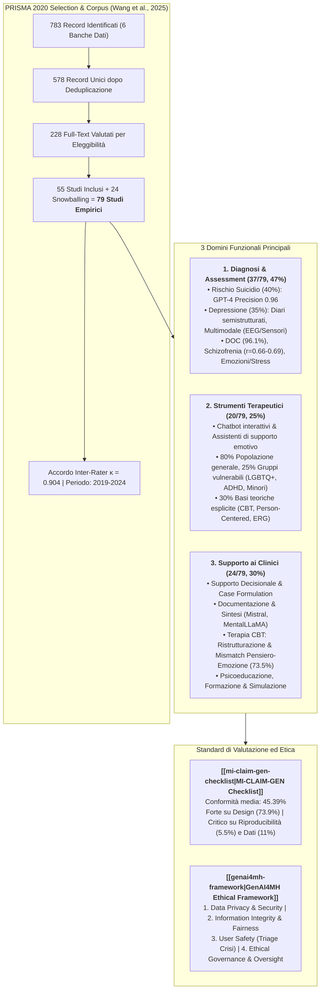
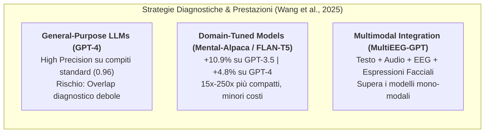
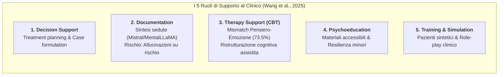
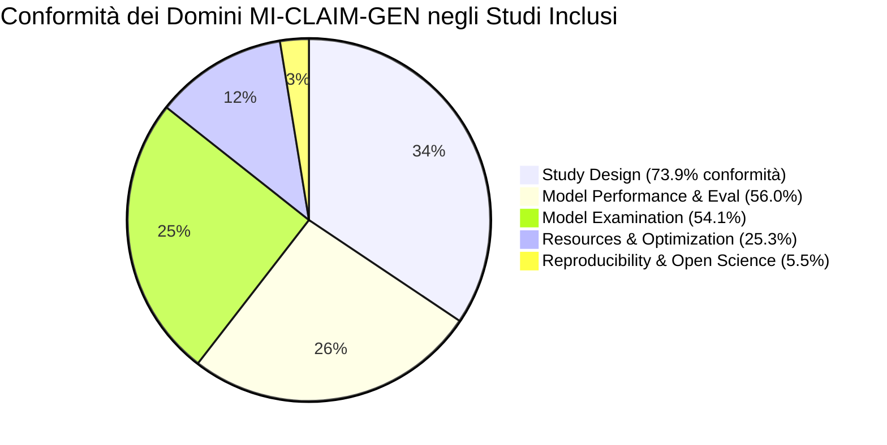
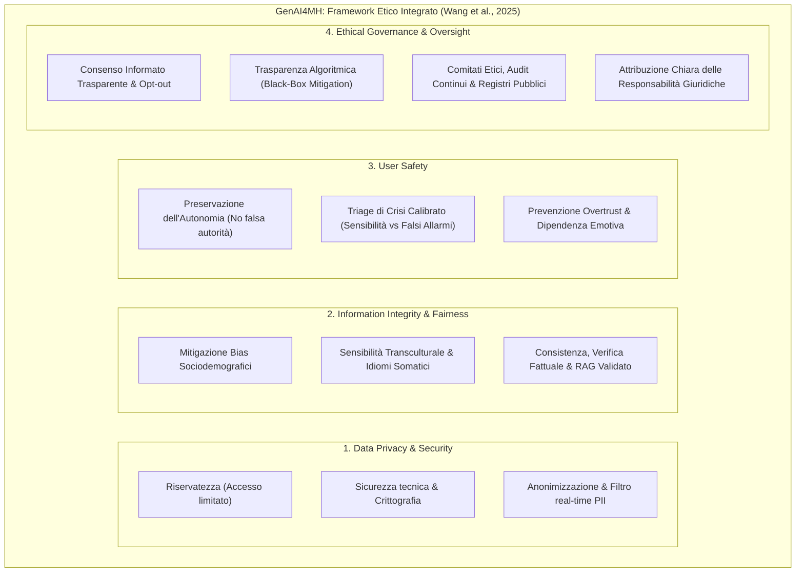

# The Application and Ethical Implication of Generative AI in Mental Health: Systematic Review (Wang et al., 2025)

## Definizione Operativa
- **Revisione sistematica** condotta secondo le linee guida **PRISMA 2020** e pubblicata su *JMIR Mental Health* da Xi Wang, Yujia Zhou e Guangyu Zhou (*Peking University & Tsinghua University*, Beijing, 2025; DOI: [10.2196/70610](https://doi.org/10.2196/70610)).
- **Oggetto e Obiettivi:** Esaminare sistematicamente la letteratura scientifica pubblicata dall'introduzione del modello T5 (ottobre 2019 - settembre 2024) sull'impiego dell'Intelligenza Artificiale Generativa (GenAI / LLM) nella salute mentale, mappando 79 studi empirici peer-reviewed su tre domini applicativi fondamentali: (1) Diagnosi e Assessment (47%), (2) Strumenti Terapeutici (25%), e (3) Supporto ai Clinici e ai Professionisti (30%).
- **Framework Etico GenAI4MH:** Formalizzazione di un'architettura etica quadri-dimensionale (*Data Privacy and Security*, *Information Integrity and Fairness*, *User Safety*, *Ethical Governance and Oversight*) per guidare la progettazione responsabile, la calibrazione del rischio clinico e la supervisione dei sistemi generativi.
- **Valutazione della Trasparenza di Reporting:** Valutazione metodologica dell'intero corpus mediante la checklist **[[mi-claim-gen-checklist|MI-CLAIM-GEN]]** (*Minimum Information about Clinical Artificial Intelligence for Generative Modeling Research*), che documenta un livello medio di conformità del 45.4%, evidenziando gravi lacune nella riproducibilità (5.5%), nell'audit dei danni e nella rappresentatività dei dati di training (11%).
- **Utilità Clinica e Psicoterapia CBT:** Mappa in modo granulare l'efficacia comparativa dei modelli linguistici (inclusa la superiorità dei modelli specialistici fine-tuned come *Mental-Alpaca*, *Mental-FLAN-T5* e *T5-Japanese* per il riconoscimento di discrepanze pensiero-sentimento nella CBT), definendo al contempo le condizioni di sicurezza necessarie (filtri di crisi, prevenzione dell'overtrust, mitigazione di allucinazioni su farmaci e protocolli human-in-the-loop).

---

## Evidenze dalla Letteratura

### 1. Selezione Metodologica e Trend di Pubblicazione
- **Strategia di Ricerca:** Query sistematica condotta nell'ottobre 2024 su 6 banche dati internazionali (*PubMed, ACM Digital Library, Scopus, Embase, PsycInfo, Google Scholar*) per il periodo 1 ottobre 2019 - 30 settembre 2024 (post introduzione del transformer T5; Raffel et al., 2020).
- **Evoluzione Temporale delle Pubblicazioni:**
  - Nel **2022**, gli studi erano quasi inesistenti (solo 1 studio pionieristico, pari all'1.3% del totale);
  - Nel **2023**, si è registrata una moderata espansione (10 studi su diagnosi, 7 su strumenti terapeutici, 6 su supporto clinico; totale 29%);
  - Nel **2024**, la letteratura è letteralmente esplosa (26 studi su diagnosi/assessment [33%], 13 su interventi terapeutici [16%], 18 su supporto ai professionisti [23%]), guidata dalla diffusione massiva di ChatGPT-4, LLaMA-2/3, Gemini e Med-Gemini (Corrado & Barral, 2024; Wang et al., 2025).

---

### 2. Dominio 1: GenAI per Diagnosi e Assessment Clinico (37/79, 47%)

#### A. Condizioni Cliniche Indagate
1. **Rischio di Suicidio (15/37, 40%):** È il target diagnostico maggiormente studiato. I modelli GenAI (in particolare GPT-4) raggiungono un'elevata precisione nell'estrazione di indici linguistici e nella classificazione dei livelli di rischio (precisione fino a **0.96**; Chen et al., 2024; Singh et al., 2024), superando classificatori tradizionali basati su SVM (Zhou et al., 2023) e dimostrandosi pari o superiori a modelli BERT (Soun & Nair, 2023; Zhang et al., 2024).
   - *Limite metodologico critico:* L'**87% degli studi (13/15)** si basa su narrazioni simulate o post da social media (Reddit, Twitter, Sina Weibo); solo il 13% (2/15) ha impiegato cartelle o trascrizioni cliniche reali (Lee et al., 2024; Zhou et al., 2023).
2. **Depressione (13/37, 35%):** Raggiunge un'accuratezza diagnostica del **90.2%** nell'analisi di diari semistrutturati (Shin et al., 2024). Tuttavia, le prestazioni crollano quando i modelli affrontano contesti dialettali, non anglofoni o culturalmente divergenti (Hayati et al., 2022).
3. **Disturbi Ossessivo-Compulsivi (DOC) e Schizofrenia:** Nei quadri di DOC, i modelli LLM hanno superato i medici generici nell'identificazione accurata delle manifestazioni cliniche (accuratezza fino al **96.1%**; Kim et al., 2024). Nella schizofrenia, le valutazioni automatizzate della disorganizzazione del pensiero correlano significativamente con i rating di psichiatri esperti ($r = 0.66 - 0.69$; Pugh et al., 2024).
4. **Diagnosi Differenziale (3/37, 8%):** Sebbene i modelli distinguano bene patologie con sintomatologia polarizzata (es. psicosi franca vs disturbo d'ansia), mostrano marcate difficoltà e cali di accuratezza in condizioni diagnostiche con sintomatologia sovrapposta o a minore prevalenza (es. depressione perinatale, disturbo da disregolazione dell'umore dirompente, disturbo da stress acuto; Gargari et al., 2024; Heinz et al., 2023).

#### B. Architetture, Adattamento e Multimodalità
- **Modelli Proprietari vs Open-Source:** Il 78% degli studi (29/37) ha impiegato modelli proprietari (serie GPT-3/3.5/4, Google Gemini, PaLM 2); il 38% (14/37) ha utilizzato modelli a pesi aperti (LLaMA, Mistral, Falcon, Neomotron).
- **Fine-Tuning Specialistico (*Domain-Specific Models*):** I modelli compatti istruiti su corpora psicologici (*Mental-Alpaca* e *Mental-FLAN-T5*) hanno ottenuto un incremento del **10.9%** nell'accuratezza bilanciata rispetto a GPT-3.5 e hanno **superato GPT-4 del 4.8%**, pur avendo dimensioni da 15 a 250 volte inferiori (Xu et al., 2024).
- **Prompt Engineering e RAG:** Tecniche di *Few-Shot Prompting*, *Chain-of-Thought (CoT)* ed *Example Contrast* migliorano drasticamente l'affidabilità diagnostica (Englhardt et al., 2024; Zhang et al., 2024). La Retrieval-Augmented Generation (RAG) ancora le risposte ai criteri DSM-5, ma rischia di introdurre rumore o semantic drift se il recupero non è perfettamente indicizzato (Gargari et al., 2024).
- **Approcci Multimodali (14%):** L'integrazione di segnali fisiologici passivi (accelerometria, sonno, mobilità; Englhardt et al., 2024) e bio-segnali (EEG combinato con audio e mimica facciale nel framework *MultiEEG-GPT*; Hu et al., 2024) aumenta l'accuratezza predittiva rispetto al solo testo sia in setting zero-shot che few-shot.

---

### 3. Dominio 2: GenAI come Strumenti Terapeutici e Conversazionali (20/79, 25%)

| Dimensione | Rilievi della Revisione Sistematica | Dati e Riferimenti |
| :--- | :--- | :--- |
| **Popolazione Target** | • 80% popolazione generale per benessere emotivo, ansia e stress. • 25% popolazioni vulnerabili o con bisogni specifici: pazienti psichiatrici ambulatoriali, comunità LGBTQ+, sopravvissuti a molestie sessuali, bambini con ADHD, anziani. | Alanezi (2024); Berrezueta-Guzman et al. (2024); Ma et al. (2024); Vakayil et al. (2024) |
| **Basi Teoriche** | **Grave deficit teorico:** solo il **30% (6/20)** degli studi si fonda esplicitamente su un modello psicoterapeutico formale (Terapia Cognitivo-Comportamentale - CBT, Terapia Centrata sulla Persona, Teoria ERG). Il restante 70% impiega un approccio puramente ingegneristico privo di formulazione clinica. | Sharma et al. (2024); Wu et al. (2024); Yu & McGuinness (2024) |
| **Disegno di Valutazione** | • 35% disegni sperimentali strutturati (RCT, studi di campo, quasi-sperimentali). • 25% simulazioni su scenari e prompt validation. • 70% raccolta di metriche soggettive di esperienza utente (sollievo emotivo, engagement, self-efficacy). | Yahagi et al. (2024); Sharma et al. (2024); Wu et al. (2024) |
| **Esiti Riportati** | L'**85% (17/20)** degli studi riporta esiti positivi (riduzione dell'ansia preoperatoria, decremento dell'uso problematico dello smartphone del 7-10%, sollievo affettivo percepito). | Yahagi et al. (2024); Wu et al. (2024); Sharma et al. (2024) |
| **Limiti e Criticità** | Il 25% segnala insoddisfazione degli utenti per **risposte generiche, frasi ripetitive, mancanza di sfumature emotive** e incapacità di gestire crisi acute o rivelazioni legate all'identità. | Ma et al. (2024); Vowels et al. (2024); De Freitas et al. (2023) |
| **Prontezza Clinica Reale** | • Valutazione da parte di clinici esperti: **20% (4/20)**. • Accettabilità degli utenti misurata: **60% (12/20)**. • Implementazione in setting clinici reali: **15% (3/20)**. • Meccanismi di sicurezza espliciti attivi: **30% (6/20)**. | Wang et al. (2025) |

---

### 4. Dominio 3: GenAI per il Supporto a Clinici e Professionisti (24/79, 30%)

La revisione identifica **5 ruoli funzionali specifici**:

1. **Clinical Decision Support (Supporto Decisionale e Formulazione del Caso):**
   - I piani di trattamento generati da GenAI mostrano elevata coerenza con le linee guida internazionali, talvolta superando i medici di medicina generale nella tempestività diagnostica della depressione (Levkovich & Elyoseph, 2023; Perlis et al., 2024).
   - Coerenza nella formulazione psicodinamica (Hwang et al., 2024) e multimodale (Hsieh et al., 2024).
   - *Limite:* Incapacità nei compiti di conduzione autonoma di interviste strutturate e diagnosi differenziale complessa (Dergaa et al., 2023).
2. **Documentazione Clinica e Sintesi Automatizzata:**
   - Riduzione drastica del carico burocratico (*administrative burden*). Nel benchmarking su sessioni di counseling, i modelli **Mistral** e **MentalLLaMA** hanno ottenuto la massima qualità di sintesi estrattiva (Adhikary et al., 2024).
   - *Rischio allucinatorio grave:* Registrata in alcuni casi l'errata trascrizione o invenzione di dettagli clinici critici (es. documentazione incorretta del rischio suicidario; Adhikary et al., 2024).
3. **Supporto alla Psicoterapia CBT e Ristrutturazione Cognitiva:**
   - **Riconoscimento delle discrepanze Pensiero-Sentimento:** Furukawa et al. (2023) hanno addestrato un modello T5-Japanese su oltre 7.000 registrazioni di schede dei pensieri (*thought records*) da 2 ampi RCT, ottenendo un'accuratezza del **73.5%** nell'identificare incoerenze tra pensieri automatici ed emozioni provate.
   - **Riformulazione di pensieri disfunzionali:** Tassi elevati di successo nella ristrutturazione cognitiva guidata (Hodson & Williamson, 2024) e nel journaling terapeutico assistito da LLM (*MindfulDiary*; Kim et al., 2024).
4. **Psicoeducazione Interattiva:**
   - Generazione di materiali educativi chiari, accessibili ed empatici per il pubblico e agenti dedicati per sviluppare la resilienza nei bambini (Hu et al., 2024; Maurya et al., 2024).
   - *Criticità:* Casi documentati di output potenzialmente dannosi su quesiti riguardanti l'uso di sostanze e dipendenze (Giorgi et al., 2024) e carenza di sintonia emotiva profonda (*emotional attunement*; Bird et al., 2024).
5. **Training, Simulazione e Didattica Clinica:**
   - Generazione di pazienti virtuali, vignette cliniche controllate ed esercizi di intervista diagnostica per studenti di psicologia e psichiatria, offrendo palestre di apprendimento a rischio zero (Hsieh et al., 2024; Smith et al., 2023; Wu et al., 2024).

---

### 5. Valutazione della Trasparenza Metodologica: Checklist MI-CLAIM-GEN

Wang et al. (2025) hanno valutato la qualità di rendicontazione dei 79 studi mediante la checklist **MI-CLAIM-GEN** (*Minimum Information about Clinical Artificial Intelligence for Generative Modeling Research*; Miao et al., 2025), rivelando una profonda eterogeneità:

- **Punteggio Medio Globale:** Solo il **45.39%** degli item ha ottenuto valutazione positiva (*yes*).
- **Domini Soddisfatti:** Contesto dello studio (97%) e quesito clinico di ricerca (100%); descrizione degli output del modello (89%).
- **Aree con Gravi Carenze:**
  - **Rappresentatività dei dati di training:** solo l'**11%** documenta adeguatamente la composizione del dataset originario;
  - **Framework di valutazione olistico:** solo il **20%** impiega una griglia di valutazione clinica multidimensionale;
  - **Audit dei danni e validazione in setting reali post-deployment:** quasi totalmente assenti;
  - **Riproducibilità scientifica:** **0% degli studi ha fornito una Model Card formale** e solo il **14%** ha soddisfatto i criteri di riproducibilità *Tier-1* (rilascio di prompt esatti, parametri di temperatura, seed e script di pipeline).

---

### 6. Il Framework Etico Integrato GenAI4MH

Per colmare i rischi evidenziati nella revisione, Wang et al. (2025) propongono il framework **GenAI4MH**, articolato in 4 dimensioni:

#### Dettaglio dei 4 Pilastri di GenAI4MH:
1. **Data Privacy and Security:**
   - Notifiche trasparenti sull'archiviazione dei dati e divieto di immissione di informazioni identificative (PII).
   - Filtri algoritmici real-time per oscurare dati sensibili durante le sessioni di crisi o confidenza emotiva (Berrezueta-Guzman et al., 2024).
2. **Information Integrity and Fairness:**
   - *Disparità sociodemografiche documentate:* Tendenza degli LLM a sovrastimare diagnosi di abuso di sostanze in nativi americani e disturbo borderline nelle donne (Heinz et al., 2023), ridotta accuratezza nelle donne nere (Perlis et al., 2024) e bias d'età verso uomini anziani (Soun & Nair, 2023).
   - *Bias culturale e linguistico:* Incapacità di riconoscere idiomi somatici del distress tipici di culture non-occidentali (Ryder et al., 2008).
   - *Verifica fattuale:* Prevenzione di allucinazioni critiche (farmaci inesistenti o controindicati, numeri di emergenza errati; De Freitas et al., 2023; Vakayil et al., 2024) tramite pipeline di verifica, RAG validato e abbassamento della temperatura di generazione.
3. **User Safety e Triage di Crisi Calibrato:**
   - *Preservazione dell'autonomia:* Evitare che l'utente attribuisca autorità clinica infallibile al modello.
   - *Interruzioni traumatiche:* Evitare blocchi improvvisi della conversazione quando emergono temi suicidari, che lasciano l'utente abbandonato e disorientato (Mazumdar et al., 2023).
   - *Trade-off della rilevazione di crisi:* Algoritmi ipersensibili generano falsi allarmi, sovraccaricando i servizi sanitari e alienando l'utente; algoritmi troppo conservativi non rilevano rischi reali (GPT-3.5 ha fallito nel 43.4% dei prompt espliciti di autolesionismo; De Freitas et al., 2023). La risposta deve essere calibrata sul contesto (basso rischio/ambiente non clinico vs setting clinico supervisionato).
4. **Ethical Governance and Oversight:**
   - Consenso informato esplicito sulle capacità e i limiti della GenAI (Sharma et al., 2024).
   - Istituzione di comitati etici indipendenti, registri pubblici dei modelli per la salute mentale e protocolli formali di attribuzione di responsabilità clinico-legale (D'Souza et al., 2023; Heston, 2023).

---

## Raccomandazioni per la Ricerca e l'Integrazione Clinica

1. **Adozione del Modello Centauro (Human-in-the-Loop):**
   - Confinare la GenAI al ruolo di copilota assistivo (bozze di sintesi, psicoeducazione preliminare, tracciamento tra le sedute), preservando il giudizio diagnostico, l'alleanza relazionale e la responsabilità terapeutica in capo al clinico umano.
2. **Sviluppo di Modelli di Dominio Specialistici e Compatti:**
   - Privilegiare modelli compatti e fine-tuned su corpora clinici validati (*Mental-Alpaca*, *Mental-FLAN-T5*, *T5-Japanese*), che garantiscono privacy locale (*on-premise*), maggiore equità demografica e prestazioni superiori ai modelli generalisti commerciali.
3. **Standardizzazione del Reporting con MI-CLAIM-GEN:**
   - Obbligare i ricercatori ad allegare *Model Cards*, prompt integrali, parametri di generazione e audit di sicurezza per superare l'attuale deficit di riproducibilità scientifica (5.5%).
4. **Validazione Ecologica e Studi Longitudinali:**
   - Superare le valutazioni basate su vignette statiche o social media, conducendo trial clinici controllati che misurino l'efficacia terapeutica reale, la tenuta dell'alleanza a lungo termine e la sicurezza in popolazioni cliniche eterogenee.

---

**Riferimenti Bibliografici:**
- Wang, X., Zhou, Y., & Zhou, G. (2025). The Application and Ethical Implication of Generative AI in Mental Health: Systematic Review. *JMIR Mental Health*, 12, e70610. https://doi.org/10.2196/70610
- Adhikary, P. K., Srivastava, A., Kumar, S., Singh, S. M., Manuja, P., Gopinath, J. K., et al. (2024). Exploring the efficacy of large language models in summarizing mental health counseling sessions: benchmark study. *JMIR Mental Health*, 11, e57306. https://doi.org/10.2196/57306
- Alanezi, F. (2024). Assessing the effectiveness of ChatGPT in delivering mental health support: a qualitative study. *Journal of Multidisciplinary Healthcare*, 17, 461–471. https://doi.org/10.2147/JMDH.S447368
- Berrezueta-Guzman, S., Kandil, M., Martín-Ruiz, M. L., Pau de la Cruz, I., & Krusche, S. (2024). Future of ADHD care: evaluating the efficacy of ChatGPT in therapy enhancement. *Healthcare*, 12(6), 683. https://doi.org/10.3390/healthcare12060683
- Bird, J. J., Wright, D., Sumich, A., & Lotfi, A. (2024). Generative AI in psychological therapy: perspectives on computational linguistics and large language models in written behaviour monitoring. In *Proceedings of the 17th International Conference on PErvasive Technologies Related to Assistive Environments* (pp. 322–328). https://doi.org/10.1145/3652037.3663893
- Chen, J., Nguyen, V., Dai, X., Molla, D., Paris, C., & Karimi, S. (2024). Exploring instructive prompts for large language models in the extraction of evidence for supporting assigned suicidal risk levels. In *Proceedings of the 9th Workshop on Computational Linguistics and Clinical Psychology* (pp. 197–202). https://aclanthology.org/2024.clpsych-1.17.pdf
- Corrado, G., & Barral, J. (2024). Advancing medical AI with Med-Gemini. *Google Research Blog*.
- De Freitas, J., Uğuralp, A. K., Oğuz‐Uğuralp, Z., & Puntoni, S. (2023). Chatbots and mental health: insights into the safety of generative AI. *Journal of Consumer Psychology*, 34(3), 481–491. https://doi.org/10.1002/jcpy.1393
- Dergaa, I., Fekih-Romdhane, F., Hallit, S., Loch, A. A., Glenn, J. M., Fessi, M. S., et al. (2023). ChatGPT is not ready yet for use in providing mental health assessment and interventions. *Frontiers in Psychiatry*, 14, 1277756. https://doi.org/10.3389/fpsyt.2023.1277756
- D'Souza, R. F., Amanullah, S., Mathew, M., & Surapaneni, K. M. (2023). Appraising the performance of ChatGPT in psychiatry using 100 clinical case vignettes. *Asian Journal of Psychiatry*, 89, 103770. https://doi.org/10.1016/j.ajp.2023.103770
- Englhardt, Z., Ma, C., Morris, M. E., Chang, C., Xu, X., Qin, L., et al. (2024). From classification to clinical insights: towards analyzing and reasoning about mobile and behavioral health data with large language models. *Proceedings of the ACM on Interactive, Mobile, Wearable and Ubiquitous Technologies*, 8(2), 1–25. https://doi.org/10.1145/3659604
- Furukawa, T. A., Iwata, S., Horikoshi, M., Sakata, M., Toyomoto, R., Luo, Y., et al. (2023). Harnessing AI to optimize thought records and facilitate cognitive restructuring in smartphone CBT: an exploratory study. *Cognitive Therapy and Research*, 47(6), 887–893. https://doi.org/10.1007/s10608-023-10411-7
- Gargari, O. K., Fatehi, F., Mohammadi, I., Firouzabadi, S. R., Shafiee, A., & Habibi, G. (2024). Diagnostic accuracy of large language models in psychiatry. *Asian Journal of Psychiatry*, 100, 104168. https://doi.org/10.1016/j.ajp.2024.104168
- Giorgi, S., Isman, K., Liu, T., Fried, Z., Sedoc, J., & Curtis, B. (2024). Evaluating generative AI responses to real-world drug-related questions. *Psychiatry Research*, 339, 116058. https://doi.org/10.1016/j.psychres.2024.116058
- Hayati, M. F., Ali, M. A., & Rosli, A. N. (2022). Depression detection on Malay dialects using GPT-3. In *2022 IEEE-EMBS Conference on Biomedical Engineering and Sciences* (pp. 360–364). https://doi.org/10.1109/iecbes54088.2022.10079554
- Heinz, M. V., Bhattacharya, S., Trudeau, B., Quist, R., Song, S. H., Lee, C. M., et al. (2023). Testing domain knowledge and risk of bias of a large-scale general artificial intelligence model in mental health. *Digital Health*, 9, 20552076231170499. https://doi.org/10.1177/20552076231170499
- Heston, T. F. (2023). Safety of large language models in addressing depression. *Cureus*, 15(12), e50729. https://doi.org/10.7759/cureus.50729
- Hodson, N., & Williamson, S. (2024). Can large language models replace therapists? Evaluating performance at simple cognitive behavioral therapy tasks. *JMIR AI*, 3, e52500. https://doi.org/10.2196/52500
- Hsieh, L. H., Liao, W. C., & Liu, E. Y. (2024). Feasibility assessment of using ChatGPT for training case conceptualization skills in psychological counseling. *Computers in Human Behavior Reports*, 2(2), 100083. https://doi.org/10.1016/j.chbah.2024.100083
- Hu, Y., Zhang, S., Dang, T., Jia, H., Salim, F., Hu, W., et al. (2024). Exploring large-scale language models to evaluate EEG-based multimodal data for mental health. In *Companion of the 2024 ACM International Joint Conference on Pervasive and Ubiquitous Computing* (pp. 412–417). https://doi.org/10.1145/3675094.3678494
- Hu, Z., Hou, H., & Ni, S. (2024). Grow with your AI buddy: designing an LLMs-based conversational agent for the measurement and cultivation of children's mental resilience. In *Proceedings of the 23rd Annual ACM Interaction Design and Children Conference* (pp. 811–817). https://doi.org/10.1145/3628516.3659399
- Hwang, G., Lee, D. Y., Seol, S., Jung, J., Choi, Y., Her, E. S., et al. (2024). Assessing the potential of ChatGPT for psychodynamic formulations in psychiatry: an exploratory study. *Psychiatry Research*, 331, 115655. https://doi.org/10.1016/j.psychres.2023.115655
- Kim, J., Leonte, K. G., Chen, M. L., Torous, J. B., Linos, E., Pinto, A., et al. (2024). Large language models outperform mental and medical health care professionals in identifying obsessive-compulsive disorder. *NPJ Digital Medicine*, 7(1), 193. https://doi.org/10.1038/s41746-024-01181-x
- Kim, T., Bae, S., Kim, H. A., Lee, S. W., Hong, H., Yang, C., et al. (2024). MindfulDiary: harnessing large language model to support psychiatric patients' journaling. In *Proceedings of the 2024 CHI Conference on Human Factors in Computing Systems* (pp. 1–20). https://doi.org/10.1145/3613904.3642937
- Lee, C., Mohebbi, M., O'Callaghan, E., & Winsberg, M. (2024). Large language models versus expert clinicians in crisis prediction among telemental health patients: comparative study. *JMIR Mental Health*, 11, e58129. https://doi.org/10.2196/58129
- Levkovich, I., & Elyoseph, Z. (2023). Identifying depression and its determinants upon initiating treatment: ChatGPT versus primary care physicians. *Family Medicine and Community Health*, 11(4), e002391. https://doi.org/10.1136/fmch-2023-002391
- Ma, Z., Mei, Y., Long, Y., Su, Z., & Gajos, K. Z. (2024). Evaluating the experience of LGBTQ+ people using large language model based chatbots for mental health support. In *Proceedings of the 2024 CHI Conference on Human Factors in Computing Systems* (pp. 1–15). https://doi.org/10.1145/3613904.3642482
- Maurya, R. K., Montesinos, S., Bogomaz, M., & DeDiego, A. C. (2024). Assessing the use of ChatGPT as a psychoeducational tool for mental health practice. *Counselling and Psychotherapy Research*, 25(1), 94–100. https://doi.org/10.1002/capr.12759
- Mazumdar, H., Chakraborty, C., Sathvik, M., Mukhopadhyay, S., & Panigrahi, P. K. (2023). GPTFX: a novel GPT-3 based framework for mental health detection and explanations. *IEEE Journal of Biomedical and Health Informatics*, 3, 1–8. https://doi.org/10.1109/jbhi.2023.3328350
- Miao, B. Y., Chen, I. Y., Williams, C. Y., Davidson, J., Garcia-Agundez, A., Sun, S., et al. (2025). The MI-CLAIM-GEN checklist for generative artificial intelligence in health. *Nature Medicine*, 31(5), 1394–1398. https://doi.org/10.1038/s41591-024-03470-0
- Page, M. J., McKenzie, J. E., Bossuyt, P. M., Boutron, I., Hoffmann, T. C., Mulrow, C., et al. (2021). The PRISMA 2020 statement: an updated guideline for reporting systematic reviews. *BMJ*, 372, n71. https://doi.org/10.1136/bmj.n71
- Perlis, R. H., Goldberg, J. F., Ostacher, M. J., & Schneck, C. D. (2024). Clinical decision support for bipolar depression using large language models. *Neuropsychopharmacology*, 49(9), 1412–1416. https://doi.org/10.1038/s41386-024-01841-2
- Pugh, S. L., Chandler, C., Cohen, A. S., Diaz-Asper, C., Elvevåg, B., & Foltz, P. W. (2024). Assessing dimensions of thought disorder with large language models: the tradeoff of accuracy and consistency. *Psychiatry Research*, 341, 116119. https://doi.org/10.1016/j.psychres.2024.116119
- Raffel, C., Shazeer, N., Roberts, A., Lee, K., Narang, S., Matena, M., et al. (2020). Exploring the limits of transfer learning with a unified text-to-text transformer. *Journal of Machine Learning Research*, 21(140), 1–67.
- Ryder, A. G., Yang, J., Zhu, X., et al. (2008). The cultural shaping of depression: somatic symptoms in China, psychological symptoms in North America? *Journal of Abnormal Psychology*, 117(2), 300–313. https://doi.org/10.1038/0021-843X.117.2.300
- Sharma, A., Rushton, K., Lin, I. W., Nguyen, T., & Althoff, T. (2024). Facilitating self-guided mental health interventions through human-language model interaction: a case study of cognitive restructuring. In *Proceedings of the 2024 CHI Conference on Human Factors in Computing Systems* (pp. 1–29). https://doi.org/10.1145/3613904.3642761
- Shin, D., Kim, H., Lee, S., Cho, Y., & Jung, W. (2024). Using large language models to detect depression from user-generated diary text data as a novel approach in digital mental health screening: instrument validation study. *Journal of Medical Internet Research*, 26, e54617. https://doi.org/10.2196/54617
- Singh, L. G., Mao, J., Mutalik, R., & Middleton, S. E. (2024). Extracting and summarizing evidence of suicidal ideation in social media contents using large language models. In *Proceedings of the 9th Workshop on Computational Linguistics and Clinical Psychology* (pp. 218–226).
- Smith, A., Hachen, S., Schleifer, R., Bhugra, D., Buadze, A., & Liebrenz, M. (2023). Old dog, new tricks? Exploring the potential functionalities of ChatGPT in supporting educational methods in social psychiatry. *International Journal of Social Psychiatry*, 69(8), 1882–1889. https://doi.org/10.1177/00207640231178451
- Soun, R. S., & Nair, A. (2023). ChatGPT for mental health applications: a study on biases. In *Proceedings of the 3rd International Conference on AI-ML Systems* (pp. 1–5). https://doi.org/10.1145/3639856.3639894
- Vakayil, S., Juliet, D. S., & Vakayil, S. (2024). RAG-based LLM chatbot using Llama-2. In *Proceedings of the 7th International Conference on Devices, Circuits and Systems* (pp. 1–5). https://doi.org/10.1109/icdcs59278.2024.10561020
- Vowels, L. M., Francois-Walcott, R. R., & Darwiche, J. (2024). AI in relationship counselling: evaluating ChatGPT's therapeutic capabilities in providing relationship advice. *Computers in Human Behavior Reports*, 2(2), 100078. https://doi.org/10.1016/j.chbah.2024.100078
- Wu, R., Yu, C., Pan, X., Liu, Y., Zhang, N., Fu, Y., et al. (2024). MindShift: leveraging large language models for mental-states-based problematic smartphone use intervention. In *Proceedings of the 2024 CHI Conference on Human Factors in Computing Systems* (pp. 1–24). https://doi.org/10.1145/3613904.3642790
- Wu, Y., Mao, K., Zhang, Y., & Chen, J. (2024). CALLM: enhancing clinical interview analysis through data augmentation with large language models. *IEEE Journal of Biomedical and Health Informatics*, 28(12), 7531–7542. https://doi.org/10.1109/JBHI.2024.3435085
- Xu, X., Yao, B., Dong, Y., Gabriel, S., Yu, H., Hendler, J., et al. (2024). Mental-LLM: leveraging large language models for mental health prediction via online text data. *Proceedings of the ACM on Interactive, Mobile, Wearable and Ubiquitous Technologies*, 8(1), 1–32. https://doi.org/10.1145/3643540
- Yahagi, M., Hiruta, R., Miyauchi, C., Tanaka, S., Taguchi, A., & Yaguchi, Y. (2024). Comparison of conventional anesthesia nurse education and an artificial intelligence chatbot (ChatGPT) intervention on preoperative anxiety: a randomized controlled trial. *Journal of PeriAnesthesia Nursing*, 39(5), 767–771. https://doi.org/10.1016/j.jopan.2023.12.005
- Yu, H., & McGuinness, S. (2024). An experimental study of integrating fine-tuned LLMs and prompts for enhancing mental health support chatbot system. *Journal of Medical Artificial Intelligence*, 7, 1–16.
- Zhang, T., Yang, K., Ji, S., Liu, B., Xie, Q., & Ananiadou, S. (2024). SuicidEmoji: derived emoji dataset and tasks for suicide-related social content. In *Proceedings of the 47th International ACM SIGIR Conference on Research and Development in Information Retrieval* (pp. 1136–1141). https://doi.org/10.1145/3626772.3657852
- Zhou, W., Prater, L. C., Goldstein, E. V., & Mooney, S. J. (2023). Identifying rare circumstances preceding female firearm suicides: validating a large language model approach. *JMIR Mental Health*, 10, e49359. https://doi.org/10.2196/49359

---

## Relazioni
- Vedi anche: [[genai4mh-framework]], [[mi-claim-gen-checklist]], [[mental-v12-e70014]], [[mental-2026-1-e88057]], [[elevate-genai-framework]], [[chart-reporting-guideline]], [[gamer-reporting-guideline]], [[modello-centauro-clinico]], [[clinician-user-evaluation-discrepancy]], [[single-task-zero-shot-evaluation-trap]], [[ai-enhanced-cbt]], [[cultural-adaptation-in-mental-health-llms]], [[lightweight-domain-models-in-mental-health]], [[layered-safeguards-in-clinical-ai]], [[five-domain-chatbot-validation-framework]]
