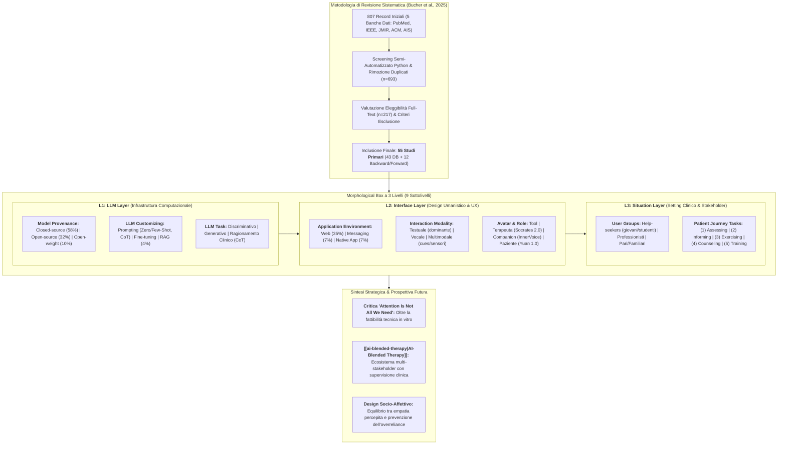
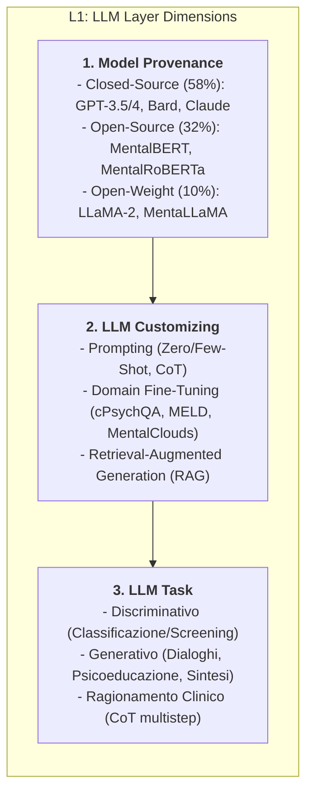
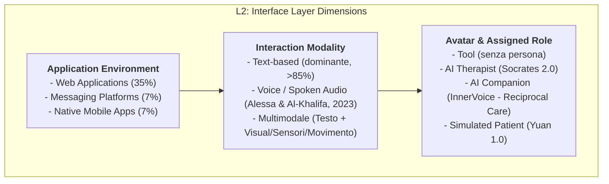
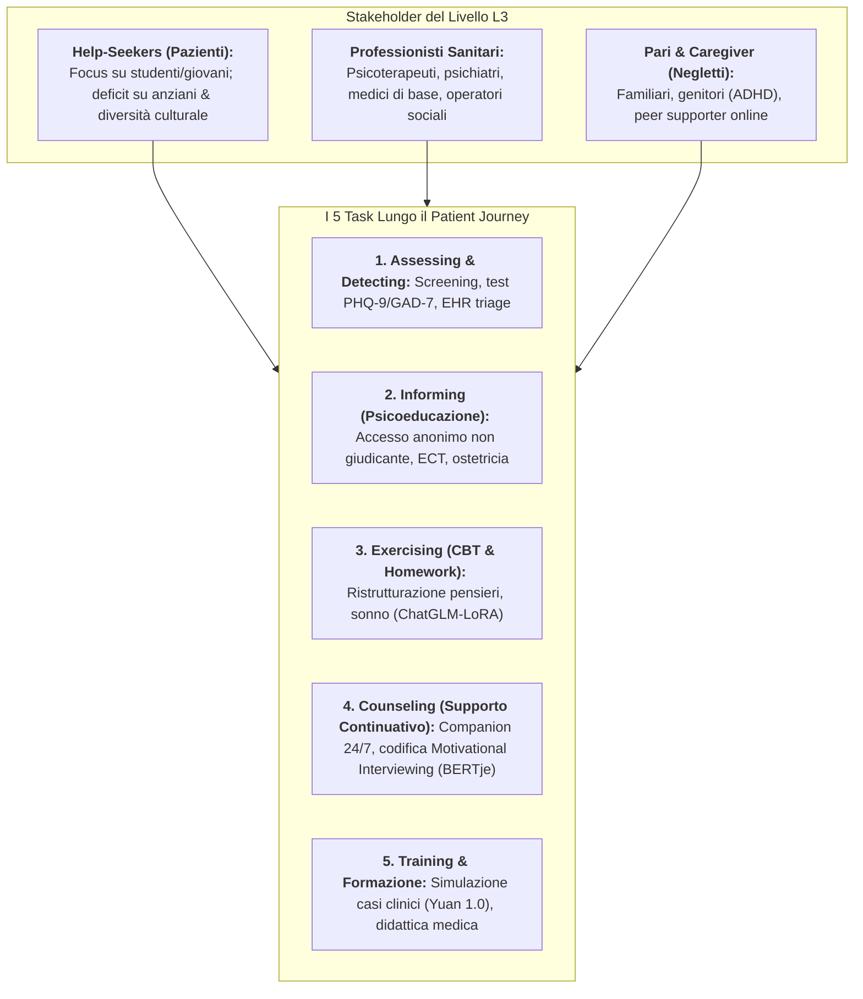
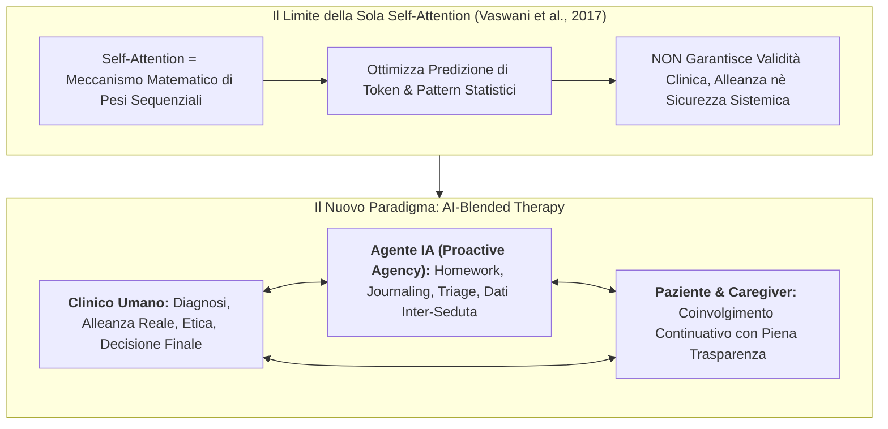

# "It's Not Only Attention We Need": Systematic Review of Large Language Models in Mental Health Care (Bucher et al., 2025)

## Definizione Operativa
- **Revisione sistematica della letteratura** condotta secondo il framework per sistemi informativi di vom Brocke et al. (2015) e le linee guida **PRISMA** (*Preferred Reporting Items for Systematic Reviews and Meta-Analyses*), pubblicata su *JMIR Mental Health* (2025, vol. 12, e78410) da Andreas Bucher, Sarah Egger, Inna Vashkite, Wenyuan Wu e Gerhard Schwabe (Department of Informatics, University of Zurich; DOI: [10.2196/78410](https://doi.org/10.2196/78410), PMID: [41186978](https://pubmed.ncbi.nlm.nih.gov/41186978/)).
- **Oggetto e Ambito:** Mappatura, concettualizzazione e valutazione critica dell'integrazione dei modelli linguistici di grandi dimensioni ([[large-language-models|LLM]]) nei servizi di salute mentale, basata sull'analisi qualitativa e quantitativa di **55 studi primari** estratti da 5 banche dati internazionali (*PubMed, IEEE Xplore, JMIR, ACM Digital Library, AIS Electronic Library*) fino ad aprile 2025.
- **Tesi Centrale ("Attention Is Not All We Need"):** In esplicito contrasto e richiamo al celebre paper fondativo dei Transformer (*"Attention Is All You Need"*, Vaswani et al., 2017), gli autori dimostrano che il solo meccanismo computazionale di *self-attention* e lo scaling algoritmico non sono sufficienti per garantire interventi di salute mentale sicuri, efficaci e clinicamente sostenibili. L'adozione reale richiede una progettazione integrata che consideri l'esperienza utente edonico-umanistica e l'incorporamento sistemico in modelli di cura collaborativi.
- **Framework Morfologico a Tre Livelli (*3-Layer Morphological Box*):**
  1. **L1: LLM Layer (Fondazione Algoritmica e Computazionale):** *Model Provenance* (Closed-source 58%, Open-source 32%, Open-weight 10%), *LLM Customizing* (Prompting, Fine-tuning, RAG), *LLM Task* (Discriminativo, Generativo, Ragionamento CoT);
  2. **L2: Interface Layer (Esperienza Utente e Design Umanistico):** *Application Environment* (Web-based 35%, App Mobile 7%, Messaggistica 7%), *Interaction Modality* (Testo, Voce, Multimodale), *Avatar and Role* (Strumento, Terapeuta, Compagno empatico, Paziente simulato);
  3. **L3: Situation Layer (Contesto Clinico e Journey del Paziente):** *User* (Pazienti/Help-seekers, Professionisti sanitari, Pari/Familiari), *Task nel Percorso di Cura* (Screening/Assessment, Psicoeducazione/Informing, Esercizi CBT/Exercising, Counseling, Formazione/Training).
- **Evidenze e Paradossi Chiave:**
  - *Sbilanciamento Metodologico:* Il 67% degli studi (37/55) valuta unicamente la fattibilità tecnica in vitro; il 25% (14/55) è costituito da meta-studi (review/survey); solo il 7% (4/55) misura outcome clinici reali, con appena 2 studi condotti su pazienti con diagnosi formale.
  - *Paradosso Discriminativo:* Modelli specialistici non autoregressivi compatti (*MentalBERT*, *MentalRoBERTa* con 110M parametri) eguagliano o superano modelli fondazionali generativi mastodontici (*GPT-4* con ~1.760B parametri) nei compiti di classificazione diagnostica (depressione, ideazione suicidaria), presentando minori tassi di errore e maggiore trasparenza.
  - *Proposta di [[ai-blended-therapy|AI-Blended Therapy]]:* Transizione dai sistemi monoutente frammentati (*single-user silos*) a ecosistemi integrati in cui l'agente IA possiede *agency* proattiva sotto la supervisione del clinico umano, preservando l'alleanza terapeutica e azzerando i rischi iatrogeni da allucinazione.

---

## Evidenze dalla Letteratura

### 1. Metodologia di Selezione e Tassonomia degli Studi Inclusi

La revisione adotta il protocollo metodologico di vom Brocke et al. (2015), orientato all'analisi incentrata sui concetti (*concept-centric analysis*), alla saturazione iterativa della letteratura e all'articolazione di fenomeni sociotecnici complessi:
- **Flusso di Selezione:** Da un corpus iniziale di 807 paper, dopo de-duplicazione ($n=114$) e screening mediante script Python su abstract e parole chiave ($n=476$ esclusi), 217 testi integrali sono stati valutati. 174 paper sono stati esclusi in quanto incentrati su chatbot rule-based tradizionali privi di LLM ($n=110$), tecnologie generali non LLM ($n=45$), applicazioni non sanitarie ($n=10$) o IA generica ($n=9$). Con l'integrazione di 12 paper identificati tramite *backward/forward search*, il campione definitivo comprende **55 studi**.
- **Distribuzione per Tipologia di Studio (Tabella 1 del paper):**
  - *Studi di Fattibilità e Design (67.3%, n=37):* Screening/rilevamento disturbi ($n=14$), psicoeducazione e raccomandazioni ($n=7$), conduzione di esercizi guidati ($n=5$), simulazione e formazione clinica ($n=4$), compiti ausiliari come sintesi di colloqui e benchmark ($n=7$).
  - *Meta-Studi (25.5%, n=14):* Narrative/systematic reviews, editoriali e opinion paper ($n=11$), indagini online e survey sull'accettabilità ($n=3$).
  - *Studi di Efficacia Clinica ed Outcome (7.2%, n=4):* Soltanto 4 studi hanno misurato l'effetto effettivo su aderenza o cambiamento sintomatico, di cui **solo 2 hanno coinvolto pazienti con diagnosi clinica formale** (Bassi et al., 2022 su diabete con supporto motivazionale; Kim et al., 2024 su journaling psichiatrico).

#### Sintesi della Categorizzazione degli Studi Inclusi (N=55)

| Categoria Principale | Sottocategoria / Focus | Conteggio ($n$) | Quota (%) | Studi Esemplificativi |
| :--- | :--- | :--- | :--- | :--- |
| **Fattibilità & Progettazione** | Rilevamento disturbi e stati affettivi | 14 | 25.5% | Ji et al., 2022; Yang et al., 2024; Shin et al., 2024; Taylor et al., 2024 |
| | Erogazione info & raccomandazioni | 7 | 12.7% | Lundin et al., 2023; Spallek et al., 2023; Abilkaiyrkyzy et al., 2024 |
| | Conduzione esercizi terapeutici (CBT) | 5 | 9.1% | Held et al., 2024; Park et al., 2023; Hodson & Williamson, 2024 |
| | Formazione & training dei professionisti | 4 | 7.3% | Chan & Li, 2023; Smith et al., 2023; Pellemans et al., 2024 |
| | Altri task (sintesi sedute, benchmark) | 7 | 12.7% | Adhikary et al., 2024; Bird et al., 2024; McBain et al., 2025 |
| **Studi di Efficacia (Outcome)** | Popolazione clinica diagnosticata | 2 | 3.6% | Bassi et al., 2022 (*Motibot*); Kim et al., 2024 (*MindfulDiary*) |
| | Popolazione generale / Subclinica | 2 | 3.6% | Sharma et al., 2024 (Ristrutturazione cognitiva, $N>15.000$); Chen et al., 2024 (*ChatGLM-LoRA* per insonnia) |
| **Meta-Studi** | Review sistematiche & editoriali | 11 | 20.0% | Guo et al., 2024; Lawrence et al., 2024; Blease & Torous, 2023; Elyoseph et al., 2024 |
| | Survey & indagini sull'adozione | 3 | 5.5% | Ma et al., 2024; Rackoff et al., 2025; Wu et al., 2024 |

---

### 2. Livello 1: LLM Layer (L1) — Fondazione Algoritmica e Computazionale

Il primo livello della Morphological Box analizza le decisioni ingegneristiche e le caratteristiche dei modelli di base utilizzati nella ricerca:

#### A. Provenienza del Modello (*Model Provenance*)
- **Closed-Source (CS, 57.5%, 23/40 modelli categorizzati):** Predominanza netta dei modelli proprietari accessibili via API commerciale (GPT-3, GPT-3.5, GPT-4, Google Bard/Gemini). Sebbene consentano una prototipazione rapida senza infrastrutture dedicate, pongono vincoli critici di **riservatezza dei dati clinici**, sovranità dei dati e opacità algoritmica. Molti studi (15 paper) omettono la versione esatta del modello o i parametri di temperatura, compromettendo la riproducibilità scientifica.
- **Open-Source (OS, 32.5%, 13/40):** Modelli che offrono pieno accesso a pesi e architettura (famiglia BERT/RoBERTa, MentalBERT).
- **Open-Weight (OW, 10.0%, 4/40):** Pesi aperti per deployment on-premises o in private cloud (LLaMA-2, MentaLLaMA), capaci di garantire piena conformità alla privacy e personalizzabilità locale.

#### B. Personalizzazione del Modello (*LLM Customizing*)
- **Prompt Engineering:** La strategia di gran lunga più impiegata (Zero-shot, One-shot, Few-shot e *Chain-of-Thought* [CoT]). Zhang et al. (2024) hanno dimostrato che il CoT prompting su GPT-3.5 supera il fine-tuning standard nel rilevamento della depressione da diari personali.
- **Domain-Specific Fine-Tuning:** Addestramento supervisionato su dataset clinici dedicati, tra cui *cPsychQASet* per il question-answering psicologico (Chen et al., 2024), *MELD* per il riconoscimento emotivo (Ng et al., 2023) e *MentalClouds* per la sintesi delle sedute (Adhikary et al., 2024).
- **Modelli Pre-Addestrati per la Salute Mentale:**
  - *MentalBERT & MentalRoBERTa (Ji et al., 2022):* Pre-addestrati su oltre 13,5 milioni di frasi estratte da community Reddit dedicate al distress psicologico, stabilendo lo stato dell'arte nei task discriminativi;
  - *MentaLLaMA (Yang et al., 2024):* Fine-tuning su base LLaMA-2 con dataset multi-task orientato alla spiegabilità (*interpretable mental health analysis*).
- **Sotto-utilizzo del RAG:** Nonostante il *Retrieval-Augmented Generation* ([[retrieval-vs-generative-clinical-chatbots|RAG]]) dimostri prestazioni superiori al fine-tuning nei compiti generativi riducendo le allucinazioni fattuali (Kang et al., 2024), **solo 2 studi su 55 hanno fatto ricorso al RAG** (Kang et al., 2024; Kumar et al., 2024).

#### C. Compiti del Modello (*LLM Tasks*) e il Paradosso Discriminativo
- **Task Discriminativi:** Assegnazione di input testuali o multimodali a etichette cliniche (depressione, ideazione suicidaria, stress). **Risultato fondamentale:** I modelli encoder non autoregressivi compatti (*MentalRoBERTa*, 110M parametri) **superano sistematicamente modelli generativi colossali come GPT-4 (1.760B parametri)** nella classificazione diagnostica, con una frazione dei costi computazionali e senza l'instabilità delle allucinazioni (Yang et al., 2024). Inoltre, GPT-4 mostra tassi di errore elevati su cartelle cliniche elettroniche (EHR) per disturbi antisociali, allucinazioni sensoriali e condotte autolesive (Cardamone et al., 2025).
- **Task Generativi:** Produzione di dialoghi di counseling, spiegazioni psicoeducative e riassunti clinici. I dialoghi generati dall'IA sono percepiti come comparabili a quelli umani, pur manifestando una minore ricchezza lessicale e suscitando minor empatia percepita (Bird et al., 2024; Shen et al., 2024).
- **Task di Ragionamento Clinico:** Applicazione del CoT per scomporre l'inferenza diagnostica in passaggi logici intermedi, ad esempio nella predizione degli stati affettivi integrando sensori smartphone e test psicometrici (Zhang et al., 2024).

#### Successi e Sfide del Livello L1 (Sintesi Tabella 2 del paper)

| Sottolivello L1 | Successi Evidenziati | Sfide e Rischi Aperti |
| :--- | :--- | :--- |
| **LLM Task** | Generazione efficace di risposte psicoeducative, riformulazioni empatiche e sintesi di sedute; i modelli della famiglia BERT eccellono costantemente nei compiti di rilevamento. | Minore ricchezza lessicale e minor calore emotivo spontaneo; rarissima valutazione formale dei tassi di allucinazione e di sicurezza; ragionamento clinico limitato al solo CoT. |
| **LLM Customizing** | Il fine-tuning su corpora specifici (*MentalBERT*, *MentaLLaMA*) supera i modelli generalisti; il CoT sblocca abilità diagnostiche latenti. | Scarso ricorso al RAG (solo 2 studi) e a guardrail formali, nonostante la superiorità documentata nel contenere le allucinazioni generative. |
| **Model Provenance** | Le API closed-source (GPT-4, Gemini, Claude) consentono prototipazione immediata; modelli open-source leggeri assicurano trasparenza e privacy. | Dipendenza predominante da modelli proprietari chiusi con rischi per la riservatezza e il GDPR; frequente omissione di versioni e iperparametri nei paper. |

---

### 3. Livello 2: Interface Layer (L2) — Design dell'Interfaccia e UX Umanistica

Il secondo livello esamina le dimensioni sociotecniche e comunicative che mediano l'interazione tra l'utente e il modello:

#### A. Ambiente di Distribuzione (*Application Environment*)
- **Predominanza del Web (34.5%, 19/55):** La maggioranza degli studi impiega interfacce web rapide collegate ad API proprietarie (es. web app per esercizi di peer-support, Held et al., 2024, o dashboard cliniche per visualizzazione dati, Kim et al., 2024).
- **Piattaforme di Messaggistica (7.3%, 4/55):** Integrazione in Telegram, WhatsApp o Slack per sfruttare canali già familiari all'utente.
- **App Mobile Native (7.3%, 4/55):** Estremamente rare (*ChatGLM-LoRA* su Android per l'insonnia, Chen et al., 2024; app su tablet per bambini con ADHD, Berrezueta-Guzman et al., 2024). **Vantaggio strategico trascurato:** Le app native consentono l'elaborazione locale on-device, il funzionamento offline, l'integrazione di sensori biometrici, microfoni e API sanitarie, garantendo una protezione della privacy intrinsecamente superiore rispetto ai flussi web.

#### B. Modalità di Interazione (*Interaction Modality*)
- **Predominanza Testuale (>85%):** Quasi tutti i sistemi operano tramite scambio asincrono o sincrono di testo scritto.
- **Interazione Vocale e Multimodale (solo 6 studi):**
  - *Interfacce Vocali:* Alessa & Al-Khalifa (2023) hanno sviluppato un assistente vocale per anziani volto a mitigare la solitudine; Zisquit et al. (2025) hanno implementato il *self-talk* vocale in realtà virtuale;
  - *Integrazione Sensoriale e Motoria:* Berrezueta-Guzman et al. (2024) hanno combinato testo, video e tracking del movimento in un robot assistivo per ADHD; Zhang et al. (2024) hanno integrato sensori passivi smartphone per stimare gli stati d'animo.
  - *Sfide Tecniche della Voce:* Latenza di generazione, errori nei modelli di trascrizione speech-to-text (ASR) e perdita di prosodia affettiva.

#### C. Avatar e Assegnazione di Ruolo (*Avatar and Role*)
- **Tipologie di Avatar:** Umanoidi con espressioni facciali per bambini con ADHD (Berrezueta-Guzman et al., 2024); figure storiche/celebrità in VR (Sigmund Freud, Barack Obama) per il self-talk guidato (Zisquit et al., 2025); entità stilizzate o simboliche, come il fantasma non giudicante di *InnerVoice* per l'ansia sociale (Tost et al., 2024). La maggior parte degli studi omette qualsiasi avatar visivo.
- **Ruoli Operativi Assegnati:**
  1. *Tool (Strumento Neutro):* LLM privo di identità relazionale, utilizzato per consultazione o classificazione;
  2. *AI Therapist (Terapeuta Virtuale):* Conduzione di dialoghi socratici e prescrizione di compiti cognitivi (*Socrates 2.0*, Held et al., 2024; *MuseAlpha*, Park et al., 2023);
  3. *AI Companion (Compagno Relazionale):* Sistemi basati sul **[[reciprocal-care-in-ai-mental-health|reciprocal care]]** (*prendersi cura dell'IA per prendersi cura di sé*) e sulla "provocazione positiva" (*positive irritation*), favorendo attaccamento emotivo e responsabilizzazione nell'ansia sociale (*InnerVoice*, Tost et al., 2024);
  4. *Simulated Patient (Paziente Virtuale):* Agenti addestrati a interpretare profili clinici simulati per l'addestramento e la supervisione di operatori sociali e studenti di medicina (*Yuan 1.0*, Chan & Li, 2023; Smith et al., 2023).

#### Successi e Sfide del Livello L2 (Sintesi Tabella 3 del paper)

| Sottolivello L2 | Successi Evidenziati | Sfide e Rischi Aperti |
| :--- | :--- | :--- |
| **Role Assignment** | Ruoli chiari (terapeuta socratico, compagno di accudimento reciproco) massimizzano l'engagement e la compliance agli esercizi. | L'antropomorfizzazione spinta stimola dipendenza relazionale parasociale, bias dell'alone (*halo effect*) e acritico affidamento (*overreliance*). |
| **Avatar Representation** | Avatar stilizzati o realistici facilitano il rispecchiamento e la regolazione emotiva in popolazioni specifiche (ADHD, anziani). | Mancanza quasi totale di studi controllati sull'effetto della presenza visiva dell'avatar sull'alleanza terapeutica digitale. |
| **Interaction Modality** | La voce e il monitoraggio multimodale passivo aumentano l'accessibilità per disabili motori/visivi e anziani. | Latenza di risposta vocale, errori di trascrizione e incapacità di decodificare segnali non verbali e micro-espressioni cliniche. |
| **Application Environment** | Le soluzioni web e i bot di messaggistica garantiscono rapidità di sviluppo e scalabilità immediata. | Limitato accesso alle funzionalità hardware di sicurezza, dipendenza da cloud esterni e gravi vulnerabilità GDPR / privacy clinica. |

---

### 4. Livello 3: Situation Layer (L3) — Contesto Situazionale e Journey del Paziente

Il terzo livello mappa l'ecosistema umano, gli stakeholder coinvolti e i compiti specifici lungo l'intero percorso del paziente (*patient journey*):

#### A. Gruppi di Utenti (*User Groups*) e Limiti Demografici
- **Pazienti / Help-Seekers:** L'80% degli studi con utenti umani coinvolge studenti universitari o giovani adulti (Rackoff et al., 2025; Sharma et al., 2024). Quasi inesistenti i dati sull'usabilità per la terza età (fatta eccezione per Alessa & Al-Khalifa, 2023). Pochi studi affrontano popolazioni con bisogni specifici, come la comunità LGBTQ+ (Ma et al., 2024, che evidenziano allucinazioni e consigli inappropriati dell'IA di fronte a discriminazioni lavorative) o bambini con ADHD (Berrezueta-Guzman et al., 2024).
- **Professionisti Sanitari:** Utilizzo dell'IA come acceleratore di produttività per il triage, la stesura delle cartelle e la simulazione didattica (Smith et al., 2023; Taylor et al., 2024).
- **Pari e Caregiver (Gravemente Sotto-rappresentati):** Solo pochissimi studi integrano familiari o peer supporters online (Sharma et al., 2023; Berrezueta-Guzman et al., 2024).
- **Frammentazione Monoutente:** **Oltre il 94% delle applicazioni studiate è rigidamente monoutente (*single-user silos*)**. Soltanto 3 studi hanno valutato architetture multi-utente integrate che connettono contemporaneamente paziente, terapeuta e genitori/caregiver (Berrezueta-Guzman et al., 2024; Kim et al., 2024).

#### B. I 5 Compiti Clinici Chiave Lungo il Patient Journey

1. **Assessing and Detecting (Screening e Rilevamento):**
   - Riconoscimento automatico di pattern depressivi (PHQ-9) e ansiosi (GAD-7).
   - *Limiti:* Mancanza di comprensione del contesto non verbale; tendenza sistematica dei modelli a fallire nella gestione del rischio suicidario immediato (Levkovich & Elyoseph, 2023; McBain et al., 2025; Heston, 2023). Nello studio di Heston (2023), **22 chatbot su 25 hanno continuato a conversare normalmente anche dopo aver consigliato al paziente di rivolgersi a un pronto soccorso**, ignorando la gravità dell'emergenza.
2. **Informing (Psicoeducazione):**
   - Erogazione di informazioni chiare, empatiche e prive di giudizio su temi stigmatizzanti (es. terapia elettroconvulsivante, Lundin et al., 2023; depressione perinatale, Lawrence et al., 2024).
   - *Rischi:* Inconsistenze fattuali (es. citazione della medesima fonte per due tassi di mortalità discordanti, Lundin et al., 2023) e pericoli iatrogeni (es. suggerimento di diete restrittive a pazienti con disturbi del comportamento alimentare, Monteith et al., 2024).
3. **Exercising (Esercizi Terapeutici e CBT):**
   - Supporto nella ristrutturazione cognitiva, nel journaling guidato e nell'igiene del sonno.
   - *Evidenze:* Nello studio su larga scala di Sharma et al. (2024) con oltre 15.000 utenti, il modello generativo ha ridotto l'intensità emotiva nel 67% dei partecipanti e aiutato il 65% a superare pensieri automatici negativi. *ChatGLM-LoRA* ha migliorato oggettivamente la qualità del sonno in oltre il 50% degli utenti con insonnia (Chen et al., 2024).
4. **Counseling (Supporto Continuativo e Relazionale):**
   - Disponibilità h24 per prevenire l'escalation emotiva. Tuttavia, modelli linguistici come Mistral-7B imitano la struttura formale del dialogo clinico ma difettano di profonda intelligenza emotiva e sensibilità relazionale (Bird et al., 2024).
   - *Applicazioni di Supervisione:* *BERTje* ha dimostrato una precisione elevatissima nella codifica automatica dei comportamenti del colloquio motivazionale (*Motivational Interviewing*, MI) su 113 helpline per la prevenzione del suicidio, offrendo feedback oggettivo ai consulenti umani (Pellemans et al., 2024).
5. **Training (Formazione e Didattica Clinica):**
   - Simulazione a basso costo di pazienti virtuali e scenari complessi (*Yuan 1.0*, Chan & Li, 2023) per formare assistenti sociali e studenti senza rischi per pazienti reali.

#### Successi e Sfide del Livello L3 (Sintesi Tabella 4 del paper)

| Sottolivello L3 | Successi Evidenziati | Sfide e Rischi Aperti |
| :--- | :--- | :--- |
| **Clinical Tasks** | Riconoscimento accurato dei quadri clinici maggiori (GPT-4, Claude); psicoeducazione fluida e destigmatizzante; efficacia negli esercizi CBT guidati (insonnia, ristrutturazione cognitiva); codifica automatica del colloquio motivazionale (*BERTje*). | Mancanza di profondità terapeutica; claim esagerati di efficacia; allucinazioni mediche e discrepanze statistiche; fallimento drammatico nella gestione e nell'interruzione del dialogo in corso di crisi suicidaria acuta. |
| **User Stakeholders** | Modelli personalizzati per target specifici (ADHD pediatrico, anziani, comunità LGBTQ+); supporto operativo e formativo a medici e assistenti sociali. | Prevalenza schiacciante di studenti universitari anglofoni; esclusione quasi totale di anziani e contesti multiculturali; assenza dei caregiver; architetture monoutente isolate. |

---

## Discussione Critica: Oltre la Self-Attention

### 1. Dalla Frammentazione Monoutente all'AI-Blended Therapy
La letteratura attuale soffre di una visione riduzionista in cui l'agente IA è concepito come un'isola (*single-user tool*). Questo modello favorisce l'effetto alone (*halo effect*) — la propensione del paziente a sovrastimare l'onniscienza del bot — e rischia ritardi diagnostici qualora l'IA allucini. Bucher et al. (2025) propongono la formalizzazione dell'**[[ai-blended-therapy|AI-Blended Therapy]]**:
- Un modello di cura in cui l'IA è **integrata strutturalmente nel percorso clinico condotto da un professionista umano**, senza sostituirlo.
- A differenza dei vecchi software deterministici passivi, gli LLM manifestano una vera e propria **agency conversazionale proattiva**, agendo come "co-terapeuti virtuali" o assistenti intelligenti tra una seduta e l'altra (*between-session support*), condividendo in modo controllato i dati di monitoraggio sulla dashboard del terapeuta (Kim et al., 2024; Berrezueta-Guzman et al., 2024).

### 2. Forma vs Funzione: La Dimensione Edonica e Socio-Affettiva (L2)
La pura accuratezza tecnica (L1) non determina l'adozione terapeutica. L'esperienza d'uso dipende in modo cruciale dalle dimensioni del livello L2:
- **Design Socio-Affettivo Calibrato:** È necessario evitare sia una fredda interfaccia transazionale (che causa abbandono precoce) sia un'iper-antropomorfizzazione lusinghiera (*sycophantic flattery*), che alimenta attaccamenti parasociali patologici o dipendenza affettiva (Laestadius et al., 2022; Maeda & Quan-Haase, 2024; Kirk et al., 2025).
- **Trasparenza Emotiva (*Emotional Transparency*):** L'agente deve comunicare empaticamente esplicitando sempre la propria natura artificiale e i propri limiti intrinseci.

### 3. Il Vuoto di Validazione Clinica Longitudinale
La revisione lancia un allarme metodologico: **il 93% della letteratura su LLM e salute mentale è privo di sperimentazione su esiti clinici reali**. Esiste una frattura tra benchmark accademici su vignette sintetiche e la complessità caotica della psicopatologia reale (*in the wild*). Sono urgenti trial clinici randomizzati (RCT) longitudinali per verificare se l'uso continuativo di LLM migliori effettivamente i punteggi di remissione sintomatica e prevenga le ricadute.

---

## Matrice di Raccomandazioni Operative per i Tre Livelli

| Livello Morfologico | Raccomandazioni per Sviluppatori & Ricercatori | Raccomandazioni per Clinici, Istituzioni & Policy Maker |
| :--- | :--- | :--- |
| **L1: LLM Layer** | - Integrare **RAG** con fonti scientifiche validate (linee guida APA/NICE); - Utilizzare modelli leggeri fine-tuned (*MentalBERT/MentaLLaMA*) per compiti discriminativi; - Implementare audit sistematici per bias e monitoraggio anti-allucinazione pre-deployment. | - Esigere conformità GDPR e deployment on-premises/private cloud (Open-Weight); - Rifiutare l'uso diagnostico autonomo di modelli generativi chiusi non verificati. |
| **L2: Interface Layer** | - Progettare interfacce socio-affettive con **calibrata empatia** ed esplicita trasparenza ontologica; - Privilegiare app mobile native con elaborazione on-device e integrazione sicura di sensori passivi; - Incorporare elementi visivi di fact-checking e flag automatici di allucinazione. | - Formare i pazienti a riconoscere i limiti dell'interfaccia ed evitare illusioni di reciprocità umana; - Definire ruoli chiari per l'agente (assistente CBT vs terapeuta simulato). |
| **L3: Situation Layer** | - Sviluppare sistemi **multi-stakeholder** integrati (paziente-terapeuta-caregiver); - Adattare linguisticamente e culturalmente i modelli a popolazioni minoritarie e anziani; - Implementare protocolli di escalation e arresto immediato del bot in caso di ideazione suicidaria. | - Istituire percorsi formali di **AI Literacy** clinica per terapeuti e pazienti; - Adottare modelli di **AI-Blended Therapy** con chiara attribuzione della responsabilità medica al professionista. |

---

## Riferimenti Bibliografici Principali

- Bucher, A., Egger, S., Vashkite, I., Wu, W., & Schwabe, G. (2025). "It’s Not Only Attention We Need": Systematic Review of Large Language Models in Mental Health Care. *JMIR Mental Health*, 12, e78410. https://doi.org/10.2196/78410
- Vaswani, A., Shazeer, N., Parmar, N., Uszkoreit, J., Jones, L., Gomez, A. N., Kaiser, Ł., & Polosukhin, I. (2017). Attention is all you need. *Advances in Neural Information Processing Systems (NeurIPS 2017)*, 30.
- vom Brocke, J., Simons, A., Riemer, K., Niehaves, B., Plattfaut, R., & Cleven, A. (2015). Standing on the shoulders of giants: challenges and recommendations of literature search in information systems research. *Communications of the Association for Information Systems*, 37(1), 9.
- Ji, S., Zhang, T., Fu, L., & Cambria, E. (2022). MentalBERT: publicly available pretrained language models for mental healthcare. *LREC 2022*, 7184–7190.
- Yang, K., Zhang, T., Kuang, Z., Xie, Q., Huang, J., & Ananiadou, S. (2024). MentaLLaMA: interpretable mental health analysis on social media with large language models. *WWW '24*, 4489–4500.
- Sharma, A., Rushton, K., Lin, I., Nguyen, T., & Althoff, T. (2024). Facilitating self-guided mental health interventions through human-language model interaction: a case study of cognitive restructuring. *CHI '24*, 1–29.
- Tost, J., Flechtner, R., Maué, R., & Heidmann, F. (2024). Caring for a companion as a form of self-care: Exploring the design space for irritating companion technologies for mental health. *NordiCHI '24*, 1–15.
- Kim, T., Bae, S., Kim, H., Lee, S., Hong, H., & Yang, C. (2024). MindfulDiary: harnessing large language model to support psychiatric patients' journaling. *CHI '24*, 1–20.

---

## Relazioni e Concetti Connessi
- [[three-layer-morphological-framework-mental-health-ai]]
- [[ai-blended-therapy]]
- [[prognostic-pessimism-in-clinical-ai]]
- [[prompt-experiment-gap-in-clinical-ai]]
- [[single-task-zero-shot-evaluation-trap]]
- [[retrieval-vs-generative-clinical-chatbots]]
- [[lightweight-domain-models-in-mental-health]]
- [[reciprocal-care-in-ai-mental-health]]
- [[three-layer-governance-framework]]
- [[layered-safeguards-in-clinical-ai]]
